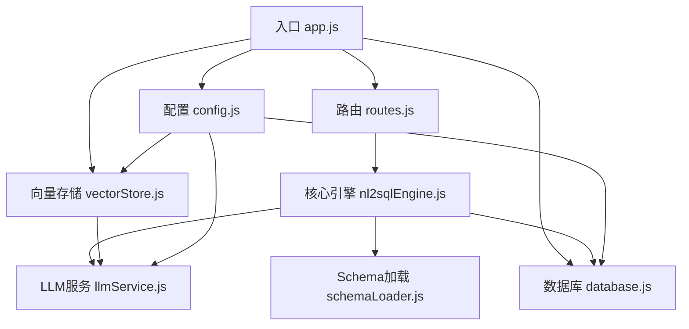
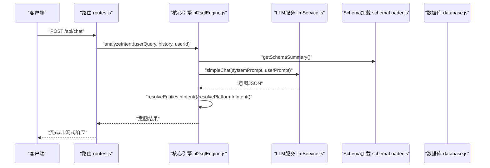
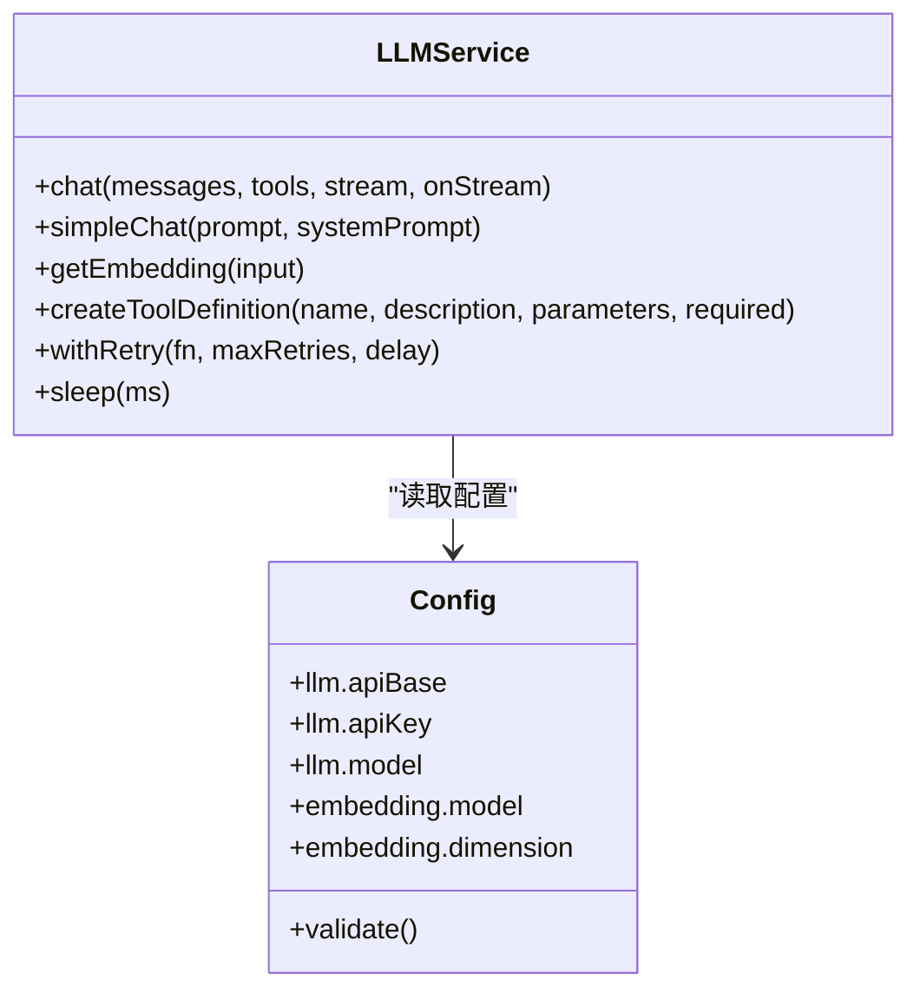
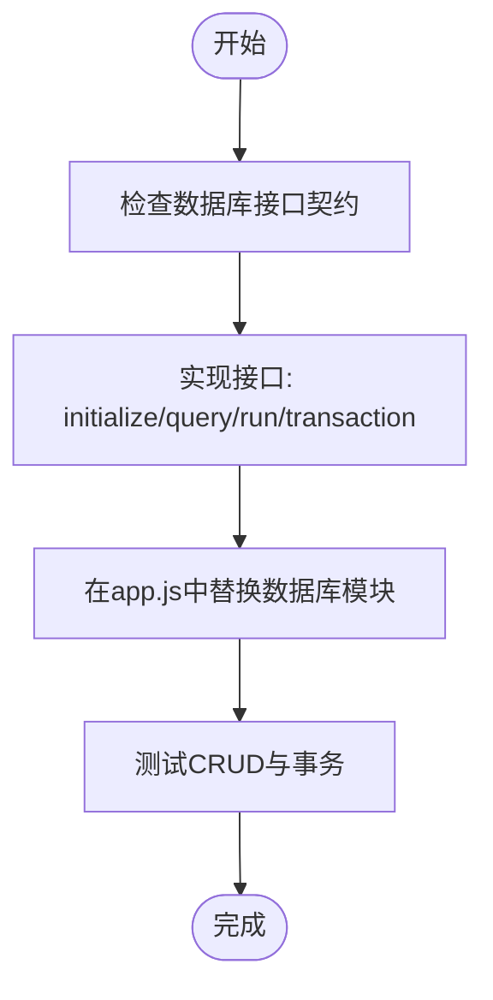
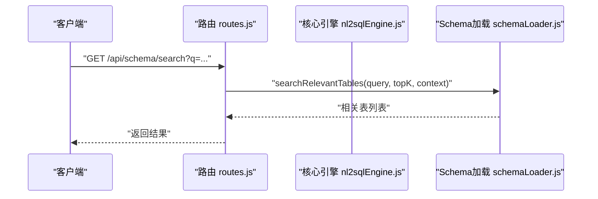
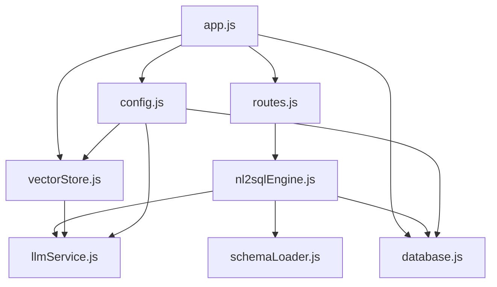

# 扩展开发

<cite>
**本文引用的文件**
- [backend/src/app.js](file://backend/src/app.js)
- [backend/src/core/config.js](file://backend/src/core/config.js)
- [backend/src/core/database.js](file://backend/src/core/database.js)
- [backend/src/core/llmService.js](file://backend/src/core/llmService.js)
- [backend/src/core/nl2sqlEngine.js](file://backend/src/core/nl2sqlEngine.js)
- [backend/src/core/routes.js](file://backend/src/core/routes.js)
- [backend/src/core/schemaLoader.js](file://backend/src/core/schemaLoader.js)
- [backend/src/memory/vectorStore.js](file://backend/src/memory/vectorStore.js)
- [backend/src/utils/logger.js](file://backend/src/utils/logger.js)
- [backend/package.json](file://backend/package.json)
- [backend/config/schema-metadata.json](file://backend/config/schema-metadata.json)
</cite>

## 目录
1. [简介](#简介)
2. [项目结构](#项目结构)
3. [核心组件](#核心组件)
4. [架构总览](#架构总览)
5. [详细组件分析](#详细组件分析)
6. [依赖分析](#依赖分析)
7. [性能考量](#性能考量)
8. [故障排查指南](#故障排查指南)
9. [结论](#结论)
10. [附录](#附录)

## 简介
本指南面向NL2SQL项目的扩展开发者，系统阐述扩展开发框架与扩展点设计，涵盖自定义LLM集成、数据库适配器扩展、功能模块扩展流程、工具函数开发、第三方服务集成策略、测试与验证方法、发布与版本管理建议，以及向后兼容性与API稳定性考虑。目标是帮助你在不破坏现有架构的前提下，安全、可维护地扩展系统能力。

## 项目结构
后端采用模块化分层设计：
- 入口与生命周期：app.js负责启动、初始化、优雅关闭
- 配置中心：config.js集中管理所有配置项
- 路由层：routes.js定义REST API端点
- 核心引擎：nl2sqlEngine.js实现意图识别、实体解析、SQL生成与验证
- LLM服务：llmService.js封装LLM与Embedding调用
- 数据层：database.js管理SQLite会话与查询历史
- 向量存储：vectorStore.js基于LanceDB实现Schema与查询向量化
- Schema元数据：schemaLoader.js加载与向量化Schema
- 工具与日志：logger.js提供统一日志

**图表来源**
- [backend/src/app.js:1-238](file://backend/src/app.js#L1-L238)
- [backend/src/core/routes.js:1-895](file://backend/src/core/routes.js#L1-L895)
- [backend/src/core/nl2sqlEngine.js:1-1773](file://backend/src/core/nl2sqlEngine.js#L1-L1773)
- [backend/src/core/llmService.js:1-432](file://backend/src/core/llmService.js#L1-L432)
- [backend/src/core/schemaLoader.js:1-732](file://backend/src/core/schemaLoader.js#L1-L732)
- [backend/src/core/database.js:1-850](file://backend/src/core/database.js#L1-L850)
- [backend/src/memory/vectorStore.js:1-442](file://backend/src/memory/vectorStore.js#L1-L442)

**章节来源**
- [backend/src/app.js:1-238](file://backend/src/app.js#L1-L238)
- [backend/src/core/config.js:1-332](file://backend/src/core/config.js#L1-L332)
- [backend/src/core/routes.js:1-895](file://backend/src/core/routes.js#L1-L895)

## 核心组件
- 配置管理：集中读取环境变量，提供默认值与校验，支持LLM、Embedding、数据库、安全、会话、日志、Schema、长期记忆等配置域
- LLM服务：封装HTTP请求、重试、超时、流式响应、Embedding获取、工具定义辅助
- 核心引擎：意图识别、实体解析、平台术语解析、SQL生成与验证、置信度与澄清机制
- Schema加载：加载JSON元数据、构建映射、缓存、向量化、语义搜索、SQL安全校验
- 数据库：SQLite会话与查询历史持久化，事务、索引、迁移
- 向量存储：LanceDB表管理、Schema与查询向量增删查、统计
- 路由：健康检查、Schema查询、会话管理、查询历史、用户偏好、统计、配置导出
- 日志：统一日志级别、控制台与文件输出、轮转

**章节来源**
- [backend/src/core/config.js:1-332](file://backend/src/core/config.js#L1-L332)
- [backend/src/core/llmService.js:1-432](file://backend/src/core/llmService.js#L1-L432)
- [backend/src/core/nl2sqlEngine.js:1-1773](file://backend/src/core/nl2sqlEngine.js#L1-L1773)
- [backend/src/core/schemaLoader.js:1-732](file://backend/src/core/schemaLoader.js#L1-L732)
- [backend/src/core/database.js:1-850](file://backend/src/core/database.js#L1-L850)
- [backend/src/memory/vectorStore.js:1-442](file://backend/src/memory/vectorStore.js#L1-L442)
- [backend/src/core/routes.js:1-895](file://backend/src/core/routes.js#L1-L895)
- [backend/src/utils/logger.js:1-318](file://backend/src/utils/logger.js#L1-L318)

## 架构总览
系统采用“配置驱动 + 插件化扩展”的思想：
- 配置域扩展：在config.js中新增配置项，通过环境变量注入，无需修改核心代码
- LLM适配：llmService.js抽象LLM与Embedding调用，支持任意兼容OpenAI风格的API
- 数据库适配：database.js提供统一接口，可替换为其他数据库驱动（需实现相同接口）
- 功能扩展：通过路由扩展API端点，通过核心引擎扩展意图识别与SQL生成逻辑
- 工具扩展：通过工具函数与中间件扩展日志、安全、限流等横切能力

**图表来源**
- [backend/src/core/routes.js:1-895](file://backend/src/core/routes.js#L1-L895)
- [backend/src/core/nl2sqlEngine.js:1-1773](file://backend/src/core/nl2sqlEngine.js#L1-L1773)
- [backend/src/core/llmService.js:1-432](file://backend/src/core/llmService.js#L1-L432)
- [backend/src/core/schemaLoader.js:1-732](file://backend/src/core/schemaLoader.js#L1-L732)

## 详细组件分析

### LLM服务扩展（自定义LLM集成）
- 扩展点
  - llmService.js提供chat/simpleChat/getEmbedding/withRetry等接口，支持任意兼容OpenAI风格的API
  - config.js的llm与embedding配置域支持切换模型、超时、重试等
- 开发步骤
  - 在config.js新增配置项（如apiBase、model、apiKey等）
  - 在llmService.js中根据新LLM的响应格式调整解析逻辑（如choices[0].message.content）
  - 如需流式响应，确保新LLM支持并实现onStream回调
  - 如需工具调用，使用createToolDefinition构造工具定义
- 配置管理
  - 通过环境变量注入，避免硬编码
  - validateConfig确保关键配置存在

**图表来源**
- [backend/src/core/llmService.js:1-432](file://backend/src/core/llmService.js#L1-L432)
- [backend/src/core/config.js:1-332](file://backend/src/core/config.js#L1-L332)

**章节来源**
- [backend/src/core/llmService.js:1-432](file://backend/src/core/llmService.js#L1-L432)
- [backend/src/core/config.js:1-332](file://backend/src/core/config.js#L1-L332)

### 数据库适配器扩展（新数据库类型集成）
- 扩展点
  - database.js提供统一接口：initialize、query/queryOne/run/transaction、会话与偏好操作
  - 通过config.js的srDatabase.pool配置连接池参数
- 开发步骤
  - 实现与database.js相同的接口契约（initialize、query、run、transaction等）
  - 在app.js初始化流程中替换或扩展数据库模块
  - 在schemaLoader.js中根据新数据库方言调整SQL安全校验与表/字段解析
- 注意事项
  - 保持事务一致性与错误处理
  - 确保SQL白名单与禁止关键字策略在新数据库上有效

**图表来源**
- [backend/src/core/database.js:1-850](file://backend/src/core/database.js#L1-L850)
- [backend/src/core/config.js:115-130](file://backend/src/core/config.js#L115-L130)

**章节来源**
- [backend/src/core/database.js:1-850](file://backend/src/core/database.js#L1-L850)
- [backend/src/core/config.js:115-130](file://backend/src/core/config.js#L115-L130)

### 功能模块扩展（意图识别与SQL生成）
- 扩展点
  - nl2sqlEngine.js的analyzeIntent/mergeIntent/updateIntentWithLLM为核心扩展点
  - schemaLoader.js提供Schema摘要、向量化搜索、SQL安全校验
- 开发步骤
  - 在analyzeIntent中扩展systemPrompt，加入新领域知识或业务规则
  - 通过resolveEntitiesInIntent/resolvePlatformInIntent扩展实体与平台映射
  - 在schemaLoader.js中扩展searchRelevantTables，支持新上下文（如datasource/gameId）
  - 通过routes.js新增API端点，暴露新功能
- 最佳实践
  - 保持意图识别与SQL生成分离，便于测试与演进
  - 使用置信度与澄清机制，避免错误SQL生成

**图表来源**
- [backend/src/core/routes.js:216-248](file://backend/src/core/routes.js#L216-L248)
- [backend/src/core/schemaLoader.js:420-507](file://backend/src/core/schemaLoader.js#L420-L507)

**章节来源**
- [backend/src/core/nl2sqlEngine.js:394-800](file://backend/src/core/nl2sqlEngine.js#L394-L800)
- [backend/src/core/schemaLoader.js:420-507](file://backend/src/core/schemaLoader.js#L420-L507)
- [backend/src/core/routes.js:216-248](file://backend/src/core/routes.js#L216-L248)

### 工具函数开发（日志、中间件、工具）
- 日志工具
  - logger.js提供统一日志级别、控制台/文件输出、轮转
  - 扩展：新增日志通道、结构化元数据、事件监听
- 中间件
  - routes.js中使用中间件进行请求日志、权限校验、速率限制
  - 扩展：新增自定义中间件，如审计日志、链路追踪
- 工具函数
  - llmService.js提供withRetry/sleep/createToolDefinition等工具
  - 扩展：新增HTTP工具、序列化/反序列化、加密/解密

**章节来源**
- [backend/src/utils/logger.js:1-318](file://backend/src/utils/logger.js#L1-L318)
- [backend/src/core/routes.js:44-52](file://backend/src/core/routes.js#L44-L52)
- [backend/src/core/llmService.js:167-206](file://backend/src/core/llmService.js#L167-L206)

### 第三方服务集成（策略与实现）
- 策略
  - 通过config.js集中配置第三方服务（如鉴权、埋点、监控）
  - 在app.js初始化阶段统一加载与校验
  - 在核心模块中以依赖注入的方式使用第三方服务
- 实现模式
  - 适配器模式：为第三方SDK封装统一接口
  - 装饰器模式：在现有流程中注入新能力（如埋点、审计）
  - 事件驱动：通过logger事件与其他模块解耦协作

**章节来源**
- [backend/src/core/config.js:1-332](file://backend/src/core/config.js#L1-L332)
- [backend/src/app.js:97-166](file://backend/src/app.js#L97-L166)
- [backend/src/utils/logger.js:1-318](file://backend/src/utils/logger.js#L1-L318)

### 扩展模块测试与验证
- 单元测试
  - 针对llmService.js的HTTP封装、重试与超时
  - 针对database.js的CRUD与事务
  - 针对schemaLoader.js的向量化与搜索
- 集成测试
  - 端到端场景：analyzeIntent -> SQL生成 -> 安全校验 -> 执行（dry-run）
  - 负载测试：大查询、并发请求、慢查询阈值
- 验证清单
  - 配置项存在性与默认值
  - LLM响应格式与错误处理
  - 向量数据库初始化与查询
  - 日志级别与文件轮转
  - 健康检查与SSE连接数

**章节来源**
- [backend/src/core/llmService.js:158-195](file://backend/src/core/llmService.js#L158-L195)
- [backend/src/core/database.js:200-261](file://backend/src/core/database.js#L200-L261)
- [backend/src/core/schemaLoader.js:69-122](file://backend/src/core/schemaLoader.js#L69-L122)
- [backend/src/core/routes.js:98-135](file://backend/src/core/routes.js#L98-L135)

### 扩展发布与版本管理
- 版本策略
  - 语义化版本：PATCH（修复）、MINOR（兼容功能）、MAJOR（破坏性变更）
  - 配置向后兼容：新增配置项不改变默认行为
- 发布流程
  - package.json脚本：dev/start
  - Docker镜像：基于Node LTS（>=18）
  - CI/CD：静态检查、单元测试、集成测试
- 部署建议
  - 环境变量隔离：开发/测试/生产
  - 配置热加载：对非敏感配置支持重启生效

**章节来源**
- [backend/package.json:1-28](file://backend/package.json#L1-L28)
- [backend/src/core/config.js:1-332](file://backend/src/core/config.js#L1-L332)

### 向后兼容性与API稳定性
- API稳定性
  - 路由版本化：/api/v1/...
  - 响应结构标准化：统一字段与错误码
  - 逐步弃用：提供过渡期与迁移指南
- 向后兼容
  - 配置默认值：新增配置项提供合理默认
  - Schema缓存：enableCache与cacheExpireTime
  - SQL白名单与禁止关键字：保护数据库安全
- 最佳实践
  - 扩展点清晰：接口契约稳定
  - 文档同步：变更及时更新
  - 回滚策略：配置开关与降级方案

**章节来源**
- [backend/src/core/routes.js:782-800](file://backend/src/core/routes.js#L782-L800)
- [backend/src/core/config.js:235-245](file://backend/src/core/config.js#L235-L245)
- [backend/src/core/schemaLoader.js:560-606](file://backend/src/core/schemaLoader.js#L560-L606)

## 依赖分析
- 模块耦合
  - app.js依赖config、database、vectorStore、routes、selfRepair
  - nl2sqlEngine.js依赖llmService、schemaLoader、database
  - routes.js依赖config、schemaLoader、database、sseHandler
- 外部依赖
  - Express、sqlite3、vectordb、dotenv、cors、body-parser、uuid、dayjs、node-cron
- 依赖可视化

**图表来源**
- [backend/src/app.js:1-238](file://backend/src/app.js#L1-L238)
- [backend/src/core/routes.js:1-895](file://backend/src/core/routes.js#L1-L895)
- [backend/src/core/nl2sqlEngine.js:1-1773](file://backend/src/core/nl2sqlEngine.js#L1-L1773)
- [backend/src/core/llmService.js:1-432](file://backend/src/core/llmService.js#L1-L432)
- [backend/src/core/schemaLoader.js:1-732](file://backend/src/core/schemaLoader.js#L1-L732)
- [backend/src/core/database.js:1-850](file://backend/src/core/database.js#L1-L850)
- [backend/src/memory/vectorStore.js:1-442](file://backend/src/memory/vectorStore.js#L1-L442)

**章节来源**
- [backend/src/app.js:1-238](file://backend/src/app.js#L1-L238)
- [backend/src/core/routes.js:1-895](file://backend/src/core/routes.js#L1-L895)

## 性能考量
- LLM调用
  - 超时与重试：config.llm.timeout/maxRetries/retryDelay
  - 流式响应：减少首字节延迟
- 向量检索
  - 向量维度与模型：config.embedding.dimension/model
  - 批量Embedding：schemaLoader.js分批处理
- 数据库
  - 连接池：config.srDatabase.pool
  - 索引与查询限制：maxQueryRows/queryTimeout
- 日志
  - 文件轮转与级别：config.log.maxSize/maxFiles/log.level

**章节来源**
- [backend/src/core/config.js:60-87](file://backend/src/core/config.js#L60-L87)
- [backend/src/core/config.js:115-130](file://backend/src/core/config.js#L115-L130)
- [backend/src/core/config.js:195-208](file://backend/src/core/config.js#L195-L208)
- [backend/src/core/schemaLoader.js:256-273](file://backend/src/core/schemaLoader.js#L256-L273)

## 故障排查指南
- 启动失败
  - 检查validateConfig报错与必要配置项
  - 确认数据目录与权限
- LLM调用失败
  - 检查API密钥、超时与重试
  - 查看响应解析与截断日志
- 向量数据库不可用
  - 确认LanceDB初始化与表创建
  - 检查向量维度与模型配置
- 数据库异常
  - 检查SQLite连接与迁移
  - 确认外键约束与事务回滚
- 日志问题
  - 检查日志级别与文件路径
  - 观察轮转与权限

**章节来源**
- [backend/src/core/config.js:300-322](file://backend/src/core/config.js#L300-L322)
- [backend/src/app.js:103-166](file://backend/src/app.js#L103-L166)
- [backend/src/core/llmService.js:75-131](file://backend/src/core/llmService.js#L75-L131)
- [backend/src/memory/vectorStore.js:55-85](file://backend/src/memory/vectorStore.js#L55-L85)
- [backend/src/core/database.js:200-261](file://backend/src/core/database.js#L200-L261)
- [backend/src/utils/logger.js:128-160](file://backend/src/utils/logger.js#L128-L160)

## 结论
通过配置驱动与模块化设计，NL2SQL项目提供了清晰的扩展点。遵循本文的扩展流程、测试与发布建议，可在保证向后兼容与API稳定性的前提下，安全地集成新LLM、新数据库与新功能模块。

## 附录
- 配置项速览
  - LLM：apiBase、apiKey、model、timeout、maxRetries、retryDelay
  - Embedding：model、dimension、timeout
  - 数据库：path（SQLite）、url（业务库）、pool
  - 安全：allowedTables、dryRun、maxQueryRows、queryTimeout、forbiddenKeywords、sensitiveFields
  - 会话：maxHistory、expireTime、cleanupInterval
  - 日志：level、file、console、fileOutput、maxSize、maxFiles
  - 自修复：enabled、dailyCheckCron、sessionCheckInterval、slowQueryThreshold
  - Schema：configPath、enableCache、cacheExpireTime、revectorize
  - 长期记忆：enabled、useLLMForExtraction、thresholds、retention
- Schema元数据
  - schema-metadata.json定义表、字段、关系、指标、维度等

**章节来源**
- [backend/src/core/config.js:16-289](file://backend/src/core/config.js#L16-L289)
- [backend/config/schema-metadata.json:1-800](file://backend/config/schema-metadata.json#L1-L800)