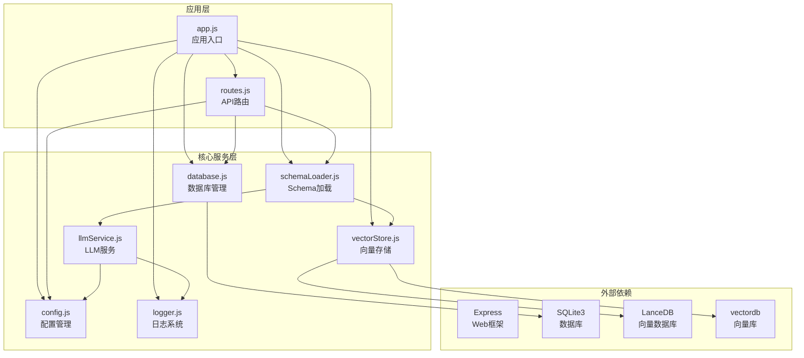
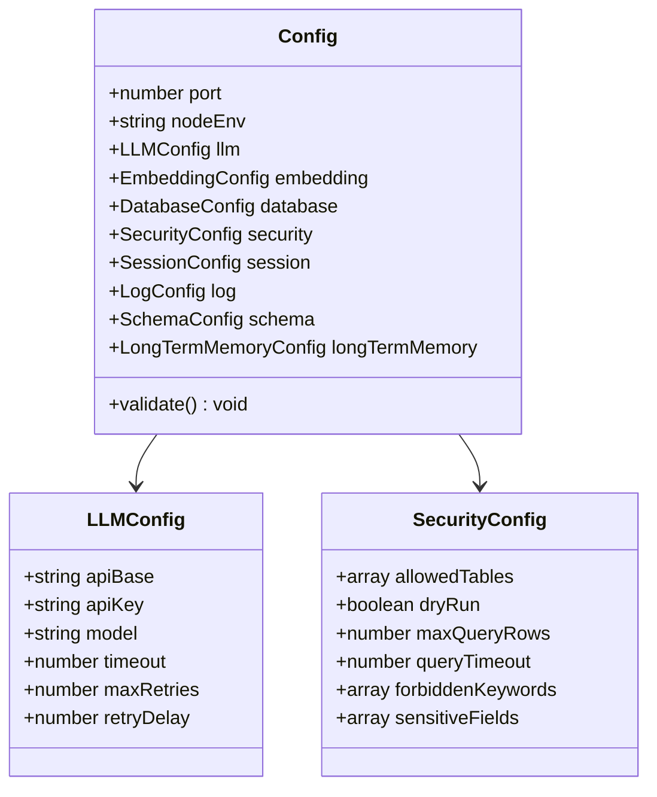
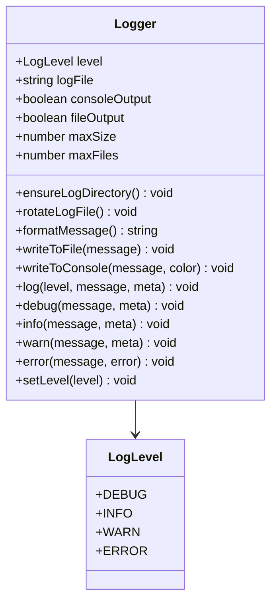
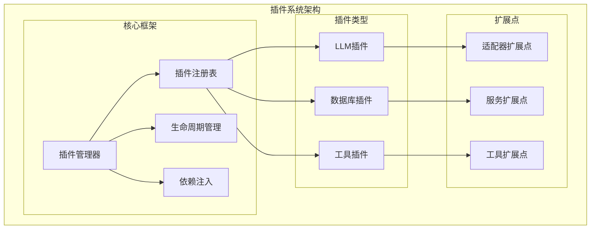
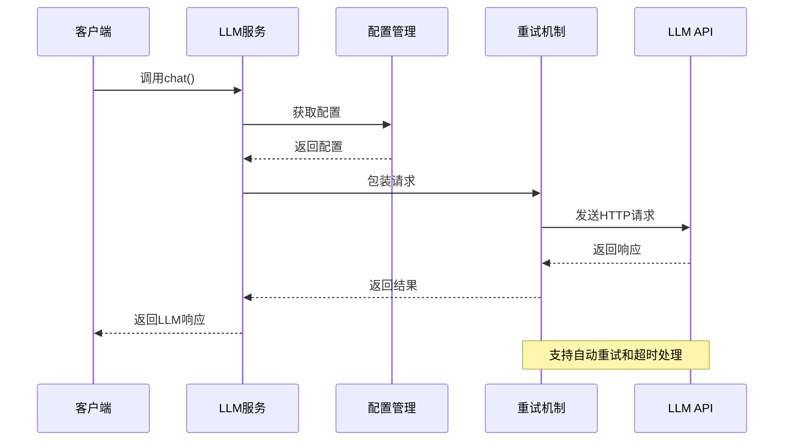
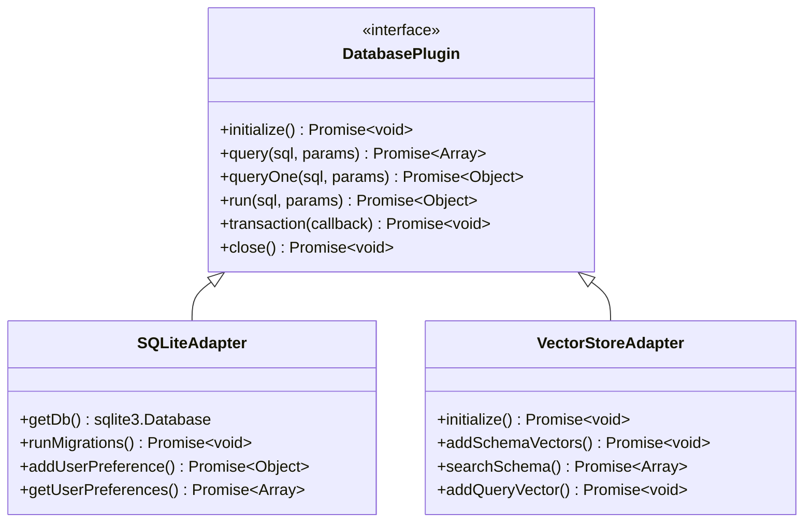
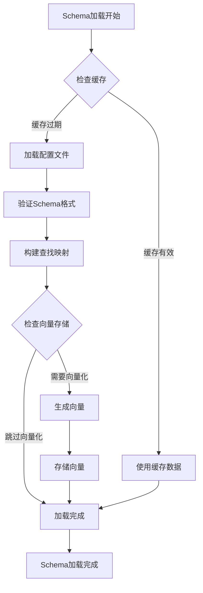
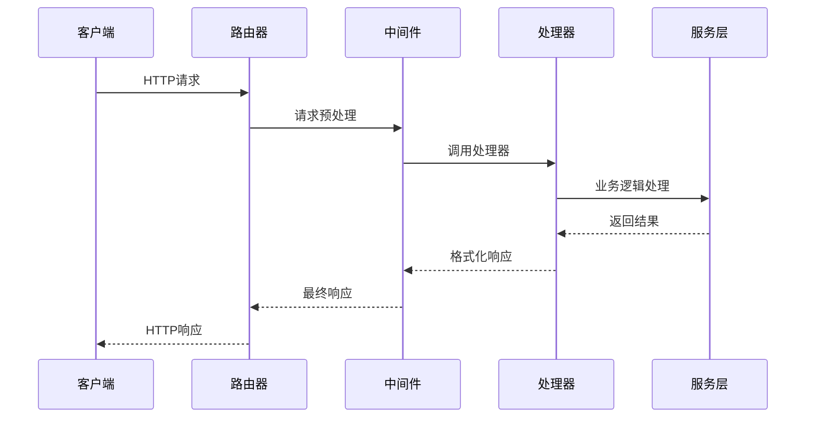
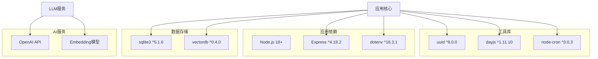
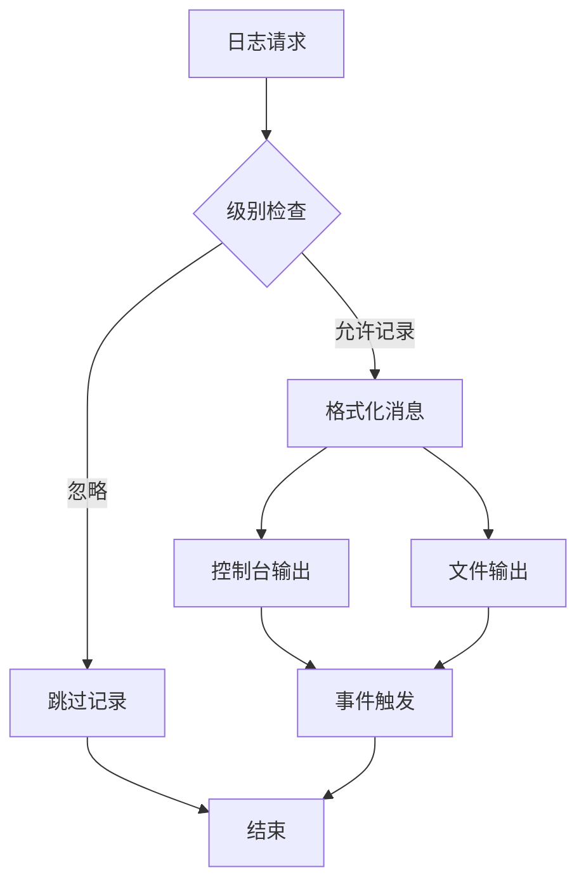

# 插件开发框架

<cite>
**本文档引用的文件**
- [app.js](file://backend/src/app.js)
- [routes.js](file://backend/src/core/routes.js)
- [config.js](file://backend/src/core/config.js)
- [llmService.js](file://backend/src/core/llmService.js)
- [database.js](file://backend/src/core/database.js)
- [schemaLoader.js](file://backend/src/core/schemaLoader.js)
- [vectorStore.js](file://backend/src/memory/vectorStore.js)
- [logger.js](file://backend/src/utils/logger.js)
- [package.json](file://backend/package.json)
</cite>

## 目录
1. [简介](#简介)
2. [项目结构](#项目结构)
3. [核心组件](#核心组件)
4. [架构概览](#架构概览)
5. [详细组件分析](#详细组件分析)
6. [依赖分析](#依赖分析)
7. [性能考虑](#性能考虑)
8. [故障排除指南](#故障排除指南)
9. [结论](#结论)
10. [附录](#附录)

## 简介

NL2SQL项目是一个基于Node.js的自然语言转SQL服务系统，采用模块化架构设计，支持灵活的插件扩展机制。该系统通过统一的配置管理、标准化的接口规范和完善的生命周期管理，为开发者提供了完整的插件开发框架。

插件系统的核心目标是：
- 提供标准化的插件接口规范
- 支持LLM适配器、数据库适配器和工具函数的扩展
- 实现插件的动态注册和生命周期管理
- 确保插件间的松耦合和高内聚

## 项目结构

NL2SQL项目采用清晰的分层架构，主要分为以下几个层次：

**图表来源**
- [app.js:1-238](file://backend/src/app.js#L1-L238)
- [routes.js:1-800](file://backend/src/core/routes.js#L1-L800)
- [config.js:1-332](file://backend/src/core/config.js#L1-L332)

**章节来源**
- [app.js:1-238](file://backend/src/app.js#L1-L238)
- [package.json:1-28](file://backend/package.json#L1-L28)

## 核心组件

### 配置管理系统

配置管理模块是插件系统的核心基础设施，提供了统一的配置访问接口和验证机制。

**图表来源**
- [config.js:16-332](file://backend/src/core/config.js#L16-L332)

### 日志系统

日志系统采用事件驱动的设计模式，支持多级别、多输出目标的日志记录。

**图表来源**
- [logger.js:51-318](file://backend/src/utils/logger.js#L51-L318)

**章节来源**
- [config.js:1-332](file://backend/src/core/config.js#L1-L332)
- [logger.js:1-318](file://backend/src/utils/logger.js#L1-L318)

## 架构概览

NL2SQL插件系统采用模块化架构设计，通过标准化的接口和约定实现插件的动态加载和管理。

**图表来源**
- [app.js:97-166](file://backend/src/app.js#L97-L166)
- [routes.js:44-52](file://backend/src/core/routes.js#L44-L52)

## 详细组件分析

### LLM服务插件

LLM服务模块提供了标准化的接口，支持多种LLM提供商的适配。

**图表来源**
- [llmService.js:222-277](file://backend/src/core/llmService.js#L222-L277)
- [llmService.js:167-195](file://backend/src/core/llmService.js#L167-L195)

#### LLM插件接口规范

LLM插件需要实现以下核心接口：

| 接口名称 | 参数 | 返回值 | 用途 |
|---------|------|--------|------|
| `chat()` | messages, tools, stream, onStream | Promise<Object> | 发送聊天请求 |
| `simpleChat()` | prompt, systemPrompt | Promise<string> | 简单聊天请求 |
| `getEmbedding()` | input | Promise<Array<number>> | 获取向量嵌入 |
| `createToolDefinition()` | name, description, parameters, required | Object | 创建工具定义 |

**章节来源**
- [llmService.js:1-432](file://backend/src/core/llmService.js#L1-L432)

### 数据库插件

数据库模块提供了统一的数据库访问接口，支持多种数据库类型的适配。

**图表来源**
- [database.js:347-445](file://backend/src/core/database.js#L347-L445)
- [vectorStore.js:55-85](file://backend/src/memory/vectorStore.js#L55-L85)

#### 数据库插件扩展点

| 扩展点 | 功能 | 实现要求 |
|-------|------|----------|
| `initialize()` | 初始化数据库连接 | 必须实现连接建立 |
| `query()` | 执行查询操作 | 支持参数化查询 |
| `transaction()` | 事务处理 | 支持ACID特性 |
| `close()` | 关闭连接 | 确保资源释放 |

**章节来源**
- [database.js:1-850](file://backend/src/core/database.js#L1-L850)
- [vectorStore.js:1-442](file://backend/src/memory/vectorStore.js#L1-L442)

### Schema加载插件

Schema加载模块提供了灵活的Schema管理机制，支持动态加载和缓存。

**图表来源**
- [schemaLoader.js:69-122](file://backend/src/core/schemaLoader.js#L69-L122)
- [schemaLoader.js:195-290](file://backend/src/core/schemaLoader.js#L195-L290)

**章节来源**
- [schemaLoader.js:1-732](file://backend/src/core/schemaLoader.js#L1-L732)

### 路由系统插件

路由系统提供了RESTful API的标准化接口，支持插件的API扩展。

**图表来源**
- [routes.js:44-52](file://backend/src/core/routes.js#L44-L52)
- [routes.js:70-92](file://backend/src/core/routes.js#L70-L92)

**章节来源**
- [routes.js:1-800](file://backend/src/core/routes.js#L1-L800)

## 依赖分析

NL2SQL项目的依赖关系体现了清晰的分层架构和模块化设计。

**图表来源**
- [package.json:10-27](file://backend/package.json#L10-L27)

**章节来源**
- [package.json:1-28](file://backend/package.json#L1-L28)

## 性能考虑

### 缓存策略

系统实现了多层次的缓存机制来优化性能：

1. **Schema缓存**：Schema元数据缓存，支持过期时间控制
2. **向量缓存**：向量数据库中的Schema和查询向量缓存
3. **配置缓存**：配置信息的内存缓存

### 异步处理

所有I/O密集型操作都采用异步处理模式：

- 数据库查询使用Promise包装
- 文件系统操作采用异步API
- 网络请求支持超时和重试机制

### 资源管理

系统实现了完善的资源管理机制：

- 数据库连接池管理
- 向量数据库连接管理
- 文件句柄自动清理
- 内存使用监控

## 故障排除指南

### 常见问题诊断

| 问题类型 | 症状 | 诊断方法 | 解决方案 |
|---------|------|----------|----------|
| 配置错误 | 应用启动失败 | 检查.env文件和配置验证 | 验证必需配置项 |
| 数据库连接失败 | SQL操作异常 | 检查数据库路径和权限 | 确认数据库文件存在 |
| LLM API错误 | AI功能不可用 | 检查API密钥和网络连接 | 验证API配置 |
| 向量数据库异常 | 语义搜索失效 | 检查LanceDB初始化 | 重启向量服务 |

### 日志分析

系统提供了详细的日志记录机制：

**图表来源**
- [logger.js:227-245](file://backend/src/utils/logger.js#L227-L245)

**章节来源**
- [logger.js:1-318](file://backend/src/utils/logger.js#L1-L318)

## 结论

NL2SQL项目的插件开发框架展现了现代Node.js应用的最佳实践。通过模块化设计、标准化接口和完善的生命周期管理，系统为插件开发提供了强大的基础设施。

### 核心优势

1. **标准化接口**：统一的插件接口规范，降低集成复杂度
2. **灵活扩展**：支持多种插件类型的动态加载和管理
3. **性能优化**：多层次缓存和异步处理机制
4. **错误处理**：完善的异常处理和恢复机制
5. **可观测性**：全面的日志记录和监控能力

### 发展方向

未来可以在以下方面进一步完善：
- 插件热重载机制
- 插件版本管理
- 插件市场和分发机制
- 更丰富的插件模板和示例

## 附录

### 插件开发最佳实践

#### 配置管理
- 使用统一的配置接口访问环境变量
- 实现配置验证和默认值处理
- 支持配置热更新

#### 错误处理
- 实现标准化的错误类型和消息格式
- 提供详细的错误上下文信息
- 实现优雅的降级策略

#### 性能优化
- 实现适当的缓存策略
- 使用异步处理避免阻塞
- 监控资源使用情况

#### 测试方法
- 单元测试覆盖核心逻辑
- 集成测试验证插件集成
- 性能测试评估插件影响

### 发布和版本管理

#### 版本控制
- 遵循语义化版本控制
- 维护变更日志
- 标记兼容性破坏的变更

#### 发布流程
- 代码审查和质量检查
- 自动化测试套件
- 文档更新和发布说明