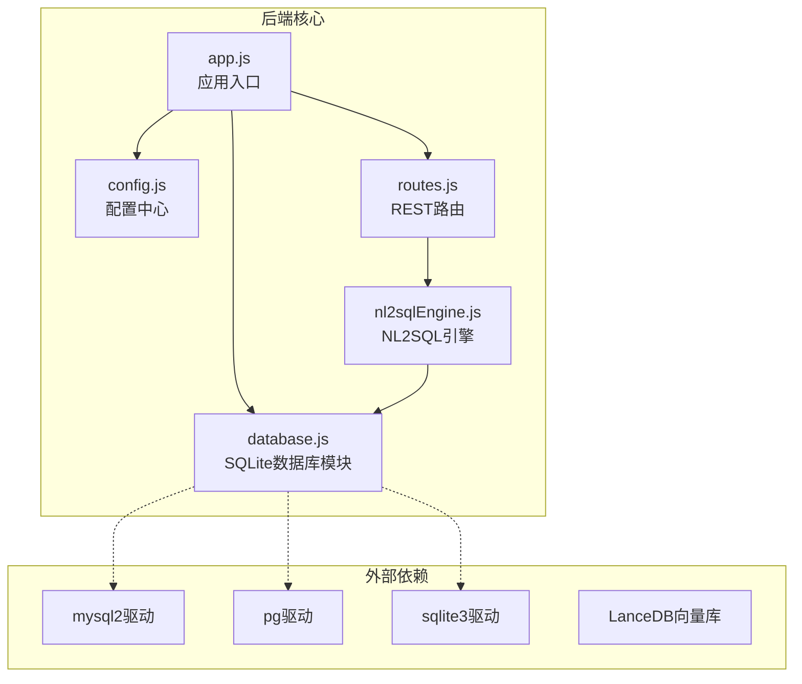
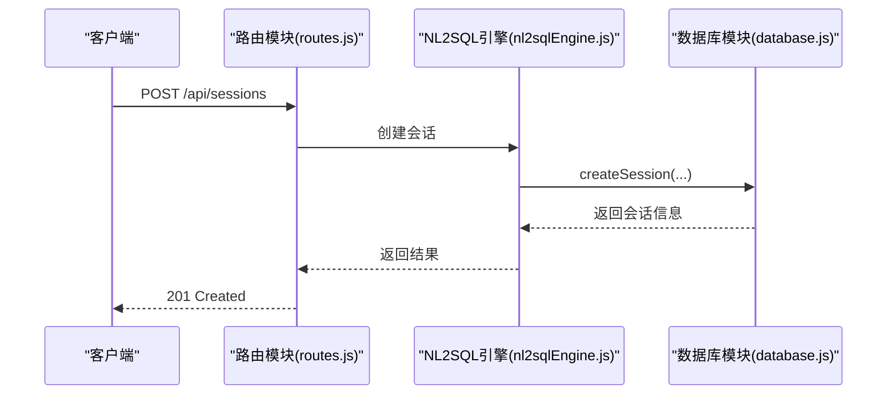
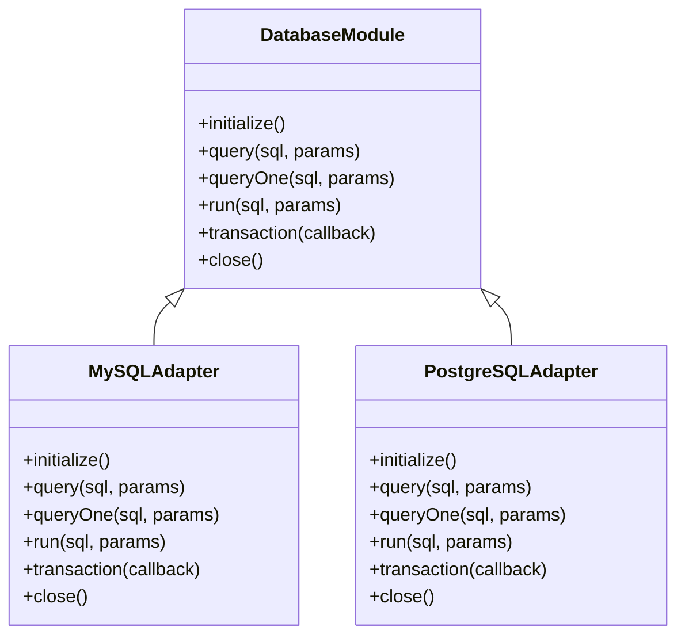
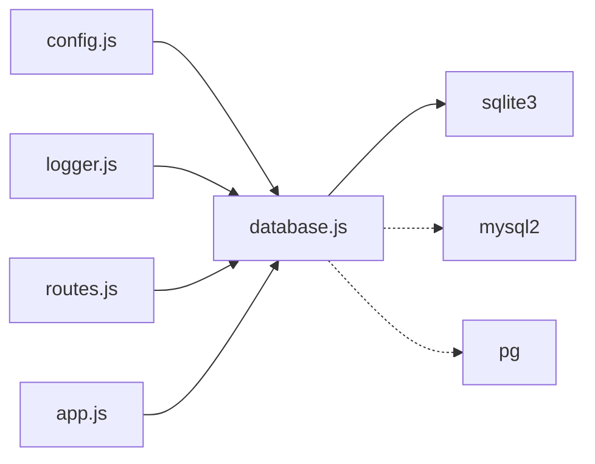

# MySQL和PostgreSQL适配器

<cite>
**本文引用的文件**
- [database.js](file://backend/src/core/database.js)
- [config.js](file://backend/src/core/config.js)
- [app.js](file://backend/src/app.js)
- [routes.js](file://backend/src/core/routes.js)
- [nl2sqlEngine.js](file://backend/src/core/nl2sqlEngine.js)
- [package.json](file://backend/package.json)
</cite>

## 目录
1. [简介](#简介)
2. [项目结构](#项目结构)
3. [核心组件](#核心组件)
4. [架构总览](#架构总览)
5. [详细组件分析](#详细组件分析)
6. [依赖关系分析](#依赖关系分析)
7. [性能考虑](#性能考虑)
8. [故障排查指南](#故障排查指南)
9. [结论](#结论)
10. [附录](#附录)

## 简介
本指南面向NL2SQL项目，目标是在现有SQLite数据库模块基础上，扩展支持MySQL与PostgreSQL数据库。文档将详细说明：
- 如何扩展现有数据库模块以支持MySQL和PostgreSQL
- 不同数据库的连接配置、驱动程序选择和连接池管理
- SQL语法差异与数据类型映射的处理方法
- 数据库迁移脚本的编写指南与版本管理策略
- 事务处理与并发控制在不同数据库中的实现差异
- 性能优化建议与最佳实践

## 项目结构
NL2SQL后端采用模块化设计，核心数据库逻辑集中在SQLite模块，配置集中于配置模块，路由与业务流程通过路由模块串联。整体结构如下：

图表来源
- [app.js:97-166](file://backend/src/app.js#L97-L166)
- [config.js:115-130](file://backend/src/core/config.js#L115-L130)
- [database.js:12-19](file://backend/src/core/database.js#L12-L19)
- [routes.js:24-27](file://backend/src/core/routes.js#L24-L27)
- [nl2sqlEngine.js:24-25](file://backend/src/core/nl2sqlEngine.js#L24-L25)

章节来源
- [app.js:97-166](file://backend/src/app.js#L97-L166)
- [config.js:115-130](file://backend/src/core/config.js#L115-L130)
- [database.js:12-19](file://backend/src/core/database.js#L12-L19)
- [routes.js:24-27](file://backend/src/core/routes.js#L24-L27)
- [nl2sqlEngine.js:24-25](file://backend/src/core/nl2sqlEngine.js#L24-L25)

## 核心组件
- 配置中心：集中管理数据库连接URL、连接池参数、安全限制等。
- 数据库模块：封装SQLite数据库的连接、事务、查询与迁移逻辑。
- 路由模块：对外提供REST API，承载业务流程。
- NL2SQL引擎：负责意图识别、SQL生成、验证与结果格式化。
- 应用入口：负责初始化各模块、启动HTTP服务与优雅关闭。

章节来源
- [config.js:16-130](file://backend/src/core/config.js#L16-L130)
- [database.js:25-261](file://backend/src/core/database.js#L25-L261)
- [routes.js:16-34](file://backend/src/core/routes.js#L16-L34)
- [nl2sqlEngine.js:16-30](file://backend/src/core/nl2sqlEngine.js#L16-L30)
- [app.js:97-166](file://backend/src/app.js#L97-L166)

## 架构总览
NL2SQL的数据库适配遵循“抽象接口 + 具体实现”的模式。现有SQLite模块提供了统一的数据库操作接口（query、queryOne、run、transaction、initialize、close）。扩展MySQL/PostgreSQL时，应在配置中心增加数据库类型与连接参数，并在数据库模块中引入相应的驱动与连接池，同时保持对外接口一致。

图表来源
- [routes.js:264-288](file://backend/src/core/routes.js#L264-L288)
- [nl2sqlEngine.js:42-108](file://backend/src/core/nl2sqlEngine.js#L42-L108)
- [database.js:458-466](file://backend/src/core/database.js#L458-L466)

## 详细组件分析

### 数据库模块（SQLite）现状与扩展要点
- 连接与初始化：使用sqlite3驱动，初始化时启用外键约束并创建表结构。
- 查询与事务：提供query、queryOne、run三种基本操作；transaction封装BEGIN/COMMIT/ROLLBACK。
- 迁移：通过PRAGMA检查与重建表的方式修复旧版约束。
- 关闭：提供close方法以释放连接。

扩展MySQL/PostgreSQL的关键在于：
- 引入mysql2/pg驱动与连接池（如mysql2/pool或pg-pool）。
- 统一接口：保持query、queryOne、run、transaction、initialize、close一致。
- 语法差异：针对LIMIT、日期时间、字符串拼接、JSON函数等差异做适配。
- 连接池参数：min/max、acquireTimeout、idleTimeout等与现有配置保持一致。

图表来源
- [database.js:200-261](file://backend/src/core/database.js#L200-L261)
- [database.js:361-424](file://backend/src/core/database.js#L361-L424)
- [database.js:431-445](file://backend/src/core/database.js#L431-L445)
- [database.js:791-800](file://backend/src/core/database.js#L791-L800)

章节来源
- [database.js:200-261](file://backend/src/core/database.js#L200-L261)
- [database.js:361-424](file://backend/src/core/database.js#L361-L424)
- [database.js:431-445](file://backend/src/core/database.js#L431-L445)
- [database.js:791-800](file://backend/src/core/database.js#L791-L800)

### 配置中心（数据库相关）
- SQLite：通过config.database.path指定数据库文件路径。
- SR数据源数据库：通过config.srDatabase.url指定连接URL（当前示例为mysql://...），并提供pool连接池参数（min、max、acquireTimeout、idleTimeout）。

扩展MySQL/PostgreSQL时：
- 增加数据库类型字段（如type: 'mysql' | 'postgres'）。
- 依据类型选择对应驱动与连接参数。
- 保持pool配置与现有行为一致。

章节来源
- [config.js:97-100](file://backend/src/core/config.js#L97-L100)
- [config.js:115-130](file://backend/src/core/config.js#L115-L130)

### 路由与业务流程
- 路由模块导入database模块，用于会话、消息、偏好等数据的持久化。
- NL2SQL引擎通过database模块进行会话与偏好数据的读写。

扩展数据库适配不影响路由与引擎的调用方式，只需保证接口一致即可。

章节来源
- [routes.js:24-27](file://backend/src/core/routes.js#L24-L27)
- [nl2sqlEngine.js:46-67](file://backend/src/core/nl2sqlEngine.js#L46-L67)

### 应用入口与初始化
- 应用启动时依次初始化数据目录、SQLite数据库、向量数据库、Schema元数据、自修复调度器，然后启动HTTP服务器。
- 优雅关闭时依次关闭SSE、自修复调度器、数据库连接。

章节来源
- [app.js:97-166](file://backend/src/app.js#L97-L166)
- [app.js:176-212](file://backend/src/app.js#L176-L212)

## 依赖关系分析
- 依赖驱动：当前使用sqlite3；扩展时需引入mysql2与pg驱动。
- 依赖关系：database.js依赖config.js与logger；routes.js依赖database.js；app.js依赖database.js与vectorStore等。

图表来源
- [database.js:12-19](file://backend/src/core/database.js#L12-L19)
- [routes.js:24-27](file://backend/src/core/routes.js#L24-L27)
- [app.js:44-46](file://backend/src/app.js#L44-L46)
- [package.json:10-20](file://backend/package.json#L10-L20)

章节来源
- [database.js:12-19](file://backend/src/core/database.js#L12-L19)
- [routes.js:24-27](file://backend/src/core/routes.js#L24-L27)
- [app.js:44-46](file://backend/src/app.js#L44-L46)
- [package.json:10-20](file://backend/package.json#L10-L20)

## 性能考虑
- 连接池参数：根据并发与资源限制调整min、max、acquireTimeout、idleTimeout。
- 查询限制：通过config.security.maxQueryRows限制单次查询返回行数，避免内存压力。
- 索引与查询计划：为常用过滤字段建立索引，避免全表扫描。
- 事务批量：将相关写操作放入事务，减少锁竞争与提交开销。
- 读写分离：在高并发场景下考虑主从复制与只读副本。
- 连接复用：避免频繁创建/销毁连接，合理利用连接池。

## 故障排查指南
- 数据库连接失败：检查config.srDatabase.url与网络连通性；确认驱动已安装。
- 查询超时：检查config.security.queryTimeout与数据库慢查询日志。
- 权限不足：核对数据库用户权限与白名单配置（ALLOWED_TABLES）。
- 迁移失败：查看迁移日志，确认表结构变更是否可逆。
- 事务回滚：确认异常被捕获并回滚，避免脏数据。

章节来源
- [config.js:340-362](file://backend/src/core/config.js#L340-L362)
- [database.js:271-336](file://backend/src/core/database.js#L271-L336)

## 结论
通过在配置中心增加数据库类型与连接参数，并在数据库模块中引入mysql2/pg驱动与连接池，即可在不改变上层调用的前提下，无缝扩展NL2SQL对MySQL与PostgreSQL的支持。关键在于保持接口一致性、处理SQL语法差异与数据类型映射、规范迁移脚本与版本管理，并结合连接池与事务策略提升性能与稳定性。

## 附录

### MySQL/PostgreSQL适配步骤清单
- 在配置中心新增数据库类型与连接参数（type、url、pool）。
- 安装mysql2或pg驱动并在数据库模块中按类型动态加载。
- 统一接口：query、queryOne、run、transaction、initialize、close。
- 语法适配：LIMIT、日期时间、字符串拼接、JSON函数等差异处理。
- 连接池参数：min/max、acquireTimeout、idleTimeout与现有配置一致。
- 迁移脚本：编写版本化迁移脚本，记录版本号与回滚策略。
- 事务与并发：在不同数据库中验证事务隔离级别与死锁处理。
- 性能测试：对比不同驱动与连接池参数下的吞吐与延迟。

### SQL语法与数据类型映射要点
- LIMIT：MySQL使用LIMIT，PostgreSQL使用LIMIT；注意分页边界。
- 日期时间：MySQL与PostgreSQL对CURRENT_TIMESTAMP、日期格式略有差异，需统一处理。
- 字符串拼接：MySQL使用CONCAT，PostgreSQL使用||。
- JSON函数：MySQL使用JSON_EXTRACT/JSON_SET等，PostgreSQL使用->>/->等。
- 数据类型：VARCHAR、TEXT、NUMERIC、TIMESTAMP等在不同数据库中语义相近但细节不同，需统一映射。

### 数据库迁移脚本编写指南
- 版本化：每个迁移脚本包含版本号与描述，按顺序执行。
- 可逆性：尽量提供回滚脚本，或通过备份恢复。
- 幂等性：重复执行不应产生副作用。
- 测试：在测试环境验证迁移脚本，确保数据完整性。
- 发布策略：灰度发布，逐步升级生产环境。

### 事务与并发控制差异
- 隔离级别：MySQL默认可重复读，PostgreSQL默认读已提交；根据业务需求调整。
- 死锁检测：PostgreSQL对死锁检测更积极，MySQL可通过innodb_deadlock_detect控制。
- 乐观锁/悲观锁：根据场景选择合适的并发控制策略。
- 事务边界：将相关写操作放入同一事务，减少冲突概率。