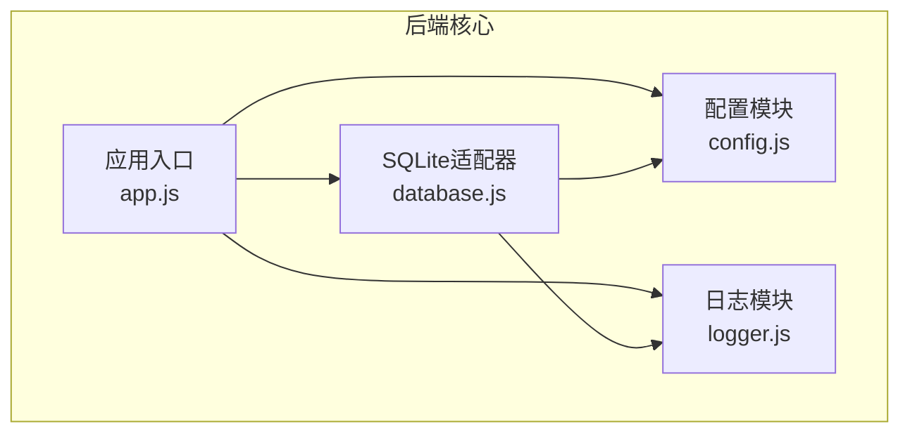
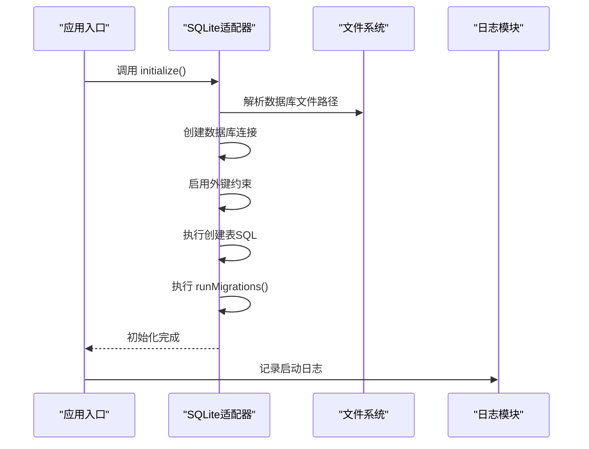
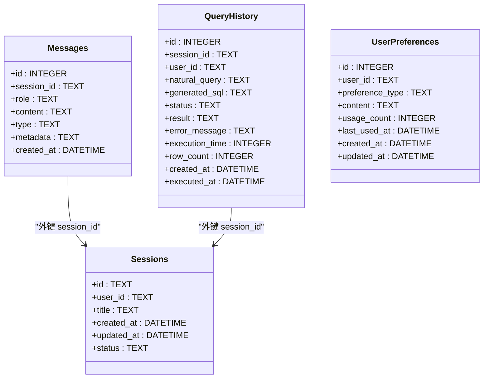
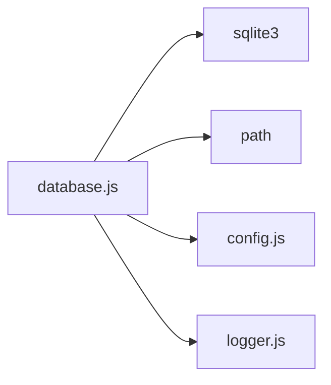

# SQLite适配器

<cite>
**本文引用的文件**
- [database.js](file://backend/src/core/database.js)
- [config.js](file://backend/src/core/config.js)
- [logger.js](file://backend/src/utils/logger.js)
- [app.js](file://backend/src/app.js)
- [package.json](file://backend/package.json)
</cite>

## 目录
1. [简介](#简介)
2. [项目结构](#项目结构)
3. [核心组件](#核心组件)
4. [架构总览](#架构总览)
5. [详细组件分析](#详细组件分析)
6. [依赖关系分析](#依赖关系分析)
7. [性能考量](#性能考量)
8. [故障排查指南](#故障排查指南)
9. [结论](#结论)
10. [附录](#附录)

## 简介
本文件面向NL2SQL项目的SQLite适配器，系统性阐述：
- SQLite数据库初始化流程与表结构设计
- sessions、messages、query_history、user_preferences等核心表的设计理念与字段含义
- 数据库连接管理、事务处理与并发控制机制
- SQL执行方法（query、queryOne、run）的使用示例与最佳实践
- 数据库迁移机制与版本兼容性处理
- 索引优化策略与查询性能调优建议

## 项目结构
NL2SQL后端采用模块化组织，SQLite适配器位于核心模块中，配合配置、日志与应用入口共同完成启动与运行。

图表来源
- [app.js:97-166](file://backend/src/app.js#L97-L166)
- [config.js:97-100](file://backend/src/core/config.js#L97-L100)
- [database.js:12-19](file://backend/src/core/database.js#L12-L19)

章节来源
- [app.js:97-166](file://backend/src/app.js#L97-L166)
- [config.js:97-100](file://backend/src/core/config.js#L97-L100)
- [database.js:12-19](file://backend/src/core/database.js#L12-L19)

## 核心组件
- SQLite数据库管理模块：负责数据库连接、表结构初始化、迁移、事务与SQL执行封装
- 配置模块：集中管理数据库路径等配置项
- 日志模块：统一记录数据库操作与错误信息
- 应用入口：在启动时初始化数据库并对外提供服务

章节来源
- [database.js:25-29](file://backend/src/core/database.js#L25-L29)
- [config.js:97-100](file://backend/src/core/config.js#L97-L100)
- [logger.js:51-80](file://backend/src/utils/logger.js#L51-L80)
- [app.js:118-120](file://backend/src/app.js#L118-L120)

## 架构总览
SQLite适配器在应用启动时完成数据库连接与表结构初始化，随后通过统一的查询与执行接口对外提供能力。迁移逻辑确保旧版本结构的平滑升级。

图表来源
- [app.js:118-120](file://backend/src/app.js#L118-L120)
- [database.js:200-261](file://backend/src/core/database.js#L200-L261)
- [database.js:271-336](file://backend/src/core/database.js#L271-L336)

## 详细组件分析

### 数据库初始化与连接管理
- 初始化流程
  - 解析配置中的数据库路径
  - 创建数据库连接（读写模式）
  - 启用外键约束
  - 执行创建表SQL
  - 执行迁移逻辑
- 连接生命周期
  - 初始化后持有全局连接实例
  - 应用优雅关闭时显式关闭连接

章节来源
- [database.js:200-261](file://backend/src/core/database.js#L200-L261)
- [database.js:800-812](file://backend/src/core/database.js#L800-L812)
- [app.js:204-205](file://backend/src/app.js#L204-L205)

### 表结构设计与索引策略
- sessions（会话表）
  - 主键：id（UUID）
  - 字段：user_id、title、created_at、updated_at、status
  - 索引：idx_sessions_user_id、idx_sessions_status、idx_sessions_updated_at
  - 设计要点：按用户、状态、更新时间建立索引，支撑会话查询与排序
- messages（消息表）
  - 主键：id（自增）
  - 字段：session_id（外键）、role、content、type、metadata、created_at
  - 索引：idx_messages_session_id、idx_messages_created_at
  - 设计要点：外键级联删除保证数据一致性；按会话与时间索引提升查询效率
- query_history（查询历史表）
  - 主键：id（自增）
  - 字段：session_id（外键，SET NULL）、user_id、natural_query、generated_sql、status、result、error_message、execution_time、row_count、created_at、executed_at
  - 索引：idx_query_history_user_id、idx_query_history_session_id、idx_query_history_created_at、idx_query_history_status
  - 设计要点：外键SET NULL处理会话删除；多维索引覆盖用户、会话、时间、状态查询场景
- user_preferences（用户偏好表）
  - 主键：id（自增）
  - 字段：user_id、preference_type、content（JSON）、usage_count、last_used_at、created_at、updated_at
  - 索引：idx_user_preferences_user_id、idx_user_preferences_type、idx_user_prefs_user_type（复合索引）
  - 设计要点：移除UNIQUE约束，允许多条偏好；复合索引加速按用户+类型的查询

章节来源
- [database.js:39-189](file://backend/src/core/database.js#L39-L189)
- [database.js:271-336](file://backend/src/core/database.js#L271-L336)

### 数据库迁移机制与版本兼容
- 迁移目标：修复user_preferences表的UNIQUE约束问题
- 迁移步骤：
  - 检测是否存在UNIQUE索引
  - 若存在，开启事务，创建新表（无UNIQUE约束）
  - 复制旧表数据
  - 删除旧表并重命名新表
  - 重建所需索引
  - 提交事务；若失败则回滚
- 兼容性保障：迁移仅在检测到旧结构时执行，避免重复操作

章节来源
- [database.js:271-336](file://backend/src/core/database.js#L271-L336)

### 事务处理与并发控制
- 事务封装
  - transaction(callback)：自动BEGIN/COMMIT/ROLLBACK
  - 适用于需要原子性的多步操作（如删除会话时先删消息再删会话）
- 并发控制
  - SQLite默认串行化读写；本适配器未引入额外锁机制
  - 建议：对高并发写入场景考虑外部锁或拆分读写库

章节来源
- [database.js:427-445](file://backend/src/core/database.js#L427-L445)
- [database.js:524-532](file://backend/src/core/database.js#L524-L532)

### SQL执行方法与最佳实践
- query(sql, params)
  - 功能：执行查询并返回多行结果
  - 适用：SELECT等读取操作
  - 最佳实践：始终使用参数化查询（params）防止SQL注入
- queryOne(sql, params)
  - 功能：执行查询并返回单行结果
  - 适用：唯一性查询、聚合查询
  - 最佳实践：结合WHERE条件与LIMIT 1
- run(sql, params)
  - 功能：执行非查询语句（INSERT/UPDATE/DELETE/DDL）
  - 返回：lastID（最后插入ID）、changes（影响行数）
  - 最佳实践：用于写入与DDL；错误时记录日志并上抛
- 事务内批量操作
  - 使用transaction(callback)包裹多个run调用，确保原子性

章节来源
- [database.js:361-424](file://backend/src/core/database.js#L361-L424)
- [database.js:427-445](file://backend/src/core/database.js#L427-L445)

### 会话与消息管理
- 会话管理
  - createSession：创建会话
  - getSession：按ID与状态查询
  - getUserSessions：按用户与状态查询并按更新时间倒序
  - touchSession：更新会话时间
  - updateSessionTitle：更新标题
  - deleteSession：事务删除（先删消息，再删会话）
- 消息管理
  - addMessage：插入消息并更新会话时间
  - getSessionMessages：按会话查询消息并解析metadata JSON

章节来源
- [database.js:458-540](file://backend/src/core/database.js#L458-L540)
- [database.js:555-596](file://backend/src/core/database.js#L555-L596)

### 长期记忆（用户偏好）管理
- 添加偏好：addUserPreference
- 查询偏好：getUserPreferences（支持按类型过滤与排序）
- 使用统计：updatePreferenceUsage（usage_count与last_used_at）
- 常用模板：getTopQueryPatterns
- 字段别名：getFieldAliases（支持按字段名过滤）
- 查找现有偏好：findExistingPreference（基于JSON字段匹配）
- 删除偏好：deleteUserPreference
- 近期使用计数：getRecentPatternCount

章节来源
- [database.js:609-781](file://backend/src/core/database.js#L609-L781)

### 数据模型类图

图表来源
- [database.js:44-189](file://backend/src/core/database.js#L44-L189)

## 依赖关系分析
- sqlite3：底层数据库驱动，提供连接、查询与事务能力
- path：用于解析数据库文件路径
- config：提供数据库路径配置
- logger：统一记录数据库操作与错误

图表来源
- [database.js:12-19](file://backend/src/core/database.js#L12-L19)
- [package.json:10-20](file://backend/package.json#L10-L20)

章节来源
- [database.js:12-19](file://backend/src/core/database.js#L12-L19)
- [package.json:10-20](file://backend/package.json#L10-L20)

## 性能考量
- 索引策略
  - sessions：按user_id、status、updated_at建立索引，满足按用户筛选、状态过滤与时间排序
  - messages：按session_id、created_at建立索引，满足按会话查询与时间排序
  - query_history：按user_id、session_id、created_at、status建立索引，满足用户查询、会话筛选、时间排序与状态过滤
  - user_preferences：按user_id、preference_type及复合索引，满足用户+类型查询与排序
- 查询优化建议
  - 使用参数化查询（params）避免SQL注入与编译开销
  - 对高频查询字段建立索引，避免全表扫描
  - 合理使用LIMIT限制结果集大小
  - 对复杂JSON字段查询（如JSON_EXTRACT）谨慎使用，必要时考虑冗余字段或物化视图
- 事务与并发
  - 对多步写入使用事务，减少锁竞争
  - SQLite默认串行化，高并发写入建议评估拆分或外部锁方案

章节来源
- [database.js:39-189](file://backend/src/core/database.js#L39-L189)
- [database.js:427-445](file://backend/src/core/database.js#L427-L445)

## 故障排查指南
- 初始化失败
  - 检查数据库路径权限与可写性
  - 查看日志模块记录的错误堆栈
- 迁移失败
  - 确认迁移逻辑是否正确执行（事务提交/回滚）
  - 检查user_preferences表结构变化
- 查询异常
  - 确认SQL语法与参数绑定
  - 检查索引是否命中
- 连接泄漏
  - 确认应用优雅关闭时调用close()

章节来源
- [database.js:218-223](file://backend/src/core/database.js#L218-L223)
- [database.js:332-335](file://backend/src/core/database.js#L332-L335)
- [database.js:370-375](file://backend/src/core/database.js#L370-L375)
- [database.js:800-812](file://backend/src/core/database.js#L800-L812)

## 结论
NL2SQL的SQLite适配器以简洁可靠的方式实现了会话、消息、查询历史与用户偏好的持久化存储。通过合理的表结构设计、索引策略与事务封装，满足了日常查询与长期记忆的需求。迁移机制确保了版本演进的平滑过渡。建议在高并发场景下进一步评估锁与拆分策略，并持续监控查询性能与索引命中情况。

## 附录
- 配置项
  - 数据库路径：由配置模块提供，默认路径为相对路径下的数据库文件
- 启动流程
  - 应用启动时先确保数据目录存在，再初始化SQLite数据库

章节来源
- [config.js:97-100](file://backend/src/core/config.js#L97-L100)
- [app.js:107-113](file://backend/src/app.js#L107-L113)
- [app.js:118-120](file://backend/src/app.js#L118-L120)