# 向量数据库适配器

<cite>
**本文档引用的文件**
- [vectorStore.js](file://backend/src/memory/vectorStore.js)
- [config.js](file://backend/src/core/config.js)
- [schemaLoader.js](file://backend/src/core/schemaLoader.js)
- [llmService.js](file://backend/src/core/llmService.js)
- [logger.js](file://backend/src/utils/logger.js)
- [app.js](file://backend/src/app.js)
- [package.json](file://backend/package.json)
- [schema-metadata.example.json](file://backend/config/schema-metadata.example.json)
</cite>

## 目录
1. [简介](#简介)
2. [项目结构](#项目结构)
3. [核心组件](#核心组件)
4. [架构概览](#架构概览)
5. [详细组件分析](#详细组件分析)
6. [数据模型设计](#数据模型设计)
7. [检索实现原理](#检索实现原理)
8. [操作实现详解](#操作实现详解)
9. [与关系型数据库协作](#与关系型数据库协作)
10. [性能优化策略](#性能优化策略)
11. [故障排除指南](#故障排除指南)
12. [结论](#结论)

## 简介

NL2SQL项目的向量数据库适配器基于LanceDB实现了高效的语义检索功能。该适配器为自然语言到SQL转换系统提供了强大的语义理解能力，能够通过向量化技术实现Schema信息和查询历史的智能匹配。

该适配器主要包含两个核心向量表：
- **schema_vectors表**：存储数据库Schema信息的向量表示，用于语义表匹配和字段识别
- **query_vectors表**：存储用户查询历史的向量表示，用于相似查询检索和上下文理解

## 项目结构

向量数据库适配器位于后端项目的memory目录中，采用模块化设计，与其他核心组件紧密集成。

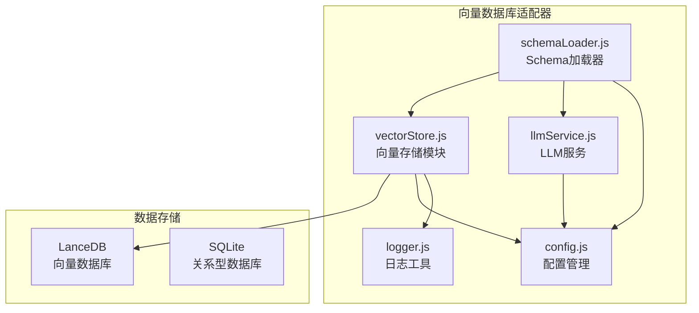

**图表来源**
- [vectorStore.js:1-621](file://backend/src/memory/vectorStore.js#L1-L621)
- [config.js:106-109](file://backend/src/core/config.js#L106-L109)

**章节来源**
- [vectorStore.js:1-621](file://backend/src/memory/vectorStore.js#L1-L621)
- [app.js:45-46](file://backend/src/app.js#L45-L46)

## 核心组件

向量数据库适配器由以下核心组件构成：

### 1. 初始化管理器
负责LanceDB数据库的连接管理和表结构初始化，确保向量存储系统正常运行。

### 2. Schema向量处理器
专门处理数据库Schema信息的向量化存储，包括表定义、字段信息和关系描述。

### 3. 查询向量处理器
管理用户查询历史的向量化存储，支持相似查询的语义检索。

### 4. 元数据增强工具
提供查询类型分类、重要性评分计算和元数据构建功能。

**章节来源**
- [vectorStore.js:229-259](file://backend/src/memory/vectorStore.js#L229-L259)
- [vectorStore.js:334-365](file://backend/src/memory/vectorStore.js#L334-L365)
- [vectorStore.js:419-445](file://backend/src/memory/vectorStore.js#L419-L445)

## 架构概览

向量数据库适配器采用分层架构设计，实现了与LLM服务和Schema管理系统的无缝集成。

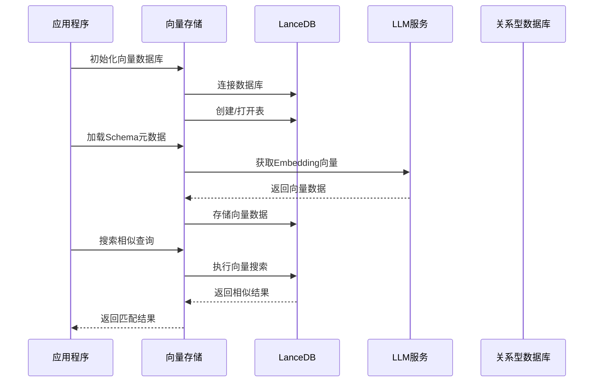

**图表来源**
- [app.js:123-127](file://backend/src/app.js#L123-L127)
- [schemaLoader.js:195-290](file://backend/src/core/schemaLoader.js#L195-L290)
- [vectorStore.js:375-404](file://backend/src/memory/vectorStore.js#L375-L404)

## 详细组件分析

### 向量存储模块架构

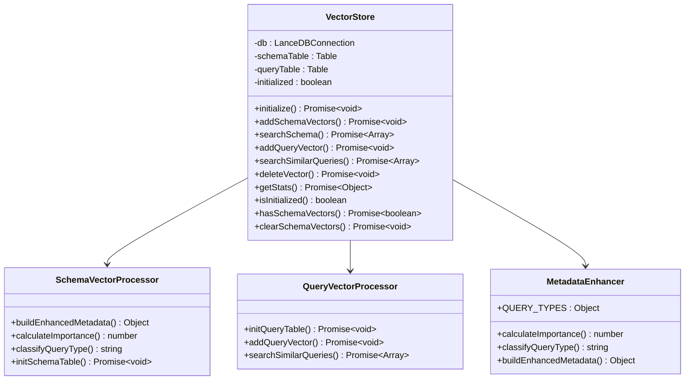

**图表来源**
- [vectorStore.js:202-217](file://backend/src/memory/vectorStore.js#L202-L217)
- [vectorStore.js:25-36](file://backend/src/memory/vectorStore.js#L25-L36)

### 初始化流程

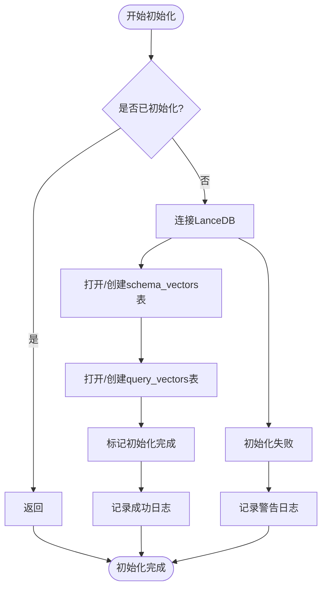

**图表来源**
- [vectorStore.js:229-259](file://backend/src/memory/vectorStore.js#L229-L259)

**章节来源**
- [vectorStore.js:229-259](file://backend/src/memory/vectorStore.js#L229-L259)
- [vectorStore.js:265-320](file://backend/src/memory/vectorStore.js#L265-L320)

## 数据模型设计

### 表结构定义

向量数据库适配器使用LanceDB的表结构来存储向量数据，每个表都有标准化的字段结构。

#### schema_vectors表结构

| 字段名 | 类型 | 描述 | 示例 |
|--------|------|------|------|
| id | string | 唯一标识符 | `schema_1700000000000_0` |
| text | string | 文本内容 | `表名: sales_order 中文名: 销售订单表 描述: 记录所有销售订单的主表...` |
| vector | float[] | 向量数组 | `[0.123, -0.456, 0.789, ...]` |
| metadata | string(JSON) | 元数据信息 | `{"type":"table","name":"sales_order","name_cn":"销售订单表"}` |
| created_at | number | 创建时间戳 | `1700000000000` |

#### query_vectors表结构

| 字段名 | 类型 | 描述 | 示例 |
|--------|------|------|------|
| id | string | 查询ID | `query_1700000000000` |
| text | string | 查询文本 | `如何查询销售订单的总金额？` |
| vector | float[] | 向量数组 | `[0.123, -0.456, 0.789, ...]` |
| metadata | string(JSON) | 元数据信息 | `{"type":"data_query","importanceScore":0.85,"queryType":"data_query"}` |
| created_at | number | 创建时间戳 | `1700000000000` |

### 元数据增强系统

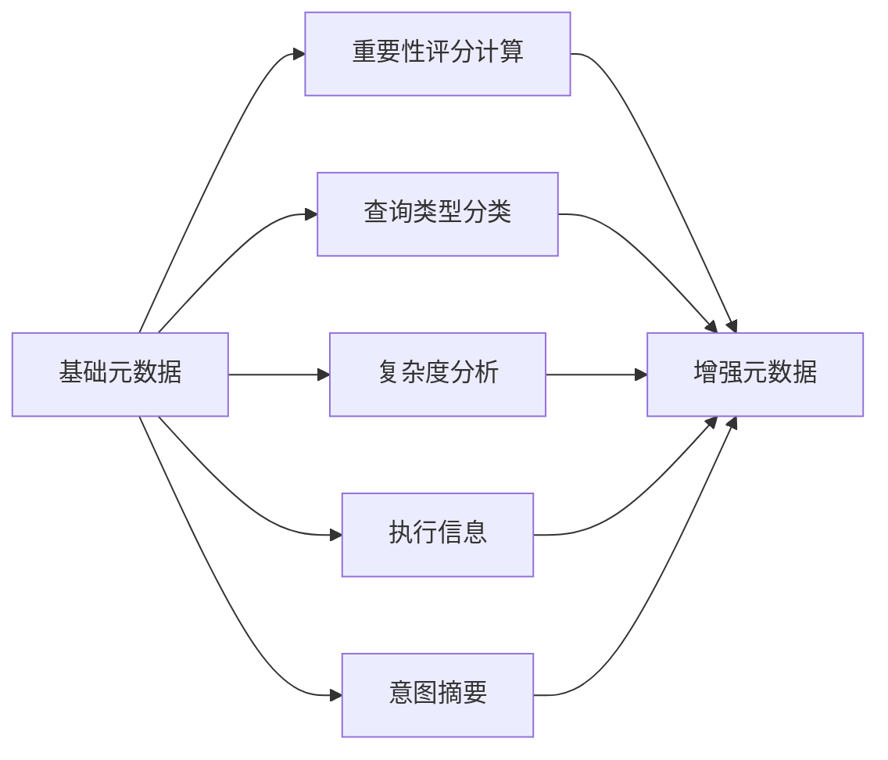

**图表来源**
- [vectorStore.js:137-193](file://backend/src/memory/vectorStore.js#L137-L193)

**章节来源**
- [vectorStore.js:137-193](file://backend/src/memory/vectorStore.js#L137-L193)
- [vectorStore.js:275-286](file://backend/src/memory/vectorStore.js#L275-L286)
- [vectorStore.js:428-434](file://backend/src/memory/vectorStore.js#L428-L434)

## 检索实现原理

### 相似度计算机制

向量数据库适配器使用余弦相似度进行向量相似度计算，通过LanceDB的内置搜索功能实现高效检索。

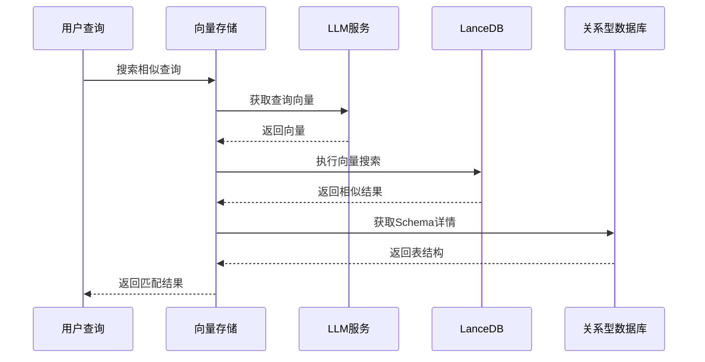

**图表来源**
- [vectorStore.js:375-404](file://backend/src/memory/vectorStore.js#L375-L404)
- [schemaLoader.js:444-507](file://backend/src/core/schemaLoader.js#L444-L507)

### 查询类型分类系统

系统支持多种查询类型的自动分类，每种类型都有特定的处理逻辑：

| 查询类型 | 用途 | 特征 | 示例 |
|----------|------|------|------|
| data_query | 数据查询 | 普通业务查询 | `查询销售额` |
| definition | 定义查询 | 询问概念含义 | `什么是销售额？` |
| comparison | 对比查询 | 多维度对比分析 | `对比两个产品的销量` |
| trend | 趋势查询 | 时间序列分析 | `查看月度销售趋势` |
| clarification | 澄清查询 | 需要澄清的回复 | `能详细说明一下吗？` |
| follow_up | 跟进查询 | 依赖上下文的查询 | `那这个月呢？` |
| new_topic | 新话题查询 | 长查询且置信度高 | `如何分析用户行为？` |

**章节来源**
- [vectorStore.js:28-36](file://backend/src/memory/vectorStore.js#L28-L36)
- [vectorStore.js:89-128](file://backend/src/memory/vectorStore.js#L89-L128)

## 操作实现详解

### Schema向量操作

#### 添加Schema向量

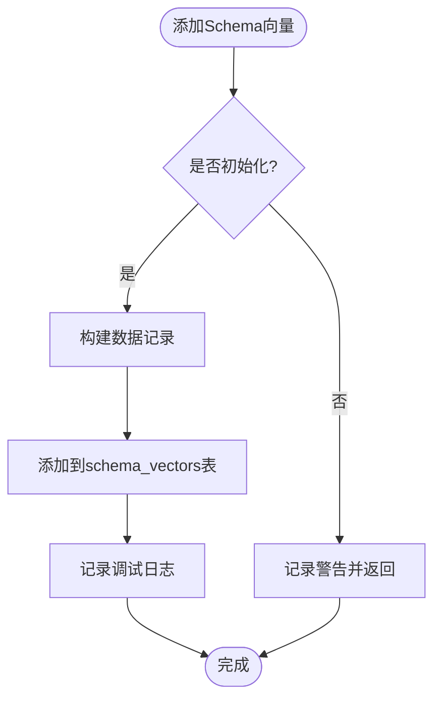

**图表来源**
- [vectorStore.js:334-365](file://backend/src/memory/vectorStore.js#L334-L365)

#### 搜索Schema向量

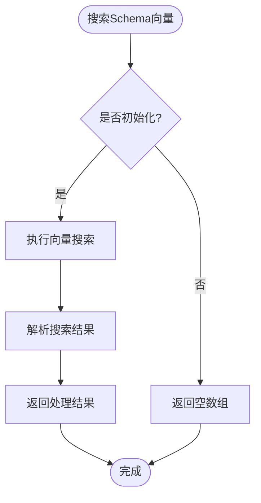

**图表来源**
- [vectorStore.js:375-404](file://backend/src/memory/vectorStore.js#L375-L404)

### 查询历史向量操作

#### 添加查询向量

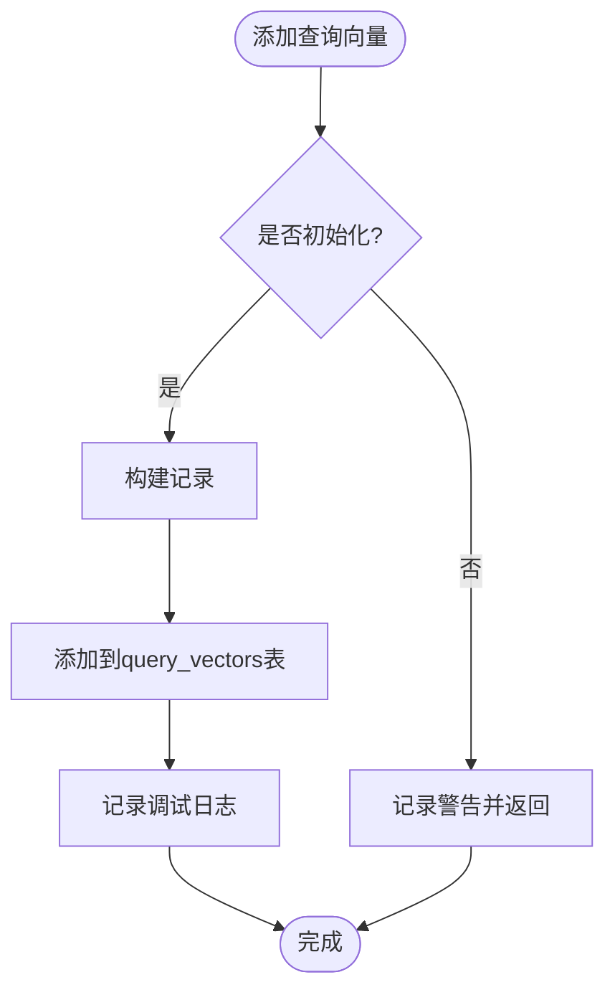

**图表来源**
- [vectorStore.js:419-445](file://backend/src/memory/vectorStore.js#L419-L445)

#### 搜索相似查询

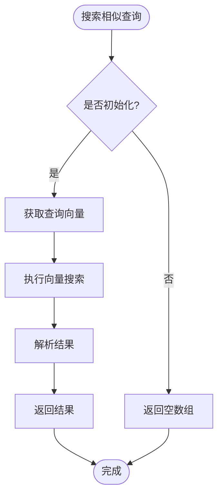

**图表来源**
- [vectorStore.js:455-481](file://backend/src/memory/vectorStore.js#L455-L481)

**章节来源**
- [vectorStore.js:334-481](file://backend/src/memory/vectorStore.js#L334-L481)

## 与关系型数据库协作

### 数据库协作模式

向量数据库适配器与SQLite关系型数据库采用互补协作模式：

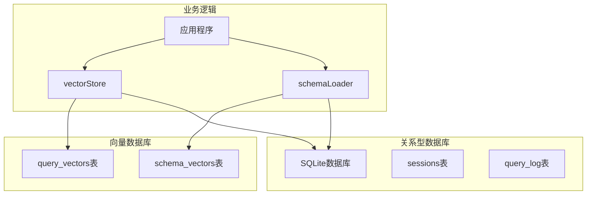

**图表来源**
- [app.js:119-135](file://backend/src/app.js#L119-L135)
- [schemaLoader.js:104-107](file://backend/src/core/schemaLoader.js#L104-L107)

### Schema向量化流程

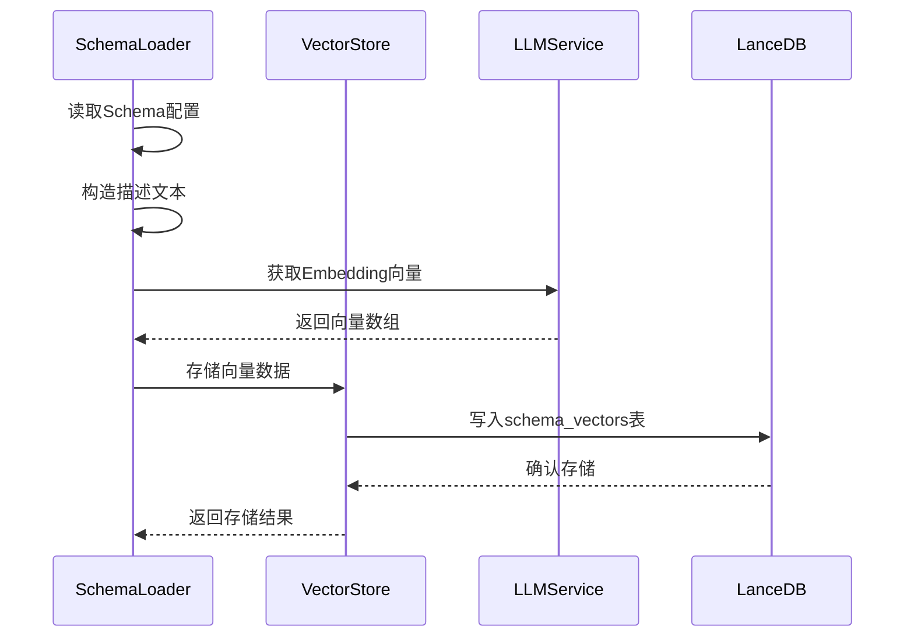

**图表来源**
- [schemaLoader.js:195-290](file://backend/src/core/schemaLoader.js#L195-L290)
- [vectorStore.js:334-365](file://backend/src/memory/vectorStore.js#L334-L365)

**章节来源**
- [schemaLoader.js:195-290](file://backend/src/core/schemaLoader.js#L195-L290)
- [app.js:119-135](file://backend/src/app.js#L119-L135)

## 性能优化策略

### 向量索引优化

向量数据库适配器采用了多项性能优化策略：

#### 批量处理优化
- **批量大小控制**：Embedding向量获取采用20个文本一批的策略，平衡处理速度和稳定性
- **分批处理**：避免单次请求过大导致超时，提高整体处理效率

#### 内存管理优化
- **惰性初始化**：向量数据库仅在需要时才初始化，减少启动时间
- **缓存策略**：Schema向量数据采用缓存机制，避免重复向量化

#### 检索优化
- **Top-K限制**：默认返回5个最相似的结果，可根据需求调整
- **早期过滤**：在语义搜索失败时自动回退到关键词匹配

### 配置优化建议

| 配置项 | 默认值 | 优化建议 | 说明 |
|--------|--------|----------|------|
| EMBEDDING_MODEL | text-embedding-3-small | 根据需求调整 | 不同模型精度和速度不同 |
| EMBEDDING_DIMENSION | 1536 | 与模型匹配 | 确保向量维度一致 |
| VECTOR_DB_PATH | ./data/vectordb | 使用SSD存储 | 提高I/O性能 |
| BATCH_SIZE | 20 | 根据网络状况调整 | 平衡吞吐量和稳定性 |

**章节来源**
- [schemaLoader.js:257-273](file://backend/src/core/schemaLoader.js#L257-L273)
- [config.js:80-87](file://backend/src/core/config.js#L80-L87)

## 故障排除指南

### 常见问题及解决方案

#### 向量数据库初始化失败

**问题症状**：
- 向量搜索功能不可用
- 控制台出现初始化错误日志

**可能原因**：
- LanceDB依赖未正确安装
- 数据库路径权限不足
- 磁盘空间不足

**解决步骤**：
1. 检查LanceDB依赖安装状态
2. 验证数据库目录权限
3. 确认磁盘空间充足
4. 查看详细错误日志

#### 向量搜索结果为空

**问题症状**：
- 语义搜索返回空结果
- Schema匹配功能失效

**可能原因**：
- 向量数据未正确存储
- Embedding向量获取失败
- 查询文本过短

**解决步骤**：
1. 检查向量数据表是否包含有效数据
2. 验证Embedding API配置正确
3. 确认查询文本长度足够
4. 查看向量统计信息

#### 性能问题

**问题症状**：
- 搜索响应时间过长
- 向量化过程耗时过久

**优化措施**：
1. 调整批量处理大小
2. 优化Embedding API配置
3. 检查硬件资源使用情况
4. 实施缓存策略

**章节来源**
- [vectorStore.js:254-258](file://backend/src/memory/vectorStore.js#L254-L258)
- [vectorStore.js:400-403](file://backend/src/memory/vectorStore.js#L400-L403)

## 结论

NL2SQL项目的向量数据库适配器通过LanceDB实现了高效的语义检索功能，为自然语言到SQL转换提供了强大的技术支持。该适配器具有以下特点：

### 技术优势
- **模块化设计**：清晰的组件分离，便于维护和扩展
- **性能优化**：采用批量处理、缓存和早期过滤等优化策略
- **错误处理**：完善的错误处理和日志记录机制
- **配置灵活**：支持多种配置选项，适应不同部署环境

### 应用价值
- **提升用户体验**：通过语义搜索提供更准确的表匹配
- **降低开发成本**：自动化的向量化流程减少人工干预
- **增强系统智能**：支持查询历史的语义理解和推荐

### 发展前景
随着向量数据库技术的不断发展，该适配器还可以进一步优化：
- 支持更多向量索引类型
- 实现增量向量化更新
- 集成更丰富的元数据信息
- 提供更细粒度的查询优化

通过持续的技术改进和优化，向量数据库适配器将继续为NL2SQL系统提供强大的语义理解能力，推动自然语言查询技术的发展。