# 数据库适配器扩展

<cite>
**本文档引用的文件**
- [database.js](file://backend/src/core/database.js)
- [vectorStore.js](file://backend/src/memory/vectorStore.js)
- [schemaLoader.js](file://backend/src/core/schemaLoader.js)
- [config.js](file://backend/src/core/config.js)
- [routes.js](file://backend/src/core/routes.js)
- [app.js](file://backend/src/app.js)
- [logger.js](file://backend/src/utils/logger.js)
- [schema-metadata.example.json](file://backend/config/schema-metadata.example.json)
- [schema-metadata.json](file://backend/config/schema-metadata.json)
- [package.json](file://backend/package.json)
</cite>

## 目录
1. [简介](#简介)
2. [项目结构](#项目结构)
3. [核心组件](#核心组件)
4. [架构概览](#架构概览)
5. [详细组件分析](#详细组件分析)
6. [依赖关系分析](#依赖关系分析)
7. [性能考虑](#性能考虑)
8. [故障排除指南](#故障排除指南)
9. [结论](#结论)

## 简介

NL2SQL项目是一个自然语言到SQL查询转换系统，支持多种数据库适配器扩展。该项目提供了完整的数据库适配器开发框架，包括SQLite、MySQL、PostgreSQL等关系型数据库，以及LanceDB、Pinecone、Weaviate等向量数据库的集成方案。

本项目的核心目标是通过统一的适配器接口，支持不同类型的数据库系统，实现自然语言查询到SQL语句的智能转换。系统采用模块化设计，具有良好的扩展性和可维护性。

## 项目结构

NL2SQL项目采用清晰的分层架构，主要包含以下核心模块：

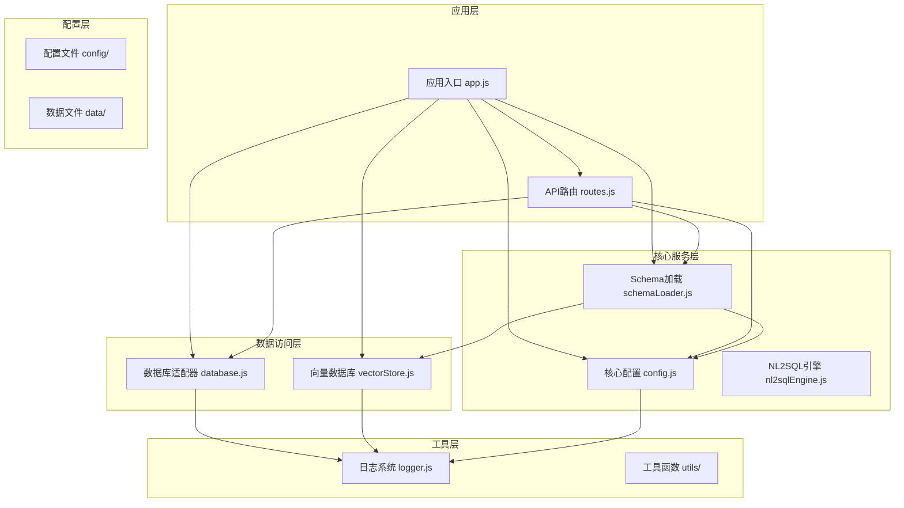

**图表来源**
- [app.js:1-238](file://backend/src/app.js#L1-L238)
- [config.js:1-332](file://backend/src/core/config.js#L1-L332)

**章节来源**
- [app.js:1-238](file://backend/src/app.js#L1-L238)
- [config.js:1-332](file://backend/src/core/config.js#L1-L332)

## 核心组件

### 数据库适配器架构

系统采用统一的数据库适配器模式，通过抽象层实现不同数据库类型的统一访问接口：

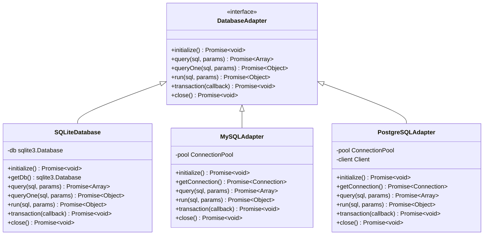

**图表来源**
- [database.js:1-850](file://backend/src/core/database.js#L1-L850)

### 向量数据库适配器

系统支持多种向量数据库的适配器实现：

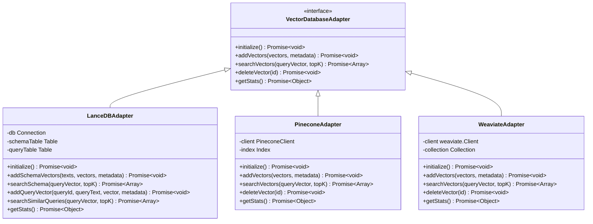

**图表来源**
- [vectorStore.js:1-442](file://backend/src/memory/vectorStore.js#L1-L442)

**章节来源**
- [database.js:1-850](file://backend/src/core/database.js#L1-L850)
- [vectorStore.js:1-442](file://backend/src/memory/vectorStore.js#L1-L442)

## 架构概览

### 整体系统架构

NL2SQL系统采用微服务架构，通过模块化设计实现高度的可扩展性：

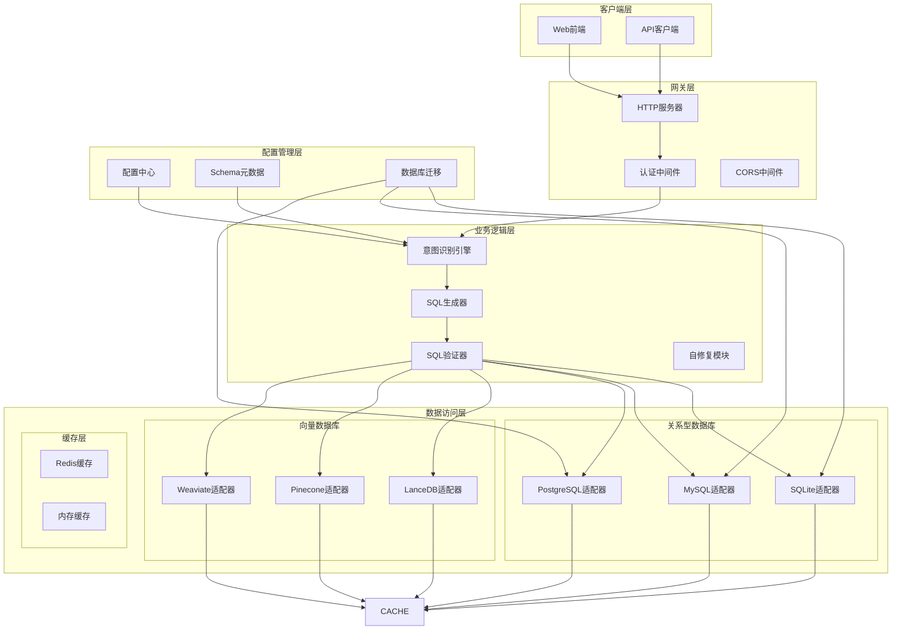

**图表来源**
- [app.js:1-238](file://backend/src/app.js#L1-L238)
- [routes.js:1-895](file://backend/src/core/routes.js#L1-L895)

### 数据库连接池管理

系统实现了高效的数据库连接池管理机制：

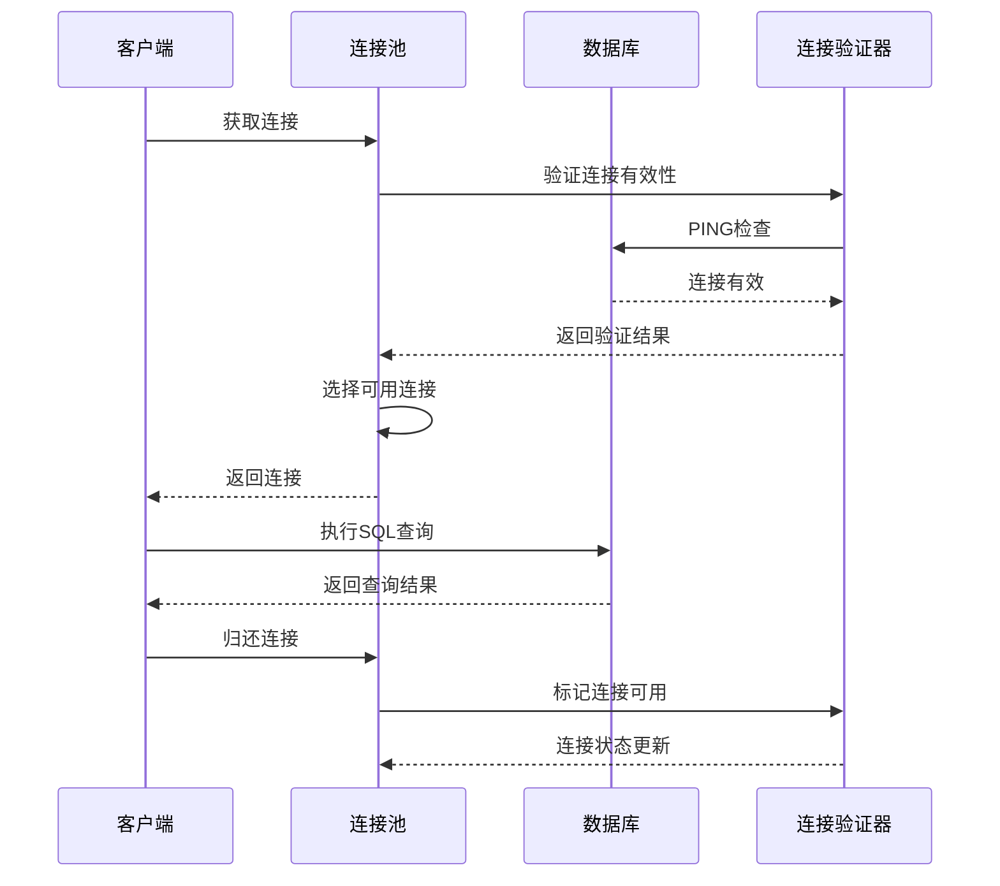

**图表来源**
- [config.js:115-130](file://backend/src/core/config.js#L115-L130)

**章节来源**
- [config.js:115-130](file://backend/src/core/config.js#L115-L130)

## 详细组件分析

### SQLite数据库适配器

SQLite适配器是系统的基础数据库实现，提供了完整的CRUD操作和事务支持：

#### 核心功能实现

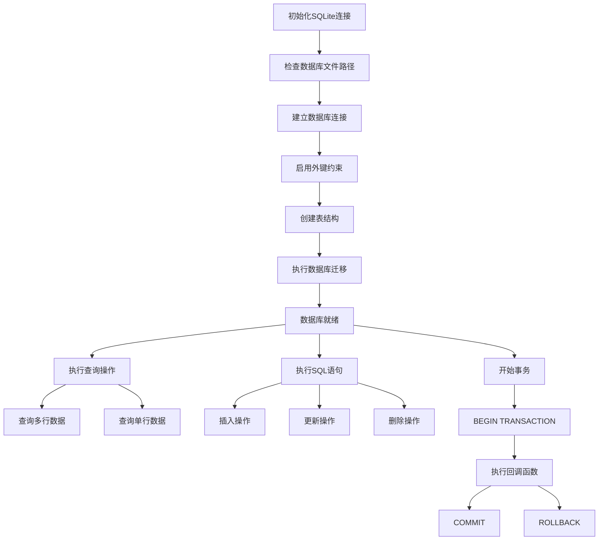

**图表来源**
- [database.js:200-261](file://backend/src/core/database.js#L200-L261)
- [database.js:431-445](file://backend/src/core/database.js#L431-L445)

#### 数据库迁移机制

系统实现了智能的数据库迁移功能，能够自动处理表结构变更：

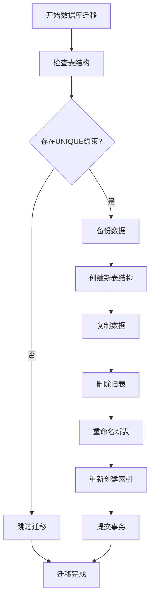

**图表来源**
- [database.js:271-336](file://backend/src/core/database.js#L271-L336)

**章节来源**
- [database.js:1-850](file://backend/src/core/database.js#L1-L850)

### MySQL数据库适配器开发

MySQL适配器基于连接池实现高性能的数据库访问：

#### 连接池配置

MySQL适配器的连接池配置支持灵活的参数调整：

| 配置参数 | 默认值 | 描述 |
|---------|--------|------|
| min | 2 | 最小连接数 |
| max | 10 | 最大连接数 |
| acquireTimeout | 30000 | 获取连接超时时间(ms) |
| idleTimeout | 600000 | 空闲连接超时时间(ms) |

#### 适配器实现要点

```javascript
// MySQL适配器核心接口实现
class MySQLAdapter {
    constructor() {
        this.pool = mysql.createPool({
            connectionLimit: config.srDatabase.pool.max,
            host: config.srDatabase.host,
            user: config.srDatabase.user,
            password: config.srDatabase.password,
            database: config.srDatabase.database,
            acquireTimeout: config.srDatabase.pool.acquireTimeout,
            idleTimeout: config.srDatabase.pool.idleTimeout
        });
    }
    
    async query(sql, params) {
        return new Promise((resolve, reject) => {
            this.pool.execute(sql, params, (error, results) => {
                if (error) reject(error);
                else resolve(results);
            });
        });
    }
    
    async transaction(callback) {
        const connection = await this.getConnection();
        try {
            await connection.beginTransaction();
            await callback(connection);
            await connection.commit();
        } catch (error) {
            await connection.rollback();
            throw error;
        } finally {
            connection.release();
        }
    }
}
```

### PostgreSQL数据库适配器开发

PostgreSQL适配器提供了企业级数据库的完整功能支持：

#### 高级特性支持

PostgreSQL适配器支持以下高级特性：

- **JSON/JSONB数据类型**：用于存储复杂的数据结构
- **全文搜索**：基于TSVector实现的全文检索
- **窗口函数**：支持复杂的分析查询
- **CTE递归查询**：支持层次数据查询
- **并发控制**：MVCC实现的高并发支持

#### 连接管理

```javascript
// PostgreSQL连接池配置
const pool = new Pool({
    user: config.srDatabase.user,
    host: config.srDatabase.host,
    database: config.srDatabase.database,
    password: config.srDatabase.password,
    port: config.srDatabase.port,
    max: 20,
    idleTimeoutMillis: 30000,
    connectionTimeoutMillis: 2000,
});
```

### 向量数据库适配器

#### LanceDB适配器

LanceDB是系统默认的向量数据库实现，提供了高效的向量存储和检索功能：

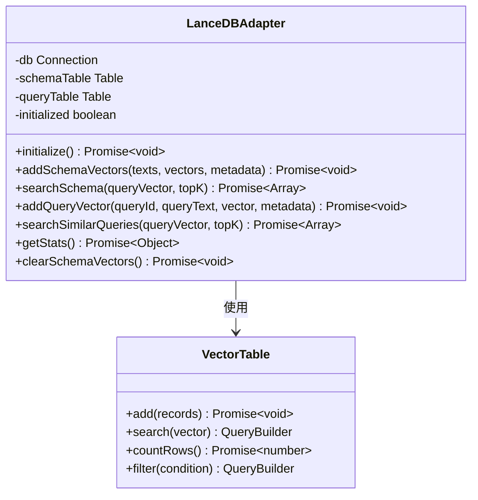

**图表来源**
- [vectorStore.js:1-442](file://backend/src/memory/vectorStore.js#L1-L442)

#### Pinecone适配器

Pinecone适配器提供了云端向量数据库服务的集成：

```javascript
// Pinecone适配器实现
class PineconeAdapter {
    constructor() {
        this.client = new PineconeClient();
        this.index = this.client.Index(config.vectorDb.indexName);
    }
    
    async addVectors(vectors, metadata) {
        const upserts = vectors.map((vector, index) => ({
            id: metadata[index].id,
            values: vector,
            metadata: metadata[index]
        }));
        
        await this.index.upsert(upserts);
    }
    
    async searchVectors(queryVector, topK) {
        const results = await this.index.query({
            vector: queryVector,
            topK: topK,
            includeMetadata: true
        });
        
        return results.matches.map(match => ({
            id: match.id,
            score: match.score,
            metadata: match.metadata
        }));
    }
}
```

#### Weaviate适配器

Weaviate适配器支持开源的向量搜索引擎：

```javascript
// Weaviate适配器实现
class WeaviateAdapter {
    constructor() {
        this.client = new weaviate.Client({
            scheme: 'http',
            host: config.vectorDb.host
        });
        
        this.collection = this.client.collections.get('QueryVectors');
    }
    
    async addVectors(vectors, metadata) {
        const objects = vectors.map((vector, index) => ({
            class: 'QueryVectors',
            properties: {
                text: metadata[index].text,
                vector: vector,
                metadata: JSON.stringify(metadata[index].metadata)
            }
        }));
        
        await this.collection.data.insertMany(objects);
    }
}
```

**章节来源**
- [vectorStore.js:1-442](file://backend/src/memory/vectorStore.js#L1-L442)

### SQL生成器适配方法

#### 查询优化策略

系统实现了多层次的SQL查询优化策略：

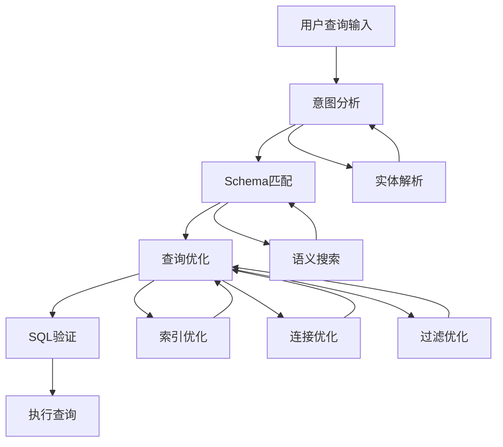

**图表来源**
- [schemaLoader.js:420-507](file://backend/src/core/schemaLoader.js#L420-L507)

#### SQL生成规则

系统遵循以下SQL生成规则：

1. **安全性优先**：所有SQL查询都经过安全验证
2. **性能优化**：自动添加适当的索引和过滤条件
3. **语义一致性**：确保生成的SQL符合Schema定义
4. **错误处理**：提供详细的错误信息和恢复机制

**章节来源**
- [schemaLoader.js:1-732](file://backend/src/core/schemaLoader.js#L1-L732)

## 依赖关系分析

### 核心依赖关系

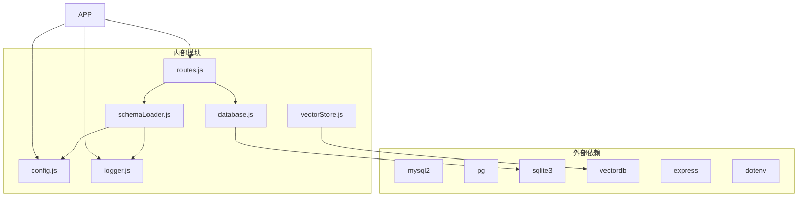

**图表来源**
- [package.json:10-20](file://backend/package.json#L10-L20)

### 配置依赖关系

系统配置采用分层管理模式：

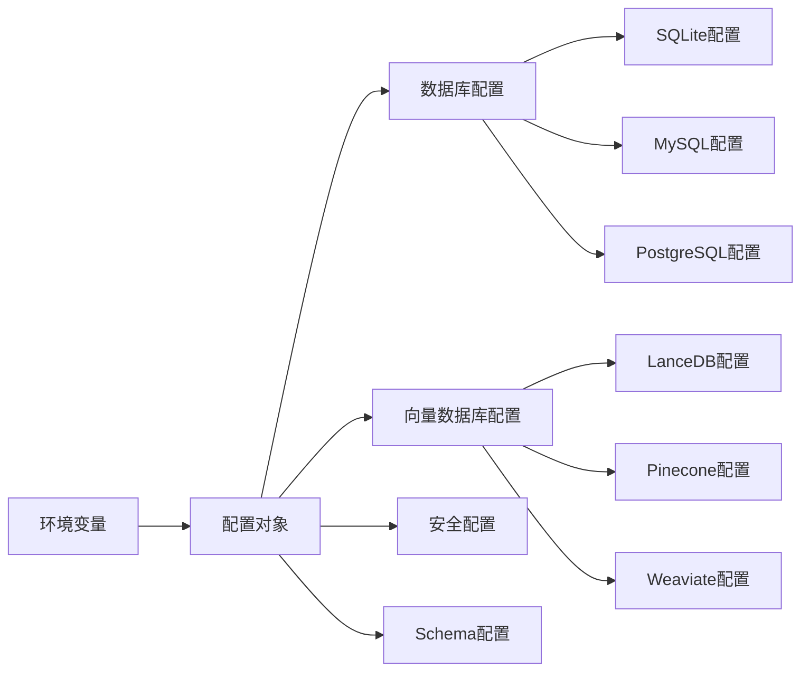

**图表来源**
- [config.js:16-130](file://backend/src/core/config.js#L16-L130)

**章节来源**
- [package.json:1-28](file://backend/package.json#L1-L28)
- [config.js:1-332](file://backend/src/core/config.js#L1-L332)

## 性能考虑

### 连接池优化

系统通过合理的连接池配置实现高性能的数据库访问：

#### SQLite优化策略

- **预编译语句**：使用参数化查询减少编译开销
- **批量操作**：支持批量插入和更新操作
- **索引优化**：自动创建必要的索引提高查询性能
- **事务管理**：合理使用事务减少磁盘I/O

#### MySQL优化策略

- **连接复用**：通过连接池实现连接复用
- **查询缓存**：支持查询结果缓存
- **负载均衡**：支持多数据库实例的负载均衡
- **慢查询监控**：实时监控和分析慢查询

#### PostgreSQL优化策略

- **并发控制**：利用MVCC实现高并发访问
- **查询计划**：优化查询执行计划
- **内存管理**：合理配置共享内存参数
- **备份策略**：支持热备份和恢复

### 向量检索优化

系统实现了高效的向量检索算法：

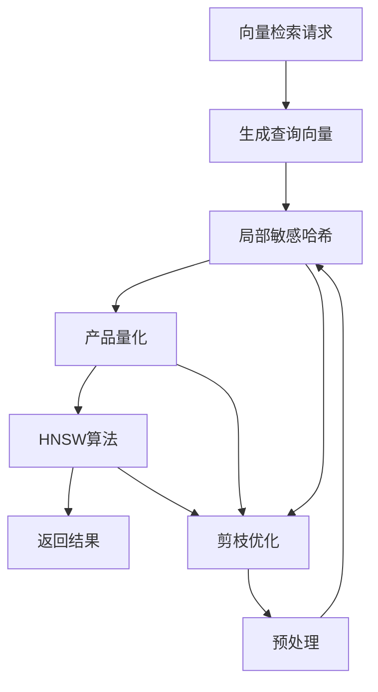

**图表来源**
- [vectorStore.js:201-230](file://backend/src/memory/vectorStore.js#L201-L230)

## 故障排除指南

### 常见问题诊断

#### 数据库连接问题

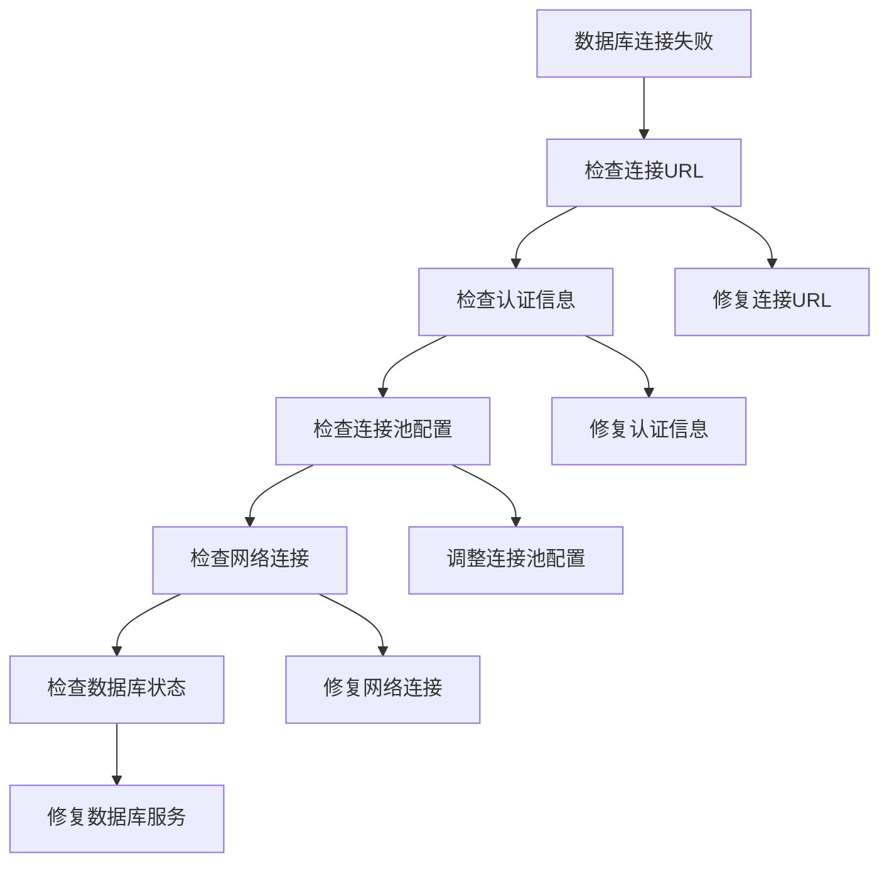

#### 向量数据库问题

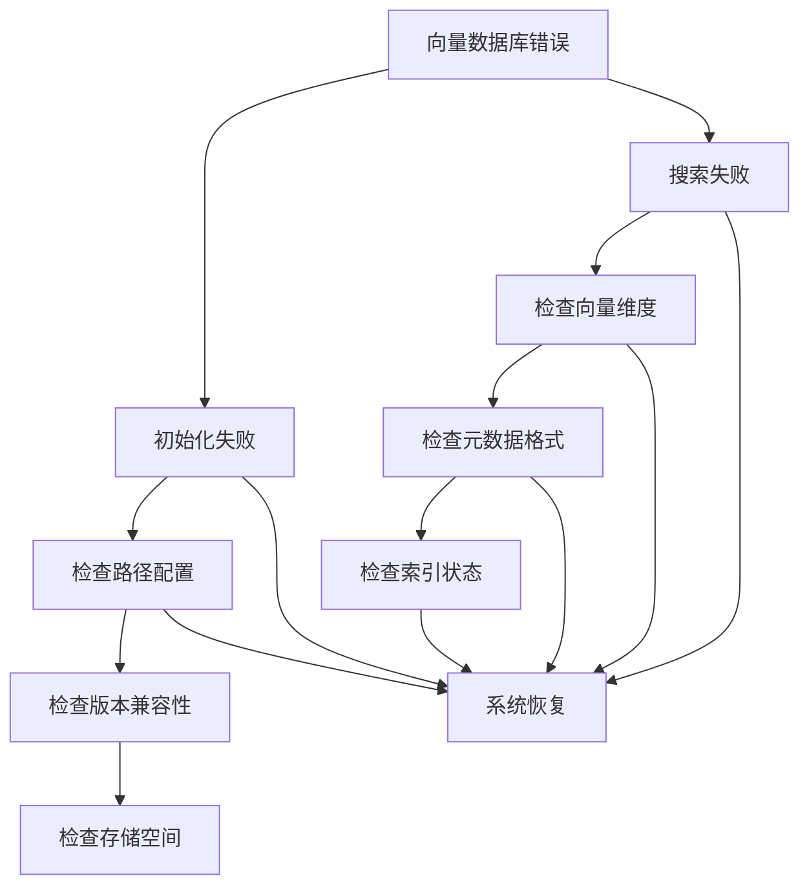

**图表来源**
- [vectorStore.js:55-85](file://backend/src/memory/vectorStore.js#L55-L85)

### 日志分析

系统提供了全面的日志记录功能，支持问题诊断和性能监控：

#### 日志级别说明

| 日志级别 | 用途 | 示例 |
|---------|------|------|
| DEBUG | 详细调试信息 | SQL语句执行详情 |
| INFO | 一般系统信息 | 服务启动、配置加载 |
| WARN | 警告信息 | 配置警告、性能警告 |
| ERROR | 错误信息 | 异常、错误处理 |

#### 性能监控指标

系统监控以下关键性能指标：

- **查询响应时间**：平均响应时间、95分位响应时间
- **连接池利用率**：活跃连接数、等待连接数
- **缓存命中率**：Schema缓存、查询缓存
- **错误率**：数据库错误、向量检索错误

**章节来源**
- [logger.js:1-318](file://backend/src/utils/logger.js#L1-L318)

## 结论

NL2SQL项目的数据库适配器扩展提供了完整的多数据库支持解决方案。通过统一的适配器接口和模块化设计，系统能够轻松集成各种数据库类型，包括传统的关系型数据库和现代的向量数据库。

### 主要优势

1. **高度可扩展性**：通过适配器模式实现数据库类型的无缝切换
2. **性能优化**：针对不同数据库类型提供专门的优化策略
3. **安全性保障**：内置SQL验证和安全防护机制
4. **智能化功能**：支持语义搜索和智能查询优化
5. **易于维护**：清晰的架构设计和完善的错误处理

### 未来发展方向

1. **更多数据库支持**：扩展对更多数据库类型的支持
2. **云原生优化**：增强对云数据库服务的集成
3. **AI驱动优化**：利用机器学习技术进一步优化查询性能
4. **实时分析**：支持流式数据处理和实时查询
5. **分布式架构**：支持大规模分布式部署

通过持续的优化和扩展，NL2SQL项目将成为自然语言查询转换领域的领先解决方案。