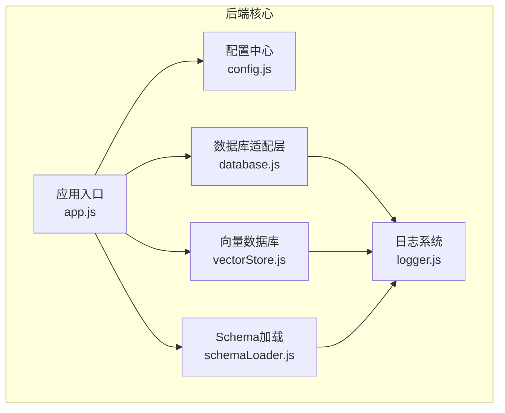
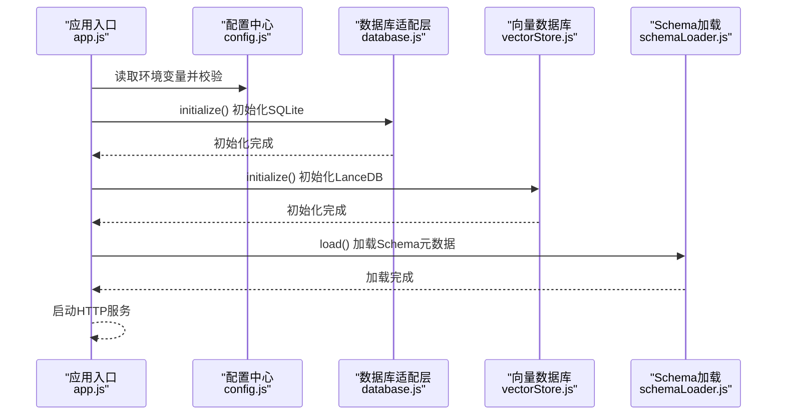
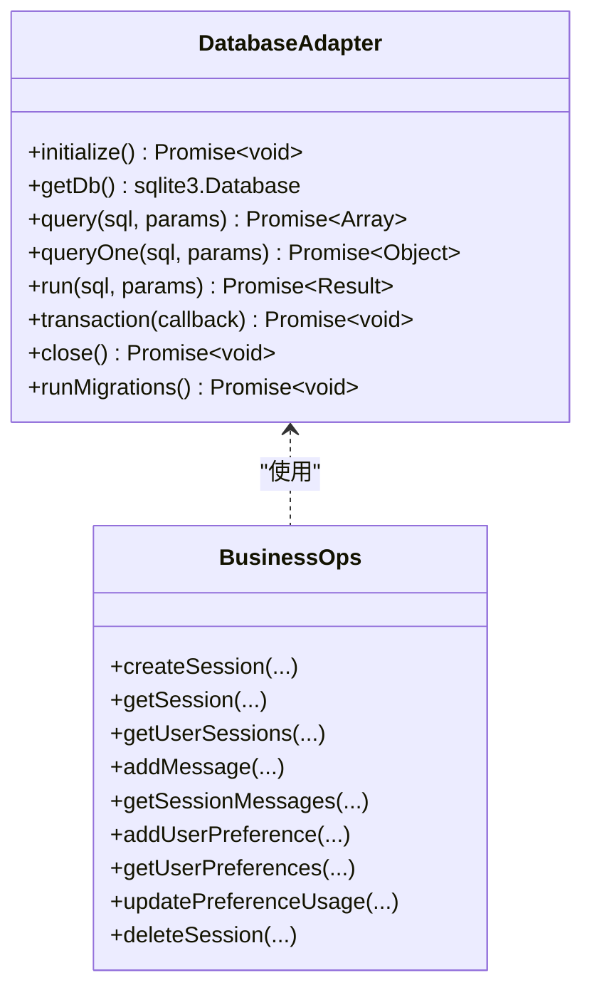
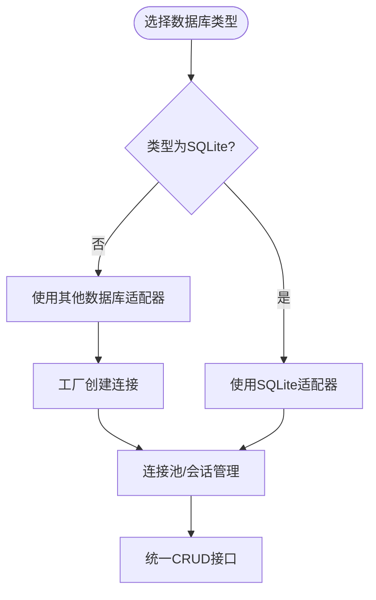
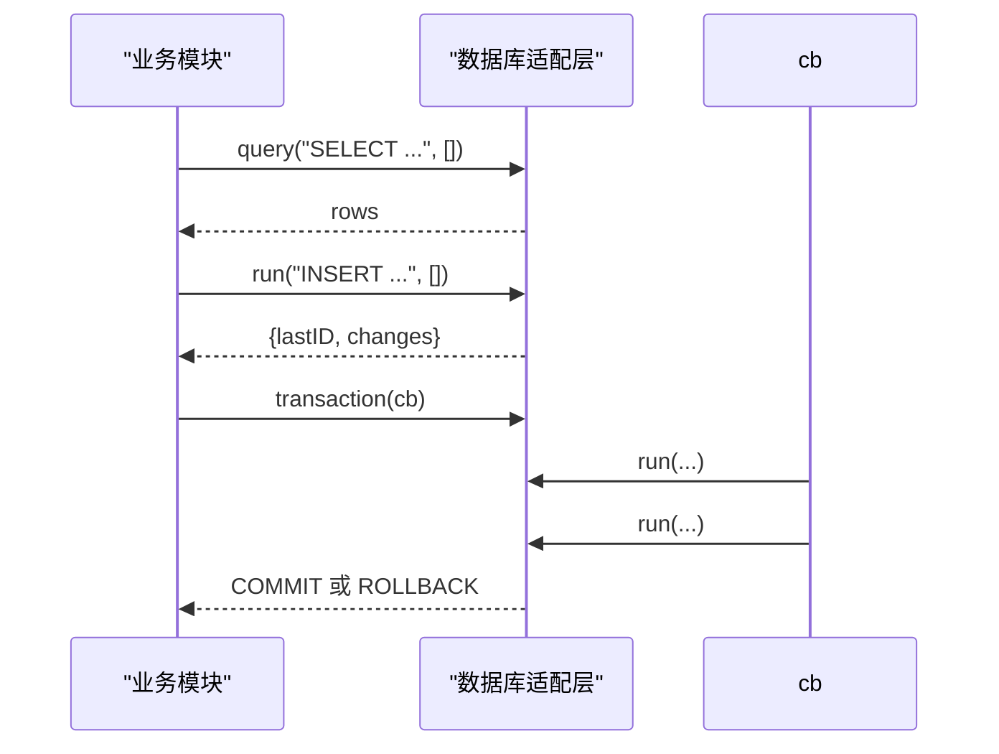
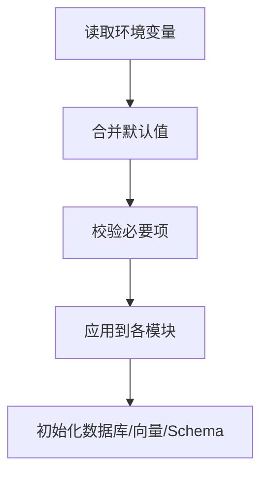
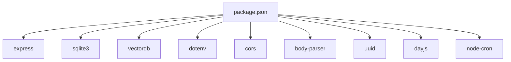

# 自定义数据库集成

<cite>
**本文引用的文件**
- [database.js](file://backend/src/core/database.js)
- [config.js](file://backend/src/core/config.js)
- [app.js](file://backend/src/app.js)
- [vectorStore.js](file://backend/src/memory/vectorStore.js)
- [logger.js](file://backend/src/utils/logger.js)
- [schemaLoader.js](file://backend/src/core/schemaLoader.js)
- [schema-metadata.example.json](file://backend/config/schema-metadata.example.json)
- [schema-metadata.json.backup](file://backend/config/schema-metadata.json.backup)
- [package.json](file://backend/package.json)
</cite>

## 目录
1. [简介](#简介)
2. [项目结构](#项目结构)
3. [核心组件](#核心组件)
4. [架构总览](#架构总览)
5. [详细组件分析](#详细组件分析)
6. [依赖分析](#依赖分析)
7. [性能考虑](#性能考虑)
8. [故障排查指南](#故障排查指南)
9. [结论](#结论)
10. [附录](#附录)

## 简介
本指南面向希望为NL2SQL项目开发“全新数据库适配器”的工程师，目标是让系统能够支持除SQLite之外的其他数据库类型（如MySQL、PostgreSQL、Oracle等）。文档将从标准接口设计、连接抽象层与工厂模式、统一数据库操作方法、配置与环境变量处理、测试策略与调试技巧等方面，给出可落地的开发步骤与最佳实践。

## 项目结构
NL2SQL后端采用模块化组织，核心数据库相关能力集中在以下模块：
- 数据库适配层：SQLite数据库管理模块
- 配置中心：集中管理所有运行时配置
- 应用入口：初始化流程与生命周期管理
- 向量数据库：LanceDB向量存储
- 日志系统：统一日志输出与轮转
- Schema元数据：表结构与字段定义、安全校验

**图表来源**
- [app.js:97-166](file://backend/src/app.js#L97-L166)
- [config.js:16-372](file://backend/src/core/config.js#L16-L372)
- [database.js:1-850](file://backend/src/core/database.js#L1-L850)
- [vectorStore.js:1-621](file://backend/src/memory/vectorStore.js#L1-L621)
- [schemaLoader.js:69-122](file://backend/src/core/schemaLoader.js#L69-L122)

**章节来源**
- [app.js:97-166](file://backend/src/app.js#L97-L166)
- [config.js:16-372](file://backend/src/core/config.js#L16-L372)

## 核心组件
- 数据库适配层(database.js)：封装SQLite数据库连接、表初始化、迁移、事务、以及会话/消息/偏好等业务表的CRUD操作。
- 配置中心(config.js)：集中管理端口、数据库路径、向量数据库路径、SR数据库连接URL、安全白名单、日志级别等。
- 应用入口(app.js)：加载.env、初始化数据库/LanceDB、加载Schema、启动HTTP服务与SSE。
- 向量数据库(vectorStore.js)：基于LanceDB的向量表管理与语义搜索。
- 日志系统(logger.js)：统一日志输出、文件轮转、级别控制。
- Schema加载(schemaLoader.js)：加载schema-metadata.json，构建表/字段映射，进行SQL安全校验。

**章节来源**
- [database.js:1-850](file://backend/src/core/database.js#L1-L850)
- [config.js:16-372](file://backend/src/core/config.js#L16-L372)
- [app.js:97-166](file://backend/src/app.js#L97-L166)
- [vectorStore.js:1-621](file://backend/src/memory/vectorStore.js#L1-L621)
- [logger.js:1-318](file://backend/src/utils/logger.js#L1-L318)
- [schemaLoader.js:69-122](file://backend/src/core/schemaLoader.js#L69-L122)

## 架构总览
NL2SQL采用“配置驱动 + 模块化”的架构：
- 配置中心统一读取环境变量，提供默认值与校验；
- 应用入口负责模块初始化顺序与生命周期；
- 数据库适配层提供统一的查询/插入/更新/删除与事务接口；
- 向量数据库模块提供Schema与查询历史的向量化检索；
- 日志系统贯穿所有模块，保证可观测性。

**图表来源**
- [app.js:97-166](file://backend/src/app.js#L97-L166)
- [config.js:340-372](file://backend/src/core/config.js#L340-L372)
- [database.js:200-261](file://backend/src/core/database.js#L200-L261)
- [vectorStore.js:229-259](file://backend/src/memory/vectorStore.js#L229-L259)
- [schemaLoader.js:69-122](file://backend/src/core/schemaLoader.js#L69-L122)

## 详细组件分析

### 数据库适配层设计与接口规范
- 连接管理：提供initialize()创建数据库连接、runMigrations()执行迁移、getDb()获取连接、close()关闭连接。
- 统一操作接口：
  - query(sql, params)：返回多行结果
  - queryOne(sql, params)：返回单行结果
  - run(sql, params)：执行非查询（INSERT/UPDATE/DELETE），返回lastID与changes
  - transaction(callback)：事务封装，自动BEGIN/COMMIT/ROLLBACK
- 业务表操作：围绕sessions/messages/user_preferences/query_history等表提供CRUD与统计查询。
- 安全与健壮性：启用外键约束、参数化查询、错误日志记录、迁移修复旧表结构。

**图表来源**
- [database.js:200-445](file://backend/src/core/database.js#L200-L445)
- [database.js:458-540](file://backend/src/core/database.js#L458-L540)
- [database.js:555-596](file://backend/src/core/database.js#L555-L596)
- [database.js:609-763](file://backend/src/core/database.js#L609-L763)

**章节来源**
- [database.js:200-445](file://backend/src/core/database.js#L200-L445)
- [database.js:458-540](file://backend/src/core/database.js#L458-L540)
- [database.js:555-596](file://backend/src/core/database.js#L555-L596)
- [database.js:609-763](file://backend/src/core/database.js#L609-L763)

### 数据库连接抽象层与工厂模式
- 抽象层：database.js当前封装了SQLite的具体实现细节，暴露统一接口给上层业务模块。
- 工厂模式建议：
  - 定义数据库工厂createDatabase(config)，根据config.database.type返回不同适配器实例（如sqlite/mysql/postgres）。
  - 适配器需实现统一接口：initialize()/getDb()/query()/queryOne()/run()/transaction()/close()。
  - SR数据库连接（config.srDatabase.url）可作为工厂输入，用于创建业务查询连接池。
- 优点：屏蔽底层差异，便于扩展新数据库类型；保持业务代码不变。

[此图为概念流程图，不直接映射具体源码文件]

### 数据库操作方法的统一接口规范
- 查询接口：query(sql, params)返回多行；queryOne(sql, params)返回单行。
- 写入接口：run(sql, params)返回lastID与changes，适合INSERT/UPDATE/DELETE。
- 事务接口：transaction(callback)包裹多个操作，失败自动回滚。
- 业务接口：围绕会话、消息、用户偏好等表提供高层封装，隐藏SQL细节。

**图表来源**
- [database.js:361-424](file://backend/src/core/database.js#L361-L424)
- [database.js:431-445](file://backend/src/core/database.js#L431-L445)

**章节来源**
- [database.js:361-424](file://backend/src/core/database.js#L361-L424)
- [database.js:431-445](file://backend/src/core/database.js#L431-L445)

### 数据库配置管理与环境变量处理
- 配置来源：process.env + config.js默认值；启动前由app.js加载dotenv。
- 关键配置项：
  - 服务器端口、运行环境
  - LLM/Embedding配置
  - SQLite数据库路径（用于会话与日志）
  - LanceDB向量数据库路径
  - SR数据库连接URL（业务查询）
  - 安全白名单、DryRun、最大查询行数、查询超时、禁止关键字、敏感字段
  - 日志级别、文件路径、轮转策略
  - Schema缓存开关、重向量化开关
- 配置校验：validate()检查必要项（LLM API Key、SR数据库URL）。

**图表来源**
- [config.js:16-372](file://backend/src/core/config.js#L16-L372)
- [app.js:15-16](file://backend/src/app.js#L15-L16)
- [config.js:340-372](file://backend/src/core/config.js#L340-L372)

**章节来源**
- [config.js:16-372](file://backend/src/core/config.js#L16-L372)
- [app.js:15-16](file://backend/src/app.js#L15-L16)
- [config.js:340-372](file://backend/src/core/config.js#L340-L372)

### Schema元数据与安全校验
- Schema加载：从schema-metadata.json读取表/字段/关系/指标/维度定义，构建映射并可选向量化。
- 安全校验：validateSQL()检查禁止关键字与白名单表，防止非法操作。
- 示例Schema：提供示例与备份文件，便于对照调整。

**章节来源**
- [schemaLoader.js:69-122](file://backend/src/core/schemaLoader.js#L69-L122)
- [schemaLoader.js:570-606](file://backend/src/core/schemaLoader.js#L570-L606)
- [schema-metadata.example.json:1-328](file://backend/config/schema-metadata.example.json#L1-L328)
- [schema-metadata.json.backup:1-800](file://backend/config/schema-metadata.json.backup#L1-L800)

## 依赖分析
- 运行时依赖：express、sqlite3、vectordb、dotenv、cors、body-parser、uuid、dayjs、node-cron。
- 开发依赖：nodemon。
- 项目入口：package.json main指向src/app.js。

**图表来源**
- [package.json:10-27](file://backend/package.json#L10-L27)

**章节来源**
- [package.json:10-27](file://backend/package.json#L10-L27)

## 性能考虑
- 连接池：对于SR数据库（业务查询），建议使用连接池（如mysql2/pool）以提升并发与复用效率。
- 索引与查询：SQLite已为关键字段建立索引；向量数据库通过LanceDB加速语义检索。
- 超时与限流：配置QUERY_TIMEOUT与MAX_QUERY_ROWS，避免大查询导致资源耗尽。
- 缓存：Schema缓存与向量缓存减少重复计算与IO。

[本节为通用指导，不直接分析具体文件]

## 故障排查指南
- 启动失败：检查.env中LLM_API_KEY与SR_DATABASE_URL是否配置；查看日志级别与文件路径。
- 数据库连接失败：确认DB_PATH与VECTOR_DB_PATH权限；检查SQLite文件是否存在。
- SQL安全拦截：若被拦截，检查ALLOWED_TABLES与禁止关键字配置。
- 日志定位：通过logger.js的级别与文件轮转定位问题；关注ERROR/WARN级别日志。

**章节来源**
- [config.js:340-372](file://backend/src/core/config.js#L340-L372)
- [logger.js:227-293](file://backend/src/utils/logger.js#L227-L293)

## 结论
通过抽象数据库适配层与工厂模式，NL2SQL可以在不改动业务代码的前提下，无缝接入新的数据库类型。结合统一的CRUD接口、严格的配置与安全校验、完善的日志与向量检索能力，可快速实现“自定义数据库集成”，满足多样化的生产部署需求。

[本节为总结性内容，不直接分析具体文件]

## 附录

### 开发步骤清单（为新数据库适配器）
- 设计适配器接口：initialize/getDb/query/queryOne/run/transaction/close
- 实现工厂：createDatabase(config)根据类型返回适配器实例
- 连接池与URL解析：解析config.srDatabase.url，创建连接池
- 事务与错误处理：遵循现有事务封装与错误日志风格
- 安全校验：沿用validateSQL逻辑，确保白名单与关键字过滤
- 测试策略：单元测试覆盖CRUD与事务；集成测试覆盖Schema与向量检索
- 文档与配置：补充README与示例.env，完善配置项说明

[本节为概念性内容，不直接分析具体文件]