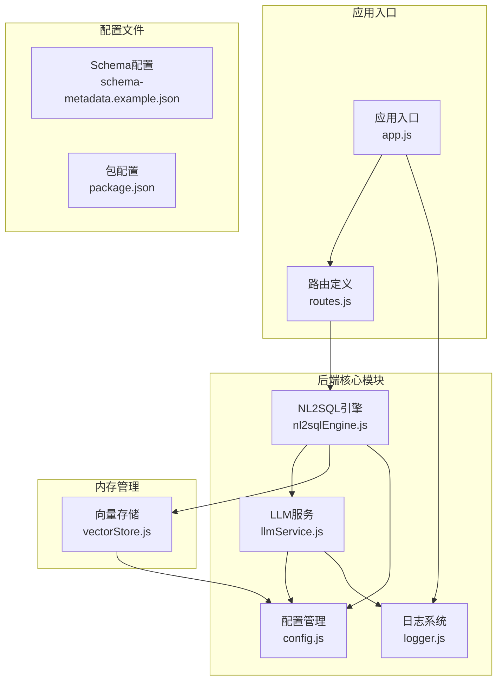
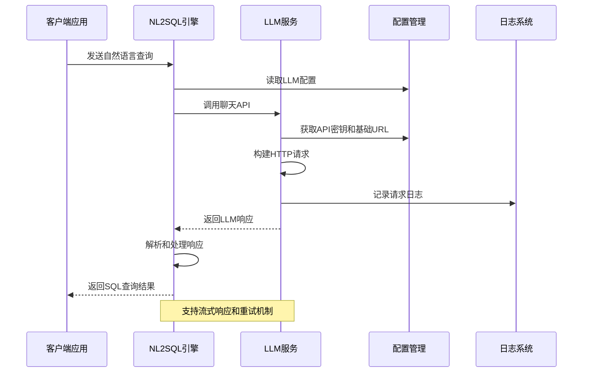
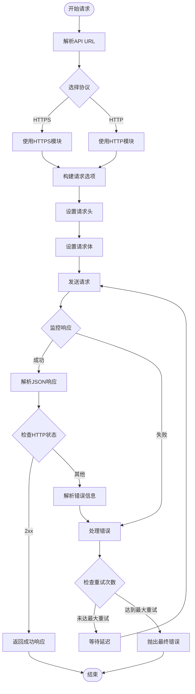
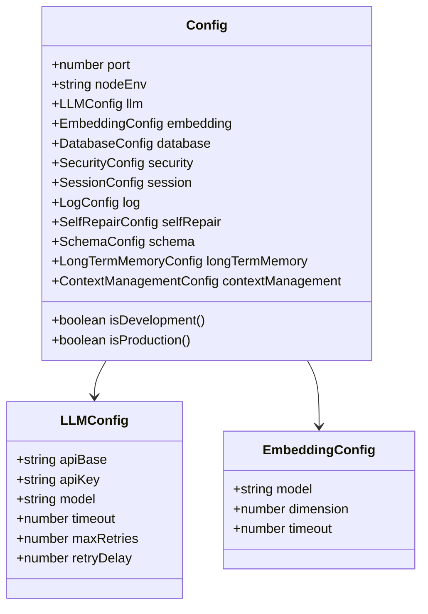
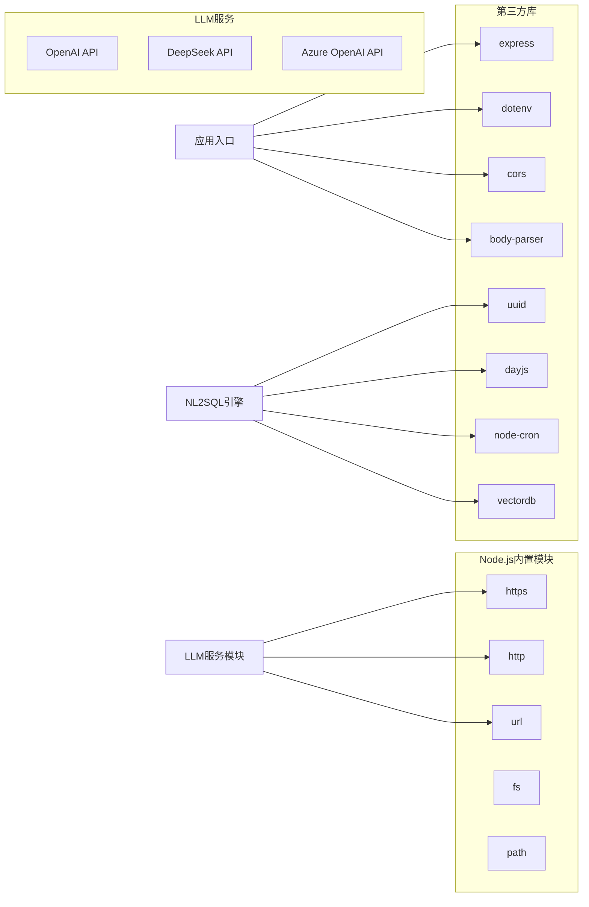

# LLM服务集成

<cite>
**本文档引用的文件**
- [llmService.js](file://backend/src/core/llmService.js)
- [config.js](file://backend/src/core/config.js)
- [logger.js](file://backend/src/utils/logger.js)
- [app.js](file://backend/src/app.js)
- [routes.js](file://backend/src/core/routes.js)
- [nl2sqlEngine.js](file://backend/src/core/nl2sqlEngine.js)
- [vectorStore.js](file://backend/src/memory/vectorStore.js)
- [schema-metadata.example.json](file://backend/config/schema-metadata.example.json)
- [package.json](file://backend/package.json)
</cite>

## 目录
1. [简介](#简介)
2. [项目结构](#项目结构)
3. [核心组件](#核心组件)
4. [架构概览](#架构概览)
5. [详细组件分析](#详细组件分析)
6. [依赖分析](#依赖分析)
7. [性能考虑](#性能考虑)
8. [故障排除指南](#故障排除指南)
9. [结论](#结论)
10. [附录](#附录)

## 简介

NL2SQL项目实现了自然语言到SQL的智能转换功能，其中LLM服务集成功能是核心组成部分。该项目支持多种大语言模型服务，包括OpenAI、DeepSeek、Azure OpenAI等兼容OpenAI API格式的服务。

LLM服务集成功能主要包括：
- **多提供商支持**：兼容OpenAI API格式的各种LLM服务
- **聊天功能**：支持普通响应和流式响应
- **Embedding向量生成**：用于语义检索和相似度计算
- **重试机制**：自动处理网络异常和临时故障
- **认证机制**：基于Bearer Token的API密钥认证
- **错误处理**：完善的错误捕获和日志记录
- **性能优化**：超时控制和资源管理

## 项目结构

NL2SQL项目的后端采用模块化设计，LLM服务集成位于核心模块中：



**图表来源**
- [app.js:1-238](file://backend/src/app.js#L1-L238)
- [llmService.js:1-432](file://backend/src/core/llmService.js#L1-L432)
- [config.js:1-372](file://backend/src/core/config.js#L1-L372)

**章节来源**
- [app.js:1-238](file://backend/src/app.js#L1-L238)
- [package.json:1-28](file://backend/package.json#L1-L28)

## 核心组件

### LLM服务模块

LLM服务模块是整个系统的核心，负责与外部LLM API进行通信。该模块提供了完整的API封装，包括HTTP请求处理、重试机制、错误处理等功能。

**主要功能特性**：
- **HTTP请求封装**：支持HTTPS和HTTP协议
- **流式响应支持**：可选的流式数据传输
- **JSON数据处理**：自动序列化和反序列化
- **超时控制**：防止请求挂起
- **重试机制**：自动处理临时故障

### 配置管理系统

配置管理系统集中管理所有应用配置，支持环境变量和默认值的灵活组合。

**配置分类**：
- **服务器配置**：端口、环境模式
- **LLM API配置**：基础URL、API密钥、模型选择
- **Embedding配置**：模型名称、向量维度
- **数据库配置**：SQLite和向量数据库路径
- **安全配置**：访问控制和查询限制

### 日志系统

日志系统提供统一的日志记录功能，支持多级别日志输出和文件轮转。

**日志级别**：
- DEBUG：调试信息
- INFO：一般信息
- WARN：警告信息
- ERROR：错误信息

**输出方式**：
- 控制台彩色输出
- 文件日志记录
- 结构化日志格式

**章节来源**
- [llmService.js:1-432](file://backend/src/core/llmService.js#L1-L432)
- [config.js:1-372](file://backend/src/core/config.js#L1-L372)
- [logger.js:1-318](file://backend/src/utils/logger.js#L1-L318)

## 架构概览

NL2SQL系统的LLM服务集成采用了分层架构设计，确保了模块间的松耦合和高内聚。



**图表来源**
- [nl2sqlEngine.js:497-780](file://backend/src/core/nl2sqlEngine.js#L497-L780)
- [llmService.js:222-277](file://backend/src/core/llmService.js#L222-L277)

### 组件交互流程

系统中的组件交互遵循清晰的职责分离原则：

1. **应用入口**：负责初始化各个模块
2. **路由层**：处理HTTP请求和响应
3. **引擎层**：执行NL2SQL转换逻辑
4. **服务层**：与外部LLM API通信
5. **存储层**：管理向量数据库和配置

**章节来源**
- [app.js:97-166](file://backend/src/app.js#L97-L166)
- [routes.js:1-800](file://backend/src/core/routes.js#L1-L800)

## 详细组件分析

### LLM服务实现分析

#### HTTP请求处理机制

LLM服务模块实现了完整的HTTP请求处理机制，支持多种数据传输模式：



**图表来源**
- [llmService.js:41-152](file://backend/src/core/llmService.js#L41-L152)

#### 重试机制设计

系统实现了智能的重试机制，能够有效处理网络异常和临时故障：

**重试策略特点**：
- **指数退避**：每次重试间隔递增
- **最大重试次数限制**：防止无限重试
- **错误分类处理**：不同类型错误的处理策略
- **日志记录**：详细的重试过程记录

#### 认证和安全机制

LLM服务采用标准的Bearer Token认证方式：

**认证流程**：
1. 从配置中读取API密钥
2. 构建Authorization头
3. 发送带有认证信息的请求
4. 处理认证失败的响应

**安全措施**：
- API密钥存储在环境变量中
- 避免在日志中输出敏感信息
- 支持HTTPS协议加密传输

**章节来源**
- [llmService.js:158-195](file://backend/src/core/llmService.js#L158-L195)
- [llmService.js:247-251](file://backend/src/core/llmService.js#L247-L251)

### 配置管理系统分析

#### 配置层次结构

配置管理系统采用分层设计，确保配置的灵活性和可维护性：



**图表来源**
- [config.js:16-329](file://backend/src/core/config.js#L16-L329)

#### 环境变量支持

系统全面支持环境变量配置，提供了灵活的部署选项：

**LLM相关环境变量**：
- `LLM_API_BASE`：API基础URL
- `LLM_API_KEY`：API密钥
- `LLM_MODEL`：模型名称
- `LLM_TIMEOUT`：请求超时时间
- `EMBEDDING_MODEL`：Embedding模型名称
- `EMBEDDING_TIMEOUT`：Embedding请求超时时间

**配置验证机制**：
- 启动时验证必需配置
- 提供详细的错误信息
- 支持配置热更新

**章节来源**
- [config.js:55-87](file://backend/src/core/config.js#L55-L87)
- [config.js:340-362](file://backend/src/core/config.js#L340-L362)

### 日志系统实现分析

#### 日志级别和输出策略

日志系统实现了多级别的日志记录和灵活的输出策略：

**日志级别优先级**：
- DEBUG < INFO < WARN < ERROR
- 只记录等于或高于当前级别的日志

**输出目标**：
- 控制台输出：彩色显示，便于开发调试
- 文件输出：自动轮转，支持配置大小限制
- 结构化格式：便于日志分析和处理

#### 日志轮转机制

系统实现了智能的日志轮转功能，确保磁盘空间的有效利用：

**轮转策略**：
- 基于文件大小的轮转
- 支持多个历史文件
- 自动清理超出数量限制的旧文件

**章节来源**
- [logger.js:28-41](file://backend/src/utils/logger.js#L28-L41)
- [logger.js:128-160](file://backend/src/utils/logger.js#L128-L160)

## 依赖分析

### 外部依赖关系

NL2SQL项目的LLM服务集成功能依赖于以下外部组件：



**图表来源**
- [package.json:10-27](file://backend/package.json#L10-L27)
- [llmService.js:15-24](file://backend/src/core/llmService.js#L15-L24)

### 内部模块依赖

系统内部模块之间建立了清晰的依赖关系：

**核心依赖链**：
1. `app.js` → `config.js`（配置加载）
2. `app.js` → `routes.js`（路由处理）
3. `routes.js` → `nl2sqlEngine.js`（业务逻辑）
4. `nl2sqlEngine.js` → `llmService.js`（LLM通信）
5. `nl2sqlEngine.js` → `vectorStore.js`（向量存储）

**依赖管理优势**：
- 模块间松耦合
- 职责清晰分离
- 易于测试和维护

**章节来源**
- [package.json:10-27](file://backend/package.json#L10-L27)
- [app.js:39-50](file://backend/src/app.js#L39-L50)

## 性能考虑

### 请求超时优化

系统实现了多层次的超时控制机制：

**超时配置**：
- LLM请求超时：默认60秒，可根据模型复杂度调整
- Embedding请求超时：默认60秒，支持更长的向量生成时间
- HTTP连接超时：防止连接挂起

**超时策略**：
- 动态调整超时时间
- 针对不同操作类型设置专门的超时值
- 超时错误的优雅处理

### 重试策略优化

智能的重试机制提高了系统的可靠性：

**重试算法**：
- 指数退避延迟
- 最大重试次数限制
- 错误类型分类处理

**重试条件**：
- 网络超时
- 临时服务器错误
- 连接异常

### 资源管理

系统实现了有效的资源管理策略：

**内存管理**：
- 流式数据处理
- 及时释放临时资源
- 避免内存泄漏

**连接管理**：
- HTTP连接复用
- 超时连接清理
- 连接池优化

## 故障排除指南

### 常见问题诊断

#### API连接问题

**症状**：请求超时或连接失败
**诊断步骤**：
1. 检查API基础URL配置
2. 验证API密钥有效性
3. 确认网络连通性
4. 检查防火墙设置

**解决方案**：
- 更新正确的API基础URL
- 重新生成API密钥
- 配置代理服务器
- 调整超时参数

#### 认证失败问题

**症状**：401未授权错误
**诊断步骤**：
1. 验证API密钥格式
2. 检查Bearer Token前缀
3. 确认API密钥权限
4. 验证服务提供商支持

**解决方案**：
- 确保API密钥以Bearer格式
- 检查服务提供商的API要求
- 更新API密钥
- 联系服务提供商支持

#### 响应解析错误

**症状**：JSON解析失败或响应截断
**诊断步骤**：
1. 检查响应格式
2. 验证JSON结构
3. 确认响应完整性
4. 检查代理服务器配置

**解决方案**：
- 调整代理服务器设置
- 增加响应大小限制
- 优化请求参数
- 检查网络稳定性

### 日志分析技巧

**调试日志级别**：
- 开发环境使用DEBUG级别
- 生产环境使用INFO级别
- 关键错误使用ERROR级别

**日志分析要点**：
- 请求ID追踪
- 响应时间分析
- 错误模式识别
- 性能瓶颈定位

**章节来源**
- [llmService.js:113-131](file://backend/src/core/llmService.js#L113-L131)
- [logger.js:227-245](file://backend/src/utils/logger.js#L227-L245)

## 结论

NL2SQL项目的LLM服务集成功能展现了现代AI应用开发的最佳实践。通过模块化设计、完善的错误处理机制和灵活的配置管理，系统实现了对多种LLM服务的无缝集成。

**主要优势**：
- **多提供商兼容**：支持OpenAI、DeepSeek、Azure OpenAI等服务
- **健壮性设计**：完善的重试机制和错误处理
- **性能优化**：智能超时控制和资源管理
- **易于维护**：清晰的模块结构和配置管理

**技术特色**：
- 流式响应支持
- 向量嵌入功能
- 智能重试策略
- 结构化日志系统

该实现为构建可靠的NL2SQL应用提供了坚实的技术基础，能够满足不同场景下的需求。

## 附录

### 配置示例

#### OpenAI集成配置

```bash
# OpenAI API配置
LLM_API_BASE=https://api.openai.com/v1
LLM_API_KEY=your-openai-api-key
LLM_MODEL=gpt-4
EMBEDDING_MODEL=text-embedding-3-small
```

#### DeepSeek集成配置

```bash
# DeepSeek API配置
LLM_API_BASE=https://api.deepseek.com/v1
LLM_API_KEY=your-deepseek-api-key
LLM_MODEL=deepseek-chat
EMBEDDING_MODEL=deepseek-embedding
```

#### Azure OpenAI集成配置

```bash
# Azure OpenAI API配置
LLM_API_BASE=https://your-resource.openai.azure.com/openai/deployments/your-model
LLM_API_KEY=your-azure-api-key
LLM_MODEL=your-deployment-name
```

### 性能优化建议

**成本控制策略**：
- 合理设置超时时间，避免不必要的请求
- 使用流式响应减少内存占用
- 实施重试策略避免重复调用
- 监控API使用量和费用

**性能调优**：
- 根据模型复杂度调整超时参数
- 优化嵌入向量的批量处理
- 实施连接池管理
- 使用缓存机制减少重复请求

**监控和告警**：
- 设置关键指标监控
- 实施异常告警机制
- 定期性能评估
- 成本使用分析