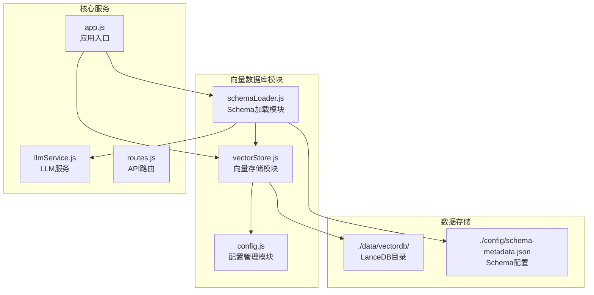
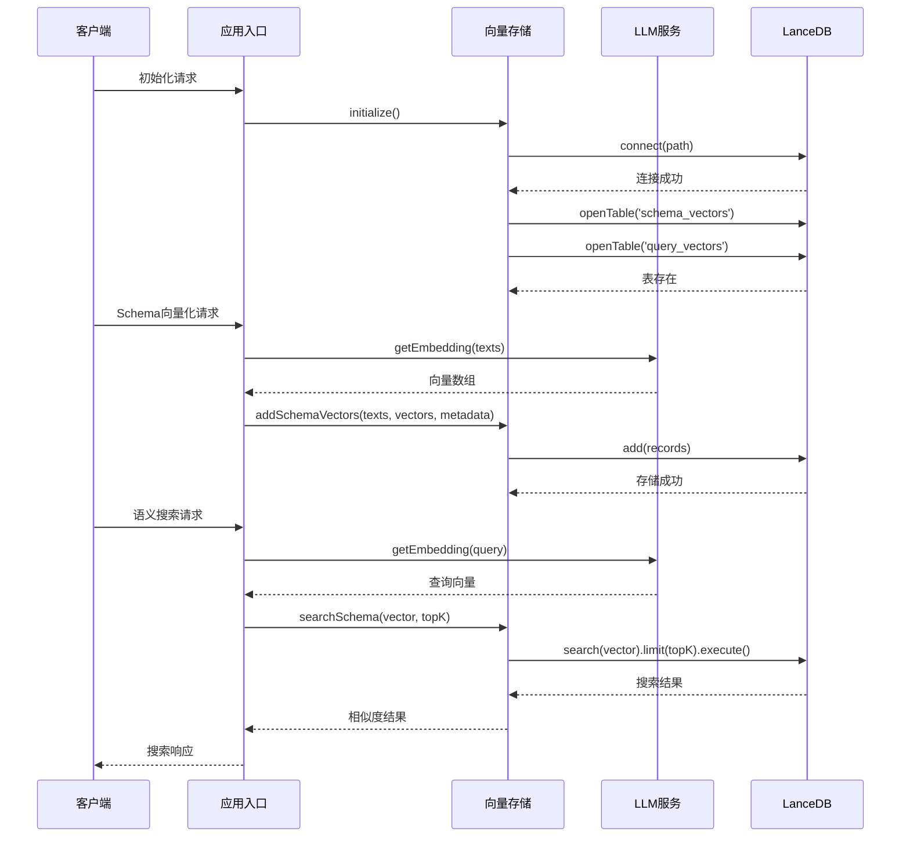
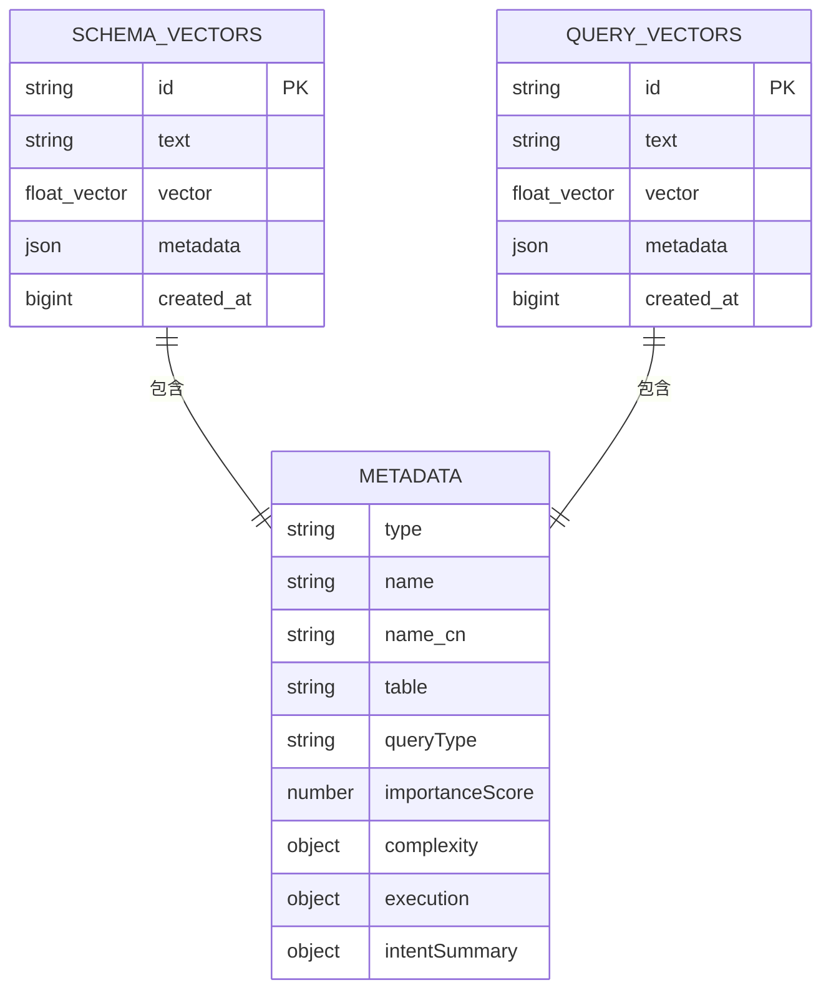
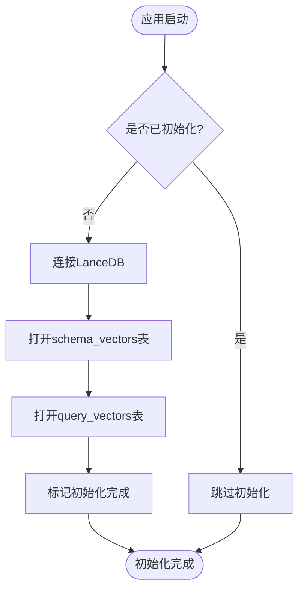
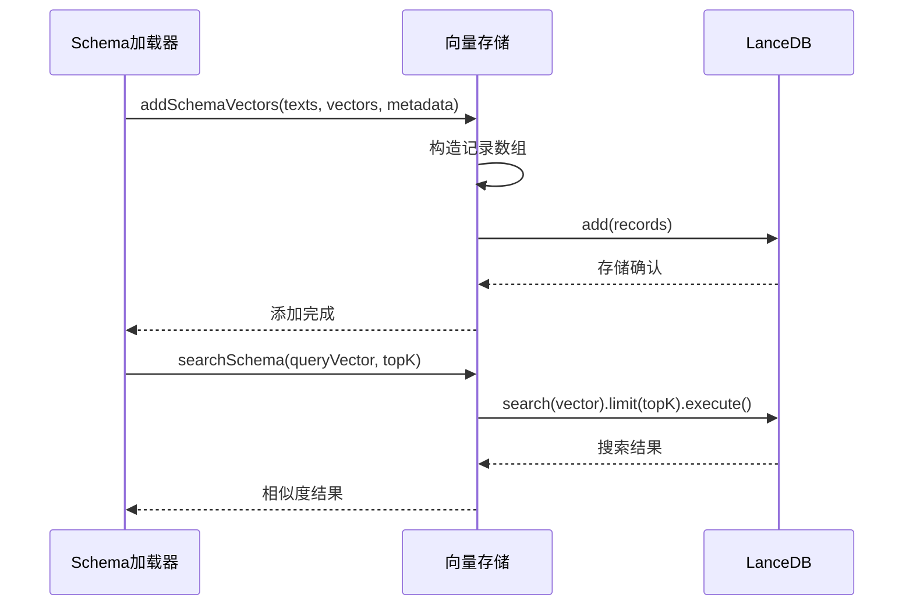
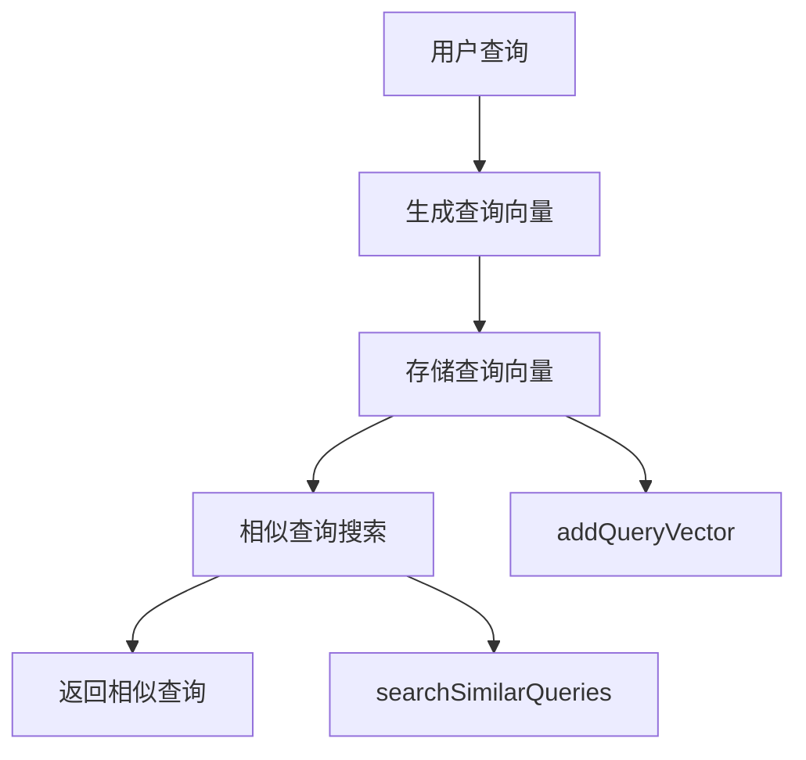
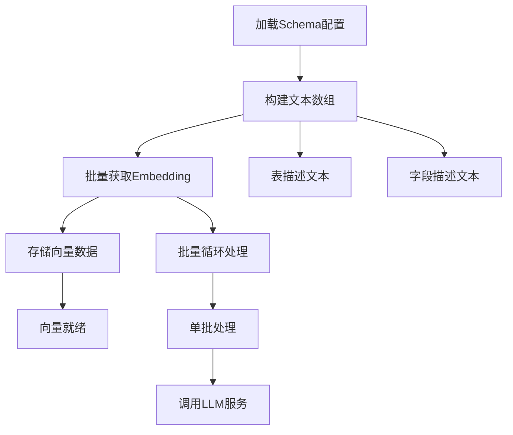
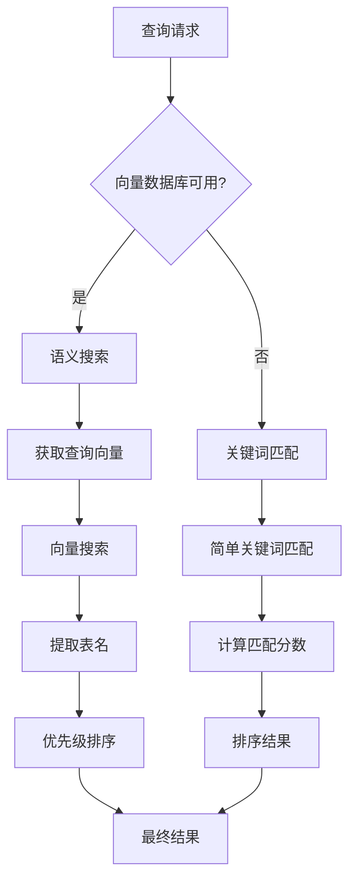
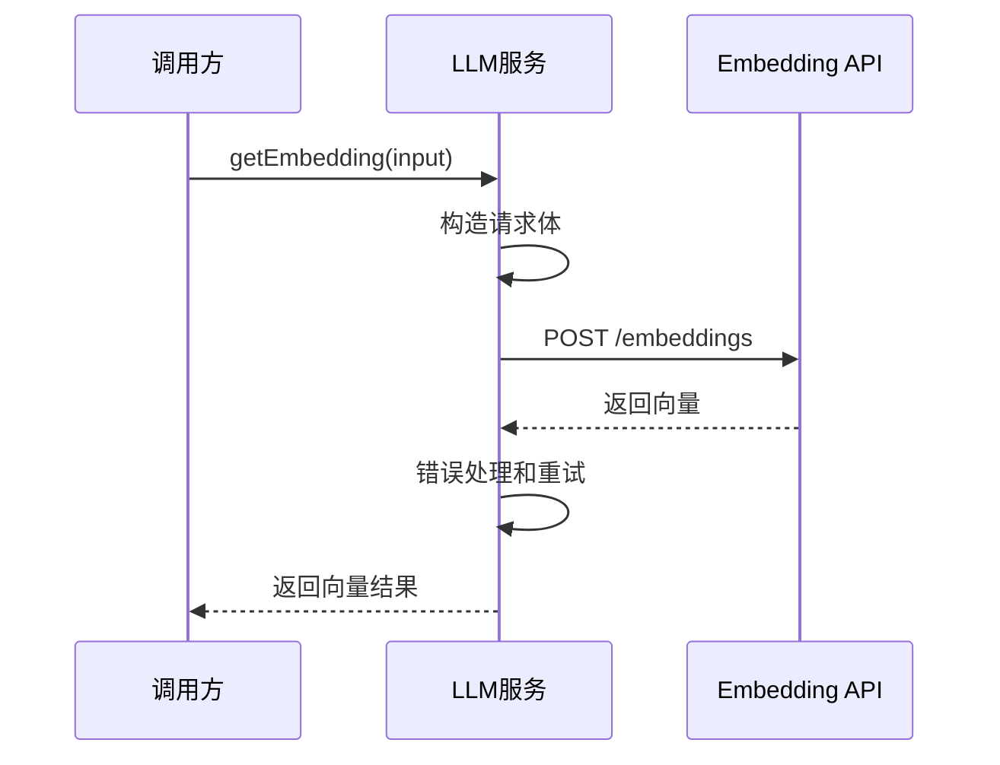
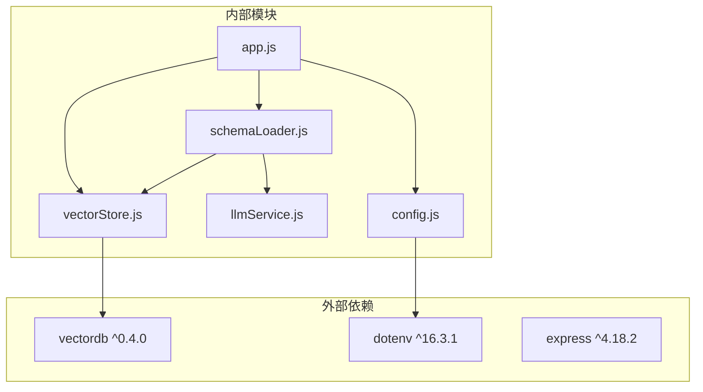

# 向量数据库集成

<cite>
**本文档引用的文件**
- [vectorStore.js](file://backend/src/memory/vectorStore.js)
- [config.js](file://backend/src/core/config.js)
- [app.js](file://backend/src/app.js)
- [schemaLoader.js](file://backend/src/core/schemaLoader.js)
- [llmService.js](file://backend/src/core/llmService.js)
- [routes.js](file://backend/src/core/routes.js)
- [package.json](file://backend/package.json)
- [schema-metadata.json](file://backend/config/schema-metadata.json)
</cite>

## 目录
1. [简介](#简介)
2. [项目结构](#项目结构)
3. [核心组件](#核心组件)
4. [架构概览](#架构概览)
5. [详细组件分析](#详细组件分析)
6. [依赖分析](#依赖分析)
7. [性能考虑](#性能考虑)
8. [故障排除指南](#故障排除指南)
9. [结论](#结论)
10. [附录](#附录)

## 简介
NL2SQL项目集成了LanceDB向量数据库，用于实现Schema信息和查询历史的语义检索功能。该系统通过向量化技术将自然语言查询与数据库Schema进行语义匹配，提升查询理解和推荐的准确性。

## 项目结构
向量数据库相关代码主要分布在以下模块中：



**图表来源**
- [vectorStore.js:1-621](file://backend/src/memory/vectorStore.js#L1-L621)
- [schemaLoader.js:1-775](file://backend/src/core/schemaLoader.js#L1-L775)
- [config.js:106-109](file://backend/src/core/config.js#L106-L109)

**章节来源**
- [app.js:46-46](file://backend/src/app.js#L46-L46)
- [package.json:12-12](file://backend/package.json#L12-L12)

## 核心组件
向量数据库系统由以下几个核心组件构成：

### 1. 向量存储模块 (vectorStore.js)
- 基于LanceDB实现的向量数据库
- 支持Schema向量和查询历史向量的存储
- 提供语义相似度搜索功能
- 实现向量数据的增删改查操作

### 2. 配置管理模块 (config.js)
- 定义向量数据库的存储路径
- 配置Embedding模型参数
- 管理向量数据库的环境变量

### 3. Schema加载模块 (schemaLoader.js)
- 负责将Schema元数据向量化
- 实现语义搜索和关键词匹配的混合检索
- 管理向量数据的缓存和更新

### 4. LLM服务模块 (llmService.js)
- 提供Embedding向量生成服务
- 支持批量向量化处理
- 实现API调用的重试机制

**章节来源**
- [vectorStore.js:14-19](file://backend/src/memory/vectorStore.js#L14-L19)
- [config.js:106-109](file://backend/src/core/config.js#L106-L109)
- [schemaLoader.js:195-290](file://backend/src/core/schemaLoader.js#L195-L290)
- [llmService.js:324-379](file://backend/src/core/llmService.js#L324-L379)

## 架构概览
系统采用分层架构设计，实现了向量数据库的完整生命周期管理：



**图表来源**
- [app.js:126-127](file://backend/src/app.js#L126-L127)
- [schemaLoader.js:267-282](file://backend/src/core/schemaLoader.js#L267-L282)
- [vectorStore.js:375-404](file://backend/src/memory/vectorStore.js#L375-L404)

## 详细组件分析

### 向量存储模块 (vectorStore.js)
该模块是向量数据库的核心实现，提供了完整的向量操作功能：

#### 数据模型设计
系统使用LanceDB的表结构存储向量数据：



**图表来源**
- [vectorStore.js:275-286](file://backend/src/memory/vectorStore.js#L275-L286)
- [vectorStore.js:308-314](file://backend/src/memory/vectorStore.js#L308-L314)

#### 核心功能实现

##### 初始化流程
向量存储模块在应用启动时自动初始化：



**图表来源**
- [vectorStore.js:229-259](file://backend/src/memory/vectorStore.js#L229-L259)

##### Schema向量操作
支持批量添加和搜索Schema向量：



**图表来源**
- [schemaLoader.js:277-282](file://backend/src/core/schemaLoader.js#L277-L282)
- [vectorStore.js:334-404](file://backend/src/memory/vectorStore.js#L334-L404)

##### 查询历史向量操作
提供查询历史的向量化存储和相似查询搜索：



**图表来源**
- [vectorStore.js:419-481](file://backend/src/memory/vectorStore.js#L419-L481)

**章节来源**
- [vectorStore.js:229-404](file://backend/src/memory/vectorStore.js#L229-L404)
- [vectorStore.js:419-546](file://backend/src/memory/vectorStore.js#L419-L546)

### 配置管理模块 (config.js)
向量数据库的配置主要集中在以下部分：

#### 向量数据库配置
```javascript
vectorDb: {
  path: process.env.VECTOR_DB_PATH || './data/vectordb'
}
```

#### Embedding模型配置
```javascript
embedding: {
  model: process.env.EMBEDDING_MODEL || 'text-embedding-3-small',
  dimension: 1536,
  timeout: parseInt(process.env.EMBEDDING_TIMEOUT) || 60000
}
```

**章节来源**
- [config.js:106-109](file://backend/src/core/config.js#L106-L109)
- [config.js:80-87](file://backend/src/core/config.js#L80-L87)

### Schema加载模块 (schemaLoader.js)
该模块负责将Schema元数据转换为向量形式：

#### 向量化流程


**图表来源**
- [schemaLoader.js:215-290](file://backend/src/core/schemaLoader.js#L215-L290)

#### 混合检索策略
系统实现了语义搜索和关键词匹配的混合策略：



**图表来源**
- [schemaLoader.js:502-540](file://backend/src/core/schemaLoader.js#L502-L540)

**章节来源**
- [schemaLoader.js:195-290](file://backend/src/core/schemaLoader.js#L195-L290)
- [schemaLoader.js:470-600](file://backend/src/core/schemaLoader.js#L470-L600)

### LLM服务模块 (llmService.js)
提供Embedding向量生成服务：

#### Embedding API调用


**图表来源**
- [llmService.js:324-379](file://backend/src/core/llmService.js#L324-L379)

**章节来源**
- [llmService.js:324-379](file://backend/src/core/llmService.js#L324-L379)

## 依赖分析
向量数据库系统的主要依赖关系如下：



**图表来源**
- [package.json:12-12](file://backend/package.json#L12-L12)
- [app.js:46-46](file://backend/src/app.js#L46-L46)

**章节来源**
- [package.json:10-20](file://backend/package.json#L10-L20)
- [app.js:40-46](file://backend/src/app.js#L40-L46)

## 性能考虑

### 索引策略
由于LanceDB的向量索引特性，系统采用了以下优化策略：

1. **批量处理**: Schema向量化采用20条文本的批次大小，平衡处理速度和稳定性
2. **缓存机制**: 向量数据仅在首次加载或强制重新向量化时生成
3. **延迟初始化**: 向量数据库在应用启动时延迟初始化，不影响主流程

### 内存管理
- 向量维度固定为1536，适合大多数Embedding模型
- 批量处理避免单次请求过大导致内存溢出
- 向量数据存储在本地文件系统，减少内存占用

### 查询优化
- 使用topK参数限制返回结果数量
- 语义搜索结合关键词匹配，提高搜索准确性
- 支持查询类型分类和重要性评分

**章节来源**
- [schemaLoader.js:257-273](file://backend/src/core/schemaLoader.js#L257-L273)
- [vectorStore.js:375-388](file://backend/src/memory/vectorStore.js#L375-L388)

## 故障排除指南

### 常见问题及解决方案

#### 向量数据库初始化失败
**症状**: 应用启动时向量数据库未初始化
**原因**: 
- LanceDB连接失败
- 数据库目录权限问题
- 配置路径错误

**解决方案**:
1. 检查VECTOR_DB_PATH环境变量
2. 确认数据目录存在且有写权限
3. 验证LanceDB依赖安装正确

#### 向量搜索结果为空
**症状**: 语义搜索返回空结果
**原因**:
- 向量数据未正确生成
- Embedding API调用失败
- 查询向量生成错误

**解决方案**:
1. 检查Schema向量化过程
2. 验证LLM API配置和密钥
3. 确认查询文本预处理正确

#### 性能问题
**症状**: 向量搜索响应缓慢
**原因**:
- 向量数据量过大
- 批处理大小不合适
- 硬件资源不足

**解决方案**:
1. 调整topK参数
2. 优化批次大小
3. 增加硬件资源

**章节来源**
- [vectorStore.js:254-258](file://backend/src/memory/vectorStore.js#L254-L258)
- [schemaLoader.js:286-289](file://backend/src/core/schemaLoader.js#L286-L289)

## 结论
NL2SQL项目的向量数据库集成为系统提供了强大的语义检索能力。通过LanceDB的高效向量存储和LLM的Embedding生成，系统能够实现准确的Schema匹配和查询推荐。该实现具有以下特点：

1. **模块化设计**: 清晰的模块分离，便于维护和扩展
2. **容错机制**: 完善的错误处理和降级策略
3. **性能优化**: 批量处理和缓存机制提升性能
4. **配置灵活**: 支持多种Embedding模型和参数调整

未来可以考虑的改进方向：
- 实现向量数据的增量更新机制
- 添加向量索引的动态优化
- 增强向量数据的备份和恢复功能

## 附录

### 环境变量配置
```bash
# 向量数据库路径
VECTOR_DB_PATH=./data/vectordb

# Embedding模型配置
EMBEDDING_MODEL=text-embedding-3-small
EMBEDDING_TIMEOUT=60000

# Schema向量化配置
SCHEMA_REVECTORIZE=false
```

### API接口
系统提供以下与向量数据库相关的API接口：
- `GET /api/health/detail`: 检查向量数据库组件状态
- `GET /api/schema/search`: 语义搜索Schema
- `GET /api/stats`: 获取服务统计信息

**章节来源**
- [routes.js:98-135](file://backend/src/core/routes.js#L98-L135)
- [routes.js:223-248](file://backend/src/core/routes.js#L223-L248)
- [routes.js:724-771](file://backend/src/core/routes.js#L724-L771)