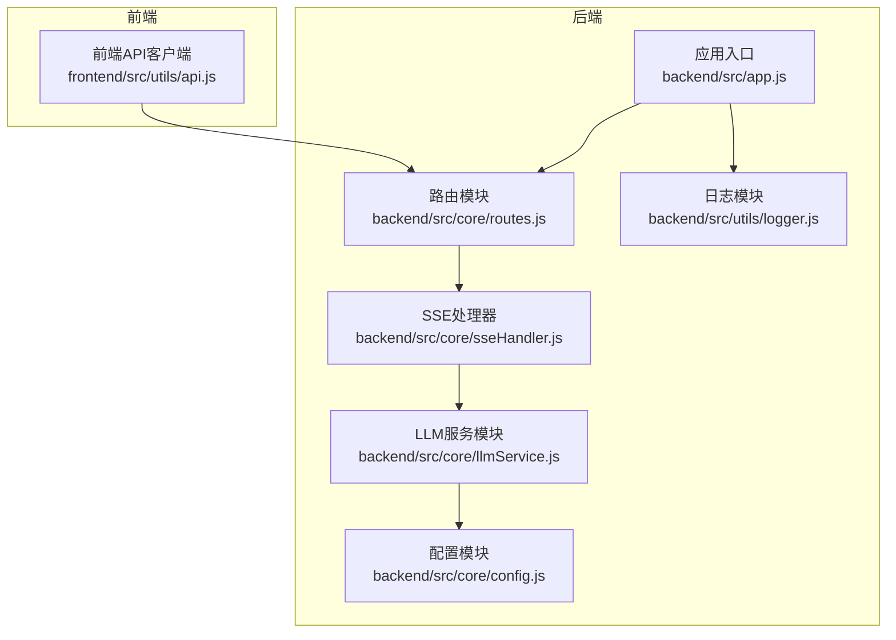
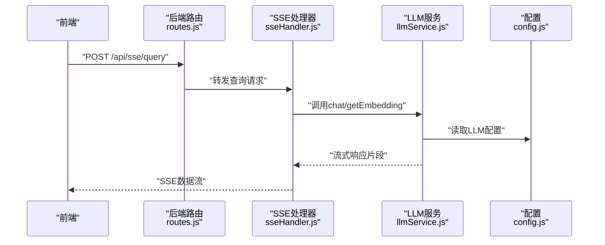
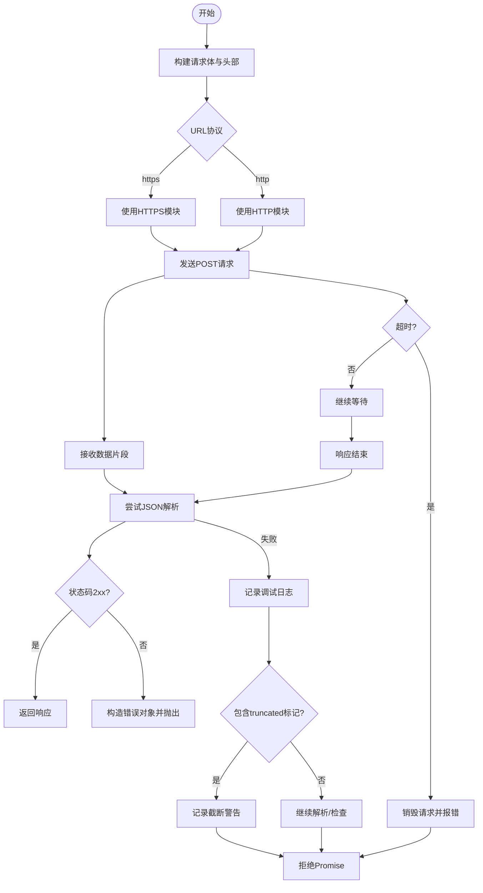
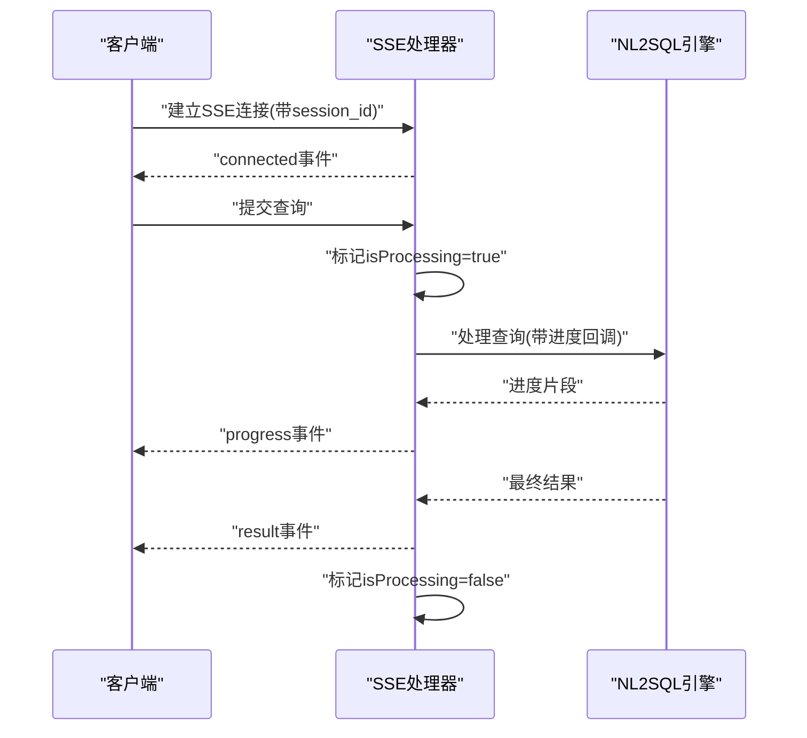
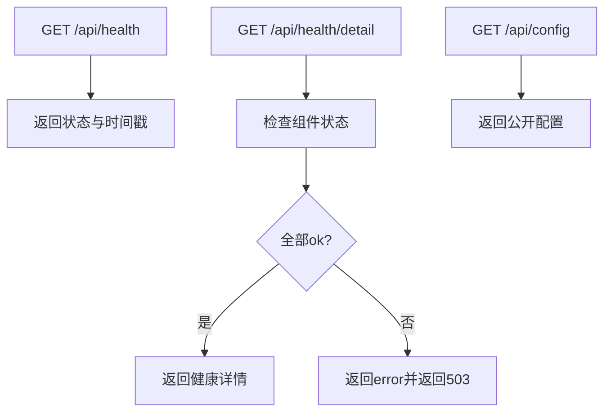
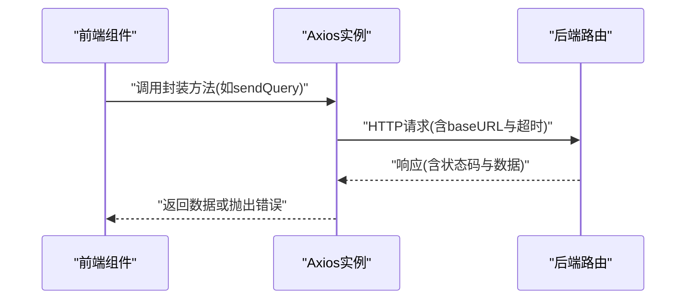
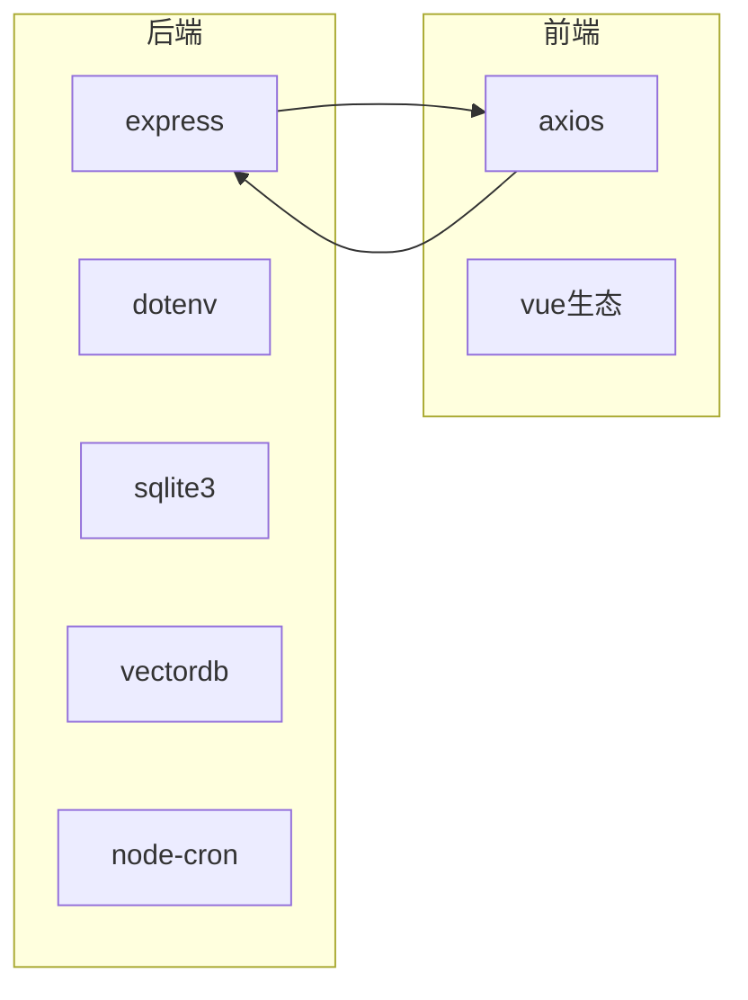

# 外部API集成

<cite>
**本文引用的文件**
- [backend/src/app.js](file://backend/src/app.js)
- [backend/src/core/config.js](file://backend/src/core/config.js)
- [backend/src/core/routes.js](file://backend/src/core/routes.js)
- [backend/src/core/llmService.js](file://backend/src/core/llmService.js)
- [backend/src/core/sseHandler.js](file://backend/src/core/sseHandler.js)
- [backend/src/utils/logger.js](file://backend/src/utils/logger.js)
- [backend/package.json](file://backend/package.json)
- [frontend/src/utils/api.js](file://frontend/src/utils/api.js)
- [frontend/package.json](file://frontend/package.json)
</cite>

## 目录
1. [简介](#简介)
2. [项目结构](#项目结构)
3. [核心组件](#核心组件)
4. [架构总览](#架构总览)
5. [详细组件分析](#详细组件分析)
6. [依赖分析](#依赖分析)
7. [性能考虑](#性能考虑)
8. [故障排除指南](#故障排除指南)
9. [结论](#结论)
10. [附录](#附录)

## 简介
本文件面向NL2SQL项目的外部API集成功能，聚焦后端与第三方LLM服务（如OpenAI、DeepSeek、Azure OpenAI等）的对接方式，涵盖认证机制、请求格式、响应处理、重试与超时、错误恢复、限流与配额管理、安全传输（HTTPS）、以及常见外部服务集成示例与测试策略。文档基于仓库现有实现进行总结与扩展说明，帮助开发者在不引入额外外部依赖的前提下，安全、稳定地集成第三方API。

## 项目结构
后端采用Express框架提供REST API与SSE流式输出，前端通过Axios封装统一的HTTP客户端。外部API集成的关键实现集中在LLM服务模块与配置模块中，SSE处理器负责将LLM流式响应推送给前端。

**图表来源**
- [backend/src/app.js:1-238](file://backend/src/app.js#L1-L238)
- [backend/src/core/routes.js:1-800](file://backend/src/core/routes.js#L1-L800)
- [backend/src/core/sseHandler.js:1-349](file://backend/src/core/sseHandler.js#L1-L349)
- [backend/src/core/llmService.js:1-432](file://backend/src/core/llmService.js#L1-L432)
- [backend/src/core/config.js:1-372](file://backend/src/core/config.js#L1-L372)
- [frontend/src/utils/api.js:1-252](file://frontend/src/utils/api.js#L1-L252)

**章节来源**
- [backend/src/app.js:1-238](file://backend/src/app.js#L1-L238)
- [backend/src/core/routes.js:1-800](file://backend/src/core/routes.js#L1-L800)
- [frontend/src/utils/api.js:1-252](file://frontend/src/utils/api.js#L1-L252)

## 核心组件
- 配置模块：集中管理LLM API基础地址、密钥、模型、超时、重试等参数，并在启动时校验必要配置。
- LLM服务模块：封装HTTP(S)请求、重试机制、超时控制、错误解析与日志记录，支持聊天与Embedding两类API。
- SSE处理器：管理SSE连接、进度回调、错误广播与连接统计，驱动LLM流式响应的实时推送。
- 路由模块：提供健康检查、Schema查询、会话管理、查询历史、统计信息、配置读取等REST接口。
- 前端API客户端：统一的Axios实例，设置基础URL、超时、请求/响应拦截器，屏蔽跨域与认证细节。

**章节来源**
- [backend/src/core/config.js:1-372](file://backend/src/core/config.js#L1-L372)
- [backend/src/core/llmService.js:1-432](file://backend/src/core/llmService.js#L1-L432)
- [backend/src/core/sseHandler.js:1-349](file://backend/src/core/sseHandler.js#L1-L349)
- [backend/src/core/routes.js:1-800](file://backend/src/core/routes.js#L1-L800)
- [frontend/src/utils/api.js:1-252](file://frontend/src/utils/api.js#L1-L252)

## 架构总览
后端通过路由暴露REST接口，SSE端点用于流式推送；LLM服务模块负责与第三方LLM API通信，遵循OpenAI风格的请求/响应格式。前端通过Axios发起请求，SSE连接实时接收流式结果。

**图表来源**
- [backend/src/core/routes.js:1-800](file://backend/src/core/routes.js#L1-L800)
- [backend/src/core/sseHandler.js:1-349](file://backend/src/core/sseHandler.js#L1-L349)
- [backend/src/core/llmService.js:1-432](file://backend/src/core/llmService.js#L1-L432)
- [backend/src/core/config.js:1-372](file://backend/src/core/config.js#L1-L372)

## 详细组件分析

### LLM服务模块（外部API对接核心）
- 认证机制：通过请求头Authorization携带Bearer Token，令牌来源于配置模块的LLM API密钥。
- 请求格式：支持聊天补全与Embedding两种端点，请求体包含模型名、消息数组、最大token、温度、是否流式等参数。
- 响应处理：解析JSON响应，对HTTP状态码进行判定；对流式响应进行片段拼接与错误定位。
- 重试与超时：封装withRetry与sleep，支持最大重试次数与指数退避；请求超时由配置模块统一设定。
- 错误恢复：捕获网络错误、解析失败、代理截断等场景，记录详细日志并抛出可识别的错误对象。
- 安全传输：根据URL协议自动选择http或https模块，确保HTTPS请求的安全性。

**图表来源**
- [backend/src/core/llmService.js:30-152](file://backend/src/core/llmService.js#L30-L152)
- [backend/src/core/llmService.js:158-206](file://backend/src/core/llmService.js#L158-L206)

**章节来源**
- [backend/src/core/llmService.js:1-432](file://backend/src/core/llmService.js#L1-L432)
- [backend/src/core/config.js:55-87](file://backend/src/core/config.js#L55-L87)

### SSE处理器（流式推送）
- 连接管理：维护会话ID到连接列表的映射，支持多标签页连接；记录连接建立、关闭与错误事件。
- 查询处理：广播“开始处理”、“进度”、“结果”、“错误”等事件；在处理期间阻塞重复请求。
- 统计功能：提供连接总数、会话连接数与连接列表查询，便于运维监控。

**图表来源**
- [backend/src/core/sseHandler.js:43-112](file://backend/src/core/sseHandler.js#L43-L112)
- [backend/src/core/sseHandler.js:218-280](file://backend/src/core/sseHandler.js#L218-L280)

**章节来源**
- [backend/src/core/sseHandler.js:1-349](file://backend/src/core/sseHandler.js#L1-L349)

### 路由与健康检查（REST接口）
- 健康检查：提供基础健康与详细健康接口，包含数据库、LLM、Schema、SSE连接等组件状态。
- 配置读取：对外暴露公开配置（不含敏感信息），便于前端动态适配。
- 会话与历史：提供会话创建、查询、删除与消息历史读取接口，支撑前端交互。

**图表来源**
- [backend/src/core/routes.js:70-135](file://backend/src/core/routes.js#L70-L135)
- [backend/src/core/routes.js:782-800](file://backend/src/core/routes.js#L782-L800)

**章节来源**
- [backend/src/core/routes.js:1-800](file://backend/src/core/routes.js#L1-L800)

### 前端API客户端（Axios封装）
- 基础配置：baseURL指向后端/api前缀，统一超时时间与Content-Type。
- 请求拦截：预留添加认证token的扩展点（如Bearer Token）。
- 响应拦截：统一处理服务端错误与网络错误，返回标准化错误对象。
- 方法封装：导出健康检查、Schema、会话、查询历史、统计、配置与SSE查询等方法。

**图表来源**
- [frontend/src/utils/api.js:25-88](file://frontend/src/utils/api.js#L25-L88)
- [frontend/src/utils/api.js:246-252](file://frontend/src/utils/api.js#L246-L252)

**章节来源**
- [frontend/src/utils/api.js:1-252](file://frontend/src/utils/api.js#L1-L252)

## 依赖分析
- 后端依赖：Express提供Web服务，dotenv加载环境变量，sqlite3与vectordb用于数据存储，node-cron用于定时任务。
- 前端依赖：Axios提供HTTP客户端能力，Vue生态用于界面渲染与状态管理。

**图表来源**
- [backend/package.json:10-20](file://backend/package.json#L10-L20)
- [frontend/package.json:11-29](file://frontend/package.json#L11-L29)

**章节来源**
- [backend/package.json:1-28](file://backend/package.json#L1-L28)
- [frontend/package.json:1-36](file://frontend/package.json#L1-L36)

## 性能考虑
- 超时与重试：LLM与Embedding分别配置独立超时与重试策略，避免单次请求阻塞影响整体吞吐。
- 连接与并发：SSE处理器对同一会话的并发请求进行串行化，防止资源争用；可通过连接数统计进行容量评估。
- 日志与可观测性：统一日志级别与结构化输出，结合健康检查接口便于监控与告警。
- 前端超时：前端Axios设置合理超时，避免长时间挂起占用UI线程。

[本节为通用指导，无需特定文件引用]

## 故障排除指南
- LLM API鉴权失败
  - 现象：HTTP 401/403或响应包含错误信息。
  - 排查：确认配置模块中的LLM API密钥与基础URL正确；检查请求头Authorization是否正确设置。
  - 参考
    - [backend/src/core/llmService.js:248-251](file://backend/src/core/llmService.js#L248-L251)
    - [backend/src/core/config.js:63-64](file://backend/src/core/config.js#L63-L64)

- LLM请求超时
  - 现象：请求在超时时间内未返回。
  - 排查：调整配置模块中的LLM与Embedding超时时间；检查第三方服务可用性与网络连通性。
  - 参考
    - [backend/src/core/llmService.js:263](file://backend/src/core/llmService.js#L263)
    - [backend/src/core/config.js:68-86](file://backend/src/core/config.js#L68-L86)

- SSE连接异常中断
  - 现象：SSE连接被异常终止或进度丢失。
  - 排查：检查代理/网关是否截断长响应；关注日志中“响应被异常终止”的告警。
  - 参考
    - [backend/src/core/llmService.js:93-95](file://backend/src/core/llmService.js#L93-L95)
    - [backend/src/core/sseHandler.js:104-111](file://backend/src/core/sseHandler.js#L104-L111)

- 响应解析失败
  - 现象：JSON解析异常或响应被截断。
  - 排查：查看日志中响应前后片段与truncated标记；确认第三方服务响应大小限制。
  - 参考
    - [backend/src/core/llmService.js:113-130](file://backend/src/core/llmService.js#L113-L130)

- 健康检查失败
  - 现象：/api/health/detail返回error状态。
  - 排查：逐项检查数据库、LLM、Schema与SSE组件状态；根据返回信息定位问题。
  - 参考
    - [backend/src/core/routes.js:98-135](file://backend/src/core/routes.js#L98-L135)

**章节来源**
- [backend/src/core/llmService.js:93-130](file://backend/src/core/llmService.js#L93-L130)
- [backend/src/core/sseHandler.js:104-111](file://backend/src/core/sseHandler.js#L104-L111)
- [backend/src/core/routes.js:98-135](file://backend/src/core/routes.js#L98-L135)

## 结论
NL2SQL项目通过配置模块集中管理外部API参数，LLM服务模块实现统一的认证、请求、响应与错误处理，SSE处理器保障流式体验，前端Axios提供一致的HTTP访问体验。现有实现已具备重试、超时、日志与健康检查等关键能力，满足大多数外部API集成场景。后续可在认证扩展、限流与配额控制、安全传输加固等方面进一步完善。

[本节为总结，无需特定文件引用]

## 附录

### 外部API集成最佳实践清单
- 认证
  - 使用配置模块集中管理密钥与基础URL，避免硬编码。
  - 在LLM服务模块中统一设置Authorization头。
- 请求与响应
  - 明确请求体字段（模型名、消息、最大token、温度、流式标志）。
  - 统一响应解析与错误对象构造，便于前端拦截器处理。
- 重试与超时
  - 为LLM与Embedding分别设置超时与重试策略，避免相互影响。
  - 在SSE处理中对同一会话串行化请求，防止并发冲突。
- 限流与配额
  - 建议在路由层或网关层增加速率限制与并发控制（如每IP/每用户QPS限制）。
  - 对第三方服务的配额进行监控与告警，结合健康检查接口暴露状态。
- 安全传输
  - 严格使用HTTPS，确保请求头与响应数据加密。
  - 对敏感信息（密钥、令牌）进行脱敏记录与最小化暴露。
- 常见服务示例
  - 支付服务：使用网关签名与回调校验，结合本地事务保证一致性。
  - 短信服务：统一模板与签名管理，记录发送状态与失败原因。
  - 邮件服务：使用SMTP/第三方SDK，支持批量发送与退信追踪。
- 测试策略
  - 单元测试：针对LLM服务模块的httpPost、withRetry、chat与getEmbedding进行Mock与断言。
  - 集成测试：通过路由与SSE端点验证端到端流程，覆盖成功、超时、错误等分支。
  - 压力测试：模拟高并发SSE连接与LLM请求，观察超时与重试行为。
  - 安全测试：验证HTTPS、密钥保护与敏感信息脱敏。

[本节为通用指导，无需特定文件引用]