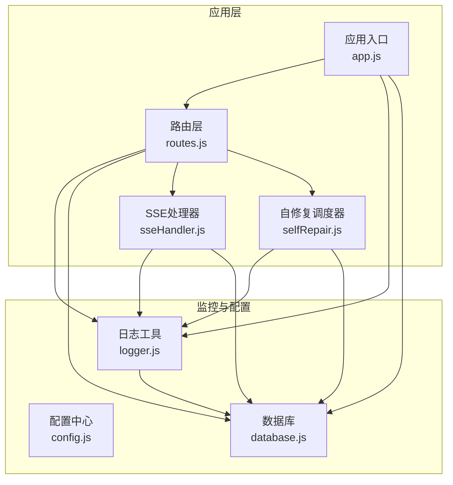
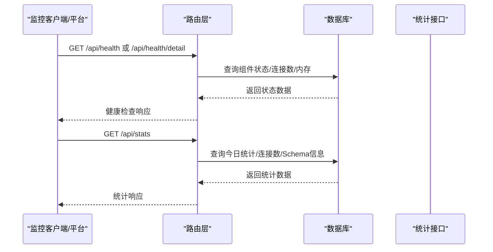
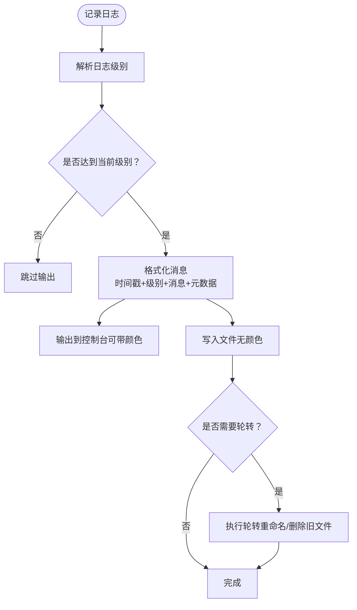
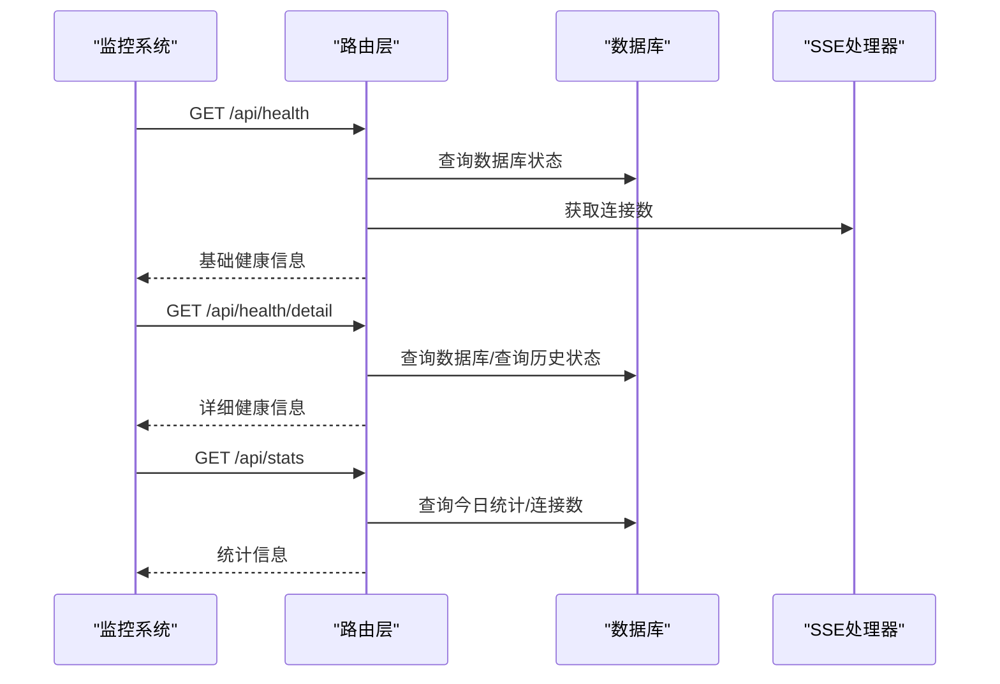
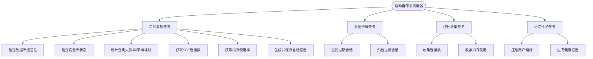
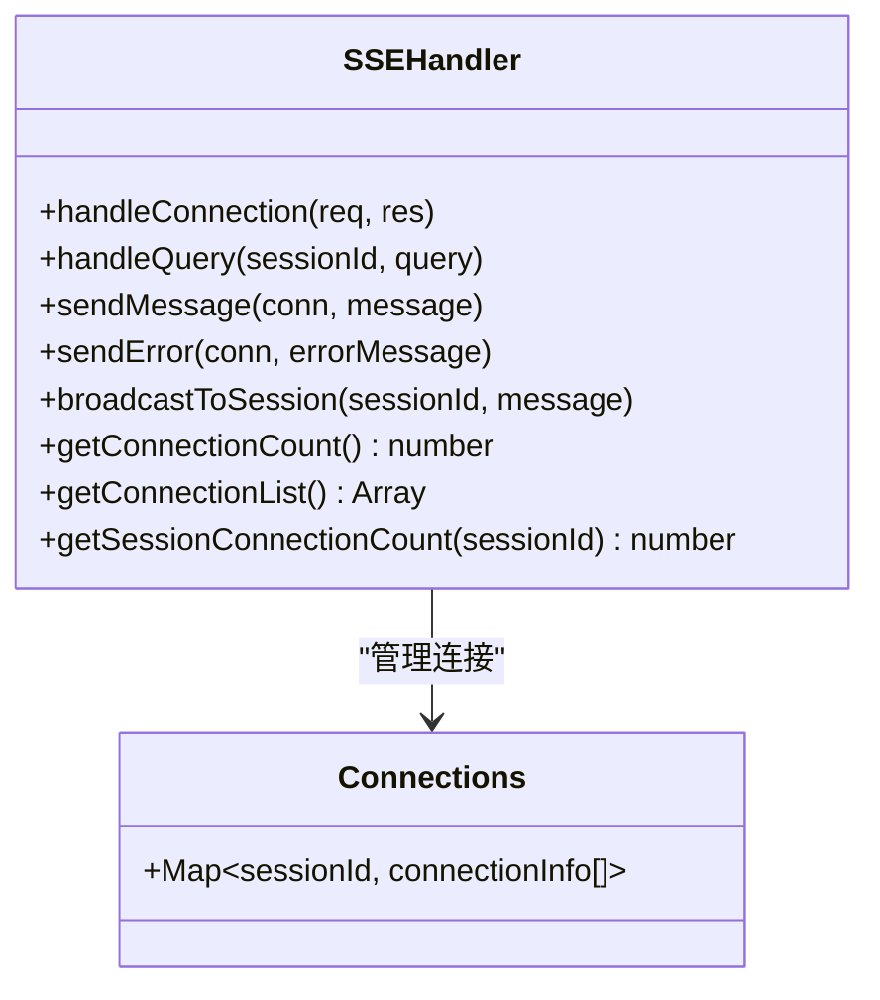
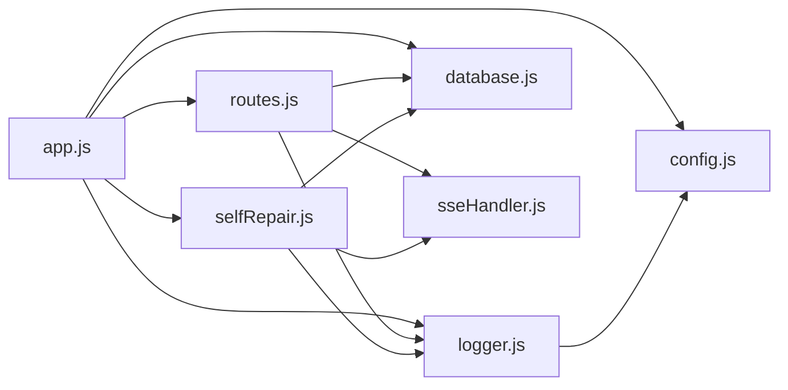

# 监控告警集成

<cite>
**本文档引用的文件**
- [logger.js](file://backend/src/utils/logger.js)
- [config.js](file://backend/src/core/config.js)
- [routes.js](file://backend/src/core/routes.js)
- [selfRepair.js](file://backend/src/core/selfRepair.js)
- [sseHandler.js](file://backend/src/core/sseHandler.js)
- [database.js](file://backend/src/core/database.js)
- [app.js](file://backend/src/app.js)
- [package.json](file://backend/package.json)
</cite>

## 目录
1. [简介](#简介)
2. [项目结构](#项目结构)
3. [核心组件](#核心组件)
4. [架构总览](#架构总览)
5. [详细组件分析](#详细组件分析)
6. [依赖分析](#依赖分析)
7. [性能考虑](#性能考虑)
8. [故障排查指南](#故障排查指南)
9. [结论](#结论)
10. [附录](#附录)

## 简介
本文件面向NL2SQL项目的监控告警集成功能，系统性梳理应用监控体系，覆盖日志配置与轮转、健康检查与统计、自修复与告警机制，并给出与常见监控平台（Prometheus、Grafana、ELK Stack）的对接思路与部署维护建议。文档旨在帮助开发者与运维人员快速理解并落地监控告警方案。

## 项目结构
NL2SQL后端采用模块化设计，监控相关能力主要分布在以下模块：
- 日志工具：统一日志输出、文件轮转、级别控制
- 配置中心：集中管理日志、健康检查、慢查询阈值等监控相关配置
- 路由层：提供健康检查、统计信息等监控接口
- 自修复：定时任务驱动的健康自检、慢查询与失败率分析、资源监控
- SSE处理器：连接数统计、流式进度上报
- 数据库：系统日志表、查询历史表等监控数据载体

图表来源
- [app.js:1-238](file://backend/src/app.js#L1-L238)
- [routes.js:1-800](file://backend/src/core/routes.js#L1-L800)
- [logger.js:1-318](file://backend/src/utils/logger.js#L1-L318)
- [config.js:1-372](file://backend/src/core/config.js#L1-L372)
- [selfRepair.js:1-489](file://backend/src/core/selfRepair.js#L1-L489)
- [sseHandler.js:1-349](file://backend/src/core/sseHandler.js#L1-L349)
- [database.js:1-850](file://backend/src/core/database.js#L1-L850)

章节来源
- [app.js:1-238](file://backend/src/app.js#L1-L238)
- [routes.js:1-800](file://backend/src/core/routes.js#L1-L800)
- [logger.js:1-318](file://backend/src/utils/logger.js#L1-L318)
- [config.js:1-372](file://backend/src/core/config.js#L1-L372)
- [selfRepair.js:1-489](file://backend/src/core/selfRepair.js#L1-L489)
- [sseHandler.js:1-349](file://backend/src/core/sseHandler.js#L1-L349)
- [database.js:1-850](file://backend/src/core/database.js#L1-L850)

## 核心组件
- 日志系统：统一输出到控制台与文件，支持级别过滤、结构化元数据、文件轮转
- 健康检查接口：提供基础健康状态、详细组件状态、内存与连接统计
- 自修复机制：定时任务执行健康自检、慢查询与失败率分析、内存使用评估、会话清理、统计收集
- SSE连接统计：实时连接数、活跃度、错误与进度上报
- 数据库监控表：系统日志、查询历史、用户偏好等，支撑统计与审计

章节来源
- [logger.js:1-318](file://backend/src/utils/logger.js#L1-L318)
- [routes.js:58-135](file://backend/src/core/routes.js#L58-L135)
- [selfRepair.js:60-125](file://backend/src/core/selfRepair.js#L60-L125)
- [sseHandler.js:286-318](file://backend/src/core/sseHandler.js#L286-L318)
- [database.js:39-189](file://backend/src/core/database.js#L39-L189)

## 架构总览
监控体系围绕“采集-存储-查询-告警”闭环构建：
- 采集：日志、健康接口、SSE连接、自修复统计
- 存储：SQLite表（系统日志、查询历史、会话、消息、偏好）
- 查询：路由层提供健康与统计接口，供外部系统拉取
- 告警：基于阈值规则（失败率、慢查询、内存使用、连接数）触发通知

图表来源
- [routes.js:58-135](file://backend/src/core/routes.js#L58-L135)
- [routes.js:724-771](file://backend/src/core/routes.js#L724-L771)
- [database.js:39-189](file://backend/src/core/database.js#L39-L189)

## 详细组件分析

### 日志系统（logger.js）
- 功能要点
  - 级别控制：DEBUG/INFO/WARN/ERROR，支持动态调整
  - 输出目标：控制台彩色输出、文件输出
  - 文件轮转：按大小轮转、保留历史文件数量
  - 结构化日志：支持附加元数据，便于后续聚合与检索
  - 事件机制：对外发出日志事件，便于扩展监听器
- 关键配置（来自配置中心）
  - 日志级别、文件路径、是否输出到控制台/文件、最大文件大小、历史文件数
- 使用场景
  - 应用启动/关闭、数据库连接、SSE连接、自修复任务、路由请求等均通过统一日志输出

图表来源
- [logger.js:86-204](file://backend/src/utils/logger.js#L86-L204)
- [config.js:195-208](file://backend/src/core/config.js#L195-L208)

章节来源
- [logger.js:1-318](file://backend/src/utils/logger.js#L1-L318)
- [config.js:195-208](file://backend/src/core/config.js#L195-L208)

### 健康检查与统计（routes.js）
- 健康检查
  - 基础健康：返回服务状态、版本、运行时长、内存占用
  - 详细健康：数据库、LLM配置、Schema加载、SSE连接数
- 统计信息
  - 今日查询统计（总数、成功/失败、平均执行时间）
  - 连接数（SSE）
  - Schema规模（表/指标/维度）
  - 系统信息（运行时长、内存、Node版本）

图表来源
- [routes.js:58-135](file://backend/src/core/routes.js#L58-L135)
- [routes.js:724-771](file://backend/src/core/routes.js#L724-L771)
- [database.js:39-189](file://backend/src/core/database.js#L39-L189)
- [sseHandler.js:286-318](file://backend/src/core/sseHandler.js#L286-L318)

章节来源
- [routes.js:58-135](file://backend/src/core/routes.js#L58-L135)
- [routes.js:724-771](file://backend/src/core/routes.js#L724-L771)

### 自修复与告警（selfRepair.js）
- 定时任务
  - 每日自检：数据库连通性、向量库状态、查询失败率与慢查询、活跃连接、内存使用
  - 会话清理：过期会话归档
  - 统计收集：连接数与内存使用（debug级别）
  - 记忆维护：用户偏好压缩与健康报告
- 告警规则（基于阈值）
  - 失败率阈值：当日查询失败率高于阈值触发告警
  - 慢查询阈值：平均执行时间超过阈值触发告警
  - 内存使用阈值：堆使用率超过阈值触发告警
  - 连接数异常：SSE连接数异常波动
- 报告与记录
  - 每日自检报告写入系统日志表，便于后续审计与可视化

图表来源
- [selfRepair.js:60-125](file://backend/src/core/selfRepair.js#L60-L125)
- [selfRepair.js:169-310](file://backend/src/core/selfRepair.js#L169-L310)
- [selfRepair.js:341-373](file://backend/src/core/selfRepair.js#L341-L373)
- [selfRepair.js:425-445](file://backend/src/core/selfRepair.js#L425-L445)
- [selfRepair.js:383-415](file://backend/src/core/selfRepair.js#L383-L415)

章节来源
- [selfRepair.js:1-489](file://backend/src/core/selfRepair.js#L1-L489)
- [config.js:217-226](file://backend/src/core/config.js#L217-L226)

### SSE连接统计（sseHandler.js）
- 连接管理：活跃连接映射、连接建立/关闭/错误处理
- 统计接口：获取全局连接数、会话连接数、连接列表
- 与自修复联动：每日自检与统计收集均依赖连接数统计

图表来源
- [sseHandler.js:36-112](file://backend/src/core/sseHandler.js#L36-L112)
- [sseHandler.js:286-318](file://backend/src/core/sseHandler.js#L286-L318)

章节来源
- [sseHandler.js:1-349](file://backend/src/core/sseHandler.js#L1-L349)

### 数据库监控表（database.js）
- 表结构
  - sessions/messages/query_history/user_preferences/system_logs
- 监控用途
  - system_logs：系统日志、自检报告、错误信息
  - query_history：查询统计（成功/失败、耗时、行数）
  - sessions/messages：会话与消息历史，辅助定位问题
- 查询与统计
  - 路由层通过查询历史表计算今日统计
  - 自修复通过查询历史表计算失败率与平均耗时

章节来源
- [database.js:39-189](file://backend/src/core/database.js#L39-L189)
- [routes.js:724-771](file://backend/src/core/routes.js#L724-L771)
- [selfRepair.js:216-250](file://backend/src/core/selfRepair.js#L216-L250)

## 依赖分析
- 模块耦合
  - app.js 作为入口，串联配置、日志、数据库、向量存储、路由与自修复
  - routes.js 依赖 logger、config、database、sseHandler
  - selfRepair.js 依赖 cron、config、logger、database、vectorStore、sseHandler
  - sseHandler.js 依赖 logger、database、nl2sqlEngine
  - logger.js 依赖 config
- 外部依赖
  - node-cron：定时任务
  - sqlite3：本地数据库
  - dotenv：环境变量加载

图表来源
- [app.js:39-51](file://backend/src/app.js#L39-L51)
- [routes.js:16-27](file://backend/src/core/routes.js#L16-L27)
- [selfRepair.js:15-26](file://backend/src/core/selfRepair.js#L15-L26)
- [logger.js:15-22](file://backend/src/utils/logger.js#L15-L22)

章节来源
- [app.js:1-238](file://backend/src/app.js#L1-L238)
- [package.json:10-23](file://backend/package.json#L10-L23)

## 性能考虑
- 日志性能
  - 文件轮转在写入前检查大小，避免频繁IO
  - debug级别统计信息仅记录，避免生产环境日志膨胀
- 健康检查
  - 详细健康检查涉及多组件查询，建议在监控系统中降低拉取频率
- 自修复任务
  - 统计收集任务使用debug级别，避免频繁写入
  - 慢查询与失败率阈值需结合业务负载合理设置
- SSE连接
  - 连接数统计为常驻内存映射，注意连接泄漏与异常关闭处理

## 故障排查指南
- 启动失败
  - 检查必要配置（LLM API密钥、SR数据库URL）是否设置
  - 查看日志文件与控制台输出，定位初始化阶段错误
- 健康检查异常
  - 详细健康检查返回error时，关注数据库、Schema加载、SSE连接状态
- 查询失败率升高
  - 检查LLM API可用性、SQL生成逻辑、目标数据库性能
- 内存使用过高
  - 观察每日自检报告中的内存使用率，必要时重启服务
- SSE连接异常
  - 检查连接建立/关闭/错误回调日志，确认会话有效性

章节来源
- [config.js:340-362](file://backend/src/core/config.js#L340-L362)
- [app.js:160-165](file://backend/src/app.js#L160-L165)
- [routes.js:98-135](file://backend/src/core/routes.js#L98-L135)
- [selfRepair.js:169-310](file://backend/src/core/selfRepair.js#L169-L310)
- [sseHandler.js:119-153](file://backend/src/core/sseHandler.js#L119-L153)

## 结论
NL2SQL项目已具备完善的监控基础：统一日志、健康检查接口、SSE连接统计、自修复与统计收集。建议在此基础上引入外部监控平台，将健康与统计接口接入Prometheus/Grafana，将日志接入ELK/EFK，形成“采集-存储-可视化-告警”的闭环，进一步提升可观测性与运维效率。

## 附录

### 监控指标定义与采集清单
- 基础指标
  - 服务状态：/api/health
  - 详细状态：/api/health/detail
  - 运行时长：process.uptime()
  - 内存使用：heapUsed/heapTotal/rss
- 查询指标
  - 今日查询总数、成功数、失败数、平均执行时间
  - 失败率阈值：自修复配置中的slowQueryThreshold与失败率阈值
- 连接指标
  - SSE连接数：getConnectionCount()
  - 会话连接数：getSessionConnectionCount()
- 系统指标
  - 内存使用率：heapUsed/heapTotal
  - 连接数趋势：统计收集任务记录

章节来源
- [routes.js:58-135](file://backend/src/core/routes.js#L58-L135)
- [routes.js:724-771](file://backend/src/core/routes.js#L724-L771)
- [selfRepair.js:425-445](file://backend/src/core/selfRepair.js#L425-L445)
- [sseHandler.js:286-318](file://backend/src/core/sseHandler.js#L286-L318)

### 告警规则配置建议
- 失败率告警
  - 触发条件：当日失败率 > 阈值（如10%）
  - 恢复条件：连续N分钟低于阈值
- 慢查询告警
  - 触发条件：平均执行时间 > 阈值（如5秒）
  - 恢复条件：连续N分钟低于阈值
- 内存使用告警
  - 触发条件：堆使用率 > 阈值（如90%）
  - 恢复条件：连续N分钟低于阈值
- 连接数告警
  - 触发条件：SSE连接数异常波动或持续为0
  - 恢复条件：恢复正常范围

章节来源
- [selfRepair.js:233-246](file://backend/src/core/selfRepair.js#L233-L246)
- [config.js:224-226](file://backend/src/core/config.js#L224-L226)

### 与监控平台集成示例

- Prometheus + Grafana
  - 导出指标：将健康与统计接口封装为Prometheus文本格式端点，或通过Prometheus Pushgateway推送
  - 监控面板：仪表盘展示失败率、慢查询、内存使用、连接数趋势
  - 告警规则：基于PromQL编写告警规则，结合Alertmanager发送通知

- ELK/EFK（Elasticsearch + Logstash + Kibana）
  - 日志采集：将日志文件纳入Filebeat，经Logstash清洗后写入Elasticsearch
  - 可视化：Kibana创建仪表盘，按日志级别、组件、错误类型分析
  - 告警：基于Watchers或Watcher替代方案（如Elastic内置告警）实现阈值告警

- 其他方案
  - OpenTelemetry：采集链路追踪与指标，结合Grafana Loki/Tempo
  - Zabbix/NetData：传统监控平台，适合已有基础设施

[本节为概念性指导，不直接对应具体源码文件]