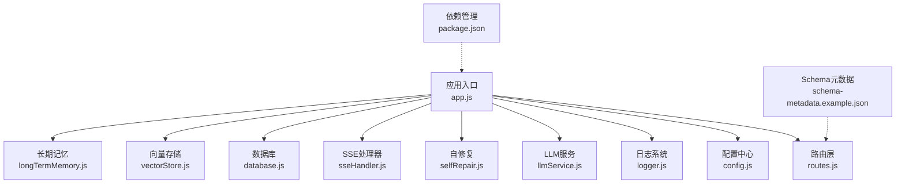
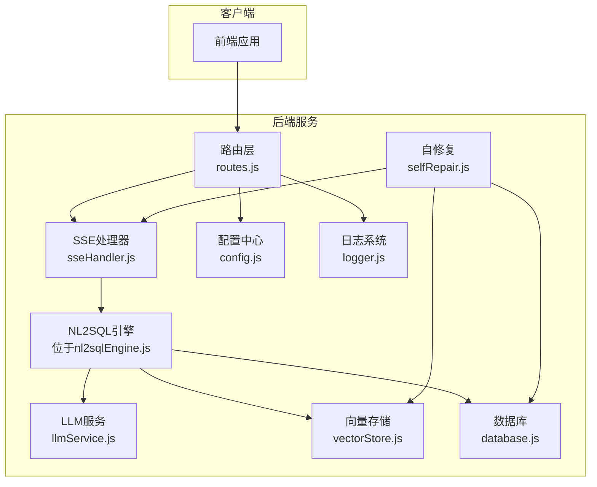
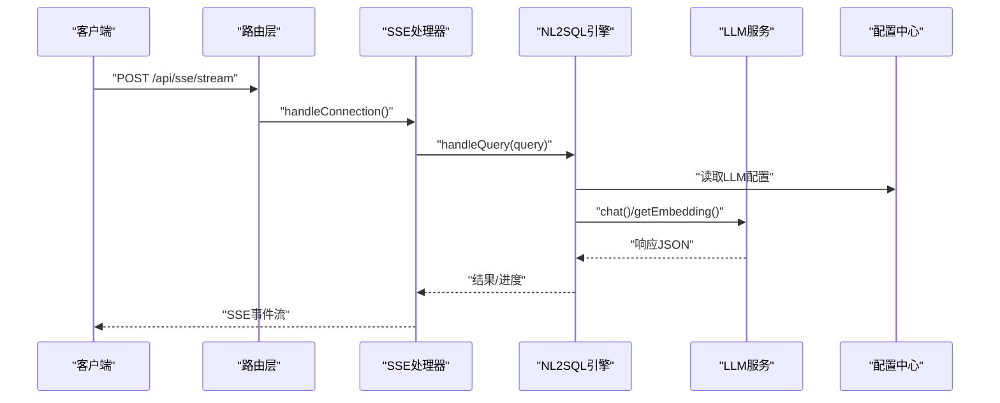
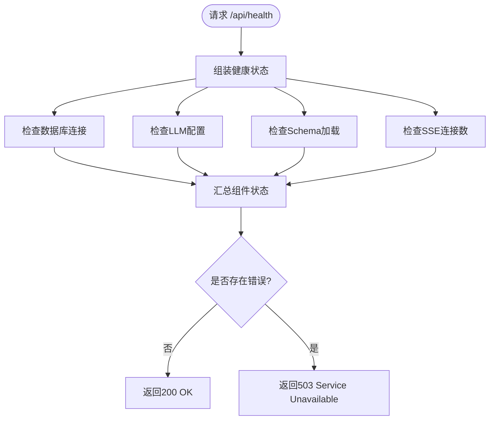
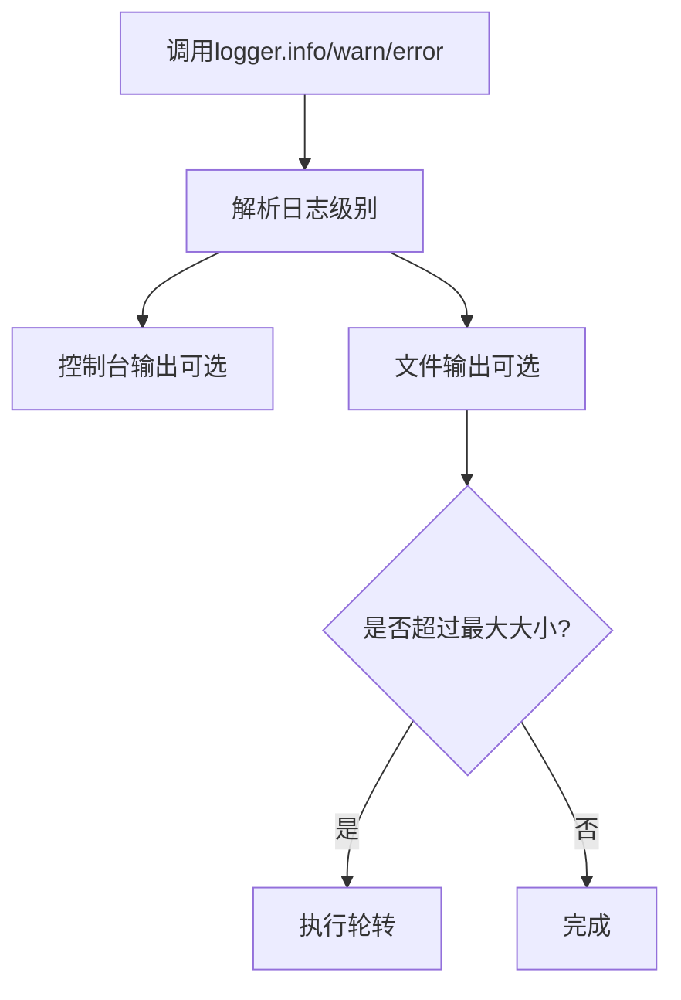
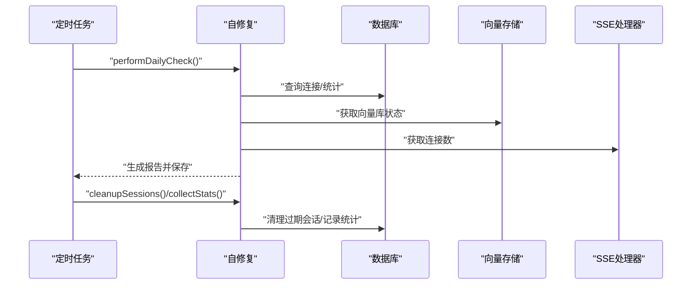
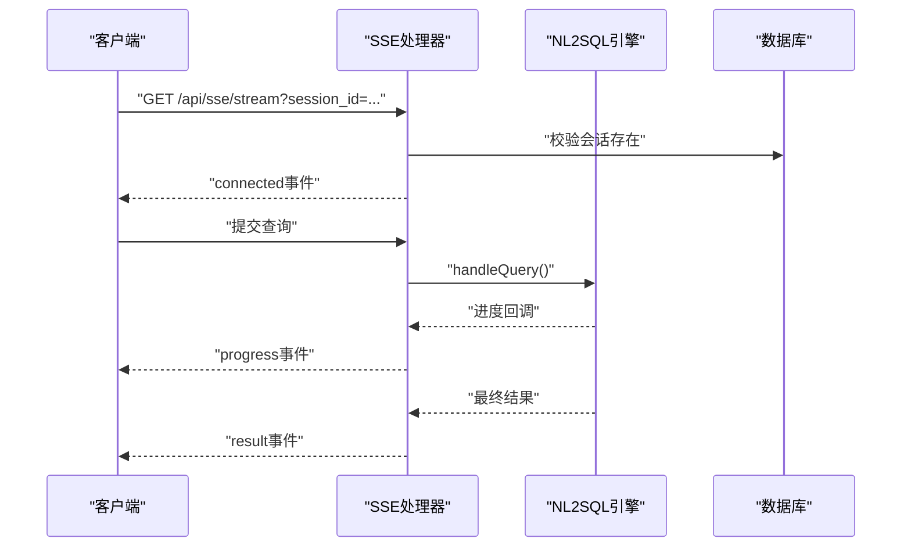
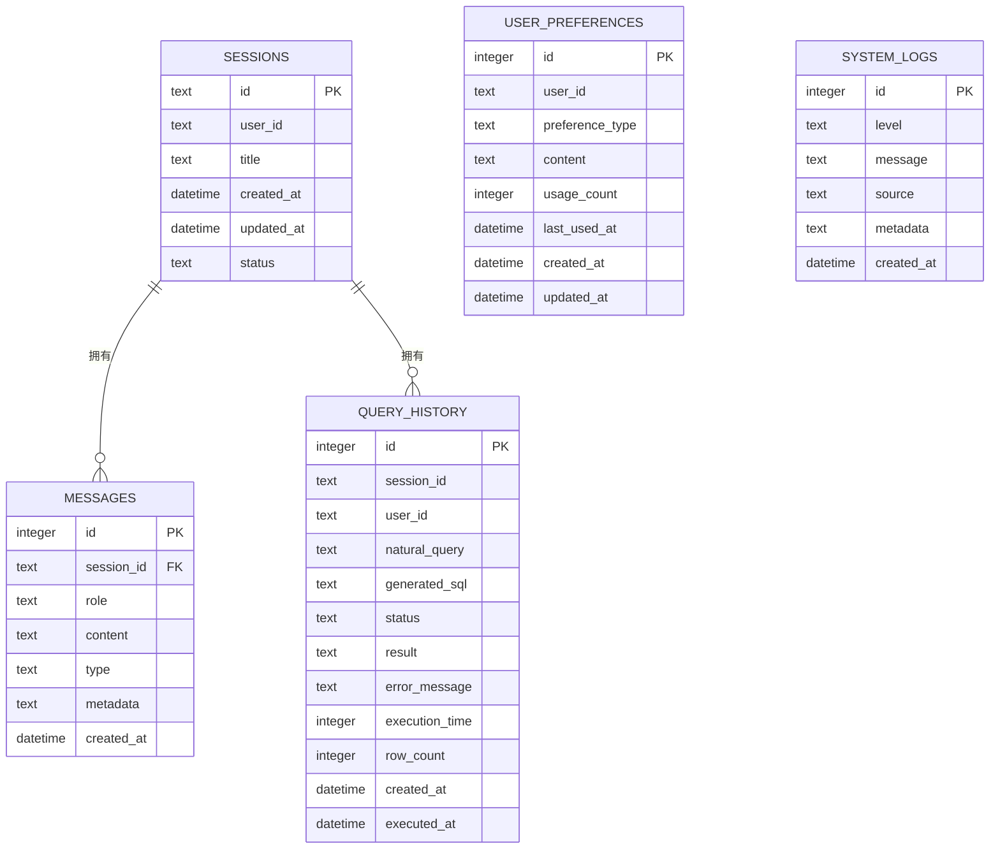
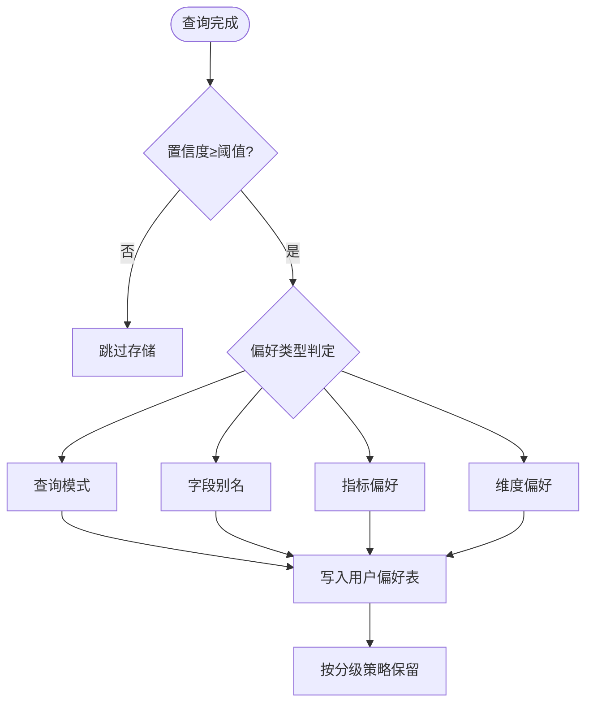
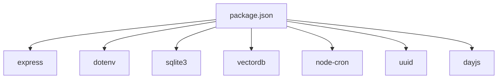

# 第三方服务集成

<cite>
**本文档引用的文件**
- [app.js](file://backend/src/app.js)
- [routes.js](file://backend/src/core/routes.js)
- [config.js](file://backend/src/core/config.js)
- [logger.js](file://backend/src/utils/logger.js)
- [llmService.js](file://backend/src/core/llmService.js)
- [selfRepair.js](file://backend/src/core/selfRepair.js)
- [sseHandler.js](file://backend/src/core/sseHandler.js)
- [database.js](file://backend/src/core/database.js)
- [vectorStore.js](file://backend/src/memory/vectorStore.js)
- [longTermMemory.js](file://backend/src/memory/longTermMemory.js)
- [package.json](file://backend/package.json)
- [schema-metadata.example.json](file://backend/config/schema-metadata.example.json)
</cite>

## 目录
1. [简介](#简介)
2. [项目结构](#项目结构)
3. [核心组件](#核心组件)
4. [架构概览](#架构概览)
5. [详细组件分析](#详细组件分析)
6. [依赖分析](#依赖分析)
7. [性能考虑](#性能考虑)
8. [故障排查指南](#故障排查指南)
9. [结论](#结论)
10. [附录](#附录)

## 简介
本文件面向NL2SQL项目的第三方服务集成功能，系统性阐述如何对接外部服务（如监控、日志、告警、LLM等），涵盖认证机制、API调用、数据同步、服务发现与负载均衡、通信协议与数据格式转换、安全与故障恢复策略。文档基于仓库现有代码进行分析，重点聚焦于LLM服务集成、健康检查、日志与监控、自修复机制以及SSE实时通信。

## 项目结构
后端采用Express框架，模块化组织核心功能：
- 应用入口与生命周期管理：app.js
- REST API路由：core/routes.js
- 配置中心：core/config.js
- 日志系统：utils/logger.js
- LLM服务适配：core/llmService.js
- 自修复与定时任务：core/selfRepair.js
- SSE实时通信：core/sseHandler.js
- 数据持久化：core/database.js
- 向量存储：memory/vectorStore.js
- 长期记忆：memory/longTermMemory.js
- Schema元数据：config/schema-metadata.example.json
- 依赖与脚本：package.json

图表来源
- [app.js:1-238](file://backend/src/app.js#L1-L238)
- [routes.js:1-800](file://backend/src/core/routes.js#L1-L800)
- [config.js:1-332](file://backend/src/core/config.js#L1-L332)
- [logger.js:1-318](file://backend/src/utils/logger.js#L1-L318)
- [llmService.js:1-432](file://backend/src/core/llmService.js#L1-L432)
- [selfRepair.js:1-489](file://backend/src/core/selfRepair.js#L1-L489)
- [sseHandler.js:1-349](file://backend/src/core/sseHandler.js#L1-L349)
- [database.js:1-200](file://backend/src/core/database.js#L1-L200)
- [vectorStore.js:1-200](file://backend/src/memory/vectorStore.js#L1-L200)
- [longTermMemory.js:1-200](file://backend/src/memory/longTermMemory.js#L1-L200)
- [schema-metadata.example.json:1-328](file://backend/config/schema-metadata.example.json#L1-L328)
- [package.json:1-28](file://backend/package.json#L1-L28)

章节来源
- [app.js:1-238](file://backend/src/app.js#L1-L238)
- [routes.js:1-800](file://backend/src/core/routes.js#L1-L800)
- [config.js:1-332](file://backend/src/core/config.js#L1-L332)

## 核心组件
- 配置中心：集中管理端口、LLM API、数据库、安全策略、日志、自修复、Schema等配置，支持环境变量覆盖与默认值。
- LLM服务适配：封装HTTP请求、重试机制、超时控制、认证头（Bearer Token）、OpenAI风格响应解析。
- 日志系统：统一日志级别、控制台与文件输出、自动轮转、结构化日志格式。
- 自修复机制：定时任务（每日自检、会话清理、统计收集、记忆维护），健康检查与问题上报。
- SSE处理器：Server-Sent Events连接管理、消息广播、进度回调、连接统计。
- 数据库与向量存储：SQLite持久化、LanceDB向量检索、Schema与查询历史向量化。
- 长期记忆：用户偏好与查询模式抽取、字段别名学习、分级保留策略。
- 路由与健康检查：/api/health、/api/health/detail、/api/stats等监控端点。

章节来源
- [config.js:1-332](file://backend/src/core/config.js#L1-L332)
- [llmService.js:1-432](file://backend/src/core/llmService.js#L1-L432)
- [logger.js:1-318](file://backend/src/utils/logger.js#L1-L318)
- [selfRepair.js:1-489](file://backend/src/core/selfRepair.js#L1-L489)
- [sseHandler.js:1-349](file://backend/src/core/sseHandler.js#L1-L349)
- [database.js:1-200](file://backend/src/core/database.js#L1-L200)
- [vectorStore.js:1-200](file://backend/src/memory/vectorStore.js#L1-L200)
- [longTermMemory.js:1-200](file://backend/src/memory/longTermMemory.js#L1-L200)
- [routes.js:1-800](file://backend/src/core/routes.js#L1-L800)

## 架构概览
NL2SQL后端通过Express提供REST API与SSE流式通信，核心流程如下：
- 客户端发起查询请求，SSE处理器接收并广播进度与结果。
- 引擎调用LLM服务生成SQL，结合Schema与长期记忆优化意图识别。
- 查询历史与会话信息持久化至SQLite，向量存储用于语义检索。
- 自修复机制定期执行健康检查与维护任务，保障系统稳定性。

图表来源
- [routes.js:1-800](file://backend/src/core/routes.js#L1-L800)
- [sseHandler.js:1-349](file://backend/src/core/sseHandler.js#L1-L349)
- [llmService.js:1-432](file://backend/src/core/llmService.js#L1-L432)
- [vectorStore.js:1-200](file://backend/src/memory/vectorStore.js#L1-L200)
- [database.js:1-200](file://backend/src/core/database.js#L1-L200)
- [config.js:1-332](file://backend/src/core/config.js#L1-L332)
- [logger.js:1-318](file://backend/src/utils/logger.js#L1-L318)
- [selfRepair.js:1-489](file://backend/src/core/selfRepair.js#L1-L489)

## 详细组件分析

### LLM服务集成（认证、API调用、重试与超时）
- 认证机制：通过配置中心读取LLM API密钥，请求头使用Bearer Token。
- API调用：封装HTTP POST，支持JSON请求体与响应解析，自动处理超时与异常。
- 重试与超时：内置withRetry与sleep，支持最大重试次数与延迟配置。
- OpenAI兼容：支持/chat/completions与/embeddings端点，解析choices与data结构。

图表来源
- [routes.js:1-800](file://backend/src/core/routes.js#L1-L800)
- [sseHandler.js:1-349](file://backend/src/core/sseHandler.js#L1-L349)
- [llmService.js:1-432](file://backend/src/core/llmService.js#L1-L432)
- [config.js:1-332](file://backend/src/core/config.js#L1-L332)

章节来源
- [llmService.js:1-432](file://backend/src/core/llmService.js#L1-L432)
- [config.js:1-332](file://backend/src/core/config.js#L1-L332)

### 健康检查与监控（/api/health、/api/health/detail、/api/stats）
- 健康检查：返回服务状态、版本、运行时间、内存使用等。
- 详细健康：包含数据库、LLM、Schema、SSE连接等组件状态。
- 统计信息：今日查询总量、成功率、失败率、平均耗时、连接数、Schema规模、系统资源。

图表来源
- [routes.js:98-135](file://backend/src/core/routes.js#L98-L135)

章节来源
- [routes.js:98-135](file://backend/src/core/routes.js#L98-L135)

### 日志系统与监控集成
- 日志级别：DEBUG/INFO/WARN/ERROR，支持控制台彩色输出与文件落盘。
- 文件轮转：按大小轮转，保留历史文件数量可配置。
- 监控集成：日志可接入外部日志平台（如ELK、Loki），统一采集与分析。

图表来源
- [logger.js:86-204](file://backend/src/utils/logger.js#L86-L204)

章节来源
- [logger.js:1-318](file://backend/src/utils/logger.js#L1-L318)

### 自修复机制与故障恢复
- 定时任务：每日自检、会话清理、统计收集、记忆维护。
- 健康检查：数据库连接、向量数据库状态、查询统计、慢查询阈值、内存使用。
- 故障恢复：记录问题与建议，必要时触发手动维护任务。

图表来源
- [selfRepair.js:60-125](file://backend/src/core/selfRepair.js#L60-L125)
- [selfRepair.js:169-310](file://backend/src/core/selfRepair.js#L169-L310)
- [selfRepair.js:341-373](file://backend/src/core/selfRepair.js#L341-L373)
- [selfRepair.js:425-445](file://backend/src/core/selfRepair.js#L425-L445)

章节来源
- [selfRepair.js:1-489](file://backend/src/core/selfRepair.js#L1-L489)

### SSE实时通信与数据同步
- 连接管理：建立SSE连接、存储连接信息、监听关闭与错误事件。
- 消息广播：向指定会话的所有连接发送消息，支持进度与结果。
- 数据同步：查询处理过程通过回调函数将进度推送给前端，最终结果通过SSE返回。

图表来源
- [sseHandler.js:43-112](file://backend/src/core/sseHandler.js#L43-L112)
- [sseHandler.js:218-280](file://backend/src/core/sseHandler.js#L218-L280)

章节来源
- [sseHandler.js:1-349](file://backend/src/core/sseHandler.js#L1-L349)

### 数据库与向量存储（Schema与查询历史）
- SQLite：会话、消息、查询历史、用户偏好、系统日志等表结构，索引优化查询性能。
- LanceDB：Schema向量表与查询历史向量表，支持向量化检索与相似度搜索。
- 配置：数据库路径、向量库路径、连接池参数、向量维度等。

图表来源
- [database.js:39-189](file://backend/src/core/database.js#L39-L189)

章节来源
- [database.js:1-200](file://backend/src/core/database.js#L1-L200)
- [vectorStore.js:1-200](file://backend/src/memory/vectorStore.js#L1-L200)
- [config.js:97-130](file://backend/src/core/config.js#L97-L130)

### 长期记忆与偏好学习
- 偏好类型：查询模式、字段别名、指标偏好、维度偏好。
- 存储策略：置信度阈值、近期频率、高价值模板（维度数与指标数）。
- LLM智能分析：可选启用，用于区分个人偏好与通用知识，提升记忆质量。

图表来源
- [longTermMemory.js:26-42](file://backend/src/memory/longTermMemory.js#L26-L42)
- [longTermMemory.js:56-188](file://backend/src/memory/longTermMemory.js#L56-L188)

章节来源
- [longTermMemory.js:1-200](file://backend/src/memory/longTermMemory.js#L1-L200)
- [config.js:254-288](file://backend/src/core/config.js#L254-L288)

### Schema元数据与适配
- Schema配置：表、字段、关系、指标、维度等元数据，支持中文名称与描述。
- 适配策略：通过配置文件定义业务Schema，向量存储与检索围绕Schema展开，提升语义理解与查询准确性。

章节来源
- [schema-metadata.example.json:1-328](file://backend/config/schema-metadata.example.json#L1-L328)
- [config.js:235-245](file://backend/src/core/config.js#L235-L245)

## 依赖分析
- Express：Web框架与路由。
- dotenv：环境变量加载。
- sqlite3：SQLite数据库驱动。
- vectordb：LanceDB向量数据库客户端。
- node-cron：定时任务调度。
- uuid/dayjs：工具库。

图表来源
- [package.json:10-27](file://backend/package.json#L10-L27)

章节来源
- [package.json:1-28](file://backend/package.json#L1-L28)

## 性能考虑
- LLM调用：合理设置超时与重试，避免阻塞主线程；对长响应进行截断检测与日志记录。
- 数据库：为高频查询字段建立索引，控制单次查询返回行数上限，避免慢查询。
- 向量检索：Embedding维度与批量处理策略影响性能，建议按需调整。
- SSE：Nginx等反向代理需禁用缓冲，确保实时性。

## 故障排查指南
- LLM API失败：检查API密钥、基础URL、超时与重试配置；查看日志中的响应截断与解析失败信息。
- 健康检查异常：关注数据库连接、向量库初始化、慢查询与内存使用；根据自修复报告定位问题。
- SSE连接异常：确认会话存在、连接数统计、错误事件日志；检查代理配置。
- 日志问题：确认日志级别、文件路径、轮转策略；避免磁盘空间不足。

章节来源
- [llmService.js:135-151](file://backend/src/core/llmService.js#L135-L151)
- [selfRepair.js:169-310](file://backend/src/core/selfRepair.js#L169-L310)
- [sseHandler.js:119-153](file://backend/src/core/sseHandler.js#L119-L153)
- [logger.js:128-160](file://backend/src/utils/logger.js#L128-L160)

## 结论
NL2SQL项目通过模块化的配置中心、统一的日志系统、可扩展的LLM服务适配、完善的自修复与监控机制，形成了稳健的第三方服务集成能力。建议在生产环境中：
- 明确第三方服务的认证与限流策略；
- 建立统一的监控与告警体系；
- 实施服务发现与负载均衡方案；
- 完善故障恢复与数据备份策略。

## 附录
- 环境变量与配置项参考：见配置中心文件。
- Schema元数据示例：见schema-metadata.example.json。
- 依赖清单：见package.json。

章节来源
- [config.js:1-332](file://backend/src/core/config.js#L1-L332)
- [schema-metadata.example.json:1-328](file://backend/config/schema-metadata.example.json#L1-L328)
- [package.json:1-28](file://backend/package.json#L1-L28)