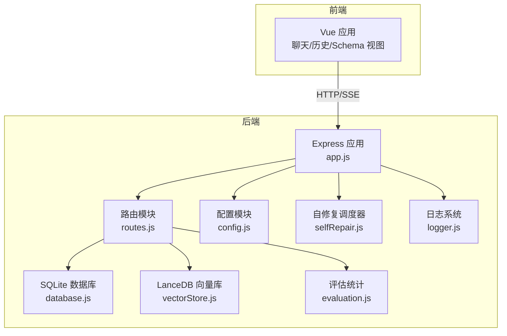
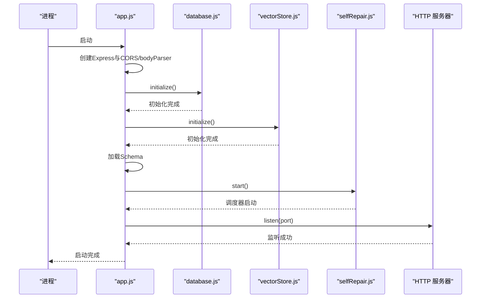
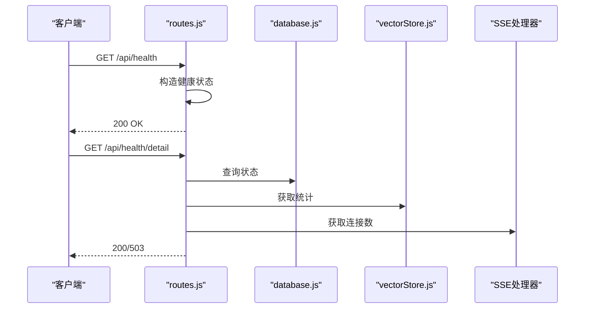
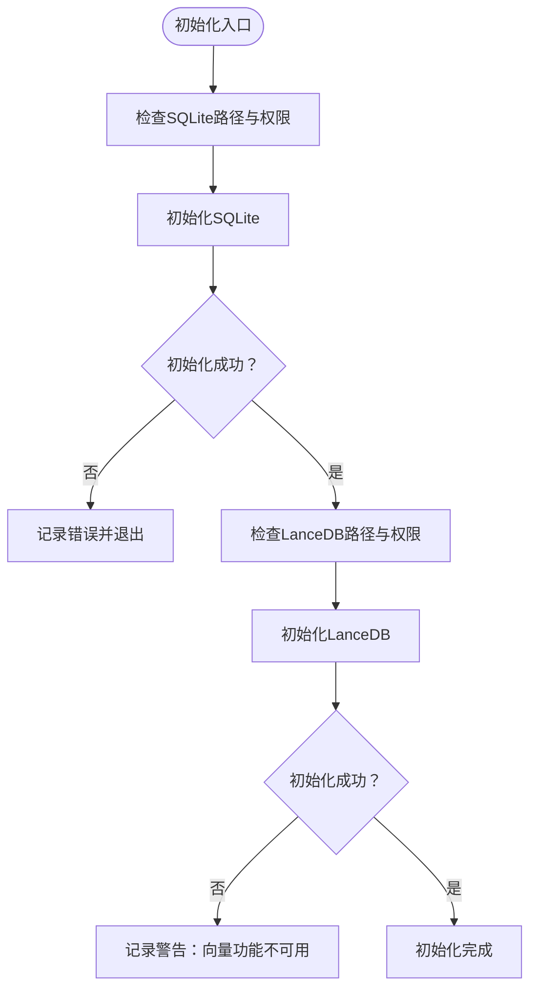
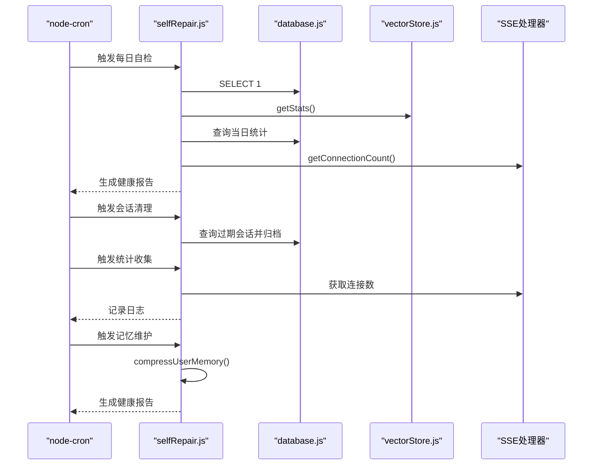
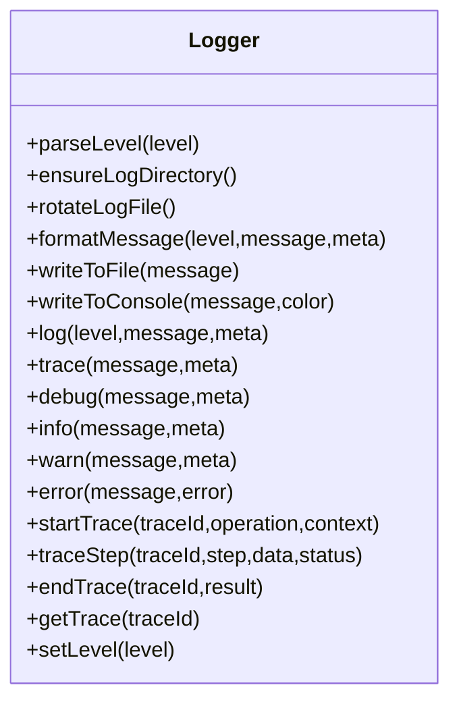
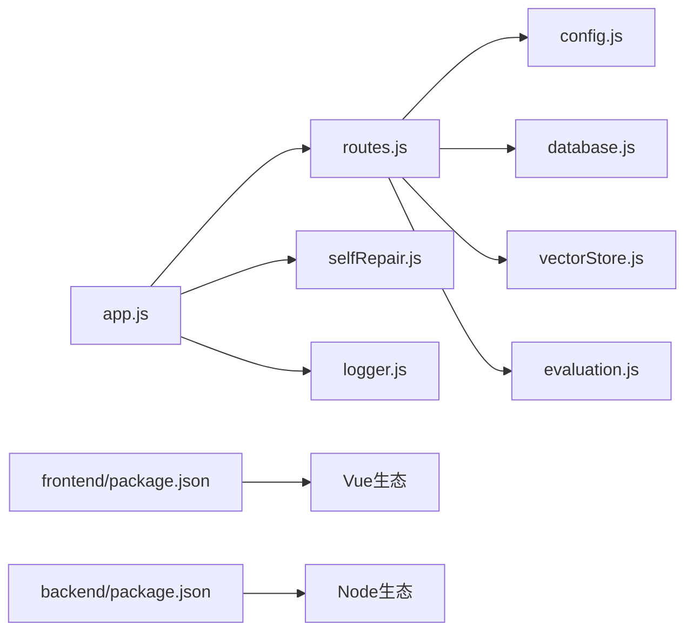

# 故障排除

<cite>
**本文引用的文件**   
- [后端入口 app.js](file://backend/src/app.js)
- [路由 routes.js](file://backend/src/core/routes.js)
- [配置 config.js](file://backend/src/core/config.js)
- [日志 logger.js](file://backend/src/utils/logger.js)
- [自修复 selfRepair.js](file://backend/src/core/selfRepair.js)
- [数据库 database.js](file://backend/src/core/database.js)
- [向量存储 vectorStore.js](file://backend/src/memory/vectorStore.js)
- [NL2SQL 引擎 nl2sqlEngine.js](file://backend/src/core/nl2sqlEngine.js)
- [评估 evaluation.js](file://backend/src/utils/evaluation.js)
- [前端 package.json](file://frontend/package.json)
- [后端 package.json](file://backend/package.json)
- [进度追踪文档](file://docs/NL2SQL-进度追踪.md)
</cite>

## 目录
1. [简介](#简介)
2. [项目结构](#项目结构)
3. [核心组件](#核心组件)
4. [架构总览](#架构总览)
5. [详细组件分析](#详细组件分析)
6. [依赖分析](#依赖分析)
7. [性能考虑](#性能考虑)
8. [故障排除指南](#故障排除指南)
9. [结论](#结论)
10. [附录](#附录)

## 简介
本指南面向运维与开发人员，聚焦 NL2SQL 项目的故障排除实践，覆盖启动失败、连接问题、性能瓶颈与功能异常的诊断与修复路径。内容基于后端 Express 服务、SQLite 与 LanceDB 数据存储、向量检索、自修复机制与日志体系，结合前端交互与评估统计能力，提供系统化的排查流程、日志分析方法、错误代码解读与调试技巧，并给出监控指标、告警机制与性能分析工具建议。

## 项目结构
NL2SQL 采用前后端分离架构：
- 后端：Node.js + Express，提供 REST API、SSE 流式响应、自修复与日志。
- 前端：Vue3 + Element Plus，负责聊天界面、Schema 查看与历史记录。
- 数据层：SQLite 存储会话与查询历史，LanceDB 存储向量化的 Schema 与查询历史。
- 评估与监控：运行时统计、健康检查、慢查询阈值与内存使用监控。

**图表来源**
- [后端入口 app.js:1-238](file://backend/src/app.js#L1-L238)
- [路由 routes.js:1-1037](file://backend/src/core/routes.js#L1-L1037)
- [配置 config.js:1-398](file://backend/src/core/config.js#L1-L398)
- [数据库 database.js:1-850](file://backend/src/core/database.js#L1-L850)
- [向量存储 vectorStore.js:1-759](file://backend/src/memory/vectorStore.js#L1-L759)
- [自修复 selfRepair.js:1-489](file://backend/src/core/selfRepair.js#L1-L489)
- [日志 logger.js:1-442](file://backend/src/utils/logger.js#L1-L442)
- [评估 evaluation.js:1-488](file://backend/src/utils/evaluation.js#L1-L488)

**章节来源**
- [后端入口 app.js:1-238](file://backend/src/app.js#L1-L238)
- [前端 package.json:1-36](file://frontend/package.json#L1-L36)
- [后端 package.json:1-28](file://backend/package.json#L1-L28)

## 核心组件
- 启动与生命周期：后端入口负责加载环境变量、初始化数据库与向量库、挂载路由、启动 HTTP 与 SSE、注册优雅关闭与未处理异常处理。
- 路由与健康检查：提供 /api/health、/api/health/detail、Schema 查询、会话管理、查询历史、偏好与评估接口。
- 配置中心：集中管理 LLM API、数据库、安全策略、日志、自修复、Schema 与长期记忆等配置。
- 数据与向量：SQLite 存储会话与历史；LanceDB 存储向量，支持语义检索与智能重排序。
- 自修复：定时任务执行每日健康检查、会话清理、统计收集与记忆维护。
- 日志：统一日志级别、文件轮转、结构化输出与执行追踪（trace）。
- 评估：运行时统计向量检索命中与记忆命中，支持重置与质量评估。

**章节来源**
- [后端入口 app.js:97-166](file://backend/src/app.js#L97-L166)
- [路由 routes.js:60-137](file://backend/src/core/routes.js#L60-L137)
- [配置 config.js:16-398](file://backend/src/core/config.js#L16-L398)
- [数据库 database.js:200-261](file://backend/src/core/database.js#L200-L261)
- [向量存储 vectorStore.js:231-261](file://backend/src/memory/vectorStore.js#L231-L261)
- [自修复 selfRepair.js:60-125](file://backend/src/core/selfRepair.js#L60-L125)
- [日志 logger.js:54-442](file://backend/src/utils/logger.js#L54-L442)
- [评估 evaluation.js:19-61](file://backend/src/utils/evaluation.js#L19-L61)

## 架构总览
后端服务启动顺序与关键依赖如下：
- 初始化数据目录 → SQLite 初始化 → LanceDB 初始化 → Schema 加载 → 自修复调度器启动 → HTTP 服务器启动。
- 路由层对数据库、向量库与评估模块进行调用，日志贯穿所有关键路径。
- 自修复模块定期执行健康检查、会话清理与统计收集，保障系统稳定性。

**图表来源**
- [后端入口 app.js:97-166](file://backend/src/app.js#L97-L166)
- [数据库 database.js:200-261](file://backend/src/core/database.js#L200-L261)
- [向量存储 vectorStore.js:231-261](file://backend/src/memory/vectorStore.js#L231-L261)
- [自修复 selfRepair.js:60-125](file://backend/src/core/selfRepair.js#L60-L125)

## 详细组件分析

### 启动与健康检查
- 启动失败排查要点：
  - 环境变量缺失：LLM API 密钥与 SR 数据库连接 URL 必须配置，否则启动即报错。
  - 数据目录与文件权限：确保 data 目录可写，SQLite 与 LanceDB 路径存在且可访问。
  - 端口占用：默认端口 3000 若被占用，需调整 PORT。
- 健康检查：
  - /api/health：返回服务状态、版本、运行时长与内存使用。
  - /api/health/detail：包含数据库、LLM、Schema、SSE 连接等组件状态，任一异常返回 503。

**图表来源**
- [路由 routes.js:72-137](file://backend/src/core/routes.js#L72-L137)
- [数据库 database.js:200-261](file://backend/src/core/database.js#L200-L261)
- [向量存储 vectorStore.js:653-683](file://backend/src/memory/vectorStore.js#L653-L683)

**章节来源**
- [后端入口 app.js:97-166](file://backend/src/app.js#L97-L166)
- [路由 routes.js:72-137](file://backend/src/core/routes.js#L72-L137)
- [配置 config.js:366-398](file://backend/src/core/config.js#L366-L398)

### 数据库与向量存储
- SQLite 初始化失败：
  - 检查 DB_PATH 路径是否存在与权限，确认 SQLite 文件可读写。
  - 关注外键约束启用与迁移逻辑，若迁移失败需人工介入修复表结构。
- LanceDB 初始化失败：
  - 检查 VECTOR_DB_PATH 是否存在与权限，确认 Lancedb 可连接。
  - 若未初始化，语义搜索功能将降级为无结果，不影响传统查询。
- 向量检索：
  - 智能搜索支持按查询意图重排序，失败时回退至普通搜索。
  - 记录向量检索统计，可用于评估质量与命中率。

**图表来源**
- [后端入口 app.js:108-127](file://backend/src/app.js#L108-L127)
- [数据库 database.js:200-261](file://backend/src/core/database.js#L200-L261)
- [向量存储 vectorStore.js:231-261](file://backend/src/memory/vectorStore.js#L231-L261)

**章节来源**
- [数据库 database.js:200-336](file://backend/src/core/database.js#L200-L336)
- [向量存储 vectorStore.js:231-322](file://backend/src/memory/vectorStore.js#L231-L322)
- [自修复 selfRepair.js:169-310](file://backend/src/core/selfRepair.js#L169-L310)

### 自修复与定时任务
- 每日自检：检查数据库连接、向量库状态、当日查询统计（失败率、平均耗时）、活跃连接与系统内存，生成健康报告并落库。
- 会话清理：按过期时间归档活跃会话，避免历史堆积。
- 统计收集：周期性记录连接数与内存使用，便于趋势分析。
- 记忆维护：压缩与清理长期记忆，生成健康报告。

**图表来源**
- [自修复 selfRepair.js:60-159](file://backend/src/core/selfRepair.js#L60-L159)
- [自修复 selfRepair.js:169-310](file://backend/src/core/selfRepair.js#L169-L310)
- [自修复 selfRepair.js:341-373](file://backend/src/core/selfRepair.js#L341-L373)
- [自修复 selfRepair.js:425-445](file://backend/src/core/selfRepair.js#L425-L445)
- [自修复 selfRepair.js:383-415](file://backend/src/core/selfRepair.js#L383-L415)

**章节来源**
- [自修复 selfRepair.js:60-125](file://backend/src/core/selfRepair.js#L60-L125)
- [自修复 selfRepair.js:169-310](file://backend/src/core/selfRepair.js#L169-L310)
- [自修复 selfRepair.js:341-415](file://backend/src/core/selfRepair.js#L341-L415)

### 日志与追踪
- 日志级别：TRACE > DEBUG > INFO > WARN > ERROR，可通过 LOG_LEVEL 调整。
- 文件轮转：按 maxSize 与 maxFiles 自动轮转，避免日志过大。
- 结构化输出：统一格式，包含时间戳、级别、消息与元数据。
- 执行追踪：支持 trace/startTrace/traceStep/endTrace，便于深度调试 NL2SQL 流程。

**图表来源**
- [日志 logger.js:54-442](file://backend/src/utils/logger.js#L54-L442)

**章节来源**
- [日志 logger.js:29-442](file://backend/src/utils/logger.js#L29-L442)

### 评估与监控
- 运行时统计：记录向量检索命中、距离分布与长期记忆命中率。
- 评估接口：/api/evaluation/stats 与 /api/evaluation/stats/reset，支持质量评估与重置。
- 阈值与开关：EVALUATION_ENABLED/EVALUATION_TRACK_STATS 控制评估功能与统计记录。

**章节来源**
- [评估 evaluation.js:19-122](file://backend/src/utils/evaluation.js#L19-L122)
- [路由 routes.js:726-760](file://backend/src/core/routes.js#L726-L760)

## 依赖分析
- 后端依赖：Express、sqlite3、vectordb、dotenv、cors、body-parser、uuid、dayjs、node-cron。
- 前端依赖：Vue3、Element Plus、Axios、Pinia、Vue Router、ECharts、Mermaid 等。
- 关键耦合点：路由依赖数据库与向量库；自修复依赖数据库、向量库与 SSE；日志贯穿所有模块。

**图表来源**
- [后端 package.json:10-22](file://backend/package.json#L10-L22)
- [前端 package.json:11-28](file://frontend/package.json#L11-L28)

**章节来源**
- [后端 package.json:10-22](file://backend/package.json#L10-L22)
- [前端 package.json:11-28](file://frontend/package.json#L11-L28)

## 性能考虑
- 查询超时与行数限制：通过配置项限制单次查询返回行数与超时时间，避免大查询导致内存与响应问题。
- 慢查询阈值：自修复每日检查记录平均执行时间，超过阈值触发建议操作。
- 内存使用：关注 heapUsed/heapTotal/rss，过高时建议重启或优化。
- 向量检索：智能搜索与距离分布统计有助于评估检索质量与性能。

**章节来源**
- [配置 config.js:154-170](file://backend/src/core/config.js#L154-L170)
- [自修复 selfRepair.js:243-246](file://backend/src/core/selfRepair.js#L243-L246)
- [日志 logger.js:268-283](file://backend/src/utils/logger.js#L268-L283)

## 故障排除指南

### 一、启动失败
- 症状：启动即退出，日志显示“服务初始化失败”。
- 排查步骤：
  - 检查 .env 或环境变量是否设置 LLM_API_KEY 与 SR_DATABASE_URL。
  - 确认数据目录与数据库/向量库路径存在且可写。
  - 检查端口占用，修改 PORT。
  - 查看日志文件与控制台输出，定位具体初始化失败环节。
- 相关文件：
  - [后端入口 app.js:160-165](file://backend/src/app.js#L160-L165)
  - [配置 config.js:366-398](file://backend/src/core/config.js#L366-L398)

**章节来源**
- [后端入口 app.js:97-166](file://backend/src/app.js#L97-L166)
- [配置 config.js:366-398](file://backend/src/core/config.js#L366-L398)

### 二、连接问题
- 数据库连接失败：
  - 检查 DB_PATH 路径与权限，确认 SQLite 文件可读写。
  - 关注迁移失败日志，必要时备份并重建 user_preferences 表。
- 向量数据库连接失败：
  - 检查 VECTOR_DB_PATH，确认 LanceDB 可连接。
  - 若未初始化，语义搜索降级为无结果。
- SR 数据库连接：
  - 检查 SR_DATABASE_URL 格式与可达性，确认连接池配置合理。
- 健康检查异常：
  - 使用 /api/health/detail 查看组件状态，定位具体异常。

**章节来源**
- [数据库 database.js:200-336](file://backend/src/core/database.js#L200-L336)
- [向量存储 vectorStore.js:231-261](file://backend/src/memory/vectorStore.js#L231-L261)
- [路由 routes.js:100-137](file://backend/src/core/routes.js#L100-L137)

### 三、性能瓶颈
- 症状：响应缓慢、内存使用高、慢查询增多。
- 排查步骤：
  - 查看 /api/health/detail 中内存使用与慢查询阈值。
  - 检查自修复健康报告中的失败率与平均耗时。
  - 启用评估统计（EVALUATION_TRACK_STATS），观察向量检索命中与距离分布。
  - 调整查询超时与返回行数限制。
- 建议：
  - 适当提高慢查询阈值或优化数据源。
  - 启用长期记忆与向量检索以提升命中率，减少重复生成。

**章节来源**
- [自修复 selfRepair.js:233-246](file://backend/src/core/selfRepair.js#L233-L246)
- [评估 evaluation.js:71-96](file://backend/src/utils/evaluation.js#L71-L96)
- [配置 config.js:154-170](file://backend/src/core/config.js#L154-L170)

### 四、功能异常
- Schema 查询异常：
  - 检查 schema-metadata.json 路径与内容，确认加载成功。
  - 使用 /api/schema 与 /api/schema/search 验证接口可用性。
- 会话与历史异常：
  - 检查 sessions 与 messages 表结构与索引，确认迁移完成。
  - 使用 /api/sessions/* 与 /api/queries/history 验证 CRUD。
- 偏好与记忆异常：
  - 检查 user_preferences 表与索引，确认迁移完成。
  - 使用 /api/preferences/* 验证增删改查。

**章节来源**
- [路由 routes.js:150-250](file://backend/src/core/routes.js#L150-L250)
- [路由 routes.js:266-398](file://backend/src/core/routes.js#L266-L398)
- [路由 routes.js:553-664](file://backend/src/core/routes.js#L553-L664)
- [数据库 database.js:458-540](file://backend/src/core/database.js#L458-L540)
- [数据库 database.js:609-763](file://backend/src/core/database.js#L609-L763)

### 五、日志分析方法
- 日志级别：根据 LOG_LEVEL 调整输出详细程度。
- 文件轮转：关注日志文件大小与轮转数量，避免磁盘压力。
- 结构化日志：结合元数据定位请求来源、参数与错误堆栈。
- 执行追踪：使用 startTrace/traceStep/endTrace 记录关键步骤耗时与状态。

**章节来源**
- [日志 logger.js:29-442](file://backend/src/utils/logger.js#L29-L442)

### 六、错误代码与含义
- NL2SQL 统一错误类：
  - VALIDATION：SQL 验证失败（语法/安全策略）。
  - EXECUTION：执行阶段错误（超时/权限/数据源异常）。
  - CLARIFICATION：需要澄清（实体解析失败）。
  - ENTITY_RESOLUTION：实体解析失败（无法识别业务实体）。
  - SQL_GENERATION：SQL 生成失败（LLM/提示词问题）。
- 建议：
  - 将错误类型与 isRecoverable 标记用于前端提示与重试策略。

**章节来源**
- [NL2SQL 引擎 nl2sqlEngine.js:145-200](file://backend/src/core/nl2sqlEngine.js#L145-L200)

### 七、调试技巧
- 启用 TRACE 级别日志，配合执行追踪定位流程卡点。
- 使用 /api/evaluation/stats 查看向量检索与记忆命中统计。
- 通过 /api/health/detail 快速判断组件健康状况。
- 在开发环境开启 DRY_RUN 仅生成 SQL 不执行，便于验证生成质量。

**章节来源**
- [日志 logger.js:263-408](file://backend/src/utils/logger.js#L263-L408)
- [路由 routes.js:726-760](file://backend/src/core/routes.js#L726-L760)
- [配置 config.js:148-152](file://backend/src/core/config.js#L148-L152)

### 八、系统监控指标与告警
- 指标建议：
  - 进程运行时长、内存使用（heapUsed/heapTotal/rss）。
  - 每日查询总数、成功/失败率、平均执行时间。
  - 向量检索命中率、距离分布、长期记忆命中率。
  - SSE 连接数、活跃会话数。
- 告警阈值：
  - 失败率 > 10%、平均耗时 > 慢查询阈值、内存使用 > 90%、连接数异常波动。
- 建议：
  - 将健康检查与统计收集纳入监控面板，结合日志与评估报告进行根因分析。

**章节来源**
- [路由 routes.js:72-94](file://backend/src/core/routes.js#L72-L94)
- [自修复 selfRepair.js:233-284](file://backend/src/core/selfRepair.js#L233-L284)
- [评估 evaluation.js:37-60](file://backend/src/utils/evaluation.js#L37-L60)

### 九、不同组件故障排除流程
- 后端服务：
  - 启动失败：检查环境变量、数据目录、端口占用。
  - 运行异常：查看健康检查与日志，定位数据库/向量库/LLM。
- 前端应用：
  - 接口不通：确认 CORS 配置与代理设置，检查 /api/health。
  - 图表/渲染异常：检查依赖版本与构建产物。
- 数据库连接：
  - SQLite：检查路径与权限，确认迁移完成。
  - SR 数据库：检查 URL、连接池与超时配置。

**章节来源**
- [后端入口 app.js:63-87](file://backend/src/app.js#L63-L87)
- [路由 routes.js:72-94](file://backend/src/core/routes.js#L72-L94)
- [前端 package.json:11-28](file://frontend/package.json#L11-L28)

### 十、网络问题、权限问题与配置错误
- 网络问题：
  - LLM API 无法访问：检查代理、超时与重试配置。
  - SR 数据库网络：检查防火墙、内网连通性。
- 权限问题：
  - 文件权限：确保 data 目录与数据库/向量库文件可读写。
  - 白名单与只读：确认 ALLOWED_TABLES 与禁止关键字配置。
- 配置错误：
  - 缺失必填项：LLM_API_KEY、SR_DATABASE_URL。
  - 路径错误：DB_PATH、VECTOR_DB_PATH、SCHEMA_CONFIG_PATH。

**章节来源**
- [配置 config.js:60-87](file://backend/src/core/config.js#L60-L87)
- [配置 config.js:115-130](file://backend/src/core/config.js#L115-L130)
- [配置 config.js:140-170](file://backend/src/core/config.js#L140-L170)
- [配置 config.js:240-250](file://backend/src/core/config.js#L240-L250)

### 十一、自修复机制工作原理与手动干预
- 工作原理：
  - 定时任务：每日自检、会话清理、统计收集、记忆维护。
  - 健康报告：记录问题与建议，便于自动化与人工干预。
- 手动干预：
  - 触发每日自检、会话清理、记忆维护。
  - 重置评估统计，重新评估向量质量。

**章节来源**
- [自修复 selfRepair.js:455-474](file://backend/src/core/selfRepair.js#L455-L474)
- [路由 routes.js:746-760](file://backend/src/core/routes.js#L746-L760)

### 十二、社区支持、问题报告与版本升级
- 社区与支持：
  - 参考进度追踪文档，了解当前实现与剩余任务。
- 问题报告：
  - 提供日志文件、健康检查结果、配置片段与复现步骤。
- 版本升级：
  - 后端：遵循 engines 要求的 Node 版本，更新依赖后运行自测。
  - 前端：更新依赖后构建预览，验证 UI 与交互。

**章节来源**
- [进度追踪文档:1-265](file://docs/NL2SQL-进度追踪.md#L1-L265)
- [后端 package.json:24-26](file://backend/package.json#L24-L26)
- [前端 package.json:1-36](file://frontend/package.json#L1-L36)

## 结论
本指南提供了从启动、连接、性能到功能的全链路故障排除方法，结合健康检查、日志追踪与评估统计，能够快速定位问题并采取修复措施。建议在生产环境中启用评估与自修复功能，建立监控与告警，持续优化慢查询与内存使用，保障 NL2SQL 系统稳定高效运行。

## 附录
- 常用接口速查：
  - /api/health：基础健康
  - /api/health/detail：组件健康
  - /api/schema：Schema 查询
  - /api/sessions/*：会话管理
  - /api/queries/history：查询历史
  - /api/preferences/*：偏好与记忆
  - /api/evaluation/stats：评估统计
- 关键配置速查：
  - LLM_API_BASE/API_KEY/MODEL/TIMEOUT
  - DB_PATH、VECTOR_DB_PATH
  - SR_DATABASE_URL、ALLOWED_TABLES、MAX_QUERY_ROWS、QUERY_TIMEOUT
  - LOG_LEVEL、LOG_FILE、EVALUATION_ENABLED/TRACK_STATS