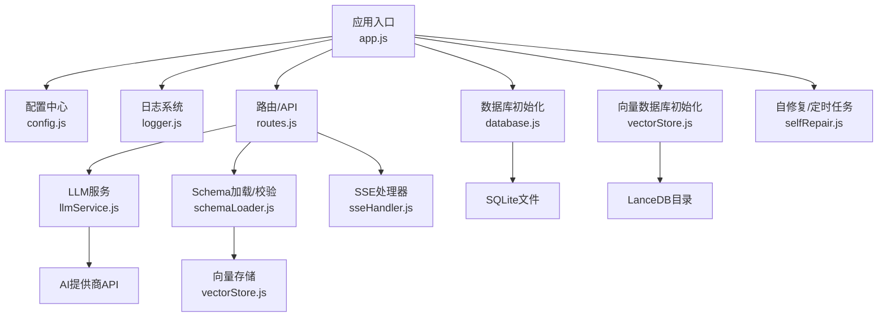
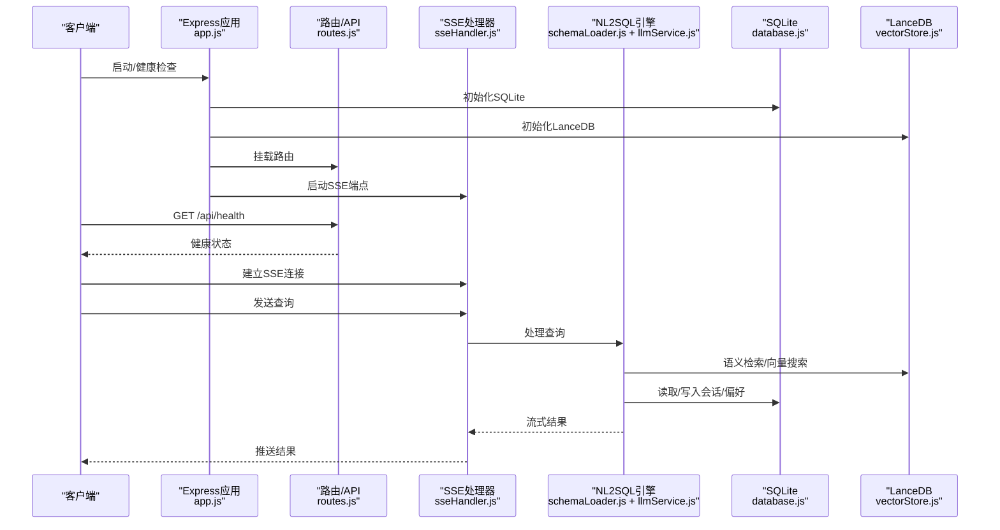
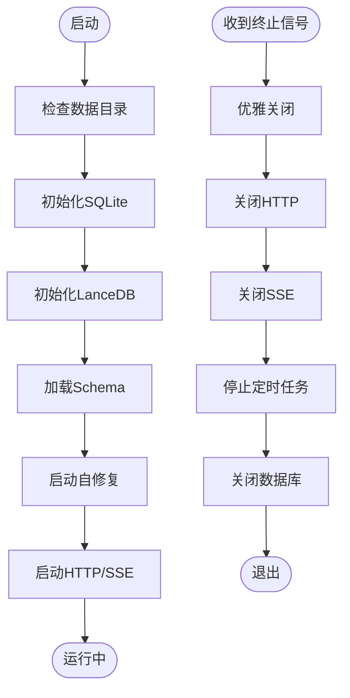

# 故障排除

<cite>
**本文引用的文件**
- [backend/src/app.js](file://backend/src/app.js)
- [backend/src/core/config.js](file://backend/src/core/config.js)
- [backend/src/utils/logger.js](file://backend/src/utils/logger.js)
- [backend/src/core/database.js](file://backend/src/core/database.js)
- [backend/src/memory/vectorStore.js](file://backend/src/memory/vectorStore.js)
- [backend/src/core/routes.js](file://backend/src/core/routes.js)
- [backend/src/core/selfRepair.js](file://backend/src/core/selfRepair.js)
- [backend/src/core/llmService.js](file://backend/src/core/llmService.js)
- [backend/src/core/schemaLoader.js](file://backend/src/core/schemaLoader.js)
- [backend/src/core/sseHandler.js](file://backend/src/core/sseHandler.js)
- [backend/package.json](file://backend/package.json)
</cite>

## 目录
1. [简介](#简介)
2. [项目结构](#项目结构)
3. [核心组件](#核心组件)
4. [架构总览](#架构总览)
5. [详细组件分析](#详细组件分析)
6. [依赖分析](#依赖分析)
7. [性能考虑](#性能考虑)
8. [故障排除指南](#故障排除指南)
9. [结论](#结论)
10. [附录](#附录)

## 简介
本指南面向NL2SQL项目的运维与开发人员，系统化梳理启动失败、连接超时、查询错误、AI服务集成异常、数据库连接问题、网络与防火墙配置、监控指标异常以及系统状态采集等常见问题的诊断与解决方法。文档基于后端代码实现，提供可操作的排查步骤、日志分析技巧与性能优化建议。

## 项目结构
后端采用Express + Node.js，模块化组织如下：
- 应用入口与生命周期：app.js
- 配置中心：core/config.js
- 日志系统：utils/logger.js
- 数据层：core/database.js（SQLite）、memory/vectorStore.js（LanceDB）
- 路由与API：core/routes.js
- 自修复与定时任务：core/selfRepair.js
- AI服务：core/llmService.js
- Schema与SQL校验：core/schemaLoader.js
- SSE实时流：core/sseHandler.js
- 依赖与运行脚本：package.json

图表来源
- [backend/src/app.js:97-166](file://backend/src/app.js#L97-L166)
- [backend/src/core/config.js:16-332](file://backend/src/core/config.js#L16-L332)
- [backend/src/utils/logger.js:51-318](file://backend/src/utils/logger.js#L51-L318)
- [backend/src/core/database.js:200-261](file://backend/src/core/database.js#L200-L261)
- [backend/src/memory/vectorStore.js:55-85](file://backend/src/memory/vectorStore.js#L55-L85)
- [backend/src/core/routes.js:1-800](file://backend/src/core/routes.js#L1-L800)
- [backend/src/core/selfRepair.js:60-125](file://backend/src/core/selfRepair.js#L60-L125)
- [backend/src/core/llmService.js:222-277](file://backend/src/core/llmService.js#L222-L277)
- [backend/src/core/schemaLoader.js:69-122](file://backend/src/core/schemaLoader.js#L69-L122)
- [backend/src/core/sseHandler.js:43-112](file://backend/src/core/sseHandler.js#L43-L112)

章节来源
- [backend/src/app.js:1-238](file://backend/src/app.js#L1-L238)
- [backend/src/core/config.js:16-332](file://backend/src/core/config.js#L16-L332)

## 核心组件
- 应用入口与启动流程：负责环境变量加载、中间件配置、模块初始化、HTTP/SSE服务启动与优雅关闭。
- 配置中心：集中管理端口、LLM API、数据库、向量库、安全策略、日志、自修复、Schema等配置，并提供启动前校验。
- 日志系统：统一输出到控制台与文件，支持级别控制、结构化日志与轮转。
- 数据层：SQLite用于会话、消息、查询历史、偏好、系统日志；LanceDB用于Schema与查询历史向量化。
- 路由与API：健康检查、Schema查询、会话管理、查询历史、统计信息、配置导出等。
- 自修复：定时任务执行健康检查、会话清理、统计收集、记忆维护。
- AI服务：封装LLM与Embedding调用，含超时、重试、流式响应与错误处理。
- Schema与SQL校验：加载Schema、语义/关键词匹配、SQL关键字与表白名单校验。
- SSE处理器：管理连接、进度回调、流式消息推送。

章节来源
- [backend/src/app.js:97-166](file://backend/src/app.js#L97-L166)
- [backend/src/core/config.js:300-332](file://backend/src/core/config.js#L300-L332)
- [backend/src/utils/logger.js:51-318](file://backend/src/utils/logger.js#L51-L318)
- [backend/src/core/database.js:200-261](file://backend/src/core/database.js#L200-L261)
- [backend/src/memory/vectorStore.js:55-85](file://backend/src/memory/vectorStore.js#L55-L85)
- [backend/src/core/routes.js:58-135](file://backend/src/core/routes.js#L58-L135)
- [backend/src/core/selfRepair.js:60-125](file://backend/src/core/selfRepair.js#L60-L125)
- [backend/src/core/llmService.js:222-277](file://backend/src/core/llmService.js#L222-L277)
- [backend/src/core/schemaLoader.js:563-606](file://backend/src/core/schemaLoader.js#L563-L606)
- [backend/src/core/sseHandler.js:43-112](file://backend/src/core/sseHandler.js#L43-L112)

## 架构总览

图表来源
- [backend/src/app.js:97-166](file://backend/src/app.js#L97-L166)
- [backend/src/core/routes.js:58-135](file://backend/src/core/routes.js#L58-L135)
- [backend/src/core/sseHandler.js:218-280](file://backend/src/core/sseHandler.js#L218-L280)
- [backend/src/core/schemaLoader.js:420-507](file://backend/src/core/schemaLoader.js#L420-L507)
- [backend/src/core/llmService.js:222-277](file://backend/src/core/llmService.js#L222-L277)
- [backend/src/core/database.js:200-261](file://backend/src/core/database.js#L200-L261)
- [backend/src/memory/vectorStore.js:55-85](file://backend/src/memory/vectorStore.js#L55-L85)

## 详细组件分析

### 启动与优雅关闭流程
- 启动顺序：确保数据目录存在 → 初始化SQLite → 初始化LanceDB → 加载Schema → 启动自修复 → 启动HTTP/SSE。
- 优雅关闭：停止接受新连接 → 关闭SSE → 停止定时任务 → 关闭数据库 → 退出进程。
- 关键日志：启动/关闭阶段均有明确日志输出，便于定位失败节点。

图表来源
- [backend/src/app.js:97-166](file://backend/src/app.js#L97-L166)
- [backend/src/app.js:176-230](file://backend/src/app.js#L176-L230)

章节来源
- [backend/src/app.js:97-166](file://backend/src/app.js#L97-L166)
- [backend/src/app.js:176-230](file://backend/src/app.js#L176-L230)

### 配置与验证
- 必填项校验：LLM API密钥、SR数据库URL，缺失将抛出错误并阻止启动。
- 环境变量：端口、Node环境、LLM/Embedding、数据库路径、白名单、超时、日志级别等。
- 安全策略：禁止关键字、最大返回行数、查询超时、白名单表、脱敏字段。

章节来源
- [backend/src/core/config.js:300-332](file://backend/src/core/config.js#L300-L332)
- [backend/src/core/config.js:16-332](file://backend/src/core/config.js#L16-L332)

### 日志系统
- 级别：DEBUG/INFO/WARN/ERROR，支持控制台彩色输出与文件落盘。
- 轮转：按大小轮转，保留多份历史文件。
- 结构化：附加元数据（如SQL、参数、错误堆栈）便于排查。

章节来源
- [backend/src/utils/logger.js:51-318](file://backend/src/utils/logger.js#L51-L318)

### 数据库与向量存储
- SQLite：创建表、索引、外键约束；迁移修复旧表结构；事务封装；查询/执行/单行查询。
- LanceDB：连接、表初始化、Schema/查询向量添加与搜索；统计与存在性检查。

章节来源
- [backend/src/core/database.js:200-261](file://backend/src/core/database.js#L200-L261)
- [backend/src/core/database.js:361-424](file://backend/src/core/database.js#L361-L424)
- [backend/src/memory/vectorStore.js:55-85](file://backend/src/memory/vectorStore.js#L55-L85)
- [backend/src/memory/vectorStore.js:160-191](file://backend/src/memory/vectorStore.js#L160-L191)
- [backend/src/memory/vectorStore.js:201-230](file://backend/src/memory/vectorStore.js#L201-L230)

### 路由与健康检查
- 健康检查：基础状态与详细状态（数据库、LLM、Schema、SSE连接数）。
- 统计信息：今日查询统计、连接数、Schema规模、系统资源。

章节来源
- [backend/src/core/routes.js:58-135](file://backend/src/core/routes.js#L58-L135)
- [backend/src/core/routes.js:724-771](file://backend/src/core/routes.js#L724-L771)

### 自修复与定时任务
- 每日自检：数据库连通、向量库状态、查询失败率、慢查询阈值、内存使用、活跃连接。
- 会话清理：过期会话归档。
- 统计收集：连接数、内存使用。
- 记忆维护：压缩与健康报告。

章节来源
- [backend/src/core/selfRepair.js:60-125](file://backend/src/core/selfRepair.js#L60-L125)
- [backend/src/core/selfRepair.js:169-310](file://backend/src/core/selfRepair.js#L169-L310)
- [backend/src/core/selfRepair.js:341-373](file://backend/src/core/selfRepair.js#L341-L373)
- [backend/src/core/selfRepair.js:425-445](file://backend/src/core/selfRepair.js#L425-L445)
- [backend/src/core/selfRepair.js:383-415](file://backend/src/core/selfRepair.js#L383-L415)

### AI服务与LLM集成
- Chat/Embedding：构造请求体、头部、超时、重试；流式响应支持；错误解析与超时处理。
- 代理/截断：对“响应被截断”“包含多个JSON对象”等异常进行日志提示。

章节来源
- [backend/src/core/llmService.js:41-152](file://backend/src/core/llmService.js#L41-L152)
- [backend/src/core/llmService.js:222-277](file://backend/src/core/llmService.js#L222-L277)
- [backend/src/core/llmService.js:324-379](file://backend/src/core/llmService.js#L324-L379)

### Schema加载与SQL校验
- 加载：校验格式、构建映射、缓存时间戳、向量化（可选）。
- 匹配：语义搜索（向量）+ 关键词匹配，支持上下文增强（datasource、game_id推断平台）。
- 校验：禁止关键字、表白名单、SQL解析（简化）。

章节来源
- [backend/src/core/schemaLoader.js:69-122](file://backend/src/core/schemaLoader.js#L69-L122)
- [backend/src/core/schemaLoader.js:195-290](file://backend/src/core/schemaLoader.js#L195-L290)
- [backend/src/core/schemaLoader.js:420-507](file://backend/src/core/schemaLoader.js#L420-L507)
- [backend/src/core/schemaLoader.js:563-606](file://backend/src/core/schemaLoader.js#L563-L606)

### SSE实时流
- 连接管理：多标签页支持、连接计数、活跃时间。
- 查询处理：进度回调、错误广播、并发保护。
- 与NL2SQL引擎协作：流式结果推送。

章节来源
- [backend/src/core/sseHandler.js:43-112](file://backend/src/core/sseHandler.js#L43-L112)
- [backend/src/core/sseHandler.js:218-280](file://backend/src/core/sseHandler.js#L218-L280)
- [backend/src/core/sseHandler.js:291-318](file://backend/src/core/sseHandler.js#L291-L318)

## 依赖分析
- 运行时依赖：Express、SQLite3、vectordb(LanceDB)、dotenv、cors、body-parser、uuid、dayjs、node-cron。
- 开发依赖：nodemon。
- Node版本要求：>=18.0.0。

章节来源
- [backend/package.json:10-27](file://backend/package.json#L10-L27)

## 性能考虑
- 查询超时与行数限制：防止大查询导致内存与响应问题。
- 慢查询阈值：自修复检查中识别平均执行时间过高的情况。
- 向量搜索批处理：Embedding分批获取，避免单次请求过大。
- 日志级别与文件轮转：避免日志写入成为瓶颈。

章节来源
- [backend/src/core/config.js:150-170](file://backend/src/core/config.js#L150-L170)
- [backend/src/core/selfRepair.js:243-246](file://backend/src/core/selfRepair.js#L243-L246)
- [backend/src/core/schemaLoader.js:260-273](file://backend/src/core/schemaLoader.js#L260-L273)
- [backend/src/utils/logger.js:128-160](file://backend/src/utils/logger.js#L128-L160)

## 故障排除指南

### 一、启动失败
- 常见原因
  - 缺少必要配置：LLM API密钥或SR数据库URL未设置。
  - 数据目录权限不足或路径异常。
  - 端口占用或权限不足。
- 诊断步骤
  - 检查启动日志中“初始化SQLite/LanceDB/加载Schema/启动HTTP”等关键节点是否完成。
  - 查看配置校验错误（缺失必填项）。
  - 确认端口与权限，尝试切换端口或以管理员权限运行。
- 解决方案
  - 在环境变量中补齐LLM_API_KEY、SR_DATABASE_URL。
  - 确保数据目录存在且具备读写权限。
  - 修改PORT或释放占用端口。

章节来源
- [backend/src/app.js:97-166](file://backend/src/app.js#L97-L166)
- [backend/src/core/config.js:300-332](file://backend/src/core/config.js#L300-L332)

### 二、连接超时
- 健康检查
  - 使用健康接口获取服务状态与内存使用，观察uptime与内存使用率。
- LLM/Embedding超时
  - 检查LLM/Embedding超时配置，适当增大。
  - 关注代理/网关截断提示（响应被截断、包含多个JSON对象）。
- 数据库连接超时
  - 检查SR数据库URL、连接池配置（acquireTimeout/idleTimeout）。
- SSE连接
  - 检查Nginx/Apache缓冲设置，确保X-Accel-Buffering禁用。

章节来源
- [backend/src/core/routes.js:58-135](file://backend/src/core/routes.js#L58-L135)
- [backend/src/core/llmService.js:41-152](file://backend/src/core/llmService.js#L41-L152)
- [backend/src/core/config.js:68-87](file://backend/src/core/config.js#L68-L87)
- [backend/src/core/config.js:118-130](file://backend/src/core/config.js#L118-L130)
- [backend/src/core/sseHandler.js:65-70](file://backend/src/core/sseHandler.js#L65-L70)

### 三、查询错误
- SQL关键字/表白名单
  - 检查禁止关键字与allowedTables配置，确保查询命中白名单。
- 查询超时/行数限制
  - 调整QUERY_TIMEOUT与MAX_QUERY_ROWS，或优化查询。
- Schema匹配
  - 若语义搜索失败，回退关键词匹配；检查向量库初始化状态。
- 实体/平台映射
  - 检查长期记忆中的字段别名与平台映射，必要时手动学习。

章节来源
- [backend/src/core/schemaLoader.js:563-606](file://backend/src/core/schemaLoader.js#L563-L606)
- [backend/src/core/config.js:150-170](file://backend/src/core/config.js#L150-L170)
- [backend/src/core/schemaLoader.js:420-507](file://backend/src/core/schemaLoader.js#L420-L507)

### 四、数据库连接问题
- SQLite
  - 检查数据库文件路径、权限；确认外键约束启用；查看迁移日志。
- LanceDB
  - 检查向量库目录权限；确认表初始化；若初始化失败，记录警告但不影响启动。
- 连接池
  - 检查SR数据库URL与连接池参数，避免acquire超时。

章节来源
- [backend/src/core/database.js:200-261](file://backend/src/core/database.js#L200-L261)
- [backend/src/memory/vectorStore.js:55-85](file://backend/src/memory/vectorStore.js#L55-L85)
- [backend/src/core/config.js:118-130](file://backend/src/core/config.js#L118-L130)

### 五、AI服务集成故障
- 常见问题
  - API密钥错误、API Base地址错误、请求超时、响应格式异常。
- 诊断方法
  - 查看LLM/Embedding调用日志与错误堆栈；关注“响应解析失败”“请求超时”“响应被截断”等提示。
  - 使用withRetry与maxRetries、retryDelay进行重试。
- 解决方案
  - 校验LLM_API_KEY与LLM_API_BASE；调整timeout；检查网络与代理配置。

章节来源
- [backend/src/core/llmService.js:222-277](file://backend/src/core/llmService.js#L222-L277)
- [backend/src/core/llmService.js:324-379](file://backend/src/core/llmService.js#L324-L379)
- [backend/src/core/config.js:62-74](file://backend/src/core/config.js#L62-L74)

### 六、网络连接与防火墙
- 端口开放
  - 确认监听端口（默认3000）在防火墙放行。
- 代理/反向代理
  - 确保SSE禁用缓冲（X-Accel-Buffering: no）；避免代理截断长响应。
- LLM提供商
  - 检查出口网络可达性与代理设置；必要时配置HTTP/HTTPS代理。

章节来源
- [backend/src/app.js:148-158](file://backend/src/app.js#L148-L158)
- [backend/src/core/sseHandler.js:65-70](file://backend/src/core/sseHandler.js#L65-L70)
- [backend/src/core/llmService.js:41-152](file://backend/src/core/llmService.js#L41-L152)

### 七、监控指标异常
- 健康检查
  - 使用/health与/health/detail接口，关注数据库、LLM、Schema、SSE连接状态。
- 自修复报告
  - 每日自检输出失败率、慢查询、内存使用率等；根据建议操作。
- 统计接口
  - 使用/stats接口获取今日查询统计、连接数、Schema规模与系统资源。

章节来源
- [backend/src/core/routes.js:58-135](file://backend/src/core/routes.js#L58-L135)
- [backend/src/core/selfRepair.js:169-310](file://backend/src/core/selfRepair.js#L169-L310)
- [backend/src/core/routes.js:724-771](file://backend/src/core/routes.js#L724-L771)

### 八、系统状态采集与日志分析
- 日志位置与级别
  - 检查日志文件路径与轮转配置；在问题复现时临时提升日志级别。
- 关键错误信息
  - “数据库连接失败/创建表失败/迁移失败”“LanceDB初始化失败”“LLM API调用失败/请求超时/响应解析失败”“Schema配置文件不存在/加载失败”。
- 结构化日志
  - 利用附加元数据（SQL、参数、错误堆栈）定位问题。

章节来源
- [backend/src/utils/logger.js:187-244](file://backend/src/utils/logger.js#L187-L244)
- [backend/src/core/database.js:219-242](file://backend/src/core/database.js#L219-L242)
- [backend/src/memory/vectorStore.js:80-84](file://backend/src/memory/vectorStore.js#L80-L84)
- [backend/src/core/llmService.js:108-131](file://backend/src/core/llmService.js#L108-L131)
- [backend/src/core/schemaLoader.js:77-80](file://backend/src/core/schemaLoader.js#L77-L80)

## 结论
通过系统化的启动流程、配置校验、日志与监控体系，NL2SQL项目能够快速定位并解决启动失败、连接超时、查询错误、AI服务与数据库连接问题。建议在生产环境中：
- 明确配置项与默认值，严格必填项校验；
- 启用健康检查与自修复任务；
- 合理设置超时与限流；
- 完善日志轮转与告警；
- 定期审查Schema与向量库状态。

## 附录
- 常用命令
  - 开发：npm run dev
  - 生产：npm run start
- 关键环境变量
  - PORT、NODE_ENV、LLM_API_BASE、LLM_API_KEY、LLM_MODEL、LLM_TIMEOUT、EMBEDDING_MODEL、EMBEDDING_TIMEOUT、DB_PATH、VECTOR_DB_PATH、SR_DATABASE_URL、ALLOWED_TABLES、DRY_RUN、MAX_QUERY_ROWS、QUERY_TIMEOUT、LOG_LEVEL、LOG_FILE、SCHEMA_CONFIG_PATH、SCHEMA_REVECTORIZE、LTM_ENABLED、LTM_USE_LLM

章节来源
- [backend/package.json:6-8](file://backend/package.json#L6-L8)
- [backend/src/core/config.js:26-332](file://backend/src/core/config.js#L26-L332)