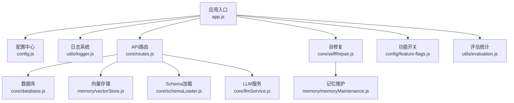
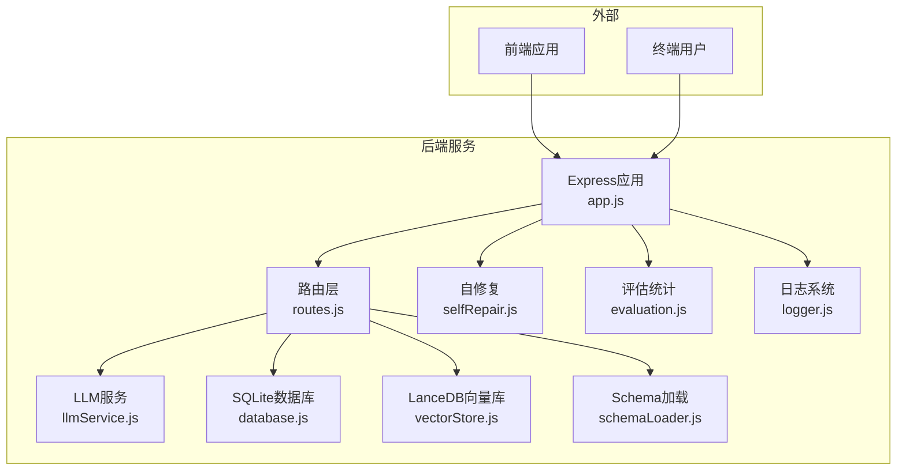
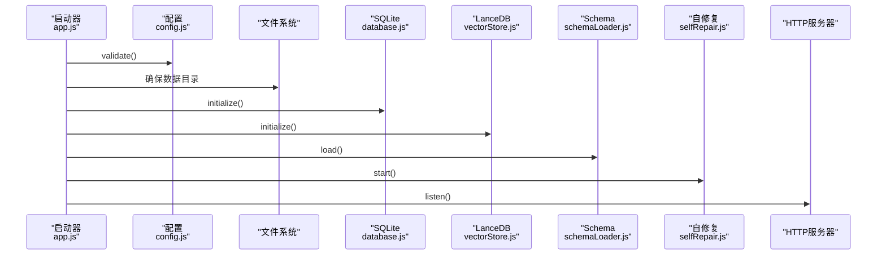
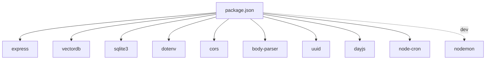

# 故障排除与FAQ

<cite>
**本文档引用的文件**
- [package.json](file://backend/package.json)
- [app.js](file://backend/src/app.js)
- [logger.js](file://backend/src/utils/logger.js)
- [routes.js](file://backend/src/core/routes.js)
- [config.js](file://backend/src/core/config.js)
- [database.js](file://backend/src/core/database.js)
- [vectorStore.js](file://backend/src/memory/vectorStore.js)
- [selfRepair.js](file://backend/src/core/selfRepair.js)
- [feature-flags.js](file://backend/config/feature-flags.js)
- [evaluation.js](file://backend/src/utils/evaluation.js)
- [schemaLoader.js](file://backend/src/core/schemaLoader.js)
- [llmService.js](file://backend/src/core/llmService.js)
- [business-semantic-layer.json](file://backend/config/business-semantic-layer.json)
- [context-management.test.js](file://backend/test/context-management.test.js)
- [memoryMaintenance.js](file://backend/src/memory/memoryMaintenance.js)
</cite>

## 目录
1. [简介](#简介)
2. [项目结构](#项目结构)
3. [核心组件](#核心组件)
4. [架构总览](#架构总览)
5. [详细组件分析](#详细组件分析)
6. [依赖关系分析](#依赖关系分析)
7. [性能考虑](#性能考虑)
8. [故障排除指南](#故障排除指南)
9. [结论](#结论)
10. [附录](#附录)

## 简介
本指南面向NL2SQL项目的运维与开发人员，提供系统化的故障排除与常见问题解答。内容涵盖安装与配置、运行时异常、日志分析、性能诊断、内存管理、并发处理、紧急响应流程以及监控告警配置。文档基于代码库的实际实现，确保解决方案可落地、可验证。

## 项目结构
后端采用模块化分层架构：
- 应用入口与生命周期管理：app.js
- 配置中心：config.js
- 日志系统：utils/logger.js
- API路由：core/routes.js
- 数据层：core/database.js（SQLite）、memory/vectorStore.js（LanceDB）
- 自修复与维护：core/selfRepair.js、memory/memoryMaintenance.js
- LLM服务：core/llmService.js
- Schema与语义检索：core/schemaLoader.js、config/business-semantic-layer.json
- 功能开关：config/feature-flags.js
- 评估与统计：src/utils/evaluation.js
- 测试：test/context-management.test.js

**图表来源**
- [app.js:1-266](file://backend/src/app.js#L1-L266)
- [config.js:1-398](file://backend/src/core/config.js#L1-L398)
- [logger.js:1-482](file://backend/src/utils/logger.js#L1-L482)
- [routes.js:1-800](file://backend/src/core/routes.js#L1-L800)
- [database.js:1-1016](file://backend/src/core/database.js#L1-L1016)
- [vectorStore.js:1-948](file://backend/src/memory/vectorStore.js#L1-L948)
- [selfRepair.js:1-489](file://backend/src/core/selfRepair.js#L1-L489)
- [memoryMaintenance.js:1-421](file://backend/src/memory/memoryMaintenance.js#L1-L421)
- [schemaLoader.js:1-1235](file://backend/src/core/schemaLoader.js#L1-L1235)
- [llmService.js:1-477](file://backend/src/core/llmService.js#L1-L477)
- [evaluation.js:1-488](file://backend/src/utils/evaluation.js#L1-L488)
- [feature-flags.js:1-249](file://backend/config/feature-flags.js#L1-L249)

**章节来源**
- [package.json:1-28](file://backend/package.json#L1-L28)
- [app.js:1-266](file://backend/src/app.js#L1-L266)

## 核心组件
- 应用入口与生命周期：负责环境变量加载、模块初始化、优雅关闭、未处理异常捕获。
- 配置中心：集中管理LLM、数据库、日志、安全、Schema、长期记忆、上下文管理、评估等配置，并提供配置校验。
- 日志系统：支持控制台与文件输出、多级别日志、结构化日志、追踪上下文、自动轮转。
- API路由：提供健康检查、Schema查询、会话管理、查询历史、用户偏好、评估接口等REST端点。
- 数据层：SQLite持久化会话、消息、查询历史、用户偏好；LanceDB向量存储Schema与查询历史。
- 自修复：定时任务（每日自检、会话清理、统计收集、记忆维护）。
- LLM服务：HTTP请求封装、重试机制、超时控制、流式响应支持。
- Schema与语义检索：Schema元数据加载、向量化、智能搜索、SQL安全校验。
- 功能开关：Phase式渐进启用，支持快速回滚。
- 评估统计：向量化质量评估、记忆命中率统计、运行时统计。

**章节来源**
- [app.js:93-194](file://backend/src/app.js#L93-L194)
- [config.js:16-398](file://backend/src/core/config.js#L16-L398)
- [logger.js:54-482](file://backend/src/utils/logger.js#L54-L482)
- [routes.js:60-137](file://backend/src/core/routes.js#L60-L137)
- [database.js:206-267](file://backend/src/core/database.js#L206-L267)
- [vectorStore.js:233-263](file://backend/src/memory/vectorStore.js#L233-L263)
- [selfRepair.js:60-125](file://backend/src/core/selfRepair.js#L60-L125)
- [llmService.js:41-152](file://backend/src/core/llmService.js#L41-L152)
- [schemaLoader.js:75-131](file://backend/src/core/schemaLoader.js#L75-L131)
- [feature-flags.js:16-96](file://backend/config/feature-flags.js#L16-L96)
- [evaluation.js:37-61](file://backend/src/utils/evaluation.js#L37-L61)

## 架构总览
NL2SQL后端通过Express提供REST API，内部集成LLM服务、SQLite与LanceDB，配合自修复与评估系统，形成闭环的监控与优化能力。

**图表来源**
- [app.js:56-87](file://backend/src/app.js#L56-L87)
- [routes.js:1-800](file://backend/src/core/routes.js#L1-L800)
- [llmService.js:1-477](file://backend/src/core/llmService.js#L1-L477)
- [database.js:1-1016](file://backend/src/core/database.js#L1-L1016)
- [vectorStore.js:1-948](file://backend/src/memory/vectorStore.js#L1-L948)
- [schemaLoader.js:1-1235](file://backend/src/core/schemaLoader.js#L1-L1235)
- [selfRepair.js:1-489](file://backend/src/core/selfRepair.js#L1-L489)
- [evaluation.js:1-488](file://backend/src/utils/evaluation.js#L1-L488)
- [logger.js:1-482](file://backend/src/utils/logger.js#L1-L482)

## 详细组件分析

### 应用入口与生命周期
- 初始化顺序：配置校验 → 数据目录检查 → SQLite初始化 → LanceDB初始化 → Schema加载 → 业务语义层加载 → 功能开关打印 → 自修复启动 → HTTP服务启动。
- 优雅关闭：停止接受新连接、关闭SSE、停止定时任务、关闭数据库、退出进程。
- 异常处理：未处理Promise拒绝与未捕获异常均记录并触发优雅关闭。

**图表来源**
- [app.js:97-194](file://backend/src/app.js#L97-L194)
- [config.js:366-398](file://backend/src/core/config.js#L366-L398)
- [database.js:206-267](file://backend/src/core/database.js#L206-L267)
- [vectorStore.js:233-263](file://backend/src/memory/vectorStore.js#L233-L263)
- [schemaLoader.js:75-131](file://backend/src/core/schemaLoader.js#L75-L131)
- [selfRepair.js:60-125](file://backend/src/core/selfRepair.js#L60-L125)

**章节来源**
- [app.js:97-194](file://backend/src/app.js#L97-L194)
- [app.js:204-258](file://backend/src/app.js#L204-L258)

### 配置管理与校验
- 关键配置项：LLM API基础地址、密钥、模型、超时；Embedding模型与维度；SQLite与LanceDB路径；安全白名单、DryRun、行数限制、查询超时、禁止关键字、敏感字段；会话过期与清理间隔；日志级别与文件轮转；Schema缓存与强制重向量化；长期记忆与上下文管理阈值；评估开关与阈值。
- 配置校验：必需项缺失将抛出错误，提示在.env中设置相应变量；白名单为空给出生产环境警告。

**章节来源**
- [config.js:16-398](file://backend/src/core/config.js#L16-L398)
- [config.js:366-398](file://backend/src/core/config.js#L366-L398)

### 日志系统
- 多级别日志：TRACE、DEBUG、INFO、WARN、ERROR。
- 输出目标：控制台彩色输出、文件输出（自动轮转）。
- 追踪上下文：支持按traceId记录流程步骤，带时间戳与耗时，定期清理僵尸追踪条目。
- 事件通知：记录完成后触发日志事件，便于外部监听。

**章节来源**
- [logger.js:28-482](file://backend/src/utils/logger.js#L28-L482)

### API路由与健康检查
- 健康检查：基础健康与详细健康（数据库、LLM、Schema、SSE连接）。
- Schema接口：获取完整Schema、按类型筛选、按表详情、搜索相关表。
- 会话与偏好：创建/获取/删除会话，消息历史，用户偏好增删改查与模板学习。
- 评估接口：获取运行时统计、重置统计、Schema向量化质量评估。

**章节来源**
- [routes.js:60-137](file://backend/src/core/routes.js#L60-L137)
- [routes.js:140-250](file://backend/src/core/routes.js#L140-L250)
- [routes.js:254-398](file://backend/src/core/routes.js#L254-L398)
- [routes.js:400-760](file://backend/src/core/routes.js#L400-L760)

### 数据层（SQLite）
- 表结构：sessions、messages、query_history、user_preferences、system_logs。
- 初始化：外键约束启用、表创建、迁移修复（UNIQUE约束移除、重复偏好清理、字段别名修正）。
- 事务：支持事务封装，保证一致性。
- 安全：SQL安全校验（禁止关键字、白名单表名）。

**章节来源**
- [database.js:39-195](file://backend/src/core/database.js#L39-L195)
- [database.js:277-404](file://backend/src/core/database.js#L277-L404)
- [database.js:499-513](file://backend/src/core/database.js#L499-L513)
- [database.js:723-759](file://backend/src/core/database.js#L723-L759)

### 向量存储（LanceDB）
- 初始化：连接数据库、打开/创建schema_vectors与query_vectors表。
- Schema向量：表级向量表示（包含scope、data_type等元数据），支持智能搜索与重排序。
- 查询历史向量：相似查询检索，记录统计。
- 状态检查：统计表行数，判断初始化状态。

**章节来源**
- [vectorStore.js:233-324](file://backend/src/memory/vectorStore.js#L233-L324)
- [vectorStore.js:338-437](file://backend/src/memory/vectorStore.js#L338-L437)
- [vectorStore.js:452-576](file://backend/src/memory/vectorStore.js#L452-L576)
- [vectorStore.js:619-752](file://backend/src/memory/vectorStore.js#L619-L752)

### 自修复与维护
- 定时任务：每日自检（数据库、向量库、查询统计、连接数、系统资源）、会话清理（过期归档）、统计收集（连接数、内存）、记忆维护（压缩与清理）。
- 自检报告：保存到system_logs，包含问题与建议。
- 记忆维护：分级保留策略（高频永久、中频90天、低频30天、字段别名365天），相似模式合并。

**章节来源**
- [selfRepair.js:60-159](file://backend/src/core/selfRepair.js#L60-L159)
- [selfRepair.js:169-310](file://backend/src/core/selfRepair.js#L169-L310)
- [selfRepair.js:341-373](file://backend/src/core/selfRepair.js#L341-L373)
- [selfRepair.js:425-445](file://backend/src/core/selfRepair.js#L425-L445)
- [memoryMaintenance.js:69-120](file://backend/src/memory/memoryMaintenance.js#L69-L120)
- [memoryMaintenance.js:127-195](file://backend/src/memory/memoryMaintenance.js#L127-L195)
- [memoryMaintenance.js:326-401](file://backend/src/memory/memoryMaintenance.js#L326-L401)

### LLM服务
- HTTP封装：统一POST请求、超时控制、错误解析、响应截断检测。
- 重试机制：指数退避、最大重试次数与延迟。
- Embedding：支持单个与批量向量生成。
- 聊天：支持流式与非流式响应，记录耗时与用量。

**章节来源**
- [llmService.js:41-152](file://backend/src/core/llmService.js#L41-L152)
- [llmService.js:167-195](file://backend/src/core/llmService.js#L167-L195)
- [llmService.js:222-308](file://backend/src/core/llmService.js#L222-L308)
- [llmService.js:369-424](file://backend/src/core/llmService.js#L369-L424)

### Schema与业务语义层
- Schema加载：JSON配置文件解析、缓存、映射构建、动态游戏名索引、向量化（表级）。
- 智能搜索：结合查询意图识别与重排序，支持按datasource与gameId过滤。
- SQL校验：禁止关键字、白名单表名检查。
- 业务语义层：业务概念到物理表/字段映射，支持优先级与示例。

**章节来源**
- [schemaLoader.js:75-131](file://backend/src/core/schemaLoader.js#L75-L131)
- [schemaLoader.js:210-285](file://backend/src/core/schemaLoader.js#L210-L285)
- [schemaLoader.js:571-710](file://backend/src/core/schemaLoader.js#L571-L710)
- [schemaLoader.js:723-759](file://backend/src/core/schemaLoader.js#L723-L759)
- [business-semantic-layer.json:1-189](file://backend/config/business-semantic-layer.json#L1-L189)

### 功能开关与评估统计
- 功能开关：Phase式控制，支持启用/禁用全部，综合判断工作流。
- 评估统计：向量化质量评估（精确率、召回率、F1）、查询相似度评估、运行时统计与重置。

**章节来源**
- [feature-flags.js:16-96](file://backend/config/feature-flags.js#L16-L96)
- [feature-flags.js:108-161](file://backend/config/feature-flags.js#L108-L161)
- [evaluation.js:158-266](file://backend/src/utils/evaluation.js#L158-L266)
- [evaluation.js:276-334](file://backend/src/utils/evaluation.js#L276-L334)
- [evaluation.js:397-429](file://backend/src/utils/evaluation.js#L397-L429)

## 依赖关系分析
- 运行时依赖：Express、vectordb、sqlite3、dotenv、cors、body-parser、uuid、dayjs、node-cron。
- 开发依赖：nodemon。
- Node版本要求：>=18.0.0。

**图表来源**
- [package.json:10-27](file://backend/package.json#L10-L27)

**章节来源**
- [package.json:1-28](file://backend/package.json#L1-L28)

## 性能考虑
- 查询优化
  - 启用Schema向量化与智能搜索，减少关键词匹配成本。
  - 使用白名单与禁止关键字，避免高成本或危险SQL。
  - 合理设置查询超时与最大返回行数，防止慢查询拖垮服务。
- 内存管理
  - 使用SQLite WAL模式与外键约束，减少锁竞争。
  - 启动时执行数据库迁移修复，避免索引与约束问题导致的额外开销。
  - 向量存储采用增量更新，避免全量重建。
- 并发处理
  - 自修复定时任务分离I/O密集与CPU密集任务，避免阻塞主线程。
  - LLM请求带超时与重试，防止阻塞等待。
- 评估与监控
  - 通过评估模块记录向量检索命中率与记忆命中率，指导优化方向。
  - 健康检查与统计收集定期输出系统状态，便于提前发现问题。

[本节为通用指导，无需特定文件引用]

## 故障排除指南

### 安装与环境问题
- Node版本不满足要求
  - 现象：安装或启动时报错。
  - 处理：升级至Node >=18.0.0。
  - 参考：[package.json:24-26](file://backend/package.json#L24-L26)
- 依赖安装失败
  - 现象：npm install报错。
  - 处理：检查网络与镜像源；清理缓存后重试；确认系统具备编译依赖（如Python、make等）。
- 环境变量缺失
  - 现象：启动时报配置错误，提示缺少LLM API密钥或数据库URL。
  - 处理：在.env中设置LLM_API_KEY、SR_DATABASE_URL等必需项；参考配置校验逻辑。
  - 参考：[config.js:366-398](file://backend/src/core/config.js#L366-L398)

**章节来源**
- [package.json:24-26](file://backend/package.json#L24-L26)
- [config.js:366-398](file://backend/src/core/config.js#L366-L398)

### 配置错误
- 白名单为空
  - 现象：生产环境警告提示允许访问所有表。
  - 处理：设置ALLOWED_TABLES为受控表名列表。
  - 参考：[config.js:384-387](file://backend/src/core/config.js#L384-L387)
- 日志级别与文件路径
  - 现象：日志不输出或文件过大。
  - 处理：调整LOG_LEVEL、LOG_FILE、MAX_SIZE、MAX_FILES；确认日志目录存在。
  - 参考：[config.js:195-213](file://backend/src/core/config.js#L195-L213)，[logger.js:116-179](file://backend/src/utils/logger.js#L116-L179)
- LLM与Embedding超时
  - 现象：LLM或Embedding请求超时。
  - 处理：增大LLM_TIMEOUT、EMBEDDING_TIMEOUT；检查API网关与代理配置。
  - 参考：[config.js:68-87](file://backend/src/core/config.js#L68-L87)

**章节来源**
- [config.js:195-213](file://backend/src/core/config.js#L195-L213)
- [logger.js:116-179](file://backend/src/utils/logger.js#L116-L179)
- [config.js:68-87](file://backend/src/core/config.js#L68-L87)

### 运行时异常
- 未处理异常与Promise拒绝
  - 现象：进程崩溃或服务不稳定。
  - 处理：检查日志ERROR级别记录；优雅关闭流程会记录错误并退出；定位异常源头。
  - 参考：[app.js:248-258](file://backend/src/app.js#L248-L258)
- 数据库连接失败
  - 现象：初始化阶段报错。
  - 处理：检查DB_PATH与SQLite权限；确认数据库文件存在且可读写。
  - 参考：[database.js:220-266](file://backend/src/core/database.js#L220-L266)
- 向量数据库未初始化
  - 现象：向量搜索返回空结果或警告。
  - 处理：确认VECTOR_DB_PATH有效；检查LanceDB依赖；必要时设置SCHEMA_REVECTORIZE=true强制重向量化。
  - 参考：[vectorStore.js:233-263](file://backend/src/memory/vectorStore.js#L233-L263)，[config.js:106-109](file://backend/src/core/config.js#L106-L109)

**章节来源**
- [app.js:248-258](file://backend/src/app.js#L248-L258)
- [database.js:220-266](file://backend/src/core/database.js#L220-L266)
- [vectorStore.js:233-263](file://backend/src/memory/vectorStore.js#L233-L263)
- [config.js:106-109](file://backend/src/core/config.js#L106-L109)

### API与路由问题
- 健康检查失败
  - 现象：/api/health或/detail返回error。
  - 处理：检查数据库连接、Schema加载、SSE连接数；查看详细健康报告中的组件状态。
  - 参考：[routes.js:72-137](file://backend/src/core/routes.js#L72-L137)
- Schema搜索无结果
  - 现象：/api/schema/search返回空。
  - 处理：确认向量库初始化；检查查询关键词；尝试增加limit；查看日志中向量搜索统计。
  - 参考：[routes.js:225-250](file://backend/src/core/routes.js#L225-L250)，[evaluation.js:439-460](file://backend/src/utils/evaluation.js#L439-L460)
- 会话与偏好操作失败
  - 现象：创建/删除会话或偏好返回错误。
  - 处理：检查SQLite表结构与索引；查看数据库错误日志；确认事务完整性。
  - 参考：[database.js:526-608](file://backend/src/core/database.js#L526-L608)，[database.js:677-783](file://backend/src/core/database.js#L677-L783)

**章节来源**
- [routes.js:72-137](file://backend/src/core/routes.js#L72-L137)
- [routes.js:225-250](file://backend/src/core/routes.js#L225-L250)
- [evaluation.js:439-460](file://backend/src/utils/evaluation.js#L439-L460)
- [database.js:526-608](file://backend/src/core/database.js#L526-L608)
- [database.js:677-783](file://backend/src/core/database.js#L677-L783)

### LLM与向量质量
- LLM响应被截断
  - 现象：日志提示“truncated”或响应解析失败。
  - 处理：检查API服务器响应大小限制；更换Embedding API端点；增大超时。
  - 参考：[llmService.js:114-131](file://backend/src/core/llmService.js#L114-L131)
- 向量化质量不佳
  - 现象：检索命中率低或相似度不高。
  - 处理：启用评估功能，执行Schema向量化质量评估；检查Embedding模型与维度；优化表级表征文本。
  - 参考：[evaluation.js:158-266](file://backend/src/utils/evaluation.js#L158-L266)，[schemaLoader.js:210-285](file://backend/src/core/schemaLoader.js#L210-L285)

**章节来源**
- [llmService.js:114-131](file://backend/src/core/llmService.js#L114-L131)
- [evaluation.js:158-266](file://backend/src/utils/evaluation.js#L158-L266)
- [schemaLoader.js:210-285](file://backend/src/core/schemaLoader.js#L210-L285)

### 性能诊断与优化
- 慢查询定位
  - 方法：查看自修复每日自检报告中的平均查询时间与失败率；检查慢查询阈值配置。
  - 参考：[selfRepair.js:218-247](file://backend/src/core/selfRepair.js#L218-L247)，[config.js:229-231](file://backend/src/core/config.js#L229-L231)
- 内存使用过高
  - 方法：关注每日自检报告中的内存使用率；必要时重启服务或优化内存使用。
  - 参考：[selfRepair.js:268-284](file://backend/src/core/selfRepair.js#L268-L284)
- 记忆膨胀
  - 方法：执行记忆维护任务；检查分级保留策略；合并相似模式。
  - 参考：[memoryMaintenance.js:69-120](file://backend/src/memory/memoryMaintenance.js#L69-L120)，[memoryMaintenance.js:207-251](file://backend/src/memory/memoryMaintenance.js#L207-L251)

**章节来源**
- [selfRepair.js:218-247](file://backend/src/core/selfRepair.js#L218-L247)
- [config.js:229-231](file://backend/src/core/config.js#L229-L231)
- [memoryMaintenance.js:69-120](file://backend/src/memory/memoryMaintenance.js#L69-L120)
- [memoryMaintenance.js:207-251](file://backend/src/memory/memoryMaintenance.js#L207-L251)

### 紧急响应流程
- 服务中断
  - 步骤：记录未捕获异常；触发优雅关闭；检查日志；回滚最近变更。
  - 参考：[app.js:248-258](file://backend/src/app.js#L248-L258)
- 数据丢失
  - 步骤：确认SQLite与LanceDB路径；检查备份策略；恢复最近备份。
  - 参考：[config.js:98-109](file://backend/src/core/config.js#L98-L109)，[database.js:206-267](file://backend/src/core/database.js#L206-L267)
- 安全事件
  - 步骤：检查禁止关键字与白名单；审计查询历史；限制API速率；启用TLS。
  - 参考：[config.js:158-170](file://backend/src/core/config.js#L158-L170)，[routes.js:413-450](file://backend/src/core/routes.js#L413-L450)

**章节来源**
- [app.js:248-258](file://backend/src/app.js#L248-L258)
- [config.js:98-109](file://backend/src/core/config.js#L98-L109)
- [database.js:206-267](file://backend/src/core/database.js#L206-L267)
- [routes.js:413-450](file://backend/src/core/routes.js#L413-L450)

### 监控告警与故障预警
- 健康检查端点：/api/health与/detail，返回状态、内存、组件状态。
- 自修复任务：每日自检、会话清理、统计收集、记忆维护。
- 评估统计：向量检索命中率、长期记忆命中率、距离分布。
- 建议：将健康检查与评估接口接入Prometheus/Grafana；设置阈值告警（失败率、慢查询、内存使用率、连接数）。

**章节来源**
- [routes.js:72-137](file://backend/src/core/routes.js#L72-L137)
- [selfRepair.js:60-125](file://backend/src/core/selfRepair.js#L60-L125)
- [evaluation.js:397-429](file://backend/src/utils/evaluation.js#L397-L429)

## 结论
本指南基于NL2SQL代码库的实际实现，提供了从安装配置到运行维护的全流程故障排除方案。通过合理利用日志系统、健康检查、自修复与评估统计，能够有效预防与快速定位问题，保障服务稳定性与性能表现。

## 附录
- 测试参考：上下文管理功能测试覆盖Token估算、历史裁剪、摘要缓存与向量元数据增强，可作为功能回归与边界条件验证的参考。
  - 参考：[context-management.test.js:43-321](file://backend/test/context-management.test.js#L43-L321)

**章节来源**
- [context-management.test.js:43-321](file://backend/test/context-management.test.js#L43-L321)