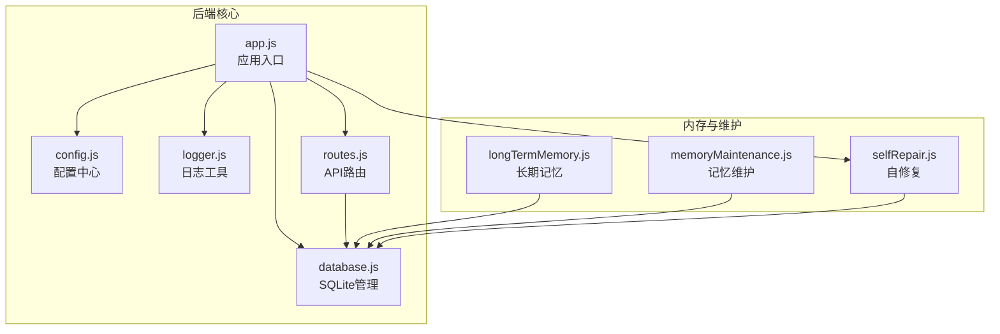
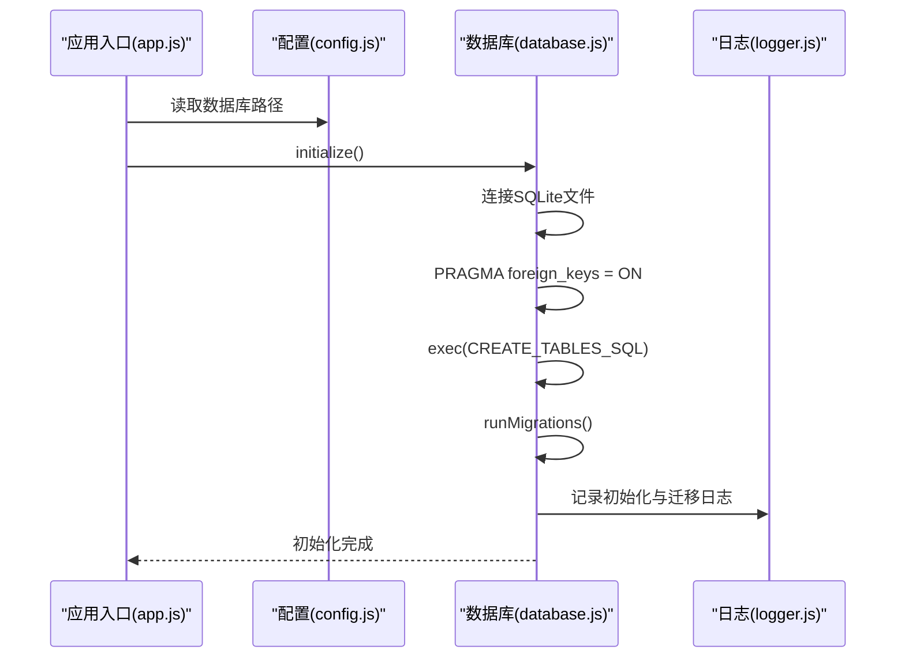
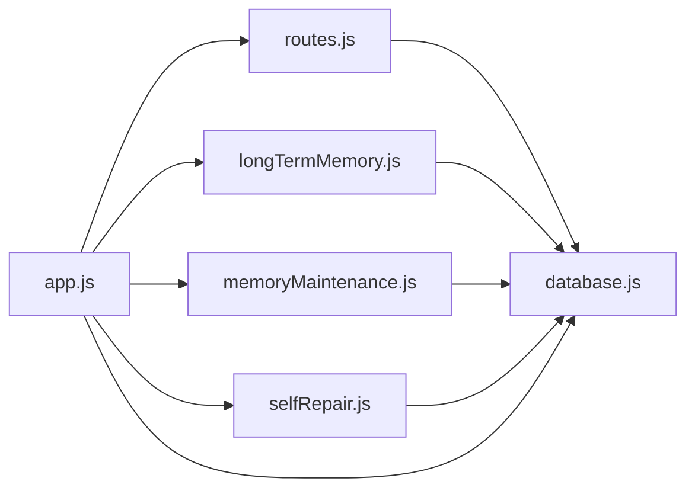

# SQLite数据库设计

<cite>
**本文引用的文件**
- [database.js](file://backend/src/core/database.js)
- [config.js](file://backend/src/core/config.js)
- [routes.js](file://backend/src/core/routes.js)
- [app.js](file://backend/src/app.js)
- [logger.js](file://backend/src/utils/logger.js)
- [longTermMemory.js](file://backend/src/memory/longTermMemory.js)
- [memoryMaintenance.js](file://backend/src/memory/memoryMaintenance.js)
- [selfRepair.js](file://backend/src/core/selfRepair.js)
</cite>

## 目录
1. [简介](#简介)
2. [项目结构](#项目结构)
3. [核心组件](#核心组件)
4. [架构概览](#架构概览)
5. [详细组件分析](#详细组件分析)
6. [依赖分析](#依赖分析)
7. [性能考虑](#性能考虑)
8. [故障排查指南](#故障排查指南)
9. [结论](#结论)
10. [附录](#附录)

## 简介
本文件面向NL2SQL项目中的SQLite数据库设计，系统性阐述会话、消息、查询历史、用户偏好、系统日志五张核心表的结构设计、索引策略、外键关系与约束，以及数据库初始化流程、迁移机制、操作最佳实践与性能优化建议。文档旨在帮助开发者与运维人员快速理解并高效使用该数据库层。

## 项目结构
NL2SQL后端采用“核心模块 + 工具模块 + 内存模块”的分层组织方式，数据库层位于核心模块，提供统一的SQLite连接、表结构初始化、迁移与CRUD封装，并通过路由模块对外暴露REST接口。

图表来源
- [app.js:97-194](file://backend/src/app.js#L97-L194)
- [database.js:206-267](file://backend/src/core/database.js#L206-L267)
- [routes.js:400-450](file://backend/src/core/routes.js#L400-L450)

章节来源
- [app.js:97-194](file://backend/src/app.js#L97-L194)
- [config.js:97-109](file://backend/src/core/config.js#L97-L109)

## 核心组件
- SQLite数据库管理模块：负责连接、初始化、迁移、事务与CRUD封装。
- 配置中心：集中管理数据库路径、日志级别、安全阈值等。
- 路由模块：提供查询历史、用户偏好等API。
- 日志模块：统一记录数据库初始化、迁移、查询、错误等事件。
- 长期记忆与记忆维护：基于SQLite存储用户偏好，实现分级保留与清理。
- 自修复：周期性健康检查并将报告写入系统日志表。

章节来源
- [database.js:206-267](file://backend/src/core/database.js#L206-L267)
- [config.js:97-109](file://backend/src/core/config.js#L97-L109)
- [routes.js:400-450](file://backend/src/core/routes.js#L400-L450)
- [logger.js:270-322](file://backend/src/utils/logger.js#L270-L322)
- [longTermMemory.js:289-461](file://backend/src/memory/longTermMemory.js#L289-L461)
- [memoryMaintenance.js:69-120](file://backend/src/memory/memoryMaintenance.js#L69-L120)
- [selfRepair.js:317-331](file://backend/src/core/selfRepair.js#L317-L331)

## 架构概览
SQLite数据库作为轻量级持久化层，承载会话与消息的短期历史、查询历史的审计记录、用户偏好的长期记忆，以及系统运行日志。初始化流程如下：

图表来源
- [app.js:122-126](file://backend/src/app.js#L122-L126)
- [database.js:206-267](file://backend/src/core/database.js#L206-L267)
- [database.js:277-404](file://backend/src/core/database.js#L277-L404)

## 详细组件分析

### 会话表 sessions
- 设计理念：记录用户会话的基本信息，支持按用户、状态、时间排序的查询。
- 主键：id（TEXT，UUID）
- 外键：无
- 约束：NOT NULL、DEFAULT CURRENT_TIMESTAMP
- 索引策略：
  - idx_sessions_user_id：加速按用户查询
  - idx_sessions_status：加速按状态筛选
  - idx_sessions_updated_at：加速按时间排序
- 典型用途：会话创建、更新、删除、列表查询

章节来源
- [database.js:44-64](file://backend/src/core/database.js#L44-L64)
- [database.js:526-582](file://backend/src/core/database.js#L526-L582)

### 消息表 messages
- 设计理念：存储会话内的消息历史，支持按会话查询与时间排序。
- 主键：id（INTEGER，自增）
- 外键：session_id 引用 sessions(id)，ON DELETE CASCADE
- 约束：NOT NULL、DEFAULT CURRENT_TIMESTAMP
- 索引策略：
  - idx_messages_session_id：加速按会话查询
  - idx_messages_created_at：加速按时间排序
- 典型用途：消息插入、会话消息列表查询

章节来源
- [database.js:70-92](file://backend/src/core/database.js#L70-L92)
- [database.js:623-642](file://backend/src/core/database.js#L623-L642)

### 查询历史表 query_history
- 设计理念：记录用户自然语言查询到SQL生成与执行的全过程，支持按用户、会话、状态、时间筛选。
- 主键：id（INTEGER，自增）
- 外键：session_id 引用 sessions(id)，ON DELETE SET NULL
- 约束：NOT NULL、DEFAULT CURRENT_TIMESTAMP
- 索引策略：
  - idx_query_history_user_id：加速按用户查询
  - idx_query_history_session_id：加速按会话查询
  - idx_query_history_created_at：加速按时间排序
  - idx_query_history_status：加速按状态筛选
- 典型用途：查询历史列表、状态统计、审计追踪

章节来源
- [database.js:98-134](file://backend/src/core/database.js#L98-L134)
- [routes.js:413-450](file://backend/src/core/routes.js#L413-L450)

### 用户偏好表 user_preferences
- 设计理念：存储用户长期记忆（查询模式、字段别名、指标/维度偏好），支持按用户与类型组合查询。
- 主键：id（INTEGER，自增）
- 约束：NOT NULL、DEFAULT CURRENT_TIMESTAMP、移除UNIQUE约束以允许多条偏好
- 索引策略：
  - idx_user_preferences_user_id：加速按用户查询
  - idx_user_preferences_type：加速按类型查询
  - idx_user_prefs_user_type：复合索引，加速按用户+类型的查询
- 典型用途：偏好存储、使用统计更新、去重清理、分级保留

章节来源
- [database.js:140-170](file://backend/src/core/database.js#L140-L170)
- [longTermMemory.js:289-461](file://backend/src/memory/longTermMemory.js#L289-L461)
- [memoryMaintenance.js:69-120](file://backend/src/memory/memoryMaintenance.js#L69-L120)

### 系统日志表 system_logs
- 设计理念：记录系统运行日志与自修复报告，支持按级别与时间查询。
- 主键：id（INTEGER，自增）
- 约束：NOT NULL、DEFAULT CURRENT_TIMESTAMP
- 索引策略：
  - idx_system_logs_level：加速按级别查询
  - idx_system_logs_created_at：加速按时间查询
- 典型用途：自修复报告落盘、系统监控与审计

章节来源
- [database.js:176-194](file://backend/src/core/database.js#L176-L194)
- [selfRepair.js:317-331](file://backend/src/core/selfRepair.js#L317-L331)

### 数据库初始化流程
- 初始化步骤：
  1) 读取配置中的数据库路径
  2) 建立SQLite连接（读写模式）
  3) 启用外键约束（PRAGMA foreign_keys = ON）
  4) 执行CREATE_TABLES_SQL创建表与索引
  5) 执行runMigrations进行结构修复与数据迁移
- 迁移要点：
  - 检测并移除user_preferences的UNIQUE约束
  - 重建表结构并恢复索引
  - 清理重复字段别名记录
  - 一次性迁移修正错误映射与冗余记录

章节来源
- [database.js:206-267](file://backend/src/core/database.js#L206-L267)
- [database.js:277-404](file://backend/src/core/database.js#L277-L404)

### 数据库操作方法使用指南
- 连接与查询：
  - getDb()：获取数据库实例
  - query(sql, params)：查询多行
  - queryOne(sql, params)：查询单行
  - run(sql, params)：执行插入/更新/删除
- 事务：
  - transaction(callback)：BEGIN/COMMIT/ROLLBACK封装
- 会话与消息：
  - createSession、getUserSessions、getSession、touchSession、updateSessionTitle、deleteSession
  - addMessage、getSessionMessages
- 用户偏好：
  - addUserPreference、getUserPreferences、updatePreferenceUsage、findExistingPreference、deleteUserPreference、getTopQueryPatterns、getFieldAliases、getRecentPatternCount、cleanupDuplicateFieldAliases
- 关闭连接：
  - close()

章节来源
- [database.js:415-513](file://backend/src/core/database.js#L415-L513)
- [database.js:526-608](file://backend/src/core/database.js#L526-L608)
- [database.js:623-664](file://backend/src/core/database.js#L623-L664)
- [database.js:677-838](file://backend/src/core/database.js#L677-L838)
- [database.js:847-856](file://backend/src/core/database.js#L847-L856)
- [database.js:894-977](file://backend/src/core/database.js#L894-L977)
- [database.js:866-887](file://backend/src/core/database.js#L866-L887)

### 数据迁移机制
- 结构迁移：
  - 检测user_preferences是否存在UNIQUE约束
  - 若存在，事务内重建表、复制数据、删除旧表、重命名新表、重建索引
- 数据修复：
  - 清理重复字段别名记录（按用户+术语分组，保留使用次数最多、更新时间最新者）
  - 一次性迁移修正错误映射（如“老平台”映射到新字段）
  - 清理冗余“_value”后缀记录
  - 清理冗余“青木→game_id”映射（已有更完整的映射）

章节来源
- [database.js:277-404](file://backend/src/core/database.js#L277-L404)
- [database.js:894-977](file://backend/src/core/database.js#L894-L977)

### 查询历史API与最佳实践
- API端点：GET /api/queries/history
- 查询参数：user_id、session_id、limit
- 最佳实践：
  - 使用索引列（user_id、session_id、created_at、status）进行筛选与排序
  - 限制返回数量，避免大结果集
  - 对于高频查询，建议在应用层缓存近期结果

章节来源
- [routes.js:413-450](file://backend/src/core/routes.js#L413-L450)

## 依赖分析
- 组件耦合：
  - routes.js依赖database.js进行数据访问
  - longTermMemory.js与memoryMaintenance.js依赖database.js进行偏好存储与维护
  - selfRepair.js依赖database.js写入系统日志
  - app.js在启动阶段串行初始化各模块
- 外部依赖：
  - sqlite3（Node.js SQLite驱动）
  - 配置来自config.js，路径来自process.env.DB_PATH

图表来源
- [routes.js:413-450](file://backend/src/core/routes.js#L413-L450)
- [longTermMemory.js:289-461](file://backend/src/memory/longTermMemory.js#L289-L461)
- [memoryMaintenance.js:69-120](file://backend/src/memory/memoryMaintenance.js#L69-L120)
- [selfRepair.js:317-331](file://backend/src/core/selfRepair.js#L317-L331)
- [app.js:122-133](file://backend/src/app.js#L122-L133)

## 性能考虑
- 索引策略：
  - 为高频筛选与排序列建立索引（user_id、session_id、created_at、status、type）
  - 复合索引用于常见过滤组合（如用户+类型）
- 查询优化：
  - 使用参数化查询（?）防止SQL注入，提升缓存命中
  - 限制返回数量，避免全表扫描
  - 对时间范围查询使用索引列
- 事务与批量：
  - 使用transaction()封装多步操作，减少锁竞争
  - 批量删除/更新时尽量使用IN子句与LIMIT
- 迁移与维护：
  - 迁移在应用启动时执行，避免运行时阻塞
  - 定期清理重复记录与冗余数据，保持表规模可控

[本节为通用指导，无需特定文件引用]

## 故障排查指南
- 初始化失败：
  - 检查DB_PATH配置与权限
  - 确认foreign_keys启用成功
- 查询异常：
  - 使用queryOne/query定位单行查询问题
  - 检查参数绑定与SQL语法
- 迁移失败：
  - 查看日志中“数据库迁移失败”记录
  - 确认事务回滚与错误堆栈
- 性能问题：
  - 使用EXPLAIN QUERY PLAN分析慢查询
  - 检查索引是否被使用
  - 调整LIMIT与筛选条件

章节来源
- [logger.js:270-322](file://backend/src/utils/logger.js#L270-L322)
- [database.js:206-267](file://backend/src/core/database.js#L206-L267)

## 结论
NL2SQL的SQLite数据库层通过清晰的表结构设计、完善的索引策略与外键约束、严谨的初始化与迁移流程，为会话、消息、查询历史、用户偏好与系统日志提供了可靠的数据持久化能力。配合事务封装、参数化查询与定期维护，能够满足NL2SQL在开发与生产环境下的性能与稳定性需求。

[本节为总结性内容，无需特定文件引用]

## 附录

### 表结构与索引一览
- sessions：主键id，索引user_id/status/updated_at
- messages：主键id，外键session_id，索引session_id/created_at
- query_history：主键id，外键session_id，索引user_id/session_id/created_at/status
- user_preferences：主键id，索引user_id/type/user_id+type
- system_logs：主键id，索引level/created_at

章节来源
- [database.js:44-64](file://backend/src/core/database.js#L44-L64)
- [database.js:70-92](file://backend/src/core/database.js#L70-L92)
- [database.js:98-134](file://backend/src/core/database.js#L98-L134)
- [database.js:140-170](file://backend/src/core/database.js#L140-L170)
- [database.js:176-194](file://backend/src/core/database.js#L176-L194)