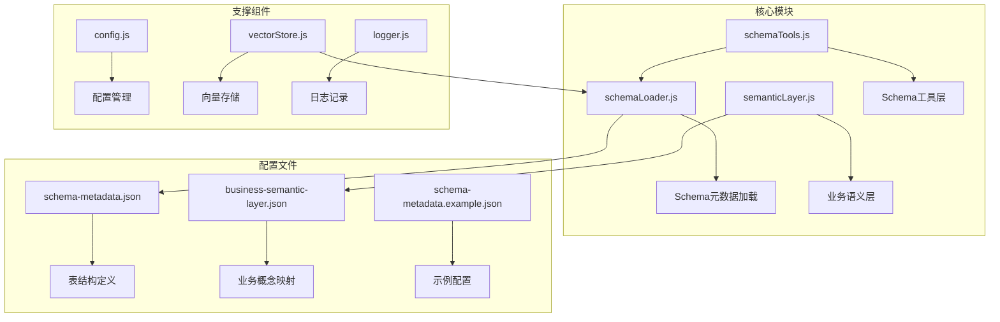
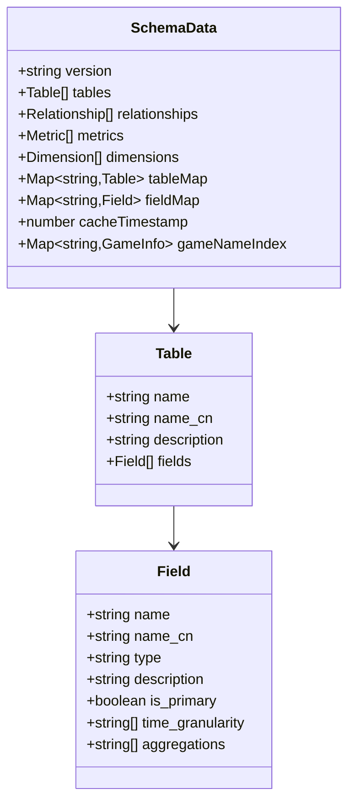
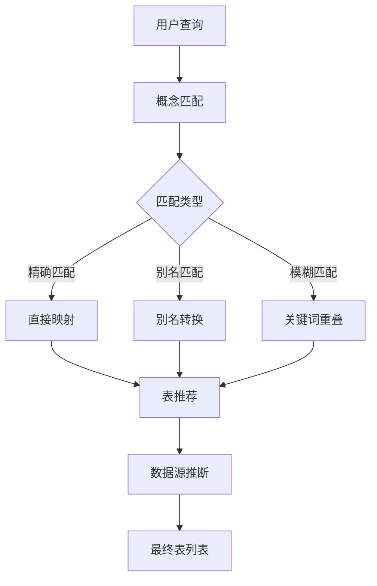
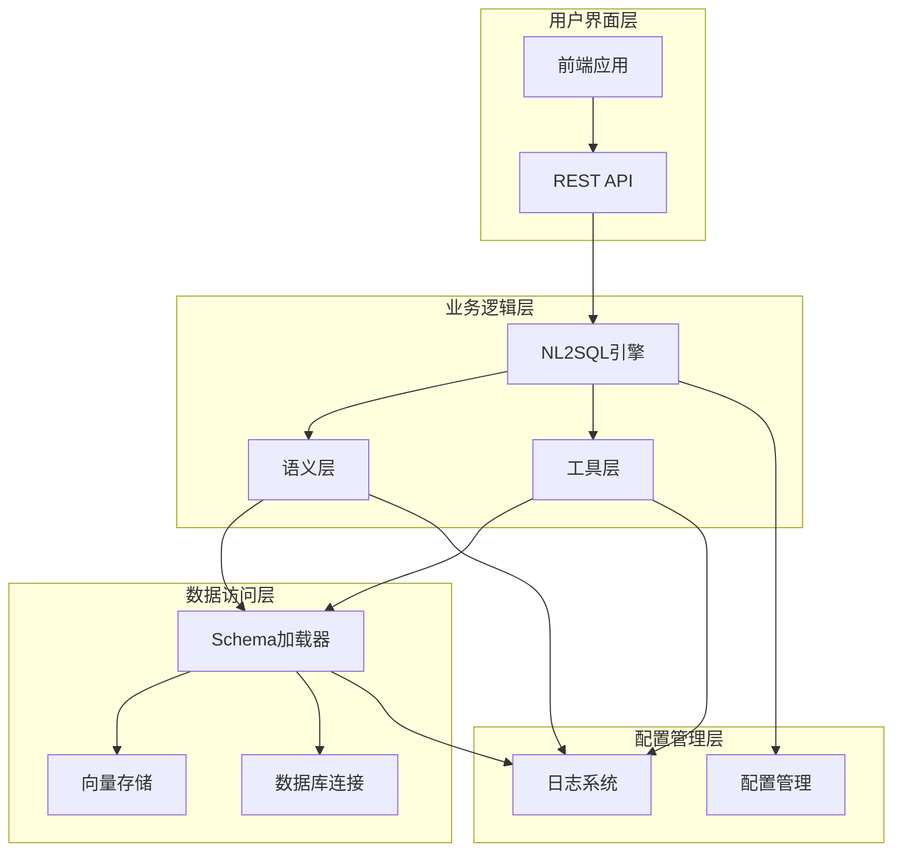
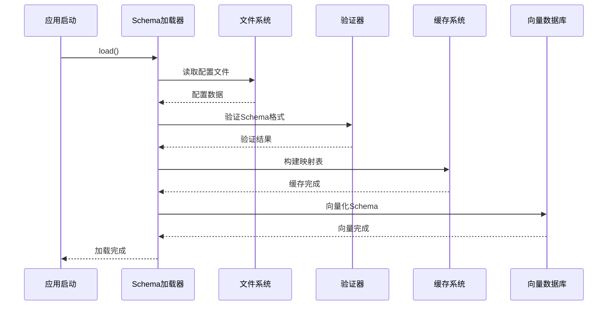
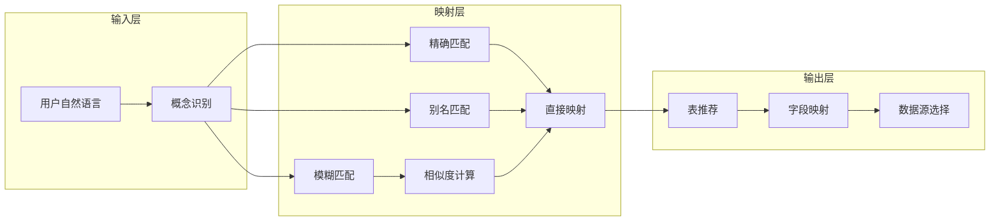
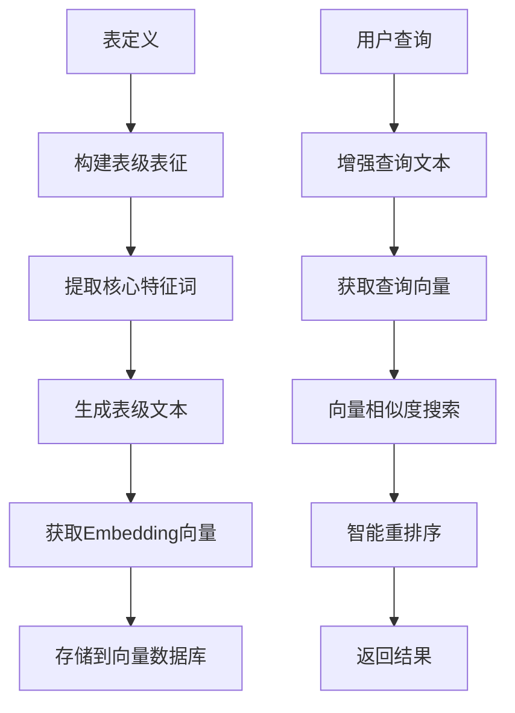
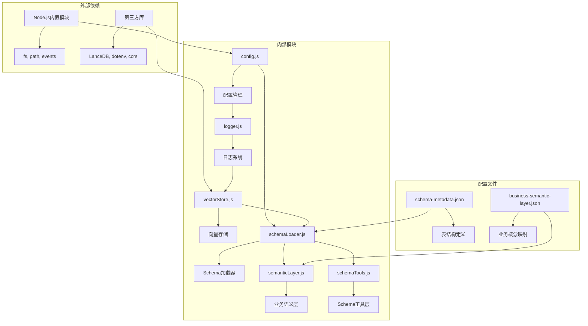

# Schema元数据管理

<cite>
**本文档引用的文件**
- [schemaLoader.js](file://backend/src/core/schemaLoader.js)
- [semanticLayer.js](file://backend/src/core/semanticLayer.js)
- [schemaTools.js](file://backend/src/core/schemaTools.js)
- [schema-metadata.json](file://backend/config/schema-metadata.json)
- [business-semantic-layer.json](file://backend/config/business-semantic-layer.json)
- [schema-metadata.example.json](file://backend/config/schema-metadata.example.json)
- [config.js](file://backend/src/core/config.js)
- [vectorStore.js](file://backend/src/memory/vectorStore.js)
- [logger.js](file://backend/src/utils/logger.js)
- [app.js](file://backend/src/app.js)
</cite>

## 目录
1. [简介](#简介)
2. [项目结构](#项目结构)
3. [核心组件](#核心组件)
4. [架构概览](#架构概览)
5. [详细组件分析](#详细组件分析)
6. [依赖关系分析](#依赖关系分析)
7. [性能考量](#性能考量)
8. [故障排除指南](#故障排除指南)
9. [结论](#结论)
10. [附录](#附录)

## 简介

NL2SQL项目的Schema元数据管理系统是一个关键的基础设施组件，负责管理和抽象数据库表结构，为自然语言到SQL的转换提供结构化的数据模型。该系统通过三层架构实现了从物理数据库表到业务概念的完整映射，支持语义搜索、智能推荐和安全验证等功能。

系统的核心目标是：
- **抽象化数据模型**：将复杂的数据库表结构抽象为易于理解的业务概念
- **提供语义搜索**：支持基于自然语言的表和字段发现
- **确保查询安全**：通过白名单和关键字过滤防止SQL注入
- **优化性能表现**：通过缓存和向量化技术提升查询效率

## 项目结构

NL2SQL项目采用模块化架构，Schema元数据管理相关的文件组织如下：

**图表来源**
- [schemaLoader.js:1-1235](file://backend/src/core/schemaLoader.js#L1-L1235)
- [semanticLayer.js:1-532](file://backend/src/core/semanticLayer.js#L1-L532)
- [schemaTools.js:1-632](file://backend/src/core/schemaTools.js#L1-L632)

**章节来源**
- [app.js:135-153](file://backend/src/app.js#L135-L153)

## 核心组件

### Schema元数据加载器

Schema元数据加载器是系统的核心组件，负责从配置文件加载和管理数据库表结构信息。它提供了完整的Schema生命周期管理功能：

**主要功能**：
- **配置文件加载**：从JSON文件读取表结构定义
- **数据验证**：确保Schema数据格式正确性和完整性
- **缓存管理**：提供内存缓存以提升查询性能
- **向量化支持**：将Schema信息转换为向量用于语义搜索
- **查询接口**：提供丰富的查询和匹配功能

**数据结构设计**：

**图表来源**
- [schemaLoader.js:36-51](file://backend/src/core/schemaLoader.js#L36-L51)
- [schema-metadata.json:4-127](file://backend/config/schema-metadata.json#L4-L127)

**章节来源**
- [schemaLoader.js:75-131](file://backend/src/core/schemaLoader.js#L75-L131)
- [schemaLoader.js:140-164](file://backend/src/core/schemaLoader.js#L140-L164)

### 业务语义层

业务语义层模块建立了业务概念到物理表/字段的映射关系，解决了业务术语识别和模糊匹配问题：

**核心特性**：
- **概念映射**：将业务术语映射到具体的数据库表和字段
- **别名识别**：支持业务术语的多种表达方式
- **数据源推断**：根据查询内容推断应该使用的数据源
- **表推荐**：基于业务概念推荐最相关的表

**配置结构**：

**图表来源**
- [semanticLayer.js:134-167](file://backend/src/core/semanticLayer.js#L134-L167)
- [semanticLayer.js:238-306](file://backend/src/core/semanticLayer.js#L238-L306)

**章节来源**
- [semanticLayer.js:48-73](file://backend/src/core/semanticLayer.js#L48-L73)
- [semanticLayer.js:367-386](file://backend/src/core/semanticLayer.js#L367-L386)

### Schema工具层

Schema工具层提供了LLM可调用的Schema探索工具，实现了"按需索取"的查询模式：

**工具功能**：
- **search_tables**：根据关键词搜索相关表
- **describe_table**：获取指定表的详细字段信息
- **search_knowledge**：查询业务概念的定义和映射
- **peek_table**：查看表的前N行样例数据

**设计原则**：
- **安全性**：仅返回结构信息，不执行实际查询
- **效率性**：提供缓存机制减少重复查询
- **灵活性**：支持多种查询模式和参数组合

**章节来源**
- [schemaTools.js:225-256](file://backend/src/core/schemaTools.js#L225-L256)
- [schemaTools.js:565-577](file://backend/src/core/schemaTools.js#L565-L577)

## 架构概览

NL2SQL的Schema元数据管理系统采用了分层架构设计，确保了系统的可扩展性和可维护性：

**图表来源**
- [app.js:97-194](file://backend/src/app.js#L97-L194)
- [config.js:16-398](file://backend/src/core/config.js#L16-L398)

**章节来源**
- [app.js:135-153](file://backend/src/app.js#L135-L153)
- [config.js:240-250](file://backend/src/core/config.js#L240-L250)

## 详细组件分析

### Schema元数据加载机制

Schema元数据加载机制是整个系统的核心，负责将配置文件中的表结构信息转换为内存中的可查询数据结构：

**加载流程**：

**图表来源**
- [schemaLoader.js:75-131](file://backend/src/core/schemaLoader.js#L75-L131)
- [schemaLoader.js:210-285](file://backend/src/core/schemaLoader.js#L210-L285)

**关键特性**：
- **异步加载**：支持异步文件读取和向量化处理
- **错误处理**：完善的异常捕获和错误恢复机制
- **性能优化**：内存映射和缓存策略提升查询速度
- **向量化支持**：自动将Schema信息转换为向量用于语义搜索

**章节来源**
- [schemaLoader.js:170-198](file://backend/src/core/schemaLoader.js#L170-L198)
- [schemaLoader.js:210-285](file://backend/src/core/schemaLoader.js#L210-L285)

### 业务概念映射系统

业务概念映射系统是NL2SQL项目的重要创新，它解决了业务术语与技术实现之间的鸿沟：

**映射策略**：

**图表来源**
- [semanticLayer.js:177-214](file://backend/src/core/semanticLayer.js#L177-L214)
- [semanticLayer.js:238-306](file://backend/src/core/semanticLayer.js#L238-L306)

**匹配算法**：
- **精确匹配**：完全相同的业务术语
- **别名匹配**：支持同义词和缩写形式
- **模糊匹配**：基于关键词重叠的相似度计算

**章节来源**
- [semanticLayer.js:134-167](file://backend/src/core/semanticLayer.js#L134-L167)
- [semanticLayer.js:367-386](file://backend/src/core/semanticLayer.js#L367-L386)

### 向量存储与语义搜索

向量存储模块基于LanceDB实现了高级的语义搜索功能，支持基于业务概念的智能表推荐：

**向量化流程**：

**图表来源**
- [schemaLoader.js:300-340](file://backend/src/core/schemaLoader.js#L300-L340)
- [schemaLoader.js:571-653](file://backend/src/core/schemaLoader.js#L571-L653)

**智能搜索特性**：
- **游戏识别**：自动识别查询中提到的具体游戏
- **平台推断**：根据游戏ID推断新老平台类型
- **权重调整**：根据不同场景调整表的推荐权重
- **过滤机制**：支持基于域和数据类型的过滤

**章节来源**
- [schemaLoader.js:571-653](file://backend/src/core/schemaLoader.js#L571-L653)
- [vectorStore.js:452-576](file://backend/src/memory/vectorStore.js#L452-L576)

## 依赖关系分析

Schema元数据管理系统涉及多个模块间的复杂依赖关系：

**图表来源**
- [schemaLoader.js:16-26](file://backend/src/core/schemaLoader.js#L16-L26)
- [semanticLayer.js:14-17](file://backend/src/core/semanticLayer.js#L14-L17)
- [vectorStore.js:14-23](file://backend/src/memory/vectorStore.js#L14-L23)

**依赖特点**：
- **低耦合高内聚**：各模块职责明确，相互依赖最小化
- **配置驱动**：通过配置文件实现灵活的功能开关
- **错误隔离**：向量存储失败不影响主流程运行
- **渐进式加载**：业务语义层加载失败时使用传统流程

**章节来源**
- [app.js:147-153](file://backend/src/app.js#L147-L153)
- [config.js:366-388](file://backend/src/core/config.js#L366-L388)

## 性能考量

Schema元数据管理系统在设计时充分考虑了性能优化：

### 缓存策略
- **内存缓存**：Schema数据在内存中缓存，避免重复加载
- **索引构建**：建立表名和字段名的快速查找映射
- **向量缓存**：向量数据库中的Schema向量可重复使用

### 查询优化
- **智能搜索**：结合关键词匹配和语义搜索的优势
- **结果过滤**：在应用层进行二次过滤提升准确性
- **权重调整**：根据不同场景动态调整表的推荐权重

### 扩展性设计
- **模块化架构**：各功能模块独立，便于单独优化
- **配置驱动**：通过配置文件控制各种性能参数
- **渐进式功能**：向量存储等高级功能可选启用

## 故障排除指南

### 常见问题及解决方案

**Schema加载失败**
- **症状**：应用启动时报Schema配置文件不存在
- **原因**：配置文件路径错误或文件损坏
- **解决**：检查SCHEMA_CONFIG_PATH配置，确认文件存在且格式正确

**向量存储初始化失败**
- **症状**：向量数据库未初始化，语义搜索功能不可用
- **原因**：LanceDB安装问题或权限不足
- **解决**：检查LanceDB依赖安装，确认数据目录权限

**业务语义层加载失败**
- **症状**：业务概念映射功能不可用
- **原因**：business-semantic-layer.json配置文件错误
- **解决**：检查JSON格式，参考示例配置文件修正

**章节来源**
- [schemaLoader.js:82-86](file://backend/src/core/schemaLoader.js#L82-L86)
- [app.js:147-153](file://backend/src/app.js#L147-L153)
- [logger.js:254-258](file://backend/src/utils/logger.js#L254-L258)

## 结论

NL2SQL项目的Schema元数据管理系统通过精心设计的三层架构，成功实现了从物理数据库表到业务概念的完整抽象。该系统不仅提供了强大的Schema管理功能，还通过向量化技术和智能搜索算法，显著提升了用户体验和查询效率。

**主要优势**：
- **完整的抽象层次**：从物理表结构到业务概念的多层次抽象
- **智能搜索能力**：支持基于自然语言的表和字段发现
- **安全可靠**：完善的SQL安全验证和访问控制
- **高性能表现**：通过缓存和向量化技术优化性能
- **易于扩展**：模块化设计便于功能扩展和定制

**未来发展方向**：
- **自动化Schema发现**：减少手工配置工作量
- **机器学习集成**：利用ML技术提升语义理解和推荐精度
- **实时同步机制**：支持数据库结构变更的实时同步
- **多租户支持**：扩展到多租户环境下的Schema管理

## 附录

### Schema配置最佳实践

**表结构定义规范**：
- 使用清晰的表名和字段命名约定
- 提供详细的中文描述和业务含义
- 明确字段的数据类型和约束条件
- 标注主键和外键关系

**业务概念映射建议**：
- 建立完整的业务术语词典
- 支持多语言和多地区变体
- 定期更新和维护概念映射
- 建立反馈机制持续优化

**性能优化建议**：
- 合理设置缓存过期时间
- 优化向量维度和存储策略
- 监控查询性能和资源使用
- 建立性能基准测试体系