# 向量数据库集成

<cite>
**本文档引用的文件**
- [vectorStore.js](file://backend/src/memory/vectorStore.js)
- [config.js](file://backend/src/core/config.js)
- [schemaLoader.js](file://backend/src/core/schemaLoader.js)
- [nl2sqlEngine.js](file://backend/src/core/nl2sqlEngine.js)
- [evaluation.js](file://backend/src/utils/evaluation.js)
- [logger.js](file://backend/src/utils/logger.js)
- [package.json](file://backend/package.json)
</cite>

## 目录
1. [简介](#简介)
2. [项目结构](#项目结构)
3. [核心组件](#核心组件)
4. [架构概览](#架构概览)
5. [详细组件分析](#详细组件分析)
6. [依赖分析](#依赖分析)
7. [性能考虑](#性能考虑)
8. [故障排除指南](#故障排除指南)
9. [结论](#结论)
10. [附录](#附录)

## 简介

NL2SQL项目中的向量数据库集成为系统提供了强大的语义检索能力，基于LanceDB实现了Schema向量和查询向量的存储与检索。该集成支持自然语言到SQL的智能转换，通过向量相似度搜索实现语义匹配、查询推荐和Schema发现等功能。

## 项目结构

NL2SQL项目的向量数据库集成采用模块化设计，主要包含以下核心组件：

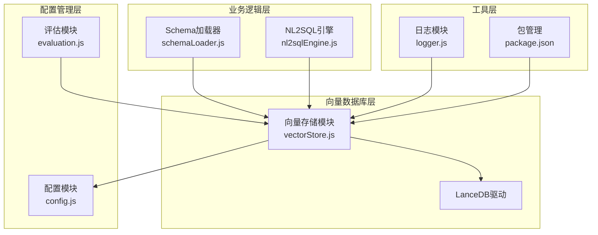

**图表来源**
- [vectorStore.js:1-800](file://backend/src/memory/vectorStore.js#L1-L800)
- [config.js:1-398](file://backend/src/core/config.js#L1-L398)
- [schemaLoader.js:1-800](file://backend/src/core/schemaLoader.js#L1-L800)

**章节来源**
- [vectorStore.js:1-800](file://backend/src/memory/vectorStore.js#L1-L800)
- [config.js:1-398](file://backend/src/core/config.js#L1-L398)

## 核心组件

### LanceDB向量数据库

LanceDB作为向量数据库的选择基于以下优势：
- **嵌入式数据库**：无需独立的数据库服务，简化部署
- **高性能向量检索**：支持多种距离度量和索引类型
- **文件系统存储**：基于本地文件系统的向量数据存储
- **实时更新**：支持向量的增删改查操作

### 向量存储结构

系统采用双表结构存储不同类型的数据向量：

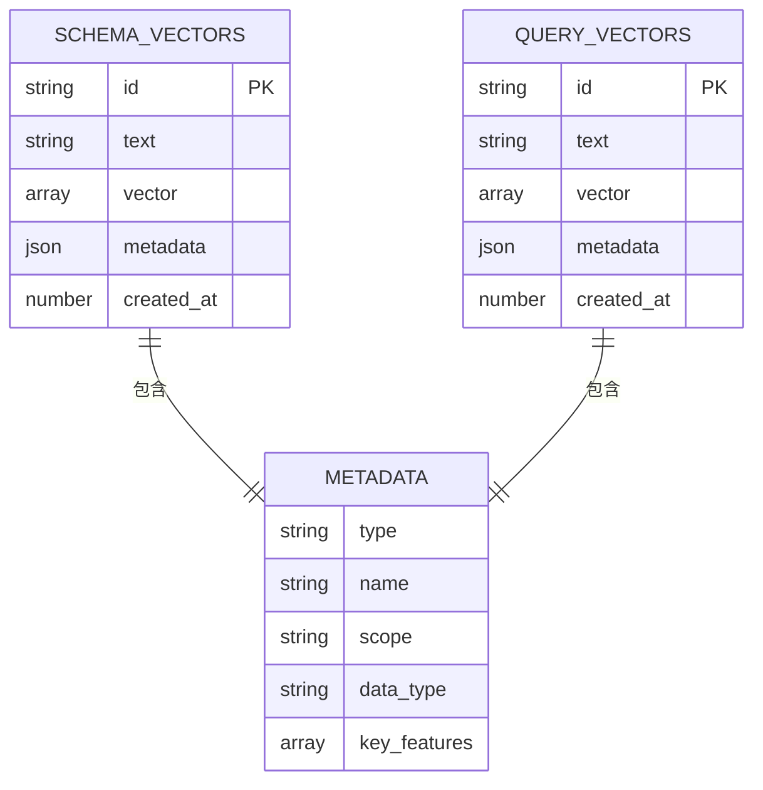

**图表来源**
- [vectorStore.js:269-324](file://backend/src/memory/vectorStore.js#L269-L324)
- [vectorStore.js:338-437](file://backend/src/memory/vectorStore.js#L338-L437)

### 配置管理

向量数据库配置通过统一的配置模块管理：

| 配置项 | 默认值 | 描述 |
|--------|--------|------|
| vectorDb.path | ./data/vectordb | 向量数据库存储路径 |
| embedding.dimension | 1536 | 嵌入向量维度 |
| embedding.model | text-embedding-3-small | 嵌入模型名称 |

**章节来源**
- [config.js:106-109](file://backend/src/core/config.js#L106-L109)
- [config.js:80-87](file://backend/src/core/config.js#L80-L87)

## 架构概览

向量数据库集成的整体架构如下：

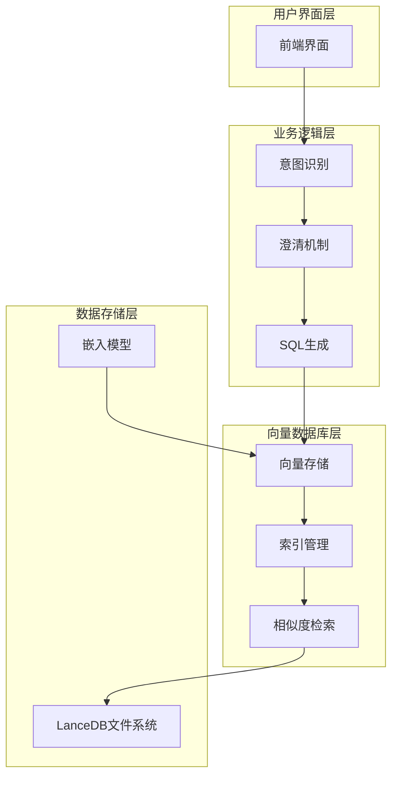

**图表来源**
- [nl2sqlEngine.js:132-151](file://backend/src/core/nl2sqlEngine.js#L132-L151)
- [schemaLoader.js:596-653](file://backend/src/core/schemaLoader.js#L596-L653)

## 详细组件分析

### 向量存储模块

向量存储模块是整个系统的核心组件，负责向量数据的增删改查操作：

#### 初始化流程

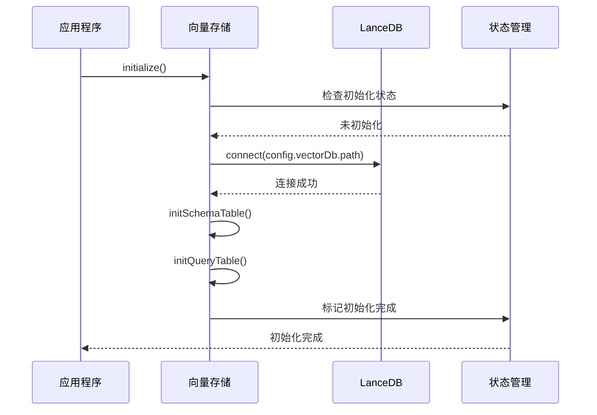

**图表来源**
- [vectorStore.js:233-263](file://backend/src/memory/vectorStore.js#L233-L263)
- [vectorStore.js:269-324](file://backend/src/memory/vectorStore.js#L269-L324)

#### Schema向量管理

Schema向量用于存储数据库表结构的语义信息：

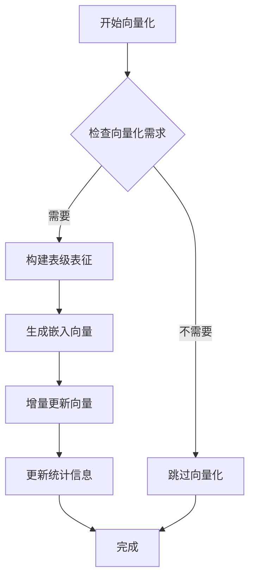

**图表来源**
- [schemaLoader.js:210-285](file://backend/src/core/schemaLoader.js#L210-L285)
- [schemaLoader.js:300-340](file://backend/src/core/schemaLoader.js#L300-L340)

#### 查询向量管理

查询向量用于存储用户历史查询的语义表示：

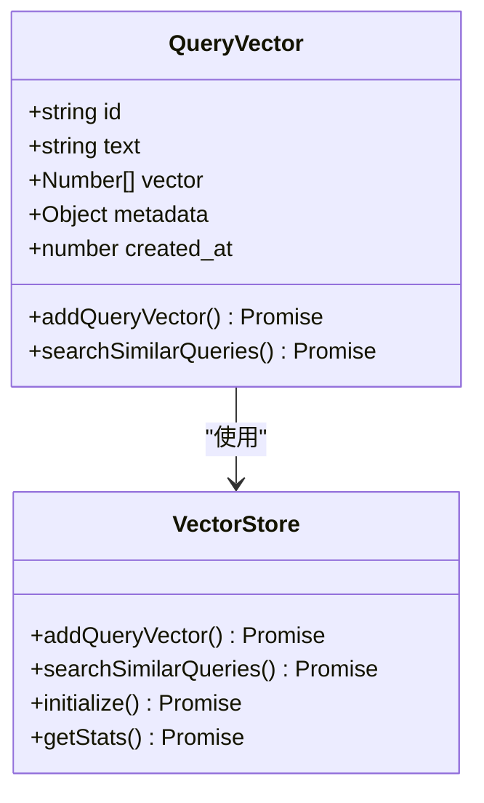

**图表来源**
- [vectorStore.js:620-646](file://backend/src/memory/vectorStore.js#L620-L646)
- [vectorStore.js:656-687](file://backend/src/memory/vectorStore.js#L656-L687)

**章节来源**
- [vectorStore.js:233-800](file://backend/src/memory/vectorStore.js#L233-L800)
- [schemaLoader.js:200-285](file://backend/src/core/schemaLoader.js#L200-L285)

### 智能搜索算法

系统实现了高级的智能搜索算法，结合查询意图识别和重排序：

#### 搜索流程

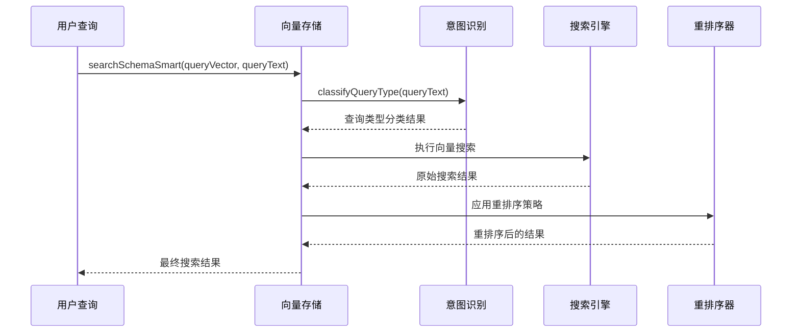

**图表来源**
- [vectorStore.js:452-576](file://backend/src/memory/vectorStore.js#L452-L576)
- [vectorStore.js:440-576](file://backend/src/memory/vectorStore.js#L440-L576)

#### 重排序策略

系统采用多维度的重排序策略：

| 策略类型 | 评分权重 | 实现方式 |
|----------|----------|----------|
| 查询意图识别 | 100分 | 检测游戏名称、平台术语 |
| 平台优先级 | 80-10分 | 平台核心表优先，报表降权 |
| 数据源类型 | 30-20分 | 原始日志优先，报表降权 |
| 向量相似度 | 0-20分 | 距离归一化评分 |
| 表名模式匹配 | -30分 | 未指定游戏时游戏表降权 |

**章节来源**
- [vectorStore.js:440-576](file://backend/src/memory/vectorStore.js#L440-L576)
- [vectorStore.js:586-605](file://backend/src/memory/vectorStore.js#L586-L605)

### 评估与监控

系统提供了完善的评估和监控机制：

#### 性能评估

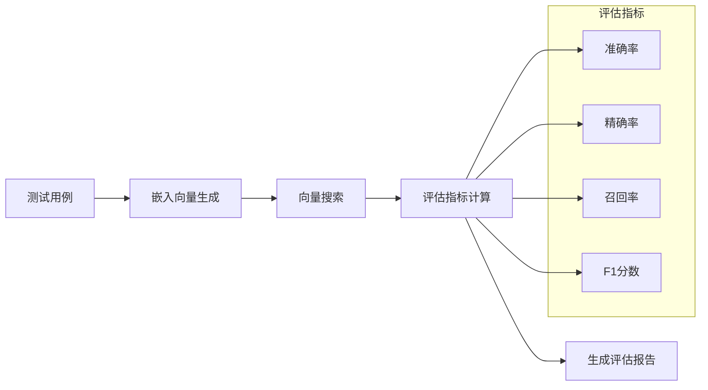

**图表来源**
- [evaluation.js:158-266](file://backend/src/utils/evaluation.js#L158-L266)
- [evaluation.js:276-334](file://backend/src/utils/evaluation.js#L276-L334)

**章节来源**
- [evaluation.js:158-488](file://backend/src/utils/evaluation.js#L158-L488)

## 依赖分析

### 外部依赖

系统对外部依赖的管理：

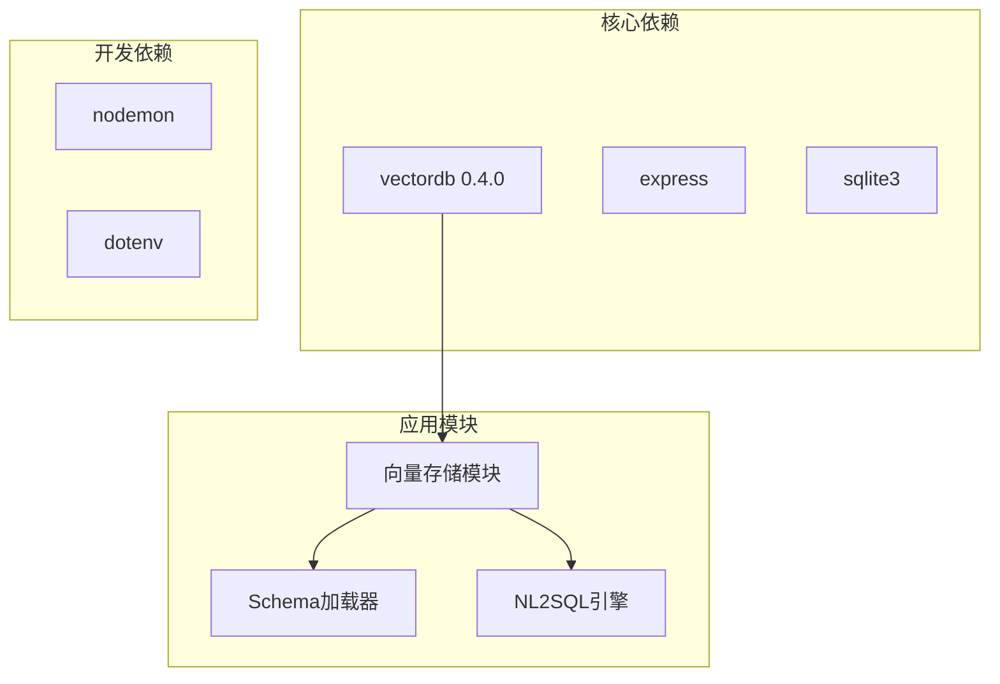

**图表来源**
- [package.json:10-27](file://backend/package.json#L10-L27)

### 内部模块依赖

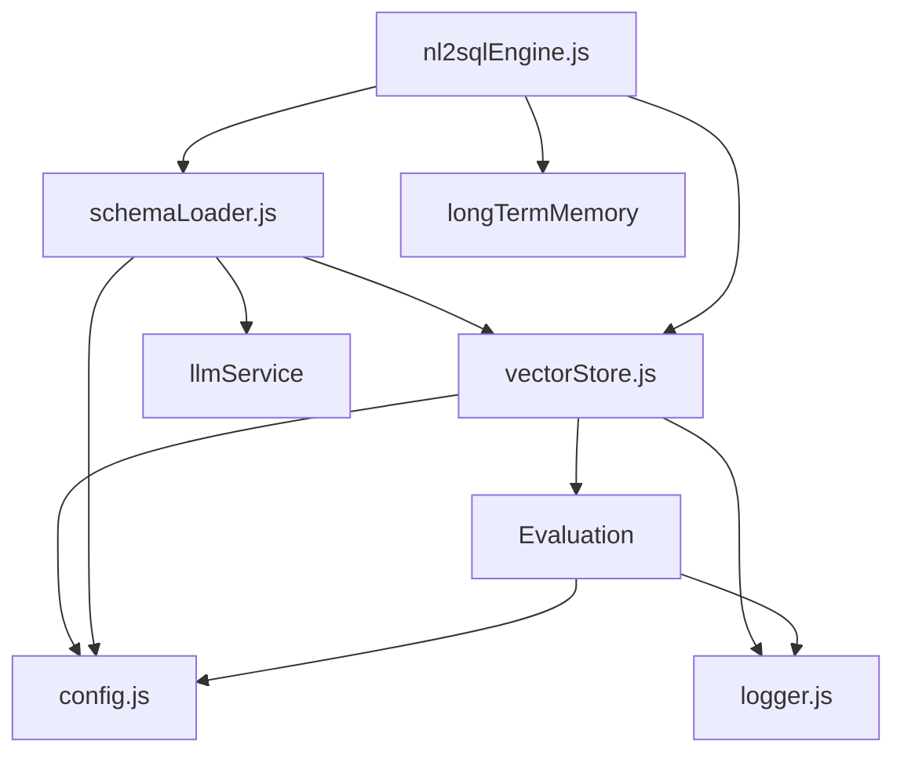

**图表来源**
- [vectorStore.js:14-23](file://backend/src/memory/vectorStore.js#L14-L23)
- [schemaLoader.js:15-26](file://backend/src/core/schemaLoader.js#L15-L26)
- [nl2sqlEngine.js:16-33](file://backend/src/core/nl2sqlEngine.js#L16-L33)

**章节来源**
- [package.json:1-28](file://backend/package.json#L1-L28)
- [vectorStore.js:14-23](file://backend/src/memory/vectorStore.js#L14-L23)

## 性能考虑

### 索引优化策略

系统采用以下索引优化策略：

1. **向量维度优化**
   - 使用1536维嵌入向量，平衡精度和性能
   - 支持多种距离度量（余弦距离、欧几里得距离）

2. **批量操作优化**
   - 支持批量向量插入和更新
   - 增量更新机制避免全量重建

3. **查询优化**
   - 搜索更多候选项再过滤（topK*2）
   - 应用层过滤减少不必要的数据传输

### 缓存策略

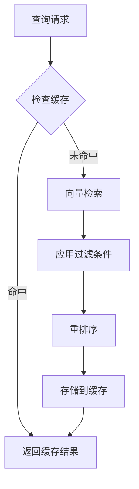

### 存储优化

1. **数据清理**
   - 定期清理过期向量数据
   - 支持向量数据的增量更新

2. **内存管理**
   - 限制搜索结果数量
   - 控制元数据大小

## 故障排除指南

### 常见问题诊断

#### 向量数据库初始化失败

**症状**：应用程序启动时报错，向量搜索功能不可用

**排查步骤**：
1. 检查向量数据库路径权限
2. 验证LanceDB依赖安装
3. 确认配置文件中的路径设置

**解决方案**：
```javascript
// 检查向量数据库状态
if (!vectorStore.isInitialized()) {
    logger.warn('向量数据库未初始化');
    // 尝试重新初始化
    await vectorStore.initialize();
}
```

#### 向量检索结果不准确

**症状**：语义搜索返回的相关性较低

**排查步骤**：
1. 检查嵌入模型配置
2. 验证向量维度设置
3. 分析查询意图识别准确性

**优化建议**：
- 调整搜索topK参数
- 优化表级表征文本构建
- 增加训练数据量

#### 性能问题

**症状**：向量检索响应时间过长

**排查步骤**：
1. 监控向量数据库文件大小
2. 检查磁盘I/O性能
3. 分析查询模式

**优化策略**：
- 实施查询缓存
- 优化批量操作
- 调整索引参数

**章节来源**
- [logger.js:312-322](file://backend/src/utils/logger.js#L312-L322)
- [vectorStore.js:258-262](file://backend/src/memory/vectorStore.js#L258-L262)

## 结论

NL2SQL项目中的向量数据库集成为系统提供了强大的语义检索能力，通过LanceDB实现了高效、可扩展的向量存储解决方案。系统的设计充分考虑了性能优化、错误处理和监控需求，为自然语言到SQL的转换提供了坚实的技术基础。

主要优势包括：
- **模块化设计**：清晰的组件分离和职责划分
- **性能优化**：多层缓存和索引优化策略
- **可扩展性**：支持增量更新和动态扩展
- **监控完善**：全面的评估和统计功能

未来可以进一步优化的方向包括：
- 实现更精细的索引管理
- 增强查询缓存策略
- 优化大规模数据处理能力

## 附录

### 配置参考

| 配置项 | 类型 | 默认值 | 说明 |
|--------|------|--------|------|
| VECTOR_DB_PATH | string | ./data/vectordb | 向量数据库存储路径 |
| EMBEDDING_MODEL | string | text-embedding-3-small | 嵌入模型名称 |
| EMBEDDING_DIMENSION | number | 1536 | 嵌入向量维度 |
| SCHEMA_REVECTORIZE | boolean | false | 是否强制重新向量化 |

### 监控指标

系统提供以下监控指标：
- 向量检索命中率
- 搜索响应时间
- 向量数据量统计
- 系统错误率