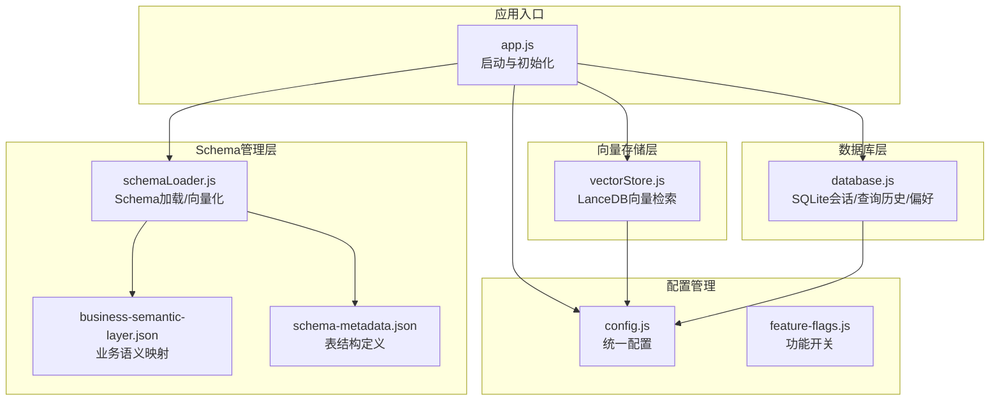
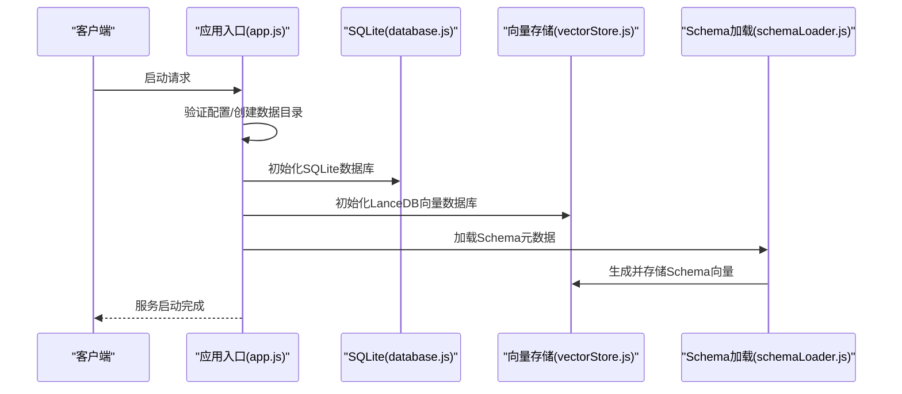
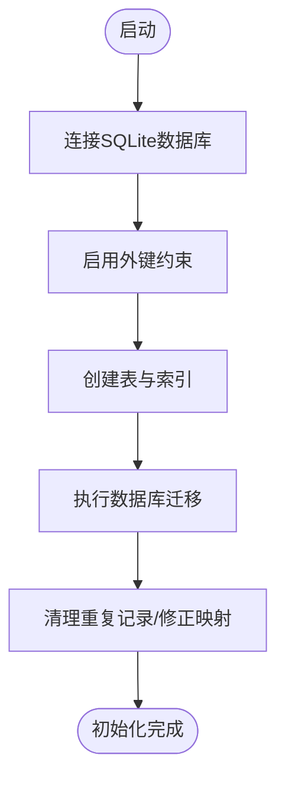
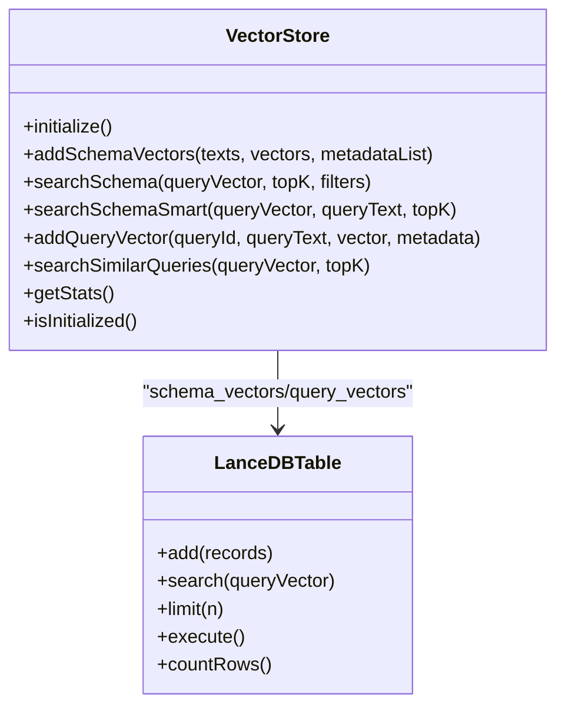
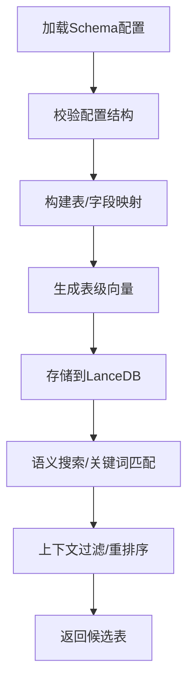
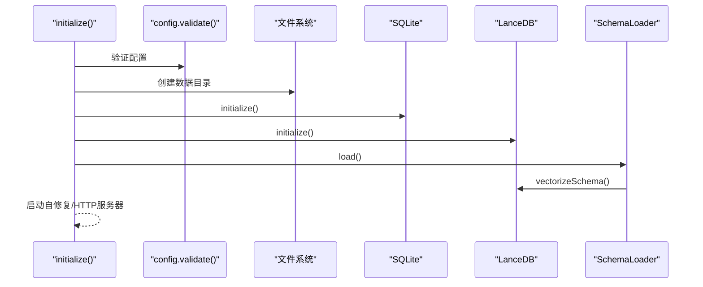
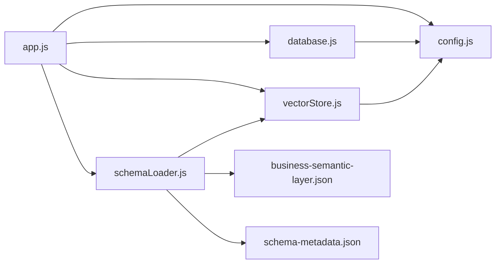
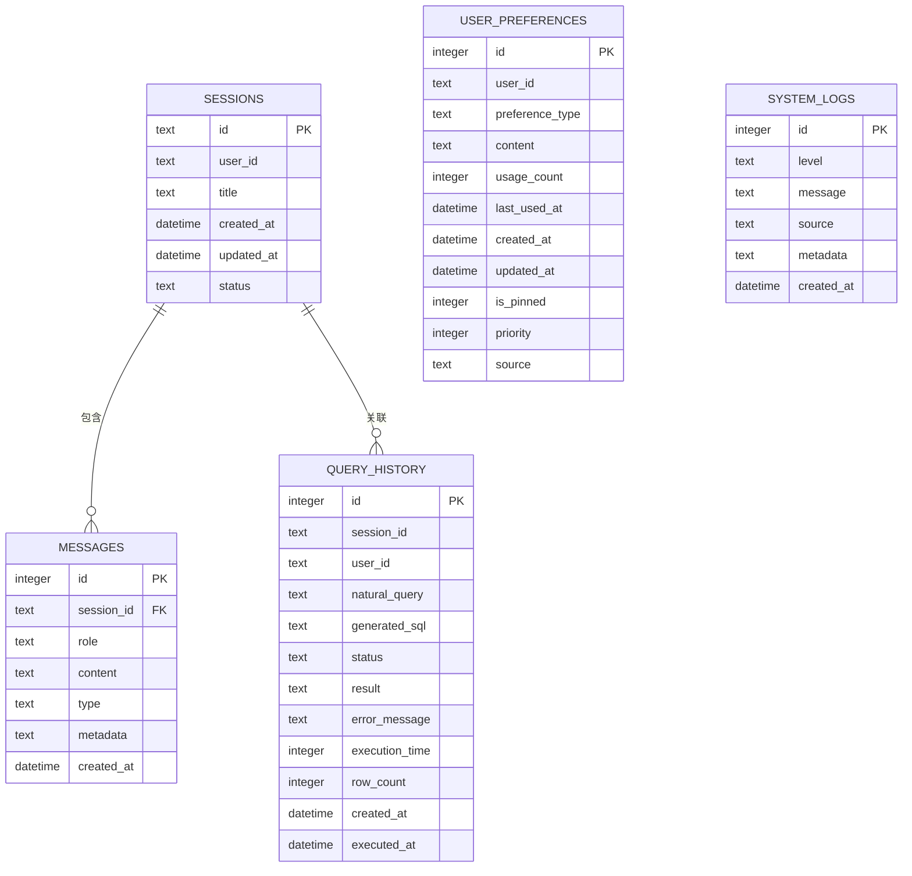

# 数据库与Schema设计

<cite>
**本文引用的文件**
- [database.js](file://backend/src/core/database.js)
- [vectorStore.js](file://backend/src/memory/vectorStore.js)
- [schemaLoader.js](file://backend/src/core/schemaLoader.js)
- [config.js](file://backend/src/core/config.js)
- [schema-metadata.json](file://backend/config/schema-metadata.json)
- [business-semantic-layer.json](file://backend/config/business-semantic-layer.json)
- [app.js](file://backend/src/app.js)
- [feature-flags.js](file://backend/config/feature-flags.js)
- [package.json](file://backend/package.json)
</cite>

## 目录
1. [简介](#简介)
2. [项目结构](#项目结构)
3. [核心组件](#核心组件)
4. [架构总览](#架构总览)
5. [详细组件分析](#详细组件分析)
6. [依赖关系分析](#依赖关系分析)
7. [性能考量](#性能考量)
8. [故障排查指南](#故障排查指南)
9. [结论](#结论)
10. [附录](#附录)

## 简介
本技术文档面向NL2SQL项目的数据库与Schema设计，重点涵盖：
- SQLite数据库设计与初始化流程
- LanceDB向量数据库的集成与使用场景
- Schema元数据管理机制（表结构、字段类型、业务概念到物理表的映射）
- 数据库初始化流程（表结构创建、索引建立、数据迁移策略）
- 向量数据库的语义搜索、相似度匹配与查询优化
- Schema配置最佳实践（命名规范、关系设计、性能优化）
- 数据模型图表与实际配置示例

## 项目结构
NL2SQL后端采用模块化设计，核心围绕“配置管理、数据库、向量存储、Schema加载”四大模块展开，并通过应用入口统一初始化与启动。

**图表来源**
- [app.js:97-194](file://backend/src/app.js#L97-L194)
- [config.js:16-355](file://backend/src/core/config.js#L16-L355)
- [database.js:206-267](file://backend/src/core/database.js#L206-L267)
- [vectorStore.js:233-263](file://backend/src/memory/vectorStore.js#L233-L263)
- [schemaLoader.js:75-131](file://backend/src/core/schemaLoader.js#L75-L131)

**章节来源**
- [app.js:97-194](file://backend/src/app.js#L97-L194)
- [config.js:16-355](file://backend/src/core/config.js#L16-L355)

## 核心组件
- SQLite数据库模块：负责会话、消息、查询历史、用户偏好、系统日志等数据的持久化，提供事务、索引、迁移能力。
- LanceDB向量存储模块：负责Schema向量与查询历史向量的存储与检索，支持语义搜索、智能重排序与过滤。
- Schema元数据加载模块：负责加载JSON配置文件，构建表/字段/关系/指标/维度映射，支持向量化与语义搜索。
- 配置管理模块：集中管理数据库、向量库、LLM、安全、会话、日志、评估等配置项。
- 应用入口：统一初始化各模块，启动HTTP与SSE服务。

**章节来源**
- [database.js:206-267](file://backend/src/core/database.js#L206-L267)
- [vectorStore.js:233-263](file://backend/src/memory/vectorStore.js#L233-L263)
- [schemaLoader.js:75-131](file://backend/src/core/schemaLoader.js#L75-L131)
- [config.js:16-355](file://backend/src/core/config.js#L16-L355)

## 架构总览
NL2SQL的数据库与Schema设计采用“关系型数据+向量检索”的混合架构：
- SQLite用于结构化数据的持久化与事务保证，承载会话、消息、查询历史、用户偏好与系统日志。
- LanceDB用于语义检索与相似度匹配，支撑Schema表级向量与查询历史向量的存储与检索。
- Schema元数据驱动向量生成与检索，业务语义层提供概念到物理表的映射，提升检索准确性与可解释性。

**图表来源**
- [app.js:97-194](file://backend/src/app.js#L97-L194)
- [database.js:206-267](file://backend/src/core/database.js#L206-L267)
- [vectorStore.js:233-263](file://backend/src/memory/vectorStore.js#L233-L263)
- [schemaLoader.js:75-131](file://backend/src/core/schemaLoader.js#L75-L131)

## 详细组件分析

### SQLite数据库设计与初始化
- 设计目标：轻量、易部署、无需外部数据库服务，适合会话与历史数据的持久化。
- 表结构概览：
  - sessions：会话信息（用户ID、标题、状态、时间戳）
  - messages：会话消息（角色、类型、内容、元数据）
  - query_history：查询历史（自然语言、生成SQL、执行状态、结果、耗时）
  - user_preferences：用户偏好（字段别名、查询模式、指标/维度偏好、置顶与优先级）
  - system_logs：系统运行日志（级别、消息、来源、时间）
- 索引策略：按用户、状态、时间等高频查询维度建立索引，提升查询效率。
- 初始化流程：连接数据库、启用外键约束、创建表与索引、执行迁移（含去重与修正）。
- 事务与安全：提供事务封装、参数化查询、错误日志记录。

**图表来源**
- [database.js:206-267](file://backend/src/core/database.js#L206-L267)
- [database.js:277-404](file://backend/src/core/database.js#L277-L404)

**章节来源**
- [database.js:39-195](file://backend/src/core/database.js#L39-L195)
- [database.js:206-267](file://backend/src/core/database.js#L206-L267)
- [database.js:277-404](file://backend/src/core/database.js#L277-L404)

### LanceDB向量数据库集成
- 使用场景：
  - 存储Schema表级向量，支持语义搜索与智能重排序
  - 存储查询历史向量，支持相似查询检索
- 表结构：
  - schema_vectors：Schema向量表（文本、向量、元数据、时间戳）
  - query_vectors：查询历史向量表（文本、向量、元数据、时间戳）
- 核心能力：
  - 向量检索：支持topK返回与距离过滤
  - 智能搜索：结合查询意图与表名模式推断，进行优先级重排序
  - 元数据过滤：按scope、data_type等标签过滤
  - 统计与评估：记录向量搜索命中与质量统计

**图表来源**
- [vectorStore.js:233-263](file://backend/src/memory/vectorStore.js#L233-L263)
- [vectorStore.js:269-324](file://backend/src/memory/vectorStore.js#L269-L324)
- [vectorStore.js:379-437](file://backend/src/memory/vectorStore.js#L379-L437)
- [vectorStore.js:452-576](file://backend/src/memory/vectorStore.js#L452-L576)
- [vectorStore.js:619-687](file://backend/src/memory/vectorStore.js#L619-L687)

**章节来源**
- [vectorStore.js:233-263](file://backend/src/memory/vectorStore.js#L233-L263)
- [vectorStore.js:269-324](file://backend/src/memory/vectorStore.js#L269-L324)
- [vectorStore.js:379-437](file://backend/src/memory/vectorStore.js#L379-L437)
- [vectorStore.js:452-576](file://backend/src/memory/vectorStore.js#L452-L576)
- [vectorStore.js:619-687](file://backend/src/memory/vectorStore.js#L619-L687)

### Schema元数据管理机制
- 元数据来源：schema-metadata.json定义表结构、字段、关系、指标、维度；business-semantic-layer.json定义业务概念到物理表的映射。
- 加载与校验：读取JSON配置，验证结构完整性，构建表/字段映射，生成动态游戏名索引。
- 向量化策略：将表级表征文本向量化，包含域标签、数据类型、核心特征词，存储到schema_vectors表。
- 检索与匹配：支持语义搜索与关键词匹配，结合上下文（game_id、datasource）进行过滤与重排序。

**图表来源**
- [schemaLoader.js:75-131](file://backend/src/core/schemaLoader.js#L75-L131)
- [schemaLoader.js:140-164](file://backend/src/core/schemaLoader.js#L140-L164)
- [schemaLoader.js:170-198](file://backend/src/core/schemaLoader.js#L170-L198)
- [schemaLoader.js:210-285](file://backend/src/core/schemaLoader.js#L210-L285)
- [schemaLoader.js:571-653](file://backend/src/core/schemaLoader.js#L571-L653)

**章节来源**
- [schemaLoader.js:75-131](file://backend/src/core/schemaLoader.js#L75-L131)
- [schemaLoader.js:140-164](file://backend/src/core/schemaLoader.js#L140-L164)
- [schemaLoader.js:170-198](file://backend/src/core/schemaLoader.js#L170-L198)
- [schemaLoader.js:210-285](file://backend/src/core/schemaLoader.js#L210-L285)
- [schemaLoader.js:571-653](file://backend/src/core/schemaLoader.js#L571-L653)

### 数据库初始化流程详解
- 步骤分解：
  1) 验证配置（LLM API密钥、SR数据库URL等）
  2) 确保数据目录存在
  3) 初始化SQLite数据库（创建表、索引、启用外键）
  4) 初始化LanceDB向量数据库（打开/创建schema_vectors与query_vectors表）
  5) 加载Schema元数据并生成向量
  6) 启动自修复调度器与HTTP服务器

**图表来源**
- [app.js:97-194](file://backend/src/app.js#L97-L194)
- [config.js:366-388](file://backend/src/core/config.js#L366-L388)
- [database.js:206-267](file://backend/src/core/database.js#L206-L267)
- [vectorStore.js:233-263](file://backend/src/memory/vectorStore.js#L233-L263)
- [schemaLoader.js:75-131](file://backend/src/core/schemaLoader.js#L75-L131)

**章节来源**
- [app.js:97-194](file://backend/src/app.js#L97-L194)
- [config.js:366-388](file://backend/src/core/config.js#L366-L388)

### 向量数据库使用场景与查询优化
- 语义搜索：基于Embedding向量的相似度检索，支持topK返回与距离阈值过滤。
- 智能重排序：结合查询意图（是否提及具体游戏）、表名模式推断scope子类型、数据源类型（原始日志/聚合报表）等进行优先级打分。
- 元数据过滤：通过scope、data_type等标签进行二次过滤，提升检索准确性。
- 查询优化建议：
  - 向量维度与模型选择：根据Embedding模型维度配置，确保向量空间一致。
  - 增量更新：仅对变更的表进行向量化更新，减少全量重建成本。
  - 过滤与重排序：在应用层进行元数据过滤与重排序，平衡召回与精度。
  - 统计与评估：记录向量搜索命中与质量，持续优化检索效果。

**章节来源**
- [vectorStore.js:379-437](file://backend/src/memory/vectorStore.js#L379-L437)
- [vectorStore.js:452-576](file://backend/src/memory/vectorStore.js#L452-L576)
- [vectorStore.js:586-605](file://backend/src/memory/vectorStore.js#L586-L605)

### Schema配置最佳实践
- 字段命名规范：
  - 英文为主，中文名可选，统一使用小写+下划线风格。
  - 主键字段标注is_primary，外键字段标注foreign_key。
- 关系设计原则：
  - 明确主从关系与基数（一对一、一对多、多对多）。
  - 使用清晰的表前缀与命名约定（如平台、游戏、报表库）。
- 性能优化建议：
  - 为高频查询字段建立索引（用户ID、时间、状态）。
  - 控制单次查询返回行数上限，避免内存压力。
  - 启用白名单限制可访问表，防止敏感数据泄露。
- 配置管理：
  - 使用环境变量集中管理数据库路径、向量库路径、LLM API等配置。
  - 通过功能开关（feature-flags）渐进式启用新功能，便于回滚与灰度发布。

**章节来源**
- [schema-metadata.json:1-800](file://backend/config/schema-metadata.json#L1-L800)
- [business-semantic-layer.json:1-189](file://backend/config/business-semantic-layer.json#L1-L189)
- [config.js:16-355](file://backend/src/core/config.js#L16-L355)
- [feature-flags.js:16-96](file://backend/config/feature-flags.js#L16-L96)

## 依赖关系分析
- 模块耦合：
  - app.js统一协调配置、数据库、向量存储、Schema加载与自修复调度。
  - database.js与vectorStore.js分别依赖config.js提供的路径与参数。
  - schemaLoader.js依赖vectorStore.js进行向量化存储，依赖business-semantic-layer.json与schema-metadata.json进行元数据管理。
- 外部依赖：
  - sqlite3：SQLite数据库驱动
  - vectordb：LanceDB向量数据库客户端
  - dotenv：环境变量加载
  - express/cors/body-parser：HTTP服务与中间件

**图表来源**
- [app.js:39-50](file://backend/src/app.js#L39-L50)
- [config.js:16-355](file://backend/src/core/config.js#L16-L355)
- [database.js:12-19](file://backend/src/core/database.js#L12-L19)
- [vectorStore.js:14-23](file://backend/src/memory/vectorStore.js#L14-L23)
- [schemaLoader.js:15-26](file://backend/src/core/schemaLoader.js#L15-L26)

**章节来源**
- [package.json:10-20](file://backend/package.json#L10-L20)

## 性能考量
- SQLite性能：
  - 合理的索引策略（用户ID、状态、时间）显著提升查询性能。
  - 事务批量写入，减少磁盘I/O。
  - 外键约束启用带来一致性保障，但需注意对写入性能的影响。
- LanceDB性能：
  - 向量维度与模型选择直接影响检索速度与精度。
  - 增量更新策略减少全量重建成本。
  - 元数据过滤与重排序在应用层实现，平衡召回与精度。
- 安全与稳定性：
  - 白名单限制、禁止关键字过滤、最大返回行数限制等安全措施。
  - 自修复调度器定期健康检查与慢查询监控。

[本节为通用指导，无需特定文件引用]

## 故障排查指南
- SQLite初始化失败：
  - 检查数据库路径权限与磁盘空间
  - 确认外键约束启用是否成功
  - 查看迁移过程中的错误日志
- LanceDB初始化失败：
  - 检查向量库路径与权限
  - 确认Embedding维度与模型配置一致
  - 查看表创建与数据写入的日志
- Schema加载失败：
  - 检查schema-metadata.json与business-semantic-layer.json格式
  - 确认向量存储初始化状态
- 查询性能问题：
  - 检查索引是否合理
  - 评估白名单与行数限制配置
  - 启用评估与统计功能，定位瓶颈

**章节来源**
- [database.js:206-267](file://backend/src/core/database.js#L206-L267)
- [vectorStore.js:233-263](file://backend/src/memory/vectorStore.js#L233-L263)
- [schemaLoader.js:75-131](file://backend/src/core/schemaLoader.js#L75-L131)
- [config.js:140-170](file://backend/src/core/config.js#L140-L170)

## 结论
NL2SQL通过SQLite与LanceDB的协同，实现了结构化数据持久化与语义检索的有机结合。Schema元数据与业务语义层的引入，进一步提升了检索的准确性与可解释性。通过合理的索引策略、增量更新与安全配置，系统在保证性能的同时兼顾了安全性与可维护性。建议在生产环境中启用功能开关进行渐进式发布，并持续监控评估指标以优化检索质量。

[本节为总结性内容，无需特定文件引用]

## 附录

### 数据模型图表

**图表来源**
- [database.js:39-195](file://backend/src/core/database.js#L39-L195)

### 实际配置示例
- Schema元数据示例：参见schema-metadata.example.json，包含表、字段、关系、指标、维度的完整定义。
- 业务语义层示例：参见business-semantic-layer.json，定义业务概念到物理表的映射与查询模式。
- 配置文件位置：config/schema-metadata.json与config/business-semantic-layer.json。

**章节来源**
- [schema-metadata.example.json:1-328](file://backend/config/schema-metadata.example.json#L1-L328)
- [business-semantic-layer.json:1-189](file://backend/config/business-semantic-layer.json#L1-L189)
- [schema-metadata.json:1-800](file://backend/config/schema-metadata.json#L1-L800)