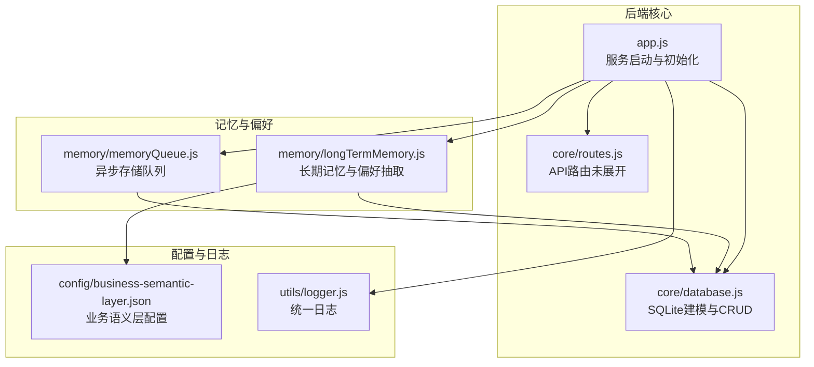
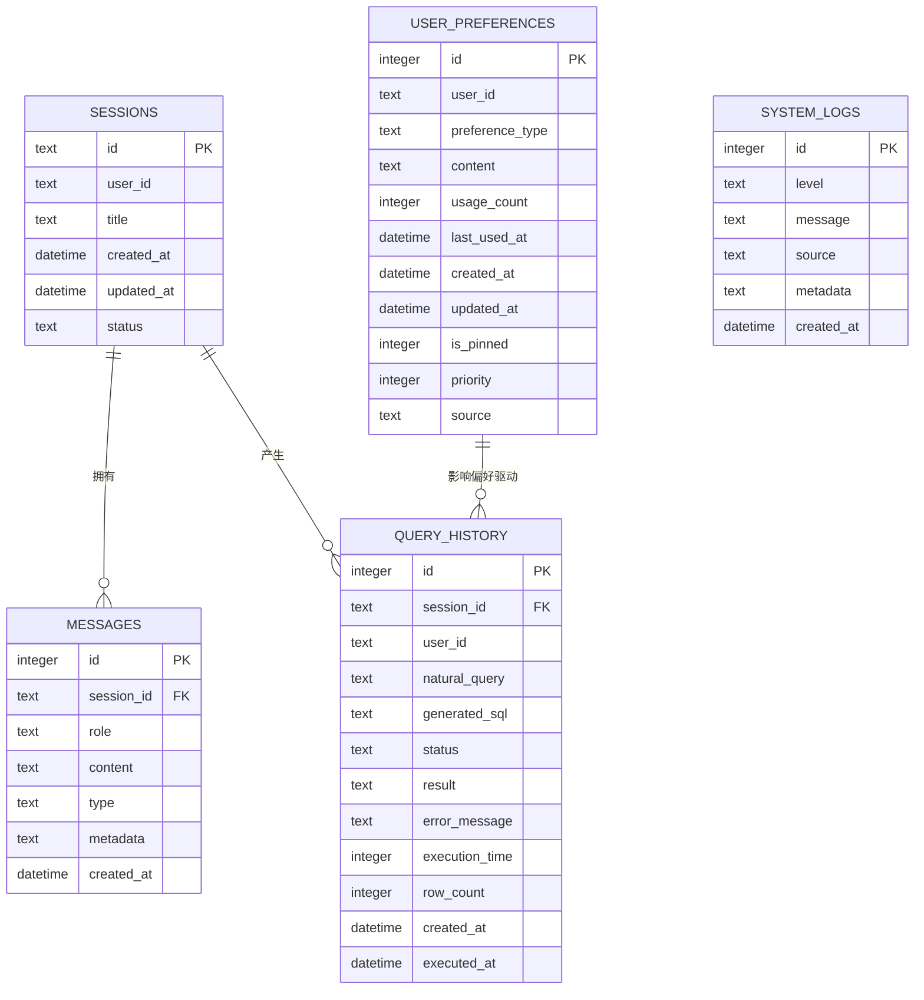
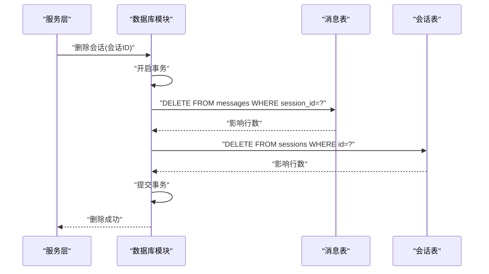
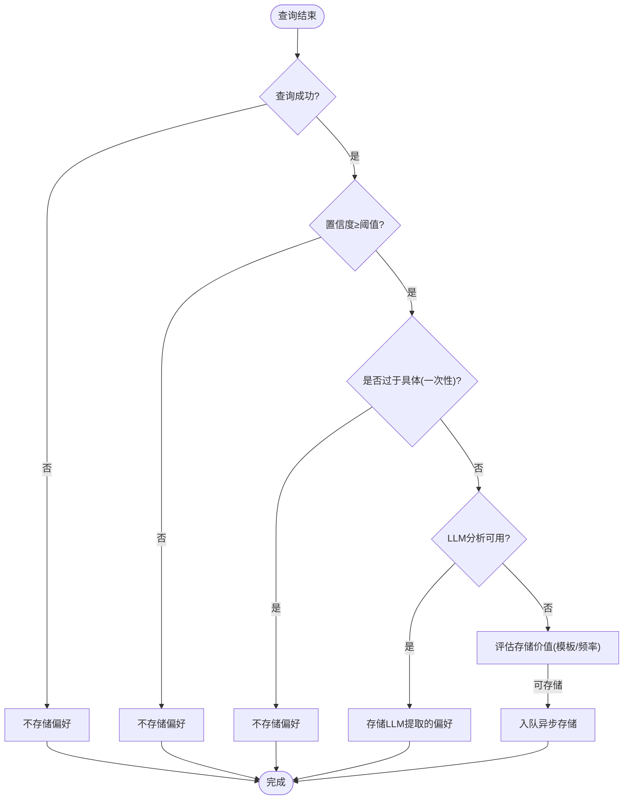
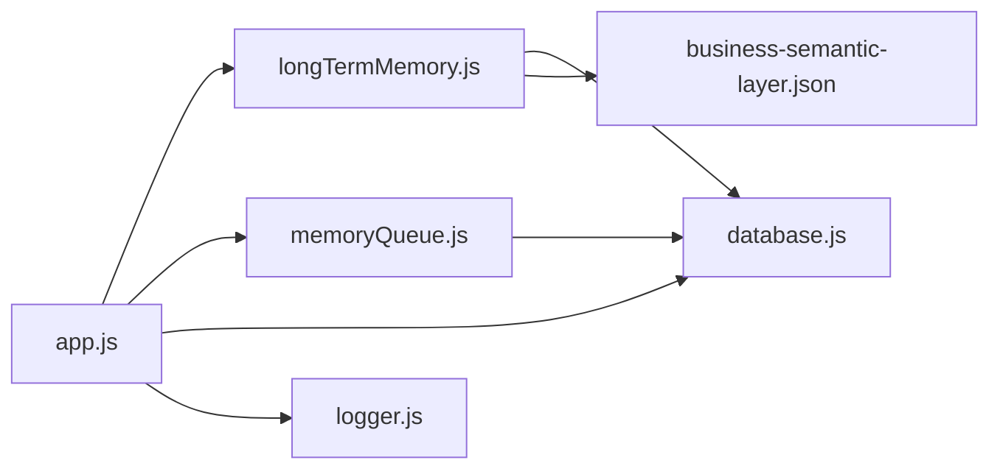
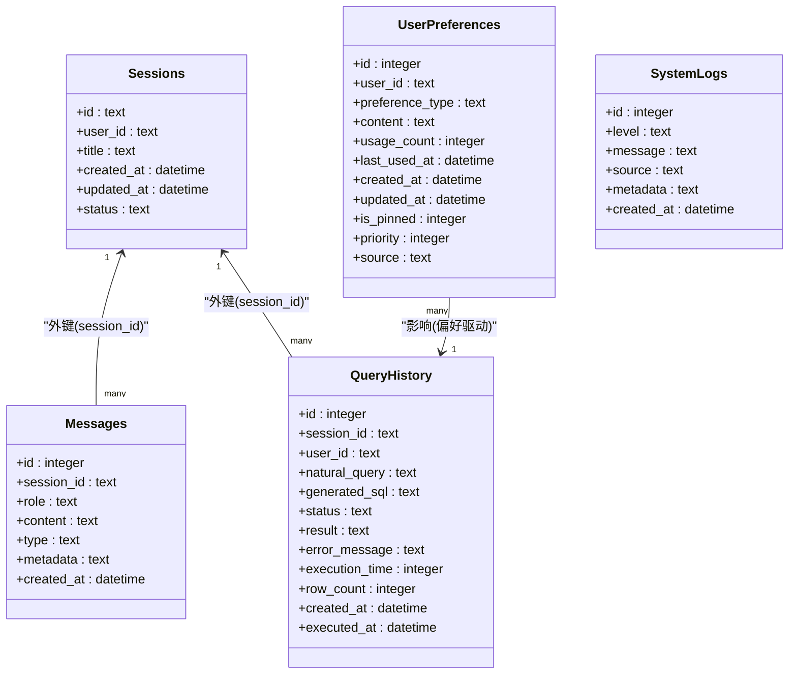

# 数据模型关系

<cite>
**本文引用的文件**
- [backend/src/app.js](file://backend/src/app.js)
- [backend/src/core/database.js](file://backend/src/core/database.js)
- [backend/src/memory/longTermMemory.js](file://backend/src/memory/longTermMemory.js)
- [backend/src/memory/memoryQueue.js](file://backend/src/memory/memoryQueue.js)
- [backend/config/business-semantic-layer.json](file://backend/config/business-semantic-layer.json)
- [backend/src/utils/logger.js](file://backend/src/utils/logger.js)
</cite>

## 目录
1. [简介](#简介)
2. [项目结构](#项目结构)
3. [核心组件](#核心组件)
4. [架构总览](#架构总览)
5. [详细组件分析](#详细组件分析)
6. [依赖分析](#依赖分析)
7. [性能考量](#性能考量)
8. [故障排查指南](#故障排查指南)
9. [结论](#结论)
10. [附录](#附录)

## 简介
本文件面向NL2SQL项目的后端数据模型，系统性梳理会话-消息-查询历史之间的关系设计，解释一对一、一对多、多对多关系的实现方式；阐述用户偏好与查询历史的关联机制及偏好对查询行为的影响；给出数据模型的ER图与关系图；总结数据访问模式最佳实践（避免N+1、优化关联查询）、数据生命周期管理（清理、归档、存储优化）与一致性保障（事务策略）。目标是帮助开发者快速理解整体数据架构并高效开展后续开发与优化。

## 项目结构
后端采用模块化组织，数据库初始化与表结构定义集中在核心模块，长期记忆与偏好抽取在记忆模块，业务语义层配置位于配置目录，日志模块贯穿各处用于可观测性与排障。

图表来源
- [backend/src/app.js:1-266](file://backend/src/app.js#L1-L266)
- [backend/src/core/database.js:1-1016](file://backend/src/core/database.js#L1-L1016)
- [backend/src/memory/longTermMemory.js:1-1143](file://backend/src/memory/longTermMemory.js#L1-L1143)
- [backend/src/memory/memoryQueue.js:1-217](file://backend/src/memory/memoryQueue.js#L1-L217)
- [backend/config/business-semantic-layer.json:1-189](file://backend/config/business-semantic-layer.json#L1-L189)
- [backend/src/utils/logger.js:1-482](file://backend/src/utils/logger.js#L1-L482)

章节来源
- [backend/src/app.js:1-266](file://backend/src/app.js#L1-L266)

## 核心组件
- 数据库建模与访问：负责会话、消息、查询历史、用户偏好、系统日志等表的创建、索引、CRUD与事务封装。
- 长期记忆与偏好抽取：从成功查询中提取用户偏好（查询模式、字段别名、指标/维度偏好），并异步持久化。
- 异步存储队列：批量、并发地处理偏好存储，避免阻塞主流程。
- 业务语义层配置：将业务概念映射到物理表/字段，辅助偏好抽取与查询生成。
- 日志模块：统一记录系统运行日志，支撑可观测性与排障。

章节来源
- [backend/src/core/database.js:1-1016](file://backend/src/core/database.js#L1-L1016)
- [backend/src/memory/longTermMemory.js:1-1143](file://backend/src/memory/longTermMemory.js#L1-L1143)
- [backend/src/memory/memoryQueue.js:1-217](file://backend/src/memory/memoryQueue.js#L1-L217)
- [backend/config/business-semantic-layer.json:1-189](file://backend/config/business-semantic-layer.json#L1-L189)
- [backend/src/utils/logger.js:1-482](file://backend/src/utils/logger.js#L1-L482)

## 架构总览
下图展示数据模型的ER关系与外键约束，体现会话-消息-查询历史的“一对多”关系，以及用户偏好与查询历史的“多对一”关联。

图表来源
- [backend/src/core/database.js:39-195](file://backend/src/core/database.js#L39-L195)

## 详细组件分析

### 会话-消息-查询历史的关系设计
- 一对一/一对多关系
  - 会话与消息：一对多（一个会话包含多条消息）
  - 会话与查询历史：一对多（一个会话可产生多条查询历史）
  - 用户偏好与查询历史：多对一（多条偏好影响单条查询历史）
- 外键约束与级联行为
  - 消息表对会话表使用外键约束，删除会话时通过级联删除同步清理消息
  - 查询历史对会话表使用外键约束，删除会话时将查询历史的会话ID置空，避免硬性删除造成数据丢失
- 索引策略
  - 会话：按用户ID、状态、更新时间建立索引，加速筛选与排序
  - 消息：按会话ID、创建时间建立索引，加速按会话查询与时间排序
  - 查询历史：按用户ID、会话ID、创建时间、状态建立索引，提升查询效率
- 事务与一致性
  - 删除会话时使用事务包裹，先删消息再删会话，保证原子性
  - 偏好使用JSON字段存储，结合JSON函数进行查询与去重

图表来源
- [backend/src/core/database.js:589-608](file://backend/src/core/database.js#L589-L608)

章节来源
- [backend/src/core/database.js:39-195](file://backend/src/core/database.js#L39-L195)
- [backend/src/core/database.js:589-608](file://backend/src/core/database.js#L589-L608)

### 用户偏好与查询历史的关联机制
- 偏好类型与内容
  - 查询模式：记录维度/指标组合、时间范围、过滤模式等，用于模板化查询
  - 字段别名：记录用户术语到Schema字段的映射，支持不同表达方式
  - 指标/维度偏好：记录用户常用指标与维度，提升推荐与补全质量
- 偏好抽取与存储
  - 成功查询后，系统根据阈值与规则判断是否存储偏好
  - 使用异步队列批量处理，避免阻塞主流程
  - 通过JSON字段存储复杂内容，利用JSON函数进行查询与去重
- 偏好对查询行为的影响
  - 查询模式用于生成SQL模板，减少重复工作
  - 字段别名映射提升实体解析准确度，降低歧义
  - 指标/维度偏好用于默认维度/指标补全与排序

图表来源
- [backend/src/memory/longTermMemory.js:299-461](file://backend/src/memory/longTermMemory.js#L299-L461)
- [backend/src/memory/memoryQueue.js:46-118](file://backend/src/memory/memoryQueue.js#L46-L118)

章节来源
- [backend/src/memory/longTermMemory.js:1-1143](file://backend/src/memory/longTermMemory.js#L1-L1143)
- [backend/src/memory/memoryQueue.js:1-217](file://backend/src/memory/memoryQueue.js#L1-L217)
- [backend/src/core/database.js:677-826](file://backend/src/core/database.js#L677-L826)

### 业务语义层与偏好抽取的协同
- 业务语义层配置将业务概念映射到物理表/字段，辅助识别维度、指标与过滤条件
- 偏好抽取阶段可结合语义层，识别“字段别名”、“维度习惯”、“过滤逻辑”等高价值偏好
- 通过LLM增强的分析流程，区分通用知识与个人偏好，仅存储后者

章节来源
- [backend/config/business-semantic-layer.json:1-189](file://backend/config/business-semantic-layer.json#L1-L189)
- [backend/src/memory/longTermMemory.js:58-190](file://backend/src/memory/longTermMemory.js#L58-L190)

## 依赖分析
- 组件耦合
  - 长期记忆模块依赖数据库模块进行偏好存储与查询
  - 异步存储队列依赖数据库模块执行批量操作
  - 业务语义层配置为偏好抽取提供上下文信息
- 外部依赖
  - SQLite用于本地持久化，启用外键约束保证参照完整性
  - 日志模块贯穿各层，提供统一可观测性

图表来源
- [backend/src/app.js:1-266](file://backend/src/app.js#L1-L266)
- [backend/src/core/database.js:1-1016](file://backend/src/core/database.js#L1-L1016)
- [backend/src/memory/longTermMemory.js:1-1143](file://backend/src/memory/longTermMemory.js#L1-L1143)
- [backend/src/memory/memoryQueue.js:1-217](file://backend/src/memory/memoryQueue.js#L1-L217)
- [backend/config/business-semantic-layer.json:1-189](file://backend/config/business-semantic-layer.json#L1-L189)
- [backend/src/utils/logger.js:1-482](file://backend/src/utils/logger.js#L1-L482)

章节来源
- [backend/src/app.js:1-266](file://backend/src/app.js#L1-L266)

## 性能考量
- 避免N+1查询
  - 批量读取：按会话批量获取消息与偏好，减少多次往返
  - 合理分页：查询历史与消息均支持limit，避免一次性拉取过多
- 关联查询优化
  - 为高频查询字段建立索引（用户ID、会话ID、创建时间、状态）
  - 使用复合索引加速按用户+类型的偏好查询
- 异步处理
  - 偏好存储通过队列批量执行，降低高峰时段对主流程的影响
- 存储空间优化
  - JSON字段存储偏好内容，便于扩展但需关注索引成本
  - 启动时执行重复偏好清理，减少冗余存储

章节来源
- [backend/src/core/database.js:552-560](file://backend/src/core/database.js#L552-L560)
- [backend/src/core/database.js:649-664](file://backend/src/core/database.js#L649-L664)
- [backend/src/memory/memoryQueue.js:46-118](file://backend/src/memory/memoryQueue.js#L46-L118)

## 故障排查指南
- 初始化与迁移
  - 若出现表结构异常，检查迁移流程与索引重建逻辑
  - 启动时执行重复偏好清理，若失败不影响服务启动
- 事务与回滚
  - 删除会话失败时，确认事务是否正确回滚
- 日志定位
  - 使用统一日志模块记录关键路径与错误堆栈，便于追踪
- 偏好存储异常
  - 检查队列状态与批量处理结果，必要时等待队列完成或清空队列进行测试

章节来源
- [backend/src/core/database.js:277-404](file://backend/src/core/database.js#L277-L404)
- [backend/src/core/database.js:589-608](file://backend/src/core/database.js#L589-L608)
- [backend/src/utils/logger.js:276-322](file://backend/src/utils/logger.js#L276-L322)
- [backend/src/memory/memoryQueue.js:160-202](file://backend/src/memory/memoryQueue.js#L160-L202)

## 结论
NL2SQL的数据模型围绕“会话-消息-查询历史”构建，通过外键约束与索引保障数据完整性与查询效率；用户偏好作为“软知识”以JSON形式存储，借助长期记忆模块与异步队列实现高质量、低延迟的知识沉淀；业务语义层进一步提升了偏好抽取的准确性。整体设计兼顾一致性、可扩展性与性能，适合在中小规模场景下稳定演进。

## 附录

### 数据模型与关系图（补充）

图表来源
- [backend/src/core/database.js:39-195](file://backend/src/core/database.js#L39-L195)