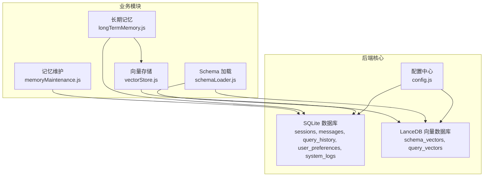
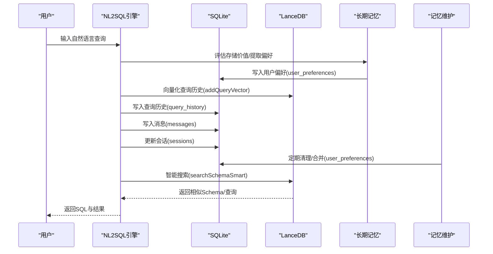
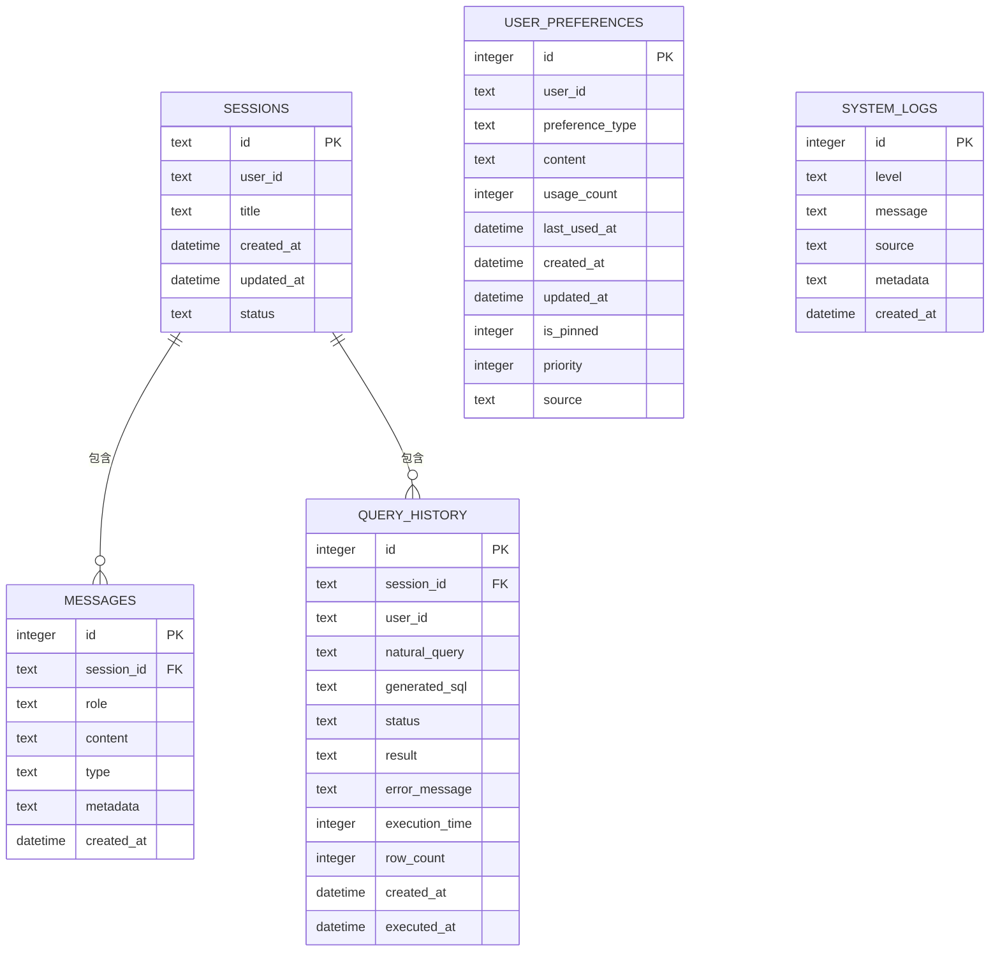
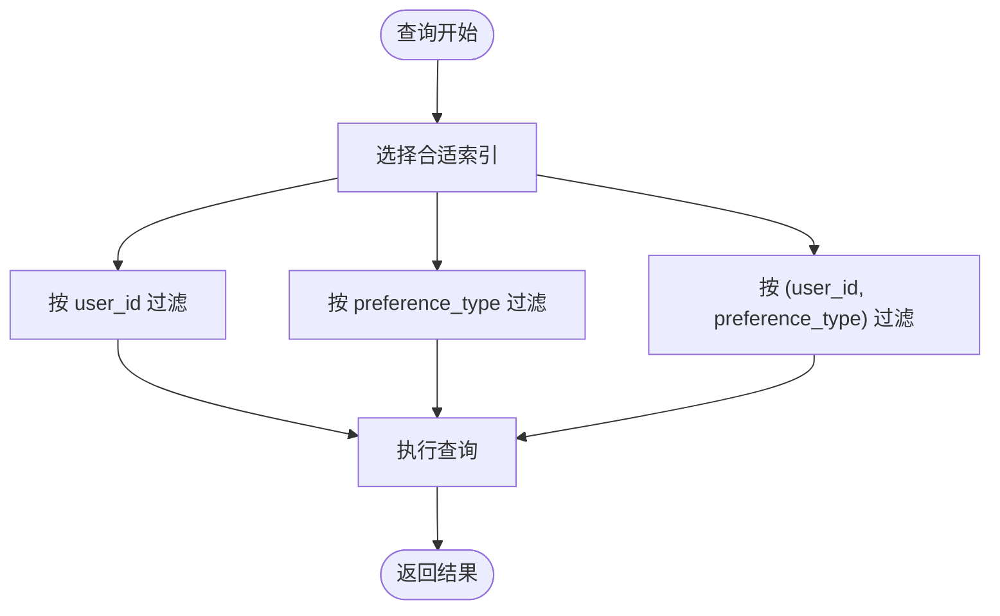
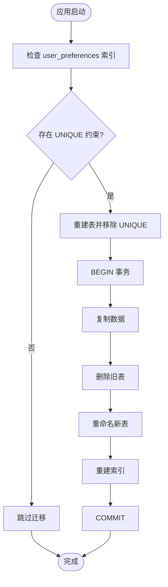
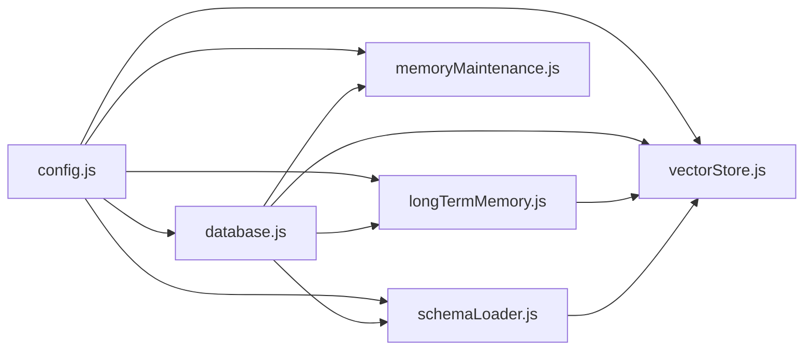

# 数据库设计

<cite>
**本文引用的文件**
- [database.js](file://backend/src/core/database.js)
- [longTermMemory.js](file://backend/src/memory/longTermMemory.js)
- [memoryMaintenance.js](file://backend/src/memory/memoryMaintenance.js)
- [vectorStore.js](file://backend/src/memory/vectorStore.js)
- [schemaLoader.js](file://backend/src/core/schemaLoader.js)
- [config.js](file://backend/src/core/config.js)
- [schema-metadata.json](file://backend/config/schema-metadata.json)
- [schema-metadata.example.json](file://backend/config/schema-metadata.example.json)
- [NL2SQL-进度追踪.md](file://docs/NL2SQL-进度追踪.md)
- [记忆系统优化计划.md](file://docs/记忆系统优化计划.md)
</cite>

## 目录
1. [简介](#简介)
2. [项目结构](#项目结构)
3. [核心组件](#核心组件)
4. [架构总览](#架构总览)
5. [详细组件分析](#详细组件分析)
6. [依赖分析](#依赖分析)
7. [性能考虑](#性能考虑)
8. [故障排查指南](#故障排查指南)
9. [结论](#结论)
10. [附录](#附录)

## 简介
本文件面向NL2SQL项目的数据库设计，聚焦SQLite数据库的表结构设计与关系模型，解释会话表、消息表、查询历史表和用户偏好表的设计原理与约束；阐述索引优化策略与查询性能考量；给出数据验证规则、约束条件与完整性保障；提供数据库迁移指南与版本管理策略；说明数据生命周期管理与备份恢复机制；并为数据库管理员与开发者提供实用的设计指导。

## 项目结构
NL2SQL采用“SQLite + LanceDB”的混合存储架构：
- SQLite用于持久化会话历史、消息、查询历史、用户偏好、系统日志等结构化数据；
- LanceDB用于向量化存储Schema与查询历史，支撑语义检索与相似查询推荐。

**图表来源**
- [database.js:39-195](file://backend/src/core/database.js#L39-L195)
- [vectorStore.js:233-324](file://backend/src/memory/vectorStore.js#L233-L324)
- [schemaLoader.js:69-122](file://backend/src/core/schemaLoader.js#L69-L122)
- [longTermMemory.js:313-471](file://backend/src/memory/longTermMemory.js#L313-L471)
- [memoryMaintenance.js:69-192](file://backend/src/memory/memoryMaintenance.js#L69-L192)

**章节来源**
- [database.js:39-195](file://backend/src/core/database.js#L39-L195)
- [vectorStore.js:233-324](file://backend/src/memory/vectorStore.js#L233-L324)
- [schemaLoader.js:69-122](file://backend/src/core/schemaLoader.js#L69-L122)

## 核心组件
- SQLite数据库管理模块：负责数据库初始化、表结构创建、索引建立、迁移、事务与CRUD封装。
- 长期记忆模块：负责用户偏好抽取、存储与维护，支持查询模式、字段别名、指标/维度偏好等。
- 记忆维护模块：负责长期记忆的分级保留策略、定期清理、相似模式合并与统计报告。
- 向量存储模块：负责Schema与查询历史的向量化、语义检索、智能搜索与增量更新。
- Schema加载模块：负责从JSON配置加载Schema元数据、构建映射、向量化与语义搜索。

**章节来源**
- [database.js:206-345](file://backend/src/core/database.js#L206-L345)
- [longTermMemory.js:313-471](file://backend/src/memory/longTermMemory.js#L313-L471)
- [memoryMaintenance.js:69-192](file://backend/src/memory/memoryMaintenance.js#L69-L192)
- [vectorStore.js:233-324](file://backend/src/memory/vectorStore.js#L233-L324)
- [schemaLoader.js:69-122](file://backend/src/core/schemaLoader.js#L69-L122)

## 架构总览
SQLite与LanceDB协同工作，形成“结构化+语义”的双轨存储体系：
- 结构化：SQLite承载会话、消息、查询历史、用户偏好、系统日志等；
- 语义：LanceDB承载Schema与查询历史向量，支持智能搜索与相似查询推荐。

**图表来源**
- [longTermMemory.js:313-471](file://backend/src/memory/longTermMemory.js#L313-L471)
- [memoryMaintenance.js:69-192](file://backend/src/memory/memoryMaintenance.js#L69-L192)
- [vectorStore.js:544-620](file://backend/src/memory/vectorStore.js#L544-L620)
- [database.js:467-549](file://backend/src/core/database.js#L467-L549)

## 详细组件分析

### SQLite表结构与关系模型
- 会话表(sessions)：存储用户会话的基本信息，支持按用户、状态、更新时间索引。
- 消息表(messages)：存储会话中的消息历史，支持按会话、创建时间索引，并通过外键关联会话表。
- 查询历史表(query_history)：存储用户的数据查询记录，支持按用户、会话、创建时间、状态索引，并通过外键关联会话表。
- 用户偏好表(user_preferences)：存储用户的查询偏好与常用模式，支持按用户、类型、复合索引；具备使用次数、最近使用时间、置顶与优先级等字段。
- 系统日志表(system_logs)：存储系统运行日志，支持按级别、创建时间索引。

**图表来源**
- [database.js:39-195](file://backend/src/core/database.js#L39-L195)

**章节来源**
- [database.js:39-195](file://backend/src/core/database.js#L39-L195)

### 索引优化策略与查询性能
- 会话表(sessions)：user_id、status、updated_at索引，加速按用户查询、状态筛选与时间排序。
- 消息表(messages)：session_id、created_at索引，加速按会话查询与时间排序。
- 查询历史表(query_history)：user_id、session_id、created_at、status索引，加速按用户/会话/时间/状态查询。
- 用户偏好表(user_preferences)：user_id、preference_type、复合(user_id, preference_type)索引，加速按用户与类型的查询。
- 系统日志表(system_logs)：level、created_at索引，加速按级别与时间查询。

**图表来源**
- [database.js:59-170](file://backend/src/core/database.js#L59-L170)

**章节来源**
- [database.js:59-170](file://backend/src/core/database.js#L59-L170)

### 数据验证规则、约束条件与完整性
- 外键约束：消息表(session_id)、查询历史表(session_id)均引用会话表(id)，并设置ON DELETE CASCADE或SET NULL，确保会话删除时消息与查询历史的级联处理。
- 外键启用：初始化时启用PRAGMA foreign_keys = ON，确保引用完整性。
- 唯一性：用户偏好表已移除旧的UNIQUE约束，允许同一用户拥有多个偏好记录，通过索引与业务逻辑保证一致性。
- JSON字段：消息元数据、用户偏好内容、查询历史结果均以JSON字符串存储，便于扩展与检索。
- 时间戳：各表均包含created_at、updated_at等时间字段，支持审计与生命周期管理。

**章节来源**
- [database.js:234-241](file://backend/src/core/database.js#L234-L241)
- [database.js:86](file://backend/src/core/database.js#L86)
- [database.js:124](file://backend/src/core/database.js#L124)
- [database.js:281-345](file://backend/src/core/database.js#L281-L345)

### 数据库迁移指南与版本管理
- 迁移逻辑：启动时自动检测user_preferences表结构，若发现旧的UNIQUE索引，执行重建表流程，移除UNIQUE约束并重建索引，确保兼容性。
- 迁移事务：使用BEGIN/COMMIT/ROLLBACK包裹重建过程，保证原子性与一致性。
- 版本字段：用户偏好表包含version字段（来自配置），可用于后续版本演进与兼容性判断。

**图表来源**
- [database.js:277-345](file://backend/src/core/database.js#L277-L345)

**章节来源**
- [database.js:277-345](file://backend/src/core/database.js#L277-L345)

### 数据生命周期管理与备份恢复
- 生命周期策略：长期记忆采用分级保留策略，高频(≥10次)永久保留，中频(3-9次)90天未用清理，低频(<3次)30天未用清理，字段别名365天未用清理；置顶记忆不受清理影响。
- 备份建议：SQLite数据库文件可直接备份；LanceDB目录可整体备份；建议定期校验备份完整性。
- 恢复流程：停止服务 -> 恢复数据库文件/LanceDB目录 -> 启动服务 -> 校验数据一致性。

**章节来源**
- [memoryMaintenance.js:24-46](file://backend/src/memory/memoryMaintenance.js#L24-L46)
- [memoryMaintenance.js:134-192](file://backend/src/memory/memoryMaintenance.js#L134-L192)

### 用户偏好表设计与维护
- 偏好类型：查询模式、字段别名、指标偏好、维度偏好。
- 使用统计：usage_count、last_used_at、updated_at用于排序与清理。
- 置顶与优先级：is_pinned、priority、source用于保护关键业务规则与人工干预。
- 维护操作：定期清理、相似模式合并、统计报告。

**章节来源**
- [database.js:140-170](file://backend/src/core/database.js#L140-L170)
- [memoryMaintenance.js:69-192](file://backend/src/memory/memoryMaintenance.js#L69-L192)

## 依赖分析
- database.js依赖config.js提供的数据库路径与索引策略；依赖logger记录初始化与迁移日志。
- longTermMemory.js依赖database.js进行偏好读写，依赖vectorStore.js进行查询历史向量化，依赖config.js的阈值与开关。
- memoryMaintenance.js依赖database.js进行偏好清理与统计。
- vectorStore.js依赖config.js的向量维度与路径，依赖schemaLoader.js的表级表征。
- schemaLoader.js依赖config.js的Schema配置路径与缓存策略，依赖vectorStore.js进行向量化。

**图表来源**
- [config.js:97-130](file://backend/src/core/config.js#L97-L130)
- [database.js:16-19](file://backend/src/core/database.js#L16-L19)
- [longTermMemory.js:17-22](file://backend/src/memory/longTermMemory.js#L17-L22)
- [memoryMaintenance.js:16-18](file://backend/src/memory/memoryMaintenance.js#L16-L18)
- [vectorStore.js:16-23](file://backend/src/memory/vectorStore.js#L16-L23)
- [schemaLoader.js:19-26](file://backend/src/core/schemaLoader.js#L19-L26)

**章节来源**
- [config.js:97-130](file://backend/src/core/config.js#L97-L130)
- [database.js:16-19](file://backend/src/core/database.js#L16-L19)

## 性能考虑
- 索引覆盖：针对高频查询字段建立索引，减少全表扫描。
- 外键启用：启用外键约束确保引用完整性，避免脏数据。
- 事务封装：使用事务包裹批量操作，提升一致性与性能。
- 迁移事务：重建表时使用事务，避免部分失败导致的不一致。
- 向量检索：LanceDB提供高效的向量相似度搜索，结合智能重排序提升召回质量。

[本节为通用性能讨论，无需具体文件引用]

## 故障排查指南
- 初始化失败：检查数据库路径与权限，确认config.js中DB_PATH配置正确。
- 外键约束失败：确认初始化时PRAGMA foreign_keys已启用。
- 迁移异常：查看迁移日志，确认事务回滚是否成功；必要时手动重建表。
- 查询缓慢：检查是否命中索引，必要时添加复合索引或调整查询条件。
- 向量库未初始化：确认LanceDB路径与嵌入维度配置正确，检查向量表创建与数据写入。

**章节来源**
- [database.js:206-267](file://backend/src/core/database.js#L206-L267)
- [database.js:277-345](file://backend/src/core/database.js#L277-L345)
- [vectorStore.js:233-263](file://backend/src/memory/vectorStore.js#L233-L263)

## 结论
NL2SQL的数据库设计以SQLite为核心，结合LanceDB实现结构化与语义检索的协同。通过合理的表结构、索引策略与外键约束，确保数据完整性与查询性能；通过长期记忆与维护策略，实现用户偏好的智能管理与生命周期治理；通过迁移机制与事务封装，保障系统演进的稳定性与一致性。该设计为数据库管理员与开发者提供了清晰的运维与扩展路径。

[本节为总结性内容，无需具体文件引用]

## 附录

### 表字段与约束速览
- 会话表(sessions)：主键id，外键user_id，状态status，时间戳updated_at。
- 消息表(messages)：主键id，外键session_id，角色role，类型type，时间戳created_at。
- 查询历史表(query_history)：主键id，外键session_id，状态status，时间戳created_at/executed_at。
- 用户偏好表(user_preferences)：主键id，类型preference_type，使用统计usage_count/last_used_at，置顶is_pinned与优先级priority。
- 系统日志表(system_logs)：主键id，级别level，时间戳created_at。

**章节来源**
- [database.js:39-195](file://backend/src/core/database.js#L39-L195)

### 配置要点
- SQLite路径：DB_PATH
- LanceDB路径：VECTOR_DB_PATH
- 向量维度：embedding.dimension
- 安全白名单：security.allowedTables
- 查询限制：security.maxQueryRows/security.queryTimeout

**章节来源**
- [config.js:97-130](file://backend/src/core/config.js#L97-L130)
- [config.js:140-170](file://backend/src/core/config.js#L140-L170)

### Schema元数据
- 示例Schema：schema-metadata.example.json
- 实际Schema：schema-metadata.json（包含大量表与字段定义）

**章节来源**
- [schema-metadata.example.json:1-328](file://backend/config/schema-metadata.example.json#L1-L328)
- [schema-metadata.json:1-800](file://backend/config/schema-metadata.json#L1-L800)