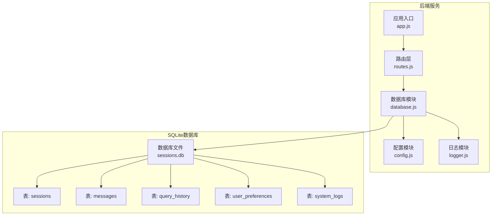
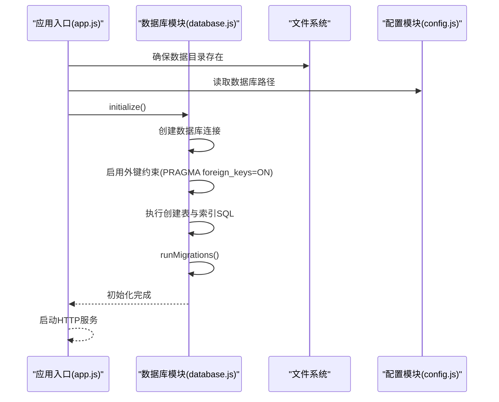
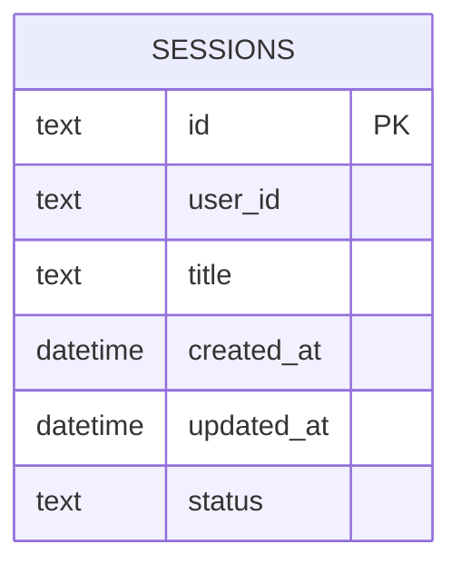
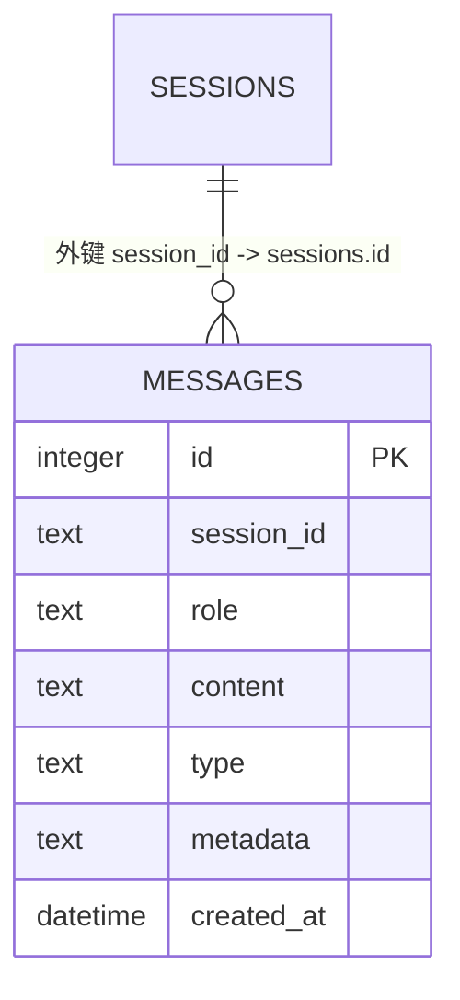
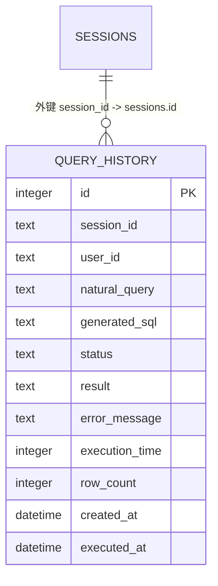
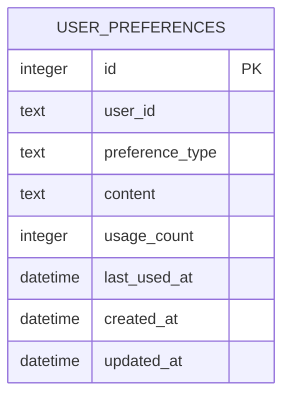
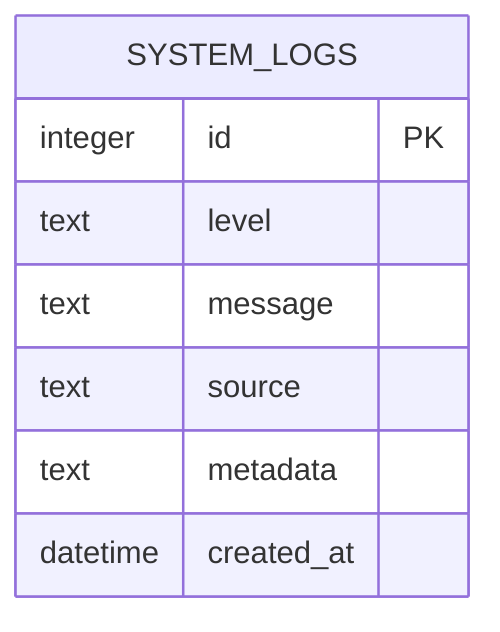
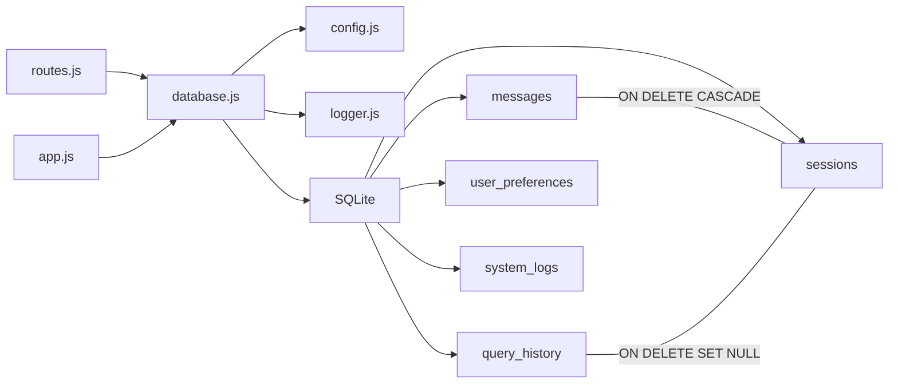
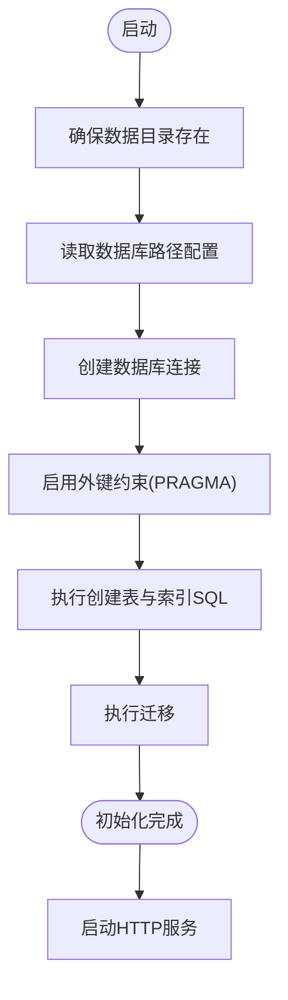

# SQLite数据库设计

<cite>
**本文引用的文件**
- [database.js](file://backend/src/core/database.js)
- [config.js](file://backend/src/core/config.js)
- [routes.js](file://backend/src/core/routes.js)
- [app.js](file://backend/src/app.js)
- [logger.js](file://backend/src/utils/logger.js)
- [schema-metadata.json](file://backend/config/schema-metadata.json)
</cite>

## 目录
1. [简介](#简介)
2. [项目结构](#项目结构)
3. [核心组件](#核心组件)
4. [架构总览](#架构总览)
5. [详细组件分析](#详细组件分析)
6. [依赖分析](#依赖分析)
7. [性能考虑](#性能考虑)
8. [故障排查指南](#故障排查指南)
9. [结论](#结论)
10. [附录](#附录)

## 简介
本文件面向NL2SQL项目中的SQLite数据库设计，系统性梳理会话表(sessions)、消息表(messages)、查询历史表(query_history)、用户偏好表(user_preferences)和系统日志表(system_logs)的结构设计、索引策略、外键关系、初始化流程、迁移策略、事务处理与错误处理机制，并结合项目实际使用场景给出性能优化与最佳实践建议。文档同时说明SQLite作为轻量级嵌入式数据库的优势与局限，以及在NL2SQL中的具体应用。

## 项目结构
NL2SQL后端采用Express服务，通过统一的数据库模块对SQLite进行封装，提供表结构初始化、迁移、事务、查询与写入能力，并由路由层暴露REST API供前端调用。数据库文件位于配置的路径，应用启动时自动创建数据目录并初始化数据库。

图表来源
- [app.js:97-166](file://backend/src/app.js#L97-L166)
- [routes.js:24-25](file://backend/src/core/routes.js#L24-L25)
- [database.js:12-19](file://backend/src/core/database.js#L12-L19)
- [config.js:97-100](file://backend/src/core/config.js#L97-L100)

章节来源
- [app.js:97-166](file://backend/src/app.js#L97-L166)
- [config.js:97-100](file://backend/src/core/config.js#L97-L100)

## 核心组件
- 数据库模块(database.js)：负责SQLite连接、表结构初始化、索引创建、迁移、事务、查询与写入、关闭连接等。
- 配置模块(config.js)：集中管理数据库路径、日志级别、安全策略等。
- 路由层(routes.js)：对外提供会话、消息、查询历史、用户偏好、统计等API，内部调用数据库模块。
- 应用入口(app.js)：启动流程中依次确保数据目录存在、初始化SQLite、加载Schema、启动自修复调度器、启动HTTP服务。
- 日志模块(logger.js)：统一记录数据库初始化、迁移、查询、写入、错误等日志。

章节来源
- [database.js:12-19](file://backend/src/core/database.js#L12-L19)
- [config.js:97-100](file://backend/src/core/config.js#L97-L100)
- [routes.js:24-25](file://backend/src/core/routes.js#L24-L25)
- [app.js:97-166](file://backend/src/app.js#L97-L166)
- [logger.js:51-318](file://backend/src/utils/logger.js#L51-L318)

## 架构总览
数据库初始化与使用的关键流程如下：
- 应用启动时创建数据目录，读取配置中的数据库路径。
- 初始化数据库连接，启用外键约束。
- 执行创建表与索引的SQL脚本。
- 执行迁移逻辑（如重建user_preferences表以移除旧的UNIQUE约束）。
- 路由层在处理请求时调用数据库模块进行CRUD操作。
- 事务用于保证会话删除时的原子性（先删消息，再删会话）。

图表来源
- [app.js:107-120](file://backend/src/app.js#L107-L120)
- [database.js:200-261](file://backend/src/core/database.js#L200-L261)
- [database.js:271-336](file://backend/src/core/database.js#L271-L336)

## 详细组件分析

### 会话表(sessions)
- 字段定义与约束
  - id: 文本主键，UUID。
  - user_id: 文本非空，用于按用户筛选。
  - title: 文本可选，会话标题。
  - created_at: 时间戳默认当前时间。
  - updated_at: 时间戳默认当前时间。
  - status: 文本默认“active”，枚举值包括active/archived/deleted。
- 索引策略
  - idx_sessions_user_id：加速按用户查询。
  - idx_sessions_status：加速按状态筛选。
  - idx_sessions_updated_at：加速按时间排序。
- 外键关系
  - 无外键，独立表。
- 典型操作
  - 创建会话、获取会话、获取用户会话列表、更新会话时间、更新会话标题、删除会话（事务：先删消息，再删会话）。

图表来源
- [database.js:44-57](file://backend/src/core/database.js#L44-L57)

章节来源
- [database.js:44-57](file://backend/src/core/database.js#L44-L57)
- [database.js:59-64](file://backend/src/core/database.js#L59-L64)
- [database.js:458-540](file://backend/src/core/database.js#L458-L540)

### 消息表(messages)
- 字段定义与约束
  - id: 整型自增主键。
  - session_id: 文本非空，外键关联sessions.id。
  - role: 文本非空，角色枚举：user/assistant/system/tool。
  - content: 文本非空，消息内容。
  - type: 文本默认“text”，类型枚举：text/sql/result/error/clarify。
  - metadata: 文本，JSON字符串存储附加元数据。
  - created_at: 时间戳默认当前时间。
- 索引策略
  - idx_messages_session_id：加速按会话查询。
  - idx_messages_created_at：加速按时间排序。
- 外键关系
  - FOREIGN KEY(session_id) REFERENCES sessions(id) ON DELETE CASCADE。
- 典型操作
  - 添加消息、获取会话消息历史（解析metadata JSON）。

图表来源
- [database.js:70-87](file://backend/src/core/database.js#L70-L87)

章节来源
- [database.js:70-87](file://backend/src/core/database.js#L70-L87)
- [database.js:89-92](file://backend/src/core/database.js#L89-L92)
- [database.js:555-596](file://backend/src/core/database.js#L555-L596)

### 查询历史表(query_history)
- 字段定义与约束
  - id: 整型自增主键。
  - session_id: 文本，可空，外键关联sessions.id。
  - user_id: 文本非空，用于按用户筛选。
  - natural_query: 文本非空，用户自然语言查询。
  - generated_sql: 文本，生成的SQL语句。
  - status: 文本默认“pending”，枚举：pending/success/failed。
  - result: 文本，JSON格式查询结果。
  - error_message: 文本，失败时的错误信息。
  - execution_time: 整型，执行耗时（毫秒）。
  - row_count: 整型，返回行数。
  - created_at: 时间戳默认当前时间。
  - executed_at: 时间戳，执行时间。
- 索引策略
  - idx_query_history_user_id：加速按用户查询。
  - idx_query_history_session_id：加速按会话查询。
  - idx_query_history_created_at：加速按时间排序。
  - idx_query_history_status：加速按状态筛选。
- 外键关系
  - FOREIGN KEY(session_id) REFERENCES sessions(id) ON DELETE SET NULL。
- 典型操作
  - 路由层提供查询历史接口，支持按用户/会话筛选与排序。

图表来源
- [database.js:98-125](file://backend/src/core/database.js#L98-L125)

章节来源
- [database.js:98-125](file://backend/src/core/database.js#L98-L125)
- [database.js:127-134](file://backend/src/core/database.js#L127-L134)
- [routes.js:411-448](file://backend/src/core/routes.js#L411-L448)

### 用户偏好表(user_preferences)
- 字段定义与约束
  - id: 整型自增主键。
  - user_id: 文本非空，允许一个用户有多条偏好。
  - preference_type: 文本非空，偏好类型枚举：field_alias/query_pattern/metric_preference/dimension_preference。
  - content: 文本非空，JSON格式偏好内容。
  - usage_count: 整型默认1，用于排序推荐。
  - last_used_at: 时间戳，最后使用时间。
  - created_at: 时间戳默认当前时间。
  - updated_at: 时间戳默认当前时间。
- 索引策略
  - idx_user_preferences_user_id：加速按用户查询。
  - idx_user_preferences_type：加速按类型筛选。
  - idx_user_prefs_user_type：复合索引(user_id, preference_type)。
- 外键关系
  - 无外键。
- 迁移策略
  - 检测旧的UNIQUE约束（通过PRAGMA index_list识别以sqlite_autoindex开头且unique=1的索引），如存在则重建表以移除UNIQUE约束，然后重建索引。
- 典型操作
  - 添加偏好、获取偏好列表（支持按类型与使用次数排序）、更新使用统计、获取常用查询模板、获取字段别名映射、查找已存在偏好、删除偏好、近期相似查询次数统计。

图表来源
- [database.js:140-157](file://backend/src/core/database.js#L140-L157)

章节来源
- [database.js:140-157](file://backend/src/core/database.js#L140-L157)
- [database.js:159-164](file://backend/src/core/database.js#L159-L164)
- [database.js:271-336](file://backend/src/core/database.js#L271-L336)
- [database.js:609-781](file://backend/src/core/database.js#L609-L781)

### 系统日志表(system_logs)
- 字段定义与约束
  - id: 整型自增主键。
  - level: 文本非空，日志级别：debug/info/warn/error。
  - message: 文本非空，日志消息。
  - source: 文本，日志来源模块。
  - metadata: 文本，JSON格式附加数据。
  - created_at: 时间戳默认当前时间。
- 索引策略
  - idx_system_logs_level：加速按级别查询。
  - idx_system_logs_created_at：加速按时间查询。
- 外键关系
  - 无外键。
- 典型操作
  - 日志模块统一记录INFO/WARN/ERROR级别日志，数据库模块提供查询接口（路由层未直接暴露该表查询API，但底层具备查询能力）。

图表来源
- [database.js:170-183](file://backend/src/core/database.js#L170-L183)

章节来源
- [database.js:170-183](file://backend/src/core/database.js#L170-L183)
- [database.js:185-188](file://backend/src/core/database.js#L185-L188)
- [logger.js:256-293](file://backend/src/utils/logger.js#L256-L293)

## 依赖分析
- 模块耦合
  - routes.js依赖database.js进行数据访问。
  - app.js在启动阶段调用database.initialize()，确保数据库可用后再启动HTTP服务。
  - database.js依赖config.js读取数据库路径，依赖logger.js记录日志。
- 外键与级联
  - messages.session_id -> sessions.id：ON DELETE CASCADE，删除会话时自动清理消息。
  - query_history.session_id -> sessions.id：ON DELETE SET NULL，删除会话时将外键置空。
- 索引与查询热点
  - sessions：按user_id/status/updated_at查询频繁。
  - messages：按session_id/created_at查询频繁。
  - query_history：按user_id/session_id/created_at/status查询频繁。
  - user_preferences：按user_id/type及复合(user_id, type)查询频繁。
  - system_logs：按level/created_at查询频繁。

图表来源
- [routes.js:24-25](file://backend/src/core/routes.js#L24-L25)
- [app.js:118-120](file://backend/src/app.js#L118-L120)
- [database.js:86](file://backend/src/core/database.js#L86)
- [database.js:124](file://backend/src/core/database.js#L124)

章节来源
- [routes.js:24-25](file://backend/src/core/routes.js#L24-L25)
- [app.js:118-120](file://backend/src/app.js#L118-L120)
- [database.js:86](file://backend/src/core/database.js#L86)
- [database.js:124](file://backend/src/core/database.js#L124)

## 性能考虑
- 索引策略
  - 已针对高频查询建立索引，建议保持现状。
  - 若出现大量范围扫描，可考虑在查询历史表增加复合索引覆盖常用筛选组合。
- 外键与事务
  - 启用外键约束(PRAGMA foreign_keys=ON)确保参照完整性。
  - 删除会话使用事务保证原子性，避免数据不一致。
- 查询优化
  - 使用参数化查询防止SQL注入，避免全表扫描。
  - 对于JSON字段(content/metadata)，仅在需要时解析，减少不必要的字符串处理。
- I/O与并发
  - SQLite适合单机轻量场景，建议避免高并发写入峰值；可通过限流与批量写入缓解。
  - 合理设置日志级别，避免过多DEBUG/INFO写盘影响性能。
- 数据库文件管理
  - 定期备份sessions.db，确保数据安全。
  - 避免在高负载时进行大型查询或写入操作。

[本节为通用性能建议，不直接分析具体文件]

## 故障排查指南
- 初始化失败
  - 现象：数据库连接失败或创建表失败。
  - 排查：检查数据库路径权限、磁盘空间、文件锁；查看日志模块输出的错误堆栈。
  - 参考
    - [database.js:217-244](file://backend/src/core/database.js#L217-L244)
    - [logger.js:283-293](file://backend/src/utils/logger.js#L283-L293)
- 外键约束问题
  - 现象：插入/删除时报外键约束错误。
  - 排查：确认sessions表存在且id值正确；检查messages与query_history的session_id是否匹配。
  - 参考
    - [database.js:86](file://backend/src/core/database.js#L86)
    - [database.js:124](file://backend/src/core/database.js#L124)
- 迁移失败
  - 现象：重建user_preferences表失败。
  - 排查：检查事务是否回滚、表结构是否被其他进程占用；查看迁移日志。
  - 参考
    - [database.js:271-336](file://backend/src/core/database.js#L271-L336)
- 查询异常
  - 现象：查询报错或返回空结果。
  - 排查：确认参数化查询绑定的参数顺序与数量；检查索引是否生效；核对筛选条件。
  - 参考
    - [database.js:361-424](file://backend/src/core/database.js#L361-L424)
- 事务回滚
  - 现象：删除会话失败或部分数据未清理。
  - 排查：确认事务是否被异常中断；查看回滚日志。
  - 参考
    - [database.js:431-445](file://backend/src/core/database.js#L431-L445)

章节来源
- [database.js:217-244](file://backend/src/core/database.js#L217-L244)
- [database.js:271-336](file://backend/src/core/database.js#L271-L336)
- [database.js:361-424](file://backend/src/core/database.js#L361-L424)
- [database.js:431-445](file://backend/src/core/database.js#L431-L445)
- [logger.js:283-293](file://backend/src/utils/logger.js#L283-L293)

## 结论
NL2SQL项目采用SQLite作为轻量级持久化存储，围绕会话、消息、查询历史、用户偏好与系统日志构建了清晰的表结构与索引策略。通过外键约束与事务保障数据一致性，配合迁移机制解决历史约束问题。整体设计满足NL2SQL的中小规模数据需求，具备良好的可维护性与扩展性。建议在生产环境中关注I/O瓶颈与并发写入，合理设置日志级别与备份策略，持续优化查询路径与索引覆盖。

[本节为总结性内容，不直接分析具体文件]

## 附录

### 数据库初始化流程（步骤化）
- 确保数据目录存在。
- 读取配置中的数据库路径。
- 创建数据库连接并启用外键约束。
- 执行创建表与索引的SQL脚本。
- 执行迁移（如需）。
- 启动HTTP服务。

图表来源
- [app.js:107-120](file://backend/src/app.js#L107-L120)
- [database.js:200-261](file://backend/src/core/database.js#L200-L261)
- [database.js:271-336](file://backend/src/core/database.js#L271-L336)

### 表结构创建SQL（概览）
- sessions：主键id，user_id非空，status默认active，索引user_id/status/updated_at。
- messages：主键id，外键session_id引用sessions(id)，索引session_id/created_at。
- query_history：主键id，外键session_id引用sessions(id)，索引user_id/session_id/created_at/status。
- user_preferences：主键id，索引user_id/type及复合(user_id, type)。
- system_logs：主键id，索引level/created_at。

章节来源
- [database.js:39-189](file://backend/src/core/database.js#L39-L189)

### 数据访问模式与事务处理
- 查询模式
  - query(sql, params[])：返回多行结果。
  - queryOne(sql, params[])：返回单行结果。
  - run(sql, params[])：执行非查询语句，返回lastID与changes。
- 事务处理
  - transaction(callback)：在事务中执行多个操作，异常时回滚。
- 会话删除
  - 事务：先删除messages，再删除sessions，保证参照完整性。

章节来源
- [database.js:361-445](file://backend/src/core/database.js#L361-L445)
- [database.js:521-540](file://backend/src/core/database.js#L521-L540)

### 错误处理方案
- 统一日志记录：所有SQL执行失败均记录错误日志，包含SQL与参数。
- 异常传播：Promise拒绝时向上抛出，由路由层捕获并返回500。
- 优雅关闭：服务终止时关闭数据库连接，避免资源泄漏。

章节来源
- [database.js:370-374](file://backend/src/core/database.js#L370-L374)
- [database.js:411-416](file://backend/src/core/database.js#L411-L416)
- [app.js:204](file://backend/src/app.js#L204)

### SQLite轻量级特性与局限
- 优势
  - 无需独立服务进程，部署简单。
  - 适合中小规模数据与单机场景。
  - 事务与外键支持完善。
- 局限
  - 并发写入受限，不适合高并发写入。
  - 大型复杂查询可能成为瓶颈。
  - 缺少高级复制与集群能力。
- 在NL2SQL中的适用性
  - 会话与消息、查询历史、用户偏好、系统日志体量适中，SQLite足以支撑日常使用。
  - 建议结合日志级别控制与定期备份，保障稳定性与可恢复性。

[本节为概念性说明，不直接分析具体文件]