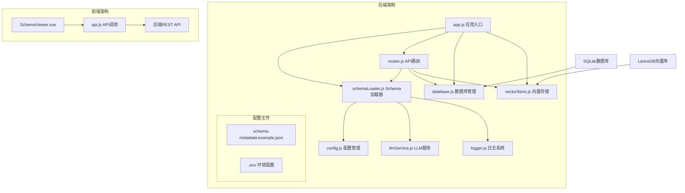
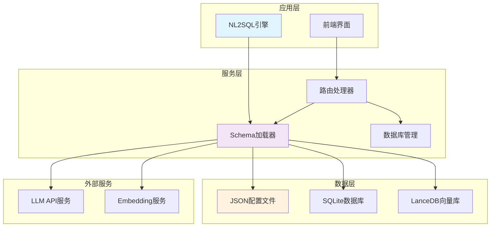
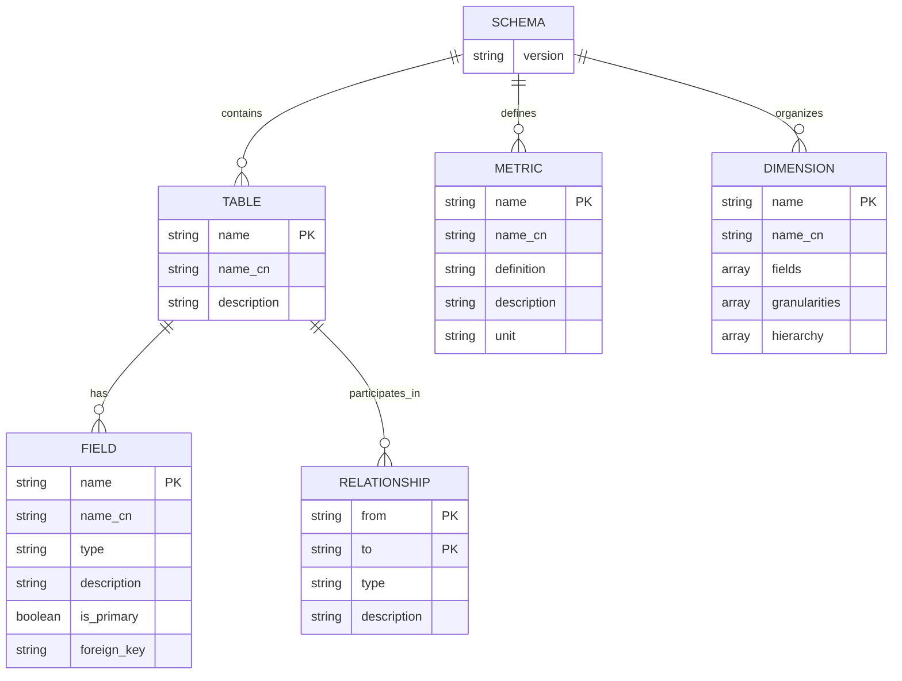
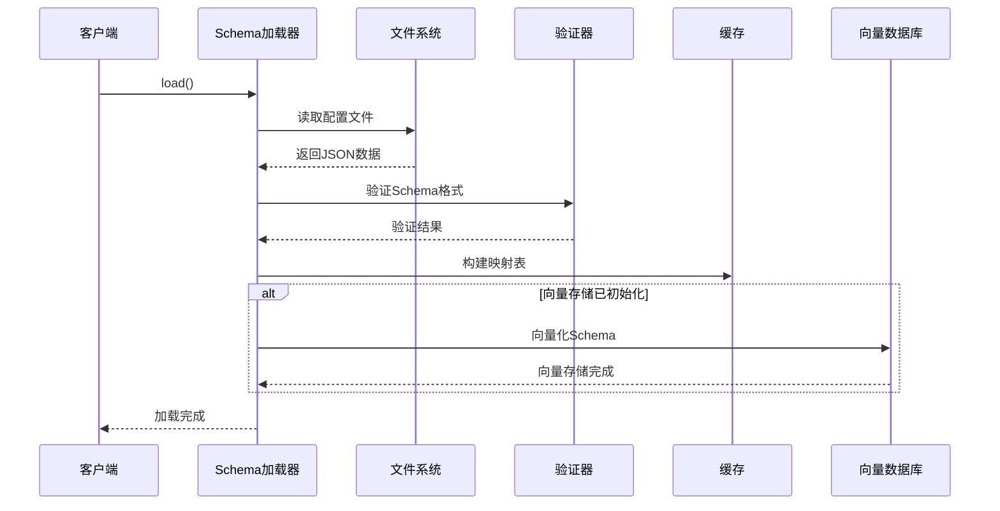
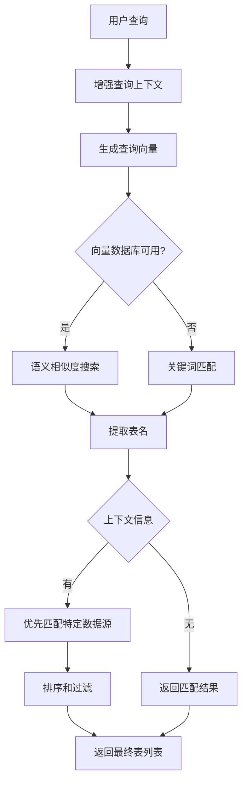
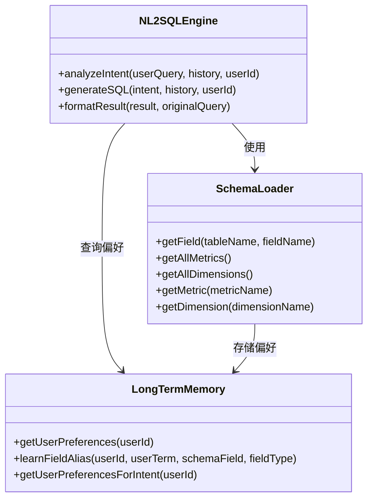
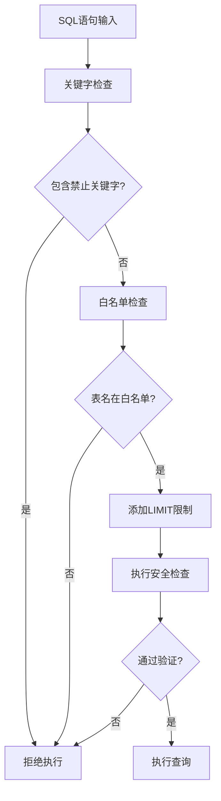
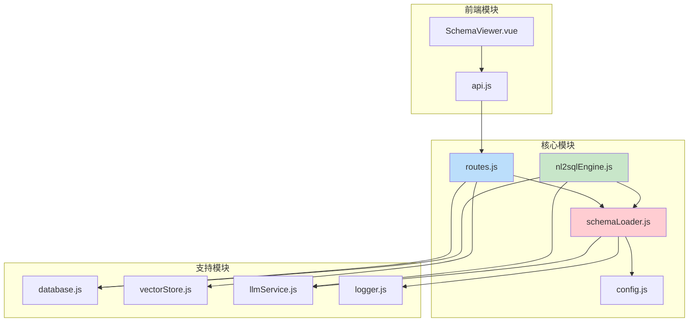

# Schema元数据管理

<cite>
**本文档引用的文件**
- [schemaLoader.js](file://backend/src/core/schemaLoader.js)
- [schema-metadata.example.json](file://backend/config/schema-metadata.example.json)
- [config.js](file://backend/src/core/config.js)
- [nl2sqlEngine.js](file://backend/src/core/nl2sqlEngine.js)
- [routes.js](file://backend/src/core/routes.js)
- [vectorStore.js](file://backend/src/memory/vectorStore.js)
- [database.js](file://backend/src/core/database.js)
- [logger.js](file://backend/src/utils/logger.js)
- [SchemaViewer.vue](file://frontend/src/components/SchemaViewer.vue)
- [app.js](file://backend/src/app.js)
</cite>

## 目录
1. [简介](#简介)
2. [项目结构](#项目结构)
3. [核心组件](#核心组件)
4. [架构概览](#架构概览)
5. [详细组件分析](#详细组件分析)
6. [依赖关系分析](#依赖关系分析)
7. [性能考虑](#性能考虑)
8. [故障排除指南](#故障排除指南)
9. [结论](#结论)

## 简介

Schema元数据管理系统是NL2SQL项目的核心基础设施，负责管理数据库表结构、字段定义、关系配置和约束信息。该系统通过JSON配置文件定义数据模式，提供动态加载、验证和查询功能，支持自然语言到SQL的转换引擎。

系统采用模块化设计，包含Schema加载器、配置管理、向量存储和安全验证等多个核心组件，为NL2SQL引擎提供完整的元数据支持。

## 项目结构

NL2SQL项目采用前后端分离架构，后端使用Node.js + Express框架，前端使用Vue.js技术栈。

**图表来源**
- [app.js:93-166](file://backend/src/app.js#L93-L166)
- [schemaLoader.js:1-732](file://backend/src/core/schemaLoader.js#L1-L732)

**章节来源**
- [app.js:1-238](file://backend/src/app.js#L1-L238)
- [package.json:1-28](file://backend/package.json#L1-L28)

## 核心组件

### Schema加载器 (SchemaLoader)

Schema加载器是系统的核心组件，负责：

- **元数据加载**：从JSON配置文件读取和解析表结构定义
- **数据验证**：确保Schema数据格式正确性和完整性
- **缓存管理**：提供内存缓存机制提高查询性能
- **向量化支持**：将Schema信息转换为向量用于语义检索
- **查询接口**：提供丰富的查询和匹配功能

### 配置管理系统

配置系统采用集中式管理模式，支持：

- **环境变量配置**：通过.env文件管理敏感配置
- **运行时配置**：动态调整系统行为和性能参数
- **安全配置**：白名单控制、SQL安全验证
- **缓存配置**：Schema缓存策略和过期时间

### 向量存储系统

基于LanceDB的向量存储系统：

- **Schema向量化**：将表和字段描述转换为向量
- **语义检索**：支持基于语义的Schema匹配
- **查询历史向量化**：存储用户查询的历史向量
- **分布式存储**：支持向量数据的持久化存储

**章节来源**
- [schemaLoader.js:32-122](file://backend/src/core/schemaLoader.js#L32-L122)
- [config.js:16-289](file://backend/src/core/config.js#L16-L289)
- [vectorStore.js:1-442](file://backend/src/memory/vectorStore.js#L1-L442)

## 架构概览

Schema元数据管理系统的整体架构采用分层设计：

**图表来源**
- [nl2sqlEngine.js:16-26](file://backend/src/core/nl2sqlEngine.js#L16-L26)
- [routes.js:16-28](file://backend/src/core/routes.js#L16-L28)
- [database.js:12-20](file://backend/src/core/database.js#L12-L20)

系统采用事件驱动架构，通过模块间的松耦合设计实现高度的可扩展性和可维护性。

## 详细组件分析

### Schema元数据配置格式

系统支持标准化的JSON配置格式，定义完整的数据库模式信息：

#### 基本配置结构

**图表来源**
- [schema-metadata.example.json:1-328](file://backend/config/schema-metadata.example.json#L1-L328)

#### 表定义结构

每个表包含以下关键字段：

| 字段名 | 类型 | 必需 | 描述 |
|--------|------|------|------|
| name | string | 是 | 表的英文名称 |
| name_cn | string | 否 | 表的中文名称 |
| description | string | 否 | 表的描述信息 |
| fields | array | 是 | 字段定义数组 |

#### 字段定义规范

字段定义支持多种属性：

| 属性名 | 类型 | 描述 |
|--------|------|------|
| name | string | 字段英文名 |
| name_cn | string | 字段中文名 |
| type | string | 数据库字段类型 |
| description | string | 字段描述 |
| is_primary | boolean | 是否为主键 |
| foreign_key | string | 外键引用 |
| aggregations | array | 支持的聚合函数 |
| time_granularity | array | 时间粒度支持 |

**章节来源**
- [schema-metadata.example.json:4-328](file://backend/config/schema-metadata.example.json#L4-L328)

### Schema加载和验证机制

Schema加载器实现了完整的生命周期管理：

**图表来源**
- [schemaLoader.js:69-122](file://backend/src/core/schemaLoader.js#L69-L122)
- [schemaLoader.js:131-155](file://backend/src/core/schemaLoader.js#L131-L155)

#### 验证流程

系统提供多层次的验证机制：

1. **格式验证**：检查必需字段的存在性和类型正确性
2. **结构验证**：确保表和字段定义的完整性
3. **关系验证**：检查外键引用的有效性
4. **一致性验证**：确保字段类型和约束的一致性

**章节来源**
- [schemaLoader.js:131-155](file://backend/src/core/schemaLoader.js#L131-L155)
- [schemaLoader.js:69-122](file://backend/src/core/schemaLoader.js#L69-L122)

### 动态Schema解析和匹配

系统支持智能的Schema解析和匹配功能：

#### 语义搜索算法

**图表来源**
- [schemaLoader.js:420-507](file://backend/src/core/schemaLoader.js#L420-L507)

#### 上下文感知匹配

系统支持基于上下文的智能匹配：

- **游戏ID推断**：根据游戏ID推断平台类型
- **数据源识别**：支持新平台和老平台的自动识别
- **动态优先级**：根据上下文调整匹配优先级

**章节来源**
- [schemaLoader.js:420-507](file://backend/src/core/schemaLoader.js#L420-L507)
- [schemaLoader.js:396-407](file://backend/src/core/schemaLoader.js#L396-L407)

### NL2SQL引擎集成

Schema元数据与NL2SQL引擎的深度集成：

#### 字段别名映射

**图表来源**
- [nl2sqlEngine.js:460-743](file://backend/src/core/nl2sqlEngine.js#L460-L743)
- [schemaLoader.js:319-351](file://backend/src/core/schemaLoader.js#L319-L351)

#### 查询优化策略

系统采用多层优化策略：

1. **Schema缓存**：内存中的快速查找映射
2. **向量检索**：语义相似度的快速匹配
3. **关键词过滤**：基于关键词的初步筛选
4. **上下文优先**：根据用户历史和上下文调整优先级

**章节来源**
- [nl2sqlEngine.js:1170-1203](file://backend/src/core/nl2sqlEngine.js#L1170-L1203)
- [schemaLoader.js:319-351](file://backend/src/core/schemaLoader.js#L319-L351)

### 安全过滤和验证

系统实施多层次的安全防护：

#### SQL安全验证

**图表来源**
- [schemaLoader.js:570-606](file://backend/src/core/schemaLoader.js#L570-L606)

#### 配置安全策略

系统提供灵活的安全配置：

- **白名单控制**：限制可访问的表集合
- **行数限制**：防止大数据量查询
- **超时控制**：防止长时间查询阻塞
- **敏感字段过滤**：自动脱敏敏感数据

**章节来源**
- [schemaLoader.js:570-606](file://backend/src/core/schemaLoader.js#L570-L606)
- [config.js:140-170](file://backend/src/core/config.js#L140-L170)

## 依赖关系分析

### 模块依赖图

**图表来源**
- [schemaLoader.js:15-27](file://backend/src/core/schemaLoader.js#L15-L27)
- [nl2sqlEngine.js:16-26](file://backend/src/core/nl2sqlEngine.js#L16-L26)
- [routes.js:16-28](file://backend/src/core/routes.js#L16-L28)

### 外部依赖

系统依赖的关键外部组件：

| 组件 | 版本 | 用途 |
|------|------|------|
| Node.js | >=18.0.0 | 运行时环境 |
| Express | ^4.18.2 | Web框架 |
| sqlite3 | ^5.1.6 | SQLite数据库 |
| vectordb | ^0.4.0 | 向量数据库 |
| dotenv | ^16.3.1 | 环境变量管理 |
| cors | ^2.8.5 | 跨域支持 |
| body-parser | ^1.20.2 | 请求解析 |

**章节来源**
- [package.json:10-27](file://backend/package.json#L10-L27)

## 性能考虑

### 缓存策略

系统采用多级缓存机制：

1. **Schema缓存**：内存中的表和字段映射
2. **向量缓存**：向量数据库中的预计算向量
3. **查询缓存**：近期查询的快速响应

### 性能优化

#### 查询优化

- **索引设计**：为常用查询字段建立索引
- **批量处理**：向量化时采用批量处理减少API调用
- **延迟加载**：按需加载和初始化组件

#### 内存管理

- **垃圾回收**：定期清理无用的缓存数据
- **内存监控**：实时监控内存使用情况
- **分页处理**：大数据量时采用分页策略

## 故障排除指南

### 常见配置错误

#### Schema文件格式错误

**症状**：加载Schema时抛出格式错误异常

**解决方案**：
1. 检查JSON语法是否正确
2. 验证必需字段是否存在
3. 确认字段类型定义是否符合规范

#### 向量数据库初始化失败

**症状**：向量搜索功能不可用

**解决方案**：
1. 检查LanceDB安装是否正确
2. 验证向量数据库目录权限
3. 确认Embedding模型配置正确

#### LLM API连接失败

**症状**：意图识别和SQL生成功能异常

**解决方案**：
1. 验证API密钥配置
2. 检查网络连接状态
3. 确认API端点URL正确性

### 调试技巧

#### 日志分析

系统提供详细的日志记录：

- **DEBUG级别**：开发调试信息
- **INFO级别**：常规操作日志  
- **WARN级别**：潜在问题警告
- **ERROR级别**：错误信息记录

#### 性能监控

- **查询响应时间**：监控SQL执行性能
- **内存使用情况**：跟踪内存泄漏风险
- **API调用统计**：分析LLM使用情况

**章节来源**
- [logger.js:32-41](file://backend/src/utils/logger.js#L32-L41)
- [logger.js:256-293](file://backend/src/utils/logger.js#L256-L293)

## 结论

Schema元数据管理系统为NL2SQL项目提供了强大的基础设施支持。通过标准化的配置格式、智能的解析机制和完善的验证体系，系统实现了：

1. **完整的Schema管理**：支持复杂的表结构和关系定义
2. **高效的查询性能**：多级缓存和向量检索优化
3. **安全可靠的执行**：多层次的安全验证和过滤
4. **灵活的扩展能力**：模块化设计支持功能扩展

系统的设计充分考虑了生产环境的需求，提供了完善的监控、日志和故障排除机制，为NL2SQL引擎的稳定运行奠定了坚实基础。

未来可以在以下方面进一步改进：
- 支持更多数据库类型的Schema定义
- 增强Schema版本管理和迁移功能
- 优化大规模Schema的性能表现
- 扩展字段类型的自定义支持