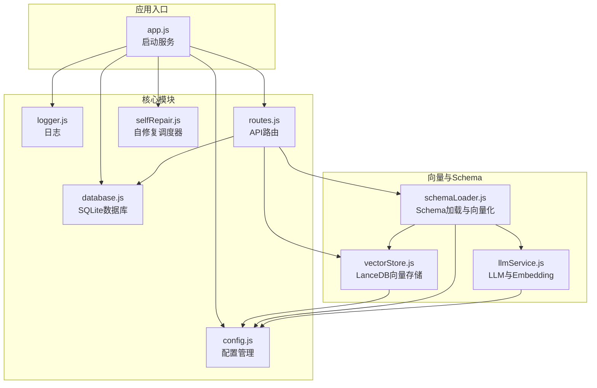
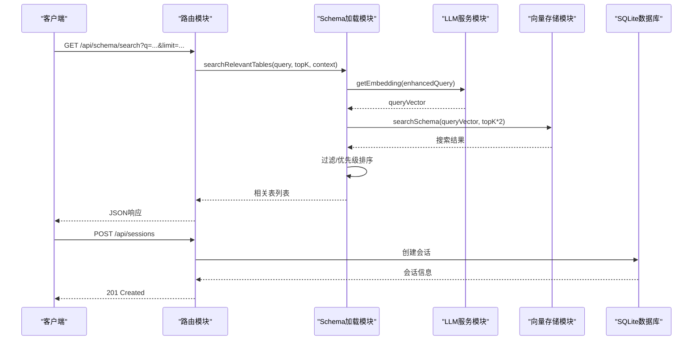
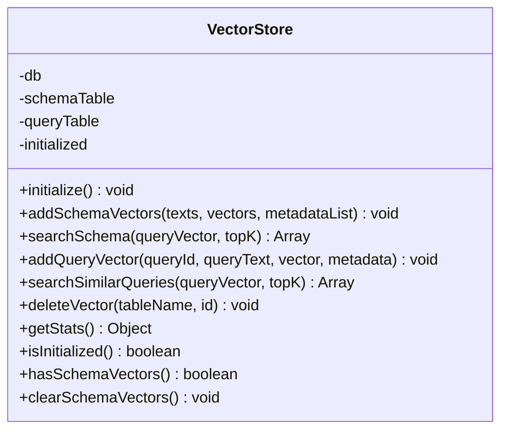
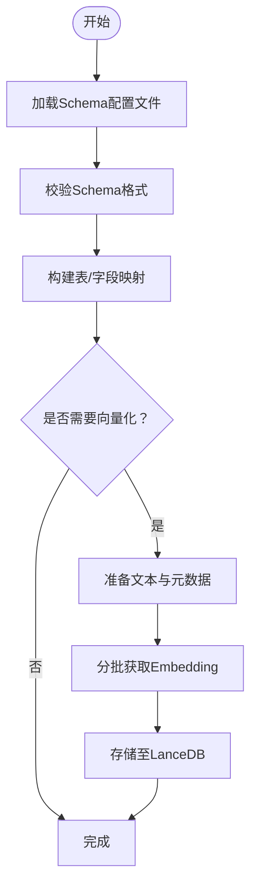
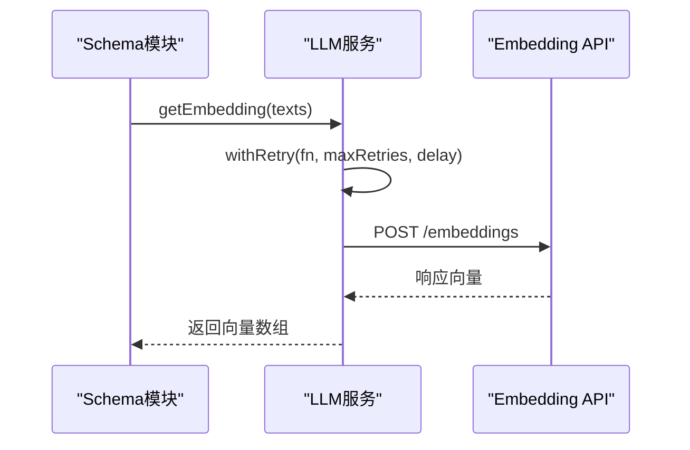
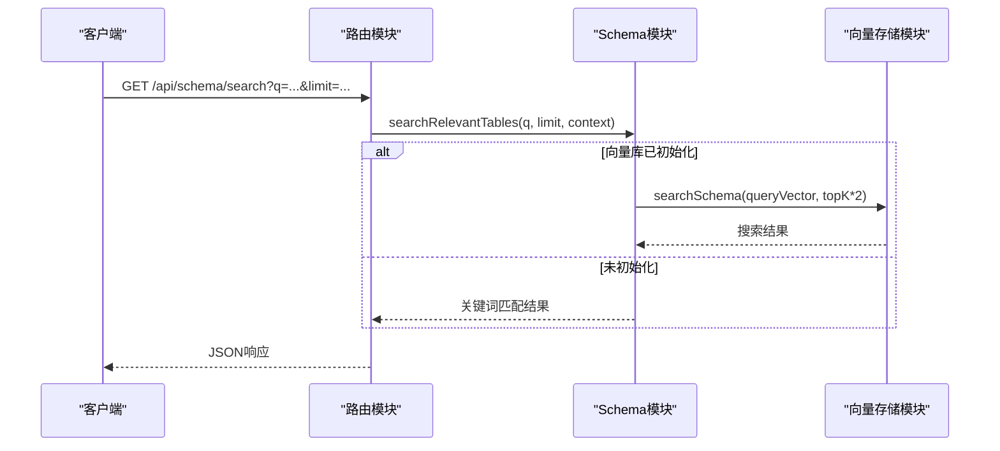
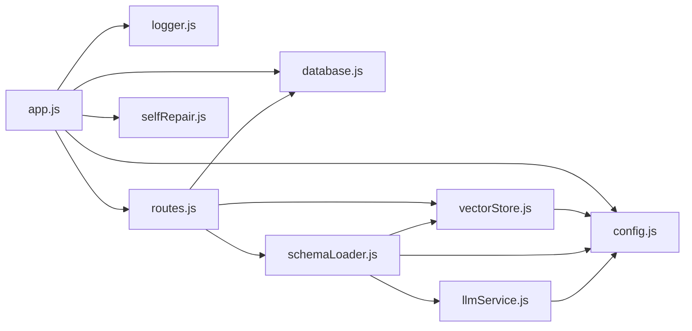

# 向量数据库设计

<cite>
**本文档引用的文件**
- [vectorStore.js](file://backend/src/memory/vectorStore.js)
- [schemaLoader.js](file://backend/src/core/schemaLoader.js)
- [config.js](file://backend/src/core/config.js)
- [llmService.js](file://backend/src/core/llmService.js)
- [routes.js](file://backend/src/core/routes.js)
- [app.js](file://backend/src/app.js)
- [logger.js](file://backend/src/utils/logger.js)
- [schema-metadata.json](file://backend/config/schema-metadata.json)
- [package.json](file://backend/package.json)
</cite>

## 目录
1. [简介](#简介)
2. [项目结构](#项目结构)
3. [核心组件](#核心组件)
4. [架构总览](#架构总览)
5. [详细组件分析](#详细组件分析)
6. [依赖关系分析](#依赖关系分析)
7. [性能考虑](#性能考虑)
8. [故障排除指南](#故障排除指南)
9. [结论](#结论)
10. [附录](#附录)

## 简介
本项目基于LanceDB实现向量数据库，结合Schema元数据与查询历史的向量化存储，提供语义检索能力，支撑自然语言到SQL的智能转换。系统通过Embedding模型生成向量，利用LanceDB的向量搜索能力实现Schema表与字段的语义匹配，并支持查询历史的相似检索，提升用户体验与查询效率。

## 项目结构
后端采用模块化设计，核心围绕向量存储、Schema加载、LLM服务与API路由展开：
- 向量存储模块：封装LanceDB连接、表初始化、向量增删改查与统计
- Schema加载模块：加载配置文件、构建映射、向量化Schema并提供语义搜索
- LLM服务模块：封装HTTP请求、重试机制、Embedding获取
- 配置模块：集中管理LLM、Embedding、数据库、安全等配置
- 路由模块：提供健康检查、Schema查询、会话管理、统计信息等API
- 应用入口：初始化数据库、向量库、Schema与自修复调度器，启动HTTP服务

图表来源
- [app.js:93-166](file://backend/src/app.js#L93-L166)
- [routes.js:1-800](file://backend/src/core/routes.js#L1-L800)
- [vectorStore.js:1-442](file://backend/src/memory/vectorStore.js#L1-L442)
- [schemaLoader.js:1-732](file://backend/src/core/schemaLoader.js#L1-L732)
- [llmService.js:1-432](file://backend/src/core/llmService.js#L1-L432)
- [config.js:16-332](file://backend/src/core/config.js#L16-L332)

章节来源
- [app.js:93-166](file://backend/src/app.js#L93-L166)
- [routes.js:1-800](file://backend/src/core/routes.js#L1-L800)
- [vectorStore.js:1-442](file://backend/src/memory/vectorStore.js#L1-L442)
- [schemaLoader.js:1-732](file://backend/src/core/schemaLoader.js#L1-L732)
- [llmService.js:1-432](file://backend/src/core/llmService.js#L1-L432)
- [config.js:16-332](file://backend/src/core/config.js#L16-L332)

## 核心组件
- 向量存储模块（LanceDB）
  - 连接与初始化：自动连接LanceDB目录，创建/打开schema_vectors与query_vectors表
  - Schema向量：批量添加表/字段描述向量，支持语义搜索
  - 查询向量：添加用户查询向量，支持相似查询检索
  - 统计与状态：统计表行数、检查初始化状态、清空Schema向量（通过覆盖实现）
- Schema加载模块
  - 加载与校验：从JSON配置文件加载Schema，校验格式并构建表/字段映射
  - 向量化：将表/字段描述文本分批生成Embedding并存储至向量库
  - 语义搜索：基于查询文本与上下文（gameId/datasource）增强，结合向量搜索与关键词匹配
  - 安全校验：SQL关键字过滤与白名单限制
- LLM服务模块
  - HTTP封装：统一的POST请求封装，支持超时、错误处理与重试
  - Embedding：调用Embedding API获取向量，支持批量请求
  - 重试机制：指数退避重试，降低外部API不稳定影响
- 配置模块
  - 集中管理LLM、Embedding、数据库、安全、Schema缓存等配置
  - 环境变量驱动，提供默认值与校验
- 路由模块
  - 健康检查、Schema查询、会话管理、查询历史、统计信息、配置信息等API
  - 语义搜索接口：/api/schema/search
- 应用入口
  - 初始化数据目录、SQLite、LanceDB、Schema与自修复调度器
  - 启动HTTP服务器，优雅关闭处理

章节来源
- [vectorStore.js:55-146](file://backend/src/memory/vectorStore.js#L55-L146)
- [schemaLoader.js:69-122](file://backend/src/core/schemaLoader.js#L69-L122)
- [schemaLoader.js:195-290](file://backend/src/core/schemaLoader.js#L195-L290)
- [schemaLoader.js:420-507](file://backend/src/core/schemaLoader.js#L420-L507)
- [llmService.js:41-152](file://backend/src/core/llmService.js#L41-L152)
- [llmService.js:324-379](file://backend/src/core/llmService.js#L324-L379)
- [config.js:16-332](file://backend/src/core/config.js#L16-L332)
- [routes.js:70-135](file://backend/src/core/routes.js#L70-L135)
- [routes.js:223-248](file://backend/src/core/routes.js#L223-L248)
- [app.js:97-166](file://backend/src/app.js#L97-L166)

## 架构总览
系统采用“配置驱动 + 向量检索 + 语义增强”的架构：
- 配置驱动：通过config.js集中管理LLM、Embedding、数据库与安全策略
- 向量检索：LanceDB存储Schema与查询向量，提供向量搜索能力
- 语义增强：基于上下文（gameId/datasource）增强查询，结合向量搜索与关键词匹配
- API层：提供健康检查、Schema查询、会话管理、统计信息等REST接口

图表来源
- [routes.js:223-248](file://backend/src/core/routes.js#L223-L248)
- [schemaLoader.js:420-507](file://backend/src/core/schemaLoader.js#L420-L507)
- [llmService.js:324-379](file://backend/src/core/llmService.js#L324-L379)
- [vectorStore.js:201-230](file://backend/src/memory/vectorStore.js#L201-L230)

## 详细组件分析

### 向量存储模块（LanceDB）
- 初始化流程
  - 连接LanceDB目录，打开或创建schema_vectors与query_vectors表
  - 使用配置中的Embedding维度生成占位向量，确保表结构一致
- Schema向量操作
  - 批量添加：将表/字段描述文本与元数据组合，生成向量后批量插入
  - 语义搜索：基于查询向量执行向量搜索，返回topK结果并解析元数据
- 查询历史向量操作
  - 添加：将用户查询文本与向量、元数据存储
  - 相似查询：基于查询向量检索历史相似查询
- 统计与状态
  - 统计表行数，排除初始化记录
  - 检查初始化状态与Schema向量存在性
  - 清空Schema向量（通过覆盖实现）

图表来源
- [vectorStore.js:55-442](file://backend/src/memory/vectorStore.js#L55-L442)

章节来源
- [vectorStore.js:55-146](file://backend/src/memory/vectorStore.js#L55-L146)
- [vectorStore.js:160-191](file://backend/src/memory/vectorStore.js#L160-L191)
- [vectorStore.js:201-230](file://backend/src/memory/vectorStore.js#L201-L230)
- [vectorStore.js:245-271](file://backend/src/memory/vectorStore.js#L245-L271)
- [vectorStore.js:281-307](file://backend/src/memory/vectorStore.js#L281-L307)
- [vectorStore.js:342-372](file://backend/src/memory/vectorStore.js#L342-L372)

### Schema加载与向量化
- 加载与校验
  - 从JSON配置文件加载Schema，校验格式并构建表/字段映射
  - 支持中文名映射，加速查询
- 向量化流程
  - 构造表/字段描述文本，分批调用LLM服务获取Embedding
  - 批大小控制（默认20），避免单次请求过大
  - 存储至LanceDB的schema_vectors表
- 语义搜索增强
  - 基于上下文（gameId/datasource）增强查询文本
  - 优先匹配对应数据源或平台类型的表
  - 回退到关键词匹配，保证可用性

图表来源
- [schemaLoader.js:69-122](file://backend/src/core/schemaLoader.js#L69-L122)
- [schemaLoader.js:195-290](file://backend/src/core/schemaLoader.js#L195-L290)

章节来源
- [schemaLoader.js:69-122](file://backend/src/core/schemaLoader.js#L69-L122)
- [schemaLoader.js:195-290](file://backend/src/core/schemaLoader.js#L195-L290)
- [schemaLoader.js:420-507](file://backend/src/core/schemaLoader.js#L420-L507)

### LLM服务与Embedding
- HTTP请求封装
  - 统一封装POST请求，支持超时、错误处理与响应解析
  - 支持流式响应（聊天），非流式响应（Embedding）
- 重试机制
  - 指数退避重试，降低外部API不稳定影响
- Embedding获取
  - 调用Embedding API，支持单个与批量请求
  - 指定向量维度，适配不同模型

图表来源
- [llmService.js:324-379](file://backend/src/core/llmService.js#L324-L379)
- [llmService.js:167-195](file://backend/src/core/llmService.js#L167-L195)

章节来源
- [llmService.js:41-152](file://backend/src/core/llmService.js#L41-L152)
- [llmService.js:167-195](file://backend/src/core/llmService.js#L167-L195)
- [llmService.js:324-379](file://backend/src/core/llmService.js#L324-L379)

### API与路由
- 健康检查
  - /api/health：基本健康状态
  - /api/health/detail：组件状态（数据库、LLM、Schema、SSE）
- Schema查询
  - /api/schema：获取完整Schema或按类型筛选
  - /api/schema/search：语义搜索相关表
- 会话与查询历史
  - /api/sessions：创建/获取/删除会话
  - /api/sessions/:sessionId/messages：获取消息历史
  - /api/queries/history：查询历史
- 统计与配置
  - /api/stats：服务统计
  - /api/config：公开配置信息

图表来源
- [routes.js:223-248](file://backend/src/core/routes.js#L223-L248)
- [schemaLoader.js:420-507](file://backend/src/core/schemaLoader.js#L420-L507)

章节来源
- [routes.js:70-135](file://backend/src/core/routes.js#L70-L135)
- [routes.js:148-248](file://backend/src/core/routes.js#L148-L248)
- [routes.js:254-396](file://backend/src/core/routes.js#L254-L396)
- [routes.js:411-448](file://backend/src/core/routes.js#L411-L448)
- [routes.js:724-771](file://backend/src/core/routes.js#L724-L771)
- [routes.js:782-800](file://backend/src/core/routes.js#L782-L800)

## 依赖关系分析
- 模块耦合
  - schemaLoader依赖llmService与vectorStore，形成“加载-向量化-存储”的链路
  - routes依赖schemaLoader与database，提供对外API
  - app.js统一初始化各模块，形成入口耦合
- 外部依赖
  - LanceDB：vectordb包，提供向量搜索能力
  - SQLite：sqlite3包，存储会话与查询历史
  - Express：提供HTTP服务与路由
- 配置依赖
  - config.js集中管理LLM、Embedding、数据库、安全等配置，降低硬编码风险

图表来源
- [app.js:97-166](file://backend/src/app.js#L97-L166)
- [routes.js:1-800](file://backend/src/core/routes.js#L1-L800)
- [vectorStore.js:1-442](file://backend/src/memory/vectorStore.js#L1-L442)
- [schemaLoader.js:1-732](file://backend/src/core/schemaLoader.js#L1-L732)
- [llmService.js:1-432](file://backend/src/core/llmService.js#L1-L432)
- [config.js:16-332](file://backend/src/core/config.js#L16-L332)

章节来源
- [package.json:10-20](file://backend/package.json#L10-L20)
- [app.js:97-166](file://backend/src/app.js#L97-L166)
- [routes.js:1-800](file://backend/src/core/routes.js#L1-L800)

## 性能考虑
- 向量维度与索引
  - Embedding维度由配置决定，影响向量存储与计算成本
  - LanceDB支持向量搜索，但当前实现未显式创建索引，可通过LanceDB官方索引策略进一步优化
- 批量处理
  - 向量化时采用批处理（默认20），平衡吞吐与稳定性
  - Embedding请求超时与重试机制，提升可靠性
- 缓存与延迟
  - Schema加载支持缓存与过期控制，减少重复加载
  - 日志级别与文件轮转，避免I/O瓶颈
- 查询优化
  - 语义搜索先扩大topK再过滤，提升召回质量
  - 上下文增强（gameId/datasource）优先匹配，减少无关表干扰

[本节为通用性能讨论，无需特定文件来源]

## 故障排除指南
- 向量数据库未初始化
  - 现象：添加/搜索向量时返回空结果或警告
  - 排查：确认LanceDB路径配置与权限，检查初始化日志
  - 处理：确保app.js正确初始化vectorStore
- Embedding API失败
  - 现象：向量化或查询向量获取失败
  - 排查：检查LLM API密钥、超时配置与网络连通性
  - 处理：调整超时与重试参数，确认API端点与模型支持
- Schema加载失败
  - 现象：Schema配置文件不存在或格式不正确
  - 排查：核对配置文件路径与JSON格式
  - 处理：修正配置文件或更新路径配置
- SQL安全拦截
  - 现象：查询被拒绝
  - 排查：检查禁止关键字与白名单配置
  - 处理：调整安全配置或使用允许的表/关键字

章节来源
- [vectorStore.js:80-84](file://backend/src/memory/vectorStore.js#L80-L84)
- [llmService.js:136-151](file://backend/src/core/llmService.js#L136-L151)
- [schemaLoader.js:77-80](file://backend/src/core/schemaLoader.js#L77-L80)
- [config.js:300-322](file://backend/src/core/config.js#L300-L322)

## 结论
本项目通过LanceDB实现了Schema与查询历史的向量化存储，结合LLM服务与语义增强策略，提供了高效的语义检索能力。模块化设计使配置、向量存储、Schema加载与API层清晰分离，具备良好的可维护性与扩展性。建议后续引入LanceDB索引优化、监控与容量规划策略，以进一步提升性能与稳定性。

[本节为总结性内容，无需特定文件来源]

## 附录

### 数据模型与存储结构
- 表结构
  - schema_vectors：存储表/字段描述的向量表示
  - query_vectors：存储用户查询历史的向量表示
- 字段说明
  - id：记录唯一标识
  - text：文本内容
  - vector：向量数组（维度由配置决定）
  - metadata：元数据（JSON字符串）
  - created_at：创建时间

章节来源
- [vectorStore.js:91-146](file://backend/src/memory/vectorStore.js#L91-L146)
- [vectorStore.js:160-191](file://backend/src/memory/vectorStore.js#L160-L191)
- [vectorStore.js:245-271](file://backend/src/memory/vectorStore.js#L245-L271)

### 查询向量与Schema向量的组织方式
- 查询向量
  - 由用户查询文本经Embedding生成，存储于query_vectors表
  - 支持相似查询检索，提升历史查询复用
- Schema向量
  - 由表/字段描述文本经Embedding生成，存储于schema_vectors表
  - 支持语义搜索，结合上下文增强与关键词回退

章节来源
- [schemaLoader.js:195-290](file://backend/src/core/schemaLoader.js#L195-L290)
- [schemaLoader.js:420-507](file://backend/src/core/schemaLoader.js#L420-L507)
- [vectorStore.js:201-230](file://backend/src/memory/vectorStore.js#L201-L230)
- [vectorStore.js:281-307](file://backend/src/memory/vectorStore.js#L281-L307)

### 索引策略与查询优化
- 索引策略
  - 当前实现未显式创建索引，建议参考LanceDB官方索引策略以优化大规模向量搜索性能
- 查询优化
  - 扩大topK再过滤，提升召回
  - 上下文增强优先匹配，减少无关表干扰
  - 批量Embedding请求，平衡吞吐与稳定性

章节来源
- [schemaLoader.js:449-499](file://backend/src/core/schemaLoader.js#L449-L499)
- [llmService.js:267-277](file://backend/src/core/llmService.js#L267-L277)

### 向量嵌入生成、相似度计算与语义搜索
- 嵌入生成
  - 通过LLM服务调用Embedding API，支持单个与批量请求
- 相似度计算
  - 基于向量距离（越小越相似），由LanceDB向量搜索返回
- 语义搜索
  - 结合上下文增强与关键词回退，提升准确性与鲁棒性

章节来源
- [llmService.js:324-379](file://backend/src/core/llmService.js#L324-L379)
- [vectorStore.js:201-230](file://backend/src/memory/vectorStore.js#L201-L230)
- [schemaLoader.js:420-507](file://backend/src/core/schemaLoader.js#L420-L507)

### 性能特性、扩展能力与存储优化
- 性能特性
  - 向量维度与批处理影响性能与内存占用
  - 重试与超时配置提升稳定性
- 扩展能力
  - 模块化设计便于扩展新功能与替换实现
- 存储优化
  - 建议引入LanceDB索引与压缩策略，优化存储与查询性能

章节来源
- [config.js:80-87](file://backend/src/core/config.js#L80-L87)
- [llmService.js:167-195](file://backend/src/core/llmService.js#L167-L195)

### 配置选项、参数调优与查询模式
- 关键配置
  - LLM API基础地址、密钥、模型与超时
  - Embedding模型与维度
  - LanceDB向量数据库路径
  - 安全策略（白名单、禁止关键字、最大查询行数、超时）
- 参数调优
  - Embedding超时与重试次数
  - 语义搜索topK与上下文增强策略
- 查询模式
  - 语义搜索与关键词匹配双通道

章节来源
- [config.js:60-170](file://backend/src/core/config.js#L60-L170)
- [schemaLoader.js:449-499](file://backend/src/core/schemaLoader.js#L449-L499)

### 导入导出、备份恢复与版本管理
- 导入导出
  - Schema元数据通过JSON文件导入，向量数据通过LanceDB表结构导入
- 备份恢复
  - 建议定期备份LanceDB目录与SQLite数据库文件
- 版本管理
  - Schema配置包含版本字段，便于追踪变更

章节来源
- [schema-metadata.json:1-40](file://backend/config/schema-metadata.json#L1-L40)
- [schemaLoader.js:88-107](file://backend/src/core/schemaLoader.js#L88-L107)

### 与传统关系型数据库的协同工作机制
- 协同机制
  - SQLite存储会话与查询历史，LanceDB存储向量
  - Schema元数据与业务数据库结构解耦，通过配置文件管理
- 数据同步策略
  - 建议通过Schema配置文件与定期重新向量化实现元数据同步

章节来源
- [app.js:118-135](file://backend/src/app.js#L118-L135)
- [schemaLoader.js:195-290](file://backend/src/core/schemaLoader.js#L195-L290)

### 故障排除、性能监控与容量规划
- 故障排除
  - 检查日志级别与文件轮转配置，定位问题
- 性能监控
  - 健康检查接口提供组件状态与内存使用情况
- 容量规划
  - 根据向量维度与数据规模评估存储与内存需求，制定备份与扩容计划

章节来源
- [routes.js:70-135](file://backend/src/core/routes.js#L70-L135)
- [logger.js:256-293](file://backend/src/utils/logger.js#L256-L293)