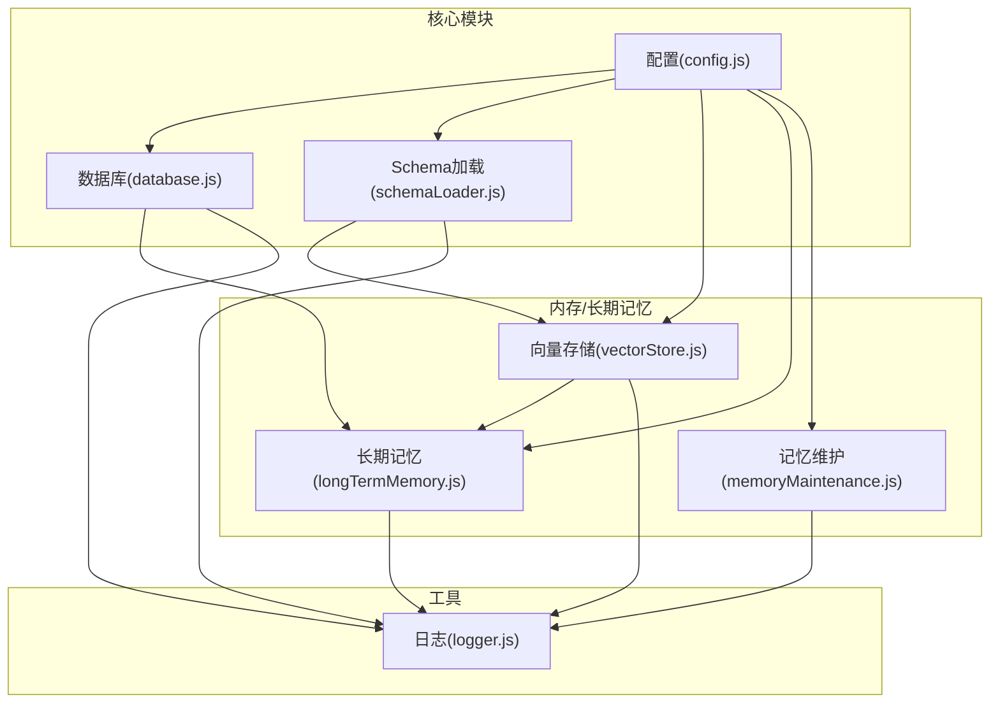
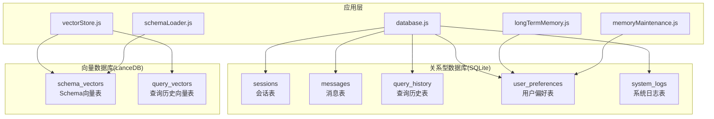
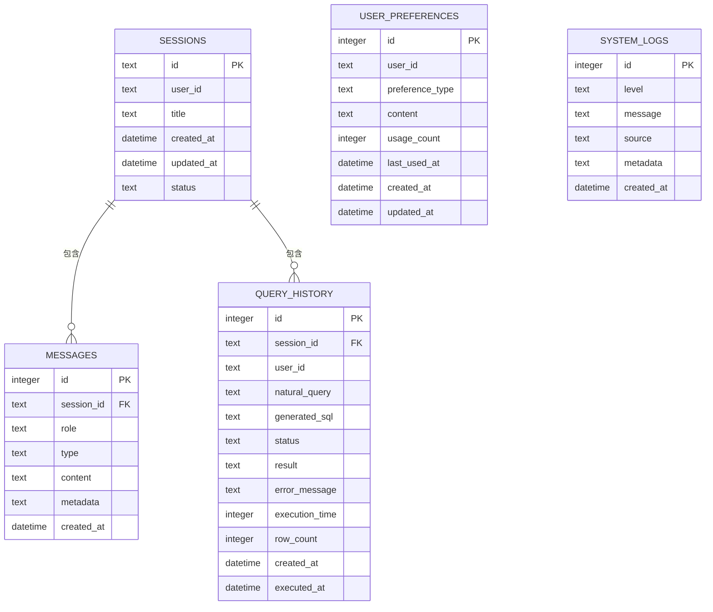
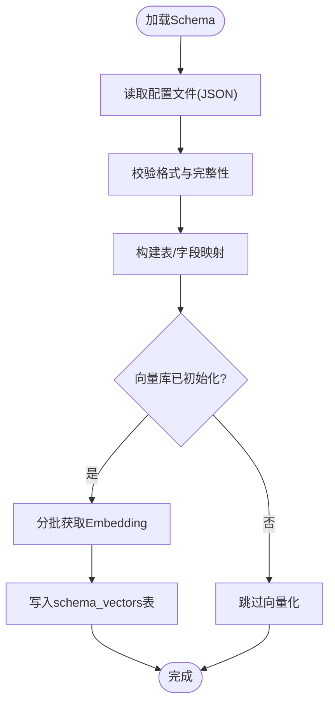
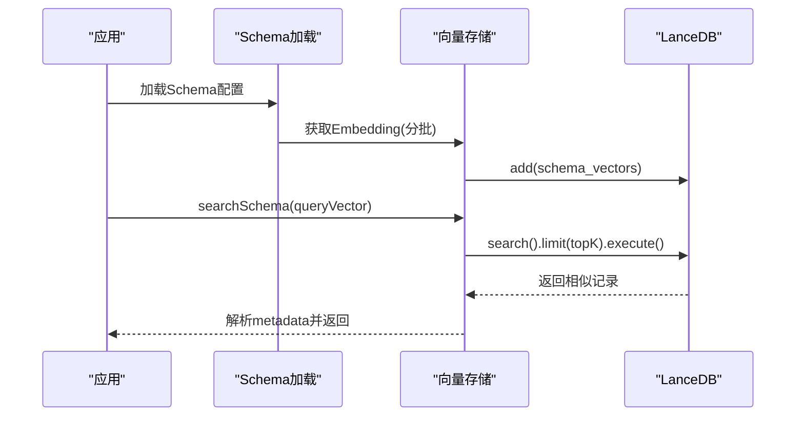
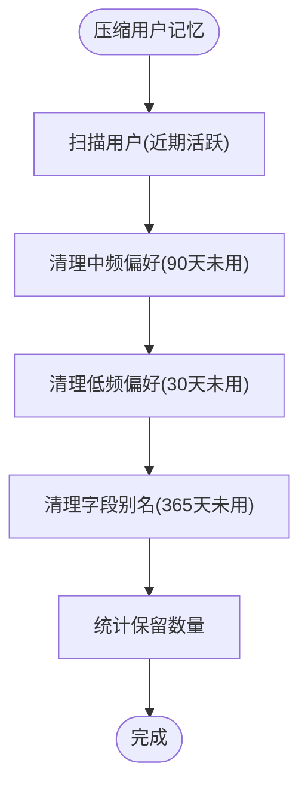
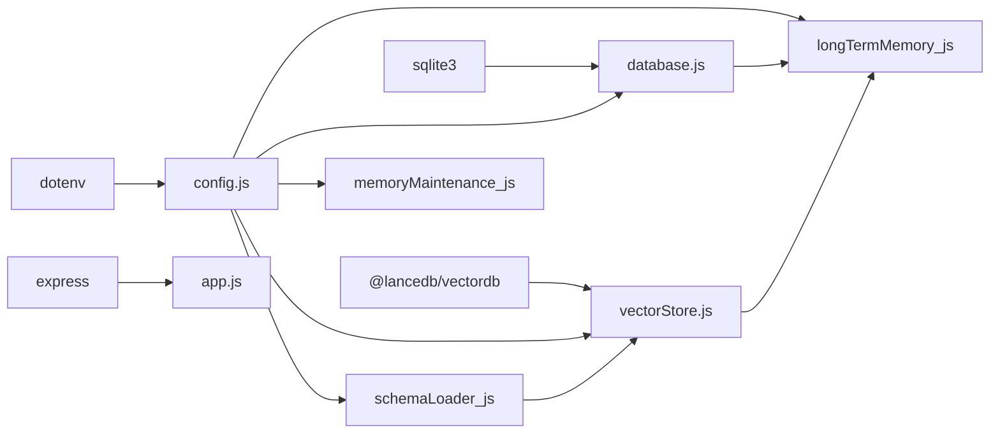

# 数据库设计

<cite>
**本文引用的文件**
- [database.js](file://backend/src/core/database.js)
- [vectorStore.js](file://backend/src/memory/vectorStore.js)
- [schemaLoader.js](file://backend/src/core/schemaLoader.js)
- [config.js](file://backend/src/core/config.js)
- [schema-metadata.json](file://backend/config/schema-metadata.json)
- [schema-metadata.example.json](file://backend/config/schema-metadata.example.json)
- [longTermMemory.js](file://backend/src/memory/longTermMemory.js)
- [memoryMaintenance.js](file://backend/src/memory/memoryMaintenance.js)
- [logger.js](file://backend/src/utils/logger.js)
- [package.json](file://backend/package.json)
</cite>

## 目录
1. [简介](#简介)
2. [项目结构](#项目结构)
3. [核心组件](#核心组件)
4. [架构总览](#架构总览)
5. [详细组件分析](#详细组件分析)
6. [依赖关系分析](#依赖关系分析)
7. [性能考量](#性能考量)
8. [故障排查指南](#故障排查指南)
9. [结论](#结论)
10. [附录](#附录)

## 简介
本文件面向NL2SQL项目的数据库设计，聚焦以下目标：
- SQLite数据库的表结构设计：会话表、消息表、查询历史表、用户偏好表、系统日志表
- Schema元数据的配置格式与管理方式
- 向量数据库（LanceDB）的集成方案：数据模型、索引策略、查询优化
- 数据访问模式、缓存策略与性能优化
- 数据迁移路径与版本管理策略
- 数据生命周期管理、保留策略与归档规则
- 数据安全、隐私保护与访问控制机制
- 数据库维护与监控最佳实践

## 项目结构
NL2SQL后端采用“核心模块 + 内存/长期记忆模块 + 工具模块”的分层组织：
- 核心模块：数据库管理、配置管理、Schema加载与校验、LLM服务、路由与引擎
- 内存/长期记忆模块：短期对话记忆、长期偏好记忆、向量存储与检索
- 工具模块：日志、工具函数等

图表来源
- [config.js:16-289](file://backend/src/core/config.js#L16-L289)
- [database.js:1-850](file://backend/src/core/database.js#L1-L850)
- [schemaLoader.js:1-732](file://backend/src/core/schemaLoader.js#L1-L732)
- [vectorStore.js:1-442](file://backend/src/memory/vectorStore.js#L1-L442)
- [longTermMemory.js:1-1134](file://backend/src/memory/longTermMemory.js#L1-L1134)
- [memoryMaintenance.js:1-415](file://backend/src/memory/memoryMaintenance.js#L1-L415)
- [logger.js:1-318](file://backend/src/utils/logger.js#L1-L318)

章节来源
- [config.js:16-289](file://backend/src/core/config.js#L16-L289)
- [database.js:1-850](file://backend/src/core/database.js#L1-L850)
- [schemaLoader.js:1-732](file://backend/src/core/schemaLoader.js#L1-L732)
- [vectorStore.js:1-442](file://backend/src/memory/vectorStore.js#L1-L442)
- [longTermMemory.js:1-1134](file://backend/src/memory/longTermMemory.js#L1-L1134)
- [memoryMaintenance.js:1-415](file://backend/src/memory/memoryMaintenance.js#L1-L415)
- [logger.js:1-318](file://backend/src/utils/logger.js#L1-L318)

## 核心组件
- SQLite数据库模块：负责数据库连接、表结构初始化、迁移、事务、CRUD操作
- 向量存储模块：基于LanceDB，负责Schema向量与查询历史向量的增删改查与统计
- Schema加载模块：负责Schema元数据的加载、校验、缓存、向量化与语义检索
- 长期记忆模块：负责用户偏好抽取、存储、使用统计与LLM智能分析
- 记忆维护模块：负责长期记忆的分级清理、相似模式合并与统计报告
- 日志模块：统一日志输出与轮转，支撑数据库与向量库的可观测性

章节来源
- [database.js:1-850](file://backend/src/core/database.js#L1-L850)
- [vectorStore.js:1-442](file://backend/src/memory/vectorStore.js#L1-L442)
- [schemaLoader.js:1-732](file://backend/src/core/schemaLoader.js#L1-L732)
- [longTermMemory.js:1-1134](file://backend/src/memory/longTermMemory.js#L1-L1134)
- [memoryMaintenance.js:1-415](file://backend/src/memory/memoryMaintenance.js#L1-L415)
- [logger.js:1-318](file://backend/src/utils/logger.js#L1-L318)

## 架构总览
NL2SQL的数据库层由两部分组成：
- 关系型数据库（SQLite）：存储会话、消息、查询历史、用户偏好、系统日志
- 向量数据库（LanceDB）：存储Schema向量与查询历史向量，支持语义检索

图表来源
- [database.js:39-189](file://backend/src/core/database.js#L39-L189)
- [vectorStore.js:91-146](file://backend/src/memory/vectorStore.js#L91-L146)
- [schemaLoader.js:195-290](file://backend/src/core/schemaLoader.js#L195-L290)
- [longTermMemory.js:614-756](file://backend/src/memory/longTermMemory.js#L614-L756)
- [memoryMaintenance.js:69-189](file://backend/src/memory/memoryMaintenance.js#L69-L189)

## 详细组件分析

### SQLite表结构设计
- 会话表（sessions）
  - 主键：id（UUID）
  - 字段：user_id、title、created_at、updated_at、status（active/archived/deleted）
  - 索引：user_id、status、updated_at
  - 用途：记录用户会话，支持按用户、状态、时间排序查询

- 消息表（messages）
  - 主键：id（自增）
  - 外键：session_id → sessions(id)（CASCADE删除）
  - 字段：role（user/assistant/system/tool）、type（text/sql/result/error/clarify）、content、metadata、created_at
  - 索引：session_id、created_at
  - 用途：存储会话中的消息历史，支持按会话与时间排序

- 查询历史表（query_history）
  - 主键：id（自增）
  - 外键：session_id → sessions(id)（SET NULL）
  - 字段：user_id、natural_query、generated_sql、status（pending/success/failed）、result、error_message、execution_time、row_count、created_at、executed_at
  - 索引：user_id、session_id、created_at、status
  - 用途：记录用户数据查询的完整生命周期

- 用户偏好表（user_preferences）
  - 主键：id（自增）
  - 字段：user_id、preference_type（field_alias/query_pattern/metric_preference/dimension_preference）、content（JSON）、usage_count、last_used_at、created_at、updated_at
  - 索引：user_id、preference_type、复合(user_id, preference_type)
  - 用途：存储用户查询偏好，支持按类型与用户聚合

- 系统日志表（system_logs）
  - 主键：id（自增）
  - 字段：level（debug/info/warn/error）、message、source、metadata、created_at
  - 索引：level、created_at
  - 用途：记录系统运行日志，支持按级别与时间查询

图表来源
- [database.js:39-189](file://backend/src/core/database.js#L39-L189)

章节来源
- [database.js:39-189](file://backend/src/core/database.js#L39-L189)

### Schema元数据配置与管理
- 配置文件格式
  - version：版本号
  - tables：表定义数组，每张表包含name、name_cn、description、fields（字段数组）
  - fields：字段定义包含name、name_cn、type、description、is_primary、foreign_key、time_granularity、aggregations等
  - relationships：表间关系定义（from、to、type、description）
  - metrics：指标定义（name、name_cn、definition、description、unit）
  - dimensions：维度定义（name、name_cn、fields、granularities/hierarchy）

- 加载与校验
  - 从配置文件加载JSON，校验tables与fields的完整性
  - 构建表名/字段名到定义的映射，加速查询
  - 可选启用缓存，支持缓存过期与重新加载

- 向量化与语义检索
  - 将表与字段描述向量化，批量写入LanceDB的schema_vectors表
  - 支持根据上下文（game_id、datasource）增强查询，提升匹配精度
  - 若向量库未初始化，回退到关键词匹配

图表来源
- [schemaLoader.js:69-122](file://backend/src/core/schemaLoader.js#L69-L122)
- [schemaLoader.js:195-290](file://backend/src/core/schemaLoader.js#L195-L290)
- [schema-metadata.json:1-800](file://backend/config/schema-metadata.json#L1-L800)
- [schema-metadata.example.json:1-328](file://backend/config/schema-metadata.example.json#L1-L328)

章节来源
- [schemaLoader.js:69-122](file://backend/src/core/schemaLoader.js#L69-L122)
- [schemaLoader.js:195-290](file://backend/src/core/schemaLoader.js#L195-L290)
- [schema-metadata.json:1-800](file://backend/config/schema-metadata.json#L1-L800)
- [schema-metadata.example.json:1-328](file://backend/config/schema-metadata.example.json#L1-L328)

### 向量数据库（LanceDB）集成
- 数据模型
  - schema_vectors表：存储Schema描述的向量，字段包括id、text、vector、metadata、created_at
  - query_vectors表：存储查询历史的向量，字段包括id、text、vector、metadata、created_at

- 索引策略与查询优化
  - LanceDB内部使用向量索引（ANN），支持高维向量的近邻搜索
  - 查询时通过search(queryVector).limit(topK).execute()返回相似记录
  - metadata字段存储结构化信息，便于后续过滤与解析

- 初始化与容错
  - 初始化时尝试打开已存在表，不存在则创建并写入初始占位数据
  - 初始化失败不阻断应用，记录警告，语义搜索功能降级为关键词匹配

图表来源
- [schemaLoader.js:267-282](file://backend/src/core/schemaLoader.js#L267-L282)
- [vectorStore.js:160-191](file://backend/src/memory/vectorStore.js#L160-L191)
- [vectorStore.js:201-230](file://backend/src/memory/vectorStore.js#L201-L230)

章节来源
- [vectorStore.js:55-85](file://backend/src/memory/vectorStore.js#L55-L85)
- [vectorStore.js:91-146](file://backend/src/memory/vectorStore.js#L91-L146)
- [vectorStore.js:160-191](file://backend/src/memory/vectorStore.js#L160-L191)
- [vectorStore.js:201-230](file://backend/src/memory/vectorStore.js#L201-L230)

### 数据访问模式与缓存策略
- 数据库访问模式
  - 统一通过database.js提供的query/run/transaction封装，支持参数化查询与事务
  - 会话与消息：按session_id查询，支持limit与排序
  - 用户偏好：按user_id与preference_type过滤，支持usage_count与last_used_at排序
  - 查询历史：按user_id、status、created_at过滤

- 缓存策略
  - Schema元数据缓存：可配置enableCache与cacheExpireTime，支持reload强制刷新
  - 向量库：首次初始化后，若未强制revectorize且已有向量数据则跳过向量化

- 事务与一致性
  - 删除会话时使用事务，先删除messages再删除sessions，保证外键约束下的级联删除

章节来源
- [database.js:361-424](file://backend/src/core/database.js#L361-L424)
- [database.js:524-540](file://backend/src/core/database.js#L524-L540)
- [schemaLoader.js:698-701](file://backend/src/core/schemaLoader.js#L698-L701)
- [config.js:235-245](file://backend/src/core/config.js#L235-L245)

### 数据迁移路径与版本管理
- SQLite迁移
  - 检测user_preferences表是否包含UNIQUE约束（旧版遗留）
  - 如存在则重建表结构，复制数据，重建索引，确保兼容性
  - 迁移过程使用事务，异常时回滚

- 版本管理
  - Schema配置文件包含version字段，便于追踪变更
  - 启动时加载配置并校验，支持强制重新向量化（SCHEMA_REVECTORIZE）

章节来源
- [database.js:271-336](file://backend/src/core/database.js#L271-L336)
- [schema-metadata.json:3-4](file://backend/config/schema-metadata.json#L3-L4)
- [config.js:242-244](file://backend/src/core/config.js#L242-L244)

### 数据生命周期管理、保留策略与归档规则
- 长期记忆分级保留
  - 高频(≥10次)：永久保留
  - 中频(3-9次)：90天未用清理
  - 低频(<3次)：30天未用清理
  - 字段别名：365天未用清理

- 相似模式合并
  - 对维度/指标重合度高的模式进行合并，减少冗余
  - 合并后更新使用次数与合并来源信息

- 统计与报告
  - 支持按类型统计、用户记忆统计、健康报告生成
  - 预估待清理数量，辅助运维决策

图表来源
- [memoryMaintenance.js:69-189](file://backend/src/memory/memoryMaintenance.js#L69-L189)
- [memoryMaintenance.js:201-309](file://backend/src/memory/memoryMaintenance.js#L201-L309)

章节来源
- [memoryMaintenance.js:24-46](file://backend/src/memory/memoryMaintenance.js#L24-L46)
- [memoryMaintenance.js:69-189](file://backend/src/memory/memoryMaintenance.js#L69-L189)
- [memoryMaintenance.js:201-309](file://backend/src/memory/memoryMaintenance.js#L201-L309)

### 数据安全、隐私保护与访问控制
- SQL安全
  - 禁止关键字白名单：UPDATE、DELETE、DROP、INSERT、ALTER、TRUNCATE、CREATE、GRANT、REVOKE、EXEC、EXECUTE
  - 可选白名单表：仅允许访问配置中的表
  - 可配置最大返回行数与查询超时，防止资源滥用

- 隐私与脱敏
  - 配置敏感字段列表，查询结果中可进行脱敏处理（在结果层实现）

- 访问控制
  - 通过ALLOWED_TABLES与禁止关键字双重保障，生产环境建议严格配置白名单

章节来源
- [schemaLoader.js:563-606](file://backend/src/core/schemaLoader.js#L563-L606)
- [config.js:140-170](file://backend/src/core/config.js#L140-L170)

### 数据库维护与监控最佳实践
- 日志管理
  - 支持控制台与文件输出，自动轮转，多级别日志
  - 数据库与向量库操作均记录详细日志，便于排障

- 监控与健康报告
  - 记忆维护模块提供健康报告，统计总数、按类型分布、预估清理量
  - 建议结合外部监控系统采集日志与指标

- 性能优化建议
  - 合理设置索引，避免全表扫描
  - 使用事务批量写入，减少锁竞争
  - 向量库查询topK合理设置，避免过度扫描

章节来源
- [logger.js:1-318](file://backend/src/utils/logger.js#L1-L318)
- [memoryMaintenance.js:355-395](file://backend/src/memory/memoryMaintenance.js#L355-L395)

## 依赖关系分析
- 外部依赖
  - sqlite3：SQLite驱动，提供数据库连接与SQL执行
  - vectordb：LanceDB客户端，提供向量表的增删改查
  - dotenv：环境变量加载
  - express/cors/body-parser：Web框架与中间件
  - uuid/dayjs/node-cron：工具库

- 内部模块耦合
  - database.js与schemaLoader.js：前者提供CRUD，后者提供Schema与向量化
  - vectorStore.js与schemaLoader.js：前者存储向量，后者生成向量
  - longTermMemory.js与database.js：前者写入偏好，后者持久化
  - memoryMaintenance.js与database.js：清理与统计依赖数据库

图表来源
- [package.json:10-23](file://backend/package.json#L10-L23)
- [config.js:16-289](file://backend/src/core/config.js#L16-L289)
- [database.js:1-850](file://backend/src/core/database.js#L1-L850)
- [vectorStore.js:1-442](file://backend/src/memory/vectorStore.js#L1-L442)
- [schemaLoader.js:1-732](file://backend/src/core/schemaLoader.js#L1-L732)
- [longTermMemory.js:1-1134](file://backend/src/memory/longTermMemory.js#L1-L1134)
- [memoryMaintenance.js:1-415](file://backend/src/memory/memoryMaintenance.js#L1-L415)

章节来源
- [package.json:10-23](file://backend/package.json#L10-L23)
- [config.js:16-289](file://backend/src/core/config.js#L16-L289)

## 性能考量
- SQLite
  - 合理建立索引，避免在大表上进行无索引扫描
  - 使用事务批量写入，减少磁盘IO与锁竞争
  - 控制查询返回行数与超时，避免阻塞

- LanceDB
  - 向量维度与topK影响查询性能，建议根据场景调整
  - 分批获取Embedding，避免单次请求过大
  - 向量库初始化失败不阻断应用，确保系统可用性

- Schema检索
  - 优先使用语义检索，失败回退关键词匹配
  - 上下文增强（datasource、game_id）可提升召回质量

[本节为通用指导，无需特定文件引用]

## 故障排查指南
- 数据库初始化失败
  - 检查DB_PATH与权限，确认数据库文件可读写
  - 查看日志中的错误堆栈，定位具体SQL或连接问题

- 向量库初始化失败
  - 检查VECTOR_DB_PATH与权限
  - 确认LanceDB依赖已正确安装，初始化失败会记录警告并降级

- Schema加载失败
  - 检查SCHEMA_CONFIG_PATH与JSON格式
  - 确认tables与fields字段完整，必要时参考示例配置

- 长期记忆清理异常
  - 检查保留策略配置与阈值
  - 查看清理统计与日志，确认SQL执行结果

章节来源
- [database.js:200-261](file://backend/src/core/database.js#L200-L261)
- [vectorStore.js:55-85](file://backend/src/memory/vectorStore.js#L55-L85)
- [schemaLoader.js:69-122](file://backend/src/core/schemaLoader.js#L69-L122)
- [memoryMaintenance.js:69-189](file://backend/src/memory/memoryMaintenance.js#L69-L189)

## 结论
NL2SQL的数据库设计以SQLite为核心，承载会话、消息、查询历史与用户偏好等关键数据；以LanceDB为扩展，提供Schema与查询历史的语义检索能力。通过完善的索引策略、缓存机制、迁移与版本管理、分级保留策略以及安全与监控体系，实现了在中小规模数据场景下的高性能、可维护与可扩展。建议在生产环境中严格配置白名单与超时限制，并结合日志与健康报告持续优化性能与稳定性。

[本节为总结性内容，无需特定文件引用]

## 附录
- 配置项概览
  - 数据库：DB_PATH
  - 向量库：VECTOR_DB_PATH
  - Schema：SCHEMA_CONFIG_PATH、SCHEMA_REVECTORIZE
  - 安全：ALLOWED_TABLES、DRY_RUN、MAX_QUERY_ROWS、QUERY_TIMEOUT、FORBIDDEN_KEYWORDS、SENSITIVE_FIELDS
  - 日志：LOG_LEVEL、LOG_FILE、LOG_CONSOLE、LOG_FILE_OUTPUT、LOG_MAX_SIZE、LOG_MAX_FILES
  - 长期记忆：LTM_ENABLED、LTM_USE_LLM、RETENTION策略

章节来源
- [config.js:97-130](file://backend/src/core/config.js#L97-L130)
- [config.js:140-170](file://backend/src/core/config.js#L140-L170)
- [config.js:195-208](file://backend/src/core/config.js#L195-L208)
- [config.js:254-288](file://backend/src/core/config.js#L254-L288)