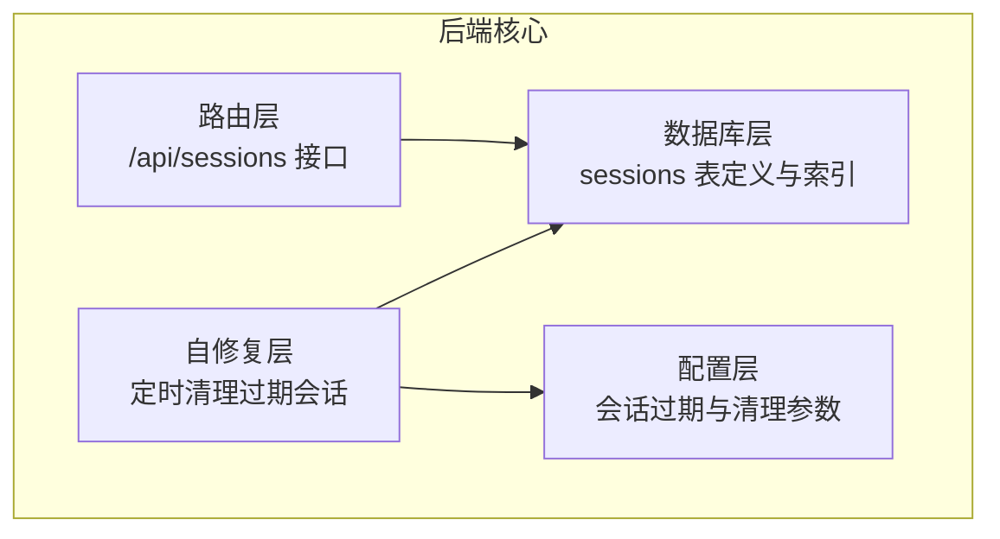
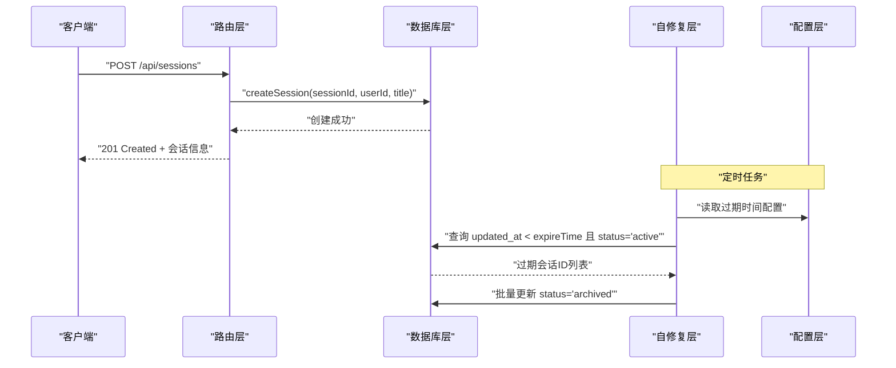
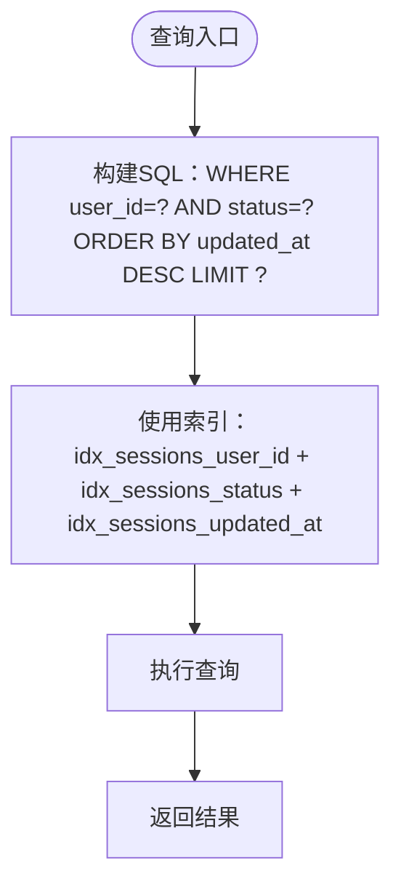
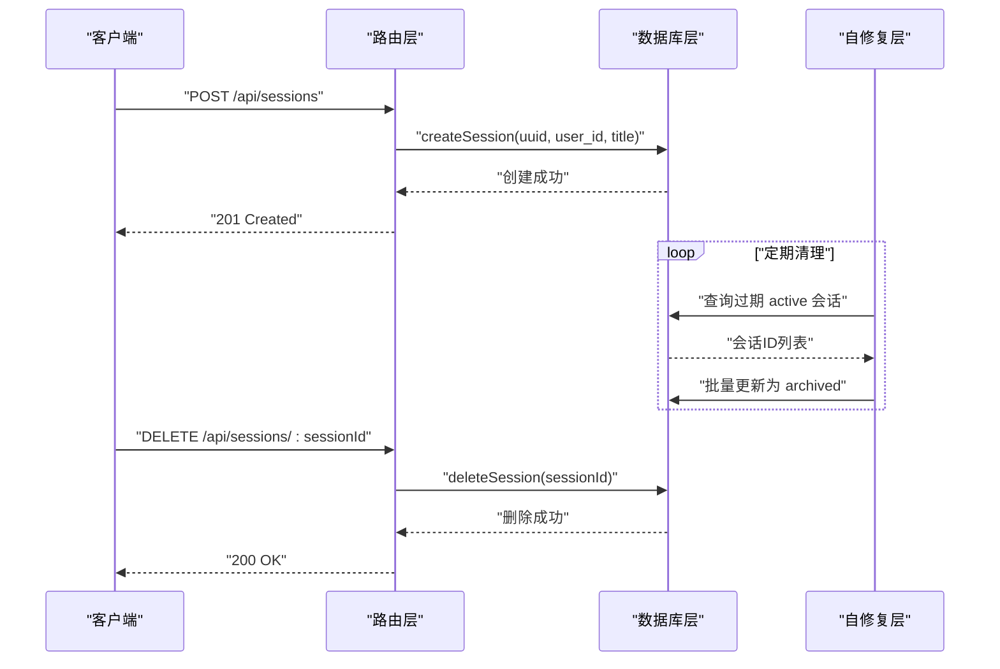
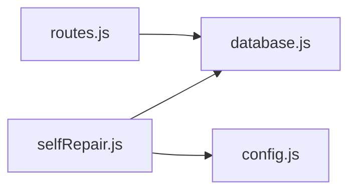

# 会话管理表

<cite>
**本文引用的文件**
- [database.js](file://backend/src/core/database.js)
- [routes.js](file://backend/src/core/routes.js)
- [selfRepair.js](file://backend/src/core/selfRepair.js)
- [config.js](file://backend/src/core/config.js)
</cite>

## 目录
1. [简介](#简介)
2. [项目结构](#项目结构)
3. [核心组件](#核心组件)
4. [架构总览](#架构总览)
5. [详细组件分析](#详细组件分析)
6. [依赖关系分析](#依赖关系分析)
7. [性能考量](#性能考量)
8. [故障排查指南](#故障排查指南)
9. [结论](#结论)

## 简介
本文档围绕会话管理表（sessions）进行系统性设计说明，覆盖字段定义、数据类型、业务语义、状态枚举及转换逻辑、外键约束与参照完整性、索引策略对查询性能的影响，以及会话生命周期管理的最佳实践（创建、更新、归档、删除）。文档同时结合后端数据库层、路由层与自修复机制的实际实现，帮助开发者与运维人员准确理解并高效维护会话数据。

## 项目结构
会话管理涉及的核心文件位于后端核心模块中：
- 数据库层：负责表结构定义、索引创建、会话 CRUD 操作与事务封装
- 路由层：对外暴露会话管理 API，包括创建、查询、删除等
- 自修复层：定时清理过期会话，将其状态归档
- 配置层：提供会话过期时间、清理间隔等运行参数

图表来源
- [database.js:44-64](file://backend/src/core/database.js#L44-L64)
- [routes.js:256-345](file://backend/src/core/routes.js#L256-L345)
- [selfRepair.js:341-373](file://backend/src/core/selfRepair.js#L341-L373)
- [config.js:179-186](file://backend/src/core/config.js#L179-L186)

章节来源
- [database.js:44-64](file://backend/src/core/database.js#L44-L64)
- [routes.js:256-345](file://backend/src/core/routes.js#L256-L345)
- [selfRepair.js:341-373](file://backend/src/core/selfRepair.js#L341-L373)
- [config.js:179-186](file://backend/src/core/config.js#L179-L186)

## 核心组件
- 会话表（sessions）：存储用户会话的基本信息与状态
- 会话相关 API：提供创建、查询、删除等接口
- 会话生命周期管理：创建、更新、归档、删除
- 自修复机制：定时扫描并归档过期会话
- 索引策略：针对 user_id、status、updated_at 的索引提升查询性能

章节来源
- [database.js:44-64](file://backend/src/core/database.js#L44-L64)
- [routes.js:256-345](file://backend/src/core/routes.js#L256-L345)
- [selfRepair.js:341-373](file://backend/src/core/selfRepair.js#L341-L373)

## 架构总览
会话管理在系统中的位置如下：
- 数据库层负责 sessions 表的创建、索引与 CRUD
- 路由层提供 RESTful 接口，调用数据库层执行业务逻辑
- 自修复层通过定时任务扫描 sessions 表，将过期会话状态改为归档
- 配置层提供过期时间与清理间隔等参数

图表来源
- [routes.js:266-290](file://backend/src/core/routes.js#L266-L290)
- [database.js:458-466](file://backend/src/core/database.js#L458-L466)
- [selfRepair.js:341-373](file://backend/src/core/selfRepair.js#L341-L373)
- [config.js:182-183](file://backend/src/core/config.js#L182-L183)

## 详细组件分析

### 会话表字段定义与数据类型
- id（UUID 主键）
  - 类型：TEXT（PRIMARY KEY）
  - 作用：会话唯一标识，全局唯一
  - 参考实现：[database.js:46](file://backend/src/core/database.js#L46)
- user_id（用户标识）
  - 类型：TEXT NOT NULL
  - 作用：标识会话所属用户，配合索引加速按用户查询
  - 参考实现：[database.js:48](file://backend/src/core/database.js#L48)
- title（会话标题）
  - 类型：TEXT
  - 作用：展示用的会话标题，可为空
  - 参考实现：[database.js:50](file://backend/src/core/database.js#L50)
- created_at（创建时间）
  - 类型：DATETIME DEFAULT CURRENT_TIMESTAMP
  - 作用：记录会话创建时间
  - 参考实现：[database.js:52](file://backend/src/core/database.js#L52)
- updated_at（更新时间）
  - 类型：DATETIME DEFAULT CURRENT_TIMESTAMP
  - 作用：记录会话最后更新时间，用于排序与过期判定
  - 参考实现：[database.js:54](file://backend/src/core/database.js#L54)
- status（会话状态）
  - 类型：TEXT DEFAULT 'active'
  - 枚举值：active（活跃）、archived（归档）、deleted（删除）
  - 作用：控制会话可见性与生命周期管理
  - 参考实现：[database.js:56](file://backend/src/core/database.js#L56)

章节来源
- [database.js:44-56](file://backend/src/core/database.js#L44-L56)

### 会话状态枚举与业务含义
- active（活跃）
  - 含义：会话处于可用状态，用户可继续交互
  - 查询限制：默认仅查询 active 状态的会话
  - 参考实现：[database.js:474](file://backend/src/core/database.js#L474)、[database.js:487](file://backend/src/core/database.js#L487)
- archived（归档）
  - 含义：会话被标记为归档，不再参与常规查询，但保留历史数据
  - 触发场景：过期会话被自修复任务自动归档
  - 参考实现：[selfRepair.js:360-366](file://backend/src/core/selfRepair.js#L360-L366)
- deleted（删除）
  - 含义：会话已被删除，通常通过事务级删除消息与会话本身
  - 参考实现：[database.js:521-540](file://backend/src/core/database.js#L521-L540)

章节来源
- [database.js:474](file://backend/src/core/database.js#L474)
- [database.js:487](file://backend/src/core/database.js#L487)
- [selfRepair.js:360-366](file://backend/src/core/selfRepair.js#L360-L366)
- [database.js:521-540](file://backend/src/core/database.js#L521-L540)

### 外键约束与参照完整性
- sessions 表与 messages 表
  - 约束：messages.session_id 外键引用 sessions.id
  - 行为：ON DELETE CASCADE，删除会话时自动删除其消息
  - 参考实现：[database.js:86](file://backend/src/core/database.js#L86)
- sessions 表与 query_history 表
  - 约束：query_history.session_id 外键引用 sessions.id
  - 行为：ON DELETE SET NULL，删除会话时将历史记录的 session_id 置空
  - 参考实现：[database.js:124](file://backend/src/core/database.js#L124)
- 外键启用
  - 初始化时启用 PRAGMA foreign_keys = ON
  - 参考实现：[database.js:229](file://backend/src/core/database.js#L229)

章节来源
- [database.js:86](file://backend/src/core/database.js#L86)
- [database.js:124](file://backend/src/core/database.js#L124)
- [database.js:229](file://backend/src/core/database.js#L229)

### 索引策略与查询性能影响
- idx_sessions_user_id（sessions.user_id）
  - 用途：加速按用户查询会话列表
  - 影响：getUserSessions(userId, limit) 等查询性能
  - 参考实现：[database.js:60](file://backend/src/core/database.js#L60)
- idx_sessions_status（sessions.status）
  - 用途：加速按状态筛选（如 active）
  - 影响：getSession(sessionId)、getUserSessions() 等查询性能
  - 参考实现：[database.js:62](file://backend/src/core/database.js#L62)
- idx_sessions_updated_at（sessions.updated_at）
  - 用途：加速按时间排序（最新优先）
  - 影响：getUserSessions() 的 ORDER BY updated_at DESC
  - 参考实现：[database.js:64](file://backend/src/core/database.js#L64)

图表来源
- [database.js:484-491](file://backend/src/core/database.js#L484-L491)

章节来源
- [database.js:60](file://backend/src/core/database.js#L60)
- [database.js:62](file://backend/src/core/database.js#L62)
- [database.js:64](file://backend/src/core/database.js#L64)
- [database.js:484-491](file://backend/src/core/database.js#L484-L491)

### 会话生命周期管理最佳实践
- 创建（createSession）
  - 步骤：生成 UUID，插入 sessions 表
  - 参考实现：[database.js:458-466](file://backend/src/core/database.js#L458-L466)
  - 接口：POST /api/sessions
  - 参考实现：[routes.js:266-290](file://backend/src/core/routes.js#L266-L290)
- 更新（touchSession、updateSessionTitle）
  - touchSession：更新 updated_at 为当前时间
  - updateSessionTitle：更新 title
  - 参考实现：[database.js:498-514](file://backend/src/core/database.js#L498-L514)
- 查询（getSession、getUserSessions）
  - getSession：按 id 与 status='active' 查询
  - getUserSessions：按 user_id 与 status='active' 查询并按 updated_at 降序
  - 参考实现：[database.js:473-491](file://backend/src/core/database.js#L473-L491)
- 删除（deleteSession）
  - 事务：先删除 messages（CASCADE），再删除 sessions
  - 参考实现：[database.js:521-540](file://backend/src/core/database.js#L521-L540)
  - 接口：DELETE /api/sessions/:sessionId
  - 参考实现：[routes.js:320-345](file://backend/src/core/routes.js#L320-L345)
- 归档（自修复）
  - 条件：updated_at < expireTime 且 status='active'
  - 动作：批量更新 status='archived'
  - 参考实现：[selfRepair.js:341-373](file://backend/src/core/selfRepair.js#L341-L373)
  - 配置：expireTime、cleanupInterval
  - 参考实现：[config.js:182-186](file://backend/src/core/config.js#L182-L186)

图表来源
- [routes.js:266-290](file://backend/src/core/routes.js#L266-L290)
- [database.js:458-466](file://backend/src/core/database.js#L458-L466)
- [selfRepair.js:341-373](file://backend/src/core/selfRepair.js#L341-L373)
- [database.js:521-540](file://backend/src/core/database.js#L521-L540)

章节来源
- [database.js:458-466](file://backend/src/core/database.js#L458-L466)
- [database.js:498-514](file://backend/src/core/database.js#L498-L514)
- [database.js:473-491](file://backend/src/core/database.js#L473-L491)
- [database.js:521-540](file://backend/src/core/database.js#L521-L540)
- [routes.js:266-290](file://backend/src/core/routes.js#L266-L290)
- [routes.js:320-345](file://backend/src/core/routes.js#L320-L345)
- [selfRepair.js:341-373](file://backend/src/core/selfRepair.js#L341-L373)
- [config.js:182-186](file://backend/src/core/config.js#L182-L186)

## 依赖关系分析
- 路由层依赖数据库层提供的会话操作方法
- 自修复层依赖配置层提供的过期时间参数，并调用数据库层执行查询与更新
- 数据库层内部通过 PRAGMA 启用外键约束，确保参照完整性

图表来源
- [routes.js:256-345](file://backend/src/core/routes.js#L256-L345)
- [database.js:44-64](file://backend/src/core/database.js#L44-L64)
- [selfRepair.js:341-373](file://backend/src/core/selfRepair.js#L341-L373)
- [config.js:179-186](file://backend/src/core/config.js#L179-L186)

章节来源
- [routes.js:256-345](file://backend/src/core/routes.js#L256-L345)
- [database.js:44-64](file://backend/src/core/database.js#L44-L64)
- [selfRepair.js:341-373](file://backend/src/core/selfRepair.js#L341-L373)
- [config.js:179-186](file://backend/src/core/config.js#L179-L186)

## 性能考量
- 索引选择
  - idx_sessions_user_id：提升按用户查询的性能
  - idx_sessions_status：提升按状态过滤的性能
  - idx_sessions_updated_at：提升按时间排序的性能
- 外键行为
  - messages 表 ON DELETE CASCADE，删除会话时自动清理消息，避免孤立数据
  - query_history 表 ON DELETE SET NULL，保留历史记录但断开会话关联，便于审计
- 自修复策略
  - 定期扫描 active 且过期的会话，批量归档，减少频繁小事务带来的开销

章节来源
- [database.js:60](file://backend/src/core/database.js#L60)
- [database.js:62](file://backend/src/core/database.js#L62)
- [database.js:64](file://backend/src/core/database.js#L64)
- [database.js:86](file://backend/src/core/database.js#L86)
- [database.js:124](file://backend/src/core/database.js#L124)
- [selfRepair.js:341-373](file://backend/src/core/selfRepair.js#L341-L373)

## 故障排查指南
- 会话查询不到
  - 检查 status 是否为 active（默认仅查询 active）
  - 参考实现：[database.js:474](file://backend/src/core/database.js#L474)、[database.js:487](file://backend/src/core/database.js#L487)
- 删除失败或数据不一致
  - 确认外键约束已启用（PRAGMA foreign_keys = ON）
  - 参考实现：[database.js:229](file://backend/src/core/database.js#L229)
  - 确认事务执行顺序：先删消息，再删会话
  - 参考实现：[database.js:524-531](file://backend/src/core/database.js#L524-L531)
- 过期会话未被归档
  - 检查自修复任务是否运行
  - 检查配置项 expireTime 与 cleanupInterval
  - 参考实现：[selfRepair.js:341-373](file://backend/src/core/selfRepair.js#L341-L373)、[config.js:182-186](file://backend/src/core/config.js#L182-L186)

章节来源
- [database.js:474](file://backend/src/core/database.js#L474)
- [database.js:487](file://backend/src/core/database.js#L487)
- [database.js:229](file://backend/src/core/database.js#L229)
- [database.js:524-531](file://backend/src/core/database.js#L524-L531)
- [selfRepair.js:341-373](file://backend/src/core/selfRepair.js#L341-L373)
- [config.js:182-186](file://backend/src/core/config.js#L182-L186)

## 结论
会话管理表（sessions）通过明确的字段定义、合理的状态枚举与外键约束，结合针对性索引与自修复机制，实现了高效、可靠、可维护的会话生命周期管理。遵循本文的最佳实践，可在保证查询性能的同时，确保数据一致性与可审计性。