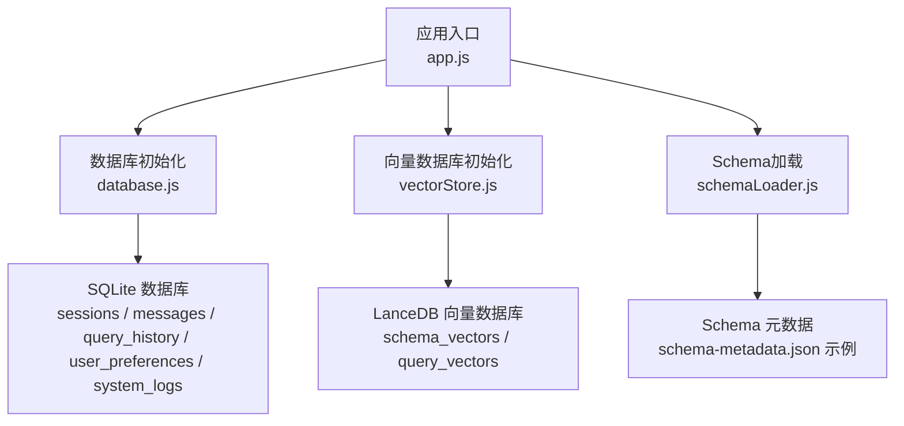
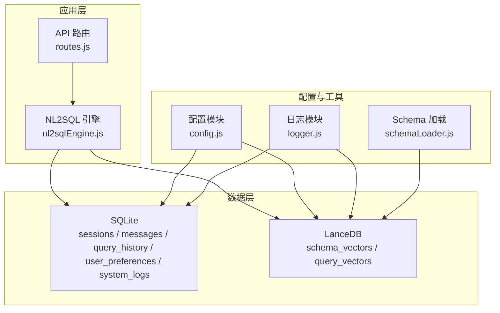
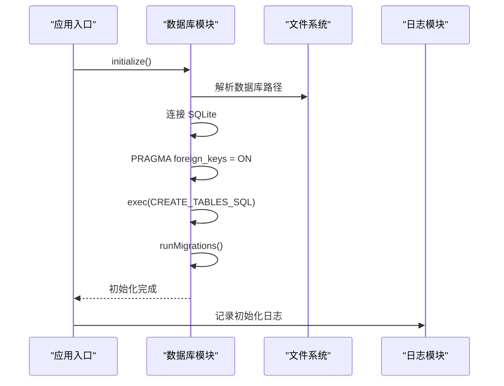
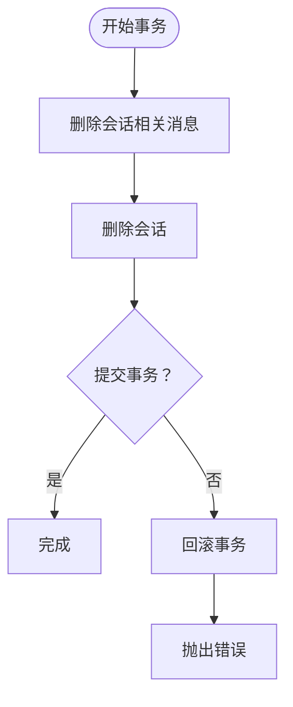
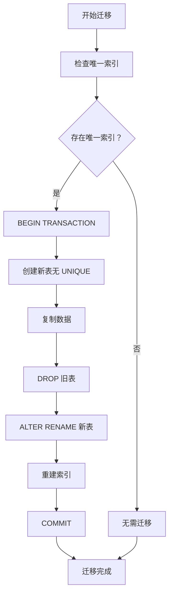
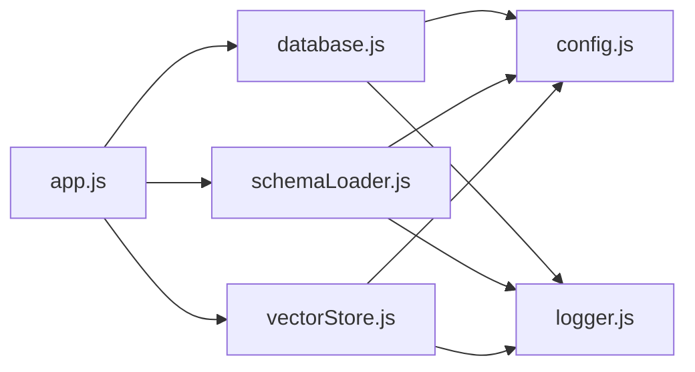

# 关系数据库设计

<cite>
**本文引用的文件**
- [database.js](file://backend/src/core/database.js)
- [config.js](file://backend/src/core/config.js)
- [logger.js](file://backend/src/utils/logger.js)
- [schemaLoader.js](file://backend/src/core/schemaLoader.js)
- [vectorStore.js](file://backend/src/memory/vectorStore.js)
- [app.js](file://backend/src/app.js)
- [schema-metadata.example.json](file://backend/config/schema-metadata.example.json)
</cite>

## 目录
1. [简介](#简介)
2. [项目结构](#项目结构)
3. [核心组件](#核心组件)
4. [架构总览](#架构总览)
5. [详细组件分析](#详细组件分析)
6. [依赖分析](#依赖分析)
7. [性能考虑](#性能考虑)
8. [故障排查指南](#故障排查指南)
9. [结论](#结论)
10. [附录](#附录)

## 简介
本设计文档聚焦 NL2SQL 项目的 SQLite 关系数据库整体架构与实现细节，围绕 sessions、messages、query_history、user_preferences、system_logs 等核心表展开，系统阐述：
- 表结构设计理念与用途
- 字段定义、数据类型、约束与索引策略
- 表间外键关系与参照完整性保障
- 数据库初始化流程、表结构创建 SQL 与索引优化
- 数据访问模式、事务处理与错误处理
- 数据库迁移机制、版本兼容与性能优化建议

## 项目结构
后端采用 Node.js + Express 架构，数据库初始化在应用启动阶段完成，随后加载 Schema 元数据并启动向量数据库。SQLite 用于会话与查询历史等轻量持久化，LanceDB 用于向量化检索。

图表来源
- [app.js:97-166](file://backend/src/app.js#L97-L166)
- [database.js:200-261](file://backend/src/core/database.js#L200-L261)
- [vectorStore.js:231-261](file://backend/src/memory/vectorStore.js#L231-L261)
- [schemaLoader.js:69-122](file://backend/src/core/schemaLoader.js#L69-L122)

章节来源
- [app.js:97-166](file://backend/src/app.js#L97-L166)
- [config.js:97-130](file://backend/src/core/config.js#L97-L130)

## 核心组件
- SQLite 数据库管理模块：负责数据库连接、表结构创建、迁移、事务、查询封装与错误日志。
- 配置模块：集中管理数据库路径、向量数据库路径、安全策略、日志级别等。
- 日志模块：统一记录数据库初始化、迁移、查询、事务等关键事件。
- Schema 加载模块：加载并缓存表结构元数据，支持向量化与语义检索。
- 向量存储模块：基于 LanceDB 的向量表 schema_vectors、query_vectors，提供语义搜索与智能重排序。

章节来源
- [database.js:12-19](file://backend/src/core/database.js#L12-L19)
- [config.js:97-130](file://backend/src/core/config.js#L97-L130)
- [logger.js:54-85](file://backend/src/utils/logger.js#L54-L85)
- [schemaLoader.js:36-51](file://backend/src/core/schemaLoader.js#L36-L51)
- [vectorStore.js:204-220](file://backend/src/memory/vectorStore.js#L204-L220)

## 架构总览
SQLite 作为本地轻量数据库，承载会话、消息、查询历史、用户偏好与系统日志；LanceDB 作为向量数据库，支撑 Schema 与查询历史的语义检索。应用启动时按序初始化，确保数据库与向量库就绪后再提供 API 服务。

图表来源
- [app.js:44-50](file://backend/src/app.js#L44-L50)
- [database.js:39-189](file://backend/src/core/database.js#L39-L189)
- [vectorStore.js:231-322](file://backend/src/memory/vectorStore.js#L231-L322)
- [schemaLoader.js:69-122](file://backend/src/core/schemaLoader.js#L69-L122)

## 详细组件分析

### 表结构与设计原则
- sessions：会话生命周期管理，主键为 UUID，包含用户标识、标题、状态与时间戳。
- messages：会话内消息历史，外键关联 sessions，支持多种角色与类型，便于对话流追踪。
- query_history：用户查询记录，包含自然语言、生成 SQL、执行状态、结果与耗时等，外键关联 sessions。
- user_preferences：用户偏好与常用模式，支持字段别名、查询模式等，索引优化按用户与类型查询。
- system_logs：系统运行日志，支持按级别与时间查询。

章节来源
- [database.js:44-188](file://backend/src/core/database.js#L44-L188)

### 字段定义与约束
- sessions
  - id: 主键，TEXT
  - user_id: NOT NULL，TEXT
  - title: 可选，TEXT
  - created_at: 默认 CURRENT_TIMESTAMP，DATETIME
  - updated_at: 默认 CURRENT_TIMESTAMP，DATETIME
  - status: 默认 'active'，TEXT
- messages
  - id: 主键，INTEGER AUTOINCREMENT
  - session_id: NOT NULL，TEXT，外键 references sessions(id) ON DELETE CASCADE
  - role: NOT NULL，TEXT
  - content: NOT NULL，TEXT
  - type: 默认 'text'，TEXT
  - metadata: JSON 文本，TEXT
  - created_at: 默认 CURRENT_TIMESTAMP，DATETIME
- query_history
  - id: 主键，INTEGER AUTOINCREMENT
  - session_id: 可选，TEXT，外键 references sessions(id) ON DELETE SET NULL
  - user_id: NOT NULL，TEXT
  - natural_query: NOT NULL，TEXT
  - generated_sql: 可选，TEXT
  - status: 默认 'pending'，TEXT
  - result: 可选，JSON 文本，TEXT
  - error_message: 可选，TEXT
  - execution_time: INTEGER
  - row_count: INTEGER
  - created_at: 默认 CURRENT_TIMESTAMP，DATETIME
  - executed_at: 可选，DATETIME
- user_preferences
  - id: 主键，INTEGER AUTOINCREMENT
  - user_id: NOT NULL，TEXT
  - preference_type: NOT NULL，TEXT
  - content: NOT NULL，JSON 文本，TEXT
  - usage_count: 默认 1，INTEGER
  - last_used_at: 可选，DATETIME
  - created_at: 默认 CURRENT_TIMESTAMP，DATETIME
  - updated_at: 默认 CURRENT_TIMESTAMP，DATETIME
- system_logs
  - id: 主键，INTEGER AUTOINCREMENT
  - level: NOT NULL，TEXT
  - message: NOT NULL，TEXT
  - source: 可选，TEXT
  - metadata: 可选，JSON 文本，TEXT
  - created_at: 默认 CURRENT_TIMESTAMP，DATETIME

章节来源
- [database.js:44-188](file://backend/src/core/database.js#L44-L188)

### 索引策略
- sessions：idx_sessions_user_id、idx_sessions_status、idx_sessions_updated_at
- messages：idx_messages_session_id、idx_messages_created_at
- query_history：idx_query_history_user_id、idx_query_history_session_id、idx_query_history_created_at、idx_query_history_status
- user_preferences：idx_user_preferences_user_id、idx_user_preferences_type、idx_user_prefs_user_type（复合索引）
- system_logs：idx_system_logs_level、idx_system_logs_created_at

章节来源
- [database.js:59-188](file://backend/src/core/database.js#L59-L188)

### 外键关系与参照完整性
- messages.session_id → sessions.id（CASCADE 删除）
- query_history.session_id → sessions.id（SET NULL）

章节来源
- [database.js:86](file://backend/src/core/database.js#L86)
- [database.js:124](file://backend/src/core/database.js#L124)

### 数据库初始化流程
- 解析配置路径，建立数据库连接
- 启用外键约束 PRAGMA foreign_keys = ON
- 执行 CREATE TABLES SQL（包含表与索引）
- 执行迁移 runMigrations（如 user_preferences 表存在旧 UNIQUE 约束则重建）
- 记录初始化日志与错误处理

图表来源
- [database.js:200-261](file://backend/src/core/database.js#L200-L261)
- [database.js:271-336](file://backend/src/core/database.js#L271-L336)

章节来源
- [database.js:200-261](file://backend/src/core/database.js#L200-L261)
- [database.js:271-336](file://backend/src/core/database.js#L271-L336)

### 表结构创建 SQL 与索引优化
- CREATE TABLES SQL：一次性创建所有表与索引，减少多次往返
- 索引优化：针对高频查询字段建立单列或复合索引，如 sessions.user_id、messages.session_id、user_preferences.user_id+preference_type

章节来源
- [database.js:39-189](file://backend/src/core/database.js#L39-L189)

### 数据访问模式
- query(sql, params): 返回多行结果
- queryOne(sql, params): 返回单行结果
- run(sql, params): 插入/更新/删除，返回 lastID 与 changes
- transaction(callback): 事务封装，自动 BEGIN/COMMIT/ROLLBACK

章节来源
- [database.js:361-445](file://backend/src/core/database.js#L361-L445)

### 事务处理机制
- 会话删除：先删除消息，再删除会话，保证参照完整性
- 迁移：在事务中重建表、复制数据、重建索引，失败回滚

图表来源
- [database.js:524-540](file://backend/src/core/database.js#L524-L540)

章节来源
- [database.js:431-445](file://backend/src/core/database.js#L431-L445)
- [database.js:524-540](file://backend/src/core/database.js#L524-L540)

### 错误处理方案
- 数据库连接失败、表创建失败、迁移失败均记录错误日志并拒绝 Promise
- 查询失败记录 SQL 与参数，便于定位问题
- 日志模块提供统一的错误格式化与输出

章节来源
- [database.js:218-243](file://backend/src/core/database.js#L218-L243)
- [database.js:370-376](file://backend/src/core/database.js#L370-L376)
- [logger.js:299-309](file://backend/src/utils/logger.js#L299-L309)

### 数据库迁移机制与版本兼容
- 检测 user_preferences 表是否存在 sqlite_autoindex 唯一索引
- 若存在，事务中重建表（移除 UNIQUE 约束）、复制数据、重建索引
- 迁移完成后记录完成日志，失败回滚并抛出错误

图表来源
- [database.js:271-336](file://backend/src/core/database.js#L271-L336)

章节来源
- [database.js:271-336](file://backend/src/core/database.js#L271-L336)

### 会话与消息管理
- 创建会话、获取会话、获取用户会话、更新会话时间、更新标题、删除会话
- 添加消息、获取消息历史（解析 metadata JSON）

章节来源
- [database.js:458-540](file://backend/src/core/database.js#L458-L540)
- [database.js:555-596](file://backend/src/core/database.js#L555-L596)

### 用户偏好与查询模式
- 添加偏好、获取偏好列表、更新使用统计、获取常用查询模板、字段别名映射
- 查找已存在偏好（按 content 中关键字段匹配）、删除偏好、近期相似查询次数统计

章节来源
- [database.js:609-781](file://backend/src/core/database.js#L609-L781)

### 查询历史与系统日志
- 查询历史：按用户、会话、状态、时间排序查询
- 系统日志：按级别与时间查询

章节来源
- [database.js:582-596](file://backend/src/core/database.js#L582-L596)
- [database.js:170-188](file://backend/src/core/database.js#L170-L188)

## 依赖分析
- database.js 依赖 config.js（数据库路径）、logger.js（日志）
- app.js 依赖 database.js、vectorStore.js、schemaLoader.js
- schemaLoader.js 依赖 config.js、logger.js、llmService、vectorStore
- vectorStore.js 依赖 config.js、logger.js、evaluation

图表来源
- [database.js:12-19](file://backend/src/core/database.js#L12-L19)
- [app.js:44-50](file://backend/src/app.js#L44-L50)
- [schemaLoader.js:15-26](file://backend/src/core/schemaLoader.js#L15-L26)
- [vectorStore.js:14-21](file://backend/src/memory/vectorStore.js#L14-L21)

章节来源
- [database.js:12-19](file://backend/src/core/database.js#L12-L19)
- [app.js:44-50](file://backend/src/app.js#L44-L50)
- [schemaLoader.js:15-26](file://backend/src/core/schemaLoader.js#L15-L26)
- [vectorStore.js:14-21](file://backend/src/memory/vectorStore.js#L14-L21)

## 性能考虑
- 索引策略：针对高频过滤与排序字段建立索引，避免全表扫描
- 事务批量：删除会话时先删消息再删会话，减少外键约束检查成本
- JSON 存储：metadata 与 content 使用 JSON 文本存储，查询时解析，注意避免过度嵌套
- 迁移优化：一次性重建表并重建索引，减少碎片与重复 IO
- 查询限制：结合配置中的最大行数与超时限制，避免大查询阻塞

[本节为通用性能建议，不直接分析具体文件]

## 故障排查指南
- 数据库连接失败：检查 DB_PATH 配置与文件权限
- 外键约束未生效：确认初始化时 PRAGMA foreign_keys = ON 已执行
- 迁移失败：查看日志中唯一索引检测与事务回滚信息
- 查询报错：核对 SQL 与参数，查看日志中的错误元数据
- 启动失败：关注 app.js 初始化顺序与异常捕获

章节来源
- [database.js:218-243](file://backend/src/core/database.js#L218-L243)
- [database.js:370-376](file://backend/src/core/database.js#L370-L376)
- [app.js:160-165](file://backend/src/app.js#L160-L165)

## 结论
本设计以 SQLite 为核心，结合合理的索引与事务策略，满足会话、消息、查询历史、用户偏好与系统日志的存储需求；配合 LanceDB 实现 Schema 与查询历史的语义检索，形成“关系型持久化 + 向量检索”的混合架构。迁移机制确保版本演进的平滑过渡，日志与错误处理保障运维可观测性。

[本节为总结性内容，不直接分析具体文件]

## 附录

### 配置项与默认值（与数据库相关）
- database.path：SQLite 数据库文件路径，默认 ./data/sessions.db
- vectorDb.path：LanceDB 数据库目录，默认 ./data/vectordb
- security.allowedTables：白名单表集合（影响实际查询，非 SQLite）
- log.level：日志级别（INFO/DEBUG/WARN/ERROR）

章节来源
- [config.js:97-130](file://backend/src/core/config.js#L97-L130)
- [config.js:140-170](file://backend/src/core/config.js#L140-L170)
- [config.js:195-213](file://backend/src/core/config.js#L195-L213)

### Schema 元数据示例（与数据库无关但影响向量检索）
- tables/relationships/metrics/dimensions：用于构建表级向量与语义搜索

章节来源
- [schema-metadata.example.json:1-328](file://backend/config/schema-metadata.example.json#L1-L328)