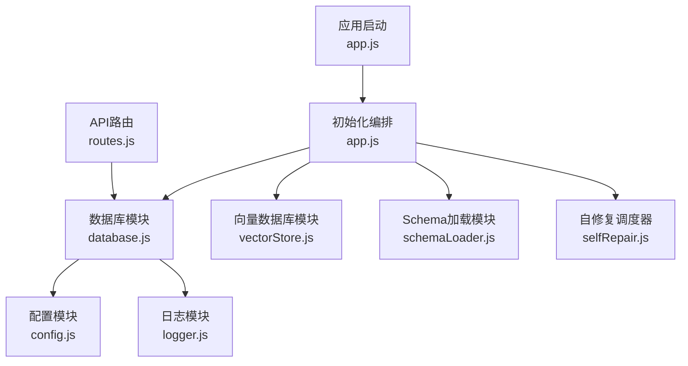
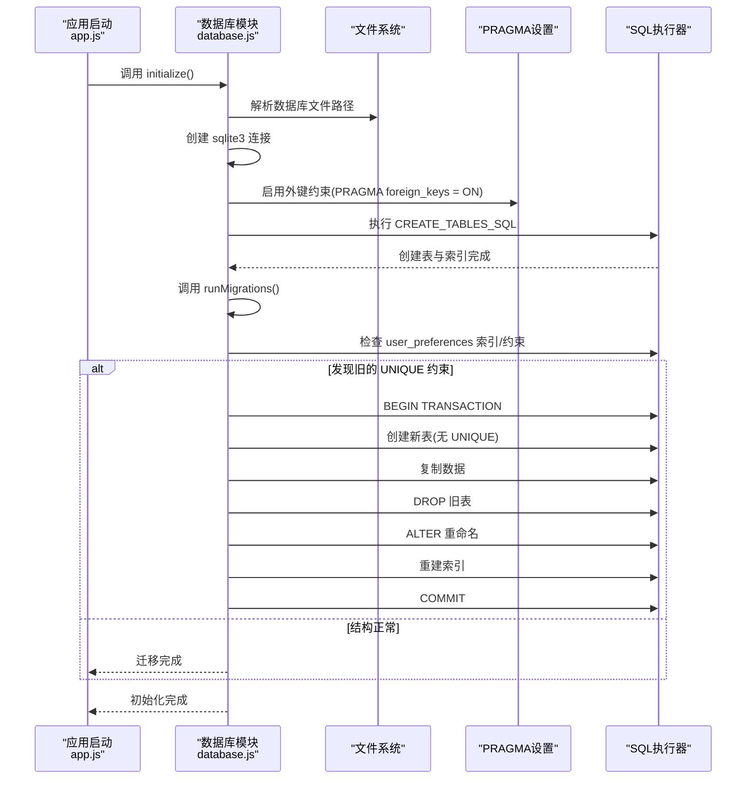
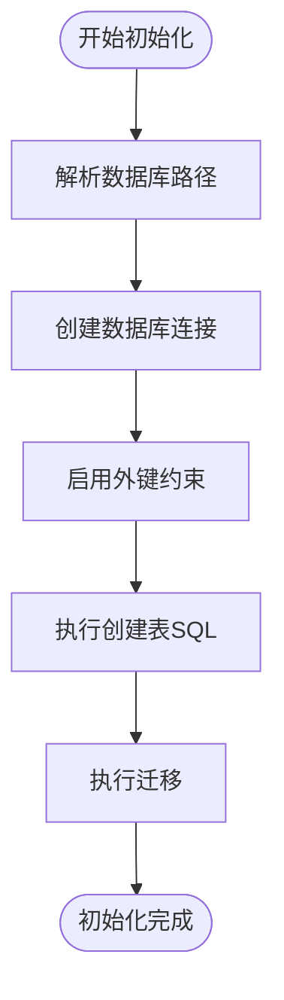
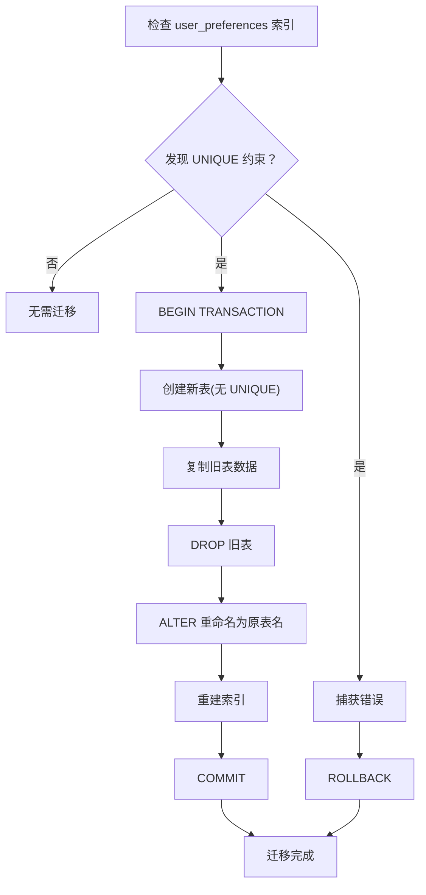
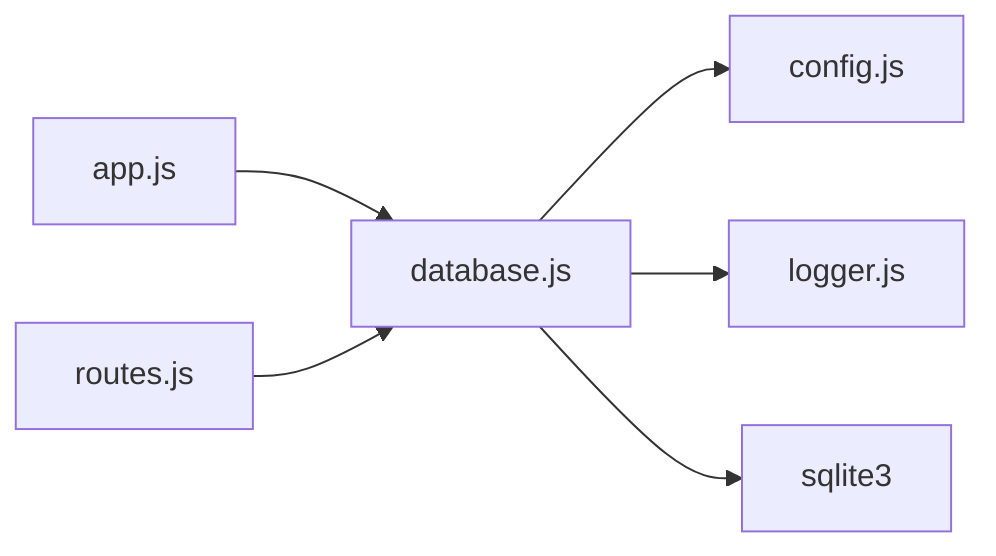

# 数据库初始化与迁移

<cite>
**本文档引用的文件**
- [database.js](file://backend/src/core/database.js)
- [config.js](file://backend/src/core/config.js)
- [logger.js](file://backend/src/utils/logger.js)
- [app.js](file://backend/src/app.js)
- [routes.js](file://backend/src/core/routes.js)
</cite>

## 目录
1. [简介](#简介)
2. [项目结构](#项目结构)
3. [核心组件](#核心组件)
4. [架构总览](#架构总览)
5. [详细组件分析](#详细组件分析)
6. [依赖关系分析](#依赖关系分析)
7. [性能考虑](#性能考虑)
8. [故障排查指南](#故障排查指南)
9. [结论](#结论)

## 简介
本文件面向NL2SQL项目的数据库初始化与迁移机制，系统性阐述SQLite数据库的连接建立、外键约束启用、表结构创建与索引建立的完整流程；深入解析CREATE_TABLES_SQL中各表的DDL设计与约束定义；说明迁移机制的实现原理（表结构检查、数据迁移策略、索引重建）、事务管理与错误恢复；并给出数据库版本管理最佳实践与SQLite配置优化建议。

## 项目结构
数据库相关能力集中在后端核心模块中，主要涉及：
- 数据库初始化与迁移：backend/src/core/database.js
- 应用启动与初始化编排：backend/src/app.js
- 配置管理：backend/src/core/config.js
- 日志工具：backend/src/utils/logger.js
- API路由（健康检查等）：backend/src/core/routes.js

图表来源
- [app.js:97-166](file://backend/src/app.js#L97-L166)
- [database.js:200-261](file://backend/src/core/database.js#L200-L261)
- [config.js:97-100](file://backend/src/core/config.js#L97-L100)
- [logger.js:54-85](file://backend/src/utils/logger.js#L54-L85)
- [routes.js:16-36](file://backend/src/core/routes.js#L16-L36)

章节来源
- [app.js:97-166](file://backend/src/app.js#L97-L166)
- [database.js:200-261](file://backend/src/core/database.js#L200-L261)
- [config.js:97-100](file://backend/src/core/config.js#L97-L100)
- [logger.js:54-85](file://backend/src/utils/logger.js#L54-L85)
- [routes.js:16-36](file://backend/src/core/routes.js#L16-L36)

## 核心组件
- 数据库初始化与迁移模块：负责SQLite连接、外键约束启用、表结构创建、索引建立、迁移修复与事务封装。
- 配置模块：提供数据库文件路径等配置项。
- 日志模块：统一记录数据库初始化、迁移、查询、事务等关键操作。
- 应用启动模块：在服务启动时按序初始化数据库、向量库、Schema等。

章节来源
- [database.js:200-261](file://backend/src/core/database.js#L200-L261)
- [config.js:97-100](file://backend/src/core/config.js#L97-L100)
- [logger.js:263-309](file://backend/src/utils/logger.js#L263-L309)
- [app.js:115-127](file://backend/src/app.js#L115-L127)

## 架构总览
数据库初始化与迁移的整体流程如下：

图表来源
- [app.js:115-127](file://backend/src/app.js#L115-L127)
- [database.js:200-261](file://backend/src/core/database.js#L200-L261)
- [database.js:271-336](file://backend/src/core/database.js#L271-L336)

## 详细组件分析

### 数据库初始化流程
- 连接建立：通过sqlite3.Database以读写模式创建连接，路径来自配置。
- 外键约束启用：执行PRAGMA foreign_keys = ON，确保外键约束生效。
- 表结构创建：一次性执行CREATE_TABLES_SQL，包含所有表与索引。
- 迁移执行：初始化完成后立即执行迁移，修复历史结构问题。

图表来源
- [database.js:200-261](file://backend/src/core/database.js#L200-L261)
- [database.js:271-336](file://backend/src/core/database.js#L271-L336)

章节来源
- [database.js:200-261](file://backend/src/core/database.js#L200-L261)

### 表结构与索引设计（CREATE_TABLES_SQL）
- sessions 表
  - 主键：id(TEXT, PRIMARY KEY)
  - 约束：NOT NULL(user_id)，默认状态active
  - 索引：idx_sessions_user_id、idx_sessions_status、idx_sessions_updated_at
- messages 表
  - 主键：id(INTEGER PRIMARY KEY AUTOINCREMENT)
  - 外键：session_id 引用 sessions(id) ON DELETE CASCADE
  - 索引：idx_messages_session_id、idx_messages_created_at
- query_history 表
  - 主键：id(INTEGER PRIMARY KEY AUTOINCREMENT)
  - 外键：session_id 引用 sessions(id) ON DELETE SET NULL
  - 索引：idx_query_history_user_id、idx_query_history_session_id、idx_query_history_created_at、idx_query_history_status
- user_preferences 表
  - 主键：id(INTEGER PRIMARY KEY AUTOINCREMENT)
  - 约束：NOT NULL(user_id, preference_type, content)
  - 索引：idx_user_preferences_user_id、idx_user_preferences_type、idx_user_prefs_user_type
- system_logs 表
  - 主键：id(INTEGER PRIMARY KEY AUTOINCREMENT)
  - 索引：idx_system_logs_level、idx_system_logs_created_at

章节来源
- [database.js:39-189](file://backend/src/core/database.js#L39-L189)

### 迁移机制实现原理
- 结构检查：通过PRAGMA index_list(user_preferences)检测是否存在以sqlite_autoindex开头且unique=1的索引，以此判断是否存在UNIQUE约束。
- 数据迁移策略：若检测到旧约束，采用“重建表”策略：
  - 创建新表（无UNIQUE约束）
  - 复制旧表全部数据
  - 删除旧表
  - 重命名新表为原表名
  - 重新创建所需索引
- 事务管理与错误恢复：使用BEGIN/COMMIT/ROLLBACK包裹整个重建过程，任一步骤失败均回滚，保证数据一致性。

图表来源
- [database.js:271-336](file://backend/src/core/database.js#L271-L336)

章节来源
- [database.js:271-336](file://backend/src/core/database.js#L271-L336)

### 事务封装与错误处理
- 事务封装：transaction(cb)内部自动执行BEGIN/COMMIT，并在异常时ROLLBACK，确保批量操作原子性。
- 错误处理：所有数据库操作均通过Promise包装，错误时记录详细日志并向上抛出，便于上层统一处理。
- 日志记录：初始化、迁移、查询、事务等关键节点均有日志输出，便于追踪与审计。

章节来源
- [database.js:431-445](file://backend/src/core/database.js#L431-L445)
- [database.js:361-424](file://backend/src/core/database.js#L361-L424)
- [logger.js:263-309](file://backend/src/utils/logger.js#L263-L309)

### API集成与健康检查
- 健康检查接口：/api/health与/api/health/detail返回数据库连接状态等信息，便于运维监控。
- 初始化编排：app.js在启动时依次初始化数据目录、SQLite数据库、向量数据库、Schema与自修复调度器。

章节来源
- [routes.js:72-137](file://backend/src/core/routes.js#L72-L137)
- [app.js:115-142](file://backend/src/app.js#L115-L142)

## 依赖关系分析
- database.js依赖：
  - config.js：读取数据库文件路径
  - logger.js：记录初始化、迁移、查询、事务等日志
  - sqlite3：底层数据库驱动
- app.js依赖database.js进行数据库初始化
- routes.js在健康检查中使用数据库状态

图表来源
- [database.js:12-19](file://backend/src/core/database.js#L12-L19)
- [config.js:97-100](file://backend/src/core/config.js#L97-L100)
- [logger.js:23-24](file://backend/src/utils/logger.js#L23-L24)
- [app.js:44](file://backend/src/app.js#L44)
- [routes.js:25](file://backend/src/core/routes.js#L25)

章节来源
- [database.js:12-19](file://backend/src/core/database.js#L12-L19)
- [config.js:97-100](file://backend/src/core/config.js#L97-L100)
- [logger.js:23-24](file://backend/src/utils/logger.js#L23-L24)
- [app.js:44](file://backend/src/app.js#L44)
- [routes.js:25](file://backend/src/core/routes.js#L25)

## 性能考虑
- 索引设计：针对高频查询字段（user_id、session_id、status、created_at等）建立索引，提升查询效率。
- 外键约束：启用PRAGMA foreign_keys = ON，确保参照完整性，避免脏数据。
- 事务批处理：使用transaction(cb)对批量写入进行事务封装，减少锁竞争与回滚成本。
- 日志级别：生产环境建议提升日志级别，减少IO开销；仅在调试阶段开启详细日志。

## 故障排查指南
- 初始化失败
  - 检查数据库文件路径配置是否正确
  - 查看日志中“数据库连接失败”、“创建数据表失败”等错误
  - 确认数据目录存在且具备写权限
- 迁移失败
  - 若出现“UNIQUE 约束”相关报错，确认是否为旧版本遗留
  - 检查迁移日志，定位ROLLBACK发生的具体步骤
- 查询异常
  - 使用query/queryOne/run方法时注意参数绑定，避免SQL注入
  - 查看日志中的SQL与参数，核对表结构与索引是否匹配
- 事务问题
  - 确保在transaction(cb)中正确处理异常，避免半事务状态
  - 对长事务进行拆分，减少锁持有时间

章节来源
- [database.js:200-261](file://backend/src/core/database.js#L200-L261)
- [database.js:271-336](file://backend/src/core/database.js#L271-L336)
- [database.js:361-424](file://backend/src/core/database.js#L361-L424)
- [logger.js:263-309](file://backend/src/utils/logger.js#L263-L309)

## 结论
本项目通过集中式的数据库模块实现了SQLite初始化与迁移的自动化：连接建立、外键启用、表与索引创建、结构修复与事务保障，配合完善的日志与健康检查接口，形成了可靠的数据库生命周期管理体系。遵循本文档的迁移策略与最佳实践，可在不影响业务的前提下平滑演进数据库结构，确保数据一致性与查询性能。