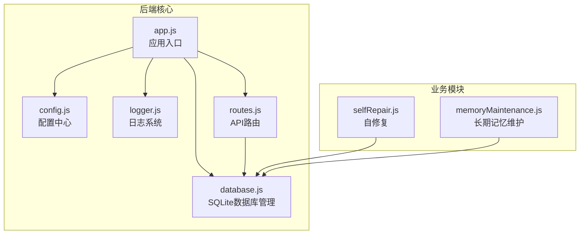
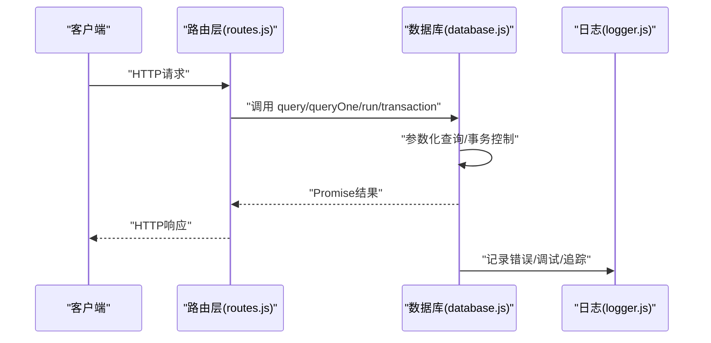
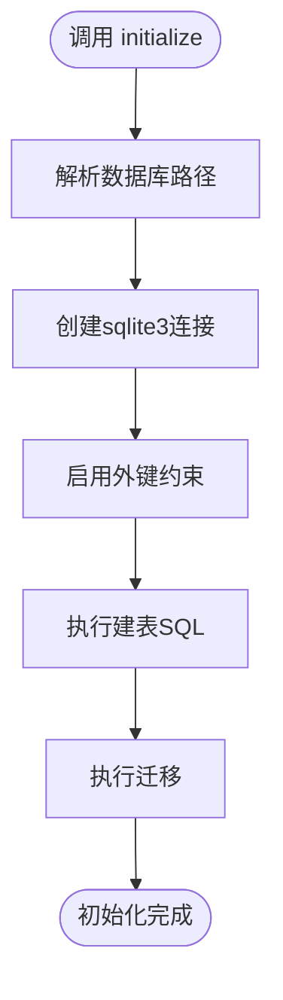
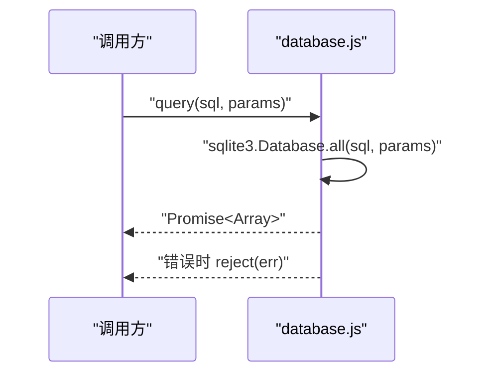
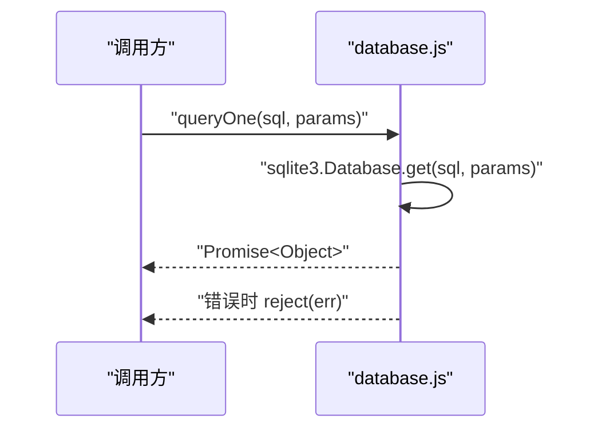
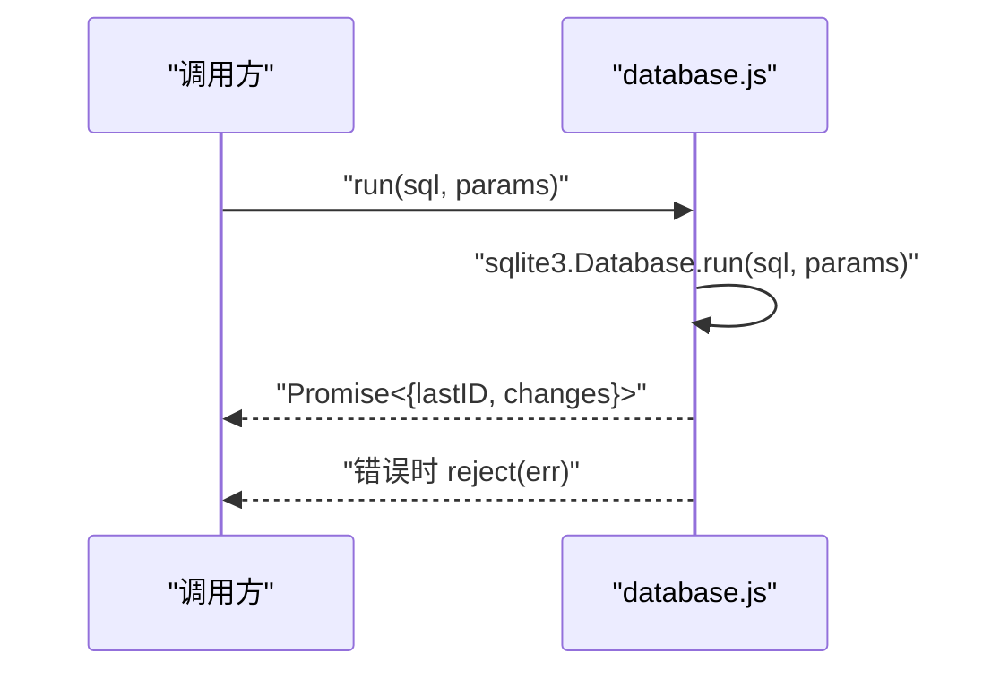
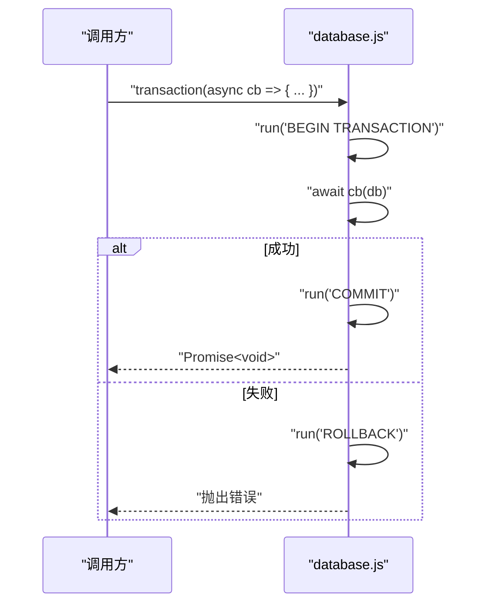
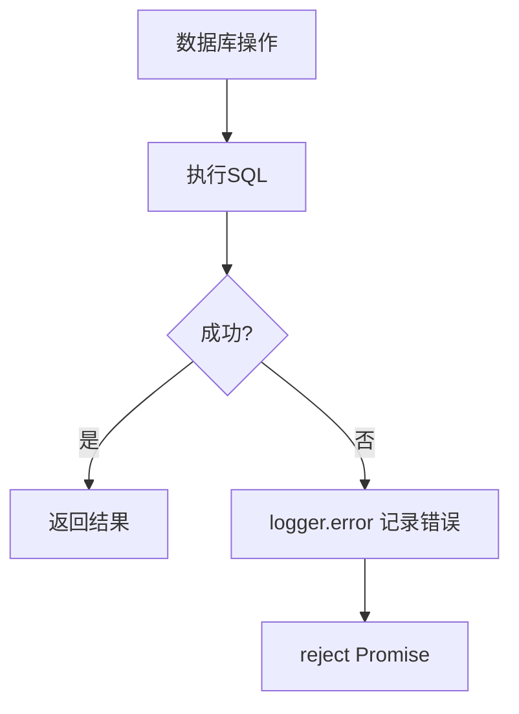
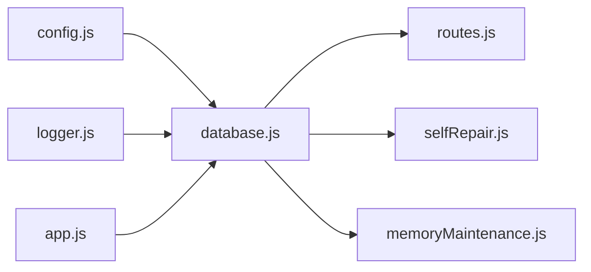

# 数据库操作方法

<cite>
**本文引用的文件**
- [database.js](file://backend/src/core/database.js)
- [config.js](file://backend/src/core/config.js)
- [logger.js](file://backend/src/utils/logger.js)
- [routes.js](file://backend/src/core/routes.js)
- [app.js](file://backend/src/app.js)
- [selfRepair.js](file://backend/src/core/selfRepair.js)
- [memoryMaintenance.js](file://backend/src/memory/memoryMaintenance.js)
</cite>

## 目录
1. [简介](#简介)
2. [项目结构](#项目结构)
3. [核心组件](#核心组件)
4. [架构概览](#架构概览)
5. [详细组件分析](#详细组件分析)
6. [依赖分析](#依赖分析)
7. [性能考虑](#性能考虑)
8. [故障排查指南](#故障排查指南)
9. [结论](#结论)

## 简介
本文件面向数据库操作方法的API文档，聚焦于SQLite数据库管理模块，涵盖连接管理、连接池配置、连接状态检查与错误处理策略；详解三种核心操作方法：query（多行查询）、queryOne（单行查询）和run（执行操作）的实现原理与使用场景；解释事务处理机制（transaction）及最佳实践；分析SQL注入防护与参数化查询；提供错误处理策略与日志记录方案；并总结性能优化技巧（批量操作、连接复用、查询缓存策略）。

## 项目结构
数据库相关代码集中在后端核心模块中：
- 数据库管理：backend/src/core/database.js
- 配置中心：backend/src/core/config.js
- 日志系统：backend/src/utils/logger.js
- API路由：backend/src/core/routes.js
- 应用入口与生命周期：backend/src/app.js
- 实际使用示例：backend/src/core/selfRepair.js、backend/src/memory/memoryMaintenance.js

图表来源
- [database.js:1-850](file://backend/src/core/database.js#L1-L850)
- [config.js:1-398](file://backend/src/core/config.js#L1-L398)
- [logger.js:1-442](file://backend/src/utils/logger.js#L1-L442)
- [routes.js:1-1037](file://backend/src/core/routes.js#L1-L1037)
- [app.js:1-238](file://backend/src/app.js#L1-L238)
- [selfRepair.js:1-500](file://backend/src/core/selfRepair.js#L1-L500)
- [memoryMaintenance.js:1-400](file://backend/src/memory/memoryMaintenance.js#L1-L400)

章节来源
- [database.js:1-850](file://backend/src/core/database.js#L1-L850)
- [config.js:1-398](file://backend/src/core/config.js#L1-L398)
- [logger.js:1-442](file://backend/src/utils/logger.js#L1-L442)
- [routes.js:1-1037](file://backend/src/core/routes.js#L1-L1037)
- [app.js:1-238](file://backend/src/app.js#L1-L238)

## 核心组件
- 数据库连接管理
  - 单例连接实例：全局共享的sqlite3.Database实例，通过initialize创建，getDb获取。
  - 连接状态检查：getDb在未初始化时抛出错误。
  - 连接关闭：close方法负责关闭连接并清理引用。
- SQL语句定义与迁移
  - CREATE_TABLES_SQL：集中定义所有表结构与索引。
  - runMigrations：根据表结构变化执行迁移（如重建user_preferences表以移除UNIQUE约束）。
- 三大操作方法
  - query(sql, params)：多行查询，基于sqlite3.Database.all。
  - queryOne(sql, params)：单行查询，基于sqlite3.Database.get。
  - run(sql, params)：执行非查询语句（INSERT/UPDATE/DELETE/DDL），基于sqlite3.Database.run。
- 事务处理
  - transaction(callback)：封装BEGIN/COMMIT/ROLLBACK，保证原子性。
- 会话与消息持久化
  - createSession/getSession/getUserSessions/touchSession/updateSessionTitle/deleteSession/addMessage/getSessionMessages等。
- 长期记忆（用户偏好）
  - addUserPreference/getUserPreferences/updatePreferenceUsage/getTopQueryPatterns/getFieldAliases/findExistingPreference/deleteUserPreference/getRecentPatternCount等。

章节来源
- [database.js:34-849](file://backend/src/core/database.js#L34-L849)

## 架构概览
数据库模块采用“单例连接 + 参数化查询 + 显式事务”的设计，配合配置中心与日志系统，形成清晰的职责边界与错误处理链路。

图表来源
- [routes.js:266-398](file://backend/src/core/routes.js#L266-L398)
- [database.js:361-445](file://backend/src/core/database.js#L361-L445)
- [logger.js:263-309](file://backend/src/utils/logger.js#L263-L309)

## 详细组件分析

### 数据库连接管理与初始化
- 初始化流程
  - initialize：解析配置路径、创建sqlite3.Database连接、启用外键约束、执行CREATE_TABLES_SQL、执行runMigrations、resolve。
  - runMigrations：检测并修复旧表结构（如user_preferences的UNIQUE约束），通过事务包裹重建过程。
- 连接状态检查
  - getDb：若db为null则抛出“尚未初始化”错误，确保调用方显式初始化。
- 连接关闭
  - close：关闭连接并重置db引用，返回Promise。

图表来源
- [database.js:200-261](file://backend/src/core/database.js#L200-L261)
- [database.js:271-336](file://backend/src/core/database.js#L271-L336)

章节来源
- [database.js:200-336](file://backend/src/core/database.js#L200-L336)

### 三大操作方法详解

#### query（多行查询）
- 实现要点
  - 基于sqlite3.Database.all，返回所有匹配行。
  - 参数化查询：params数组按序替换SQL中的?占位符，防止SQL注入。
  - 错误处理：捕获err并记录日志，reject Promise。
- 使用场景
  - 获取列表、聚合统计、分页查询等。
- 性能提示
  - 合理使用LIMIT与索引；避免一次性返回过多行。

图表来源
- [database.js:361-380](file://backend/src/core/database.js#L361-L380)

章节来源
- [database.js:361-380](file://backend/src/core/database.js#L361-L380)

#### queryOne（单行查询）
- 实现要点
  - 基于sqlite3.Database.get，仅返回第一行。
  - 参数化查询，错误处理同query。
- 使用场景
  - 获取单条记录、存在性检查、聚合值（COUNT/SUM等）。
- 性能提示
  - 与索引配合，避免全表扫描。

图表来源
- [database.js:388-400](file://backend/src/core/database.js#L388-L400)

章节来源
- [database.js:388-400](file://backend/src/core/database.js#L388-L400)

#### run（执行操作）
- 实现要点
  - 基于sqlite3.Database.run，适用于INSERT/UPDATE/DELETE/DDL。
  - 返回lastID（最后插入ID）与changes（受影响行数）。
  - 错误处理：记录日志并reject。
- 使用场景
  - 写入、更新、删除、DDL变更。
- 性能提示
  - 批量写入时结合事务减少磁盘刷写次数。

图表来源
- [database.js:408-424](file://backend/src/core/database.js#L408-L424)

章节来源
- [database.js:408-424](file://backend/src/core/database.js#L408-L424)

### 事务处理机制（transaction）
- 设计思想
  - 显式BEGIN/COMMIT/ROLLBACK，确保一组操作要么全部成功，要么全部失败。
  - 通过回调函数注入数据库操作，便于单元测试与复用。
- 使用最佳实践
  - 将相关联的写操作放入同一事务，避免部分提交。
  - 对可能失败的操作包裹try/catch，确保异常时回滚。
  - 事务内避免长时间阻塞操作（如网络请求）。
- 示例场景
  - 删除会话：先删除消息，再删除会话，使用transaction保证一致性。

图表来源
- [database.js:431-445](file://backend/src/core/database.js#L431-L445)
- [database.js:524-532](file://backend/src/core/database.js#L524-L532)

章节来源
- [database.js:431-445](file://backend/src/core/database.js#L431-L445)
- [database.js:524-532](file://backend/src/core/database.js#L524-L532)

### SQL注入防护与参数化查询
- 防护策略
  - 所有外部输入均通过params数组传递，使用?占位符绑定。
  - 未对SQL字符串进行拼接，避免直接拼接用户输入。
- 配合安全配置
  - config.security.forbiddenKeywords：禁止的关键字列表（如UPDATE/DELETE/DROP等），可在上层拦截危险SQL。
  - config.security.allowedTables：白名单机制（尽管当前数据库模块未直接使用），建议在路由层结合白名单进行访问控制。
- 建议
  - 对DDL/写操作严格限制来源与权限。
  - 对复杂查询使用视图或存储过程（如需）以进一步隔离风险。

章节来源
- [config.js:158-170](file://backend/src/core/config.js#L158-L170)
- [database.js:361-424](file://backend/src/core/database.js#L361-L424)

### 错误处理策略与日志记录
- 错误处理
  - 所有数据库操作均返回Promise，失败时reject并记录日志。
  - initialize/runMigrations在关键阶段失败时向上抛出，由调用方处理。
- 日志记录
  - 使用logger模块记录错误、调试与追踪信息。
  - query/queryOne/run在失败时记录sql与params，便于定位问题。
  - close在失败时记录错误。
- 生命周期日志
  - app.js在启动/关闭时记录关键事件，便于运维观测。

图表来源
- [database.js:369-422](file://backend/src/core/database.js#L369-L422)
- [logger.js:299-309](file://backend/src/utils/logger.js#L299-L309)
- [app.js:100-165](file://backend/src/app.js#L100-L165)

章节来源
- [database.js:361-424](file://backend/src/core/database.js#L361-L424)
- [logger.js:299-309](file://backend/src/utils/logger.js#L299-L309)
- [app.js:100-165](file://backend/src/app.js#L100-L165)

### 实际使用示例
- 路由层使用
  - routes.js中多处调用database.query/queryOne/run，如查询历史、获取用户会话、偏好统计等。
- 自修复模块
  - selfRepair.js使用database.queryOne进行健康检查与统计查询。
- 长期记忆维护
  - memoryMaintenance.js大量使用database.query/run/transaction进行偏好统计与清理。

章节来源
- [routes.js:413-450](file://backend/src/core/routes.js#L413-L450)
- [routes.js:869-870](file://backend/src/core/routes.js#L869-L870)
- [selfRepair.js:190-217](file://backend/src/core/selfRepair.js#L190-L217)
- [memoryMaintenance.js:90-175](file://backend/src/memory/memoryMaintenance.js#L90-L175)

## 依赖分析
- 模块耦合
  - database.js依赖config.js（路径）、logger.js（日志）。
  - routes.js依赖database.js进行数据持久化。
  - app.js在启动/关闭时依赖database.js。
  - selfRepair.js与memoryMaintenance.js作为业务模块依赖database.js。
- 外部依赖
  - sqlite3（Node.js官方驱动，verbose模式便于调试）。
  - path（路径解析）。
- 潜在循环依赖
  - 未发现循环依赖；database.js为底层模块，其余模块均向上依赖它。

图表来源
- [database.js:12-19](file://backend/src/core/database.js#L12-L19)
- [routes.js:20-29](file://backend/src/core/routes.js#L20-L29)
- [app.js:40-44](file://backend/src/app.js#L40-L44)

章节来源
- [database.js:12-19](file://backend/src/core/database.js#L12-L19)
- [routes.js:20-29](file://backend/src/core/routes.js#L20-L29)
- [app.js:40-44](file://backend/src/app.js#L40-L44)

## 性能考虑
- 连接管理
  - 单例连接：避免频繁创建/销毁连接带来的开销。
  - 连接复用：在同一进程生命周期内复用同一连接实例。
- 索引与查询
  - CREATE_TABLES_SQL中为高频查询字段建立索引（如sessions.user_id/status/updated_at，messages.session_id/created_at等）。
  - 建议：对WHERE/LIMIT/OFFSET常用的列建立合适索引，避免全表扫描。
- 事务与批量
  - 对批量写入使用transaction合并多次run，减少磁盘刷写次数。
  - 避免在事务中执行耗时操作（如网络请求）。
- 参数化查询
  - 通过?占位符绑定参数，提升查询计划复用率与安全性。
- 查询限制
  - 配置中心提供maxQueryRows与queryTimeout，可在上层路由层结合使用，防止大查询导致内存与响应问题。
- 日志与追踪
  - 使用logger.trace/traceStep进行流程追踪，便于定位慢查询与异常路径。

章节来源
- [database.js:39-189](file://backend/src/core/database.js#L39-L189)
- [config.js:150-157](file://backend/src/core/config.js#L150-L157)
- [logger.js:322-408](file://backend/src/utils/logger.js#L322-L408)

## 故障排查指南
- 初始化失败
  - 现象：initialize报错或runMigrations失败。
  - 排查：检查DB_PATH配置、文件权限、磁盘空间；查看日志中的错误堆栈。
- 连接未初始化
  - 现象：getDb抛出“尚未初始化”错误。
  - 排查：确认在调用数据库方法前已执行initialize。
- 查询异常
  - 现象：query/queryOne/reject并记录错误。
  - 排查：核对SQL语法、参数数量与类型；检查索引是否存在；查看日志中的sql与params。
- 事务回滚
  - 现象：transaction中任一步失败导致ROLLBACK。
  - 排查：在回调中增加try/catch，记录每步状态；确认事务边界合理。
- 关闭失败
  - 现象：close失败并记录错误。
  - 排查：确认无未完成的查询；检查进程是否仍在使用连接。

章节来源
- [database.js:217-223](file://backend/src/core/database.js#L217-L223)
- [database.js:369-422](file://backend/src/core/database.js#L369-L422)
- [database.js:801-811](file://backend/src/core/database.js#L801-L811)
- [app.js:176-212](file://backend/src/app.js#L176-L212)

## 结论
本数据库模块以“单例连接 + 参数化查询 + 显式事务”为核心设计，配合完善的日志与错误处理，提供了稳定可靠的SQLite数据持久化能力。通过合理的索引设计、事务批处理与查询限制，能够在保证安全性的前提下获得良好的性能表现。建议在生产环境中：
- 明确白名单与权限控制；
- 对关键路径增加日志与追踪；
- 合理设置查询限制与超时；
- 使用事务合并批量写入；
- 定期检查与优化索引。