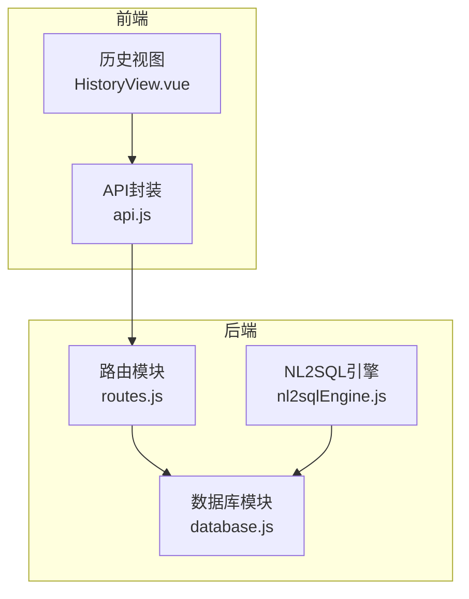
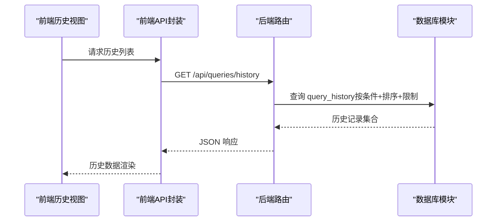
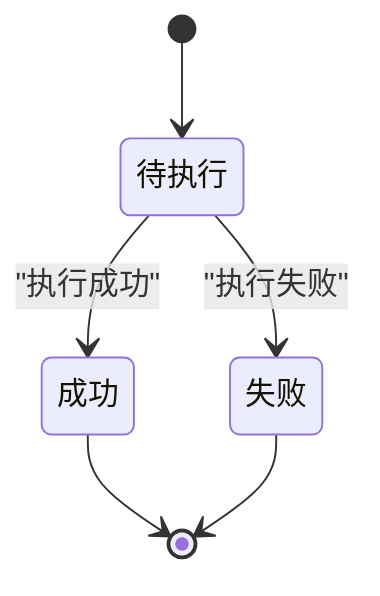
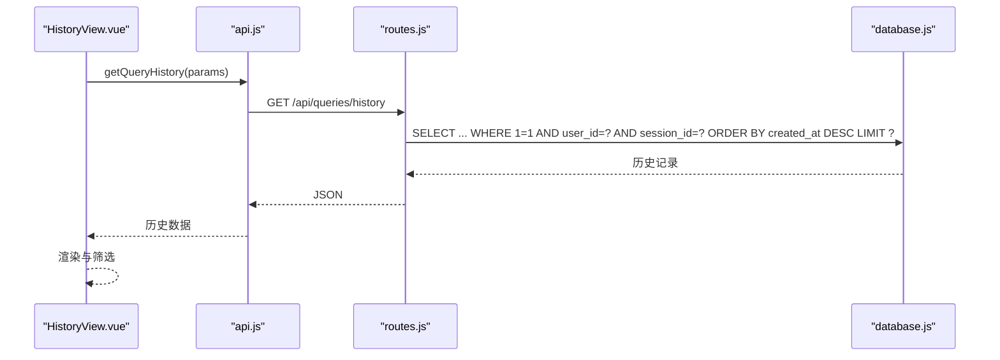
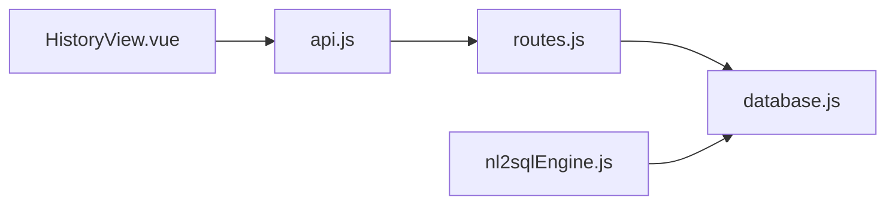

# 查询历史表

<cite>
**本文引用的文件**
- [database.js](file://backend/src/core/database.js)
- [routes.js](file://backend/src/core/routes.js)
- [nl2sqlEngine.js](file://backend/src/core/nl2sqlEngine.js)
- [HistoryView.vue](file://frontend/src/views/HistoryView.vue)
- [api.js](file://frontend/src/utils/api.js)
</cite>

## 目录
1. [简介](#简介)
2. [项目结构](#项目结构)
3. [核心组件](#核心组件)
4. [架构总览](#架构总览)
5. [详细组件分析](#详细组件分析)
6. [依赖分析](#依赖分析)
7. [性能考虑](#性能考虑)
8. [故障排查指南](#故障排查指南)
9. [结论](#结论)
10. [附录](#附录)

## 简介
本设计文档围绕查询历史表（query_history）进行系统性说明，涵盖字段结构、状态流转与错误处理机制、JSON结果存储的设计考量、索引策略对性能的影响，以及查询优化与数据清理建议。目标是帮助开发者与运维人员准确理解该表的用途、行为与最佳实践。

## 项目结构
查询历史表位于后端数据库层，通过统一的数据库初始化脚本创建，并由路由层提供查询接口，前端页面通过API调用展示历史记录。

图表来源
- [database.js:94-134](file://backend/src/core/database.js#L94-L134)
- [routes.js:404-450](file://backend/src/core/routes.js#L404-L450)
- [nl2sqlEngine.js:1749-1817](file://backend/src/core/nl2sqlEngine.js#L1749-L1817)
- [HistoryView.vue:226-243](file://frontend/src/views/HistoryView.vue#L226-L243)
- [api.js:206-209](file://frontend/src/utils/api.js#L206-L209)

章节来源
- [database.js:94-134](file://backend/src/core/database.js#L94-L134)
- [routes.js:404-450](file://backend/src/core/routes.js#L404-L450)
- [nl2sqlEngine.js:1749-1817](file://backend/src/core/nl2sqlEngine.js#L1749-L1817)
- [HistoryView.vue:226-243](file://frontend/src/views/HistoryView.vue#L226-L243)
- [api.js:206-209](file://frontend/src/utils/api.js#L206-L209)

## 核心组件
- 查询历史表（query_history）：持久化用户查询记录，包含原始自然语言查询、生成的SQL、执行状态、结果、错误信息、耗时、行数、时间戳等。
- 数据库初始化与索引：统一创建表与索引，确保查询性能与一致性。
- 路由接口：提供按用户、会话、时间范围等条件筛选的历史查询接口。
- NL2SQL引擎：负责执行SQL并填充查询历史表的执行结果与状态。
- 前端历史视图：展示历史记录并支持筛选与分页。

章节来源
- [database.js:94-134](file://backend/src/core/database.js#L94-L134)
- [routes.js:404-450](file://backend/src/core/routes.js#L404-L450)
- [nl2sqlEngine.js:1749-1817](file://backend/src/core/nl2sqlEngine.js#L1749-L1817)
- [HistoryView.vue:226-243](file://frontend/src/views/HistoryView.vue#L226-L243)

## 架构总览
查询历史表在系统中的位置与交互如下：

图表来源
- [routes.js:404-450](file://backend/src/core/routes.js#L404-L450)
- [database.js:94-134](file://backend/src/core/database.js#L94-L134)
- [HistoryView.vue:226-243](file://frontend/src/views/HistoryView.vue#L226-L243)
- [api.js:206-209](file://frontend/src/utils/api.js#L206-L209)

## 详细组件分析

### 字段结构与设计说明
- id：自增主键，唯一标识每条查询记录。
- session_id：会话外键，指向 sessions 表；当会话被删除时，此字段设为 NULL（SET NULL），保证查询历史不被级联删除。
- user_id：用户标识，用于按用户检索历史。
- natural_query：用户输入的自然语言查询文本。
- generated_sql：由系统生成的SQL语句（可为空，例如在某些验证阶段）。
- status：执行状态，枚举值 pending、success、failed；默认 pending。
- result：执行结果的JSON字符串，便于存储任意结构的结果集。
- error_message：失败时的错误信息。
- execution_time：执行耗时（毫秒）。
- row_count：返回行数。
- created_at：记录创建时间（默认 CURRENT_TIMESTAMP）。
- executed_at：实际执行时间（可为空，表示尚未执行）。

字段来源与约束
- 表结构与索引定义见数据库初始化脚本。
- 外键约束与索引策略见下节“索引策略”。

章节来源
- [database.js:94-134](file://backend/src/core/database.js#L94-L134)

### 查询状态流转与错误处理机制
- 流程概览：NL2SQL引擎在执行SQL前后维护状态与结果，最终将结果写入 query_history。
- 状态机：
  - pending：初始状态，表示已生成SQL但尚未执行。
  - success：执行成功，写入 result、execution_time、row_count、executed_at。
  - failed：执行失败，写入 error_message、execution_time、executed_at。
- 错误处理：
  - 执行阶段捕获异常并返回失败状态与错误信息。
  - 路由层对查询历史接口的异常进行统一处理并返回错误码。

图表来源
- [nl2sqlEngine.js:1749-1817](file://backend/src/core/nl2sqlEngine.js#L1749-L1817)
- [database.js:94-134](file://backend/src/core/database.js#L94-L134)

章节来源
- [nl2sqlEngine.js:1749-1817](file://backend/src/core/nl2sqlEngine.js#L1749-L1817)
- [routes.js:404-450](file://backend/src/core/routes.js#L404-L450)

### JSON格式结果存储的设计考量
- result 字段以 JSON 字符串形式存储，便于：
  - 保持结果结构的完整性与可扩展性；
  - 支持不同查询类型的多样化输出；
  - 与前端展示解耦，避免强绑定特定格式。
- 建议：
  - 规范 result 的结构，包含 columns、rows、rowCount 等关键字段；
  - 对于大结果集，考虑分页或采样策略，避免单条记录过大。

章节来源
- [database.js:94-134](file://backend/src/core/database.js#L94-L134)
- [nl2sqlEngine.js:1831-1862](file://backend/src/core/nl2sqlEngine.js#L1831-L1862)

### 索引策略与性能优化
- idx_query_history_user_id：加速按用户筛选历史。
- idx_query_history_session_id：加速按会话筛选历史。
- idx_query_history_created_at：加速按时间排序与分页。
- idx_query_history_status：加速按状态筛选（如仅查询成功/失败）。
- 性能影响：
  - 上述索引覆盖了常见查询模式（用户、会话、时间、状态），可显著降低全表扫描概率。
  - 对于高频的“最近N条”查询，created_at 索引尤为重要。

章节来源
- [database.js:127-134](file://backend/src/core/database.js#L127-L134)

### 查询历史接口与前端集成
- 接口定义：GET /api/queries/history，支持 user_id、session_id、limit 参数。
- 前端调用：HistoryView.vue 通过 api.getQueryHistory 发起请求，渲染历史列表。
- 前端筛选：支持按状态与日期范围筛选，提升用户体验。

图表来源
- [routes.js:404-450](file://backend/src/core/routes.js#L404-L450)
- [api.js:206-209](file://frontend/src/utils/api.js#L206-L209)
- [HistoryView.vue:226-243](file://frontend/src/views/HistoryView.vue#L226-L243)

章节来源
- [routes.js:404-450](file://backend/src/core/routes.js#L404-L450)
- [api.js:206-209](file://frontend/src/utils/api.js#L206-L209)
- [HistoryView.vue:226-243](file://frontend/src/views/HistoryView.vue#L226-L243)

## 依赖分析
- 数据库模块负责表结构与索引的创建与维护。
- 路由模块提供查询历史的HTTP接口。
- NL2SQL引擎在执行SQL后更新查询历史的状态与结果。
- 前端通过API封装与路由交互，展示历史数据。

图表来源
- [routes.js:404-450](file://backend/src/core/routes.js#L404-L450)
- [database.js:94-134](file://backend/src/core/database.js#L94-L134)
- [nl2sqlEngine.js:1749-1817](file://backend/src/core/nl2sqlEngine.js#L1749-L1817)
- [HistoryView.vue:226-243](file://frontend/src/views/HistoryView.vue#L226-L243)
- [api.js:206-209](file://frontend/src/utils/api.js#L206-L209)

章节来源
- [routes.js:404-450](file://backend/src/core/routes.js#L404-L450)
- [database.js:94-134](file://backend/src/core/database.js#L94-L134)
- [nl2sqlEngine.js:1749-1817](file://backend/src/core/nl2sqlEngine.js#L1749-L1817)
- [HistoryView.vue:226-243](file://frontend/src/views/HistoryView.vue#L226-L243)
- [api.js:206-209](file://frontend/src/utils/api.js#L206-L209)

## 性能考虑
- 索引命中：确保查询条件（user_id、session_id、status、created_at）充分利用现有索引。
- 分页与限制：接口默认限制返回数量，避免一次性拉取过多数据。
- 大结果集：result 字段为JSON字符串，建议对超大数据集采取分页或采样策略。
- 外键行为：session_id 外键采用 SET NULL，避免历史数据随会话删除而丢失，但需注意空值查询的成本。

章节来源
- [database.js:127-134](file://backend/src/core/database.js#L127-L134)
- [routes.js:404-450](file://backend/src/core/routes.js#L404-L450)

## 故障排查指南
- 接口报错：检查路由层异常处理与日志输出，定位数据库查询失败原因。
- 结果为空：确认筛选条件（user_id、session_id、limit）是否正确，以及 created_at 索引是否生效。
- 执行耗时异常：核对 execution_time 与 row_count 是否合理，必要时调整查询逻辑或增加索引。
- JSON解析问题：前端展示时注意 result 字段的JSON解析与空值处理。

章节来源
- [routes.js:404-450](file://backend/src/core/routes.js#L404-L450)
- [HistoryView.vue:226-243](file://frontend/src/views/HistoryView.vue#L226-L243)

## 结论
查询历史表通过清晰的字段设计、完善的索引策略与标准化的接口，有效支撑了用户查询记录的存储与检索。配合NL2SQL引擎的状态机与错误处理机制，能够稳定地记录每次查询的完整生命周期。建议在生产环境中持续监控查询性能与数据规模，适时调整索引与清理策略，保障系统的长期可用性与高性能。

## 附录
- 字段清单与含义参考数据库初始化脚本中的表定义。
- 接口参数与返回结构参考路由模块与前端API封装。

章节来源
- [database.js:94-134](file://backend/src/core/database.js#L94-L134)
- [routes.js:404-450](file://backend/src/core/routes.js#L404-L450)
- [api.js:206-209](file://frontend/src/utils/api.js#L206-L209)