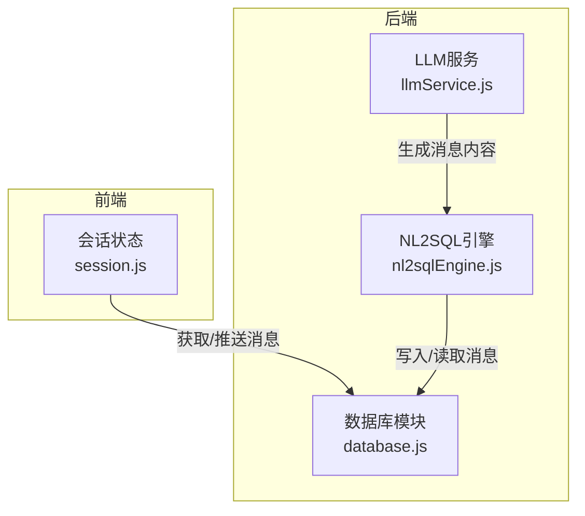
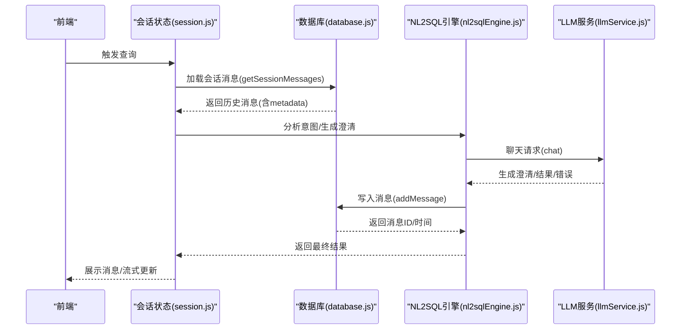
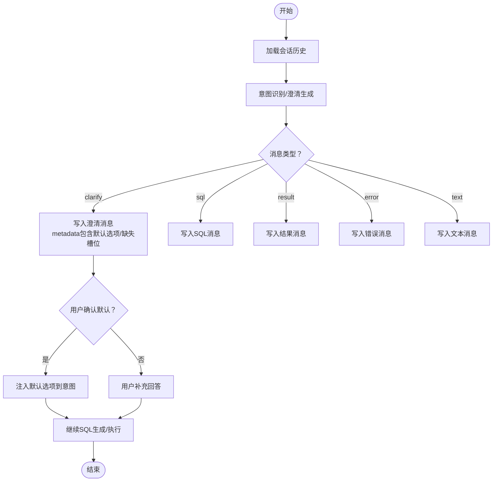
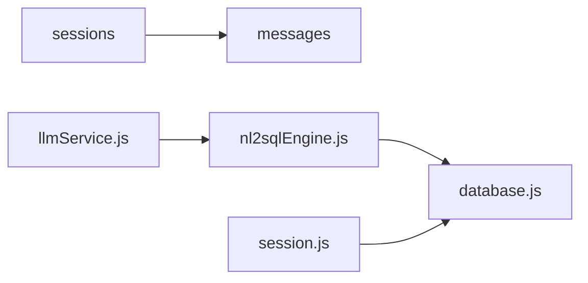

# 消息历史表

<cite>
**本文引用的文件**
- [database.js](file://backend/src/core/database.js)
- [nl2sqlEngine.js](file://backend/src/core/nl2sqlEngine.js)
- [llmService.js](file://backend/src/core/llmService.js)
- [session.js](file://frontend/src/stores/session.js)
</cite>

## 目录
1. [简介](#简介)
2. [项目结构](#项目结构)
3. [核心组件](#核心组件)
4. [架构总览](#架构总览)
5. [详细组件分析](#详细组件分析)
6. [依赖分析](#依赖分析)
7. [性能考虑](#性能考虑)
8. [故障排查指南](#故障排查指南)
9. [结论](#结论)
10. [附录](#附录)

## 简介
本设计文档围绕消息历史表（messages）展开，系统性阐述其字段结构、业务语义、外键约束与级联删除机制、索引策略、以及在 NL2SQL 流程中的作用。同时提供消息序列化与反序列化的最佳实践，涵盖 JSON 元数据的设计与使用场景，帮助开发者在前后端协同开发中实现稳定、可扩展且高性能的消息存储与查询。

## 项目结构
消息历史表位于后端核心数据库模块中，与会话表（sessions）形成一对多关系。前端通过会话状态管理模块与后端 API 交互，实现消息的加载与流式展示。

图表来源
- [database.js](file://backend/src/core/database.js)
- [nl2sqlEngine.js](file://backend/src/core/nl2sqlEngine.js)
- [llmService.js](file://backend/src/core/llmService.js)
- [session.js](file://frontend/src/stores/session.js)

章节来源
- [database.js](file://backend/src/core/database.js)
- [session.js](file://frontend/src/stores/session.js)

## 核心组件
- 消息历史表（messages）：持久化会话中的消息，支持多种角色与类型，并通过 JSON 元数据承载结构化上下文。
- 会话表（sessions）：承载用户会话的基本信息，messages 通过外键关联。
- NL2SQL 引擎：负责消息的生成、澄清、意图识别与 SQL 执行，贯穿消息的角色与类型流转。
- LLM 服务：提供聊天与嵌入能力，支撑消息内容生成与流式输出。
- 前端会话状态：负责消息的加载、展示与 SSE 连接，驱动实时交互体验。

章节来源
- [database.js](file://backend/src/core/database.js)
- [nl2sqlEngine.js](file://backend/src/core/nl2sqlEngine.js)
- [llmService.js](file://backend/src/core/llmService.js)
- [session.js](file://frontend/src/stores/session.js)

## 架构总览
消息在 NL2SQL 流程中的典型生命周期：
- 用户输入触发意图识别与澄清流程；
- 引擎根据上下文生成“澄清”消息（type=clarify），携带默认选项与缺失槽位；
- 用户确认后，引擎将默认选项注入意图，继续生成 SQL；
- SQL 执行结果以“结果”消息（type=result）返回；
- 错误场景下生成“错误”消息（type=error）；
- 所有消息以统一结构写入 messages 表，按 created_at 顺序呈现。

图表来源
- [database.js](file://backend/src/core/database.js)
- [nl2sqlEngine.js](file://backend/src/core/nl2sqlEngine.js)
- [llmService.js](file://backend/src/core/llmService.js)
- [session.js](file://frontend/src/stores/session.js)

## 详细组件分析

### 消息历史表（messages）字段与语义
- id：自增主键，唯一标识每条消息。
- session_id：外键，指向 sessions.id，表示消息所属会话。
- role：消息角色，取值包括 user、assistant、system、tool，分别对应用户输入、系统/助手回复、系统提示、工具调用。
- content：消息内容，文本形式承载用户输入或 LLM 输出。
- type：消息类型，取值包括 text、sql、result、error、clarify，用于区分消息用途与后续处理逻辑。
- metadata：JSON 字符串，承载结构化上下文，如澄清消息中的默认选项、缺失槽位、SQL 生成元信息等。
- created_at：消息创建时间，用于排序与审计。

业务含义与在 NL2SQL 中的作用：
- role=user：用户输入，触发意图识别与澄清。
- role=assistant：系统/助手回复，包含澄清问题、SQL 生成、结果或错误。
- role=system/tool：系统提示或工具调用，辅助上下文与能力扩展。
- type=text：通用文本消息，用于说明或引导。
- type=sql：包含生成的 SQL 文本，便于审计与复现。
- type=result：SQL 执行结果，前端可渲染为表格或摘要。
- type=error：错误消息，包含错误类型与细节，便于诊断。
- type=clarify：澄清消息，metadata 中通常包含 defaultOptions 与 missingSlots，驱动用户确认流程。

外键约束与级联删除：
- messages.session_id 引用 sessions.id；
- ON DELETE CASCADE：当会话被删除时，其下的所有消息将被自动清理，确保数据一致性与简化维护成本。

索引策略与查询优化：
- idx_messages_session_id：加速按会话查询消息，提升历史加载性能。
- idx_messages_created_at：加速按时间排序与分页查询，满足“按时间升序”的展示需求。

章节来源
- [database.js](file://backend/src/core/database.js)

### 消息序列化与反序列化最佳实践
- 写入时：将 metadata 对象序列化为 JSON 字符串，避免二进制或复杂类型导致的存储问题。
- 读取时：将 JSON 字符串解析为对象，便于前端与引擎侧直接消费。
- 元数据结构建议：
  - 澄清消息（type=clarify）：defaultOptions（默认选项列表）、missingSlots（缺失槽位）、question（问题文本）。
  - SQL 消息（type=sql）：sqlText（SQL 文本）、params（参数占位）、schema（涉及的表/字段）。
  - 结果消息（type=result）：columns（列名）、rows（行数据）、summary（摘要）、executionTime（执行耗时）。
  - 错误消息（type=error）：errorType（错误类型）、errorMessage（错误信息）、details（详细信息）。
- 兼容性：若历史数据采用非结构化文本存储默认选项，可在解析时提供回退逻辑，逐步迁移至结构化存储。

章节来源
- [database.js](file://backend/src/core/database.js)
- [nl2sqlEngine.js](file://backend/src/core/nl2sqlEngine.js)

### 消息在 NL2SQL 流程中的处理
- 意图识别与澄清：引擎基于历史消息与用户偏好，生成澄清问题（type=clarify），metadata 中包含默认选项与缺失槽位。
- 用户确认：前端识别“确认默认”语义，提取 metadata 中的默认选项，注入到当前意图，继续生成 SQL。
- SQL 生成与执行：生成 SQL（type=sql），执行后返回结果（type=result）或错误（type=error）。
- 历史展示：按 created_at 升序排列，role/type 用于前端样式与交互。

图表来源
- [nl2sqlEngine.js](file://backend/src/core/nl2sqlEngine.js)
- [database.js](file://backend/src/core/database.js)

章节来源
- [nl2sqlEngine.js](file://backend/src/core/nl2sqlEngine.js)
- [database.js](file://backend/src/core/database.js)

### 前后端交互与消息展示
- 前端通过会话状态模块加载消息历史，支持 SSE 流式接收实时消息。
- 前端根据 role/type 决定渲染方式与交互行为，如澄清消息的默认选项按钮、错误消息的错误面板等。

章节来源
- [session.js](file://frontend/src/stores/session.js)

## 依赖分析
- messages 依赖 sessions（外键约束）；
- NL2SQL 引擎依赖数据库模块进行消息读写；
- LLM 服务为消息内容生成提供能力；
- 前端会话状态依赖后端 API 获取与推送消息。

图表来源
- [database.js](file://backend/src/core/database.js)
- [nl2sqlEngine.js](file://backend/src/core/nl2sqlEngine.js)
- [llmService.js](file://backend/src/core/llmService.js)
- [session.js](file://frontend/src/stores/session.js)

章节来源
- [database.js](file://backend/src/core/database.js)
- [nl2sqlEngine.js](file://backend/src/core/nl2sqlEngine.js)
- [llmService.js](file://backend/src/core/llmService.js)
- [session.js](file://frontend/src/stores/session.js)

## 性能考虑
- 查询路径优化：
  - 按会话查询：利用 idx_messages_session_id，避免全表扫描。
  - 时间排序与分页：利用 idx_messages_created_at，减少排序开销。
- 写入路径优化：
  - metadata 采用 JSON 字符串，避免复杂类型带来的序列化成本。
  - 写入后更新会话时间，便于前端刷新与后台维护。
- 前端渲染优化：
  - 仅加载最近 N 条消息，避免一次性渲染大量 DOM。
  - SSE 流式推送，降低首屏等待时间。

## 故障排查指南
- 外键约束错误：当 session_id 不存在时，插入消息会失败。请确保会话已创建后再写入消息。
- JSON 元数据解析失败：检查 metadata 的 JSON 格式，确保可被 JSON.parse 正确解析。
- 澄清消息默认选项缺失：确认 metadata 中 defaultOptions 与 missingSlots 字段是否存在，必要时提供回退解析逻辑。
- 查询性能问题：确认是否使用了 session_id 与 created_at 索引，避免在未索引列上进行过滤或排序。

章节来源
- [database.js](file://backend/src/core/database.js)
- [nl2sqlEngine.js](file://backend/src/core/nl2sqlEngine.js)

## 结论
消息历史表（messages）是 NL2SQL 流程中的关键数据载体，通过明确的角色与类型划分、结构化的元数据设计以及完善的外键与索引策略，实现了高一致性、可扩展与高性能的消息管理。配合前端的流式展示与上下文感知，能够为用户提供流畅、可解释的自然语言到 SQL 的交互体验。

## 附录
- 字段清单与约束
  - id：INTEGER PRIMARY KEY AUTOINCREMENT
  - session_id：TEXT NOT NULL，REFERENCES sessions(id) ON DELETE CASCADE
  - role：TEXT NOT NULL，取值 user、assistant、system、tool
  - content：TEXT NOT NULL
  - type：TEXT DEFAULT 'text'，取值 text、sql、result、error、clarify
  - metadata：TEXT（JSON 字符串）
  - created_at：DATETIME DEFAULT CURRENT_TIMESTAMP
  - 索引：idx_messages_session_id(session_id)、idx_messages_created_at(created_at)

章节来源
- [database.js](file://backend/src/core/database.js)