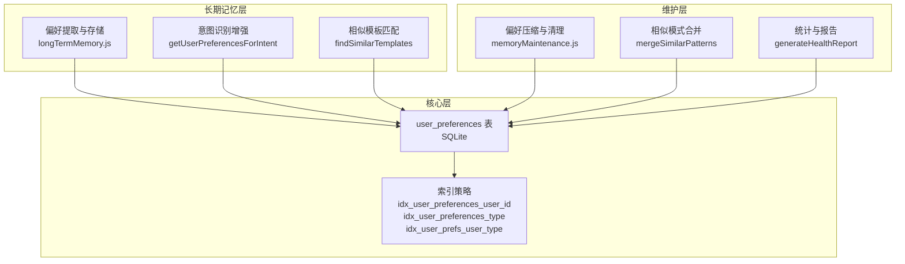
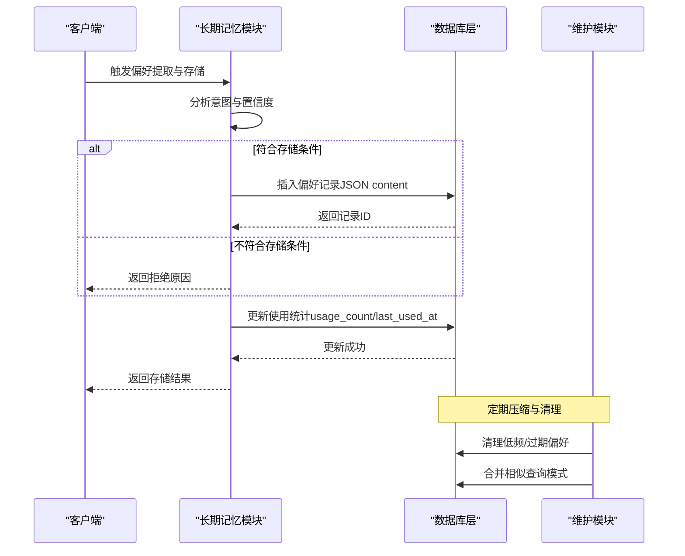
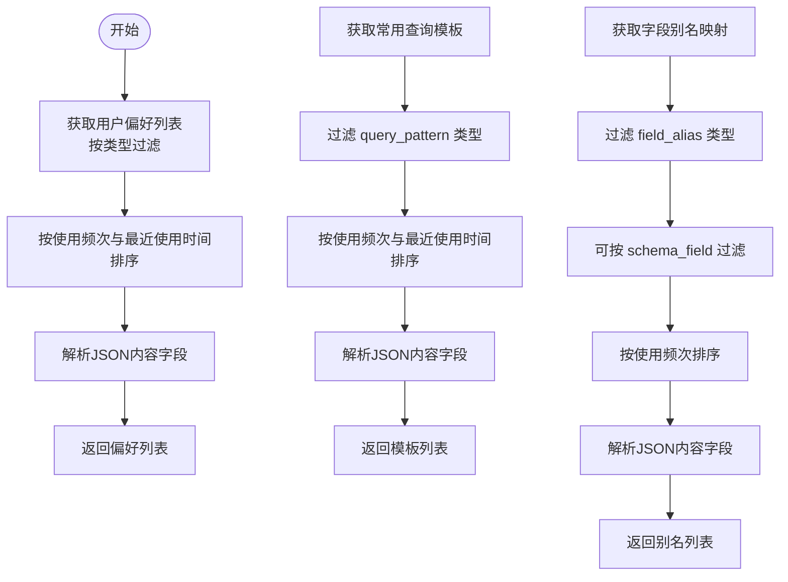
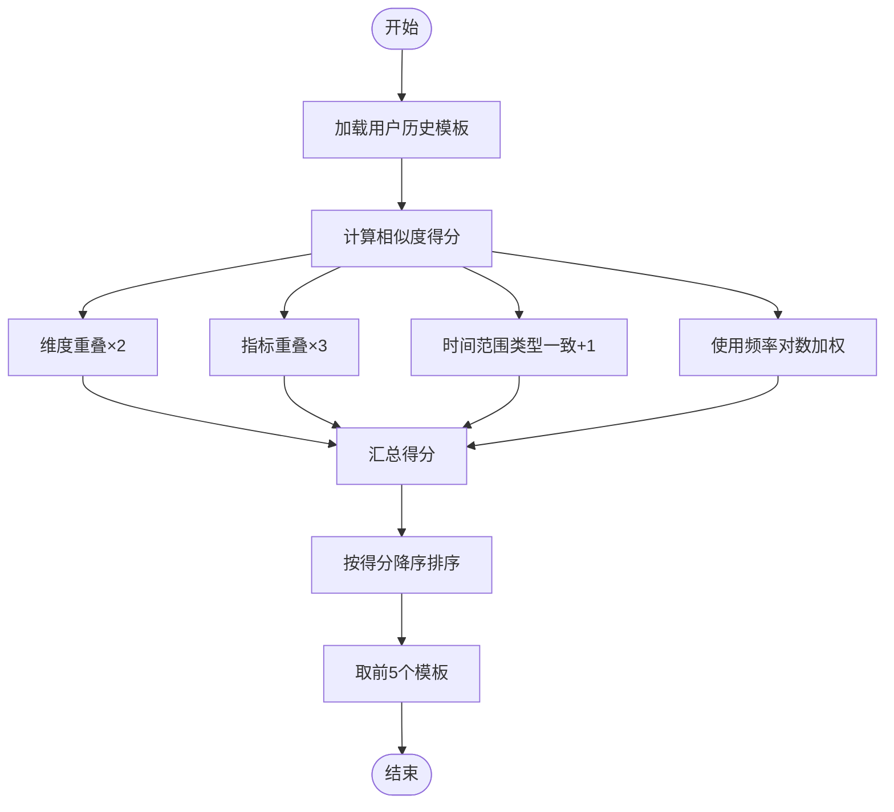
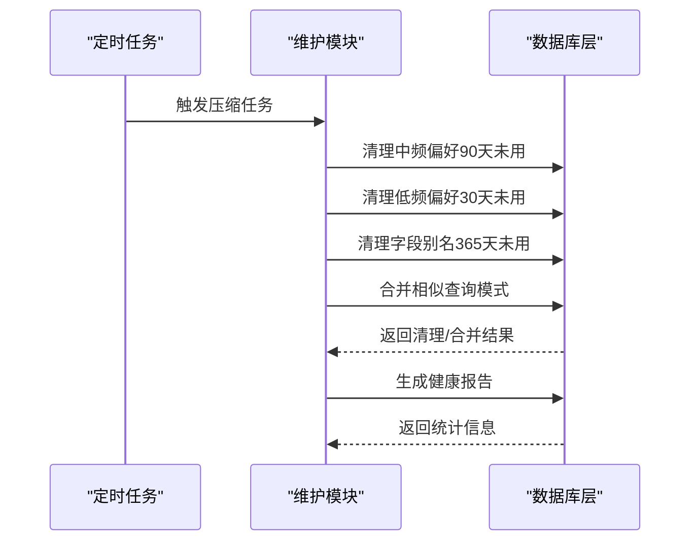
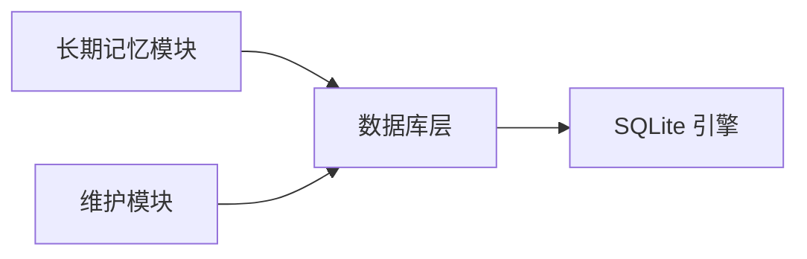

# 用户偏好表

<cite>
**本文档引用的文件**
- [database.js](file://backend/src/core/database.js)
- [longTermMemory.js](file://backend/src/memory/longTermMemory.js)
- [memoryMaintenance.js](file://backend/src/memory/memoryMaintenance.js)
</cite>

## 目录
1. [简介](#简介)
2. [项目结构](#项目结构)
3. [核心组件](#核心组件)
4. [架构概览](#架构概览)
5. [详细组件分析](#详细组件分析)
6. [依赖分析](#依赖分析)
7. [性能考虑](#性能考虑)
8. [故障排查指南](#故障排查指南)
9. [结论](#结论)

## 简介
本文件针对用户偏好表（user_preferences）进行系统化设计说明，涵盖表结构、字段语义、偏好类型、JSON内容结构、索引策略、数据验证规则以及偏好学习与推荐机制。该表用于存储用户的长期记忆与使用习惯，支撑查询意图识别、字段别名映射、查询模板复用、指标与维度偏好等场景。

## 项目结构
用户偏好能力由三层协作构成：
- 核心层：数据库表结构与基础操作（增删改查、索引）
- 长期记忆层：偏好提取、存储、检索与相似度计算
- 维护层：偏好压缩、清理、合并与统计

图表来源
- [database.js:142-165](file://backend/src/core/database.js#L142-L165)
- [longTermMemory.js:1-120](file://backend/src/memory/longTermMemory.js#L1-L120)
- [memoryMaintenance.js:1-120](file://backend/src/memory/memoryMaintenance.js#L1-L120)

章节来源
- [database.js:142-165](file://backend/src/core/database.js#L142-L165)
- [longTermMemory.js:1-120](file://backend/src/memory/longTermMemory.js#L1-L120)
- [memoryMaintenance.js:1-120](file://backend/src/memory/memoryMaintenance.js#L1-L120)

## 核心组件
- 表结构与字段
  - id：自增主键，唯一标识每条偏好记录
  - user_id：用户标识，支持同一用户多条偏好
  - preference_type：偏好类型，取值包括 field_alias、query_pattern、metric_preference、dimension_preference
  - content：JSON内容，承载不同类型的偏好数据
  - usage_count：使用次数，用于排序与推荐
  - last_used_at：最后使用时间，用于清理与排序
  - created_at：创建时间，默认当前时间
  - updated_at：更新时间，默认当前时间

- 索引策略
  - idx_user_preferences_user_id：加速按用户查询
  - idx_user_preferences_type：加速按类型查询
  - idx_user_prefs_user_type：复合索引，加速“用户+类型”联合查询

- 偏好类型与业务含义
  - field_alias：字段别名映射，记录用户术语与Schema字段的映射关系
  - query_pattern：查询模式模板，记录常用维度/指标组合与默认时间范围
  - metric_preference：指标偏好，记录用户常用的指标名称
  - dimension_preference：维度偏好，记录用户常用的维度名称

章节来源
- [database.js:142-165](file://backend/src/core/database.js#L142-L165)
- [database.js:609-751](file://backend/src/core/database.js#L609-L751)

## 架构概览
用户偏好在系统中的流转路径如下：

图表来源
- [longTermMemory.js:312-485](file://backend/src/memory/longTermMemory.js#L312-L485)
- [database.js:609-666](file://backend/src/core/database.js#L609-L666)
- [memoryMaintenance.js:69-189](file://backend/src/memory/memoryMaintenance.js#L69-L189)

## 详细组件分析

### 表结构与字段设计
- 主键与标识
  - id：自增主键，确保每条记录唯一
  - user_id：非唯一，允许同一用户拥有多个偏好记录
- 偏好类型与内容
  - preference_type：限定枚举值，便于索引与查询
  - content：JSON格式，承载不同类型的偏好数据结构
- 使用统计与时序
  - usage_count：递增统计，用于排序与推荐
  - last_used_at/updated_at：时间戳，用于清理与排序

章节来源
- [database.js:142-156](file://backend/src/core/database.js#L142-L156)

### 偏好类型与JSON内容结构
- field_alias（字段别名映射）
  - 关键字段：user_term（用户术语）、schema_field（Schema字段）、field_type（字段类型）、confidence（置信度）
  - 用途：将用户口语化表达映射到标准字段，提升意图识别准确度
- query_pattern（查询模式模板）
  - 关键字段：name（模板名称）、dimensions（维度列表）、metrics（指标列表）、default_time_range（默认时间范围）、filter_pattern（过滤模式）、sample_query（示例查询）、is_manual（是否手动创建）
  - 用途：复用常用查询结构，减少重复输入
- metric_preference（指标偏好）
  - 关键字段：field_name（指标名称）、last_query（最后查询）
  - 用途：记录用户常用指标，辅助缺省与补全
- dimension_preference（维度偏好）
  - 关键字段：field_name（维度名称）、last_query（最后查询）
  - 用途：记录用户常用维度，辅助缺省与补全

章节来源
- [longTermMemory.js:686-757](file://backend/src/memory/longTermMemory.js#L686-L757)
- [longTermMemory.js:772-826](file://backend/src/memory/longTermMemory.js#L772-L826)
- [longTermMemory.js:1082-1106](file://backend/src/memory/longTermMemory.js#L1082-L1106)

### 数据验证与一致性规则
- 存储前置条件
  - 查询必须成功（success=true）
  - 意图置信度需达到阈值（默认≥0.7）
  - 排除过于具体的单次查询（如绝对时间+具体筛选+简单查询）
- 冲突处理
  - 字段别名映射冲突时记录告警，避免覆盖
- 内容键匹配
  - 通过 json_extract(content, "$.name"/"$user_term") 判断是否已存在相同模板/别名

章节来源
- [longTermMemory.js:320-347](file://backend/src/memory/longTermMemory.js#L320-L347)
- [longTermMemory.js:790-804](file://backend/src/memory/longTermMemory.js#L790-L804)
- [database.js:724-751](file://backend/src/core/database.js#L724-L751)

### 查询与检索流程
- 获取用户偏好列表
  - 支持按类型过滤与数量限制
  - 按 usage_count 降序、last_used_at 降序排序
- 获取常用查询模板
  - 仅返回 query_pattern 类型，按使用频次与最近使用时间排序
- 获取字段别名映射
  - 支持按 schema_field 过滤，按使用频次排序
- 获取用户偏好汇总（意图识别增强）
  - 并行获取模板、别名、指标、维度偏好，输出聚合结构

图表来源
- [database.js:627-649](file://backend/src/core/database.js#L627-L649)
- [database.js:674-687](file://backend/src/core/database.js#L674-L687)
- [database.js:695-715](file://backend/src/core/database.js#L695-L715)
- [longTermMemory.js:977-1019](file://backend/src/memory/longTermMemory.js#L977-L1019)

章节来源
- [database.js:627-715](file://backend/src/core/database.js#L627-L715)
- [longTermMemory.js:977-1019](file://backend/src/memory/longTermMemory.js#L977-L1019)

### 索引策略与性能优化
- 单列索引
  - idx_user_preferences_user_id：加速按用户查询
  - idx_user_preferences_type：加速按类型查询
- 复合索引
  - idx_user_prefs_user_type：加速“用户+类型”联合查询，降低排序成本
- 查询优化点
  - 使用 json_extract(content, "$.name"/"$user_term") 进行精确匹配
  - 通过 LIMIT 控制返回数量，避免全表扫描

章节来源
- [database.js:159-164](file://backend/src/core/database.js#L159-L164)
- [database.js:724-751](file://backend/src/core/database.js#L724-L751)

### 偏好学习与推荐系统
- 存储策略
  - 高价值模板：维度≥2且指标≥1
  - 高频模式：近7天内相似查询≥2次
  - 简单查询：需更高频率才存储
- 使用频率统计
  - usage_count：递增统计，用于排序与推荐
  - last_used_at：用于清理与合并
- 相似度计算（查询模板）
  - 维度重叠得分×2、指标重叠得分×3、时间范围类型一致+1
  - 使用频率对数加权：log(usage_count+1)
  - 按相似度降序返回前5个模板

图表来源
- [longTermMemory.js:1027-1070](file://backend/src/memory/longTermMemory.js#L1027-L1070)

章节来源
- [longTermMemory.js:252-296](file://backend/src/memory/longTermMemory.js#L252-L296)
- [longTermMemory.js:1027-1070](file://backend/src/memory/longTermMemory.js#L1027-L1070)

### 维护与清理策略
- 分级保留
  - 高频（≥10次）：永久保留
  - 中频（3-9次）：90天未用清理
  - 低频（<3次）：30天未用清理
  - 字段别名：365天未用清理
- 相似模式合并
  - 维度/指标重合度>70%且时间范围类型一致时合并
  - 合并后更新 merged_from 字段，保留使用次数之和
- 统计与报告
  - 按类型统计数量、平均使用次数、最大使用次数、最久使用时间
  - 生成系统健康报告，估算待清理数量

图表来源
- [memoryMaintenance.js:69-189](file://backend/src/memory/memoryMaintenance.js#L69-L189)
- [memoryMaintenance.js:201-245](file://backend/src/memory/memoryMaintenance.js#L201-L245)
- [memoryMaintenance.js:355-395](file://backend/src/memory/memoryMaintenance.js#L355-L395)

章节来源
- [memoryMaintenance.js:24-46](file://backend/src/memory/memoryMaintenance.js#L24-L46)
- [memoryMaintenance.js:127-189](file://backend/src/memory/memoryMaintenance.js#L127-L189)
- [memoryMaintenance.js:201-309](file://backend/src/memory/memoryMaintenance.js#L201-L309)
- [memoryMaintenance.js:315-395](file://backend/src/memory/memoryMaintenance.js#L315-L395)

## 依赖分析
- 模块耦合
  - 长期记忆模块依赖数据库层进行偏好存储与检索
  - 维护模块依赖数据库层进行清理、合并与统计
- 外部依赖
  - SQLite：本地嵌入式数据库，支持 json_extract 与索引
- 潜在风险
  - JSON内容结构变更需同步更新解析逻辑
  - 频繁写入可能影响索引维护成本

图表来源
- [longTermMemory.js:17-22](file://backend/src/memory/longTermMemory.js#L17-L22)
- [memoryMaintenance.js:16-18](file://backend/src/memory/memoryMaintenance.js#L16-L18)

章节来源
- [longTermMemory.js:17-22](file://backend/src/memory/longTermMemory.js#L17-L22)
- [memoryMaintenance.js:16-18](file://backend/src/memory/memoryMaintenance.js#L16-L18)

## 性能考虑
- 查询性能
  - 利用复合索引 idx_user_prefs_user_type 降低排序与过滤成本
  - 通过 LIMIT 控制返回规模，避免全表扫描
- 写入性能
  - 批量插入与事务封装可减少锁竞争
  - 合理设置阈值与清理周期，控制表规模增长
- 存储效率
  - JSON内容采用最小必要字段，避免冗余
  - 使用 usage_count 与 last_used_at 辅助清理，保持表活跃度

## 故障排查指南
- 常见问题
  - 偏好未被存储：检查置信度阈值、是否为单次查询、是否已存在相同模板/别名
  - 查询结果为空：确认 user_id 与 preference_type 是否正确，检查索引是否生效
  - 相似模板匹配效果差：调整相似度权重或增加模板数量
- 排查步骤
  - 查看日志：定位存储/检索异常
  - 核对 content 结构：确保字段命名与解析逻辑一致
  - 检查索引：确认索引存在且未失效
  - 统计分析：使用维护模块生成健康报告，评估清理效果

章节来源
- [longTermMemory.js:320-347](file://backend/src/memory/longTermMemory.js#L320-L347)
- [database.js:724-751](file://backend/src/core/database.js#L724-L751)
- [memoryMaintenance.js:355-395](file://backend/src/memory/memoryMaintenance.js#L355-L395)

## 结论
用户偏好表通过结构化的字段设计与灵活的JSON内容承载，实现了对用户习惯的高效记录与利用。配合完善的索引策略、维护机制与相似度推荐算法，系统能够在保证性能的同时持续优化用户体验。建议在后续迭代中进一步完善内容校验与版本兼容机制，以应对复杂业务场景下的演进需求。