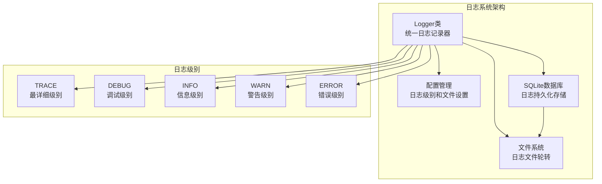
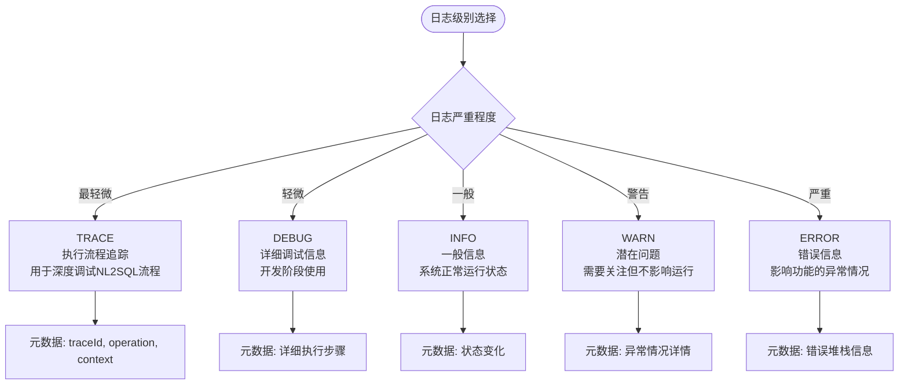
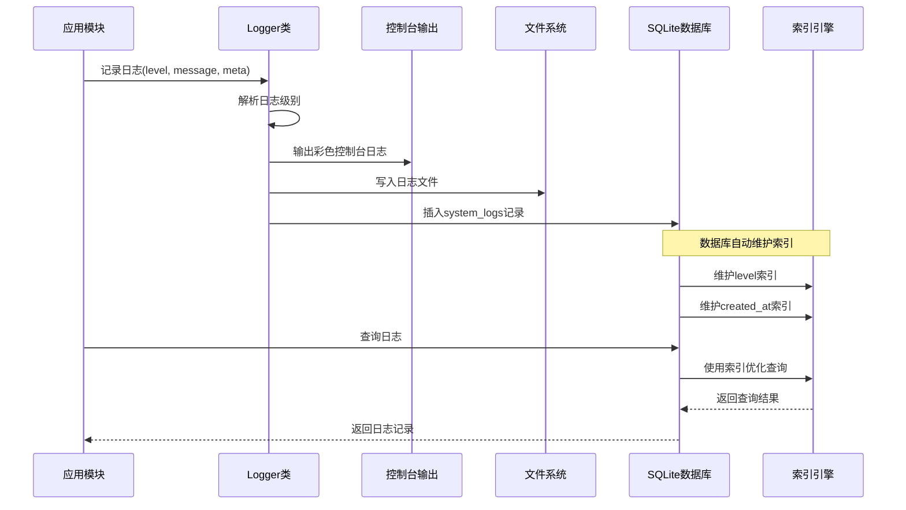
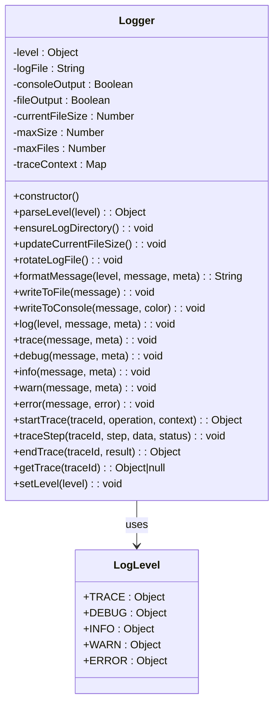
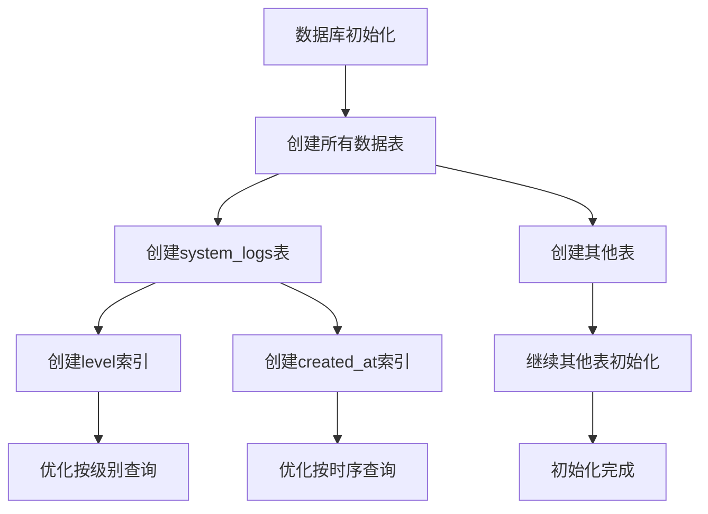
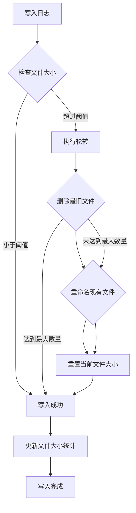
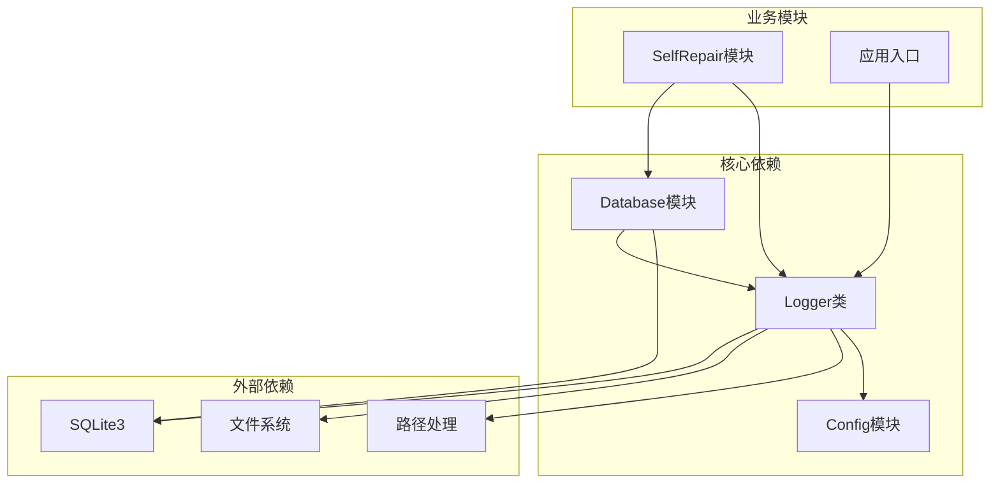

# 系统日志表

<cite>
**本文档引用的文件**
- [logger.js](file://backend/src/utils/logger.js)
- [database.js](file://backend/src/core/database.js)
- [config.js](file://backend/src/core/config.js)
- [selfRepair.js](file://backend/src/core/selfRepair.js)
</cite>

## 目录
1. [简介](#简介)
2. [项目结构](#项目结构)
3. [核心组件](#核心组件)
4. [架构概览](#架构概览)
5. [详细组件分析](#详细组件分析)
6. [依赖关系分析](#依赖关系分析)
7. [性能考虑](#性能考虑)
8. [故障排查指南](#故障排查指南)
9. [结论](#结论)

## 简介

系统日志表（system_logs）是NL2SQL项目中用于存储系统运行时日志的核心数据表。该表采用SQLite数据库实现，提供了完整的日志收集、存储和查询功能，支持多种日志级别和丰富的元数据结构，为系统的故障排查、性能监控和审计追踪提供了重要支撑。

## 项目结构

NL2SQL项目的日志系统采用分层架构设计，主要由以下组件构成：

**图表来源**
- [logger.js:26-44](file://backend/src/utils/logger.js#L26-L44)
- [config.js:195-213](file://backend/src/core/config.js#L195-L213)

**章节来源**
- [logger.js:1-442](file://backend/src/utils/logger.js#L1-L442)
- [database.js:166-189](file://backend/src/core/database.js#L166-L189)
- [config.js:195-213](file://backend/src/core/config.js#L195-L213)

## 核心组件

### 系统日志表结构

系统日志表采用标准化的字段设计，确保日志数据的完整性和可查询性：

| 字段名 | 数据类型 | 约束 | 描述 |
|--------|----------|------|------|
| id | INTEGER | PRIMARY KEY, AUTOINCREMENT | 自增主键，唯一标识每条日志记录 |
| level | TEXT | NOT NULL | 日志级别，支持debug、info、warn、error |
| message | TEXT | NOT NULL | 日志消息内容，描述具体事件 |
| source | TEXT | NULL | 日志来源模块或组件标识 |
| metadata | TEXT | NULL | JSON格式的附加元数据 |
| created_at | DATETIME | DEFAULT CURRENT_TIMESTAMP | 日志创建时间戳 |

### 日志级别分类标准

系统实现了五级日志分级体系，每级都有明确的使用场景和优先级：

**图表来源**
- [logger.js:29-44](file://backend/src/utils/logger.js#L29-L44)
- [logger.js:315-408](file://backend/src/utils/logger.js#L315-L408)

### JSON格式元数据设计

元数据采用JSON格式存储，支持灵活的数据结构和丰富的信息承载：

**常见元数据字段类型：**

1. **错误信息**（ERROR级别）
   - `error.message`: 错误描述
   - `error.stack`: 错误堆栈跟踪

2. **追踪信息**（TRACE级别）
   - `traceId`: 追踪会话标识
   - `operation`: 操作名称
   - `context`: 初始上下文数据

3. **性能指标**
   - `elapsed`: 执行耗时（毫秒）
   - `memory`: 内存使用情况
   - `connections`: 并发连接数

4. **业务数据**
   - `userId`: 用户标识
   - `sessionId`: 会话标识
   - `requestId`: 请求标识

**章节来源**
- [logger.js:169-187](file://backend/src/utils/logger.js#L169-L187)
- [logger.js:299-309](file://backend/src/utils/logger.js#L299-L309)
- [logger.js:315-408](file://backend/src/utils/logger.js#L315-L408)

## 架构概览

系统日志架构采用事件驱动的设计模式，实现了日志记录、存储和查询的完整闭环：

**图表来源**
- [logger.js:227-251](file://backend/src/utils/logger.js#L227-L251)
- [database.js:166-189](file://backend/src/core/database.js#L166-L189)

## 详细组件分析

### Logger类设计

Logger类是日志系统的核心组件，实现了统一的日志记录接口：

**图表来源**
- [logger.js:54-427](file://backend/src/utils/logger.js#L54-L427)
- [logger.js:29-44](file://backend/src/utils/logger.js#L29-L44)

### 数据库初始化流程

数据库初始化过程中，系统日志表与其他表一起创建，并建立相应的索引：

**图表来源**
- [database.js:166-189](file://backend/src/core/database.js#L166-L189)
- [database.js:200-261](file://backend/src/core/database.js#L200-L261)

### 日志轮转机制

系统实现了智能的日志文件轮转机制，确保日志文件不会无限增长：

**图表来源**
- [logger.js:134-166](file://backend/src/utils/logger.js#L134-L166)
- [logger.js:193-210](file://backend/src/utils/logger.js#L193-L210)

**章节来源**
- [logger.js:54-427](file://backend/src/utils/logger.js#L54-L427)
- [database.js:166-189](file://backend/src/core/database.js#L166-L189)
- [logger.js:134-166](file://backend/src/utils/logger.js#L134-L166)

## 依赖关系分析

系统日志表与项目其他组件存在紧密的依赖关系：

**图表来源**
- [logger.js:16-23](file://backend/src/utils/logger.js#L16-L23)
- [database.js:12-19](file://backend/src/core/database.js#L12-L19)
- [selfRepair.js:323-326](file://backend/src/core/selfRepair.js#L323-L326)

### 索引策略分析

系统日志表建立了两个关键索引，分别优化不同类型的查询场景：

| 索引名称 | 字段 | 查询优化 | 使用场景 |
|----------|------|----------|----------|
| idx_system_logs_level | level | 按日志级别过滤 | 筛选特定级别日志 |
| idx_system_logs_created_at | created_at | 按时间排序查询 | 时间范围查询、趋势分析 |

**章节来源**
- [database.js:185-188](file://backend/src/core/database.js#L185-L188)
- [logger.js:29-44](file://backend/src/utils/logger.js#L29-L44)

## 性能考虑

### 查询优化策略

系统日志表的索引设计针对常见的查询模式进行了优化：

1. **按级别查询优化**
   - 使用level索引快速定位特定级别的日志
   - 支持批量级别过滤和统计分析

2. **按时序查询优化**
   - 使用created_at索引实现高效的日期范围查询
   - 支持日志时间线分析和趋势监控

3. **内存使用优化**
   - 日志级别过滤在应用层实现，减少数据库负载
   - 文件轮转机制控制磁盘空间使用

### 存储优化建议

1. **日志级别配置**
   - 生产环境建议使用info级别，避免过多debug日志
   - 根据需要调整日志级别动态切换

2. **文件轮转配置**
   - 合理设置maxSize和maxFiles参数
   - 定期清理过期日志文件

3. **查询性能优化**
   - 优先使用索引字段进行查询
   - 避免全表扫描的大范围查询

## 故障排查指南

### 常见问题诊断

1. **日志级别不生效**
   - 检查配置文件中的LOG_LEVEL设置
   - 验证日志级别解析逻辑

2. **日志文件写入失败**
   - 检查日志目录权限
   - 验证磁盘空间充足性

3. **查询性能问题**
   - 确认索引是否正确创建
   - 检查查询语句是否使用索引

### 日志分析技巧

1. **错误日志分析**
   - 重点关注ERROR级别的日志记录
   - 分析错误堆栈信息定位问题根因

2. **性能监控**
   - 监控DEBUG级别的性能指标
   - 分析执行耗时和资源使用情况

3. **业务审计**
   - 利用INFO级别的业务事件日志
   - 追踪用户操作和系统状态变化

**章节来源**
- [logger.js:193-210](file://backend/src/utils/logger.js#L193-L210)
- [database.js:370-378](file://backend/src/core/database.js#L370-L378)

## 结论

系统日志表作为NL2SQL项目的重要基础设施，通过精心设计的表结构、完善的索引策略和智能化的日志管理机制，为系统的稳定运行提供了强有力的支撑。其五级日志分级体系、灵活的元数据设计和高效的查询优化策略，使得系统能够在保证性能的同时，提供全面的日志记录和分析能力。

通过合理的配置管理和最佳实践指导，开发者可以充分利用系统日志表的功能，有效提升系统的可观测性和可维护性，为故障排查、性能监控和审计追踪提供可靠的数据支持。