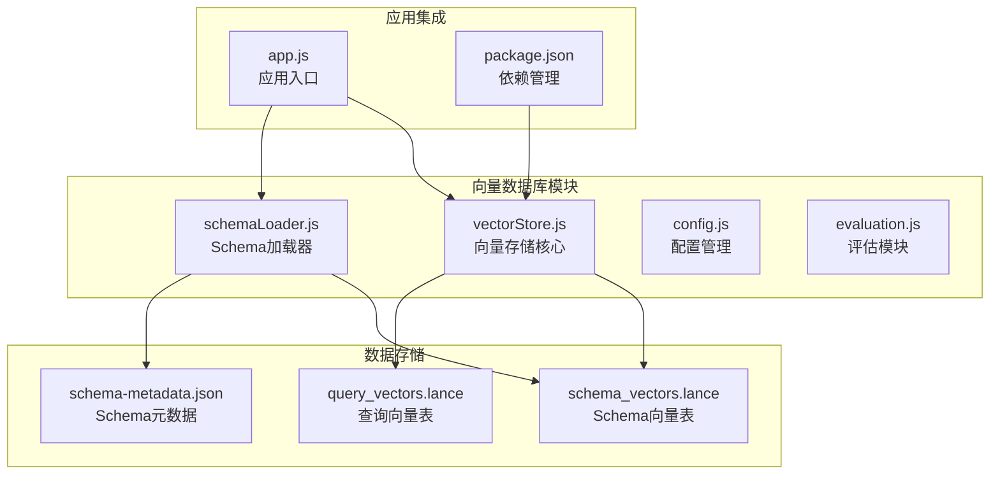
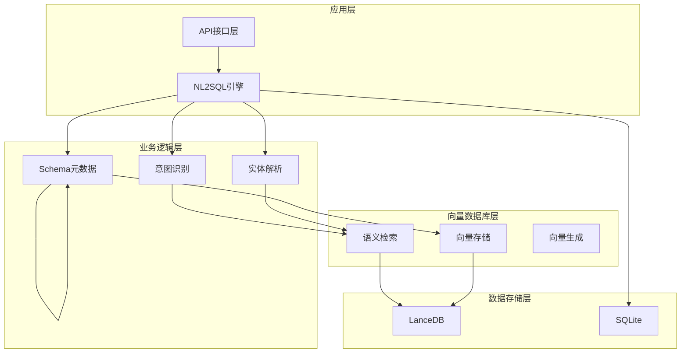
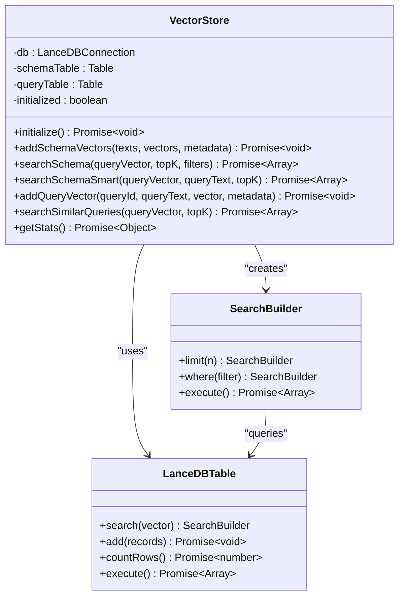
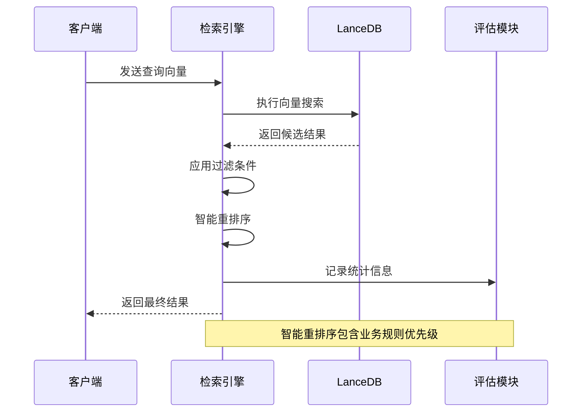
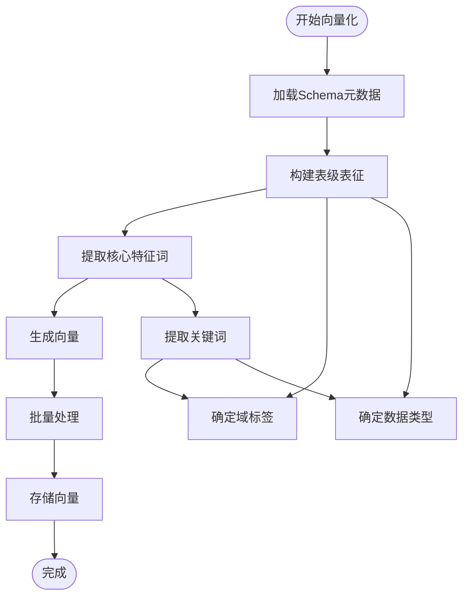
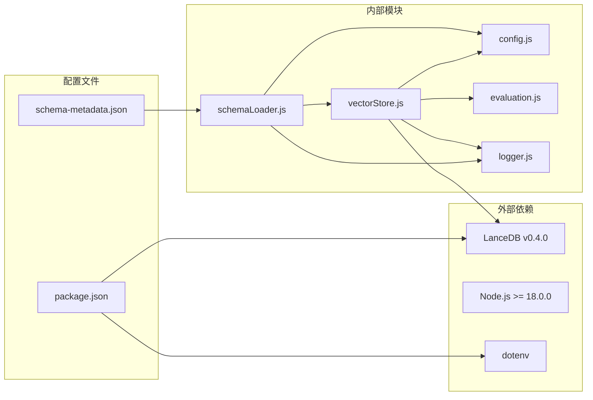
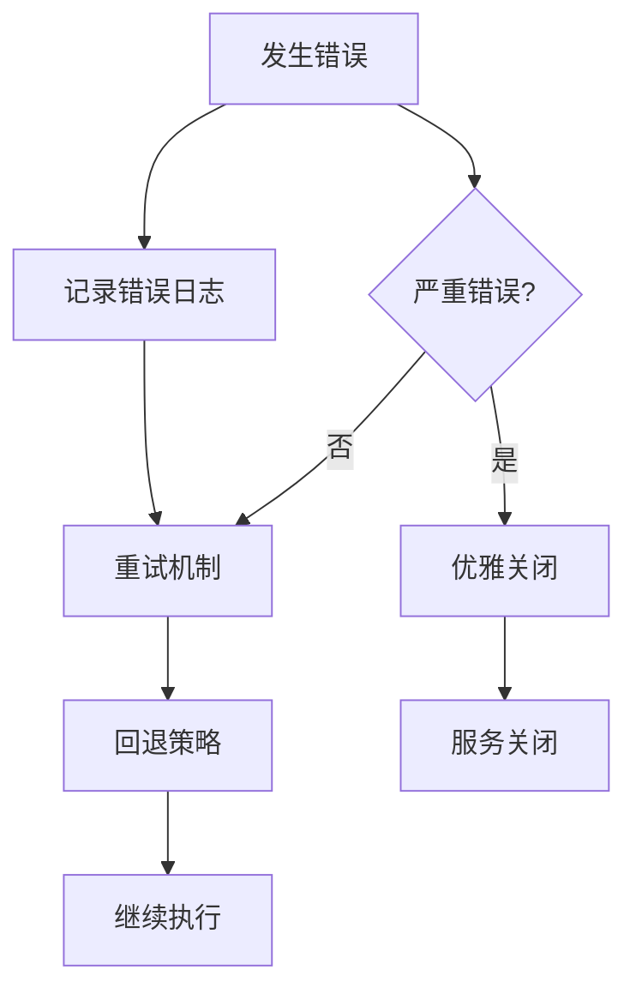

# 向量数据库设计

<cite>
**本文档引用的文件**
- [vectorStore.js](file://backend/src/memory/vectorStore.js)
- [schemaLoader.js](file://backend/src/core/schemaLoader.js)
- [config.js](file://backend/src/core/config.js)
- [evaluation.js](file://backend/src/utils/evaluation.js)
- [app.js](file://backend/src/app.js)
- [schema-metadata.json](file://backend/config/schema-metadata.json)
- [package.json](file://backend/package.json)
</cite>

## 目录
1. [简介](#简介)
2. [项目结构](#项目结构)
3. [核心组件](#核心组件)
4. [架构概览](#架构概览)
5. [详细组件分析](#详细组件分析)
6. [依赖关系分析](#依赖关系分析)
7. [性能考虑](#性能考虑)
8. [故障排除指南](#故障排除指南)
9. [结论](#结论)

## 简介

NL2SQL项目采用LanceDB作为向量数据库，实现了基于语义相似度的Schema检索和查询历史管理。该系统通过向量化技术将自然语言查询与数据库Schema进行语义匹配，提供智能化的表选择和字段推荐功能。

系统的核心设计理念包括：
- **双表架构**：`schema_vectors.lance`存储Schema元数据向量，`query_vectors.lance`存储查询历史向量
- **语义检索**：基于向量相似度的智能表选择和字段匹配
- **智能重排序**：结合查询意图和业务规则的排序算法
- **元数据增强**：丰富的元数据标签支持精确过滤和排序

## 项目结构

NL2SQL项目的向量数据库设计遵循模块化架构，主要文件组织如下：

**图表来源**
- [vectorStore.js:1-759](file://backend/src/memory/vectorStore.js#L1-L759)
- [schemaLoader.js:1-800](file://backend/src/core/schemaLoader.js#L1-L800)
- [config.js:1-398](file://backend/src/core/config.js#L1-L398)

**章节来源**
- [vectorStore.js:1-759](file://backend/src/memory/vectorStore.js#L1-L759)
- [schemaLoader.js:1-800](file://backend/src/core/schemaLoader.js#L1-L800)
- [config.js:1-398](file://backend/src/core/config.js#L1-L398)

## 核心组件

### LanceDB向量存储模块

向量存储模块基于LanceDB实现，提供完整的向量数据库操作接口：

**主要功能特性：**
- **双表设计**：独立的Schema向量表和查询向量表
- **智能初始化**：自动检测和创建缺失的表结构
- **元数据管理**：丰富的元数据标签支持精确过滤
- **批量操作**：支持批量向量插入和查询
- **统计监控**：内置运行时统计和性能监控

**核心数据结构：**
- `schema_vectors`表：存储表级向量，包含域标签、数据类型等元数据
- `query_vectors`表：存储查询历史向量，支持相似查询检索

**章节来源**
- [vectorStore.js:231-261](file://backend/src/memory/vectorStore.js#L231-L261)
- [vectorStore.js:336-367](file://backend/src/memory/vectorStore.js#L336-L367)
- [vectorStore.js:551-577](file://backend/src/memory/vectorStore.js#L551-L577)

### Schema向量化引擎

Schema向量化模块负责将数据库Schema转换为向量表示：

**向量化策略：**
- **表级向量**：每个表生成单一向量，包含核心业务含义
- **元数据标签**：自动提取域标签、数据类型、核心特征词
- **批量处理**：支持分批向量生成，提高处理效率
- **缓存机制**：避免重复向量化，提升启动速度

**元数据增强：**
- `scope`：域标签（platform/game/report）
- `data_type`：数据源类型（raw_log/aggregated_report/dimension_table）
- `key_features`：核心业务特征词

**章节来源**
- [schemaLoader.js:201-281](file://backend/src/core/schemaLoader.js#L201-L281)
- [schemaLoader.js:296-336](file://backend/src/core/schemaLoader.js#L296-L336)
- [schemaLoader.js:347-427](file://backend/src/core/schemaLoader.js#L347-L427)

### 语义检索引擎

检索引擎提供智能的语义搜索功能：

**检索策略：**
- **基础检索**：标准向量相似度搜索
- **智能检索**：基于查询意图的重排序算法
- **过滤机制**：支持元数据标签过滤
- **结果优化**：多轮搜索和后过滤提升准确性

**智能重排序算法：**
1. 查询意图识别（游戏提及检测）
2. 业务规则优先级（平台表优先、原始日志优先）
3. 向量距离归一化
4. 综合评分排序

**章节来源**
- [vectorStore.js:378-435](file://backend/src/memory/vectorStore.js#L378-L435)
- [vectorStore.js:450-536](file://backend/src/memory/vectorStore.js#L450-L536)

## 架构概览

NL2SQL向量数据库采用分层架构设计，确保系统的可扩展性和可维护性：

**图表来源**
- [app.js:97-166](file://backend/src/app.js#L97-L166)
- [schemaLoader.js:69-122](file://backend/src/core/schemaLoader.js#L69-L122)
- [vectorStore.js:231-261](file://backend/src/memory/vectorStore.js#L231-L261)

**章节来源**
- [app.js:97-166](file://backend/src/app.js#L97-L166)
- [schemaLoader.js:69-122](file://backend/src/core/schemaLoader.js#L69-L122)

## 详细组件分析

### 向量存储架构

向量存储模块采用LanceDB作为底层存储引擎，提供高性能的向量检索能力：

**图表来源**
- [vectorStore.js:204-220](file://backend/src/memory/vectorStore.js#L204-L220)
- [vectorStore.js:267-322](file://backend/src/memory/vectorStore.js#L267-L322)

**章节来源**
- [vectorStore.js:204-220](file://backend/src/memory/vectorStore.js#L204-L220)
- [vectorStore.js:267-322](file://backend/src/memory/vectorStore.js#L267-L322)

### 向量检索流程

向量检索采用多阶段处理策略，确保检索结果的准确性和相关性：

**图表来源**
- [vectorStore.js:378-435](file://backend/src/memory/vectorStore.js#L378-L435)
- [vectorStore.js:450-536](file://backend/src/memory/vectorStore.js#L450-L536)

**章节来源**
- [vectorStore.js:378-435](file://backend/src/memory/vectorStore.js#L378-L435)
- [vectorStore.js:450-536](file://backend/src/memory/vectorStore.js#L450-L536)

### Schema向量化流程

Schema向量化采用表级抽象策略，将复杂的数据库结构简化为语义向量：

**图表来源**
- [schemaLoader.js:201-281](file://backend/src/core/schemaLoader.js#L201-L281)
- [schemaLoader.js:296-336](file://backend/src/core/schemaLoader.js#L296-L336)
- [schemaLoader.js:347-427](file://backend/src/core/schemaLoader.js#L347-L427)

**章节来源**
- [schemaLoader.js:201-281](file://backend/src/core/schemaLoader.js#L201-L281)
- [schemaLoader.js:296-336](file://backend/src/core/schemaLoader.js#L296-L336)
- [schemaLoader.js:347-427](file://backend/src/core/schemaLoader.js#L347-L427)

## 依赖关系分析

向量数据库系统依赖关系清晰，模块间耦合度适中：

**图表来源**
- [package.json:10-27](file://backend/package.json#L10-L27)
- [vectorStore.js:14-21](file://backend/src/memory/vectorStore.js#L14-L21)
- [schemaLoader.js:15-26](file://backend/src/core/schemaLoader.js#L15-L26)

**章节来源**
- [package.json:10-27](file://backend/package.json#L10-L27)
- [vectorStore.js:14-21](file://backend/src/memory/vectorStore.js#L14-L21)
- [schemaLoader.js:15-26](file://backend/src/core/schemaLoader.js#L15-L26)

## 性能考虑

### 向量检索优化

系统采用多种策略优化向量检索性能：

**索引策略：**
- **向量索引**：LanceDB自动管理向量索引
- **元数据过滤**：支持基于元数据标签的预过滤
- **结果限制**：先获取更多候选结果再进行后过滤

**查询优化：**
- **批量处理**：支持批量向量生成和查询
- **缓存机制**：避免重复向量化操作
- **智能重排序**：减少不必要的计算

**内存管理：**
- **流式处理**：支持大数据集的流式处理
- **连接池**：LanceDB连接复用
- **垃圾回收**：及时清理临时数据

### 存储优化

**数据压缩：**
- **向量压缩**：利用向量相似性进行压缩
- **元数据优化**：精简元数据存储结构
- **索引优化**：定期重建和优化索引

**容量管理：**
- **自动清理**：定期清理过期向量数据
- **分片存储**：支持大规模数据分片
- **备份策略**：定期备份向量数据

## 故障排除指南

### 常见问题诊断

**向量数据库初始化失败：**
- 检查LanceDB安装状态
- 验证数据目录权限
- 确认配置文件路径正确

**向量检索结果不准确：**
- 检查向量维度配置
- 验证Embedding模型设置
- 确认Schema向量化完整性

**性能问题排查：**
- 监控向量检索延迟
- 检查索引状态
- 分析内存使用情况

### 错误处理机制

系统采用多层次的错误处理策略：

**章节来源**
- [vectorStore.js:256-260](file://backend/src/memory/vectorStore.js#L256-L260)
- [app.js:160-165](file://backend/src/app.js#L160-L165)

## 结论

NL2SQL项目的向量数据库设计体现了现代AI驱动的数据查询系统的最佳实践。通过LanceDB的高性能向量存储能力和精心设计的语义检索算法，系统实现了智能化的Schema选择和查询优化。

**主要优势：**
- **架构清晰**：模块化设计便于维护和扩展
- **性能优异**：基于向量相似度的快速检索
- **智能增强**：结合业务规则的智能重排序
- **可扩展性**：支持大规模数据和高并发场景

**未来发展方向：**
- **索引优化**：探索更高效的向量索引策略
- **增量学习**：支持向量的增量更新和维护
- **多模态支持**：扩展到图像和文本的多模态检索
- **分布式部署**：支持水平扩展和集群部署

该设计为NL2SQL系统提供了强大的语义检索能力，显著提升了用户体验和查询效率，为类似的数据智能应用提供了优秀的参考范例。