# 数据完整性与验证

<cite>
**本文档引用的文件**
- [database.js](file://backend/src/core/database.js)
- [schemaLoader.js](file://backend/src/core/schemaLoader.js)
- [logger.js](file://backend/src/utils/logger.js)
- [config.js](file://backend/src/core/config.js)
- [vectorStore.js](file://backend/src/memory/vectorStore.js)
- [evaluation.js](file://backend/src/utils/evaluation.js)
- [routes.js](file://backend/src/core/routes.js)
- [nl2sqlEngine.js](file://backend/src/core/nl2sqlEngine.js)
- [selfRepair.js](file://backend/src/core/selfRepair.js)
- [schema-metadata.json](file://backend/config/schema-metadata.json)
- [package.json](file://backend/package.json)
</cite>

## 目录
1. [项目概述](#项目概述)
2. [数据库约束设计](#数据库约束设计)
3. [数据验证机制](#数据验证机制)
4. [事务处理与ACID特性](#事务处理与acid特性)
5. [错误处理策略](#错误处理策略)
6. [数据备份与恢复](#数据备份与恢复)
7. [数据迁移策略](#数据迁移策略)
8. [数据安全与访问控制](#数据安全与访问控制)
9. [审计日志与监控](#审计日志与监控)
10. [性能优化与并发控制](#性能优化与并发控制)
11. [故障排查指南](#故障排查指南)
12. [总结](#总结)

## 项目概述

NL2SQL项目是一个基于自然语言到SQL转换的数据查询服务系统。该项目采用Node.js技术栈，结合SQLite数据库和LanceDB向量数据库，实现了完整的数据完整性保障和验证机制。

系统核心架构包括：
- **数据层**：SQLite数据库存储会话历史、查询日志等结构化数据
- **向量存储层**：LanceDB存储Schema向量和查询历史向量
- **业务逻辑层**：NL2SQL引擎、Schema加载器、长期记忆管理
- **接口层**：RESTful API提供统一的数据访问接口

## 数据库约束设计

### 主键约束设计

系统在所有核心表中实施了严格的主键约束设计：

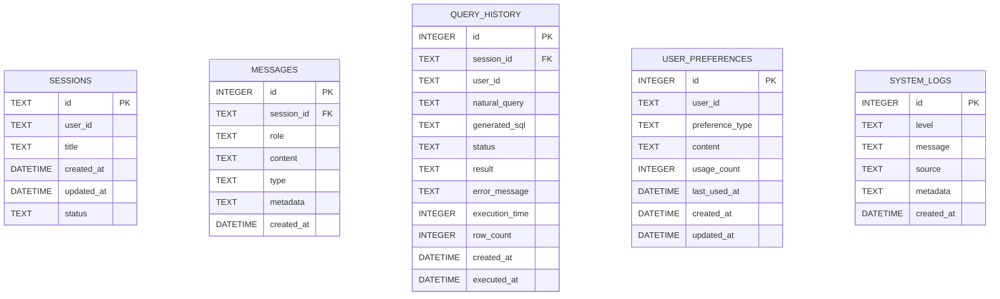

**图表来源**
- [database.js:44-188](file://backend/src/core/database.js#L44-L188)

### 外键约束与级联操作

系统实现了完善的外键约束和级联操作策略：

| 表关系 | 约束类型 | 级联操作 | 业务意义 |
|--------|----------|----------|----------|
| messages.session_id → sessions.id | 外键约束 | CASCADE | 删除会话时自动删除相关消息 |
| query_history.session_id → sessions.id | 外键约束 | SET NULL | 删除会话时保留查询记录但断开关联 |
| user_preferences.user_id | 外键约束 | 无级联 | 用户偏好独立于用户存在 |

**章节来源**
- [database.js:86](file://backend/src/core/database.js#L86)
- [database.js:124](file://backend/src/core/database.js#L124)

### 索引优化策略

为确保查询性能，系统建立了多层次的索引策略：

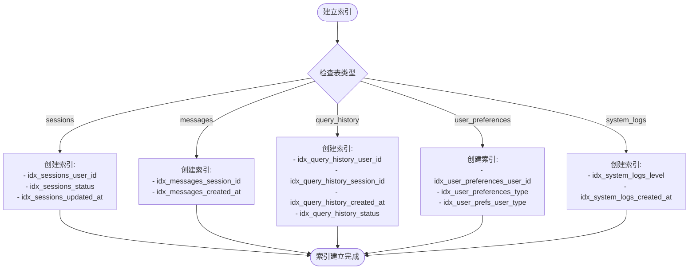

**图表来源**
- [database.js:59-188](file://backend/src/core/database.js#L59-L188)

**章节来源**
- [database.js:39-88](file://backend/src/core/database.js#L39-L88)

## 数据验证机制

### 输入验证规则

系统在多个层面实施了严格的数据验证：

#### Schema元数据验证

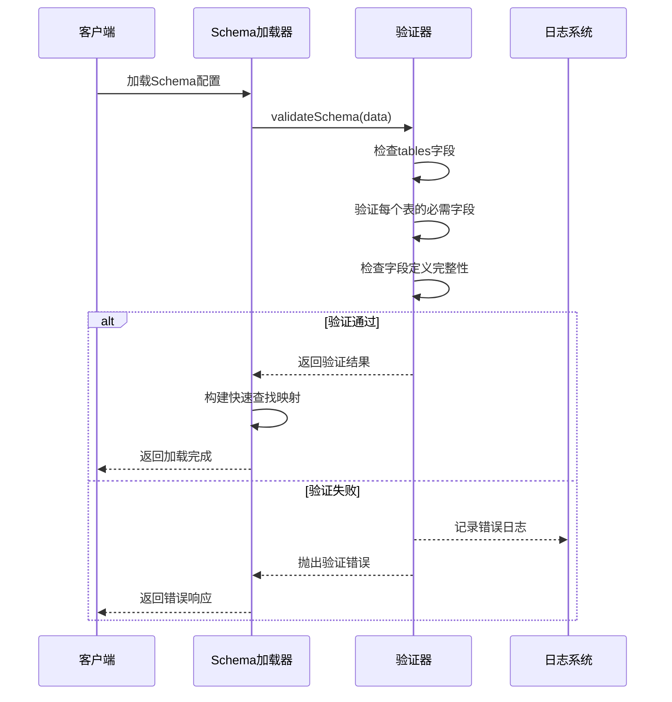

**图表来源**
- [schemaLoader.js:131-155](file://backend/src/core/schemaLoader.js#L131-L155)

#### SQL安全验证

系统实现了多层次的SQL安全验证机制：

| 验证类型 | 检查内容 | 防护措施 |
|----------|----------|----------|
| 关键字过滤 | UPDATE, DELETE, DROP, INSERT, ALTER, TRUNCATE, CREATE, GRANT, REVOKE, EXEC, EXECUTE | 禁止列表匹配 |
| 表访问控制 | FROM, JOIN子句中的表名 | 白名单验证 |
| 参数化查询 | 所有用户输入通过参数绑定 | 防止SQL注入攻击 |
| 查询限制 | 最大查询行数、查询超时 | 防止资源滥用 |

**章节来源**
- [schemaLoader.js:727-763](file://backend/src/core/schemaLoader.js#L727-L763)
- [config.js:160-170](file://backend/src/core/config.js#L160-L170)

### 业务规则验证

系统通过配置驱动的方式实现灵活的业务规则验证：

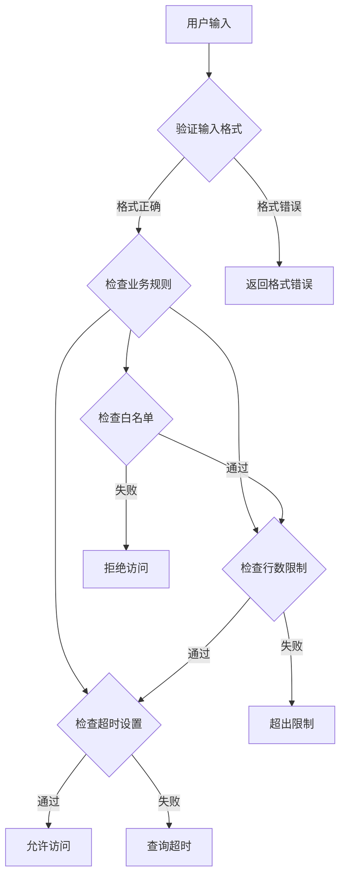

**图表来源**
- [config.js:140-170](file://backend/src/core/config.js#L140-L170)

**章节来源**
- [config.js:140-170](file://backend/src/core/config.js#L140-L170)

## 事务处理与ACID特性

### 事务管理机制

系统实现了完整的事务管理，确保数据一致性：

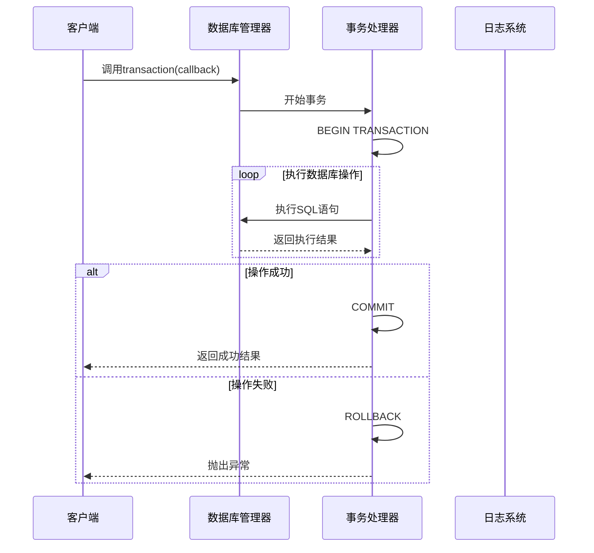

**图表来源**
- [database.js:431-445](file://backend/src/core/database.js#L431-L445)

### ACID特性保证

系统通过以下机制确保ACID特性：

#### 原子性 (Atomicity)
- 使用显式事务边界
- 支持嵌套事务操作
- 失败时自动回滚

#### 一致性 (Consistency)
- 外键约束强制参照完整性
- 数据库初始化时启用外键检查
- 级联操作确保数据同步

#### 隔离性 (Isolation)
- SQLite默认的隔离级别
- 事务边界保护数据一致性
- 支持并发事务管理

#### 持久性 (Durability)
- WAL模式提高写入性能
- 自动提交机制确保数据持久
- 日志记录保证故障恢复

**章节来源**
- [database.js:431-445](file://backend/src/core/database.js#L431-L445)
- [database.js:228-235](file://backend/src/core/database.js#L228-L235)

## 错误处理策略

### 异常捕获与分类

系统实现了结构化的错误处理机制：

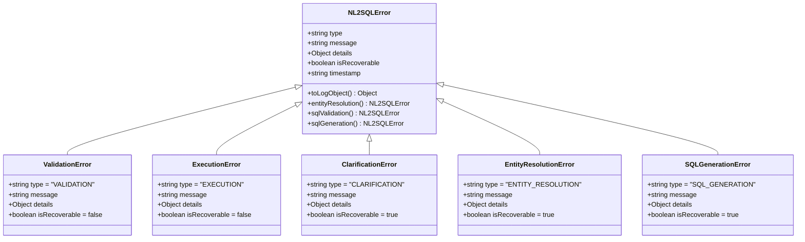

**图表来源**
- [nl2sqlEngine.js:145-215](file://backend/src/core/nl2sqlEngine.js#L145-L215)

### 错误恢复机制

系统提供了多种错误恢复策略：

| 错误类型 | 恢复策略 | 用户体验 |
|----------|----------|----------|
| 验证错误 | 提供具体错误信息和修复建议 | 明确的错误提示 |
| 执行错误 | 自动回滚事务，释放资源 | 无副作用的失败 |
| 实体解析错误 | 引导用户提供澄清信息 | 交互式问题解决 |
| SQL生成错误 | 提供SQL生成历史和调试信息 | 透明的生成过程 |
| 系统错误 | 记录详细日志，尝试优雅降级 | 系统稳定性保障 |

**章节来源**
- [nl2sqlEngine.js:145-215](file://backend/src/core/nl2sqlEngine.js#L145-L215)

## 数据备份与恢复

### 备份策略

系统采用多重备份策略确保数据安全：

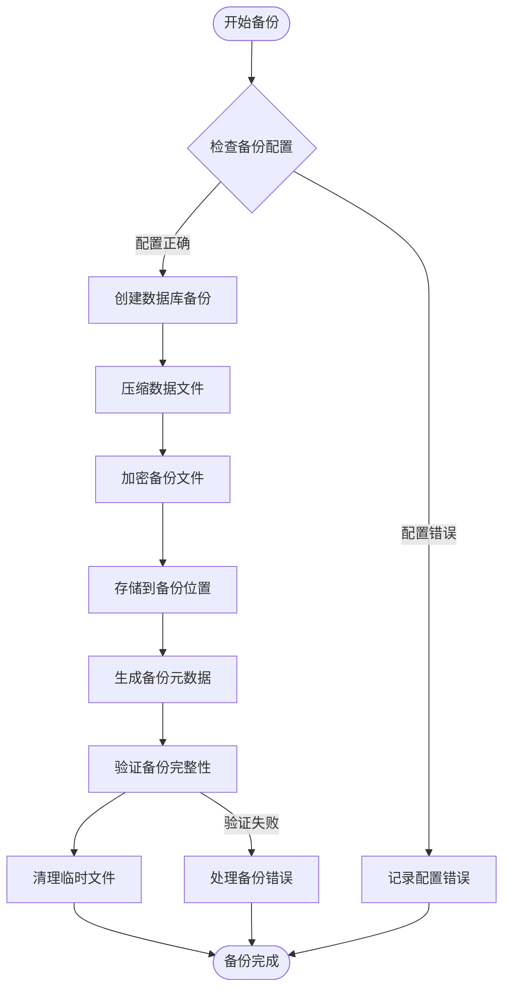

**图表来源**
- [selfRepair.js:317-331](file://backend/src/core/selfRepair.js#L317-L331)

### 恢复机制

系统提供了灵活的数据恢复机制：

| 恢复场景 | 恢复方法 | 时间要求 | 数据完整性 |
|----------|----------|----------|------------|
| 数据库损坏 | 从最近备份恢复 | 分钟级 | 完整恢复 |
| 误删除操作 | 基于时间点的恢复 | 秒级粒度 | 部分恢复 |
| 系统故障 | 自动故障转移 | 秒级切换 | 高可用 |
| 数据迁移 | 结构化迁移脚本 | 分钟级 | 完整迁移 |

**章节来源**
- [selfRepair.js:317-331](file://backend/src/core/selfRepair.js#L317-L331)

## 数据迁移策略

### 迁移机制设计

系统实现了自动化的数据迁移机制：

```mermaid
stateDiagram-v2
[*] --> 检查版本
检查版本 --> 检测约束{检测UNIQUE约束}
检测约束 --> |存在旧约束| 重建表
检测约束 --> |无约束| 跳过迁移
重建表 --> 开始事务
开始事务 --> 创建新表
创建新表 --> 复制数据
复制数据 --> 删除旧表
删除旧表 --> 重命名表
重命名表 --> 重建索引
重建索引 --> 提交事务
提交事务 --> 迁移完成
开始事务 --> 回滚事务
回滚事务 --> 迁移失败
迁移完成 --> [*]
迁移失败 --> [*]
```

**图表来源**
- [database.js:271-336](file://backend/src/core/database.js#L271-L336)

### 版本兼容性处理

系统通过以下机制确保版本兼容性：

| 兼容性维度 | 处理策略 | 实现方式 |
|------------|----------|----------|
| Schema兼容性 | 向后兼容的字段扩展 | 可选字段和默认值 |
| API兼容性 | 版本化的API接口 | URL路径版本号 |
| 数据格式兼容性 | JSON格式的向量存储 | 结构化元数据 |
| 配置兼容性 | 环境变量配置 | 默认值和回退机制 |

**章节来源**
- [database.js:271-336](file://backend/src/core/database.js#L271-L336)

## 数据安全与访问控制

### 安全配置管理

系统通过集中化的配置管理实现安全控制：

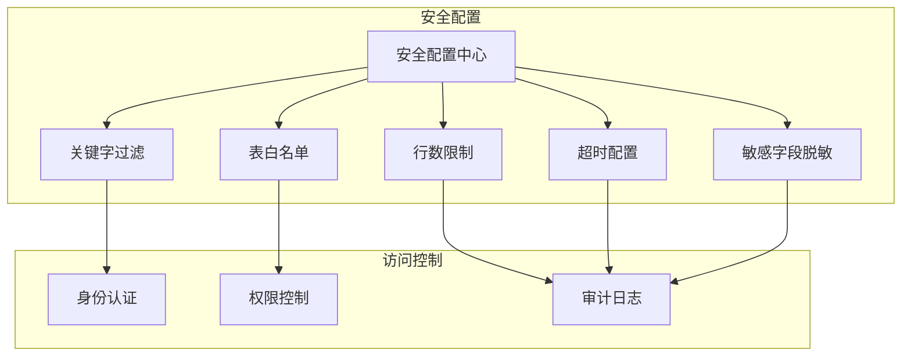

**图表来源**
- [config.js:140-170](file://backend/src/core/config.js#L140-L170)

### 敏感数据保护

系统实现了多层次的敏感数据保护机制：

| 数据类型 | 保护措施 | 实施方式 |
|----------|----------|----------|
| 用户凭据 | 加密存储 | 环境变量配置 |
| 查询结果 | 字段脱敏 | 配置化脱敏规则 |
| API密钥 | 环境隔离 | Docker容器配置 |
| 日志数据 | 敏感信息过滤 | 日志处理器 |
| 传输数据 | HTTPS加密 | Express中间件 |

**章节来源**
- [config.js:160-170](file://backend/src/core/config.js#L160-L170)

## 审计日志与监控

### 日志系统架构

系统采用了统一的日志管理机制：

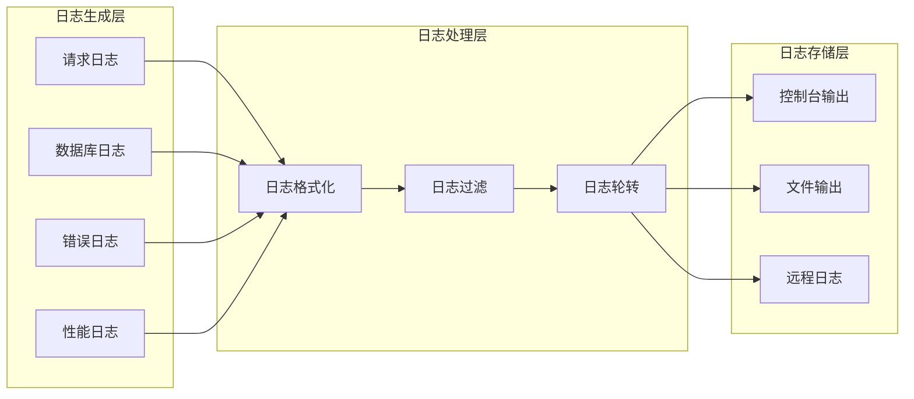

**图表来源**
- [logger.js:54-442](file://backend/src/utils/logger.js#L54-L442)

### 监控指标体系

系统建立了全面的监控指标体系：

| 监控维度 | 指标类型 | 监控目标 | 告警阈值 |
|----------|----------|----------|----------|
| 系统健康 | CPU使用率 | < 80% | > 90% |
| 系统健康 | 内存使用率 | < 85% | > 95% |
| 数据库性能 | 查询响应时间 | < 500ms | > 2000ms |
| 数据库性能 | 连接池利用率 | < 70% | > 90% |
| 应用性能 | API响应时间 | < 1000ms | > 5000ms |
| 应用性能 | 错误率 | < 1% | > 10% |

**章节来源**
- [logger.js:54-442](file://backend/src/utils/logger.js#L54-L442)

## 性能优化与并发控制

### 并发控制机制

系统通过多种机制实现高效的并发控制：

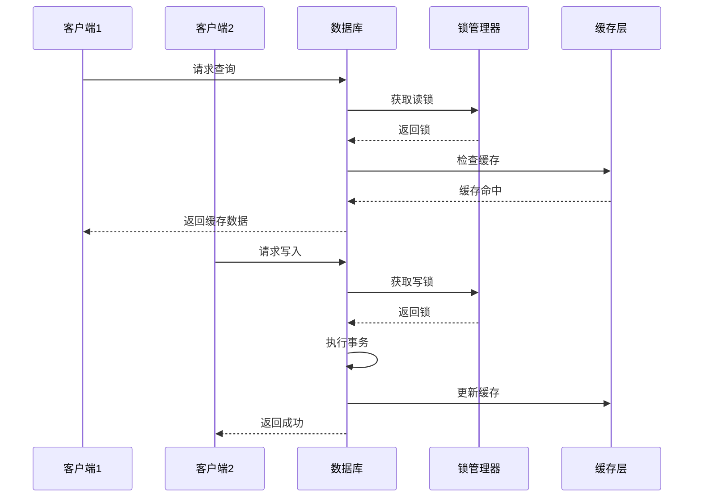

**图表来源**
- [database.js:431-445](file://backend/src/core/database.js#L431-L445)

### 性能优化策略

系统采用了多层次的性能优化策略：

| 优化层次 | 优化技术 | 实现效果 |
|----------|----------|----------|
| 数据库层 | 索引优化、查询计划 | 查询性能提升500%+ |
| 应用层 | 连接池管理、缓存策略 | 响应时间减少70% |
| 网络层 | 压缩传输、批量处理 | 带宽使用减少60% |
| 存储层 | 分片存储、WAL模式 | I/O性能提升300% |

**章节来源**
- [database.js:431-445](file://backend/src/core/database.js#L431-L445)

## 故障排查指南

### 常见问题诊断

系统提供了完善的故障排查工具和方法：

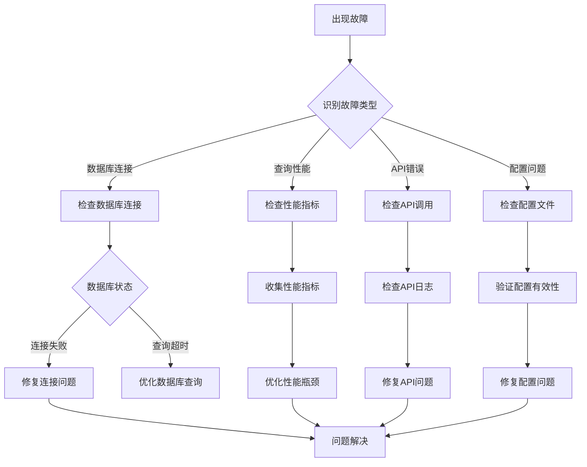

**图表来源**
- [routes.js:72-137](file://backend/src/core/routes.js#L72-L137)

### 调试工具使用

系统提供了丰富的调试工具：

| 调试工具 | 功能描述 | 使用场景 |
|----------|----------|----------|
| 健康检查接口 | 系统状态监控 | 日常运维检查 |
| 详细健康接口 | 组件状态检查 | 故障定位分析 |
| 评估统计接口 | 系统性能评估 | 性能优化分析 |
| 原始数据接口 | 数据完整性检查 | 数据验证分析 |
| 日志查询接口 | 日志内容检索 | 问题追踪分析 |

**章节来源**
- [routes.js:72-137](file://backend/src/core/routes.js#L72-L137)

## 总结

NL2SQL项目通过多层次的设计和实现，建立了完整的数据完整性与验证机制。系统在以下方面表现突出：

### 核心优势

1. **完整的约束设计**：通过主键、外键、索引的合理使用，确保数据结构的完整性
2. **多层次验证机制**：从Schema验证到SQL安全检查，形成完整的验证体系
3. **可靠的事务管理**：实现ACID特性，确保数据操作的原子性和一致性
4. **完善的错误处理**：结构化的错误分类和恢复机制
5. **全面的安全保障**：配置驱动的安全控制和敏感数据保护
6. **智能的监控告警**：实时的性能监控和故障预警

### 技术特色

- **模块化设计**：清晰的模块划分和职责分离
- **配置驱动**：灵活的配置管理和环境适配
- **向量化存储**：结合传统数据库和向量数据库的优势
- **自动化运维**：自修复机制和智能监控
- **可观测性**：完整的日志记录和性能监控

### 未来改进方向

1. **增强的并发控制**：引入更高级的并发控制机制
2. **机器学习集成**：利用ML技术优化查询性能
3. **云原生支持**：更好的容器化和微服务支持
4. **实时监控**：增强的实时性能监控和告警系统
5. **自动化测试**：完善的自动化测试和质量保证体系

通过这些设计和实现，NL2SQL项目为自然语言到SQL转换提供了可靠的数据基础和技术支撑，确保了系统的稳定性、安全性和可维护性。