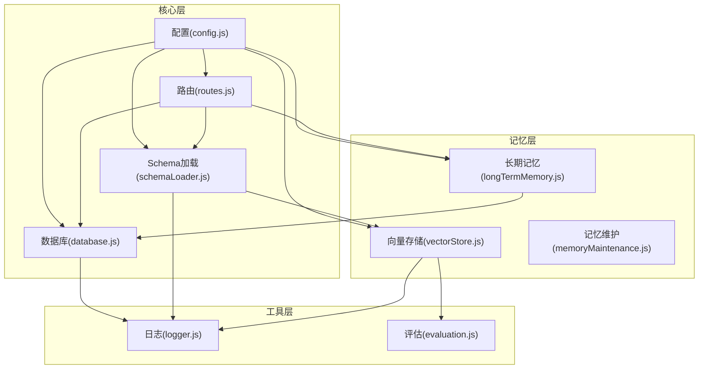
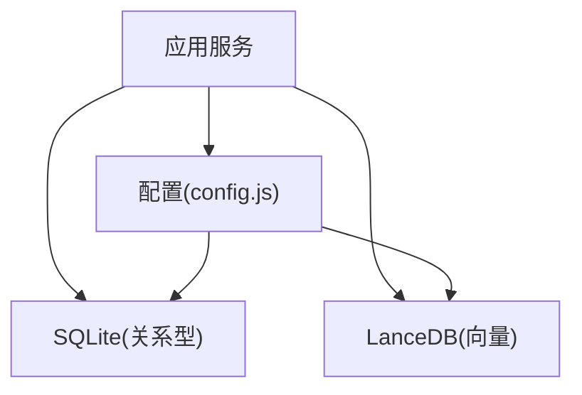
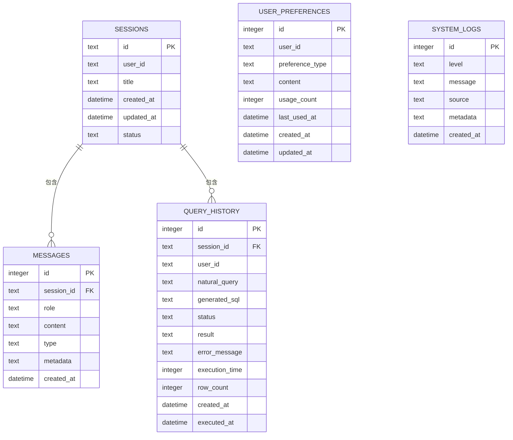
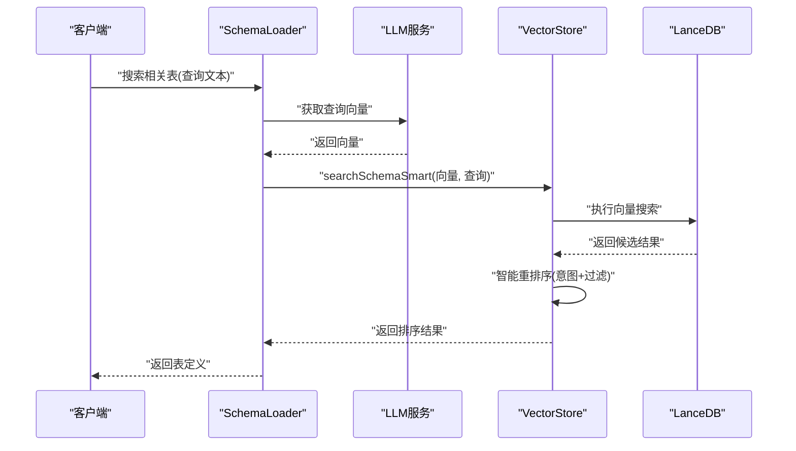
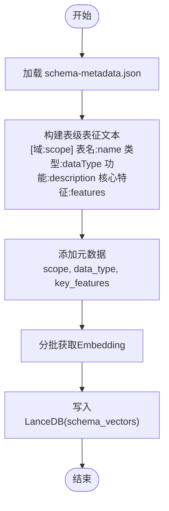
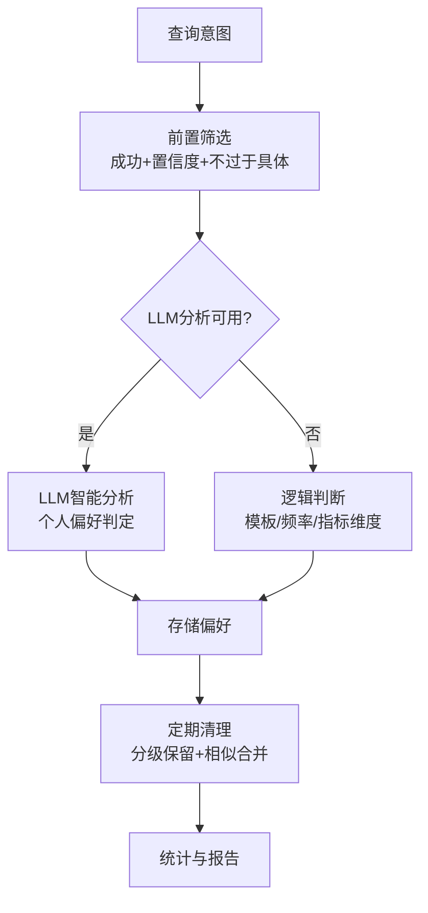
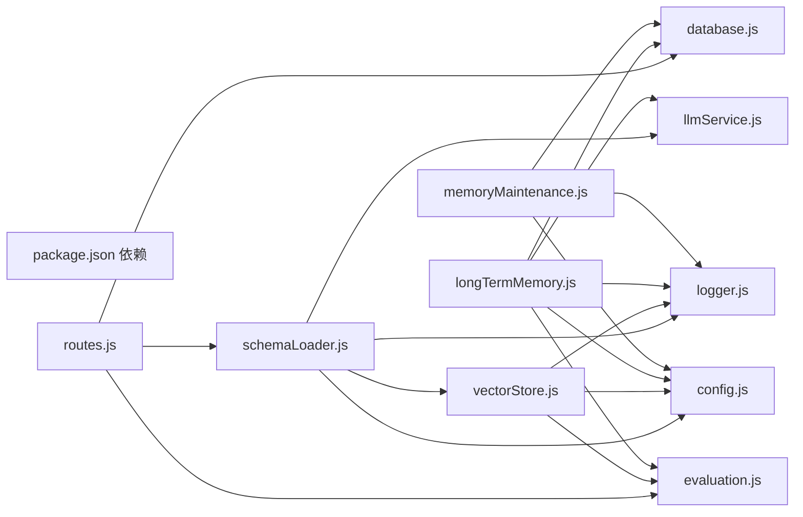

# 数据模型

<cite>
**本文引用的文件**
- [database.js](file://backend/src/core/database.js)
- [vectorStore.js](file://backend/src/memory/vectorStore.js)
- [config.js](file://backend/src/core/config.js)
- [schemaLoader.js](file://backend/src/core/schemaLoader.js)
- [routes.js](file://backend/src/core/routes.js)
- [logger.js](file://backend/src/utils/logger.js)
- [evaluation.js](file://backend/src/utils/evaluation.js)
- [longTermMemory.js](file://backend/src/memory/longTermMemory.js)
- [memoryMaintenance.js](file://backend/src/memory/memoryMaintenance.js)
- [schema-metadata.json](file://backend/config/schema-metadata.json)
- [package.json](file://backend/package.json)
</cite>

## 目录
1. [简介](#简介)
2. [项目结构](#项目结构)
3. [核心组件](#核心组件)
4. [架构总览](#架构总览)
5. [详细组件分析](#详细组件分析)
6. [依赖关系分析](#依赖关系分析)
7. [性能考量](#性能考量)
8. [故障排查指南](#故障排查指南)
9. [结论](#结论)
10. [附录](#附录)

## 简介
本文件面向 NL2SQL 项目的数据模型与数据层设计，系统梳理：
- 关系型数据模型：会话、消息、查询历史、用户偏好、系统日志
- 向量数据库设计：LanceDB 的使用方式、向量存储结构、语义搜索实现
- 数据完整性与安全：外键约束、索引策略、白名单与安全校验
- 数据访问模式与缓存策略：SQLite 与 LanceDB 的协同工作
- 生命周期管理、备份与迁移：数据库初始化、迁移、清理与维护
- 数据安全与隐私：敏感字段脱敏、访问控制与最小权限

## 项目结构
后端采用模块化分层：
- 核心层：数据库连接、配置、路由、Schema 加载
- 记忆层：长期记忆、向量存储、记忆维护
- 工具层：日志、评估、安全校验
- 配置与元数据：Schema 元数据 JSON、向量维度与路径配置

图表来源
- [config.js:16-398](file://backend/src/core/config.js#L16-L398)
- [database.js:39-189](file://backend/src/core/database.js#L39-L189)
- [routes.js:16-36](file://backend/src/core/routes.js#L16-L36)
- [schemaLoader.js:15-26](file://backend/src/core/schemaLoader.js#L15-L26)
- [vectorStore.js:14-21](file://backend/src/memory/vectorStore.js#L14-L21)
- [longTermMemory.js:17-21](file://backend/src/memory/longTermMemory.js#L17-L21)
- [memoryMaintenance.js:16-18](file://backend/src/memory/memoryMaintenance.js#L16-L18)
- [logger.js:16-23](file://backend/src/utils/logger.js#L16-L23)
- [evaluation.js:12-13](file://backend/src/utils/evaluation.js#L12-L13)

章节来源
- [config.js:16-398](file://backend/src/core/config.js#L16-L398)
- [database.js:39-189](file://backend/src/core/database.js#L39-L189)
- [routes.js:16-36](file://backend/src/core/routes.js#L16-L36)
- [schemaLoader.js:15-26](file://backend/src/core/schemaLoader.js#L15-L26)
- [vectorStore.js:14-21](file://backend/src/memory/vectorStore.js#L14-L21)
- [longTermMemory.js:17-21](file://backend/src/memory/longTermMemory.js#L17-L21)
- [memoryMaintenance.js:16-18](file://backend/src/memory/memoryMaintenance.js#L16-L18)
- [logger.js:16-23](file://backend/src/utils/logger.js#L16-L23)
- [evaluation.js:12-13](file://backend/src/utils/evaluation.js#L12-L13)

## 核心组件
- SQLite 关系型数据层：会话、消息、查询历史、用户偏好、系统日志
- LanceDB 向量数据库：Schema 向量、查询历史向量
- 配置中心：数据库路径、向量维度、白名单、超时与安全阈值
- Schema 元数据：表结构、字段、聚合指标与维度定义
- 记忆与评估：长期记忆抽取、存储、清理与命中率统计

章节来源
- [database.js:39-189](file://backend/src/core/database.js#L39-L189)
- [vectorStore.js:104-322](file://backend/src/memory/vectorStore.js#L104-L322)
- [config.js:97-130](file://backend/src/core/config.js#L97-L130)
- [schema-metadata.json:1-800](file://backend/config/schema-metadata.json#L1-L800)
- [evaluation.js:19-60](file://backend/src/utils/evaluation.js#L19-L60)

## 架构总览
关系型与向量数据库协同：
- 关系型：持久化会话、消息、查询历史、用户偏好、系统日志
- 向量数据库：Schema 表级向量、查询历史向量，支撑语义搜索与智能重排序
- 配置驱动：通过配置文件与环境变量控制路径、维度、白名单、超时与安全策略

图表来源
- [config.js:97-130](file://backend/src/core/config.js#L97-L130)
- [database.js:200-261](file://backend/src/core/database.js#L200-L261)
- [vectorStore.js:231-261](file://backend/src/memory/vectorStore.js#L231-L261)

## 详细组件分析

### 关系型数据模型（SQLite）
- 会话表 sessions
  - 主键：id（TEXT，UUID）
  - 外键：无
  - 索引：user_id、status、updated_at
  - 用途：会话生命周期管理
- 消息表 messages
  - 主键：id（INTEGER，自增）
  - 外键：session_id → sessions(id)（CASCADE 删除）
  - 索引：session_id、created_at
  - 用途：会话消息历史（role、type、metadata）
- 查询历史表 query_history
  - 主键：id（INTEGER，自增）
  - 外键：session_id → sessions(id)（SET NULL）
  - 索引：user_id、session_id、created_at、status
  - 用途：查询记录（自然语言、生成 SQL、结果、错误、耗时、行数）
- 用户偏好表 user_preferences
  - 主键：id（INTEGER，自增）
  - 索引：user_id、preference_type、(user_id, preference_type)
  - 用途：查询模式、字段别名、指标/维度偏好
- 系统日志表 system_logs
  - 主键：id（INTEGER，自增）
  - 索引：level、created_at
  - 用途：系统运行日志

图表来源
- [database.js:39-189](file://backend/src/core/database.js#L39-L189)

章节来源
- [database.js:39-189](file://backend/src/core/database.js#L39-L189)

### 向量数据库设计（LanceDB）
- 表结构
  - schema_vectors：表级向量，包含 text、vector、metadata、created_at
  - query_vectors：查询历史向量，包含 text、vector、metadata、created_at
- 元数据增强
  - 计算重要性评分、查询类型分类、复杂度统计、执行信息摘要
- 搜索与重排序
  - 智能搜索：基于查询意图识别，结合 scope、data_type、距离进行重排序
  - 应用层过滤：对返回结果进行二次过滤
- 初始化与迁移
  - 自动创建表（若不存在），支持强制重新向量化
  - 统计信息：schemaCount、queryCount（排除初始化记录）

图表来源
- [schemaLoader.js:591-657](file://backend/src/core/schemaLoader.js#L591-L657)
- [vectorStore.js:450-536](file://backend/src/memory/vectorStore.js#L450-L536)

章节来源
- [vectorStore.js:231-322](file://backend/src/memory/vectorStore.js#L231-L322)
- [vectorStore.js:450-536](file://backend/src/memory/vectorStore.js#L450-L536)
- [schemaLoader.js:591-657](file://backend/src/core/schemaLoader.js#L591-L657)

### Schema 元数据与向量化
- 元数据来源：schema-metadata.json
  - 版本、表定义、字段定义、聚合指标、维度、时间粒度等
- 向量化策略（表级）
  - 构建表级表征文本，包含域标签、类型、功能、核心特征词
  - 添加 scope、data_type、key_features 元数据，便于过滤与重排序
  - 分批获取 Embedding，批量写入 LanceDB
- 搜索增强
  - 支持根据 game_id 推断平台类型，增强查询文本
  - 支持 datasource 上下文优先匹配对应数据库的表

图表来源
- [schemaLoader.js:201-281](file://backend/src/core/schemaLoader.js#L201-L281)
- [schemaLoader.js:296-336](file://backend/src/core/schemaLoader.js#L296-L336)
- [schema-metadata.json:1-800](file://backend/config/schema-metadata.json#L1-L800)

章节来源
- [schemaLoader.js:201-281](file://backend/src/core/schemaLoader.js#L201-L281)
- [schemaLoader.js:296-336](file://backend/src/core/schemaLoader.js#L296-L336)
- [schema-metadata.json:1-800](file://backend/config/schema-metadata.json#L1-L800)

### 数据访问模式与缓存策略
- 数据库访问
  - 统一封装 query、queryOne、run、transaction，支持参数化查询与事务
  - 外键约束启用（PRAGMA foreign_keys = ON）
- 缓存策略
  - Schema 元数据：内存映射（tableMap、fieldMap），按配置缓存时间戳
  - 向量数据库：按需初始化，支持强制重新向量化
- API 访问
  - 路由层提供会话、消息、查询历史、偏好、评估等接口
  - 中间件记录请求日志，便于追踪

章节来源
- [database.js:347-445](file://backend/src/core/database.js#L347-L445)
- [schemaLoader.js:161-189](file://backend/src/core/schemaLoader.js#L161-L189)
- [routes.js:46-54](file://backend/src/core/routes.js#L46-L54)

### 数据完整性与安全
- 外键与约束
  - sessions.messages.session_id 外键约束（CASCADE 删除）
  - sessions.query_history.session_id 外键约束（SET NULL）
- 索引策略
  - sessions：user_id、status、updated_at
  - messages：session_id、created_at
  - query_history：user_id、session_id、created_at、status
  - user_preferences：user_id、preference_type、(user_id, preference_type)
  - system_logs：level、created_at
- 安全与白名单
  - allowedTables 白名单：限制可访问表
  - forbiddenKeywords 禁止关键字：防止危险 SQL
  - sensitiveFields：查询结果脱敏
  - maxQueryRows、queryTimeout：限制查询规模与耗时
- 日志与追踪
  - Logger 统一日志，支持文件轮转、结构化输出、trace 追踪

章节来源
- [database.js:39-189](file://backend/src/core/database.js#L39-L189)
- [config.js:140-170](file://backend/src/core/config.js#L140-L170)
- [logger.js:103-166](file://backend/src/utils/logger.js#L103-L166)

### 长期记忆与偏好管理
- 偏好类型
  - query_pattern、field_alias、metric_preference、dimension_preference
- 存储与筛选
  - 成功查询、置信度阈值、频率统计、模板维度/指标数量
  - LLM 智能分析（可选）：区分个人偏好与通用知识
- 清理与维护
  - 分级保留策略：高频永久、中频90天、低频30天、字段别名365天
  - 相似模式合并：维度/指标重合度>70%时合并
  - 定期压缩与统计报告

图表来源
- [longTermMemory.js:312-485](file://backend/src/memory/longTermMemory.js#L312-L485)
- [memoryMaintenance.js:69-189](file://backend/src/memory/memoryMaintenance.js#L69-L189)
- [memoryMaintenance.js:201-309](file://backend/src/memory/memoryMaintenance.js#L201-L309)

章节来源
- [longTermMemory.js:312-485](file://backend/src/memory/longTermMemory.js#L312-L485)
- [memoryMaintenance.js:69-189](file://backend/src/memory/memoryMaintenance.js#L69-L189)
- [memoryMaintenance.js:201-309](file://backend/src/memory/memoryMaintenance.js#L201-L309)

### 评估与质量度量
- 向量检索命中率：schema/query 搜索次数、命中次数、距离分布
- 长期记忆命中率：按类型统计命中/未命中
- Schema 向量化质量评估：精度、召回、F1、余弦相似度
- 查询历史向量化质量评估：相似度计算与误差统计

章节来源
- [evaluation.js:37-60](file://backend/src/utils/evaluation.js#L37-L60)
- [evaluation.js:158-266](file://backend/src/utils/evaluation.js#L158-L266)
- [evaluation.js:276-334](file://backend/src/utils/evaluation.js#L276-L334)

## 依赖关系分析
- 外部依赖
  - sqlite3：SQLite 驱动
  - vectordb：LanceDB 客户端
  - dotenv、cors、body-parser、uuid、dayjs、node-cron
- 内部依赖
  - routes 依赖 database、schemaLoader、evaluation
  - schemaLoader 依赖 config、logger、llmService、vectorStore
  - vectorStore 依赖 config、logger、evaluation
  - longTermMemory 依赖 database、logger、llmService、config、evaluation
  - memoryMaintenance 依赖 database、logger、config

图表来源
- [package.json:10-27](file://backend/package.json#L10-L27)
- [routes.js:24-29](file://backend/src/core/routes.js#L24-L29)
- [schemaLoader.js:19-26](file://backend/src/core/schemaLoader.js#L19-L26)
- [vectorStore.js:14-21](file://backend/src/memory/vectorStore.js#L14-L21)
- [longTermMemory.js:17-21](file://backend/src/memory/longTermMemory.js#L17-L21)
- [memoryMaintenance.js:16-18](file://backend/src/memory/memoryMaintenance.js#L16-L18)

章节来源
- [package.json:10-27](file://backend/package.json#L10-L27)
- [routes.js:24-29](file://backend/src/core/routes.js#L24-L29)
- [schemaLoader.js:19-26](file://backend/src/core/schemaLoader.js#L19-L26)
- [vectorStore.js:14-21](file://backend/src/memory/vectorStore.js#L14-L21)
- [longTermMemory.js:17-21](file://backend/src/memory/longTermMemory.js#L17-L21)
- [memoryMaintenance.js:16-18](file://backend/src/memory/memoryMaintenance.js#L16-L18)

## 性能考量
- 索引与查询
  - 为高频筛选字段建立索引（user_id、status、session_id、created_at、level）
  - 使用 LIMIT 与排序配合索引，避免全表扫描
- 向量搜索
  - 智能搜索先扩大 topK 再过滤，减少应用层二次处理成本
  - 元数据标签（scope、data_type）辅助过滤，降低距离计算开销
- 批量处理
  - Embedding 分批获取，避免单次请求过大
- 缓存
  - Schema 元数据内存映射与缓存时间戳，减少重复解析
- 安全与限流
  - maxQueryRows、queryTimeout、allowedTables、forbiddenKeywords 限制风险与资源占用

[本节为通用指导，不直接分析具体文件]

## 故障排查指南
- 数据库初始化失败
  - 检查数据库路径与权限，确认 PRAGMA foreign_keys 启用
  - 查看日志输出，定位 SQL 创建失败原因
- 向量数据库未初始化
  - 确认 VECTOR_DB_PATH 有效，检查 LanceDB 客户端可用性
  - 若启用强制重新向量化，确认 hasSchemaVectors 与 clearSchemaVectors 流程
- 查询历史与偏好统计异常
  - 检查 evaluation 统计开关与阈值配置
  - 使用 /api/evaluation/stats/reset 重置统计
- 记忆清理与合并
  - 检查清理规则与保留策略配置
  - 使用 /api/preferences/:userId/stats 获取用户记忆统计

章节来源
- [database.js:200-261](file://backend/src/core/database.js#L200-L261)
- [vectorStore.js:231-261](file://backend/src/memory/vectorStore.js#L231-L261)
- [routes.js:746-760](file://backend/src/core/routes.js#L746-L760)
- [memoryMaintenance.js:69-189](file://backend/src/memory/memoryMaintenance.js#L69-L189)

## 结论
本项目采用“关系型 + 向量”的混合数据架构：
- 关系型数据保障会话、消息、查询历史、偏好与日志的结构化持久化与强一致性
- 向量数据库提供语义搜索与智能重排序，提升用户体验
- 配置驱动的安全与性能策略，确保系统在开放场景下的可控与稳健
- 长期记忆与定期维护机制，持续优化个性化体验

[本节为总结性内容，不直接分析具体文件]

## 附录

### 数据库初始化与迁移
- 初始化流程
  - 连接 SQLite，启用外键约束
  - 执行建表与索引创建
  - 执行迁移（如 user_preferences 表重建）
- 迁移策略
  - 检测 UNIQUE 约束并重建表
  - 事务包裹，失败回滚

章节来源
- [database.js:200-336](file://backend/src/core/database.js#L200-L336)

### 数据生命周期管理与备份
- 会话与消息
  - 通过 sessions.updated_at 与消息 created_at 排序，支持过期清理
- 查询历史
  - status、created_at 索引支持查询与归档
- 偏好与日志
  - 分级保留策略与定期压缩，减少冗余
- 备份建议
  - SQLite 数据库文件定期备份
  - 向量数据库目录整体备份（schema_vectors.lance、query_vectors.lance）

章节来源
- [database.js:39-189](file://backend/src/core/database.js#L39-L189)
- [memoryMaintenance.js:69-189](file://backend/src/memory/memoryMaintenance.js#L69-L189)

### 访问控制与隐私保护
- 白名单与关键字过滤
  - allowedTables 限制表访问
  - forbiddenKeywords 禁止危险操作
- 敏感字段脱敏
  - sensitiveFields 在查询结果中脱敏
- 最小权限
  - 严格限制数据库连接与 API 路由访问

章节来源
- [config.js:140-170](file://backend/src/core/config.js#L140-L170)