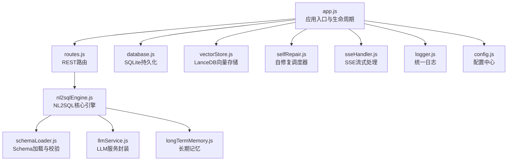
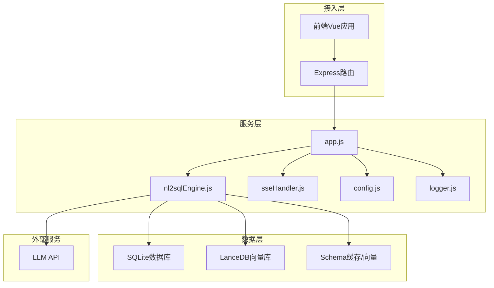
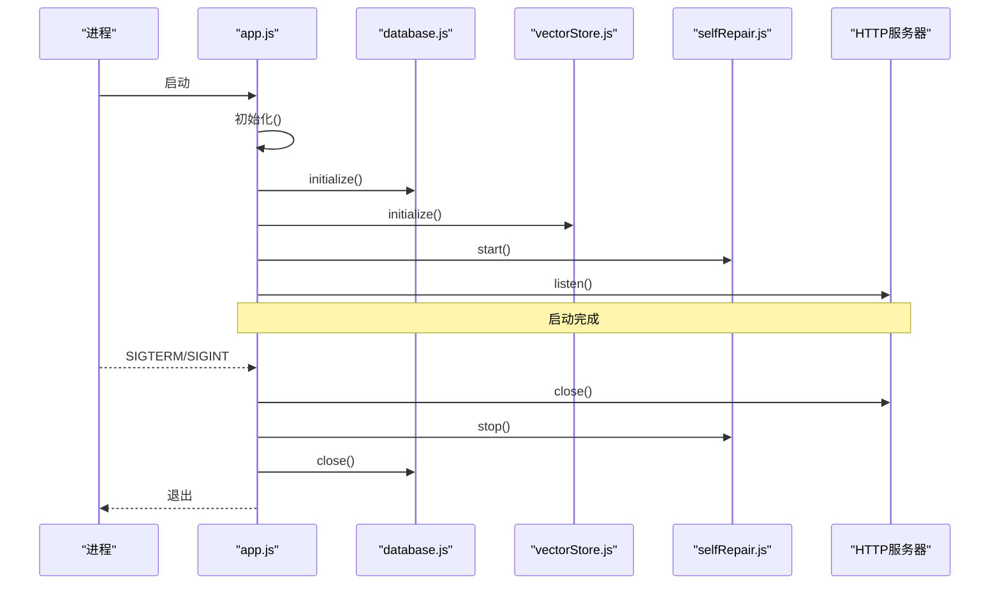
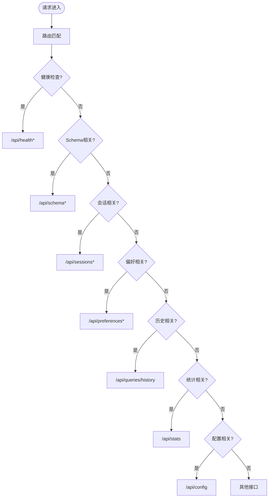
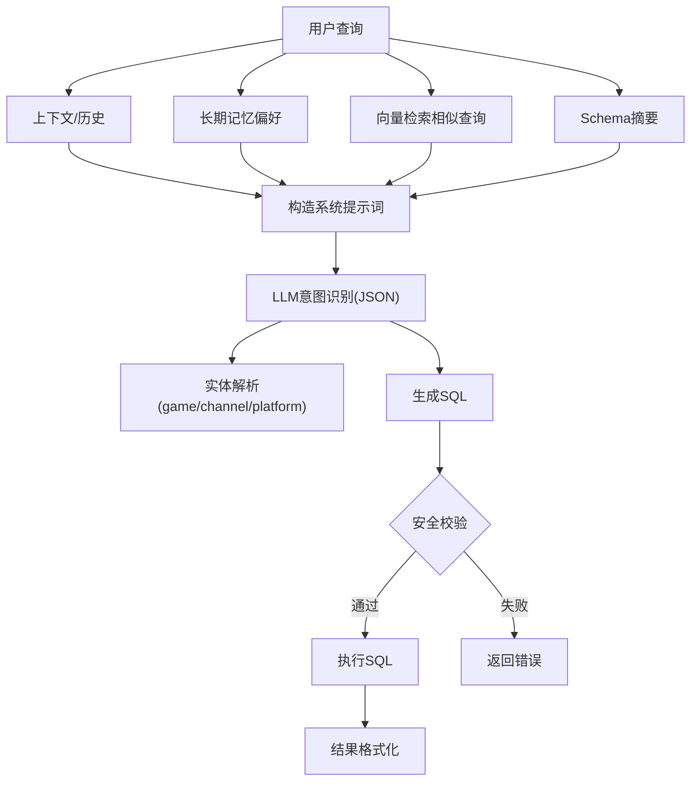
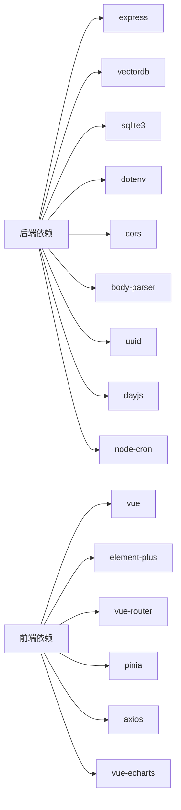

# 最佳实践

<cite>
**本文引用的文件**
- [app.js](file://backend/src/app.js)
- [routes.js](file://backend/src/core/routes.js)
- [nl2sqlEngine.js](file://backend/src/core/nl2sqlEngine.js)
- [config.js](file://backend/src/core/config.js)
- [logger.js](file://backend/src/utils/logger.js)
- [schemaLoader.js](file://backend/src/core/schemaLoader.js)
- [database.js](file://backend/src/core/database.js)
- [llmService.js](file://backend/src/core/llmService.js)
- [vectorStore.js](file://backend/src/memory/vectorStore.js)
- [selfRepair.js](file://backend/src/core/selfRepair.js)
- [sseHandler.js](file://backend/src/core/sseHandler.js)
- [longTermMemory.js](file://backend/src/memory/longTermMemory.js)
- [schema-metadata.example.json](file://backend/config/schema-metadata.example.json)
- [package.json](file://backend/package.json)
- [frontend/package.json](file://frontend/package.json)
</cite>

## 目录
1. [简介](#简介)
2. [项目结构](#项目结构)
3. [核心组件](#核心组件)
4. [架构总览](#架构总览)
5. [详细组件分析](#详细组件分析)
6. [依赖分析](#依赖分析)
7. [性能考量](#性能考量)
8. [故障排查指南](#故障排查指南)
9. [结论](#结论)
10. [附录](#附录)

## 简介
本指南面向NL2SQL项目的使用者与维护者，围绕“查询优化、缓存使用、资源管理、安全防护、可观测性、备份与恢复、团队协作与CI/CD、成本优化”等方面，结合代码库的实际实现，提供可落地的最佳实践建议。文档既关注技术细节，也强调工程化落地，帮助团队在保证质量的前提下提升系统稳定性与可维护性。

## 项目结构
后端采用模块化分层设计：
- 入口与生命周期：app.js负责启动、优雅停机、初始化顺序与全局异常处理
- 路由与API：routes.js集中定义REST接口，涵盖健康检查、Schema、会话、查询历史、统计、配置等
- 核心引擎：nl2sqlEngine.js负责意图识别、实体解析、SQL生成与校验、结果格式化
- 配置与日志：config.js集中管理配置；logger.js提供统一日志能力
- 数据与存储：database.js管理SQLite持久化；schemaLoader.js加载与缓存Schema；vectorStore.js基于LanceDB实现向量检索
- LLM与SSE：llmService.js封装LLM调用；sseHandler.js提供SSE流式交互
- 自修复与长期记忆：selfRepair.js实现定时健康检查与维护；longTermMemory.js管理用户偏好与记忆压缩

图表来源
- [app.js:97-166](file://backend/src/app.js#L97-L166)
- [routes.js:1-135](file://backend/src/core/routes.js#L1-L135)
- [nl2sqlEngine.js:1-120](file://backend/src/core/nl2sqlEngine.js#L1-L120)
- [schemaLoader.js:1-122](file://backend/src/core/schemaLoader.js#L1-L122)
- [database.js:1-120](file://backend/src/core/database.js#L1-L120)
- [llmService.js:1-120](file://backend/src/core/llmService.js#L1-L120)
- [vectorStore.js:1-85](file://backend/src/memory/vectorStore.js#L1-L85)
- [selfRepair.js:60-125](file://backend/src/core/selfRepair.js#L60-L125)
- [sseHandler.js:43-112](file://backend/src/core/sseHandler.js#L43-L112)
- [logger.js:51-80](file://backend/src/utils/logger.js#L51-L80)
- [config.js:16-50](file://backend/src/core/config.js#L16-L50)

章节来源
- [app.js:97-166](file://backend/src/app.js#L97-L166)
- [routes.js:1-135](file://backend/src/core/routes.js#L1-L135)
- [package.json:10-27](file://backend/package.json#L10-L27)

## 核心组件
- 应用入口与生命周期：负责环境变量加载、中间件装配、模块初始化、优雅停机与未捕获异常处理
- REST路由：提供健康检查、Schema查询、会话管理、查询历史、统计信息、配置等接口
- NL2SQL引擎：意图识别、实体解析、SQL生成与校验、结果格式化
- 配置中心：集中管理LLM、数据库、向量库、安全、会话、日志、自修复、Schema等配置
- 日志系统：统一日志级别、文件轮转、结构化输出
- 数据与存储：SQLite持久化会话与偏好；LanceDB向量检索；Schema缓存与向量化
- LLM服务：HTTP封装、重试、超时、流式响应
- SSE：连接管理、进度回调、流式消息广播
- 自修复：每日自检、会话清理、统计收集、记忆维护
- 长期记忆：偏好提取、存储、筛选与压缩

章节来源
- [app.js:97-166](file://backend/src/app.js#L97-L166)
- [routes.js:58-135](file://backend/src/core/routes.js#L58-L135)
- [nl2sqlEngine.js:394-677](file://backend/src/core/nl2sqlEngine.js#L394-L677)
- [config.js:16-332](file://backend/src/core/config.js#L16-L332)
- [logger.js:51-318](file://backend/src/utils/logger.js#L51-L318)
- [database.js:200-336](file://backend/src/core/database.js#L200-L336)
- [schemaLoader.js:69-122](file://backend/src/core/schemaLoader.js#L69-L122)
- [vectorStore.js:55-85](file://backend/src/memory/vectorStore.js#L55-L85)
- [llmService.js:222-277](file://backend/src/core/llmService.js#L222-L277)
- [sseHandler.js:43-112](file://backend/src/core/sseHandler.js#L43-L112)
- [selfRepair.js:60-125](file://backend/src/core/selfRepair.js#L60-L125)
- [longTermMemory.js:311-484](file://backend/src/memory/longTermMemory.js#L311-L484)

## 架构总览
系统采用“入口-路由-引擎-存储-LLM”的分层架构，配合SSE实现流式交互，自修复模块保障系统健康。

图表来源
- [app.js:56-87](file://backend/src/app.js#L56-L87)
- [routes.js:1-50](file://backend/src/core/routes.js#L1-L50)
- [nl2sqlEngine.js:1-40](file://backend/src/core/nl2sqlEngine.js#L1-L40)
- [database.js:1-40](file://backend/src/core/database.js#L1-L40)
- [vectorStore.js:1-44](file://backend/src/memory/vectorStore.js#L1-L44)
- [llmService.js:1-40](file://backend/src/core/llmService.js#L1-L40)
- [sseHandler.js:1-40](file://backend/src/core/sseHandler.js#L1-L40)
- [logger.js:1-40](file://backend/src/utils/logger.js#L1-L40)
- [config.js:1-40](file://backend/src/core/config.js#L1-L40)

## 详细组件分析

### 应用入口与生命周期（优雅停机）
- 初始化顺序：确保数据目录、SQLite、LanceDB、Schema、自修复、HTTP服务依次启动
- 优雅停机：关闭HTTP、SSE、定时任务、数据库连接，再退出进程
- 全局异常处理：未处理Promise拒绝与未捕获异常均记录并触发优雅停机

图表来源
- [app.js:97-166](file://backend/src/app.js#L97-L166)
- [app.js:176-230](file://backend/src/app.js#L176-L230)
- [database.js:791-800](file://backend/src/core/database.js#L791-L800)
- [selfRepair.js:131-159](file://backend/src/core/selfRepair.js#L131-L159)

章节来源
- [app.js:97-166](file://backend/src/app.js#L97-L166)
- [app.js:176-230](file://backend/src/app.js#L176-L230)

### REST路由与API设计
- 健康检查：/api/health、/api/health/detail
- Schema：/api/schema、/api/schema/tables/:tableName、/api/schema/search
- 会话：/api/sessions、/api/sessions/:sessionId、/api/sessions/:sessionId/messages、/api/users/:userId/sessions
- 查询历史：/api/queries/history
- 用户偏好（长期记忆）：/api/preferences/:userId、/api/preferences/:userId/raw、/api/preferences/:userId/stats、/api/preferences/:userId/templates、/api/preferences/:userId/learn-alias、/api/preferences/:preferenceId
- 统计：/api/stats
- 配置：/api/config

图表来源
- [routes.js:58-135](file://backend/src/core/routes.js#L58-L135)
- [routes.js:148-184](file://backend/src/core/routes.js#L148-L184)
- [routes.js:264-396](file://backend/src/core/routes.js#L264-L396)
- [routes.js:411-448](file://backend/src/core/routes.js#L411-L448)
- [routes.js:551-662](file://backend/src/core/routes.js#L551-L662)
- [routes.js:724-771](file://backend/src/core/routes.js#L724-L771)
- [routes.js:782-800](file://backend/src/core/routes.js#L782-L800)

章节来源
- [routes.js:58-135](file://backend/src/core/routes.js#L58-L135)
- [routes.js:148-184](file://backend/src/core/routes.js#L148-L184)
- [routes.js:264-396](file://backend/src/core/routes.js#L264-L396)
- [routes.js:411-448](file://backend/src/core/routes.js#L411-L448)
- [routes.js:551-662](file://backend/src/core/routes.js#L551-L662)
- [routes.js:724-771](file://backend/src/core/routes.js#L724-L771)
- [routes.js:782-800](file://backend/src/core/routes.js#L782-L800)

### NL2SQL核心引擎（意图识别与SQL生成）
- 意图识别：结合上下文、用户偏好、相似查询、Schema摘要，构造系统提示词，调用LLM生成JSON意图
- 实体解析：支持游戏/渠道等实体ID映射，优先使用长期记忆，回退到硬编码
- SQL生成与校验：基于意图生成SQL，执行前进行关键字与白名单校验
- 结果格式化：将SQL执行结果转为自然语言

图表来源
- [nl2sqlEngine.js:394-677](file://backend/src/core/nl2sqlEngine.js#L394-L677)
- [schemaLoader.js:420-507](file://backend/src/core/schemaLoader.js#L420-L507)
- [longTermMemory.js:311-484](file://backend/src/memory/longTermMemory.js#L311-L484)

章节来源
- [nl2sqlEngine.js:394-677](file://backend/src/core/nl2sqlEngine.js#L394-L677)
- [schemaLoader.js:420-507](file://backend/src/core/schemaLoader.js#L420-L507)
- [longTermMemory.js:311-484](file://backend/src/memory/longTermMemory.js#L311-L484)

### 配置中心与安全策略
- 安全配置：白名单表、禁止关键字、最大返回行数、查询超时、敏感字段脱敏、Dry Run开关
- LLM与Embedding：模型、超时、重试、维度
- Schema缓存：启用/过期时间、强制重新向量化
- 自修复：Cron表达式、会话检查间隔、慢查询阈值
- 日志：级别、文件轮转、控制台/文件输出

章节来源
- [config.js:16-332](file://backend/src/core/config.js#L16-L332)

### 日志系统
- 统一日志级别、颜色输出、文件轮转（大小限制、文件数量）
- 结构化日志，支持错误堆栈记录
- 事件驱动，便于扩展

章节来源
- [logger.js:51-318](file://backend/src/utils/logger.js#L51-L318)

### 数据与存储
- SQLite：会话、消息、查询历史、用户偏好、系统日志
- LanceDB：Schema向量、查询历史向量
- Schema缓存：内存映射、缓存过期、向量化

章节来源
- [database.js:39-189](file://backend/src/core/database.js#L39-L189)
- [database.js:200-336](file://backend/src/core/database.js#L200-L336)
- [schemaLoader.js:69-122](file://backend/src/core/schemaLoader.js#L69-L122)
- [vectorStore.js:55-85](file://backend/src/memory/vectorStore.js#L55-L85)

### LLM服务与SSE
- LLM：HTTP封装、重试、超时、流式响应
- SSE：连接管理、进度回调、广播消息、连接统计

章节来源
- [llmService.js:222-277](file://backend/src/core/llmService.js#L222-L277)
- [sseHandler.js:43-112](file://backend/src/core/sseHandler.js#L43-L112)
- [sseHandler.js:218-280](file://backend/src/core/sseHandler.js#L218-L280)

### 自修复与长期记忆
- 自修复：每日自检、会话清理、统计收集、记忆维护
- 长期记忆：偏好提取、存储、筛选阈值、分级保留策略

章节来源
- [selfRepair.js:60-125](file://backend/src/core/selfRepair.js#L60-L125)
- [selfRepair.js:169-310](file://backend/src/core/selfRepair.js#L169-L310)
- [longTermMemory.js:311-484](file://backend/src/memory/longTermMemory.js#L311-L484)

## 依赖分析
- 后端依赖：Express、vectordb(LanceDB)、sqlite3、dotenv、cors、body-parser、uuid、dayjs、node-cron
- 前端依赖：Vue 3、Element Plus、Vue Router、Pinia、ECharts、Axios、Markdown渲染等

图表来源
- [package.json:10-27](file://backend/package.json#L10-L27)
- [frontend/package.json:11-34](file://frontend/package.json#L11-L34)

章节来源
- [package.json:10-27](file://backend/package.json#L10-L27)
- [frontend/package.json:11-34](file://frontend/package.json#L11-L34)

## 性能考量
- 查询优化
  - 白名单与禁止关键字：通过配置限制危险/昂贵操作
  - 最大返回行数与查询超时：避免大结果集与慢查询拖垮服务
  - 事务与参数化查询：减少锁竞争与SQL注入风险
- 缓存使用
  - Schema缓存：启用内存映射与过期控制，避免重复解析
  - 向量检索：Schema与查询历史向量化，降低关键词匹配成本
- 资源管理
  - 优雅停机：确保连接与任务有序释放
  - 日志轮转：控制磁盘占用
  - 自修复：定期清理过期会话与记忆，维持系统健康

章节来源
- [config.js:140-170](file://backend/src/core/config.js#L140-L170)
- [schemaLoader.js:682-692](file://backend/src/core/schemaLoader.js#L682-L692)
- [vectorStore.js:382-420](file://backend/src/memory/vectorStore.js#L382-L420)
- [database.js:431-445](file://backend/src/core/database.js#L431-L445)
- [app.js:176-230](file://backend/src/app.js#L176-L230)
- [logger.js:128-160](file://backend/src/utils/logger.js#L128-L160)
- [selfRepair.js:341-373](file://backend/src/core/selfRepair.js#L341-L373)

## 故障排查指南
- 健康检查
  - 使用/health与/health/detail快速定位数据库、LLM、Schema、SSE连接状态
- 日志定位
  - 通过日志级别与文件轮转定位异常；关注错误堆栈与元数据
- 数据一致性
  - SQLite迁移：自动迁移旧表结构，避免UNIQUE约束导致的写入失败
- LLM与向量库
  - LLM超时与重试：合理设置超时与重试次数
  - 向量库初始化失败：记录警告并降级，不影响主流程
- SSE连接
  - 连接数统计与广播消息，排查并发与阻塞问题

章节来源
- [routes.js:70-135](file://backend/src/core/routes.js#L70-L135)
- [logger.js:283-293](file://backend/src/utils/logger.js#L283-L293)
- [database.js:271-336](file://backend/src/core/database.js#L271-L336)
- [llmService.js:167-195](file://backend/src/core/llmService.js#L167-L195)
- [vectorStore.js:80-84](file://backend/src/memory/vectorStore.js#L80-L84)
- [sseHandler.js:291-318](file://backend/src/core/sseHandler.js#L291-L318)

## 结论
本项目在工程化方面具备良好的模块化与可维护性，结合配置中心、统一日志、自修复机制与向量检索，能够支撑NL2SQL场景下的查询优化与用户体验。建议在生产环境中严格启用白名单与超时限制，完善监控与备份策略，并持续优化长期记忆与向量化策略以提升意图识别准确度与检索效率。

## 附录

### 安全考虑与防护措施
- SQL注入防护
  - 使用参数化查询与事务，避免拼接SQL
  - 禁止关键字白名单与表白名单双重校验
- 输入验证
  - 路由层对必填参数进行校验（如session_id）
  - LLM提示词中加入结构化JSON输出约束
- 访问控制
  - 前端CORS配置（生产环境建议限定域名）
  - 会话与用户维度的连接与消息广播

章节来源
- [database.js:361-424](file://backend/src/core/database.js#L361-L424)
- [schemaLoader.js:570-606](file://backend/src/core/schemaLoader.js#L570-L606)
- [routes.js:44-52](file://backend/src/core/routes.js#L44-L52)
- [routes.js:44-52](file://backend/src/core/routes.js#L44-L52)

### 监控与可观测性
- 健康检查：/api/health与/health/detail
- 统计信息：/api/stats提供连接数、查询统计、Schema规模、系统资源
- 日志：结构化输出与文件轮转
- 自修复：每日自检、慢查询阈值、内存使用率告警

章节来源
- [routes.js:70-135](file://backend/src/core/routes.js#L70-L135)
- [routes.js:724-771](file://backend/src/core/routes.js#L724-L771)
- [logger.js:169-181](file://backend/src/utils/logger.js#L169-L181)
- [selfRepair.js:169-310](file://backend/src/core/selfRepair.js#L169-L310)

### 数据备份与恢复
- SQLite数据库：定期复制sessions.db文件；结合事务日志与备份策略
- 向量库：LanceDB目录整体备份；如需恢复，重建目录并导入向量
- Schema元数据：备份schema-metadata.json；必要时重新向量化

章节来源
- [database.js:200-261](file://backend/src/core/database.js#L200-L261)
- [vectorStore.js:55-85](file://backend/src/memory/vectorStore.js#L55-L85)
- [schema-metadata.example.json:1-40](file://backend/config/schema-metadata.example.json#L1-L40)

### 团队协作与开发流程
- 配置管理：集中于config.js，避免分散配置
- 日志规范：统一结构化日志，便于排查
- 接口契约：REST路由清晰，前后端约定明确
- 版本与依赖：前后端package.json明确版本与脚本

章节来源
- [config.js:16-50](file://backend/src/core/config.js#L16-L50)
- [logger.js:169-181](file://backend/src/utils/logger.js#L169-L181)
- [routes.js:1-50](file://backend/src/core/routes.js#L1-L50)
- [package.json:6-8](file://backend/package.json#L6-L8)
- [frontend/package.json:6-9](file://frontend/package.json#L6-L9)

### 持续集成与持续部署
- 开发与生产脚本：dev与start脚本分离
- 优雅停机：支持SIGTERM/SIGINT，便于容器编排
- 健康检查：/api/health用于探针
- 自修复：定时任务保障系统自愈

章节来源
- [package.json:6-8](file://backend/package.json#L6-L8)
- [app.js:214-230](file://backend/src/app.js#L214-L230)
- [routes.js:70-92](file://backend/src/core/routes.js#L70-L92)
- [selfRepair.js:60-125](file://backend/src/core/selfRepair.js#L60-L125)

### 成本优化与资源利用
- 查询成本控制：白名单、超时、最大返回行数
- 存储成本：SQLite与LanceDB的容量规划与备份策略
- LLM成本：合理设置模型、超时与重试，避免不必要的调用
- 资源利用：自修复清理过期会话与记忆，降低内存与IO压力

章节来源
- [config.js:140-170](file://backend/src/core/config.js#L140-L170)
- [selfRepair.js:341-373](file://backend/src/core/selfRepair.js#L341-L373)
- [llmService.js:257-277](file://backend/src/core/llmService.js#L257-L277)