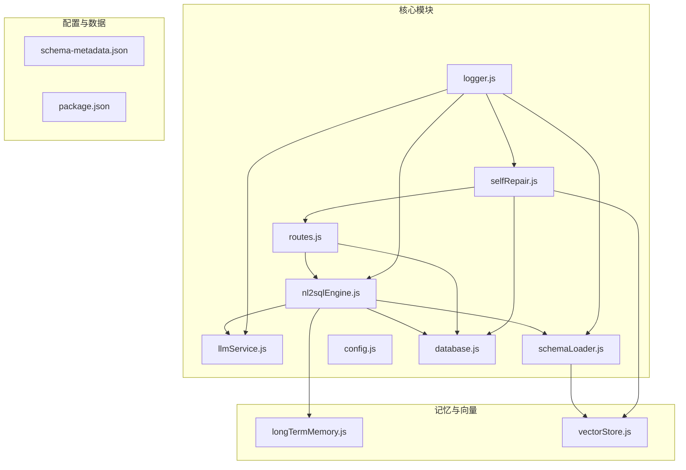
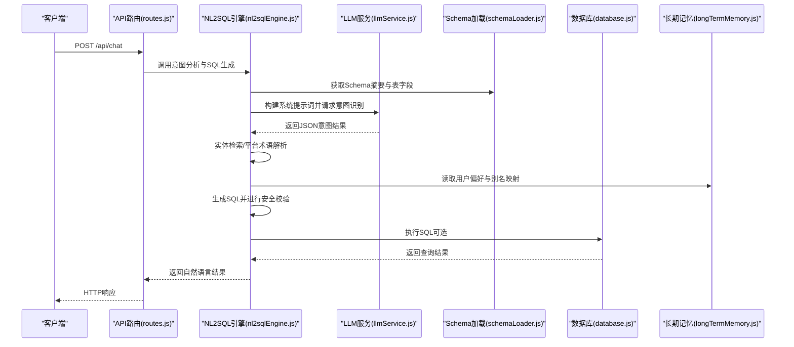
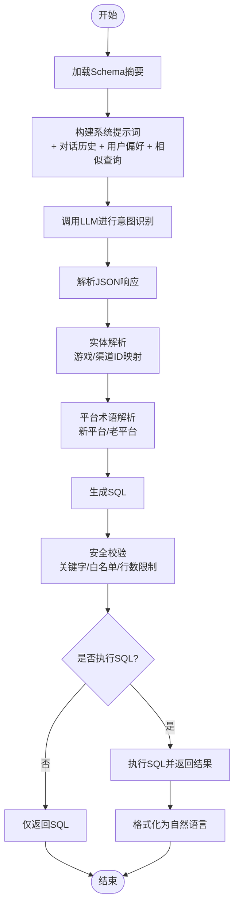
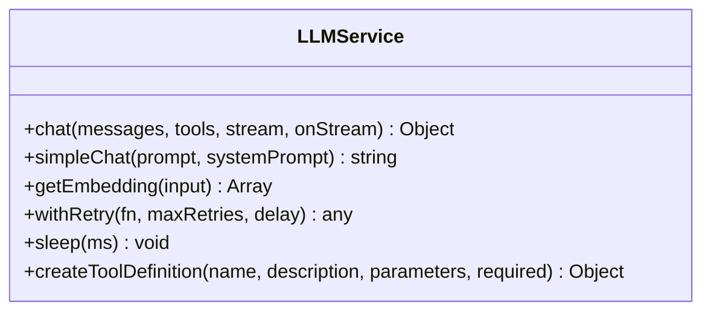
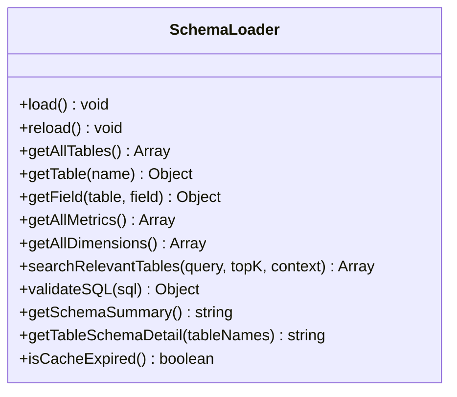
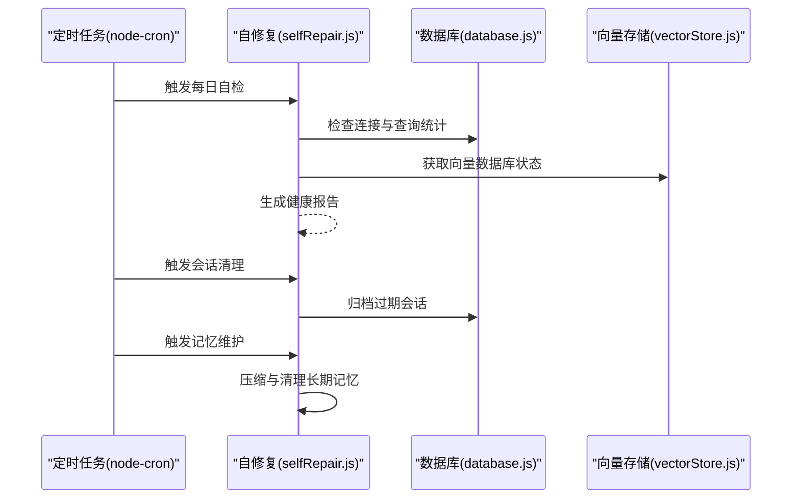
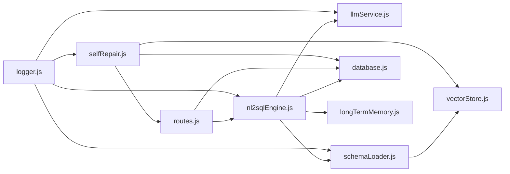

# NL2SQL引擎

<cite>
**本文档引用的文件**
- [nl2sqlEngine.js](file://backend/src/core/nl2sqlEngine.js)
- [llmService.js](file://backend/src/core/llmService.js)
- [schemaLoader.js](file://backend/src/core/schemaLoader.js)
- [selfRepair.js](file://backend/src/core/selfRepair.js)
- [config.js](file://backend/src/core/config.js)
- [database.js](file://backend/src/core/database.js)
- [routes.js](file://backend/src/core/routes.js)
- [logger.js](file://backend/src/utils/logger.js)
- [longTermMemory.js](file://backend/src/memory/longTermMemory.js)
- [vectorStore.js](file://backend/src/memory/vectorStore.js)
- [schema-metadata.json](file://backend/config/schema-metadata.json)
- [package.json](file://backend/package.json)
</cite>

## 目录
1. [简介](#简介)
2. [项目结构](#项目结构)
3. [核心组件](#核心组件)
4. [架构总览](#架构总览)
5. [详细组件分析](#详细组件分析)
6. [依赖关系分析](#依赖关系分析)
7. [性能考虑](#性能考虑)
8. [故障排除指南](#故障排除指南)
9. [结论](#结论)
10. [附录](#附录)

## 简介
本项目是一个基于自然语言到SQL转换的智能查询引擎，核心目标是将用户的自然语言查询转化为可执行的SQL语句，并在保证安全性的前提下返回结果。系统通过LLM（大语言模型）进行意图识别与澄清，结合Schema元数据与长期记忆，实现对复杂查询的准确解析与生成。同时，系统内置了安全校验、错误处理、自修复机制与向量检索能力，确保在生产环境中具备高可靠性与可维护性。

## 项目结构
后端采用模块化设计，核心模块包括：
- 核心引擎：nl2sqlEngine.js
- LLM服务：llmService.js
- Schema加载与验证：schemaLoader.js
- 自修复与定时任务：selfRepair.js
- 配置管理：config.js
- 数据库与会话：database.js
- API路由：routes.js
- 日志工具：logger.js
- 长期记忆与向量存储：memory子目录

**图表来源**
- [nl2sqlEngine.js:1-800](file://backend/src/core/nl2sqlEngine.js#L1-L800)
- [llmService.js:1-432](file://backend/src/core/llmService.js#L1-L432)
- [schemaLoader.js:1-732](file://backend/src/core/schemaLoader.js#L1-L732)
- [selfRepair.js:1-489](file://backend/src/core/selfRepair.js#L1-L489)
- [config.js:1-332](file://backend/src/core/config.js#L1-L332)
- [database.js:1-850](file://backend/src/core/database.js#L1-L850)
- [routes.js:1-895](file://backend/src/core/routes.js#L1-L895)
- [logger.js:1-318](file://backend/src/utils/logger.js#L1-L318)
- [longTermMemory.js:1-200](file://backend/src/memory/longTermMemory.js#L1-L200)
- [vectorStore.js:1-200](file://backend/src/memory/vectorStore.js#L1-L200)
- [schema-metadata.json:1-800](file://backend/config/schema-metadata.json#L1-L800)
- [package.json:1-28](file://backend/package.json#L1-L28)

**章节来源**
- [package.json:1-28](file://backend/package.json#L1-L28)

## 核心组件
- NL2SQL核心引擎：负责意图识别、实体解析、SQL生成、安全校验与结果格式化。
- LLM服务：封装HTTP请求、重试机制、JSON响应解析与错误处理。
- Schema加载器：加载与验证Schema元数据，提供表/字段查询与向量化能力。
- 自修复模块：定时任务与健康检查，维护系统稳定运行。
- 配置中心：集中管理LLM、数据库、安全、日志等配置。
- 数据库模块：SQLite持久化存储会话、消息、查询历史与用户偏好。
- API路由：提供健康检查、Schema查询、会话管理、统计信息等REST接口。
- 日志工具：统一日志输出与轮转。
- 长期记忆与向量存储：用户偏好学习、语义检索与记忆维护。

**章节来源**
- [nl2sqlEngine.js:1-800](file://backend/src/core/nl2sqlEngine.js#L1-L800)
- [llmService.js:1-432](file://backend/src/core/llmService.js#L1-L432)
- [schemaLoader.js:1-732](file://backend/src/core/schemaLoader.js#L1-L732)
- [selfRepair.js:1-489](file://backend/src/core/selfRepair.js#L1-L489)
- [config.js:1-332](file://backend/src/core/config.js#L1-L332)
- [database.js:1-850](file://backend/src/core/database.js#L1-L850)
- [routes.js:1-895](file://backend/src/core/routes.js#L1-L895)
- [logger.js:1-318](file://backend/src/utils/logger.js#L1-L318)
- [longTermMemory.js:1-200](file://backend/src/memory/longTermMemory.js#L1-L200)
- [vectorStore.js:1-200](file://backend/src/memory/vectorStore.js#L1-L200)

## 架构总览
系统采用“意图识别 + 实体解析 + SQL生成 + 安全校验”的流水线式处理，结合Schema元数据与用户长期记忆，实现高精度的NL2SQL转换。LLM负责理解自然语言并抽取结构化意图，Schema模块提供数据结构约束，数据库模块负责执行与持久化，向量存储与自修复模块保障检索效率与系统健康。

**图表来源**
- [routes.js:1-895](file://backend/src/core/routes.js#L1-L895)
- [nl2sqlEngine.js:394-677](file://backend/src/core/nl2sqlEngine.js#L394-L677)
- [llmService.js:287-311](file://backend/src/core/llmService.js#L287-L311)
- [schemaLoader.js:614-672](file://backend/src/core/schemaLoader.js#L614-L672)
- [database.js:361-424](file://backend/src/core/database.js#L361-L424)
- [longTermMemory.js:56-188](file://backend/src/memory/longTermMemory.js#L56-L188)

## 详细组件分析

### NL2SQL核心引擎
- 意图识别：结合Schema摘要、对话历史、用户偏好与相似查询，构建系统提示词，调用LLM进行JSON结构化意图抽取。
- 实体解析：支持游戏名、渠道名等实体映射到ID，支持从用户澄清中学习别名映射。
- 平台术语解析：识别“新平台/老平台”等业务术语并映射到数据源标识。
- SQL生成与校验：根据意图生成SQL，进行禁止关键字与白名单校验，限制返回行数与查询超时。
- 结果格式化：将SQL执行结果转为自然语言描述。

**图表来源**
- [nl2sqlEngine.js:394-677](file://backend/src/core/nl2sqlEngine.js#L394-L677)
- [schemaLoader.js:614-672](file://backend/src/core/schemaLoader.js#L614-L672)
- [llmService.js:287-311](file://backend/src/core/llmService.js#L287-L311)
- [database.js:361-424](file://backend/src/core/database.js#L361-L424)

**章节来源**
- [nl2sqlEngine.js:31-104](file://backend/src/core/nl2sqlEngine.js#L31-L104)
- [nl2sqlEngine.js:184-296](file://backend/src/core/nl2sqlEngine.js#L184-L296)
- [nl2sqlEngine.js:298-379](file://backend/src/core/nl2sqlEngine.js#L298-L379)
- [nl2sqlEngine.js:394-677](file://backend/src/core/nl2sqlEngine.js#L394-L677)
- [nl2sqlEngine.js:679-729](file://backend/src/core/nl2sqlEngine.js#L679-L729)
- [nl2sqlEngine.js:740-800](file://backend/src/core/nl2sqlEngine.js#L740-L800)

### LLM服务集成
- HTTP请求封装：支持HTTPS/HTTP、超时控制、流式响应（扩展）、错误解析与日志记录。
- 重试机制：指数退避重试，支持最大重试次数与延迟。
- JSON响应解析：严格解析LLM返回的JSON，支持多对象与截断响应的错误提示。
- 错误处理：捕获网络错误、HTTP状态码异常、JSON解析失败与超时，统一记录日志。

**图表来源**
- [llmService.js:222-311](file://backend/src/core/llmService.js#L222-L311)
- [llmService.js:324-379](file://backend/src/core/llmService.js#L324-L379)
- [llmService.js:167-195](file://backend/src/core/llmService.js#L167-L195)

**章节来源**
- [llmService.js:30-152](file://backend/src/core/llmService.js#L30-L152)
- [llmService.js:167-195](file://backend/src/core/llmService.js#L167-L195)
- [llmService.js:222-311](file://backend/src/core/llmService.js#L222-L311)
- [llmService.js:324-379](file://backend/src/core/llmService.js#L324-L379)

### Schema加载与验证
- 元数据加载：从JSON文件读取表结构、字段、关系、指标与维度，构建映射表加速查询。
- 验证机制：校验必需字段与格式，确保Schema完整性。
- 向量化：将表/字段描述转换为向量，支持语义检索与相关表推荐。
- 安全校验：禁止关键字与白名单表检查，防止危险SQL执行。
- 摘要与详情：提供Schema概览与表结构详情，用于提示词构建。

**图表来源**
- [schemaLoader.js:69-122](file://backend/src/core/schemaLoader.js#L69-L122)
- [schemaLoader.js:131-155](file://backend/src/core/schemaLoader.js#L131-L155)
- [schemaLoader.js:161-189](file://backend/src/core/schemaLoader.js#L161-L189)
- [schemaLoader.js:195-290](file://backend/src/core/schemaLoader.js#L195-L290)
- [schemaLoader.js:420-507](file://backend/src/core/schemaLoader.js#L420-L507)
- [schemaLoader.js:570-606](file://backend/src/core/schemaLoader.js#L570-L606)
- [schemaLoader.js:614-672](file://backend/src/core/schemaLoader.js#L614-L672)

**章节来源**
- [schemaLoader.js:69-122](file://backend/src/core/schemaLoader.js#L69-L122)
- [schemaLoader.js:131-155](file://backend/src/core/schemaLoader.js#L131-L155)
- [schemaLoader.js:161-189](file://backend/src/core/schemaLoader.js#L161-L189)
- [schemaLoader.js:195-290](file://backend/src/core/schemaLoader.js#L195-L290)
- [schemaLoader.js:420-507](file://backend/src/core/schemaLoader.js#L420-L507)
- [schemaLoader.js:570-606](file://backend/src/core/schemaLoader.js#L570-L606)
- [schemaLoader.js:614-672](file://backend/src/core/schemaLoader.js#L614-L672)
- [schema-metadata.json:1-800](file://backend/config/schema-metadata.json#L1-L800)

### 自修复与定时任务
- 每日自检：检查数据库、向量数据库、查询统计、连接数与系统资源，生成健康报告。
- 会话清理：定期归档过期会话，释放资源。
- 记忆维护：压缩与清理长期记忆，生成健康报告。
- 统计收集：周期性收集连接数与内存使用，便于监控。

**图表来源**
- [selfRepair.js:60-125](file://backend/src/core/selfRepair.js#L60-L125)
- [selfRepair.js:169-310](file://backend/src/core/selfRepair.js#L169-L310)
- [selfRepair.js:341-373](file://backend/src/core/selfRepair.js#L341-L373)
- [selfRepair.js:383-415](file://backend/src/core/selfRepair.js#L383-L415)
- [selfRepair.js:425-445](file://backend/src/core/selfRepair.js#L425-L445)

**章节来源**
- [selfRepair.js:60-125](file://backend/src/core/selfRepair.js#L60-L125)
- [selfRepair.js:169-310](file://backend/src/core/selfRepair.js#L169-L310)
- [selfRepair.js:341-373](file://backend/src/core/selfRepair.js#L341-L373)
- [selfRepair.js:383-415](file://backend/src/core/selfRepair.js#L383-L415)
- [selfRepair.js:425-445](file://backend/src/core/selfRepair.js#L425-L445)

### 配置管理
- LLM与Embedding：API基础地址、密钥、模型、超时、重试策略。
- 数据库：SQLite路径、向量数据库路径、SR数据源URL与连接池配置。
- 安全：允许访问的表白名单、Dry-run模式、最大返回行数、查询超时、禁止关键字、敏感字段脱敏。
- 会话：历史消息上限、过期时间、清理间隔。
- 日志：级别、文件路径、控制台与文件输出、轮转大小与文件数。
- 自修复：启用开关、Cron表达式、慢查询阈值。
- Schema：配置文件路径、缓存开关与过期时间、强制重新向量化。
- 长期记忆：启用开关、LLM智能提炼开关、筛选阈值与保留策略。

**章节来源**
- [config.js:16-332](file://backend/src/core/config.js#L16-L332)

### 数据库与API路由
- SQLite：会话、消息、查询历史、用户偏好、系统日志等表结构与索引。
- API路由：健康检查、Schema查询、会话管理、查询历史、用户偏好、统计信息等接口。
- 数据库操作：事务、批量查询、参数化SQL、迁移修复。

**章节来源**
- [database.js:39-189](file://backend/src/core/database.js#L39-L189)
- [database.js:200-336](file://backend/src/core/database.js#L200-L336)
- [database.js:361-424](file://backend/src/core/database.js#L361-L424)
- [routes.js:70-135](file://backend/src/core/routes.js#L70-L135)
- [routes.js:148-248](file://backend/src/core/routes.js#L148-L248)
- [routes.js:264-396](file://backend/src/core/routes.js#L264-L396)
- [routes.js:411-448](file://backend/src/core/routes.js#L411-L448)
- [routes.js:551-590](file://backend/src/core/routes.js#L551-L590)
- [routes.js:724-771](file://backend/src/core/routes.js#L724-L771)

### 日志工具
- 多级别日志：DEBUG/INFO/WARN/ERROR，支持结构化元数据。
- 控制台与文件输出：ANSI颜色控制台输出，自动轮转文件。
- 事件发射：支持外部监听日志事件。

**章节来源**
- [logger.js:32-41](file://backend/src/utils/logger.js#L32-L41)
- [logger.js:227-245](file://backend/src/utils/logger.js#L227-L245)
- [logger.js:256-293](file://backend/src/utils/logger.js#L256-L293)

### 长期记忆与向量存储
- 长期记忆：用户偏好、查询模式、字段别名、指标/维度偏好，支持LLM智能提炼。
- 向量存储：基于LanceDB的Schema与查询历史向量表，支持语义检索与相关表推荐。

**章节来源**
- [longTermMemory.js:56-188](file://backend/src/memory/longTermMemory.js#L56-L188)
- [vectorStore.js:55-85](file://backend/src/memory/vectorStore.js#L55-L85)
- [vectorStore.js:91-146](file://backend/src/memory/vectorStore.js#L91-L146)
- [vectorStore.js:160-191](file://backend/src/memory/vectorStore.js#L160-L191)

## 依赖关系分析
- 模块耦合：NL2SQL引擎高度依赖LLM服务、Schema加载器与数据库模块；自修复模块依赖数据库与向量存储；API路由依赖引擎与数据库。
- 外部依赖：Express、SQLite3、LanceDB、node-cron、uuid、dayjs、dotenv等。
- 配置驱动：所有外部服务（LLM、数据库、向量存储）均通过配置中心统一管理，便于切换与扩展。

**图表来源**
- [nl2sqlEngine.js:17-26](file://backend/src/core/nl2sqlEngine.js#L17-L26)
- [routes.js:16-28](file://backend/src/core/routes.js#L16-L28)
- [selfRepair.js:15-27](file://backend/src/core/selfRepair.js#L15-L27)
- [logger.js:15-23](file://backend/src/utils/logger.js#L15-L23)

**章节来源**
- [package.json:10-20](file://backend/package.json#L10-L20)

## 性能考虑
- LLM调用优化：合理设置超时与重试，避免阻塞；Embedding分批请求，降低单次请求压力。
- Schema缓存：启用缓存与过期控制，减少重复加载；支持强制重新向量化。
- 查询限制：最大返回行数、查询超时、禁止关键字与白名单，防止大查询与危险SQL。
- 向量检索：分批获取Embedding，避免超时；语义搜索失败回退关键词匹配。
- 自修复：定时任务避免频繁扫描，慢查询阈值与内存监控及时发现问题。

[本节为通用指导，无需特定文件引用]

## 故障排除指南
- LLM API错误：检查API密钥、基础URL、超时设置；查看重试日志与响应解析错误；关注“truncated”标记与多对象响应。
- Schema加载失败：确认配置文件路径与格式；验证必需字段；检查向量存储初始化状态。
- 数据库连接异常：检查SQLite路径与权限；确认外键约束启用；查看迁移日志。
- 查询失败：检查安全配置（禁止关键字、白名单表）；核对时间范围与过滤条件；查看执行耗时与行数限制。
- 自修复未生效：确认定时任务配置与Cron表达式；检查日志级别与输出配置。

**章节来源**
- [llmService.js:100-131](file://backend/src/core/llmService.js#L100-L131)
- [schemaLoader.js:117-122](file://backend/src/core/schemaLoader.js#L117-L122)
- [database.js:218-244](file://backend/src/core/database.js#L218-L244)
- [selfRepair.js:169-310](file://backend/src/core/selfRepair.js#L169-L310)

## 结论
NL2SQL引擎通过意图识别、实体解析、SQL生成与安全校验的闭环设计，结合Schema元数据与长期记忆，实现了高精度的自然语言到SQL转换。LLM服务与向量检索提升了理解与匹配能力，自修复机制保障了系统稳定性。配置中心与日志工具使得系统具备良好的可维护性与可观测性。建议在生产环境中启用白名单与行数限制，合理配置超时与重试策略，并定期进行自检与记忆维护。

[本节为总结性内容，无需特定文件引用]

## 附录

### 配置参数一览
- LLM与Embedding：apiBase、apiKey、model、timeout、maxRetries、retryDelay、embedding.model、embedding.dimension、embedding.timeout
- 数据库：database.path、vectorDb.path、srDatabase.url、srDatabase.pool.*
- 安全：security.allowedTables、security.dryRun、security.maxQueryRows、security.queryTimeout、security.forbiddenKeywords、security.sensitiveFields
- 会话：session.maxHistory、session.expireTime、session.cleanupInterval
- 日志：log.level、log.file、log.console、log.fileOutput、log.maxSize、log.maxFiles
- 自修复：selfRepair.enabled、selfRepair.dailyCheckCron、selfRepair.sessionCheckInterval、selfRepair.slowQueryThreshold
- Schema：schema.configPath、schema.enableCache、schema.cacheExpireTime、schema.revectorize
- 长期记忆：longTermMemory.enabled、longTermMemory.useLLMForExtraction、longTermMemory.thresholds.*、longTermMemory.retention.*

**章节来源**
- [config.js:16-332](file://backend/src/core/config.js#L16-L332)

### 代码示例路径
- 意图分析与实体解析：[nl2sqlEngine.js:394-677](file://backend/src/core/nl2sqlEngine.js#L394-L677)
- LLM聊天与Embedding：[llmService.js:222-379](file://backend/src/core/llmService.js#L222-L379)
- Schema加载与验证：[schemaLoader.js:69-122](file://backend/src/core/schemaLoader.js#L69-L122)、[schemaLoader.js:570-606](file://backend/src/core/schemaLoader.js#L570-L606)
- 数据库操作：[database.js:361-424](file://backend/src/core/database.js#L361-L424)
- API路由：[routes.js:148-248](file://backend/src/core/routes.js#L148-L248)