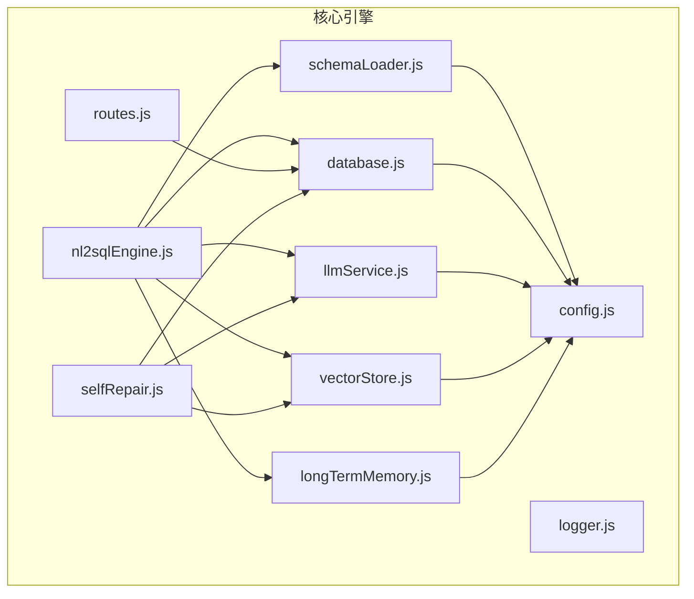
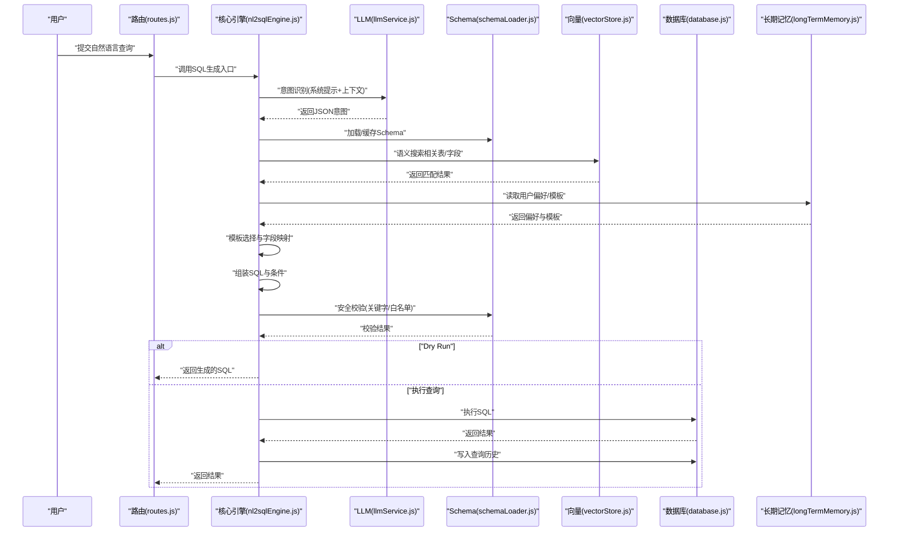
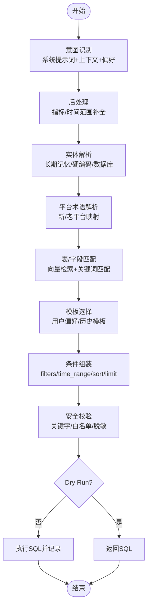
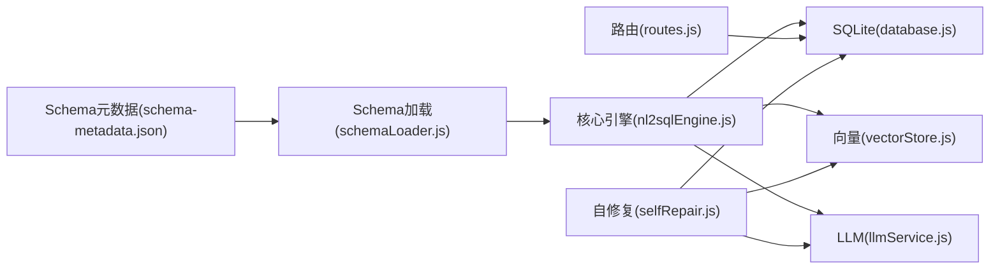
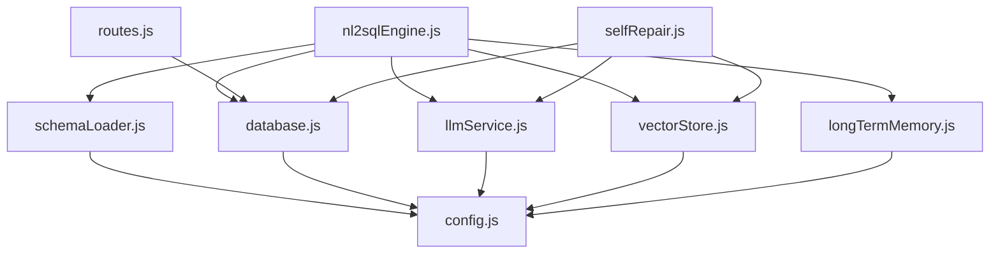

# SQL生成与优化

<cite>
**本文引用的文件**
- [nl2sqlEngine.js](file://backend/src/core/nl2sqlEngine.js)
- [schemaLoader.js](file://backend/src/core/schemaLoader.js)
- [database.js](file://backend/src/core/database.js)
- [llmService.js](file://backend/src/core/llmService.js)
- [selfRepair.js](file://backend/src/core/selfRepair.js)
- [config.js](file://backend/src/core/config.js)
- [routes.js](file://backend/src/core/routes.js)
- [logger.js](file://backend/src/utils/logger.js)
- [longTermMemory.js](file://backend/src/memory/longTermMemory.js)
- [vectorStore.js](file://backend/src/memory/vectorStore.js)
- [schema-metadata.json](file://backend/config/schema-metadata.json)
- [package.json](file://backend/package.json)
</cite>

## 目录
1. [简介](#简介)
2. [项目结构](#项目结构)
3. [核心组件](#核心组件)
4. [架构总览](#架构总览)
5. [详细组件分析](#详细组件分析)
6. [依赖关系分析](#依赖关系分析)
7. [性能考虑](#性能考虑)
8. [故障排查指南](#故障排查指南)
9. [结论](#结论)
10. [附录](#附录)

## 简介
本文件面向NL2SQL引擎的SQL生成模块，系统性阐述SQL生成算法的工作原理，包括查询意图解析、模板选择、字段映射与条件组装机制；详解SQL优化策略（索引利用、查询重写、性能调优）；全面说明安全验证机制（SQL注入防护、权限检查、数据脱敏）；提供SQL生成的完整流程示例（意图解析、模板选择、最终生成）；并说明配置参数、性能优化技巧与错误处理策略，以及与数据库模块的集成关系与数据流转。

## 项目结构
后端采用模块化设计，核心围绕“意图识别—模板匹配—SQL生成—安全校验—执行与记录”的闭环展开。关键模块职责如下：
- 核心引擎：nl2sqlEngine.js 负责意图识别、实体解析、模板选择与SQL生成协调
- 元数据与匹配：schemaLoader.js 负责Schema加载、表/字段匹配、SQL安全校验
- 数据库与持久化：database.js 负责SQLite会话与查询历史持久化
- 大模型服务：llmService.js 负责与LLM交互、Embedding生成
- 向量存储：vectorStore.js 负责Schema与查询历史向量化与语义检索
- 长期记忆：longTermMemory.js 负责用户偏好与查询模式的提取与存储
- 配置与路由：config.js、routes.js 提供运行参数与REST接口
- 自修复：selfRepair.js 提供定时健康检查与会话清理
- 日志：logger.js 提供统一日志输出

图表来源
- [nl2sqlEngine.js](file://backend/src/core/nl2sqlEngine.js)
- [schemaLoader.js](file://backend/src/core/schemaLoader.js)
- [database.js](file://backend/src/core/database.js)
- [llmService.js](file://backend/src/core/llmService.js)
- [vectorStore.js](file://backend/src/memory/vectorStore.js)
- [longTermMemory.js](file://backend/src/memory/longTermMemory.js)
- [config.js](file://backend/src/core/config.js)
- [routes.js](file://backend/src/core/routes.js)
- [selfRepair.js](file://backend/src/core/selfRepair.js)

章节来源
- [package.json:1-28](file://backend/package.json#L1-L28)

## 核心组件
- 意图识别与澄清：通过LLM对用户查询进行意图抽取（时间范围、维度、指标、筛选条件、排序、限制），并结合上下文与长期记忆增强理解，必要时发起澄清问题。
- 实体解析与平台术语：将模糊实体（如“青木”）解析为具体ID，并识别“新平台/老平台”等术语映射。
- 模板选择与字段映射：基于Schema与向量检索，选择相关表与字段，结合用户偏好与历史查询模板生成SQL。
- 条件组装与SQL生成：将意图中的维度、指标、筛选条件、排序与限制组装为SQL，进行安全校验与优化。
- 安全验证与脱敏：禁止关键字拦截、白名单表检查、敏感字段脱敏。
- 执行与记录：将生成的SQL与结果写入查询历史，支持Dry Run模式仅生成不执行。
- 长期记忆与模板：提取并存储用户偏好、查询模式与字段别名，提升后续查询效率与准确性。
- 自修复与监控：定时健康检查、会话清理、慢查询与错误统计。

章节来源
- [nl2sqlEngine.js:497-780](file://backend/src/core/nl2sqlEngine.js#L497-L780)
- [schemaLoader.js:560-628](file://backend/src/core/schemaLoader.js#L560-L628)
- [database.js:355-424](file://backend/src/core/database.js#L355-L424)
- [llmService.js:287-311](file://backend/src/core/llmService.js#L287-L311)
- [vectorStore.js:375-404](file://backend/src/memory/vectorStore.js#L375-L404)
- [longTermMemory.js:311-484](file://backend/src/memory/longTermMemory.js#L311-L484)
- [selfRepair.js:169-310](file://backend/src/core/selfRepair.js#L169-L310)

## 架构总览
SQL生成模块的端到端流程如下：

图表来源
- [routes.js:1-800](file://backend/src/core/routes.js#L1-L800)
- [nl2sqlEngine.js:497-780](file://backend/src/core/nl2sqlEngine.js#L497-L780)
- [llmService.js:287-311](file://backend/src/core/llmService.js#L287-L311)
- [schemaLoader.js:560-628](file://backend/src/core/schemaLoader.js#L560-L628)
- [vectorStore.js:375-404](file://backend/src/memory/vectorStore.js#L375-L404)
- [database.js:355-424](file://backend/src/core/database.js#L355-L424)
- [longTermMemory.js:311-484](file://backend/src/memory/longTermMemory.js#L311-L484)

## 详细组件分析

### SQL生成算法与工作原理
- 意图识别：构造系统提示词，融合Schema、上下文、用户偏好与相似历史查询，要求LLM以JSON格式返回时间范围、维度、指标、筛选条件、排序、限制与置信度。随后进行后处理，补充常见指标与时间范围识别，并进行实体与平台术语解析。
- 实体解析：优先使用长期记忆中的字段别名与实体映射；若未命中，回退到硬编码列表或数据库模糊匹配，返回最佳匹配与替代候选项。
- 模板选择与字段映射：基于上下文增强查询（如datasource、game_id推断平台），结合向量检索与关键词匹配，返回相关表；再结合用户偏好与历史模板，选择最优维度/指标组合与默认时间范围。
- 条件组装：将filters、time_range、sort、limit等意图元素映射为SQL子句；对game_id/channel_id等实体ID进行直接映射，避免二次查询。
- 安全校验：禁止关键字拦截、白名单表检查、敏感字段脱敏；Dry Run模式仅返回SQL不执行。
- 执行与记录：在非Dry Run模式下执行SQL，记录执行时间、行数、结果与错误；并将查询历史持久化到SQLite。

图表来源
- [nl2sqlEngine.js:497-780](file://backend/src/core/nl2sqlEngine.js#L497-L780)
- [schemaLoader.js:420-507](file://backend/src/core/schemaLoader.js#L420-L507)
- [longTermMemory.js:311-484](file://backend/src/memory/longTermMemory.js#L311-L484)
- [database.js:355-424](file://backend/src/core/database.js#L355-L424)

章节来源
- [nl2sqlEngine.js:497-780](file://backend/src/core/nl2sqlEngine.js#L497-L780)
- [schemaLoader.js:420-507](file://backend/src/core/schemaLoader.js#L420-L507)
- [longTermMemory.js:311-484](file://backend/src/memory/longTermMemory.js#L311-L484)

### SQL优化策略
- 索引利用：SQLite表已建立关键索引（如sessions.user_id、messages.session_id、query_history.user_id/status等），有利于按用户、状态、时间排序的查询；建议在业务表上按高频过滤字段（如game_id、channel_id、create_time）建立索引。
- 查询重写：将相对时间（最近N天）转换为绝对边界，减少动态计算；将OR条件拆分为UNION ALL（如需）以提升可利用索引的概率；对IN列表进行去重与长度限制。
- 性能调优：限制返回行数（maxQueryRows）、设置查询超时（queryTimeout）、分页与LIMIT控制；对大查询启用Dry Run预估成本；对频繁访问的Schema启用缓存（enableCache）与合理缓存过期时间（cacheExpireTime）。
- 向量检索优化：Embedding批量处理（batchSize），避免单次请求过大；向量表定期重建以保持质量；在大规模场景下考虑分片或外部向量引擎。

章节来源
- [schemaLoader.js:698-731](file://backend/src/core/schemaLoader.js#L698-L731)
- [config.js:140-170](file://backend/src/core/config.js#L140-L170)
- [database.js:355-424](file://backend/src/core/database.js#L355-L424)
- [vectorStore.js:229-259](file://backend/src/memory/vectorStore.js#L229-L259)

### 安全验证机制
- SQL注入防护：严格参数化查询（sqlite3.all/get/run均使用参数绑定），禁止DDL/危险操作关键字（UPDATE/DELETE/DROP/INSERT/ALTER/TRUNCATE/CREATE/GRANT/REVOKE/EXEC/EXECUTE），白名单表访问控制。
- 权限检查：通过allowedTables白名单限制可查询表；结合datasource上下文优先匹配对应数据库表，避免跨库越权。
- 数据脱敏：对敏感字段（密码、电话、身份证、信用卡、密钥等）在结果中进行脱敏处理。
- Dry Run：仅生成SQL不执行，便于审计与成本预估。

章节来源
- [schemaLoader.js:560-606](file://backend/src/core/schemaLoader.js#L560-L606)
- [config.js:140-170](file://backend/src/core/config.js#L140-L170)
- [database.js:355-424](file://backend/src/core/database.js#L355-L424)

### SQL生成完整流程示例
以下为典型流程的步骤路径（不含具体代码内容）：
- 步骤1：意图识别与后处理
  - [意图识别入口:497-780](file://backend/src/core/nl2sqlEngine.js#L497-L780)
  - [LLM简单对话接口:287-311](file://backend/src/core/llmService.js#L287-L311)
- 步骤2：实体与平台术语解析
  - [实体解析函数:42-108](file://backend/src/core/nl2sqlEngine.js#L42-L108)
  - [平台术语解析函数:309-383](file://backend/src/core/nl2sqlEngine.js#L309-L383)
- 步骤3：表/字段匹配与模板选择
  - [搜索相关表:420-507](file://backend/src/core/schemaLoader.js#L420-L507)
  - [关键词匹配:516-557](file://backend/src/core/schemaLoader.js#L516-L557)
  - [长期记忆偏好:311-484](file://backend/src/memory/longTermMemory.js#L311-L484)
- 步骤4：SQL组装与安全校验
  - [SQL安全校验:560-606](file://backend/src/core/schemaLoader.js#L560-L606)
- 步骤5：执行与记录
  - [执行SQL:355-424](file://backend/src/core/database.js#L355-L424)
  - [写入查询历史:402-424](file://backend/src/core/database.js#L402-L424)

章节来源
- [nl2sqlEngine.js:42-108](file://backend/src/core/nl2sqlEngine.js#L42-L108)
- [nl2sqlEngine.js:309-383](file://backend/src/core/nl2sqlEngine.js#L309-L383)
- [schemaLoader.js:420-507](file://backend/src/core/schemaLoader.js#L420-L507)
- [longTermMemory.js:311-484](file://backend/src/memory/longTermMemory.js#L311-L484)
- [database.js:355-424](file://backend/src/core/database.js#L355-L424)

### 配置参数与最佳实践
- LLM与Embedding：模型、超时、重试、维度等；建议根据模型规模调整超时与批次大小。
- 数据库与向量：SQLite路径、LanceDB路径、连接池参数；生产环境建议独立数据库实例。
- 安全与性能：允许表白名单、Dry Run、最大返回行数、查询超时、禁止关键字、敏感字段。
- 长期记忆：阈值（置信度、维度/指标最低要求、最近天数、最低频率）、分级保留策略。
- 自修复：每日自检、会话清理、慢查询阈值、统计收集周期。

章节来源
- [config.js:16-372](file://backend/src/core/config.js#L16-L372)

### 与数据库模块的集成关系与数据流转
- Schema元数据：从schema-metadata.json加载，构建表/字段映射，支持缓存与向量化；用于LLM提示词与表/字段匹配。
- SQLite持久化：会话、消息、查询历史、用户偏好均存储于SQLite；提供事务、索引与迁移能力。
- 向量检索：Schema与查询历史向量化，支持语义相似度搜索，提升表/字段匹配精度。
- API路由：提供健康检查、Schema查询、会话管理、查询历史、统计信息、配置等REST接口。

图表来源
- [schema-metadata.json:1-800](file://backend/config/schema-metadata.json#L1-L800)
- [schemaLoader.js:69-122](file://backend/src/core/schemaLoader.js#L69-L122)
- [nl2sqlEngine.js:497-780](file://backend/src/core/nl2sqlEngine.js#L497-L780)
- [database.js:355-424](file://backend/src/core/database.js#L355-L424)
- [vectorStore.js:229-259](file://backend/src/memory/vectorStore.js#L229-L259)
- [llmService.js:287-311](file://backend/src/core/llmService.js#L287-L311)
- [routes.js:1-800](file://backend/src/core/routes.js#L1-L800)
- [selfRepair.js:169-310](file://backend/src/core/selfRepair.js#L169-L310)

## 依赖关系分析
- 模块耦合：核心引擎依赖Schema、LLM、向量存储与长期记忆；Schema依赖配置与向量存储；数据库依赖配置；路由依赖数据库与自修复；自修复依赖数据库、向量存储与LLM。
- 外部依赖：Express、SQLite3、LanceDB(vectordb)、uuid、node-cron、dotenv等。
- 循环依赖：当前模块间无明显循环依赖，职责清晰。

图表来源
- [nl2sqlEngine.js:1-30](file://backend/src/core/nl2sqlEngine.js#L1-L30)
- [schemaLoader.js:1-27](file://backend/src/core/schemaLoader.js#L1-L27)
- [database.js:1-20](file://backend/src/core/database.js#L1-L20)
- [llmService.js:1-25](file://backend/src/core/llmService.js#L1-L25)
- [vectorStore.js:1-20](file://backend/src/memory/vectorStore.js#L1-L20)
- [longTermMemory.js:1-21](file://backend/src/memory/longTermMemory.js#L1-L21)
- [routes.js:1-28](file://backend/src/core/routes.js#L1-L28)
- [selfRepair.js:1-27](file://backend/src/core/selfRepair.js#L1-L27)

章节来源
- [package.json:10-20](file://backend/package.json#L10-L20)

## 性能考虑
- LLM调用：合理设置超时与重试；对批量Embedding进行分批处理；在高并发场景下考虑限流与队列。
- SQLite：为高频查询字段建立索引；使用事务批量写入；定期清理过期会话与查询历史。
- 向量检索：控制topK与批次大小；定期重建向量表；在大规模场景下考虑外部向量引擎。
- SQL执行：限制返回行数与查询超时；对复杂查询启用Dry Run预估；对大结果集进行分页与采样。

## 故障排查指南
- LLM API失败：检查API密钥、基础URL与超时设置；查看重试日志与错误响应；必要时降低请求负载。
- 向量数据库初始化失败：确认LanceDB路径与权限；检查网络与磁盘空间；回退到关键词匹配。
- SQLite连接失败：检查数据库文件路径与权限；确认外键约束已启用；查看迁移日志。
- 查询超时或失败：检查allowedTables白名单、禁止关键字、敏感字段脱敏；优化SQL与索引；启用Dry Run预估。
- 自修复任务异常：查看定时任务日志；检查慢查询阈值与连接数；确认SSE连接统计。

章节来源
- [selfRepair.js:169-310](file://backend/src/core/selfRepair.js#L169-L310)
- [logger.js:256-293](file://backend/src/utils/logger.js#L256-L293)

## 结论
NL2SQL引擎通过“意图识别—模板匹配—SQL生成—安全校验—执行记录”的闭环，实现了从自然语言到SQL的自动化与智能化。结合Schema元数据、向量检索与长期记忆，系统在准确性与效率之间取得良好平衡；通过严格的安全部署与自修复机制，保障了生产环境的稳定性与安全性。建议在生产环境中启用白名单、Dry Run与慢查询监控，并持续优化索引与向量检索策略。

## 附录
- Schema元数据文件位置与结构：[schema-metadata.json:1-800](file://backend/config/schema-metadata.json#L1-L800)
- 核心配置参数：[config.js:16-372](file://backend/src/core/config.js#L16-L372)
- REST API接口：[routes.js:1-800](file://backend/src/core/routes.js#L1-L800)