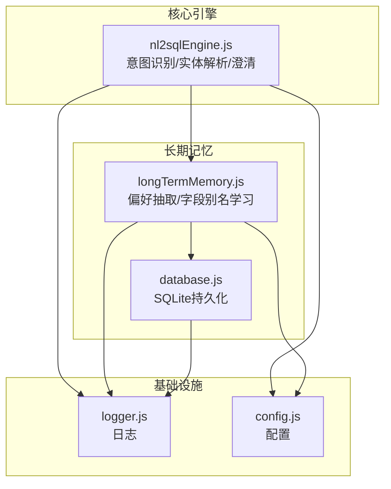
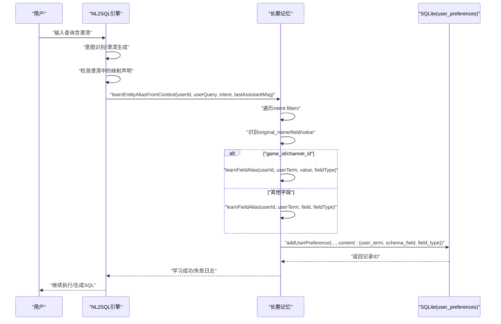
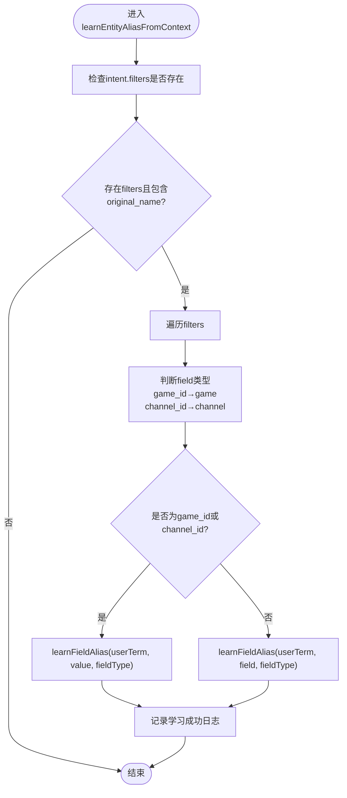
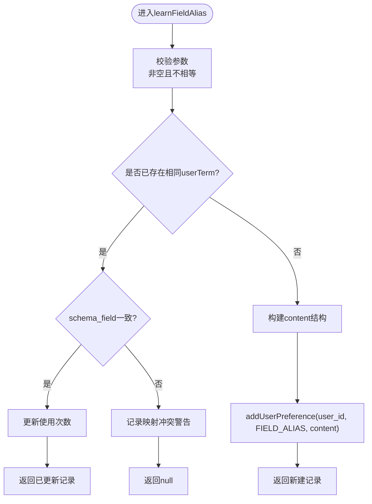
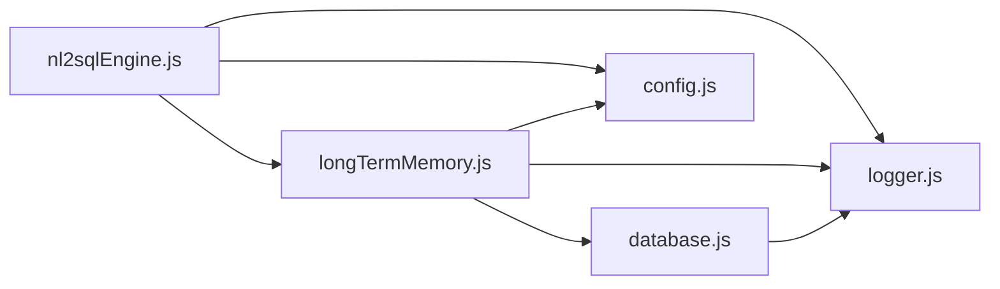

# 别名学习系统

<cite>
**本文引用的文件**
- [nl2sqlEngine.js](file://backend/src/core/nl2sqlEngine.js)
- [longTermMemory.js](file://backend/src/memory/longTermMemory.js)
- [database.js](file://backend/src/core/database.js)
- [logger.js](file://backend/src/utils/logger.js)
- [config.js](file://backend/src/core/config.js)
</cite>

## 目录
1. [简介](#简介)
2. [项目结构](#项目结构)
3. [核心组件](#核心组件)
4. [架构总览](#架构总览)
5. [详细组件分析](#详细组件分析)
6. [依赖关系分析](#依赖关系分析)
7. [性能考量](#性能考量)
8. [故障排查指南](#故障排查指南)
9. [结论](#结论)

## 简介
本文件面向NL2SQL引擎的“别名学习系统”，聚焦于learnEntityAliasFromContext函数的学习机制，系统性阐述：
- 用户澄清对话中的映射关系提取与持久化
- 字段类型判断与双记录/直接映射两种存储策略
- 用户自定义映射的识别逻辑（original_name字段检测、field类型判断、value提取）
- 学习触发条件、错误处理与日志记录
- 完整流程示例（用户输入分析、映射关系验证、长期记忆存储）

## 项目结构
本系统位于后端工程的core与memory两大模块中：
- 核心引擎：负责意图识别、实体解析、澄清与SQL生成
- 长期记忆：负责偏好抽取、字段别名学习、持久化存储与检索

图表来源
- [nl2sqlEngine.js:122-186](file://backend/src/core/nl2sqlEngine.js#L122-L186)
- [longTermMemory.js:771-825](file://backend/src/memory/longTermMemory.js#L771-L825)
- [database.js:609-618](file://backend/src/core/database.js#L609-L618)
- [logger.js:265-293](file://backend/src/utils/logger.js#L265-L293)
- [config.js:254-288](file://backend/src/core/config.js#L254-L288)

章节来源
- [nl2sqlEngine.js:122-186](file://backend/src/core/nl2sqlEngine.js#L122-L186)
- [longTermMemory.js:771-825](file://backend/src/memory/longTermMemory.js#L771-L825)
- [database.js:609-618](file://backend/src/core/database.js#L609-L618)

## 核心组件
- learnEntityAliasFromContext：从澄清对话中学习实体别名映射，自动持久化到长期记忆
- learnFieldAlias：通用字段别名学习入口，支持双记录与直接映射策略
- 数据持久化：通过SQLite表user_preferences存储别名映射，支持使用次数与时间追踪
- 日志与错误处理：统一使用logger模块记录学习过程与异常

章节来源
- [nl2sqlEngine.js:122-186](file://backend/src/core/nl2sqlEngine.js#L122-L186)
- [longTermMemory.js:771-825](file://backend/src/memory/longTermMemory.js#L771-L825)
- [database.js:609-618](file://backend/src/core/database.js#L609-L618)
- [logger.js:265-293](file://backend/src/utils/logger.js#L265-L293)

## 架构总览
别名学习在NL2SQL流程中的位置如下：
- 用户输入经由意图识别与澄清生成，若澄清中出现映射声明（如“青木是game_id=30”），引擎调用learnEntityAliasFromContext
- 该函数根据filter.original_name、filter.field、filter.value等字段识别映射关系
- 对game_id/channel_id采用直接映射（用户术语→ID值），其他字段采用常规映射（用户术语→Schema字段）
- 学习结果通过learnFieldAlias写入user_preferences表，供后续查询增强

图表来源
- [nl2sqlEngine.js:122-186](file://backend/src/core/nl2sqlEngine.js#L122-L186)
- [longTermMemory.js:771-825](file://backend/src/memory/longTermMemory.js#L771-L825)
- [database.js:609-618](file://backend/src/core/database.js#L609-L618)

## 详细组件分析

### learnEntityAliasFromContext：从上下文学习实体别名
- 触发条件：intent.filters存在且包含original_name字段
- 类型判断：根据filter.field决定field_type（game/channel）
- 存储策略：
  - game_id/channel_id：直接存“用户术语→ID值”，简化后续查询
  - 其他字段：存“用户术语→Schema字段”
- 学习入口：调用learnFieldAlias完成持久化

图表来源
- [nl2sqlEngine.js:122-186](file://backend/src/core/nl2sqlEngine.js#L122-L186)

章节来源
- [nl2sqlEngine.js:122-186](file://backend/src/core/nl2sqlEngine.js#L122-L186)

### learnFieldAlias：字段别名学习与持久化
- 输入校验：userTerm、schemaField非空且不相等
- 去重与冲突处理：若已存在相同userTerm，验证schema_field一致性；冲突记录警告
- 内容结构：content包含user_term、schema_field、field_type、初始置信度
- 持久化：通过addUserPreference写入user_preferences表

图表来源
- [longTermMemory.js:771-825](file://backend/src/memory/longTermMemory.js#L771-L825)
- [database.js:609-618](file://backend/src/core/database.js#L609-L618)

章节来源
- [longTermMemory.js:771-825](file://backend/src/memory/longTermMemory.js#L771-L825)
- [database.js:609-618](file://backend/src/core/database.js#L609-L618)

### 双记录格式 vs 直接映射格式
- 双记录格式（青木 -> game_id, 青木_value -> 30）
  - 适用场景：game_id字段的别名学习
  - 存储策略：同时写两条记录，第一条为“用户术语→game_id”，第二条为“用户术语_value→ID值”
  - 优点：查询时可灵活选择字段或值，增强解析鲁棒性
- 直接映射格式（青木 -> 30）
  - 适用场景：game_id/channel_id等ID直连字段
  - 存储策略：直接存“用户术语→ID值”，简化查询
  - 优点：减少冗余，查询效率更高

章节来源
- [longTermMemory.js:499-542](file://backend/src/memory/longTermMemory.js#L499-L542)
- [nl2sqlEngine.js:222-248](file://backend/src/core/nl2sqlEngine.js#L222-L248)

### 用户自定义映射识别逻辑
- original_name字段检测：用于识别用户输入中被解析出的原始术语
- field类型判断：根据filter.field映射到field_type（game/channel/filter）
- value提取：从filter.value获取ID值，用于直接映射
- 存储时机：在澄清轮中，即使需要进一步澄清，也尝试从用户输入中提取高价值映射声明

章节来源
- [nl2sqlEngine.js:132-186](file://backend/src/core/nl2sqlEngine.js#L132-L186)
- [nl2sqlEngine.js:1694-1710](file://backend/src/core/nl2sqlEngine.js#L1694-L1710)

### 学习触发条件、错误处理与日志记录
- 触发条件
  - 澄清轮中intent.filters存在original_name字段
  - game_id/channel_id字段的直接映射优先策略
- 错误处理
  - 学习过程中捕获异常并记录错误日志
  - 澄清轮即时学习失败不影响主流程，继续生成澄清问题
- 日志记录
  - 使用logger.info/warn/error输出学习过程与结果
  - 记录用户ID、用户术语、目标字段/值、字段类型等关键信息

章节来源
- [nl2sqlEngine.js:183-185](file://backend/src/core/nl2sqlEngine.js#L183-L185)
- [nl2sqlEngine.js:1694-1710](file://backend/src/core/nl2sqlEngine.js#L1694-L1710)
- [logger.js:265-293](file://backend/src/utils/logger.js#L265-L293)

### 别名学习完整流程示例（步骤化）
- 步骤1：用户输入“青木是游戏名称，对应game_id=30”
- 步骤2：意图识别生成filters，包含original_name="青木"、field="game_id"、value="30"
- 步骤3：learnEntityAliasFromContext检测到映射声明，判断field_type为game
- 步骤4：由于field为game_id，采用直接映射策略，调用learnFieldAlias("青木","30","game")
- 步骤5：learnFieldAlias写入user_preferences表，content为{"user_term":"青木","schema_field":"30","field_type":"game"}
- 步骤6：后续查询中若出现“青木”，系统自动解析为game_id=30并加入filters

章节来源
- [nl2sqlEngine.js:122-186](file://backend/src/core/nl2sqlEngine.js#L122-L186)
- [longTermMemory.js:771-825](file://backend/src/memory/longTermMemory.js#L771-L825)
- [database.js:609-618](file://backend/src/core/database.js#L609-L618)

## 依赖关系分析
- 模块耦合
  - nl2sqlEngine依赖longTermMemory进行别名学习
  - longTermMemory依赖database进行持久化
  - logger贯穿各层，统一记录学习与错误
- 外部依赖
  - SQLite：user_preferences表存储别名映射
  - 配置：长期记忆开关、阈值、保留策略等

图表来源
- [nl2sqlEngine.js:122-186](file://backend/src/core/nl2sqlEngine.js#L122-L186)
- [longTermMemory.js:771-825](file://backend/src/memory/longTermMemory.js#L771-L825)
- [database.js:609-618](file://backend/src/core/database.js#L609-L618)
- [logger.js:265-293](file://backend/src/utils/logger.js#L265-L293)
- [config.js:254-288](file://backend/src/core/config.js#L254-L288)

章节来源
- [nl2sqlEngine.js:122-186](file://backend/src/core/nl2sqlEngine.js#L122-L186)
- [longTermMemory.js:771-825](file://backend/src/memory/longTermMemory.js#L771-L825)
- [database.js:609-618](file://backend/src/core/database.js#L609-L618)
- [logger.js:265-293](file://backend/src/utils/logger.js#L265-L293)
- [config.js:254-288](file://backend/src/core/config.js#L254-L288)

## 性能考量
- 存储策略选择
  - 直接映射（ID值）减少冗余，查询更快
  - 双记录格式增加存储与检索成本，但提升解析灵活性
- 索引与查询
  - user_preferences表对user_id、preference_type建立索引，有利于按用户与类型检索
  - JSON字段查询（content）需谨慎，建议仅在必要时使用
- 使用次数与时间追踪
  - 通过usage_count与last_used_at排序，有助于后续模板与偏好推荐

章节来源
- [database.js:159-164](file://backend/src/core/database.js#L159-L164)
- [database.js:656-666](file://backend/src/core/database.js#L656-666)

## 故障排查指南
- 学习未生效
  - 检查是否处于澄清轮且intent.filters包含original_name
  - 确认filter.field为game_id或channel_id时采用直接映射
- 存储冲突
  - 若同一user_term映射到不同schema_field，系统记录冲突警告
  - 建议人工核对并删除冲突记录
- 日志定位
  - 使用info/warn/error日志定位学习过程与异常
  - 关注“学习字段别名失败”、“字段别名映射冲突”等关键日志

章节来源
- [nl2sqlEngine.js:183-185](file://backend/src/core/nl2sqlEngine.js#L183-L185)
- [longTermMemory.js:795-803](file://backend/src/memory/longTermMemory.js#L795-L803)
- [logger.js:265-293](file://backend/src/utils/logger.js#L265-L293)

## 结论
别名学习系统通过learnEntityAliasFromContext与learnFieldAlias实现了对用户澄清对话中映射关系的自动化学习与持久化。系统支持双记录与直接映射两种策略，结合严格的类型判断与冲突处理，既保证了查询效率，又提升了解析鲁棒性。完善的日志与错误处理机制使得系统具备良好的可观测性与可维护性。