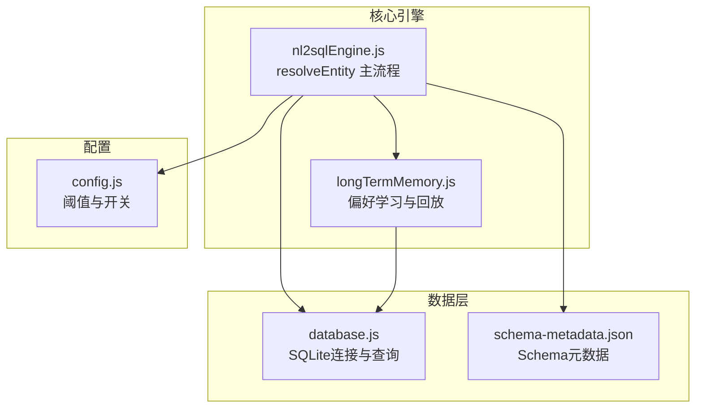
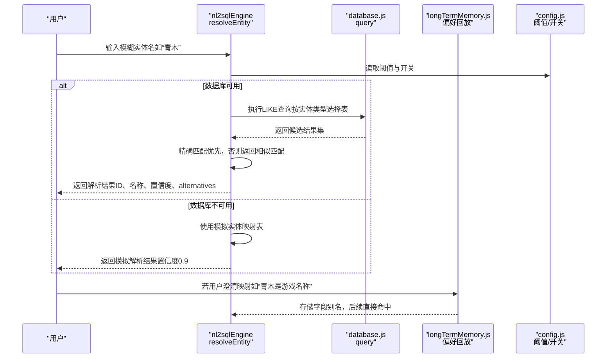
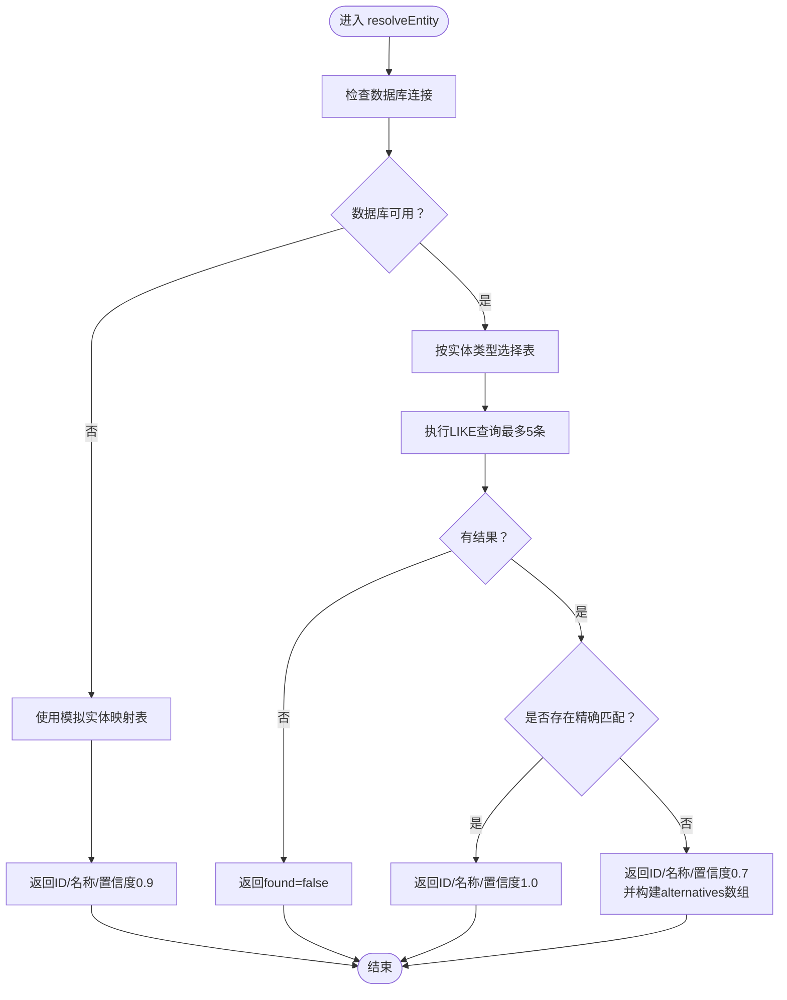
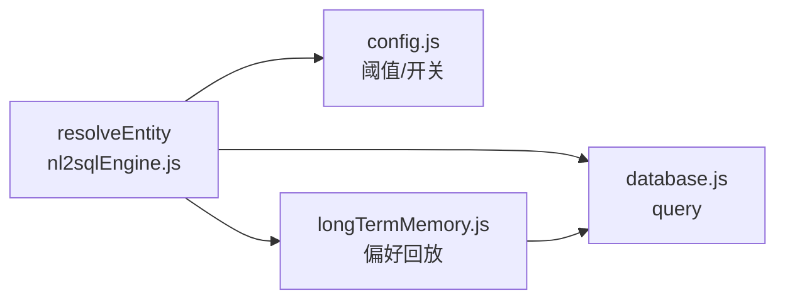

# 基础实体解析

<cite>
**本文引用的文件**
- [nl2sqlEngine.js](file://backend/src/core/nl2sqlEngine.js)
- [database.js](file://backend/src/core/database.js)
- [longTermMemory.js](file://backend/src/memory/longTermMemory.js)
- [config.js](file://backend/src/core/config.js)
- [schema-metadata.json](file://backend/config/schema-metadata.json)
</cite>

## 目录
1. [简介](#简介)
2. [项目结构](#项目结构)
3. [核心组件](#核心组件)
4. [架构总览](#架构总览)
5. [详细组件分析](#详细组件分析)
6. [依赖关系分析](#依赖关系分析)
7. [性能考量](#性能考量)
8. [故障排查指南](#故障排查指南)
9. [结论](#结论)

## 简介
本文件聚焦NL2SQL引擎中的“基础实体解析”能力，围绕resolveEntity函数展开，系统性阐述：
- 模糊匹配算法与相似度判定
- 置信度计算策略（1.0精确匹配、0.7相似匹配、0.9模拟数据匹配）
- 游戏名称、渠道名称等业务实体的解析流程
- 数据库查询策略、精确匹配优先级与替代方案推荐
- 错误处理策略、数据库连接异常处理与模拟数据回退机制
- 实体解析的完整流程示例（LIKE查询、结果排序与alternatives数组构建）

## 项目结构
本项目采用“核心模块 + 记忆模块 + 数据库模块”的分层组织。与实体解析直接相关的关键文件如下：
- backend/src/core/nl2sqlEngine.js：包含resolveEntity主流程与实体解析辅助逻辑
- backend/src/core/database.js：封装SQLite数据库连接与查询接口
- backend/src/memory/longTermMemory.js：长期记忆与偏好学习，支撑实体映射的回放
- backend/src/core/config.js：全局配置，影响实体解析的阈值与行为
- backend/config/schema-metadata.json：Schema元数据，指导意图识别与实体映射

图表来源
- [nl2sqlEngine.js](file://backend/src/core/nl2sqlEngine.js)
- [database.js](file://backend/src/core/database.js)
- [longTermMemory.js](file://backend/src/memory/longTermMemory.js)
- [config.js](file://backend/src/core/config.js)
- [schema-metadata.json](file://backend/config/schema-metadata.json)

章节来源
- [nl2sqlEngine.js](file://backend/src/core/nl2sqlEngine.js)
- [database.js](file://backend/src/core/database.js)
- [longTermMemory.js](file://backend/src/memory/longTermMemory.js)
- [config.js](file://backend/src/core/config.js)
- [schema-metadata.json](file://backend/config/schema-metadata.json)

## 核心组件
- 实体解析主函数：resolveEntity，负责将模糊实体名（如“青木”）解析为具体ID（如game_id=30），并返回置信度与备选列表
- 数据库查询接口：database.js提供query方法，支持参数化查询与错误捕获
- 长期记忆：longTermMemory.js支持字段别名学习与回放，提升实体解析的准确性
- 配置与阈值：config.js提供长期记忆阈值、置信度阈值等，影响实体解析策略

章节来源
- [nl2sqlEngine.js](file://backend/src/core/nl2sqlEngine.js)
- [database.js](file://backend/src/core/database.js)
- [longTermMemory.js](file://backend/src/memory/longTermMemory.js)
- [config.js](file://backend/src/core/config.js)

## 架构总览
实体解析在NL2SQL整体流程中的位置与交互如下：

图表来源
- [nl2sqlEngine.js](file://backend/src/core/nl2sqlEngine.js)
- [database.js](file://backend/src/core/database.js)
- [longTermMemory.js](file://backend/src/memory/longTermMemory.js)
- [config.js](file://backend/src/core/config.js)

## 详细组件分析

### resolveEntity 函数工作原理
- 输入：实体名（如“青木”）、实体类型（如“game”、“channel”）
- 输出：包含found、id、name、confidence、可选alternatives的对象
- 优先级与策略：
  1) 数据库可用时：按实体类型选择表，执行LIKE查询，返回最多5条候选
  2) 精确匹配优先：若存在完全匹配的name，返回ID与置信度1.0
  3) 相似匹配：若无精确匹配，返回第一条候选，置信度0.7，并附带alternatives数组（其余候选）
  4) 数据库不可用时：回退到模拟实体映射表，返回置信度0.9
- 错误处理：捕获数据库查询异常，返回found=false并携带错误信息

图表来源
- [nl2sqlEngine.js](file://backend/src/core/nl2sqlEngine.js)

章节来源
- [nl2sqlEngine.js](file://backend/src/core/nl2sqlEngine.js)

### 模糊匹配算法与相似度计算
- LIKE查询策略：对实体名使用“%实体名%”进行模糊匹配，返回最多5条候选
- 精确匹配优先：在候选集中查找name与实体名完全相等的记录
- 相似度判定：若无精确匹配，第一条候选即为最相似项（置信度0.7）
- alternatives数组：除第一条外的其余候选，按原查询结果顺序排列，便于用户二次确认

章节来源
- [nl2sqlEngine.js](file://backend/src/core/nl2sqlEngine.js)

### 置信度计算方法
- 1.0：精确匹配（name完全等于实体名）
- 0.7：相似匹配（无精确匹配时，返回第一条候选）
- 0.9：模拟数据匹配（数据库不可用时，使用内置映射表）
- 其他场景：数据库查询异常时，返回found=false并携带错误信息

章节来源
- [nl2sqlEngine.js](file://backend/src/core/nl2sqlEngine.js)

### 游戏名称与渠道名称解析流程
- 游戏名称解析：
  - 实体类型为“game”，查询game_list表，字段映射为game_id与game_name
  - 若LLM已识别game_id，直接使用；否则调用resolveEntity进行解析
- 渠道名称解析：
  - 实体类型为“channel”，查询channel_list表，字段映射为channel_id与channel_name
  - 解析流程与游戏名称一致
- 解析后写入意图filters：
  - resolveEntitiesInIntent会将解析结果写入intent.filters，字段为game_id或channel_id，值为解析得到的ID

章节来源
- [nl2sqlEngine.js](file://backend/src/core/nl2sqlEngine.js)

### 数据库查询策略与精确匹配优先级
- 查询策略：
  - 使用参数化LIKE查询，避免SQL注入风险
  - 限制返回数量为5条，兼顾性能与召回
- 精确匹配优先级：
  - 优先返回name与实体名完全一致的记录
  - 无精确匹配时，返回第一条候选并标记置信度0.7
- 替代方案推荐：
  - alternatives数组包含其余候选，便于用户二次确认

章节来源
- [nl2sqlEngine.js](file://backend/src/core/nl2sqlEngine.js)
- [database.js](file://backend/src/core/database.js)

### 错误处理策略与模拟数据回退机制
- 数据库连接异常：
  - database.js在连接失败时抛出错误并记录日志
  - resolveEntity捕获异常，返回found=false并携带错误信息
- 模拟数据回退：
  - 当数据库不可用时，resolveEntity使用内置mockEntities映射表
  - 返回置信度0.9，作为兜底策略保障系统可用性

章节来源
- [nl2sqlEngine.js](file://backend/src/core/nl2sqlEngine.js)
- [database.js](file://backend/src/core/database.js)

### 实体解析完整流程示例（步骤说明）
以下为“游戏名称解析”的完整流程步骤（不含具体代码片段）：
1) 用户输入模糊实体名（如“青木”）
2) resolveEntity根据实体类型选择表（game_list）
3) 执行LIKE查询，返回最多5条候选
4) 在候选集中查找精确匹配（name完全等于“青木”）
5) 若存在精确匹配，返回ID、名称与置信度1.0
6) 若无精确匹配，返回第一条候选与置信度0.7，并构建alternatives数组
7) 若数据库不可用，使用模拟映射表返回ID、名称与置信度0.9
8) 若解析成功，resolveEntitiesInIntent将结果写入intent.filters

章节来源
- [nl2sqlEngine.js](file://backend/src/core/nl2sqlEngine.js)

## 依赖关系分析
- resolveEntity依赖database.js提供的query方法与SQLite连接
- 长期记忆模块longTermMemory.js通过learnFieldAlias等接口学习并回放字段别名，间接提升resolveEntity的命中率
- 配置模块config.js提供阈值与开关，影响实体解析的存储与回放策略

图表来源
- [nl2sqlEngine.js](file://backend/src/core/nl2sqlEngine.js)
- [database.js](file://backend/src/core/database.js)
- [longTermMemory.js](file://backend/src/memory/longTermMemory.js)
- [config.js](file://backend/src/core/config.js)

章节来源
- [nl2sqlEngine.js](file://backend/src/core/nl2sqlEngine.js)
- [database.js](file://backend/src/core/database.js)
- [longTermMemory.js](file://backend/src/memory/longTermMemory.js)
- [config.js](file://backend/src/core/config.js)

## 性能考量
- 查询限制：每次LIKE查询最多返回5条候选，降低数据库压力
- 参数化查询：使用参数绑定避免SQL注入，提高安全性
- 精确匹配优先：减少不必要的相似度计算与排序
- 模拟数据回退：在数据库不可用时快速返回，避免阻塞

## 故障排查指南
- 数据库连接失败：
  - 检查database.js初始化日志与错误信息
  - 确认数据库文件路径与权限
- 实体解析失败：
  - 查看resolveEntity返回的错误信息
  - 确认实体类型与目标表字段映射是否正确
- 置信度异常：
  - 检查是否命中模拟数据回退（置信度0.9）
  - 确认是否存在精确匹配（置信度1.0）
- 长期记忆未生效：
  - 检查longTermMemory.js的学习与回放流程
  - 确认字段别名是否正确存储与检索

章节来源
- [nl2sqlEngine.js](file://backend/src/core/nl2sqlEngine.js)
- [database.js](file://backend/src/core/database.js)
- [longTermMemory.js](file://backend/src/memory/longTermMemory.js)

## 结论
resolveEntity通过“精确匹配优先 + 相似匹配兜底 + 模拟数据回退”的三层策略，实现了对游戏名称、渠道名称等业务实体的稳健解析。配合长期记忆的偏好学习与回放，系统在数据库异常或数据缺失时仍能提供可靠的服务。置信度体系清晰地反映了解析质量，便于上层意图识别与澄清机制协同工作。