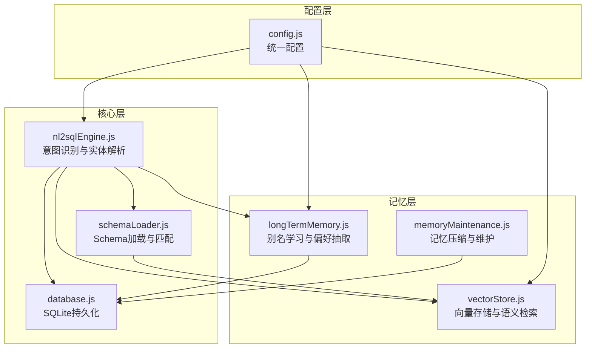
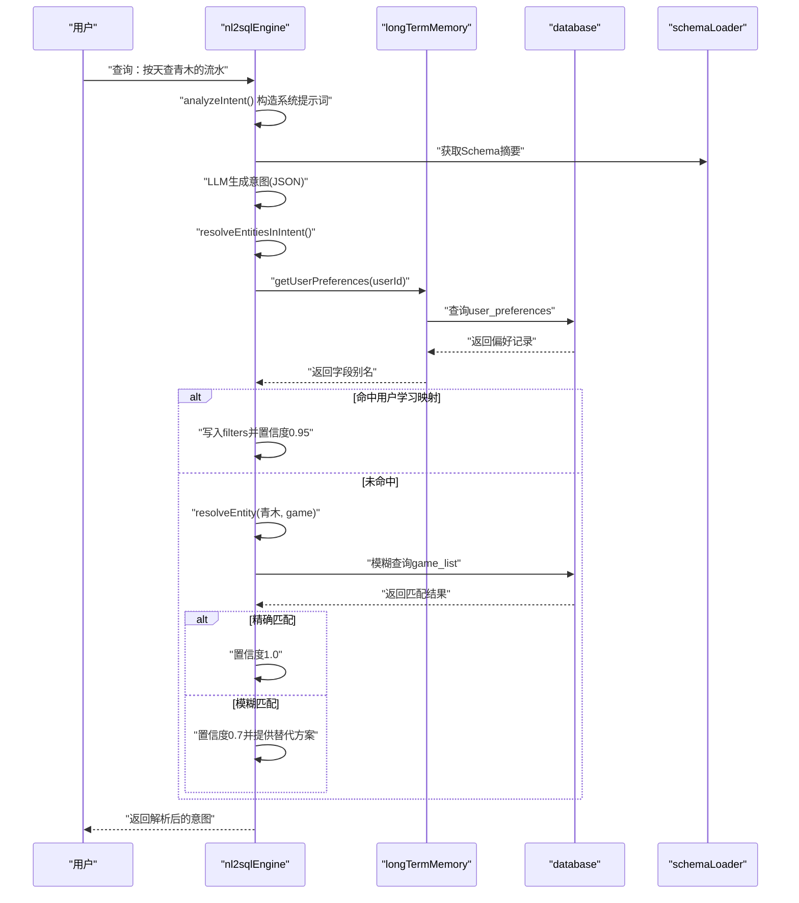
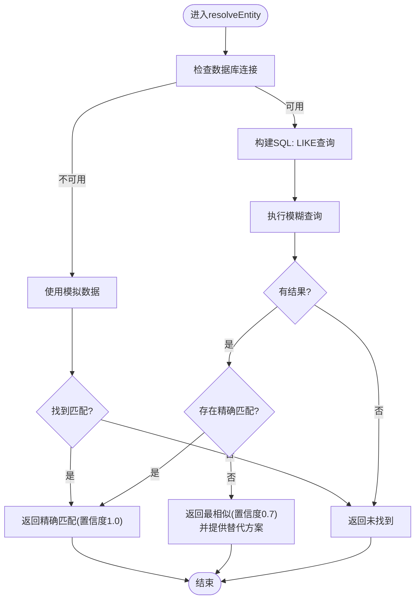
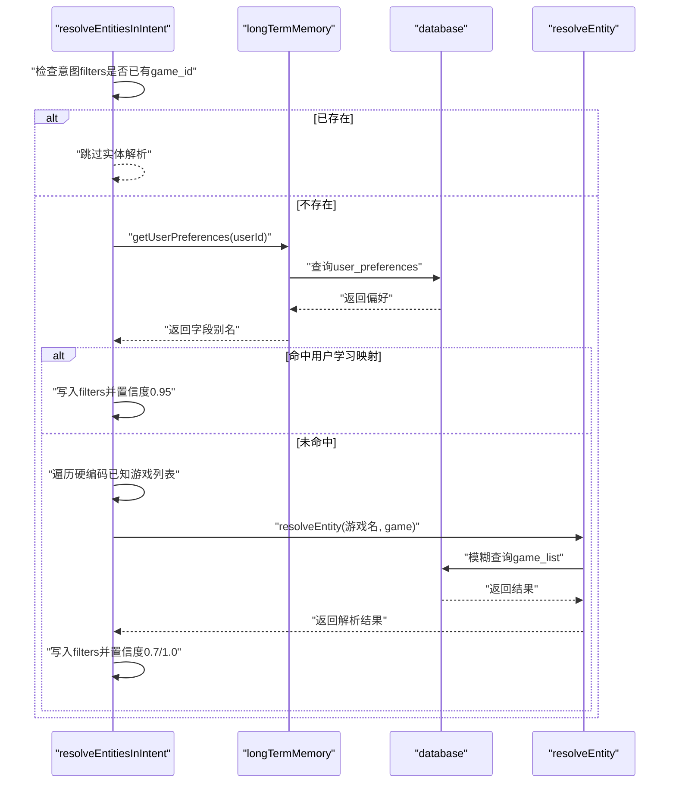
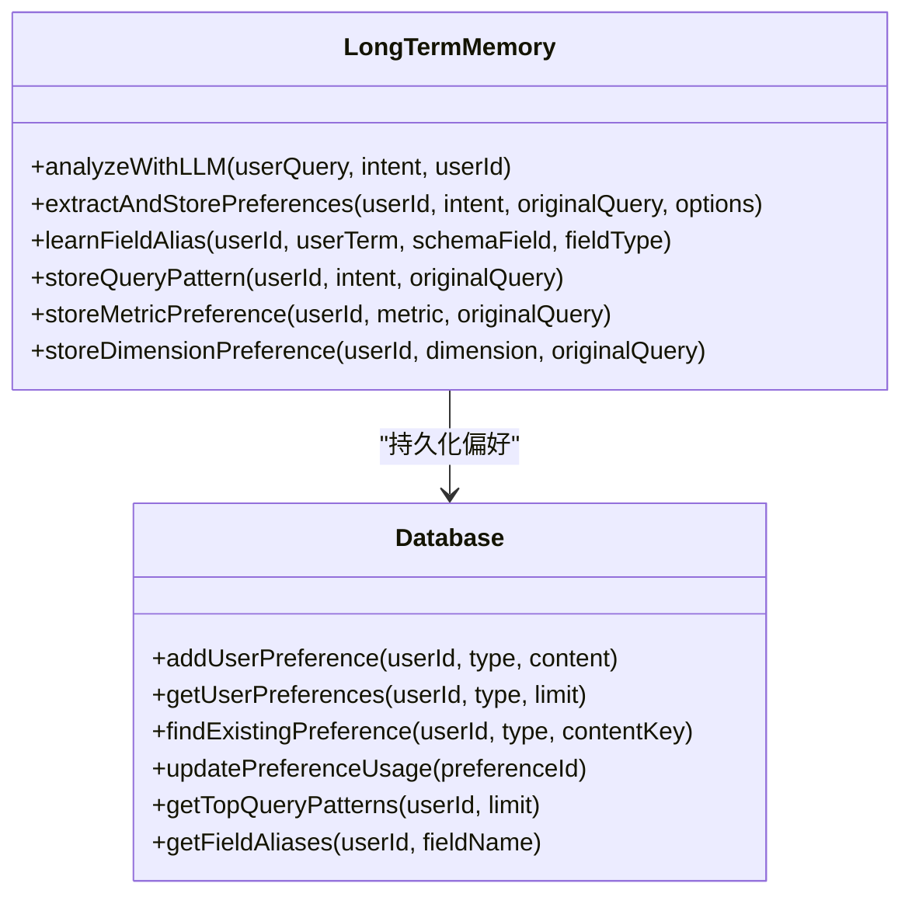
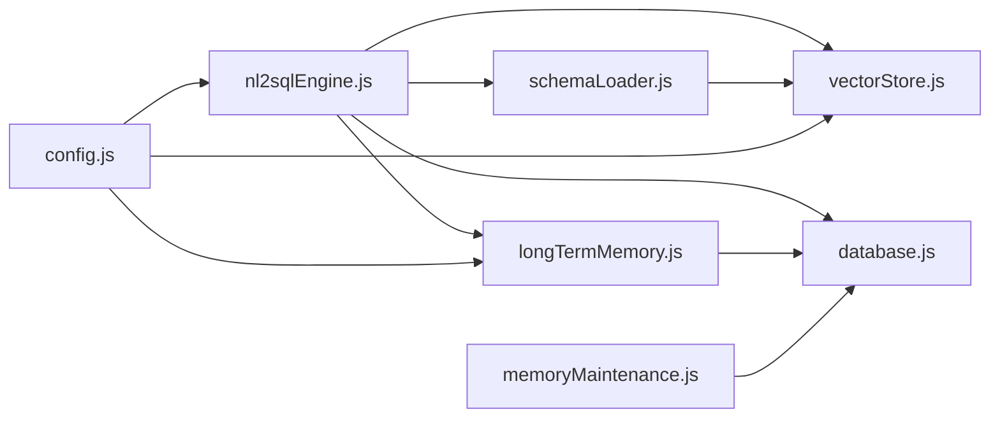

# 实体解析与映射

<cite>
**本文引用的文件**
- [nl2sqlEngine.js](file://backend/src/core/nl2sqlEngine.js)
- [longTermMemory.js](file://backend/src/memory/longTermMemory.js)
- [vectorStore.js](file://backend/src/memory/vectorStore.js)
- [schemaLoader.js](file://backend/src/core/schemaLoader.js)
- [database.js](file://backend/src/core/database.js)
- [config.js](file://backend/src/core/config.js)
- [memoryMaintenance.js](file://backend/src/memory/memoryMaintenance.js)
- [schema-metadata.example.json](file://backend/config/schema-metadata.example.json)
</cite>

## 目录
1. [简介](#简介)
2. [项目结构](#项目结构)
3. [核心组件](#核心组件)
4. [架构总览](#架构总览)
5. [详细组件分析](#详细组件分析)
6. [依赖关系分析](#依赖关系分析)
7. [性能考虑](#性能考虑)
8. [故障排查指南](#故障排查指南)
9. [结论](#结论)
10. [附录](#附录)

## 简介
本文件面向NL2SQL引擎的实体解析模块，系统性阐述实体解析算法的工作原理，包括模糊匹配策略、相似度计算与歧义消解机制；详解游戏名称、渠道名称等业务实体的解析流程，涵盖数据库查询、缓存机制与回退策略；说明别名学习机制，包括用户自定义映射、自动学习与持久化存储；提供具体流程示例与配置参数、性能优化技巧及错误处理策略，并阐明与长期记忆系统的集成关系与数据流转过程。

## 项目结构
NL2SQL引擎采用分层架构，实体解析位于核心层，与Schema加载、向量存储、数据库、长期记忆等模块协同工作。关键文件与职责如下：
- 核心引擎：负责意图识别、实体解析、平台术语解析与流程编排
- 长期记忆：负责用户偏好抽取、别名学习、模式合并与清理
- 向量存储：负责Schema与查询历史的向量化与语义检索
- Schema加载：负责Schema元数据加载、缓存与表/字段匹配
- 数据库：负责SQLite持久化与用户偏好存储
- 配置：集中管理LLM、向量、数据库、安全等配置

图表来源
- [nl2sqlEngine.js:1-200](file://backend/src/core/nl2sqlEngine.js#L1-L200)
- [longTermMemory.js:1-120](file://backend/src/memory/longTermMemory.js#L1-L120)
- [vectorStore.js:1-120](file://backend/src/memory/vectorStore.js#L1-L120)
- [schemaLoader.js:1-120](file://backend/src/core/schemaLoader.js#L1-L120)
- [database.js:1-120](file://backend/src/core/database.js#L1-L120)
- [config.js:1-120](file://backend/src/core/config.js#L1-L120)

章节来源
- [nl2sqlEngine.js:1-200](file://backend/src/core/nl2sqlEngine.js#L1-L200)
- [longTermMemory.js:1-120](file://backend/src/memory/longTermMemory.js#L1-L120)
- [vectorStore.js:1-120](file://backend/src/memory/vectorStore.js#L1-L120)
- [schemaLoader.js:1-120](file://backend/src/core/schemaLoader.js#L1-L120)
- [database.js:1-120](file://backend/src/core/database.js#L1-L120)
- [config.js:1-120](file://backend/src/core/config.js#L1-L120)

## 核心组件
- 实体解析器：负责将模糊描述（如“青木”）映射到具体ID（如game_id=30），支持精确匹配与模糊匹配，提供替代方案推荐
- 别名学习器：从用户澄清与上下文中学习实体映射，支持用户自定义映射、LLM智能抽取与持久化存储
- 平台术语解析器：解析“新平台/老平台”等术语到数据库标识
- 长期记忆管理：负责偏好抽取、存储、合并与清理，实现分级保留策略
- 向量检索：基于LanceDB实现Schema与查询历史的语义检索，提升匹配质量
- Schema加载与缓存：加载JSON配置，构建映射，支持缓存与向量化

章节来源
- [nl2sqlEngine.js:35-108](file://backend/src/core/nl2sqlEngine.js#L35-L108)
- [longTermMemory.js:47-188](file://backend/src/memory/longTermMemory.js#L47-L188)
- [vectorStore.js:229-320](file://backend/src/memory/vectorStore.js#L229-L320)
- [schemaLoader.js:69-122](file://backend/src/core/schemaLoader.js#L69-L122)

## 架构总览
实体解析与映射的整体流程如下：
- 用户输入经意图识别模块解析为意图对象，包含metrics、dimensions、filters等
- 实体解析模块根据意图中的filters与用户查询，尝试从长期记忆中加载用户学习的字段别名
- 若未命中，回退到硬编码映射或数据库模糊查询
- 解析成功后，将实体ID写入filters，置信度由解析质量决定
- 别名学习模块从澄清轮中提取映射关系，持久化到SQLite

图表来源
- [nl2sqlEngine.js:497-780](file://backend/src/core/nl2sqlEngine.js#L497-L780)
- [longTermMemory.js:311-383](file://backend/src/memory/longTermMemory.js#L311-L383)
- [database.js:627-649](file://backend/src/core/database.js#L627-L649)
- [schemaLoader.js:614-628](file://backend/src/core/schemaLoader.js#L614-L628)

章节来源
- [nl2sqlEngine.js:497-780](file://backend/src/core/nl2sqlEngine.js#L497-L780)
- [longTermMemory.js:311-383](file://backend/src/memory/longTermMemory.js#L311-L383)
- [database.js:627-649](file://backend/src/core/database.js#L627-L649)
- [schemaLoader.js:614-628](file://backend/src/core/schemaLoader.js#L614-L628)

## 详细组件分析

### 实体解析算法与模糊匹配策略
- 输入：实体名称（如“青木”）、实体类型（如“game”）
- 输出：解析结果对象，包含found、id、name、confidence、alternatives等
- 算法步骤：
  1) 若数据库连接可用，按实体类型选择对应表（game_list/channel_list）
  2) 执行LIKE模糊查询，限制返回前5条
  3) 若存在精确匹配，直接返回，置信度1.0
  4) 否则返回第一条作为最相似结果，置信度0.7，并提供替代方案数组
  5) 异常捕获并返回错误信息

图表来源
- [nl2sqlEngine.js:42-108](file://backend/src/core/nl2sqlEngine.js#L42-L108)

章节来源
- [nl2sqlEngine.js:42-108](file://backend/src/core/nl2sqlEngine.js#L42-L108)

### 相似度计算与歧义消解机制
- 相似度计算：模糊查询返回多条候选，优先精确匹配；若无精确匹配，取第一条作为最相似，置信度0.7
- 替代方案推荐：返回第二条及之后的候选用作替代，供用户确认
- 置信度策略：精确匹配1.0，模糊匹配0.7，用户学习映射0.95（来自长期记忆）

章节来源
- [nl2sqlEngine.js:82-100](file://backend/src/core/nl2sqlEngine.js#L82-L100)

### 游戏名称与渠道名称解析流程
- 解析入口：resolveEntitiesInIntent
- 优先级：
  1) 若意图中已存在game_id或channel_id过滤器，直接返回（LLM已识别）
  2) 从长期记忆加载用户偏好，匹配用户查询中的术语
  3) 若匹配到“青木_value -> 30”的值映射，或直接映射“青木 -> 30”，写入filters
  4) 若未命中，回退到硬编码已知游戏列表，匹配后调用resolveEntity进行模糊查询
  5) 将解析结果写入filters，original_name标注来源

图表来源
- [nl2sqlEngine.js:195-300](file://backend/src/core/nl2sqlEngine.js#L195-L300)
- [longTermMemory.js:311-383](file://backend/src/memory/longTermMemory.js#L311-L383)
- [database.js:627-649](file://backend/src/core/database.js#L627-L649)
- [nl2sqlEngine.js:269-295](file://backend/src/core/nl2sqlEngine.js#L269-L295)

章节来源
- [nl2sqlEngine.js:195-300](file://backend/src/core/nl2sqlEngine.js#L195-L300)
- [longTermMemory.js:311-383](file://backend/src/memory/longTermMemory.js#L311-L383)
- [database.js:627-649](file://backend/src/core/database.js#L627-L649)
- [nl2sqlEngine.js:269-295](file://backend/src/core/nl2sqlEngine.js#L269-L295)

### 别名学习机制（用户自定义映射、自动学习与持久化）
- 学习触发：用户在澄清轮中提供映射关系（如“青木是游戏名称，对应game_id=30”）
- 学习方式：
  - 即时学习：从澄清文本中提取映射，支持Markdown表格、键值对、显式声明等格式
  - LLM智能抽取：根据用户查询与意图，判断是否值得存储为长期记忆
  - 持久化：存储到SQLite user_preferences表，支持字段别名、查询模式、指标/维度偏好
- 存储策略：
  - 字段别名：支持双记录格式（用户术语->字段名，用户术语_value->值）
  - 查询模式：按使用次数与最近使用时间排序，支持合并相似模式
  - 清理策略：分级保留（高频永久、中频90天、低频30天、字段别名365天）

图表来源
- [longTermMemory.js:311-484](file://backend/src/memory/longTermMemory.js#L311-L484)
- [database.js:609-751](file://backend/src/core/database.js#L609-L751)

章节来源
- [longTermMemory.js:47-188](file://backend/src/memory/longTermMemory.js#L47-L188)
- [longTermMemory.js:311-484](file://backend/src/memory/longTermMemory.js#L311-L484)
- [database.js:609-751](file://backend/src/core/database.js#L609-L751)

### 平台术语解析（新平台/老平台）
- 解析入口：resolvePlatformInIntent
- 优先级：
  1) 从长期记忆加载用户学习的datasource映射
  2) 若未命中，回退到硬编码映射（新平台/new_tzpingtai，老平台/new_tzpingtaiold）
- 写入filters：若filters中不存在datasource，写入对应值并标注original_name

章节来源
- [nl2sqlEngine.js:309-383](file://backend/src/core/nl2sqlEngine.js#L309-L383)

### 与长期记忆系统的集成关系与数据流转
- 数据流：
  - 意图识别完成后，调用resolveEntitiesInIntent与resolvePlatformInIntent
  - 从长期记忆加载用户偏好，若命中则直接写入filters
  - 未命中时，回退到数据库模糊查询或硬编码映射
  - 别名学习：从澄清轮提取映射，持久化到SQLite
- 集成点：
  - 长期记忆：user_preferences表，支持字段别名、查询模式、指标/维度偏好
  - 向量存储：用于Schema与查询历史的语义检索，间接提升匹配质量
  - Schema加载：提供表/字段信息，支撑别名学习与解析

章节来源
- [nl2sqlEngine.js:497-780](file://backend/src/core/nl2sqlEngine.js#L497-L780)
- [longTermMemory.js:311-484](file://backend/src/memory/longTermMemory.js#L311-L484)
- [vectorStore.js:229-320](file://backend/src/memory/vectorStore.js#L229-L320)
- [schemaLoader.js:614-628](file://backend/src/core/schemaLoader.js#L614-L628)

## 依赖关系分析

图表来源
- [nl2sqlEngine.js:16-30](file://backend/src/core/nl2sqlEngine.js#L16-L30)
- [longTermMemory.js:17-21](file://backend/src/memory/longTermMemory.js#L17-L21)
- [vectorStore.js:14-19](file://backend/src/memory/vectorStore.js#L14-L19)
- [schemaLoader.js:19-26](file://backend/src/core/schemaLoader.js#L19-L26)
- [database.js:12-20](file://backend/src/core/database.js#L12-L20)
- [config.js:16-372](file://backend/src/core/config.js#L16-L372)

章节来源
- [nl2sqlEngine.js:16-30](file://backend/src/core/nl2sqlEngine.js#L16-L30)
- [longTermMemory.js:17-21](file://backend/src/memory/longTermMemory.js#L17-L21)
- [vectorStore.js:14-19](file://backend/src/memory/vectorStore.js#L14-L19)
- [schemaLoader.js:19-26](file://backend/src/core/schemaLoader.js#L19-L26)
- [database.js:12-20](file://backend/src/core/database.js#L12-L20)
- [config.js:16-372](file://backend/src/core/config.js#L16-L372)

## 性能考虑
- 数据库查询优化：
  - 使用LIKE模糊查询时限制返回条数（LIMIT 5），减少IO与网络开销
  - 精确匹配优先，避免不必要的模糊匹配
- 长期记忆优化：
  - 使用SQLite索引（user_id、preference_type、复合索引）加速查询
  - 分级保留策略降低存储与查询压力
- 向量检索优化：
  - 向量表按需初始化，避免重复向量化
  - 语义搜索失败时回退关键词匹配，保证可用性
- 配置优化：
  - 通过配置调整缓存过期时间、阈值与超时参数
  - 控制最大查询行数与查询超时，防止资源耗尽

章节来源
- [nl2sqlEngine.js:72-80](file://backend/src/core/nl2sqlEngine.js#L72-L80)
- [database.js:159-164](file://backend/src/core/database.js#L159-L164)
- [memoryMaintenance.js:24-46](file://backend/src/memory/memoryMaintenance.js#L24-L46)
- [vectorStore.js:229-259](file://backend/src/memory/vectorStore.js#L229-L259)
- [config.js:235-245](file://backend/src/core/config.js#L235-L245)

## 故障排查指南
- 实体解析失败：
  - 检查数据库连接是否可用，若不可用将使用模拟数据
  - 查看日志中的错误信息，确认SQL执行与参数绑定
- 别名学习失败：
  - 确认用户输入是否符合映射格式（Markdown表格、键值对、显式声明）
  - 检查SQLite表结构与索引是否正常
- 向量检索异常：
  - 确认LanceDB初始化状态与表是否存在
  - 检查嵌入维度与模型配置是否一致
- 长期记忆清理：
  - 定期执行记忆压缩，避免无效偏好占用空间
  - 检查保留策略配置，确保字段别名等稳定偏好得到保留

章节来源
- [nl2sqlEngine.js:48-67](file://backend/src/core/nl2sqlEngine.js#L48-L67)
- [longTermMemory.js:184-187](file://backend/src/memory/longTermMemory.js#L184-L187)
- [vectorStore.js:235-259](file://backend/src/memory/vectorStore.js#L235-L259)
- [memoryMaintenance.js:69-120](file://backend/src/memory/memoryMaintenance.js#L69-L120)

## 结论
NL2SQL引擎的实体解析模块通过“精确匹配优先、模糊匹配兜底、长期记忆增强”的策略，实现了对游戏名称、渠道名称等业务实体的高效解析。结合别名学习机制与长期记忆的分级保留策略，系统能够持续优化解析质量与用户体验。向量检索与Schema缓存进一步提升了匹配的准确性与性能。通过合理的配置与维护策略，系统可在保证稳定性的同时持续学习与演进。

## 附录
- 配置参数要点（来自config.js）：
  - LLM与嵌入模型：模型名称、维度、超时
  - 数据库与向量数据库路径
  - 安全配置：白名单、最大查询行数、超时、禁止关键字
  - 长期记忆：启用开关、阈值、保留策略
  - 上下文管理：Token预算、摘要策略
- 示例Schema（来自schema-metadata.example.json）：
  - 表结构、字段定义、关系、指标与维度
  - 用于向量化与语义检索的基础数据

章节来源
- [config.js:60-130](file://backend/src/core/config.js#L60-L130)
- [config.js:254-288](file://backend/src/core/config.js#L254-L288)
- [schema-metadata.example.json:1-328](file://backend/config/schema-metadata.example.json#L1-L328)