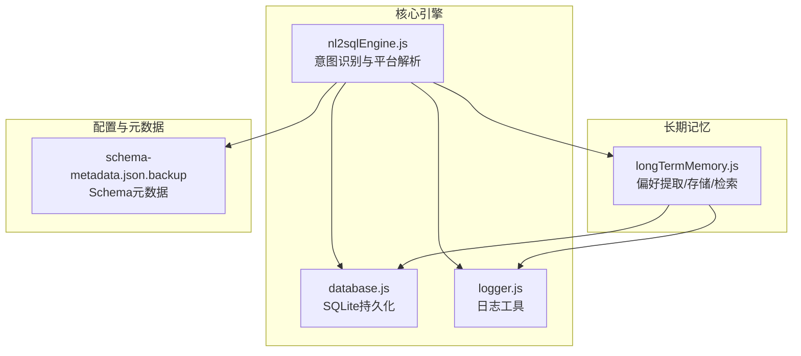
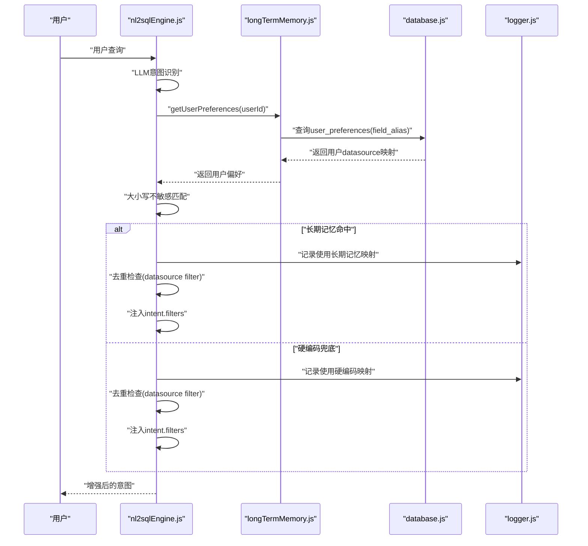
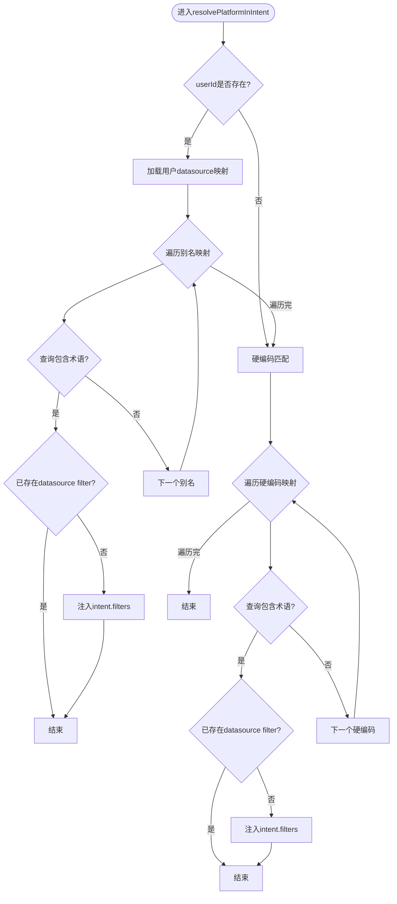
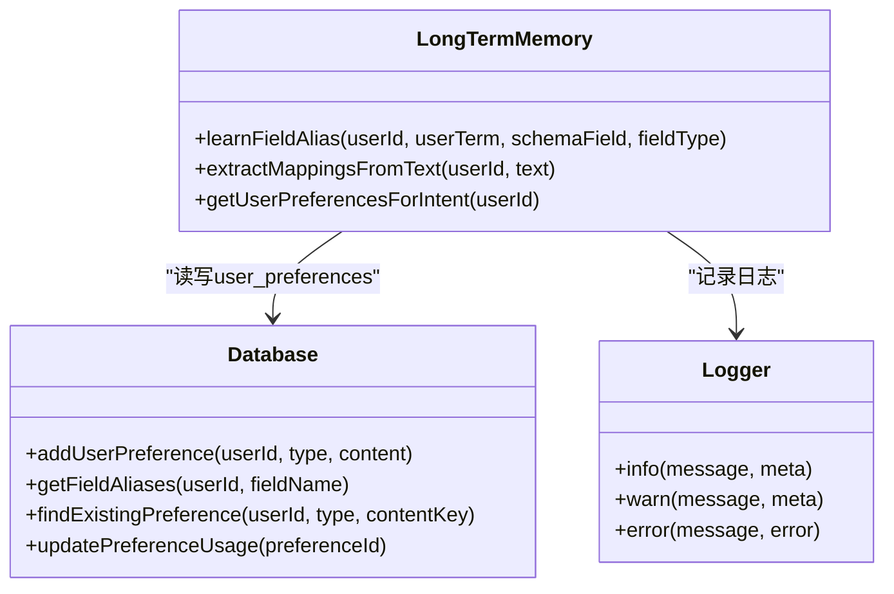
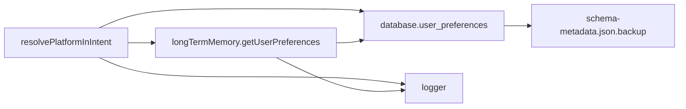

# 平台术语解析

<cite>
**本文引用的文件**
- [nl2sqlEngine.js](file://backend/src/core/nl2sqlEngine.js)
- [longTermMemory.js](file://backend/src/memory/longTermMemory.js)
- [database.js](file://backend/src/core/database.js)
- [logger.js](file://backend/src/utils/logger.js)
- [schema-metadata.json.backup](file://backend/config/schema-metadata.json.backup)
</cite>

## 目录
1. [简介](#简介)
2. [项目结构](#项目结构)
3. [核心组件](#核心组件)
4. [架构总览](#架构总览)
5. [详细组件分析](#详细组件分析)
6. [依赖关系分析](#依赖关系分析)
7. [性能考量](#性能考量)
8. [故障排查指南](#故障排查指南)
9. [结论](#结论)

## 简介
本文件聚焦NL2SQL引擎的“平台术语解析”能力，围绕resolvePlatformInIntent函数展开，系统性说明其平台识别机制、用户长期记忆中的datasource映射加载、硬编码术语匹配、别名学习过程、大小写不敏感处理、查询上下文识别、去重机制、错误处理与日志策略，以及与长期记忆系统的集成关系与数据存储格式。

## 项目结构
- 后端核心位于backend/src/core，包含NL2SQL引擎主流程、数据库访问、LLM服务、路由等。
- 长期记忆位于backend/src/memory，负责用户偏好（含字段别名）的提取、存储、检索与维护。
- 日志系统位于backend/src/utils/logger.js，提供统一的日志记录能力。
- 配置与元数据位于backend/config，包含数据库Schema元数据等。

图表来源
- [nl2sqlEngine.js](file://backend/src/core/nl2sqlEngine.js)
- [longTermMemory.js](file://backend/src/memory/longTermMemory.js)
- [database.js](file://backend/src/core/database.js)
- [logger.js](file://backend/src/utils/logger.js)
- [schema-metadata.json.backup](file://backend/config/schema-metadata.json.backup)

章节来源
- [nl2sqlEngine.js](file://backend/src/core/nl2sqlEngine.js)
- [longTermMemory.js](file://backend/src/memory/longTermMemory.js)
- [database.js](file://backend/src/core/database.js)
- [logger.js](file://backend/src/utils/logger.js)
- [schema-metadata.json.backup](file://backend/config/schema-metadata.json.backup)

## 核心组件
- resolvePlatformInIntent：从用户查询中识别“新平台/老平台”等平台术语，映射到数据库标识（如new_tzpingtai、new_tzpingtaiold），并注入到intent.filters中。
- 长期记忆系统：学习并存储用户对平台术语的映射（field_alias，field_type='datasource'），并在后续查询中优先使用。
- 数据库存储：user_preferences表保存用户偏好，content为JSON，包含user_term、schema_field、field_type等。
- 日志系统：统一记录debug/info/warn/error级别日志，便于追踪平台解析过程与异常。

章节来源
- [nl2sqlEngine.js](file://backend/src/core/nl2sqlEngine.js)
- [longTermMemory.js](file://backend/src/memory/longTermMemory.js)
- [database.js](file://backend/src/core/database.js)
- [logger.js](file://backend/src/utils/logger.js)

## 架构总览
平台术语解析在NL2SQL引擎的意图识别阶段执行，先由LLM生成初步意图，随后resolvePlatformInIntent对平台术语进行二次解析与增强。

图表来源
- [nl2sqlEngine.js](file://backend/src/core/nl2sqlEngine.js)
- [longTermMemory.js](file://backend/src/memory/longTermMemory.js)
- [database.js](file://backend/src/core/database.js)
- [logger.js](file://backend/src/utils/logger.js)

## 详细组件分析

### resolvePlatformInIntent函数解析
- 输入：intent（当前意图）、userQuery（用户查询）、userId（用户ID）
- 核心流程：
  1) 若userId存在，尝试从长期记忆加载用户学习的datasource映射（field_alias，field_type='datasource'）。
  2) 对每个映射，检查用户查询是否包含该术语（大小写不敏感）。
  3) 若命中，检查intent.filters中是否已存在datasource filter，若无则注入。
  4) 若长期记忆未命中，使用硬编码映射表（'老平台'->'new_tzpingtaiold'，'新平台'->'new_tzpingtai'），同样进行去重检查后注入。
  5) 异常捕获并记录错误日志。

图表来源
- [nl2sqlEngine.js](file://backend/src/core/nl2sqlEngine.js)

章节来源
- [nl2sqlEngine.js](file://backend/src/core/nl2sqlEngine.js)

### 别名学习与存储（平台术语）
- 即时学习：在澄清轮中，从用户输入中提取平台/数据源映射（如“新平台：new_tzpingtai”、“老平台对应new_tzpingtaiold”），调用learnFieldAlias(userId, userTerm, schemaField, 'datasource')。
- 存储格式：user_preferences表的content为JSON，包含user_term、schema_field、field_type等字段。
- 去重与更新：findExistingPreference按user_term判断是否已存在，存在则更新usage_count与last_used_at，否则新增。
- 学习触发：extractMappingsFromText支持多种格式（Markdown表格、键值对、显式声明），并记录学习结果与错误。

图表来源
- [longTermMemory.js](file://backend/src/memory/longTermMemory.js)
- [database.js](file://backend/src/core/database.js)
- [logger.js](file://backend/src/utils/logger.js)

章节来源
- [longTermMemory.js](file://backend/src/memory/longTermMemory.js)
- [database.js](file://backend/src/core/database.js)
- [logger.js](file://backend/src/utils/logger.js)

### 大小写不敏感处理与查询上下文识别
- 大小写不敏感：将用户查询与术语均转为小写进行匹配，确保“New Platform/NEW PLATFORM/new platform”等均可识别。
- 上下文识别：resolvePlatformInIntent直接在用户原始查询中进行匹配，不依赖LLM再次解析，减少重复工作量。

章节来源
- [nl2sqlEngine.js](file://backend/src/core/nl2sqlEngine.js)

### 平台术语映射关系示例
- “新平台”->“new_tzpingtai”
- “老平台”->“new_tzpingtaiold”

章节来源
- [nl2sqlEngine.js](file://backend/src/core/nl2sqlEngine.js)

### 去重机制与错误处理
- 去重：在注入datasource filter前，检查intent.filters中是否已存在field='datasource'的过滤器，避免重复注入。
- 错误处理：resolvePlatformInIntent与长期记忆相关操作均包裹try/catch，捕获异常并记录错误日志；加载用户偏好失败时记录debug日志并继续执行硬编码兜底。

章节来源
- [nl2sqlEngine.js](file://backend/src/core/nl2sqlEngine.js)
- [longTermMemory.js](file://backend/src/memory/longTermMemory.js)
- [logger.js](file://backend/src/utils/logger.js)

### 日志记录策略
- resolvePlatformInIntent：命中长期记忆/硬编码时记录info日志；解析失败记录error日志；加载用户datasource映射失败记录debug日志。
- 长期记忆：学习成功/失败均有info/warn/error日志；存储偏好时记录debug日志。
- 日志级别：DEBUG/INFO/WARN/ERROR，支持控制台彩色输出与文件落盘，结构化输出包含时间戳与附加元数据。

章节来源
- [nl2sqlEngine.js](file://backend/src/core/nl2sqlEngine.js)
- [longTermMemory.js](file://backend/src/memory/longTermMemory.js)
- [logger.js](file://backend/src/utils/logger.js)

### 与长期记忆系统的集成关系与数据存储格式
- 集成点：resolvePlatformInIntent在加载用户偏好时，过滤preference_type='field_alias'且field_type='datasource'的记录。
- 存储格式：user_preferences表的content为JSON对象，典型字段包括user_term、schema_field、field_type等。
- 查询模式：getFieldAliases按user_id与preference_type过滤，支持按schema_field精确匹配。

章节来源
- [nl2sqlEngine.js](file://backend/src/core/nl2sqlEngine.js)
- [longTermMemory.js](file://backend/src/memory/longTermMemory.js)
- [database.js](file://backend/src/core/database.js)

## 依赖关系分析
- resolvePlatformInIntent依赖：
  - 长期记忆模块：getUserPreferences(userId)获取用户datasource映射。
  - 数据库模块：读取user_preferences表。
  - 日志模块：记录info/warn/error日志。
- 长期记忆模块依赖：
  - 数据库模块：增删改查user_preferences。
  - 日志模块：记录学习与存储过程。
- 数据库模块：
  - 提供addUserPreference、getFieldAliases、findExistingPreference、updatePreferenceUsage等接口。
- Schema元数据：
  - schema-metadata.json.backup包含数据库表结构与字段说明，支撑平台术语与数据库标识的关联理解。

图表来源
- [nl2sqlEngine.js](file://backend/src/core/nl2sqlEngine.js)
- [longTermMemory.js](file://backend/src/memory/longTermMemory.js)
- [database.js](file://backend/src/core/database.js)
- [schema-metadata.json.backup](file://backend/config/schema-metadata.json.backup)

章节来源
- [nl2sqlEngine.js](file://backend/src/core/nl2sqlEngine.js)
- [longTermMemory.js](file://backend/src/memory/longTermMemory.js)
- [database.js](file://backend/src/core/database.js)
- [schema-metadata.json.backup](file://backend/config/schema-metadata.json.backup)

## 性能考量
- 匹配复杂度：长期记忆加载与遍历别名映射为O(n)，n为用户datasource映射数量；硬编码映射为固定规模，匹配成本极低。
- 去重检查：在注入前进行一次线性扫描，复杂度O(m)，m为现有filters数量，通常很小。
- I/O开销：数据库查询user_preferences为本地SQLite，单次查询延迟较低；建议在引擎层缓存短期用户偏好以进一步降低查询次数。
- 日志输出：info/warn/error日志为必要开销，建议在生产环境合理设置日志级别，避免过多IO。

## 故障排查指南
- 平台术语未识别：
  - 检查用户是否在澄清轮中明确声明了平台映射（如“新平台：new_tzpingtai”）。
  - 确认长期记忆中已学习该映射（field_alias，field_type='datasource'）。
  - 查看resolvePlatformInIntent日志，确认是否命中长期记忆或硬编码。
- 重复datasource filter：
  - 检查resolvePlatformInIntent的去重逻辑是否生效；确认intent.filters中是否已存在field='datasource'的过滤器。
- 长期记忆加载失败：
  - 查看debug日志，确认数据库查询是否报错；检查user_preferences表结构与权限。
- 日志定位：
  - 使用logger.js提供的info/warn/error接口，结合时间戳与附加元数据快速定位问题。

章节来源
- [nl2sqlEngine.js](file://backend/src/core/nl2sqlEngine.js)
- [longTermMemory.js](file://backend/src/memory/longTermMemory.js)
- [logger.js](file://backend/src/utils/logger.js)

## 结论
resolvePlatformInIntent通过“长期记忆+硬编码”的双重机制，实现了对“新平台/老平台”等平台术语的稳定识别与注入。其设计强调：
- 大小写不敏感与简单高效匹配；
- 去重保护与错误降级（硬编码兜底）；
- 与长期记忆系统的深度集成与结构化存储；
- 完整的日志记录与可观测性。

该机制为后续SQL生成与过滤提供了可靠的平台维度基础，提升了NL2SQL在多数据源场景下的可用性与准确性。