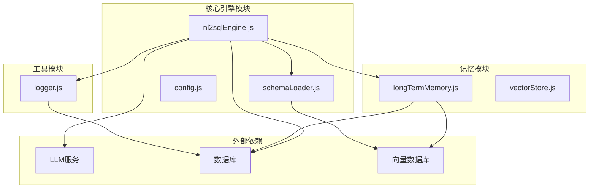
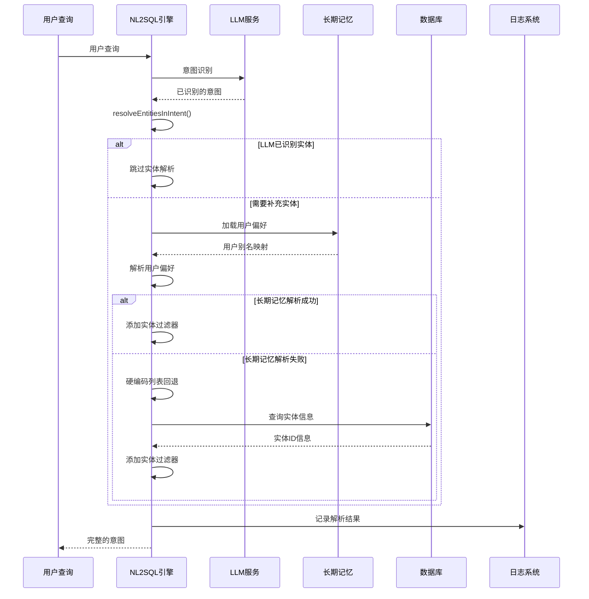
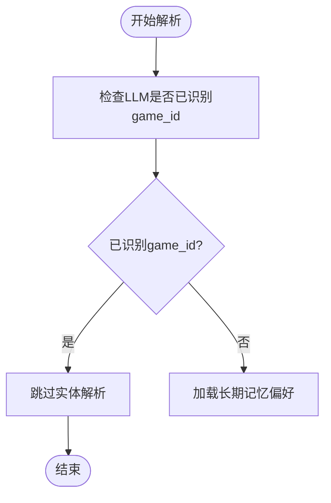
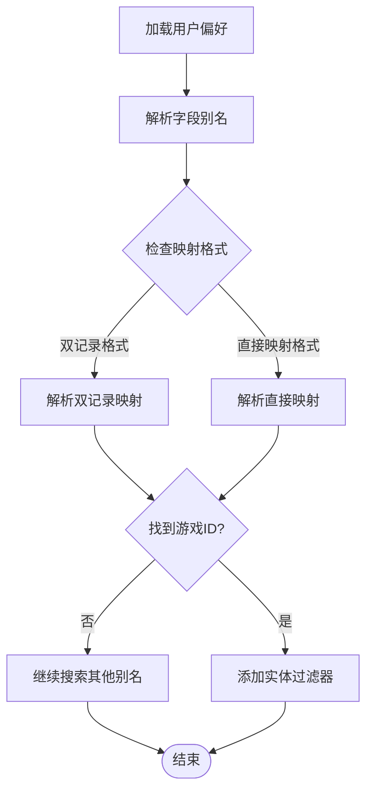
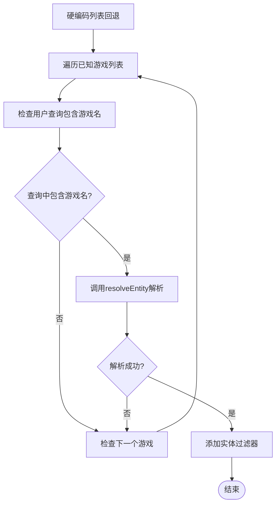
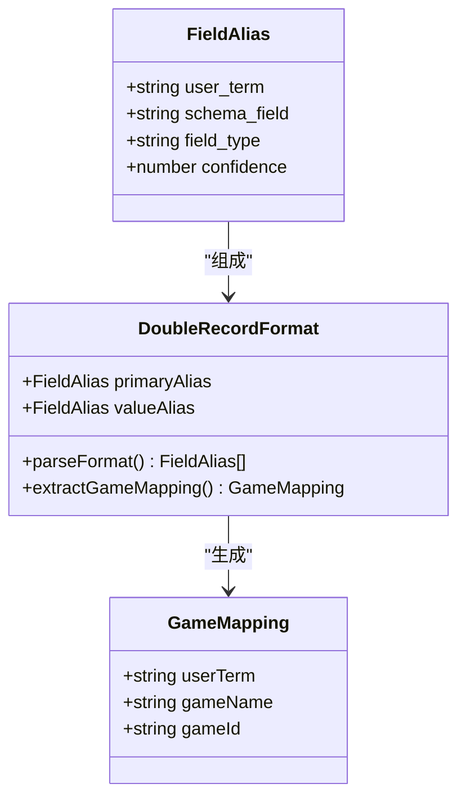
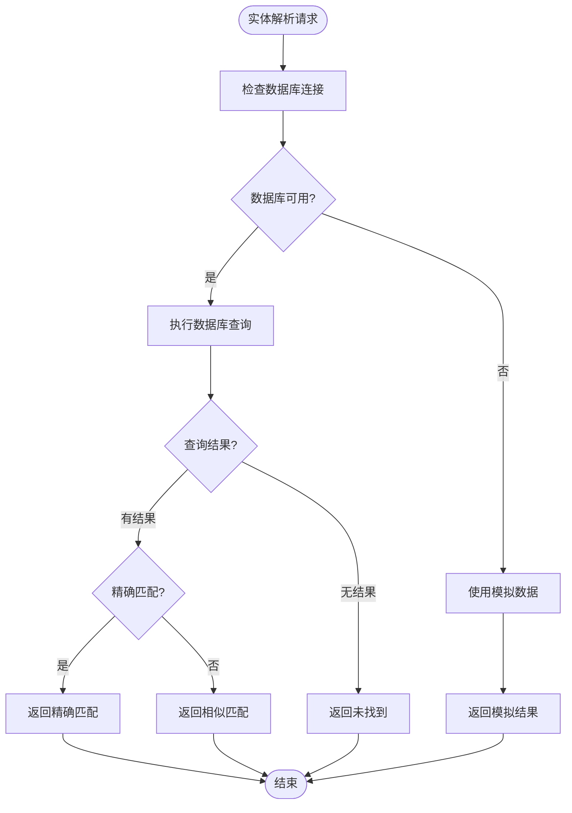
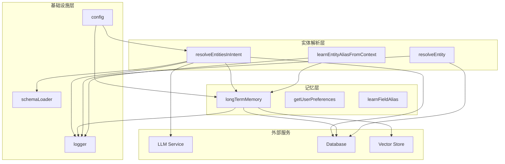

# 意图中的实体解析

<cite>
**本文档引用的文件**
- [nl2sqlEngine.js](file://backend/src/core/nl2sqlEngine.js)
- [longTermMemory.js](file://backend/src/memory/longTermMemory.js)
- [logger.js](file://backend/src/utils/logger.js)
- [config.js](file://backend/src/core/config.js)
- [schemaLoader.js](file://backend/src/core/schemaLoader.js)
- [vectorStore.js](file://backend/src/memory/vectorStore.js)
</cite>

## 目录
1. [简介](#简介)
2. [项目结构](#项目结构)
3. [核心组件](#核心组件)
4. [架构概览](#架构概览)
5. [详细组件分析](#详细组件分析)
6. [依赖关系分析](#依赖关系分析)
7. [性能考虑](#性能考虑)
8. [故障排除指南](#故障排除指南)
9. [结论](#结论)

## 简介

本文档详细介绍了NL2SQL引擎中意图解析阶段的实体解析功能。该功能实现了多层次的实体识别策略，能够将用户模糊的查询描述（如游戏名称、平台术语）准确解析为数据库中的具体标识符（如game_id）。文档深入分析了resolveEntitiesInIntent函数的多层解析策略，包括LLM已识别过滤器检查、长期记忆别名加载和硬编码列表回退机制。

## 项目结构

NL2SQL引擎采用模块化架构设计，实体解析功能主要分布在以下核心模块中：



**图表来源**
- [nl2sqlEngine.js:1-2010](file://backend/src/core/nl2sqlEngine.js#L1-L2010)
- [longTermMemory.js:1-1134](file://backend/src/memory/longTermMemory.js#L1-L1134)

## 核心组件

### 实体解析主函数

resolveEntitiesInIntent函数是实体解析的核心，实现了三层解析策略：

1. **LLM已识别过滤器检查** - 检查LLM是否已经在意图识别阶段正确识别了实体
2. **长期记忆别名加载** - 从用户长期记忆中加载个性化的实体映射
3. **硬编码列表回退** - 使用预定义的游戏名称列表进行兜底解析

### 用户偏好学习机制

系统实现了智能的用户偏好学习机制，支持多种映射格式：

- **双记录格式**：青木 -> game_id, 青木_value -> 30
- **直接映射格式**：青木 -> 30
- **平台术语映射**：新平台 -> new_tzpingtai

### 实体解析辅助功能

resolveEntity函数提供了基础的实体解析能力，支持数据库查询和模拟数据回退。

**章节来源**
- [nl2sqlEngine.js:195-300](file://backend/src/core/nl2sqlEngine.js#L195-L300)
- [nl2sqlEngine.js:42-108](file://backend/src/core/nl2sqlEngine.js#L42-L108)

## 架构概览

实体解析系统采用分层架构，每层都有明确的职责分工：



**图表来源**
- [nl2sqlEngine.js:195-300](file://backend/src/core/nl2sqlEngine.js#L195-L300)
- [nl2sqlEngine.js:42-108](file://backend/src/core/nl2sqlEngine.js#L42-L108)

## 详细组件分析

### resolveEntitiesInIntent函数详解

该函数实现了完整的实体解析流程，包含三个主要阶段：

#### 第一阶段：LLM已识别过滤器检查



**图表来源**
- [nl2sqlEngine.js:202-208](file://backend/src/core/nl2sqlEngine.js#L202-L208)

#### 第二阶段：长期记忆别名加载与解析

系统从用户偏好中查找匹配的游戏名称映射：



**图表来源**
- [nl2sqlEngine.js:210-267](file://backend/src/core/nl2sqlEngine.js#L210-L267)

#### 第三阶段：硬编码列表回退策略

当长期记忆解析失败时，系统使用预定义的游戏名称列表进行回退：



**图表来源**
- [nl2sqlEngine.js:269-295](file://backend/src/core/nl2sqlEngine.js#L269-L295)

### 用户偏好学习机制

系统支持多种用户偏好学习格式：

#### 双记录格式处理



**图表来源**
- [longTermMemory.js:771-825](file://backend/src/memory/longTermMemory.js#L771-L825)

#### 直接映射格式支持

系统支持直接存储游戏ID值的映射关系，简化了后续解析过程。

**章节来源**
- [nl2sqlEngine.js:222-244](file://backend/src/core/nl2sqlEngine.js#L222-L244)
- [longTermMemory.js:493-605](file://backend/src/memory/longTermMemory.js#L493-L605)

### 实体解析辅助功能

resolveEntity函数提供了基础的实体解析能力：

#### 数据库查询策略



**图表来源**
- [nl2sqlEngine.js:42-108](file://backend/src/core/nl2sqlEngine.js#L42-L108)

**章节来源**
- [nl2sqlEngine.js:42-108](file://backend/src/core/nl2sqlEngine.js#L42-L108)

## 依赖关系分析

实体解析功能涉及多个模块间的复杂交互：



**图表来源**
- [nl2sqlEngine.js:195-300](file://backend/src/core/nl2sqlEngine.js#L195-L300)
- [longTermMemory.js:976-1012](file://backend/src/memory/longTermMemory.js#L976-L1012)

**章节来源**
- [nl2sqlEngine.js:195-300](file://backend/src/core/nl2sqlEngine.js#L195-L300)
- [longTermMemory.js:976-1012](file://backend/src/memory/longTermMemory.js#L976-L1012)

## 性能考虑

### 解析策略优化

系统采用了多层次的解析策略来平衡准确性与性能：

1. **快速路径优化**：优先检查LLM已识别的实体，避免不必要的数据库查询
2. **缓存机制**：长期记忆偏好在内存中缓存，减少数据库访问
3. **早期退出**：一旦找到匹配的实体映射立即返回，避免遍历完整列表

### 内存使用优化

- 长期记忆偏好按需加载，支持分页查询
- 向量数据库查询使用限制参数，避免大量数据传输
- 日志系统支持异步写入，减少I/O阻塞

## 故障排除指南

### 常见问题及解决方案

#### 实体解析失败

**症状**：resolveEntitiesInIntent函数返回未找到结果

**可能原因**：
1. LLM未能正确识别实体
2. 用户偏好学习失败
3. 数据库连接异常
4. 硬编码列表中缺少游戏名称

**诊断步骤**：
1. 检查LLM服务状态
2. 验证长期记忆偏好加载
3. 确认数据库连接可用
4. 验证硬编码列表完整性

**日志分析**：
系统会在解析过程中产生详细的日志信息，包括：
- 实体解析尝试过程
- 长期记忆加载结果
- 数据库查询执行情况
- 解析失败的具体原因

**章节来源**
- [nl2sqlEngine.js:297-299](file://backend/src/core/nl2sqlEngine.js#L297-L299)
- [logger.js:283-293](file://backend/src/utils/logger.js#L283-L293)

### 调试信息输出

系统提供了全面的日志记录机制：

#### 日志级别配置

```javascript
// 日志级别定义
const LogLevel = {
  DEBUG: { value: 0, label: 'DEBUG', color: '\x1b[36m' },
  INFO: { value: 1, label: 'INFO', color: '\x1b[32m' },
  WARN: { value: 2, label: 'WARN', color: '\x1b[33m' },
  ERROR: { value: 3, label: 'ERROR', color: '\x1b[31m' }
};
```

#### 关键日志记录点

1. **实体解析开始**：记录用户查询和解析目标
2. **长期记忆加载**：记录偏好加载状态和结果
3. **数据库查询**：记录SQL执行和结果
4. **解析成功**：记录最终的实体ID和置信度
5. **解析失败**：记录失败原因和调试信息

**章节来源**
- [logger.js:256-293](file://backend/src/utils/logger.js#L256-L293)

## 结论

NL2SQL引擎的实体解析功能通过多层次的解析策略，实现了高精度的实体识别能力。该系统不仅能够处理LLM已识别的实体，还能通过长期记忆学习用户的个性化偏好，最后通过硬编码列表提供可靠的回退机制。

### 主要优势

1. **多层解析策略**：确保在各种情况下都能找到合适的实体映射
2. **智能偏好学习**：系统能够自动学习和记住用户的个性化术语
3. **灵活的映射格式**：支持多种映射格式，适应不同的使用场景
4. **完善的错误处理**：提供详细的日志记录和错误恢复机制

### 技术特点

- **模块化设计**：各功能模块职责清晰，易于维护和扩展
- **异步处理**：充分利用异步I/O提高系统响应性能
- **配置驱动**：通过配置文件灵活调整系统行为
- **监控完备**：全面的日志记录和性能监控

该实体解析系统为NL2SQL引擎提供了坚实的基础，能够有效提升自然语言查询到SQL转换的准确性和用户体验。