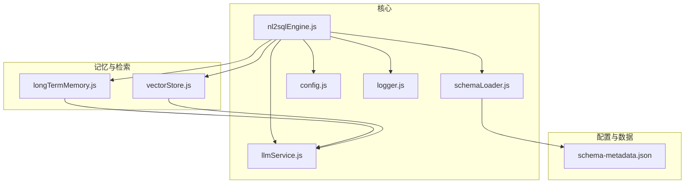
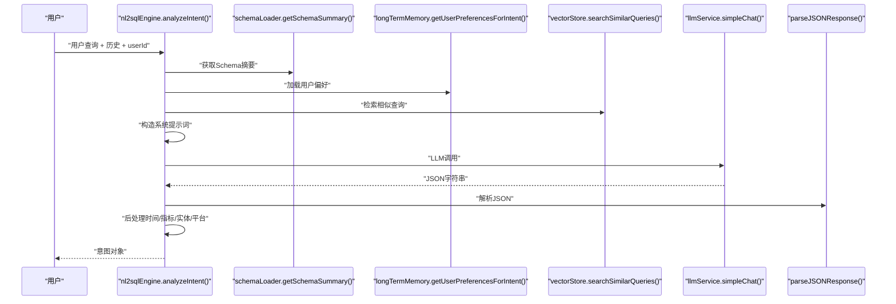
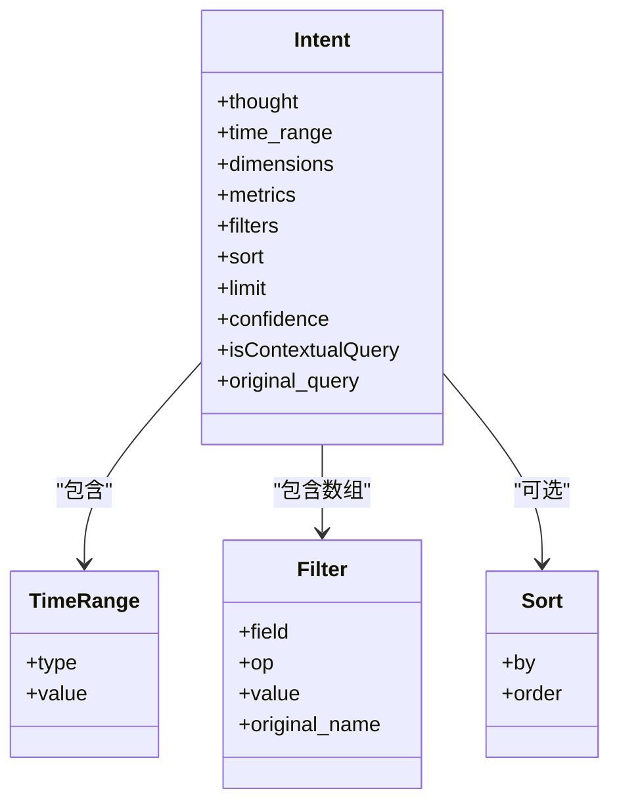
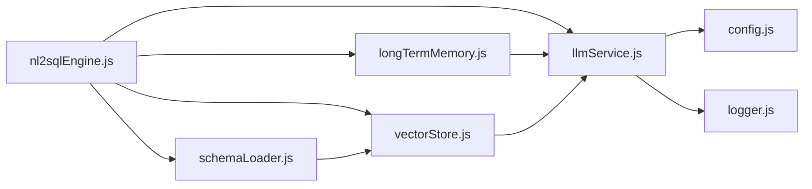

# 意图识别与分析

<cite>
**本文引用的文件**
- [nl2sqlEngine.js](file://backend/src/core/nl2sqlEngine.js)
- [llmService.js](file://backend/src/core/llmService.js)
- [longTermMemory.js](file://backend/src/memory/longTermMemory.js)
- [vectorStore.js](file://backend/src/memory/vectorStore.js)
- [schemaLoader.js](file://backend/src/core/schemaLoader.js)
- [config.js](file://backend/src/core/config.js)
- [logger.js](file://backend/src/utils/logger.js)
- [schema-metadata.json](file://backend/config/schema-metadata.json)
- [package.json](file://backend/package.json)
</cite>

## 目录
1. [简介](#简介)
2. [项目结构](#项目结构)
3. [核心组件](#核心组件)
4. [架构总览](#架构总览)
5. [详细组件分析](#详细组件分析)
6. [依赖分析](#依赖分析)
7. [性能考虑](#性能考虑)
8. [故障排查指南](#故障排查指南)
9. [结论](#结论)
10. [附录](#附录)

## 简介
本文件聚焦NL2SQL引擎的“意图识别与分析”模块，系统性阐述：
- 意图识别算法工作原理：系统提示词构建策略、JSON响应解析机制、置信度评估
- 上下文理解机制：对话历史整合、用户偏好学习、相似查询检索
- 多模态输入处理：时间范围识别、维度指标提取、筛选条件解析
- 完整流程示例：系统提示词构造、LLM调用、结果解析
- 配置参数、性能优化技巧、错误处理策略
- 与其他模块的集成关系与数据流

## 项目结构
后端采用模块化设计，意图识别位于核心层，围绕Schema元数据、向量检索与长期记忆协同工作：
- 核心引擎：nl2sqlEngine.js
- LLM服务：llmService.js
- 长期记忆：longTermMemory.js
- 向量存储：vectorStore.js
- Schema加载：schemaLoader.js
- 配置与日志：config.js、logger.js
- 示例Schema：schema-metadata.json



图表来源
- [nl2sqlEngine.js:1-800](file://backend/src/core/nl2sqlEngine.js#L1-L800)
- [schemaLoader.js:1-732](file://backend/src/core/schemaLoader.js#L1-L732)
- [llmService.js:1-432](file://backend/src/core/llmService.js#L1-L432)
- [longTermMemory.js:1-800](file://backend/src/memory/longTermMemory.js#L1-L800)
- [vectorStore.js:1-621](file://backend/src/memory/vectorStore.js#L1-L621)
- [config.js:1-332](file://backend/src/core/config.js#L1-L332)
- [logger.js:1-318](file://backend/src/utils/logger.js#L1-L318)
- [schema-metadata.json:1-800](file://backend/config/schema-metadata.json#L1-L800)

章节来源
- [nl2sqlEngine.js:1-800](file://backend/src/core/nl2sqlEngine.js#L1-L800)
- [schemaLoader.js:1-732](file://backend/src/core/schemaLoader.js#L1-L732)
- [llmService.js:1-432](file://backend/src/core/llmService.js#L1-L432)
- [longTermMemory.js:1-800](file://backend/src/memory/longTermMemory.js#L1-L800)
- [vectorStore.js:1-621](file://backend/src/memory/vectorStore.js#L1-L621)
- [config.js:1-332](file://backend/src/core/config.js#L1-L332)
- [logger.js:1-318](file://backend/src/utils/logger.js#L1-L318)
- [schema-metadata.json:1-800](file://backend/config/schema-metadata.json#L1-L800)

## 核心组件
- 意图识别引擎：analyzeIntent()，负责系统提示词构造、LLM调用、JSON解析、后处理与实体解析
- LLM服务：simpleChat()、chat()、getEmbedding()，封装HTTP请求、重试、流式响应与错误处理
- 长期记忆：用户偏好抽取、字段别名学习、查询模式存储与检索
- 向量存储：Schema向量化、查询历史向量化、相似查询检索
- Schema加载：Schema元数据加载、向量化、表/字段查询与SQL校验
- 配置与日志：集中配置、日志级别与输出、安全阈值

章节来源
- [nl2sqlEngine.js:488-780](file://backend/src/core/nl2sqlEngine.js#L488-L780)
- [llmService.js:287-311](file://backend/src/core/llmService.js#L287-L311)
- [longTermMemory.js:311-484](file://backend/src/memory/longTermMemory.js#L311-L484)
- [vectorStore.js:418-481](file://backend/src/memory/vectorStore.js#L418-L481)
- [schemaLoader.js:69-122](file://backend/src/core/schemaLoader.js#L69-L122)
- [config.js:16-87](file://backend/src/core/config.js#L16-L87)
- [logger.js:51-318](file://backend/src/utils/logger.js#L51-L318)

## 架构总览
意图识别的整体流程如下：
- 输入：用户查询、历史对话、用户ID
- 上下文：Schema摘要、用户偏好、相似查询
- 构建系统提示词：融合上下文与规则
- LLM调用：simpleChat()返回JSON字符串
- JSON解析：parseJSONResponse()提取意图结构
- 后处理：时间范围补全、指标识别、实体解析、平台术语解析
- 输出：意图对象（包含metrics、dimensions、filters、time_range、confidence等）



图表来源
- [nl2sqlEngine.js:497-780](file://backend/src/core/nl2sqlEngine.js#L497-L780)
- [schemaLoader.js:614-628](file://backend/src/core/schemaLoader.js#L614-L628)
- [longTermMemory.js:311-484](file://backend/src/memory/longTermMemory.js#L311-L484)
- [vectorStore.js:455-481](file://backend/src/memory/vectorStore.js#L455-L481)
- [llmService.js:287-311](file://backend/src/core/llmService.js#L287-L311)

## 详细组件分析

### 意图识别算法与系统提示词构建
- 系统提示词由四部分组成：
  - 数据库Schema概览（schemaLoader.getSchemaSummary()）
  - 对话上下文（最近N轮）
  - 用户偏好（长期记忆getUserPreferencesForIntent()）
  - 相似历史查询（向量检索searchSimilarQueries()）
- 规则与约束：
  - 深度融合上下文、智能修正、isContextualQuery标记
  - metrics基于上下文+当前查询识别
  - 利用历史偏好，直接使用已学习映射（如游戏ID）时置信度提升
- JSON输出结构：
  - thought、time_range、dimensions、metrics、filters、sort、limit、confidence、isContextualQuery
  - 重要字段：filters（字段、运算符、值）、time_range（type/value）、metrics/dimensions、confidence

章节来源
- [nl2sqlEngine.js:620-692](file://backend/src/core/nl2sqlEngine.js#L620-L692)
- [schemaLoader.js:614-628](file://backend/src/core/schemaLoader.js#L614-L628)
- [longTermMemory.js:311-484](file://backend/src/memory/longTermMemory.js#L311-L484)
- [vectorStore.js:455-481](file://backend/src/memory/vectorStore.js#L455-L481)

### JSON响应解析机制
- 解析策略：
  - 直接JSON.parse()
  - 支持代码块 ```json ... ```
  - 支持首尾大括号包裹的JSON
- 错误处理：
  - 解析失败时抛出“无法解析JSON响应”
  - LLM服务对响应解析失败有详细日志与截断检测

章节来源
- [nl2sqlEngine.js:701-702](file://backend/src/core/nl2sqlEngine.js#L701-L702)
- [longTermMemory.js:193-207](file://backend/src/memory/longTermMemory.js#L193-L207)
- [llmService.js:113-131](file://backend/src/core/llmService.js#L113-L131)

### 置信度评估与后处理
- 置信度来源：
  - LLM输出的confidence字段
  - 已学习映射（如游戏ID）直接使用时置信度提升（示例：0.95）
- 后处理：
  - metrics缺失时从查询中提取常见关键词
  - time_range缺失时识别常见时间表达
  - filters补充实体解析与平台术语解析

章节来源
- [nl2sqlEngine.js:699-779](file://backend/src/core/nl2sqlEngine.js#L699-L779)
- [nl2sqlEngine.js:708-755](file://backend/src/core/nl2sqlEngine.js#L708-L755)

### 上下文理解机制
- 对话历史整合：
  - enrichIntentWithClarificationContext()：识别澄清回复、默认选项、确认槽位
  - isAffirmativeClarificationReply()、extractDefaultOptionsFromClarification()
- 用户偏好学习：
  - learnEntityAliasFromContext()：从澄清中学习字段别名
  - longTermMemory.learnFieldAlias()/store...Preference()：存储字段别名、指标/维度偏好
- 相似查询检索：
  - vectorStore.searchSimilarQueries()：基于Embedding相似度检索
  - buildEnhancedMetadata()：重要性评分、查询类型分类

章节来源
- [nl2sqlEngine.js:443-482](file://backend/src/core/nl2sqlEngine.js#L443-L482)
- [nl2sqlEngine.js:122-186](file://backend/src/core/nl2sqlEngine.js#L122-L186)
- [longTermMemory.js:311-484](file://backend/src/memory/longTermMemory.js#L311-L484)
- [vectorStore.js:418-481](file://backend/src/memory/vectorStore.js#L418-L481)

### 多模态输入处理
- 时间范围识别：
  - 从查询中识别“最近7天/最近30天/上个月/昨天/今天”等
  - 与LLM输出的time_range互补
- 维度指标提取：
  - 字段别名参考（收入类/用户类/比率类）
  - 常见关键词映射（如“流水”→“收入金额”）
- 筛选条件解析：
  - 游戏/渠道/区服/日期字段映射
  - 实体解析resolveEntity()与平台术语解析resolvePlatformInIntent()

章节来源
- [nl2sqlEngine.js:658-691](file://backend/src/core/nl2sqlEngine.js#L658-L691)
- [nl2sqlEngine.js:708-755](file://backend/src/core/nl2sqlEngine.js#L708-L755)
- [nl2sqlEngine.js:309-383](file://backend/src/core/nl2sqlEngine.js#L309-L383)

### 完整流程示例（代码路径）
- 系统提示词构造与LLM调用
  - [系统提示词拼装](file://backend/src/core/nl2sqlEngine.js#L620-L692)
  - [LLM调用](file://backend/src/core/nl2sqlEngine.js#L699-L700)
- JSON解析
  - [JSON解析](file://backend/src/core/nl2sqlEngine.js#L701-L702)
- 后处理与实体解析
  - [指标/时间后处理](file://backend/src/core/nl2sqlEngine.js#L707-L755)
  - [实体解析](file://backend/src/core/nl2sqlEngine.js#L757-L761)
  - [平台术语解析](file://backend/src/core/nl2sqlEngine.js#L760-L761)

章节来源
- [nl2sqlEngine.js:620-780](file://backend/src/core/nl2sqlEngine.js#L620-L780)

### 类关系与数据结构


图表来源
- [nl2sqlEngine.js:635-648](file://backend/src/core/nl2sqlEngine.js#L635-L648)

## 依赖分析
- 模块耦合
  - nl2sqlEngine高度依赖schemaLoader、llmService、longTermMemory、vectorStore
  - llmService对config与logger有直接依赖
  - longTermMemory依赖llmService与config
  - vectorStore依赖config与llmService
- 外部依赖
  - vectordb（LanceDB）用于向量存储
  - sqlite3用于会话与偏好存储
  - dotenv用于环境变量加载



图表来源
- [nl2sqlEngine.js:17-30](file://backend/src/core/nl2sqlEngine.js#L17-L30)
- [llmService.js:22-24](file://backend/src/core/llmService.js#L22-L24)
- [longTermMemory.js:17-20](file://backend/src/memory/longTermMemory.js#L17-L20)
- [vectorStore.js:15-19](file://backend/src/memory/vectorStore.js#L15-L19)
- [schemaLoader.js:20-26](file://backend/src/core/schemaLoader.js#L20-L26)
- [config.js:16-87](file://backend/src/core/config.js#L16-L87)
- [logger.js:15-22](file://backend/src/utils/logger.js#L15-L22)

章节来源
- [package.json:10-20](file://backend/package.json#L10-L20)

## 性能考虑
- LLM调用
  - 温度参数较低（0.1）以提升确定性
  - 超时与重试策略（maxRetries/retryDelay）
  - Embedding批量分批处理（batchSize=20）
- 向量检索
  - topK限制、元数据增强（重要性评分、查询类型）
  - 向量表懒加载与初始化检查
- Schema加载
  - 缓存与过期时间控制
  - 向量化开关（SCHEMA_REVECTORIZE）与跳过策略

章节来源
- [llmService.js:229-277](file://backend/src/core/llmService.js#L229-L277)
- [llmService.js:267-378](file://backend/src/core/llmService.js#L267-L378)
- [vectorStore.js:455-481](file://backend/src/memory/vectorStore.js#L455-L481)
- [schemaLoader.js:195-290](file://backend/src/core/schemaLoader.js#L195-L290)
- [schemaLoader.js:682-692](file://backend/src/core/schemaLoader.js#L682-L692)

## 故障排查指南
- LLM响应解析失败
  - 现象：JSON解析异常、响应截断、包含多个JSON对象
  - 处理：检查API响应长度、truncated标记、流式响应格式
  - 参考：[llmService.js:113-131](file://backend/src/core/llmService.js#L113-L131)
- 向量数据库未初始化
  - 现象：相似查询检索为空、向量表不可用
  - 处理：确认vectorStore.initialize()执行、路径配置正确
  - 参考：[vectorStore.js:229-259](file://backend/src/memory/vectorStore.js#L229-L259)
- Schema加载失败
  - 现象：Schema配置文件不存在、格式不正确
  - 处理：检查schema-metadata.json路径与格式
  - 参考：[schemaLoader.js:74-122](file://backend/src/core/schemaLoader.js#L74-L122)
- 配置缺失
  - 现象：缺少LLM API密钥或数据库URL
  - 处理：validateConfig()抛错提示
  - 参考：[config.js:300-322](file://backend/src/core/config.js#L300-L322)

章节来源
- [llmService.js:113-131](file://backend/src/core/llmService.js#L113-L131)
- [vectorStore.js:229-259](file://backend/src/memory/vectorStore.js#L229-L259)
- [schemaLoader.js:74-122](file://backend/src/core/schemaLoader.js#L74-L122)
- [config.js:300-322](file://backend/src/core/config.js#L300-L322)

## 结论
意图识别模块通过“系统提示词+LLM+后处理”的闭环，实现了对自然语言查询的结构化解析与上下文融合。其优势在于：
- 强大的上下文整合能力（历史对话、用户偏好、相似查询）
- 置信度驱动的决策与补全策略
- 多模态输入的鲁棒解析（时间/维度/指标/筛选）
- 与Schema、向量检索、长期记忆的深度集成

建议在生产环境中：
- 启用长期记忆与向量检索（按需开启）
- 合理设置LLM温度与超时
- 监控JSON解析与向量检索的稳定性
- 持续优化系统提示词与字段别名规则

## 附录

### 配置参数速览
- LLM与Embedding
  - llm.apiBase、llm.apiKey、llm.model、llm.timeout、llm.maxRetries、llm.retryDelay
  - embedding.model、embedding.dimension、embedding.timeout
- 数据库与向量
  - database.path、vectorDb.path
  - srDatabase.url、srDatabase.pool.*
- 安全与会话
  - security.allowedTables、security.dryRun、security.maxQueryRows、security.queryTimeout、security.forbiddenKeywords、security.sensitiveFields
  - session.maxHistory、session.expireTime、session.cleanupInterval
- Schema与长期记忆
  - schema.configPath、schema.enableCache、schema.cacheExpireTime、schema.revectorize
  - longTermMemory.enabled、longTermMemory.useLLMForExtraction、longTermMemory.thresholds.*

章节来源
- [config.js:16-288](file://backend/src/core/config.js#L16-L288)