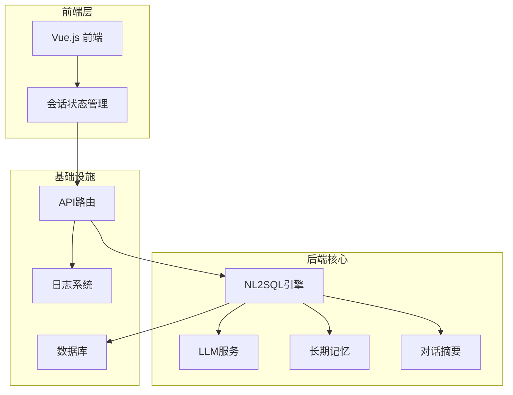
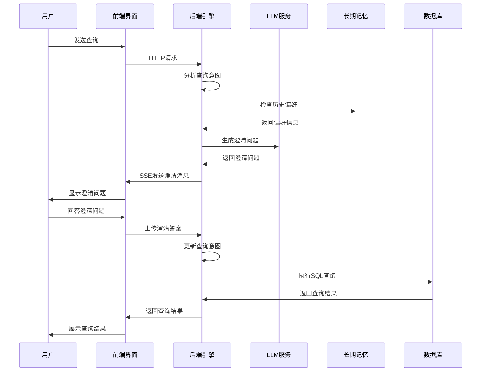
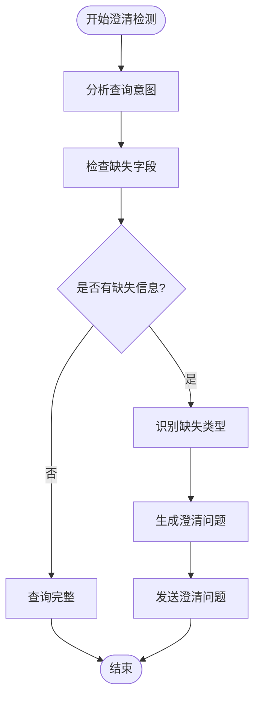
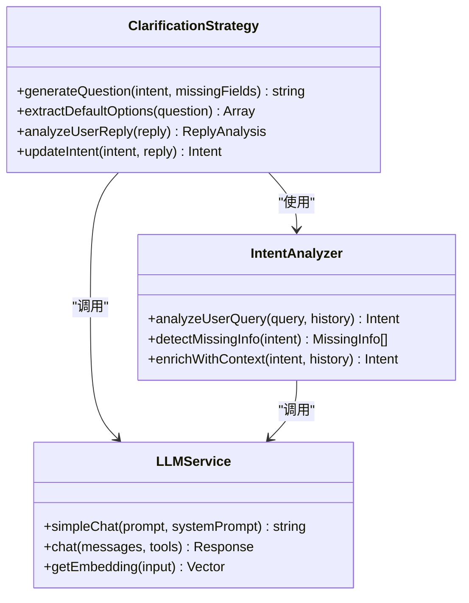
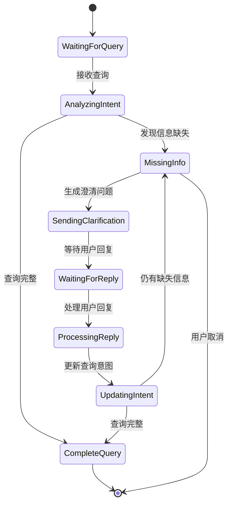
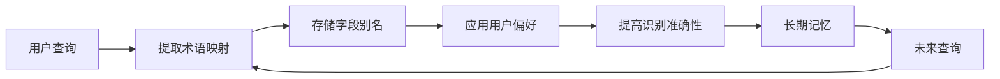
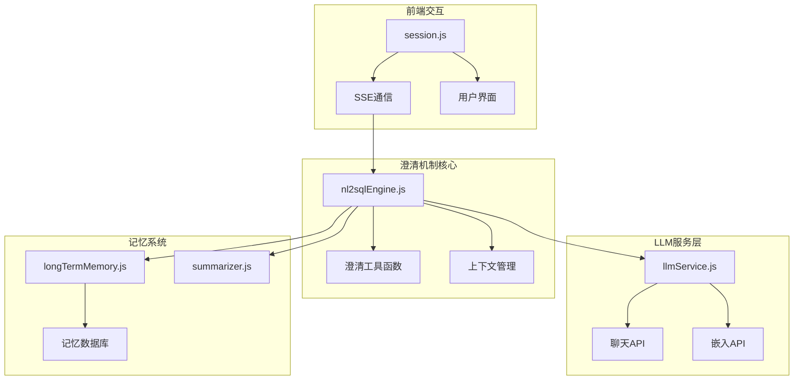

# 智能澄清机制

<cite>
**本文档引用的文件**
- [nl2sqlEngine.js](file://backend/src/core/nl2sqlEngine.js)
- [longTermMemory.js](file://backend/src/memory/longTermMemory.js)
- [summarizer.js](file://backend/src/memory/summarizer.js)
- [llmService.js](file://backend/src/core/llmService.js)
- [routes.js](file://backend/src/core/routes.js)
- [session.js](file://frontend/src/stores/session.js)
- [logger.js](file://backend/src/utils/logger.js)
</cite>

## 目录
1. [简介](#简介)
2. [项目结构](#项目结构)
3. [核心组件](#核心组件)
4. [架构概览](#架构概览)
5. [详细组件分析](#详细组件分析)
6. [依赖关系分析](#依赖关系分析)
7. [性能考虑](#性能考虑)
8. [故障排除指南](#故障排除指南)
9. [结论](#结论)

## 简介

智能澄清机制是NL2SQL引擎中的关键特性，它能够自动识别用户查询中的信息缺失，并通过多轮对话的方式引导用户提供必要的上下文信息。该机制实现了完整的对话管理流程，包括信息缺失检测、澄清问题生成、用户反馈处理和上下文保持。

该系统采用LLM驱动的澄清策略，能够根据用户的查询历史和偏好，智能地设计澄清问题并提供选项引导。通过长期记忆系统，系统能够学习用户的术语映射和查询习惯，从而提供更加个性化的澄清体验。

## 项目结构

NL2SQL引擎采用模块化架构设计，智能澄清机制主要分布在以下几个核心模块中：

**图表来源**
- [nl2sqlEngine.js:1-800](file://backend/src/core/nl2sqlEngine.js#L1-L800)
- [routes.js:1-800](file://backend/src/core/routes.js#L1-L800)
- [session.js:1-398](file://frontend/src/stores/session.js#L1-L398)

**章节来源**
- [nl2sqlEngine.js:1-800](file://backend/src/core/nl2sqlEngine.js#L1-L800)
- [routes.js:1-800](file://backend/src/core/routes.js#L1-L800)
- [session.js:1-398](file://frontend/src/stores/session.js#L1-L398)

## 核心组件

### 1. 澄清检测与上下文管理

智能澄清机制的核心在于能够准确识别信息缺失并维持对话上下文。系统通过以下方式实现：

- **信息缺失检测**：分析用户查询的意图结构，识别缺失的关键字段
- **上下文保持**：维护对话历史，确保澄清过程中的信息完整性
- **状态跟踪**：跟踪澄清状态，避免重复提问

### 2. LLM驱动的澄清策略

系统采用LLM生成澄清问题，具有以下特点：

- **智能问题设计**：根据查询意图和历史上下文生成针对性问题
- **选项生成**：为用户提供可选的答案选项
- **用户引导**：通过自然语言指导用户提供必要信息

### 3. 多轮对话管理

系统支持完整的多轮对话流程：

- **澄清问题发送**：通过SSE实时传输澄清消息
- **用户反馈处理**：解析用户回复并更新查询意图
- **状态流转控制**：管理澄清状态的转换

**章节来源**
- [nl2sqlEngine.js:399-482](file://backend/src/core/nl2sqlEngine.js#L399-L482)
- [nl2sqlEngine.js:1697-1705](file://backend/src/core/nl2sqlEngine.js#L1697-L1705)

## 架构概览

智能澄清机制的整体架构如下：

**图表来源**
- [nl2sqlEngine.js:497-780](file://backend/src/core/nl2sqlEngine.js#L497-L780)
- [session.js:299-328](file://frontend/src/stores/session.js#L299-L328)

## 详细组件分析

### 1. 澄清检测与上下文管理

#### 1.1 信息缺失检测

系统通过分析查询意图来识别信息缺失：

**图表来源**
- [nl2sqlEngine.js:497-780](file://backend/src/core/nl2sqlEngine.js#L497-L780)

#### 1.2 上下文保持机制

系统维护多层上下文信息：

- **对话历史摘要**：使用LLM生成对话摘要，压缩早期对话
- **澄清上下文**：记录澄清问题和用户回复的关联关系
- **用户偏好**：存储用户的术语映射和查询习惯

**章节来源**
- [nl2sqlEngine.js:443-482](file://backend/src/core/nl2sqlEngine.js#L443-L482)
- [summarizer.js:109-185](file://backend/src/memory/summarizer.js#L109-L185)

### 2. LLM驱动的澄清策略

#### 2.1 澄清问题生成

系统使用LLM生成智能的澄清问题：

**图表来源**
- [nl2sqlEngine.js:497-780](file://backend/src/core/nl2sqlEngine.js#L497-L780)
- [llmService.js:287-311](file://backend/src/core/llmService.js#L287-L311)

#### 2.2 选项生成与用户引导

系统能够智能生成澄清选项：

- **默认选项提取**：从澄清问题中识别默认推荐选项
- **选项格式化**：为用户提供清晰的选项列表
- **用户引导**：通过自然语言指导用户提供具体信息

**章节来源**
- [nl2sqlEngine.js:400-441](file://backend/src/core/nl2sqlEngine.js#L400-L441)

### 3. 多轮对话管理

#### 3.1 对话状态跟踪

系统维护完整的对话状态：

**图表来源**
- [nl2sqlEngine.js:1697-1705](file://backend/src/core/nl2sqlEngine.js#L1697-L1705)

#### 3.2 SSE实时通信

前端通过Server-Sent Events实现实时通信：

- **连接管理**：自动建立和维护SSE连接
- **消息类型**：支持不同类型的消息（澄清、结果、错误）
- **状态同步**：实时同步处理状态和进度

**章节来源**
- [session.js:185-293](file://frontend/src/stores/session.js#L185-L293)

### 4. 长期记忆集成

#### 4.1 用户偏好学习

系统能够学习和应用用户偏好：

**图表来源**
- [longTermMemory.js:493-605](file://backend/src/memory/longTermMemory.js#L493-L605)

#### 4.2 澄清经验积累

系统能够积累澄清经验：

- **澄清模式识别**：识别常见的信息缺失模式
- **个性化调整**：根据用户历史调整澄清策略
- **经验复用**：在类似情况下复用有效的澄清方案

**章节来源**
- [longTermMemory.js:311-484](file://backend/src/memory/longTermMemory.js#L311-L484)

## 依赖关系分析

智能澄清机制涉及多个模块间的复杂交互：

**图表来源**
- [nl2sqlEngine.js:1-800](file://backend/src/core/nl2sqlEngine.js#L1-L800)
- [llmService.js:1-432](file://backend/src/core/llmService.js#L1-L432)
- [longTermMemory.js:1-800](file://backend/src/memory/longTermMemory.js#L1-L800)

**章节来源**
- [routes.js:1-800](file://backend/src/core/routes.js#L1-L800)
- [logger.js:1-318](file://backend/src/utils/logger.js#L1-L318)

## 性能考虑

### 1. LLM调用优化

- **批量处理**：合理安排LLM调用时机，避免频繁调用
- **缓存策略**：缓存常用的澄清模板和选项
- **超时控制**：设置合理的LLM调用超时时间

### 2. 内存管理

- **对话历史压缩**：使用摘要机制减少内存占用
- **长期记忆优化**：定期清理过期的记忆条目
- **会话生命周期**：合理管理会话的创建和销毁

### 3. 网络通信优化

- **SSE连接池**：复用SSE连接，减少连接开销
- **消息队列**：使用消息队列处理并发请求
- **错误重试**：实现智能的错误重试机制

## 故障排除指南

### 1. 常见问题诊断

#### 1.1 澄清问题不准确

**症状**：系统生成的澄清问题与用户需求不符

**排查步骤**：
1. 检查LLM提示词配置
2. 验证意图分析准确性
3. 确认历史上下文完整性

#### 1.2 用户回复处理失败

**症状**：系统无法正确解析用户的澄清回复

**排查步骤**：
1. 检查回复解析逻辑
2. 验证默认选项提取功能
3. 确认状态转换逻辑

### 2. 性能问题诊断

#### 2.1 LLM调用超时

**症状**：澄清问题生成缓慢或超时

**解决方案**：
1. 增加LLM调用超时时间
2. 实施LLM调用缓存
3. 优化提示词结构

#### 2.2 内存泄漏

**症状**：系统运行时间越长内存占用越大

**解决方案**：
1. 检查对话历史清理机制
2. 验证长期记忆的生命周期管理
3. 实施内存使用监控

**章节来源**
- [logger.js:227-293](file://backend/src/utils/logger.js#L227-L293)

### 3. 错误处理策略

系统实现了多层次的错误处理：

- **LLM服务错误**：捕获API调用异常，提供降级方案
- **数据库连接错误**：实现连接池管理和自动重连
- **前端通信错误**：处理SSE连接中断和重连逻辑

## 结论

智能澄清机制通过LLM驱动的多轮对话管理，实现了高效的自然语言到SQL转换。该系统的主要优势包括：

1. **智能化的信息缺失检测**：能够准确识别查询中的关键信息缺失
2. **个性化的澄清策略**：基于用户历史和偏好提供定制化澄清
3. **完整的对话管理**：支持多轮对话的状态跟踪和上下文保持
4. **高效的性能表现**：通过多种优化策略确保系统响应速度

该机制为NL2SQL引擎提供了强大的用户体验，使得复杂的查询需求能够通过简单的自然语言交流得到满足。通过持续的优化和改进，该系统将继续提升用户满意度和查询成功率。