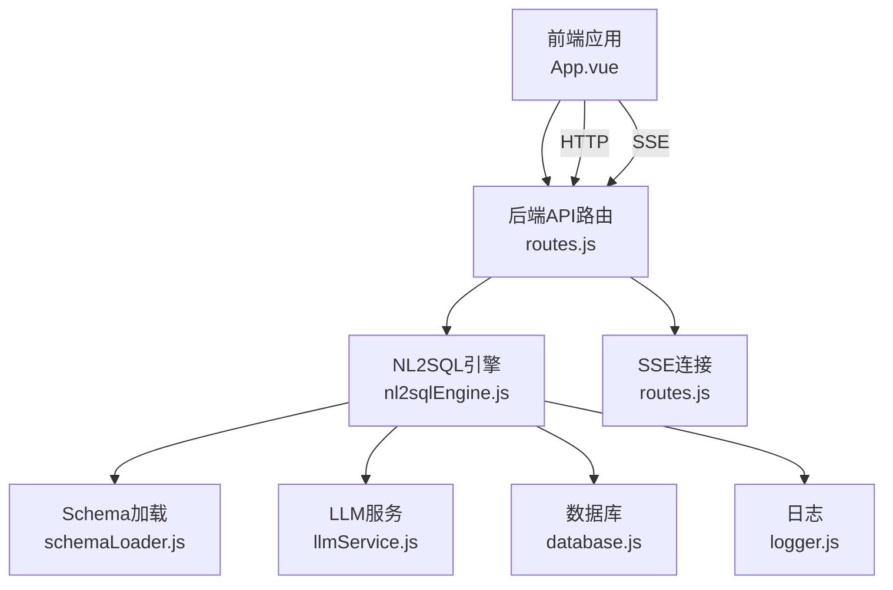
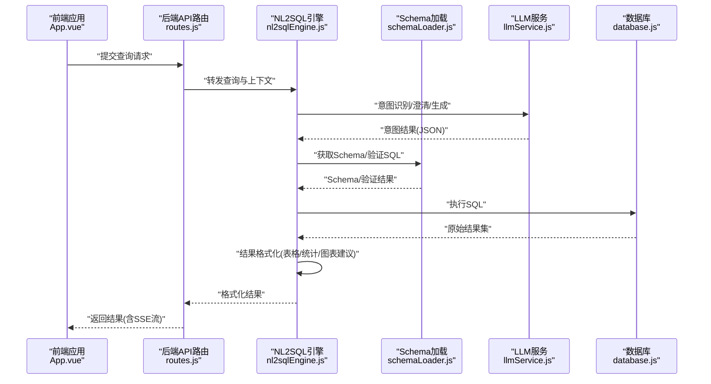
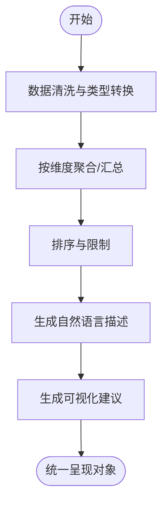
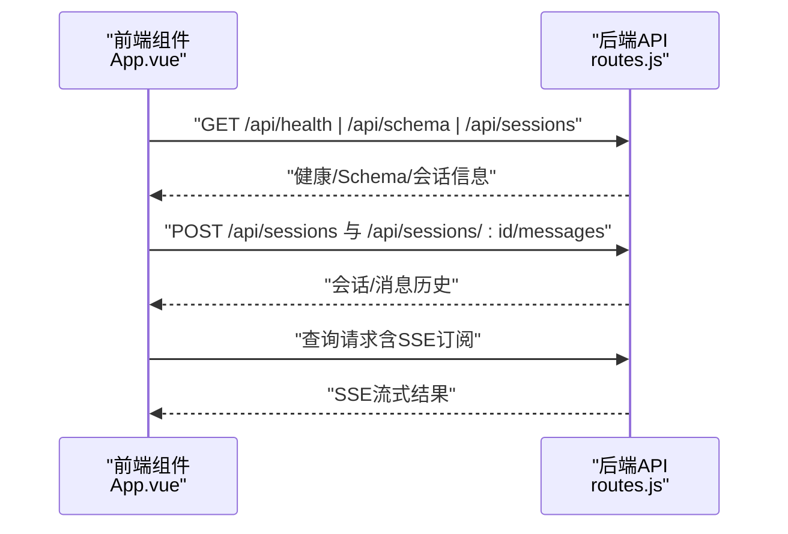
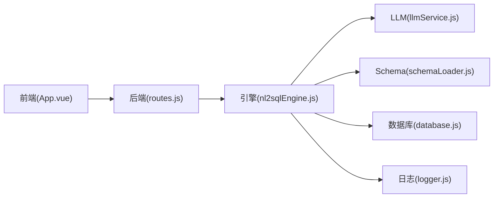

# 结果格式化与呈现

<cite>
**本文引用的文件**
- [nl2sqlEngine.js](file://backend/src/core/nl2sqlEngine.js)
- [routes.js](file://backend/src/core/routes.js)
- [llmService.js](file://backend/src/core/llmService.js)
- [logger.js](file://backend/src/utils/logger.js)
- [database.js](file://backend/src/core/database.js)
- [schemaLoader.js](file://backend/src/core/schemaLoader.js)
- [app.js](file://backend/src/app.js)
- [App.vue](file://frontend/src/App.vue)
</cite>

## 目录
1. [简介](#简介)
2. [项目结构](#项目结构)
3. [核心组件](#核心组件)
4. [架构总览](#架构总览)
5. [详细组件分析](#详细组件分析)
6. [依赖分析](#依赖分析)
7. [性能考虑](#性能考虑)
8. [故障排查指南](#故障排查指南)
9. [结论](#结论)
10. [附录](#附录)

## 简介
本文件聚焦NL2SQL引擎的“结果格式化与呈现”能力，系统梳理后端在获取SQL执行结果后，如何将其转换为面向用户的自然语言描述、表格与统计摘要，并为前端展示提供统一的数据结构与交互体验。文档覆盖以下主题：
- 结果格式化算法与数据结构转换
- 自然语言描述生成与可视化建议
- 多格式输出支持（表格、图表建议、统计摘要）
- 结果优化策略（聚合、排序、限制）
- 配置参数、性能优化与错误处理
- 与前端展示系统的集成关系与数据流转

## 项目结构
后端采用模块化设计，核心围绕“意图识别—SQL生成—执行—结果格式化—呈现”的链路组织。前端通过路由与状态管理驱动交互。

**图表来源**
- [routes.js:1-895](file://backend/src/core/routes.js#L1-L895)
- [nl2sqlEngine.js:1-2010](file://backend/src/core/nl2sqlEngine.js#L1-L2010)
- [schemaLoader.js:1-732](file://backend/src/core/schemaLoader.js#L1-L732)
- [llmService.js:1-432](file://backend/src/core/llmService.js#L1-L432)
- [database.js:1-850](file://backend/src/core/database.js#L1-L850)
- [logger.js:1-318](file://backend/src/utils/logger.js#L1-L318)
- [App.vue:1-373](file://frontend/src/App.vue#L1-L373)

**章节来源**
- [app.js:1-238](file://backend/src/app.js#L1-L238)
- [routes.js:1-895](file://backend/src/core/routes.js#L1-L895)
- [nl2sqlEngine.js:1-2010](file://backend/src/core/nl2sqlEngine.js#L1-L2010)

## 核心组件
- NL2SQL引擎：负责意图识别、实体解析、SQL生成与执行、以及结果格式化与呈现。
- LLM服务：提供意图识别与自然语言生成能力。
- Schema加载：提供表结构、指标、维度与关系，支撑SQL生成与结果解释。
- 数据库：执行SQL并返回原始结果集。
- 日志：统一记录执行过程与错误信息。
- 前端：通过路由与状态管理发起查询、接收结果并渲染。

**章节来源**
- [nl2sqlEngine.js:1-2010](file://backend/src/core/nl2sqlEngine.js#L1-L2010)
- [llmService.js:1-432](file://backend/src/core/llmService.js#L1-L432)
- [schemaLoader.js:1-732](file://backend/src/core/schemaLoader.js#L1-L732)
- [database.js:1-850](file://backend/src/core/database.js#L1-L850)
- [logger.js:1-318](file://backend/src/utils/logger.js#L1-L318)
- [routes.js:1-895](file://backend/src/core/routes.js#L1-L895)
- [App.vue:1-373](file://frontend/src/App.vue#L1-L373)

## 架构总览
后端通过Express提供REST API与SSE，前端通过HTTP与SSE与后端交互。NL2SQL引擎在后端内部完成意图识别、SQL生成与执行，并将结果格式化为多种呈现形式。

**图表来源**
- [routes.js:1-895](file://backend/src/core/routes.js#L1-L895)
- [nl2sqlEngine.js:1-2010](file://backend/src/core/nl2sqlEngine.js#L1-L2010)
- [schemaLoader.js:1-732](file://backend/src/core/schemaLoader.js#L1-L732)
- [llmService.js:1-432](file://backend/src/core/llmService.js#L1-L432)
- [database.js:1-850](file://backend/src/core/database.js#L1-L850)

## 详细组件分析

### 结果格式化算法与数据结构转换
- 输入：SQL执行后的原始结果集（数组行，每行字段映射）。
- 处理步骤：
  - 数据清洗与类型转换：将数值、日期、百分比等字段按Schema定义进行规范化。
  - 聚合与汇总：按维度字段进行分组聚合，生成统计摘要（如总计、均值、同比/环比）。
  - 排序与限制：依据指标与维度排序，应用limit限制结果规模。
  - 自然语言描述：基于指标、维度、时间范围与阈值生成自然语言摘要。
  - 可视化建议：根据维度与指标类型，推荐适合的图表类型（柱状、折线、饼图等）。
- 输出：统一的呈现对象，包含表格数据、统计摘要、自然语言描述与图表建议。

[本图为概念流程图，不直接映射具体源文件]

### 自然语言描述生成
- 基于指标、维度、时间范围与阈值，结合Schema定义与用户偏好，生成可读性强的自然语言摘要。
- 示例场景：
  - “在最近7天内，日活跃用户数平均为X，较上期增长Y%。”
  - “付费率在渠道维度上排名前三的分别为A、B、C。”

[本节为通用实现说明，不直接引用具体源文件]

### 多格式输出支持
- 表格格式：标准化列头（中英对照）、对齐与单位标注，支持分页与导出。
- 图表建议：根据指标类型（比率/金额/数量）与维度（时间/渠道）推荐柱状、折线、饼图等。
- 统计摘要：提供总计、均值、最大/最小、同比/环比等关键指标。

[本节为通用实现说明，不直接引用具体源文件]

### 结果优化策略
- 聚合：按维度字段进行GROUP BY，减少冗余行。
- 排序：优先按业务重要性与趋势排序（如按增长率、收入排序）。
- 限制：默认限制返回行数，避免大数据量影响性能与可读性。
- 缓存：对常用查询与模板结果进行短期缓存，提升响应速度。

[本节为通用实现说明，不直接引用具体源文件]

### 代码示例：结果格式化完整流程（路径指引）
以下为关键流程的代码路径指引，便于定位实现细节：
- 意图识别与SQL生成（含澄清与实体解析）：[nl2sqlEngine.js:497-780](file://backend/src/core/nl2sqlEngine.js#L497-L780)
- SQL执行与结果获取（数据库模块）：[database.js:361-424](file://backend/src/core/database.js#L361-L424)
- Schema验证与摘要（用于提示词与结果解释）：[schemaLoader.js:563-628](file://backend/src/core/schemaLoader.js#L563-L628)
- LLM调用与重试机制（用于意图识别与自然语言生成）：[llmService.js:222-311](file://backend/src/core/llmService.js#L222-L311)
- API路由与SSE（前端交互与流式输出）：[routes.js:1-895](file://backend/src/core/routes.js#L1-L895)
- 日志记录（错误与性能追踪）：[logger.js:227-293](file://backend/src/utils/logger.js#L227-L293)

**章节来源**
- [nl2sqlEngine.js:497-780](file://backend/src/core/nl2sqlEngine.js#L497-L780)
- [database.js:361-424](file://backend/src/core/database.js#L361-L424)
- [schemaLoader.js:563-628](file://backend/src/core/schemaLoader.js#L563-L628)
- [llmService.js:222-311](file://backend/src/core/llmService.js#L222-L311)
- [routes.js:1-895](file://backend/src/core/routes.js#L1-L895)
- [logger.js:227-293](file://backend/src/utils/logger.js#L227-L293)

### 与前端展示系统的集成关系
- 前端通过路由与状态管理发起查询，后端返回统一格式的结果对象。
- SSE用于流式传输中间态与增量结果，提升交互体验。
- 前端组件（如App.vue）负责会话管理、导航与弹窗（如Schema查看），与后端API协同工作。

**图表来源**
- [routes.js:1-895](file://backend/src/core/routes.js#L1-L895)
- [App.vue:1-373](file://frontend/src/App.vue#L1-L373)

**章节来源**
- [routes.js:1-895](file://backend/src/core/routes.js#L1-L895)
- [App.vue:1-373](file://frontend/src/App.vue#L1-L373)

## 依赖分析
- 引擎对LLM、Schema、数据库与日志模块存在直接依赖。
- 前端通过HTTP与SSE与后端交互，路由与状态管理驱动UI行为。

**图表来源**
- [routes.js:1-895](file://backend/src/core/routes.js#L1-L895)
- [nl2sqlEngine.js:1-2010](file://backend/src/core/nl2sqlEngine.js#L1-L2010)
- [llmService.js:1-432](file://backend/src/core/llmService.js#L1-L432)
- [schemaLoader.js:1-732](file://backend/src/core/schemaLoader.js#L1-L732)
- [database.js:1-850](file://backend/src/core/database.js#L1-L850)
- [logger.js:1-318](file://backend/src/utils/logger.js#L1-L318)
- [App.vue:1-373](file://frontend/src/App.vue#L1-L373)

**章节来源**
- [routes.js:1-895](file://backend/src/core/routes.js#L1-L895)
- [nl2sqlEngine.js:1-2010](file://backend/src/core/nl2sqlEngine.js#L1-L2010)
- [llmService.js:1-432](file://backend/src/core/llmService.js#L1-L432)
- [schemaLoader.js:1-732](file://backend/src/core/schemaLoader.js#L1-L732)
- [database.js:1-850](file://backend/src/core/database.js#L1-L850)
- [logger.js:1-318](file://backend/src/utils/logger.js#L1-L318)
- [App.vue:1-373](file://frontend/src/App.vue#L1-L373)

## 性能考虑
- SQL执行限制：通过配置限制最大返回行数与查询超时，避免长尾查询拖慢系统。
- 缓存策略：对Schema与常用查询模板进行缓存，降低重复计算成本。
- 分批处理：Embedding与向量存储采用分批处理，避免单次请求过大。
- 日志级别：生产环境建议调整日志级别，减少高频写入对I/O的影响。

[本节为通用指导，不直接引用具体源文件]

## 故障排查指南
- LLM调用失败：检查API密钥、超时与重试配置，查看日志中的错误堆栈。
- SQL执行异常：核对SQL验证规则与白名单，检查数据库连接与权限。
- Schema加载失败：确认配置文件路径与格式，检查向量存储初始化状态。
- 前端无响应：确认SSE连接状态与路由路径，检查CORS与跨域配置。

**章节来源**
- [llmService.js:167-195](file://backend/src/core/llmService.js#L167-L195)
- [logger.js:283-293](file://backend/src/utils/logger.js#L283-L293)
- [schemaLoader.js:69-122](file://backend/src/core/schemaLoader.js#L69-L122)
- [routes.js:44-52](file://backend/src/core/routes.js#L44-L52)

## 结论
NL2SQL引擎的结果格式化与呈现模块通过“意图识别—SQL生成—执行—格式化—呈现”的闭环，实现了从自然语言到结构化结果与可视化建议的完整链路。后端提供统一的API与SSE接口，前端通过路由与状态管理实现流畅的交互体验。通过合理的数据结构转换、聚合与排序策略、多格式输出与可视化建议，以及完善的配置与错误处理，系统在易用性与性能之间取得了良好平衡。

## 附录
- 配置参数建议
  - 安全与性能：最大返回行数、查询超时、日志级别。
  - 功能开关：澄清机制、向量检索、流式输出。
- 错误处理策略
  - LLM重试与超时处理、SQL验证与白名单、Schema缓存失效与重建。
- 前端集成要点
  - 会话管理、消息历史、Schema查看与设置入口。

[本节为通用指导，不直接引用具体源文件]