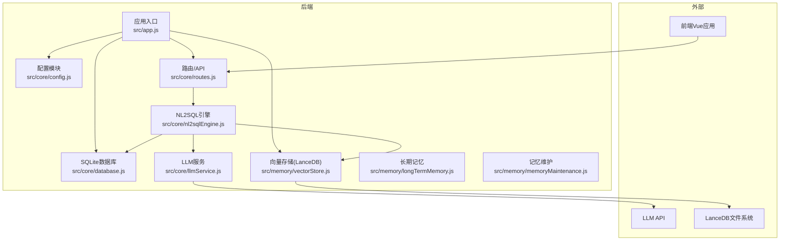
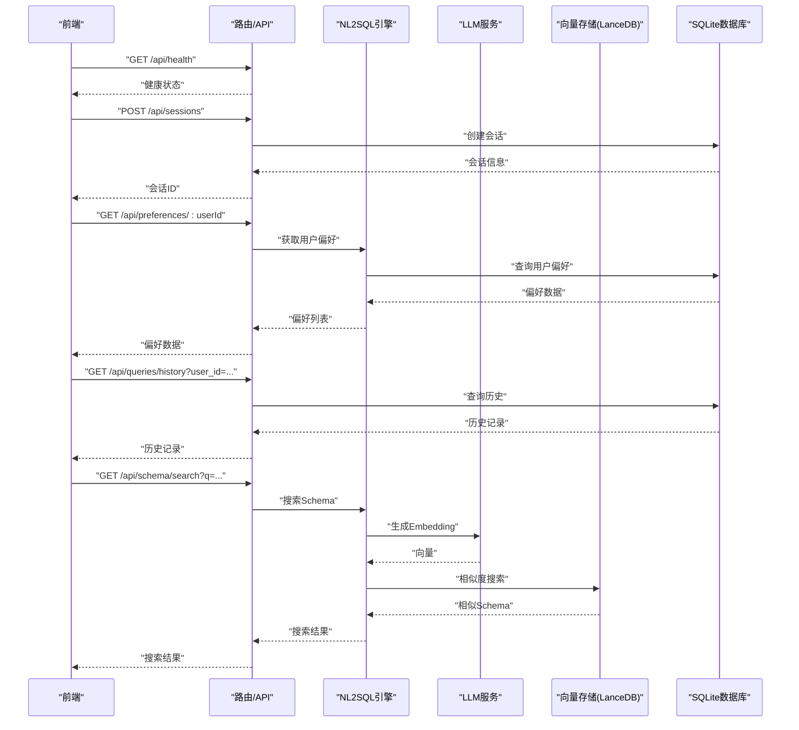
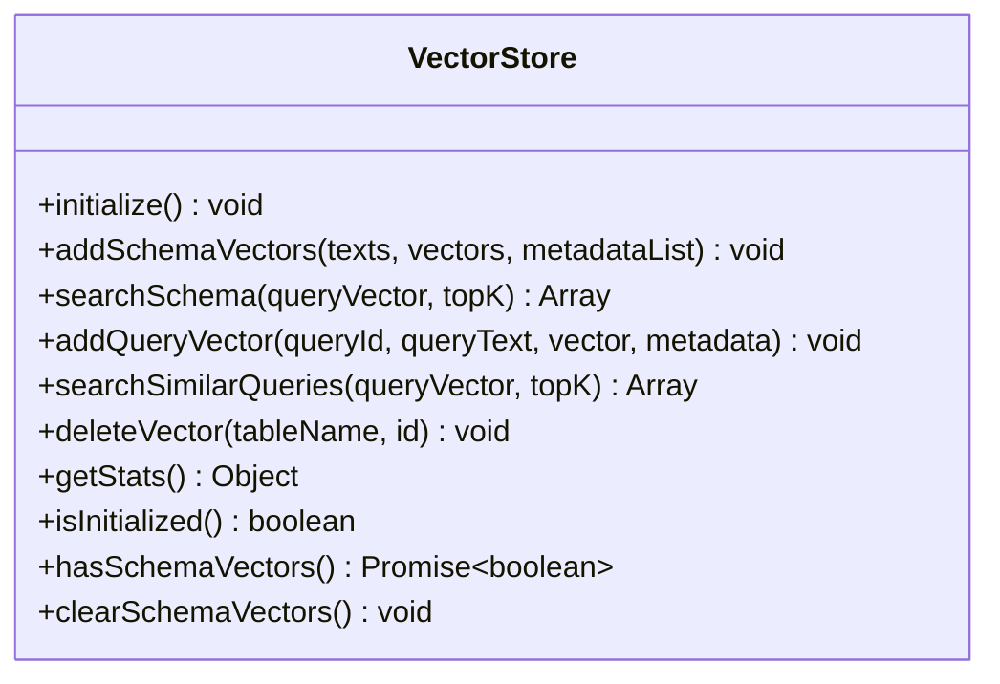
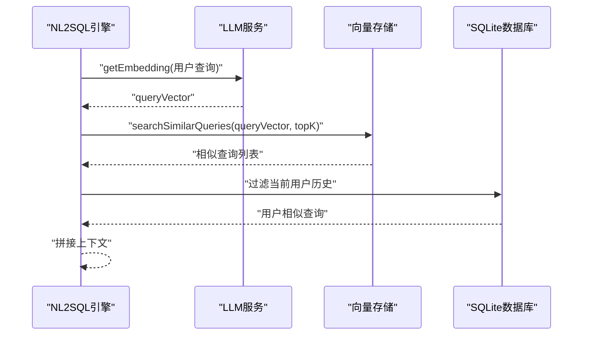
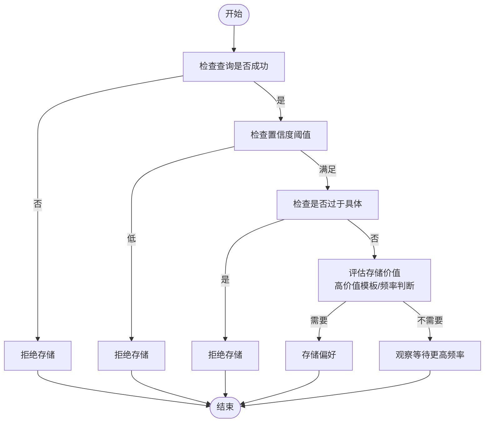
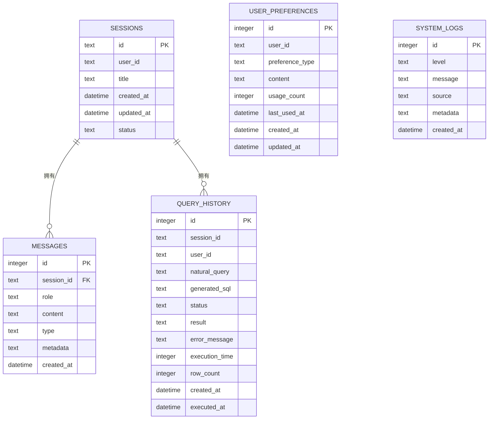
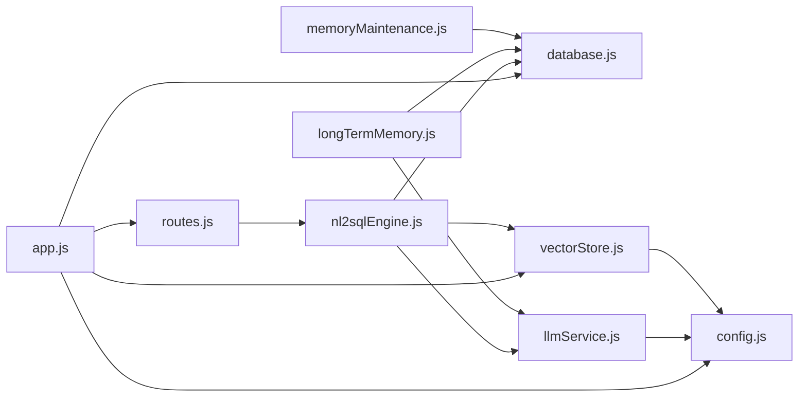

# 向量检索系统

<cite>
**本文引用的文件**
- [backend/src/memory/vectorStore.js](file://backend/src/memory/vectorStore.js)
- [backend/src/core/nl2sqlEngine.js](file://backend/src/core/nl2sqlEngine.js)
- [backend/src/core/llmService.js](file://backend/src/core/llmService.js)
- [backend/src/memory/longTermMemory.js](file://backend/src/memory/longTermMemory.js)
- [backend/src/core/config.js](file://backend/src/core/config.js)
- [backend/src/memory/memoryMaintenance.js](file://backend/src/memory/memoryMaintenance.js)
- [backend/src/core/routes.js](file://backend/src/core/routes.js)
- [backend/src/core/database.js](file://backend/src/core/database.js)
- [backend/src/app.js](file://backend/src/app.js)
- [backend/package.json](file://backend/package.json)
- [backend/config/schema-metadata.json](file://backend/config/schema-metadata.json)
</cite>

## 目录
1. [简介](#简介)
2. [项目结构](#项目结构)
3. [核心组件](#核心组件)
4. [架构总览](#架构总览)
5. [详细组件分析](#详细组件分析)
6. [依赖关系分析](#依赖关系分析)
7. [性能考虑](#性能考虑)
8. [故障排除指南](#故障排除指南)
9. [结论](#结论)
10. [附录](#附录)

## 简介
本技术文档面向向量检索系统，聚焦于LanceDB集成实现、语义搜索算法、查询历史向量化流程、向量存储策略、性能优化与LLM服务集成。系统通过LanceDB存储Schema与查询历史的向量，结合LLM生成Embedding，实现语义相似度检索，支撑NL2SQL引擎的意图识别与历史查询参考。

## 项目结构
后端采用模块化分层设计：
- 核心层：配置、数据库、LLM服务、路由、NL2SQL引擎
- 记忆层：长期记忆、向量存储、记忆维护
- 前端：Vue单页应用，通过REST API与后端交互

**图表来源**
- [backend/src/app.js:1-238](file://backend/src/app.js#L1-L238)
- [backend/src/core/config.js:1-332](file://backend/src/core/config.js#L1-L332)
- [backend/src/core/database.js:1-850](file://backend/src/core/database.js#L1-L850)
- [backend/src/memory/vectorStore.js:1-442](file://backend/src/memory/vectorStore.js#L1-L442)
- [backend/src/core/llmService.js:1-432](file://backend/src/core/llmService.js#L1-L432)
- [backend/src/core/nl2sqlEngine.js:1-800](file://backend/src/core/nl2sqlEngine.js#L1-L800)
- [backend/src/core/routes.js:1-895](file://backend/src/core/routes.js#L1-L895)
- [backend/src/memory/longTermMemory.js:1-800](file://backend/src/memory/longTermMemory.js#L1-L800)
- [backend/src/memory/memoryMaintenance.js:1-415](file://backend/src/memory/memoryMaintenance.js#L1-L415)

**章节来源**
- [backend/src/app.js:97-166](file://backend/src/app.js#L97-L166)
- [backend/src/core/config.js:16-332](file://backend/src/core/config.js#L16-L332)

## 核心组件
- 向量存储模块：基于LanceDB，提供Schema向量与查询历史向量的增删改查、统计与初始化能力
- LLM服务模块：封装HTTP请求、重试机制、Embedding生成与聊天接口
- NL2SQL引擎：意图识别、实体解析、历史查询参考、SQL生成与验证
- 长期记忆模块：用户偏好抽取、存储与合并，支持字段别名、查询模式、指标/维度偏好
- 记忆维护模块：分级保留策略、相似模式合并、统计与健康报告
- 数据库模块：SQLite持久化（会话、消息、查询历史、用户偏好）
- 路由模块：REST API定义（健康检查、Schema、会话、查询历史、偏好、统计）

**章节来源**
- [backend/src/memory/vectorStore.js:49-146](file://backend/src/memory/vectorStore.js#L49-L146)
- [backend/src/core/llmService.js:324-379](file://backend/src/core/llmService.js#L324-L379)
- [backend/src/core/nl2sqlEngine.js:493-776](file://backend/src/core/nl2sqlEngine.js#L493-L776)
- [backend/src/memory/longTermMemory.js:311-484](file://backend/src/memory/longTermMemory.js#L311-L484)
- [backend/src/memory/memoryMaintenance.js:69-189](file://backend/src/memory/memoryMaintenance.js#L69-L189)
- [backend/src/core/database.js:39-189](file://backend/src/core/database.js#L39-L189)
- [backend/src/core/routes.js:58-800](file://backend/src/core/routes.js#L58-L800)

## 架构总览
系统通过应用入口初始化数据库、向量存储、Schema元数据与自修复调度器，随后启动HTTP服务。前端通过REST API与后端交互，后端内部通过LLM服务生成Embedding，向量存储模块进行语义检索，NL2SQL引擎结合历史查询与长期记忆提升意图识别质量。

**图表来源**
- [backend/src/core/routes.js:58-800](file://backend/src/core/routes.js#L58-L800)
- [backend/src/core/nl2sqlEngine.js:493-776](file://backend/src/core/nl2sqlEngine.js#L493-L776)
- [backend/src/core/llmService.js:324-379](file://backend/src/core/llmService.js#L324-L379)
- [backend/src/memory/vectorStore.js:201-307](file://backend/src/memory/vectorStore.js#L201-L307)
- [backend/src/core/database.js:458-596](file://backend/src/core/database.js#L458-L596)

## 详细组件分析

### 向量存储模块（LanceDB）
- 初始化：连接LanceDB目录，打开或创建schema_vectors与query_vectors表
- Schema向量：批量添加、语义搜索（topK）、统计与存在性检查
- 查询历史向量：单条添加、相似查询搜索、统计
- 通用能力：删除占位（LanceDB暂不支持直接删除）、统计、清空提示
- 配置：向量维度来自配置，数据库路径来自配置

**图表来源**
- [backend/src/memory/vectorStore.js:49-442](file://backend/src/memory/vectorStore.js#L49-L442)

**章节来源**
- [backend/src/memory/vectorStore.js:49-146](file://backend/src/memory/vectorStore.js#L49-L146)
- [backend/src/memory/vectorStore.js:160-191](file://backend/src/memory/vectorStore.js#L160-L191)
- [backend/src/memory/vectorStore.js:201-230](file://backend/src/memory/vectorStore.js#L201-L230)
- [backend/src/memory/vectorStore.js:245-271](file://backend/src/memory/vectorStore.js#L245-L271)
- [backend/src/memory/vectorStore.js:281-307](file://backend/src/memory/vectorStore.js#L281-L307)
- [backend/src/memory/vectorStore.js:319-372](file://backend/src/memory/vectorStore.js#L319-L372)

### 语义搜索算法与查询历史向量化
- 嵌入向量生成：通过LLM服务的Embedding接口生成查询文本向量
- 相似度计算：LanceDB表search接口返回向量距离，越小越相似
- 结果排序：按距离排序，限制topK
- 查询历史向量化：在NL2SQL引擎中，意图识别阶段对用户查询生成向量并检索相似历史，过滤当前用户ID，用于补充上下文

**图表来源**
- [backend/src/core/nl2sqlEngine.js:584-614](file://backend/src/core/nl2sqlEngine.js#L584-L614)
- [backend/src/core/llmService.js:324-379](file://backend/src/core/llmService.js#L324-L379)
- [backend/src/memory/vectorStore.js:281-307](file://backend/src/memory/vectorStore.js#L281-L307)

**章节来源**
- [backend/src/core/nl2sqlEngine.js:584-614](file://backend/src/core/nl2sqlEngine.js#L584-L614)
- [backend/src/core/llmService.js:324-379](file://backend/src/core/llmService.js#L324-L379)
- [backend/src/memory/vectorStore.js:281-307](file://backend/src/memory/vectorStore.js#L281-L307)

### 长期记忆与偏好抽取
- 偏好类型：查询模式、字段别名、指标偏好、维度偏好
- 存储策略：置信度阈值、高价值模板、频率判断、分级保留
- 智能提取：可启用LLM分析，区分个人偏好与通用知识
- 合并相似模式：维度/指标重合度阈值，合并使用次数

**图表来源**
- [backend/src/memory/longTermMemory.js:311-484](file://backend/src/memory/longTermMemory.js#L311-L484)
- [backend/src/memory/memoryMaintenance.js:201-309](file://backend/src/memory/memoryMaintenance.js#L201-L309)

**章节来源**
- [backend/src/memory/longTermMemory.js:251-295](file://backend/src/memory/longTermMemory.js#L251-L295)
- [backend/src/memory/longTermMemory.js:311-484](file://backend/src/memory/longTermMemory.js#L311-L484)
- [backend/src/memory/memoryMaintenance.js:69-189](file://backend/src/memory/memoryMaintenance.js#L69-L189)
- [backend/src/memory/memoryMaintenance.js:201-309](file://backend/src/memory/memoryMaintenance.js#L201-L309)

### 数据模型与持久化
- SQLite表结构：sessions、messages、query_history、user_preferences、system_logs
- 索引：按user_id、session_id、created_at、status等建立索引
- 外键约束：启用外键，CASCADE删除消息以保证一致性
- 迁移：自动检测并重建user_preferences表以移除UNIQUE约束

**图表来源**
- [backend/src/core/database.js:39-189](file://backend/src/core/database.js#L39-L189)

**章节来源**
- [backend/src/core/database.js:39-189](file://backend/src/core/database.js#L39-L189)
- [backend/src/core/database.js:271-336](file://backend/src/core/database.js#L271-L336)

### API使用示例与配置参数
- 健康检查：GET /api/health、/api/health/detail
- Schema接口：GET /api/schema、/api/schema/tables/:tableName、/api/schema/search
- 会话接口：POST /api/sessions、GET /api/sessions/:sessionId、DELETE /api/sessions/:sessionId、GET /api/sessions/:sessionId/messages、GET /api/users/:userId/sessions
- 查询历史：GET /api/queries/history
- 偏好接口：GET /api/preferences/:userId/raw、/api/preferences/:userId/stats、GET /api/preferences/:userId、POST /api/preferences/:userId/templates、DELETE /api/preferences/:preferenceId、POST /api/preferences/:userId/learn-alias
- 统计接口：GET /api/stats
- 配置接口：GET /api/config

关键配置项（来自配置模块）：
- LLM：apiBase、apiKey、model、timeout、maxRetries、retryDelay
- Embedding：model、dimension、timeout
- 数据库：path（SQLite）
- 向量数据库：path（LanceDB）
- SR数据库：url、pool配置
- 安全：allowedTables、dryRun、maxQueryRows、queryTimeout、forbiddenKeywords、sensitiveFields
- 会话：maxHistory、expireTime、cleanupInterval
- 日志：level、file、console、fileOutput、maxSize、maxFiles
- 自修复：enabled、dailyCheckCron、sessionCheckInterval、slowQueryThreshold
- Schema：configPath、enableCache、cacheExpireTime、revectorize
- 长期记忆：enabled、useLLMForExtraction、thresholds、retention

**章节来源**
- [backend/src/core/routes.js:58-800](file://backend/src/core/routes.js#L58-L800)
- [backend/src/core/config.js:55-288](file://backend/src/core/config.js#L55-L288)

## 依赖关系分析
- 应用入口依赖配置、数据库、向量存储、路由、自修复
- NL2SQL引擎依赖LLM服务、向量存储、数据库、Schema加载
- LLM服务依赖HTTP模块、配置、日志
- 向量存储依赖LanceDB、配置、日志
- 长期记忆依赖数据库、LLM服务、配置
- 记忆维护依赖数据库、配置
- 路由依赖数据库、Schema加载、SSE处理器

**图表来源**
- [backend/src/app.js:39-51](file://backend/src/app.js#L39-L51)
- [backend/src/core/nl2sqlEngine.js:16-26](file://backend/src/core/nl2sqlEngine.js#L16-L26)
- [backend/src/core/llmService.js:15-25](file://backend/src/core/llmService.js#L15-L25)
- [backend/src/memory/vectorStore.js:14-20](file://backend/src/memory/vectorStore.js#L14-L20)
- [backend/src/memory/longTermMemory.js:17-21](file://backend/src/memory/longTermMemory.js#L17-L21)
- [backend/src/memory/memoryMaintenance.js:16-19](file://backend/src/memory/memoryMaintenance.js#L16-L19)
- [backend/src/core/routes.js:16-28](file://backend/src/core/routes.js#L16-L28)

**章节来源**
- [backend/src/app.js:39-51](file://backend/src/app.js#L39-L51)
- [backend/src/core/nl2sqlEngine.js:16-26](file://backend/src/core/nl2sqlEngine.js#L16-L26)
- [backend/src/core/llmService.js:15-25](file://backend/src/core/llmService.js#L15-L25)
- [backend/src/memory/vectorStore.js:14-20](file://backend/src/memory/vectorStore.js#L14-L20)
- [backend/src/memory/longTermMemory.js:17-21](file://backend/src/memory/longTermMemory.js#L17-L21)
- [backend/src/memory/memoryMaintenance.js:16-19](file://backend/src/memory/memoryMaintenance.js#L16-L19)
- [backend/src/core/routes.js:16-28](file://backend/src/core/routes.js#L16-L28)

## 性能考虑
- 索引与查询优化
  - 向量搜索：LanceDB表search接口限制topK，减少结果集
  - SQLite索引：按user_id、session_id、created_at、status建立索引，加速查询
  - 外键约束：启用外键保证数据一致性，避免脏数据
- 缓存与批处理
  - Embedding：LLM服务支持重试与超时控制，避免单次请求阻塞
  - Schema缓存：配置中提供Schema缓存开关与过期时间
- 并发与资源
  - HTTP服务：Express + 原生http模块，CORS与bodyParser中间件
  - 自修复：定时任务执行健康检查与维护，降低运行时压力
- 存储策略
  - 向量存储：LanceDB文件系统，适合中小规模向量检索
  - SQLite：轻量级，适合会话、消息、偏好等结构化数据

**章节来源**
- [backend/src/memory/vectorStore.js:201-230](file://backend/src/memory/vectorStore.js#L201-L230)
- [backend/src/core/database.js:39-189](file://backend/src/core/database.js#L39-L189)
- [backend/src/core/llmService.js:167-195](file://backend/src/core/llmService.js#L167-L195)
- [backend/src/core/config.js:235-245](file://backend/src/core/config.js#L235-L245)
- [backend/src/app.js:63-73](file://backend/src/app.js#L63-L73)
- [backend/src/core/selfRepair.js](file://backend/src/core/selfRepair.js)

## 故障排除指南
- 向量数据库未初始化
  - 现象：添加/搜索向量返回空或警告
  - 排查：确认LanceDB路径存在、权限正确；检查初始化日志
  - 参考：[backend/src/memory/vectorStore.js:55-85](file://backend/src/memory/vectorStore.js#L55-L85)
- LLM API调用失败
  - 现象：Embedding或聊天请求报错
  - 排查：检查apiBase、apiKey、timeout；查看重试日志；确认网络连通
  - 参考：[backend/src/core/llmService.js:257-277](file://backend/src/core/llmService.js#L257-L277)
- SQLite迁移失败
  - 现象：启动时报UNIQUE约束问题
  - 排查：查看迁移日志；确认数据库文件权限；手动备份后重试
  - 参考：[backend/src/core/database.js:271-336](file://backend/src/core/database.js#L271-L336)
- 健康检查异常
  - 现象：/api/health/detail返回error
  - 排查：检查数据库连接、LLM配置、Schema加载状态
  - 参考：[backend/src/core/routes.js:98-135](file://backend/src/core/routes.js#L98-L135)
- 配置校验错误
  - 现象：启动时报缺少必要配置
  - 排查：检查LLM_API_KEY、SR_DATABASE_URL；查看配置校验日志
  - 参考：[backend/src/core/config.js:300-332](file://backend/src/core/config.js#L300-L332)

**章节来源**
- [backend/src/memory/vectorStore.js:55-85](file://backend/src/memory/vectorStore.js#L55-L85)
- [backend/src/core/llmService.js:257-277](file://backend/src/core/llmService.js#L257-L277)
- [backend/src/core/database.js:271-336](file://backend/src/core/database.js#L271-L336)
- [backend/src/core/routes.js:98-135](file://backend/src/core/routes.js#L98-L135)
- [backend/src/core/config.js:300-332](file://backend/src/core/config.js#L300-L332)

## 结论
本系统通过LanceDB实现Schema与查询历史的向量检索，结合LLM的Embedding能力，显著提升了NL2SQL引擎对用户意图的理解与历史查询参考效率。SQLite承担结构化数据持久化，长期记忆与记忆维护模块保障个性化体验与系统健康。通过合理的索引、缓存与并发控制策略，系统在中小规模场景下具备良好的性能与可维护性。

## 附录
- 环境与依赖
  - Node.js版本要求：>=18.0.0
  - 关键依赖：express、vectordb、sqlite3、dotenv、cors、body-parser、uuid、dayjs、node-cron
  - 参考：[backend/package.json:10-27](file://backend/package.json#L10-L27)
- Schema元数据
  - Schema配置文件路径：config/schema-metadata.json
  - 参考：[backend/config/schema-metadata.json:1-800](file://backend/config/schema-metadata.json#L1-L800)