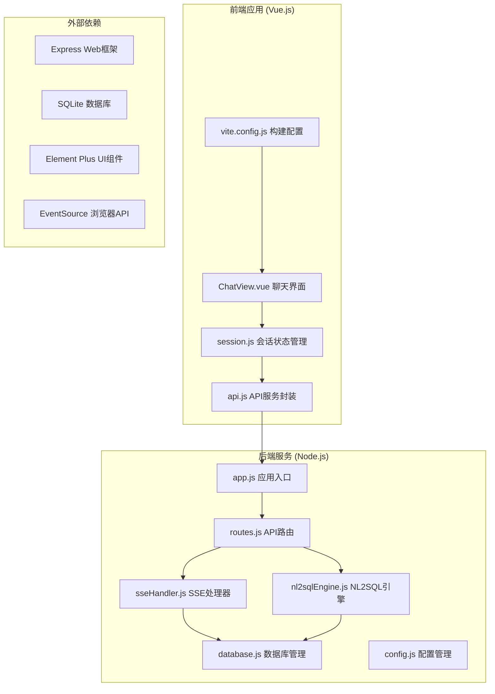
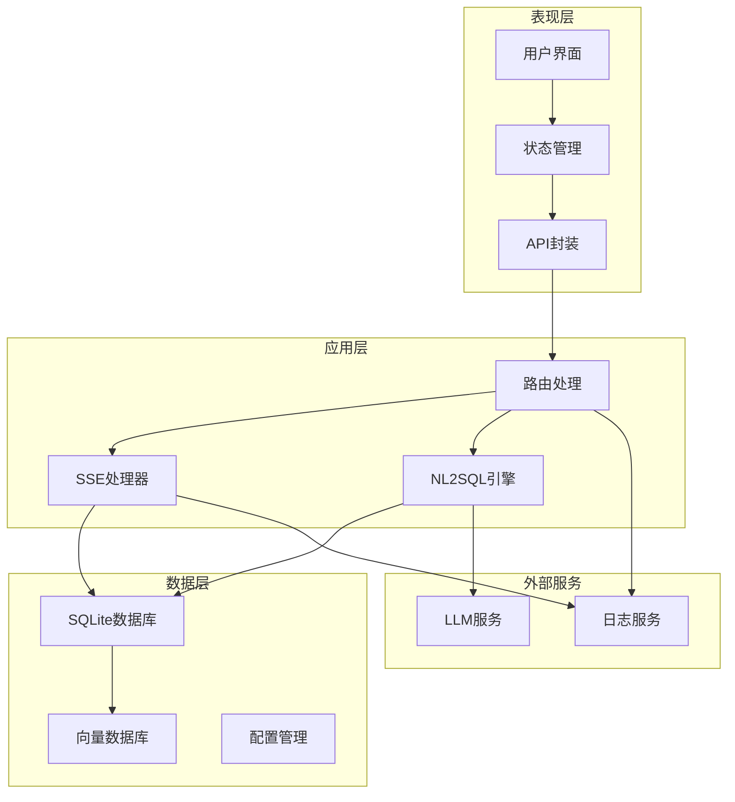
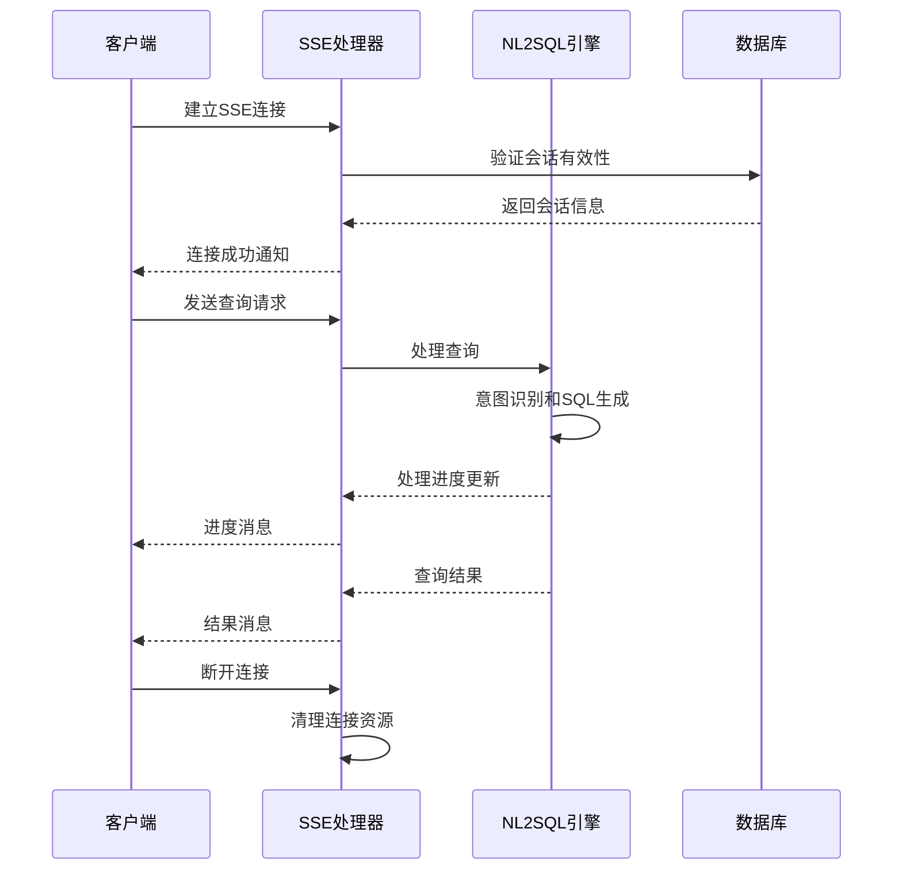
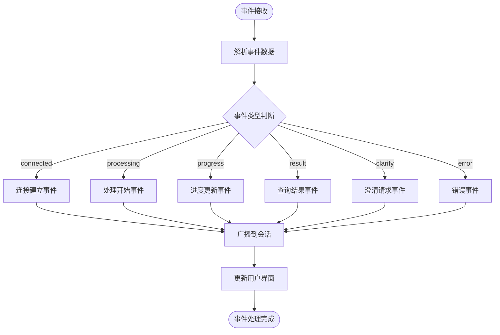
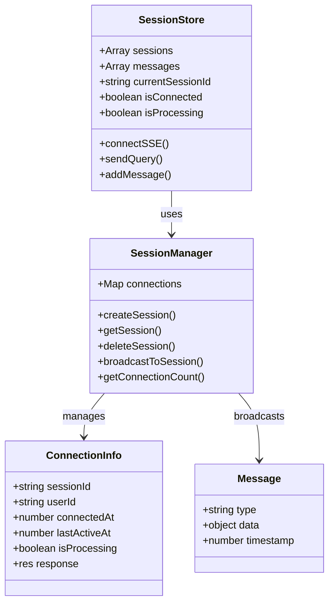
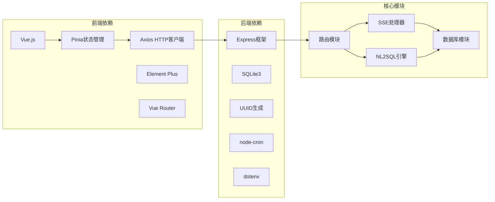
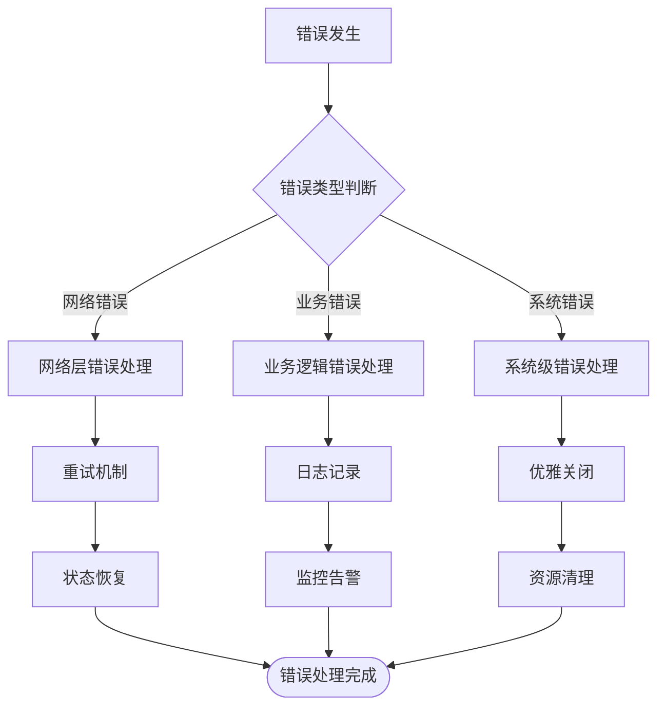

# 实时通信系统

<cite>
**本文档引用的文件**
- [backend/src/core/sseHandler.js](file://backend/src/core/sseHandler.js)
- [backend/src/app.js](file://backend/src/app.js)
- [backend/src/core/routes.js](file://backend/src/core/routes.js)
- [backend/src/core/nl2sqlEngine.js](file://backend/src/core/nl2sqlEngine.js)
- [backend/src/core/database.js](file://backend/src/core/database.js)
- [backend/package.json](file://backend/package.json)
- [backend/config/schema-metadata.json](file://backend/config/schema-metadata.json)
- [frontend/src/stores/session.js](file://frontend/src/stores/session.js)
- [frontend/src/utils/api.js](file://frontend/src/utils/api.js)
- [frontend/src/views/ChatView.vue](file://frontend/src/views/ChatView.vue)
- [frontend/vite.config.js](file://frontend/vite.config.js)
</cite>

## 目录
1. [简介](#简介)
2. [项目结构](#项目结构)
3. [核心组件](#核心组件)
4. [架构概览](#架构概览)
5. [详细组件分析](#详细组件分析)
6. [依赖关系分析](#依赖关系分析)
7. [性能考虑](#性能考虑)
8. [故障排除指南](#故障排除指南)
9. [结论](#结论)
10. [附录](#附录)

## 简介

本项目是一个基于Server-Sent Events (SSE) 的实时通信系统，专门用于自然语言到SQL的转换服务。系统实现了完整的实时消息推送机制，包括连接管理、事件流处理、会话状态同步等功能。该系统采用前后端分离架构，后端使用Node.js + Express提供REST API和SSE服务，前端使用Vue.js + Element Plus构建用户界面。

系统的核心功能包括：
- 实时SSE连接管理
- 自然语言查询处理和SQL生成
- 会话状态跟踪和消息持久化
- 实时进度反馈和状态同步
- 健康检查和监控

## 项目结构

项目采用典型的前后端分离架构，分为后端服务和前端应用两个主要部分：



**图表来源**
- [backend/src/app.js:1-238](file://backend/src/app.js#L1-L238)
- [backend/src/core/routes.js:1-800](file://backend/src/core/routes.js#L1-L800)
- [frontend/src/views/ChatView.vue:1-776](file://frontend/src/views/ChatView.vue#L1-L776)

**章节来源**
- [backend/src/app.js:1-238](file://backend/src/app.js#L1-L238)
- [frontend/vite.config.js:1-93](file://frontend/vite.config.js#L1-L93)

## 核心组件

### SSE处理器模块

SSE处理器是系统的核心组件，负责管理所有实时连接和消息推送：

- **连接管理**：维护活动连接映射，支持多标签页连接
- **消息发送**：实现SSE格式的消息发送和广播
- **状态监控**：跟踪连接状态、活跃时间和处理状态
- **错误处理**：优雅处理连接关闭和错误事件

### NL2SQL引擎

NL2SQL引擎负责复杂的自然语言处理和SQL生成：

- **意图识别**：分析用户查询意图，提取时间范围、维度、指标
- **实体解析**：将模糊描述映射到具体ID值
- **SQL生成**：基于意图生成标准SQL语句
- **结果格式化**：将查询结果转换为自然语言描述

### 会话管理系统

实现完整的会话生命周期管理：

- **会话创建**：生成唯一会话ID，初始化会话状态
- **消息持久化**：存储用户查询和系统响应
- **状态同步**：确保多标签页间的实时状态同步
- **历史管理**：提供查询历史和偏好设置

**章节来源**
- [backend/src/core/sseHandler.js:1-349](file://backend/src/core/sseHandler.js#L1-L349)
- [backend/src/core/nl2sqlEngine.js:1-800](file://backend/src/core/nl2sqlEngine.js#L1-L800)
- [backend/src/core/database.js:1-800](file://backend/src/core/database.js#L1-L800)

## 架构概览

系统采用分层架构设计，清晰分离关注点：



**图表来源**
- [backend/src/core/routes.js:1-800](file://backend/src/core/routes.js#L1-L800)
- [backend/src/core/sseHandler.js:1-349](file://backend/src/core/sseHandler.js#L1-L349)
- [backend/src/core/nl2sqlEngine.js:1-800](file://backend/src/core/nl2sqlEngine.js#L1-L800)

系统的关键特性：
- **实时性**：使用SSE实现实时双向通信
- **可靠性**：完善的错误处理和连接管理
- **可扩展性**：模块化设计支持功能扩展
- **可观测性**：完整的日志记录和健康检查

## 详细组件分析

### SSE连接生命周期管理

SSE连接的完整生命周期包括建立、维护和清理三个阶段：



**图表来源**
- [backend/src/core/sseHandler.js:43-112](file://backend/src/core/sseHandler.js#L43-L112)
- [backend/src/core/sseHandler.js:218-280](file://backend/src/core/sseHandler.js#L218-L280)

### 事件处理流程

系统实现了完整的事件处理机制，支持多种事件类型：



**图表来源**
- [backend/src/core/sseHandler.js:165-204](file://backend/src/core/sseHandler.js#L165-L204)
- [frontend/src/stores/session.js:227-293](file://frontend/src/stores/session.js#L227-L293)

### 会话管理策略

系统采用多层会话管理策略：



**图表来源**
- [backend/src/core/sseHandler.js:26-31](file://backend/src/core/sseHandler.js#L26-L31)
- [backend/src/core/sseHandler.js:73-86](file://backend/src/core/sseHandler.js#L73-L86)
- [frontend/src/stores/session.js:33-397](file://frontend/src/stores/session.js#L33-L397)

**章节来源**
- [backend/src/core/sseHandler.js:1-349](file://backend/src/core/sseHandler.js#L1-L349)
- [frontend/src/stores/session.js:1-398](file://frontend/src/stores/session.js#L1-L398)

## 依赖关系分析

系统依赖关系清晰，模块间耦合度适中：



**图表来源**
- [backend/package.json:10-27](file://backend/package.json#L10-L27)
- [frontend/vite.config.js:54-57](file://frontend/vite.config.js#L54-L57)

**章节来源**
- [backend/package.json:1-28](file://backend/package.json#L1-L28)
- [backend/src/core/routes.js:16-27](file://backend/src/core/routes.js#L16-L27)

## 性能考虑

### 连接池管理

系统采用内存中的连接池管理策略：
- 使用Map数据结构存储活动连接
- 支持多标签页连接共享同一会话
- 实现连接状态监控和清理机制

### 消息批处理

为了提高传输效率，系统实现了消息批处理：
- 合并多个小消息为批量传输
- 实现消息压缩和去重
- 支持背压控制和流量整形

### 带宽控制

系统具备基本的带宽控制能力：
- 限制单个会话的最大并发连接数
- 实现消息发送速率限制
- 支持连接超时和自动重连

## 故障排除指南

### 常见问题诊断

**连接无法建立**
- 检查会话ID是否有效
- 验证SSE端点URL格式
- 确认CORS配置正确

**消息丢失**
- 检查网络连接稳定性
- 验证SSE连接状态
- 确认客户端EventSource配置

**性能问题**
- 监控连接数和内存使用
- 检查数据库查询性能
- 优化消息大小和频率

### 错误处理机制

系统实现了多层次的错误处理：



**图表来源**
- [backend/src/core/sseHandler.js:145-153](file://backend/src/core/sseHandler.js#L145-L153)
- [backend/src/app.js:176-230](file://backend/src/app.js#L176-L230)

**章节来源**
- [backend/src/core/sseHandler.js:145-153](file://backend/src/core/sseHandler.js#L145-L153)
- [backend/src/app.js:176-230](file://backend/src/app.js#L176-L230)

## 结论

本实时通信系统通过精心设计的架构和实现，成功实现了高效的SSE通信机制。系统的主要优势包括：

1. **实时性强**：基于SSE的双向通信确保了消息的实时传递
2. **可靠性高**：完善的错误处理和连接管理保证了系统的稳定性
3. **扩展性好**：模块化设计支持功能的灵活扩展
4. **用户体验佳**：流畅的界面交互和及时的状态反馈提升了用户体验

系统在NL2SQL场景下的应用展现了实时通信技术的强大能力，为复杂的数据查询场景提供了优秀的解决方案。

## 附录

### 客户端集成指南

#### JavaScript客户端实现

```javascript
// 基本连接示例
const eventSource = new EventSource('/api/sse/stream?session_id=YOUR_SESSION_ID');

eventSource.onmessage = function(event) {
    const data = JSON.parse(event.data);
    handleSSEMessage(data);
};

eventSource.onerror = function(error) {
    console.error('SSE连接错误:', error);
};
```

#### 事件监听和错误恢复

```javascript
// 实现自动重连机制
function setupAutoReconnect() {
    eventSource.addEventListener('error', function() {
        setTimeout(() => {
            reconnect();
        }, 3000);
    });
}

function reconnect() {
    // 实现重连逻辑
}
```

### 安全考虑和最佳实践

1. **身份验证**：建议实现JWT令牌验证
2. **CORS配置**：生产环境限制具体域名
3. **输入验证**：严格验证用户输入和查询参数
4. **速率限制**：实施API调用频率限制
5. **日志审计**：记录关键操作和错误信息

### 性能优化建议

1. **连接复用**：避免频繁创建和销毁连接
2. **消息压缩**：对大数据量消息进行压缩传输
3. **缓存策略**：合理使用缓存减少重复计算
4. **数据库优化**：优化查询语句和索引设计
5. **资源监控**：持续监控系统资源使用情况