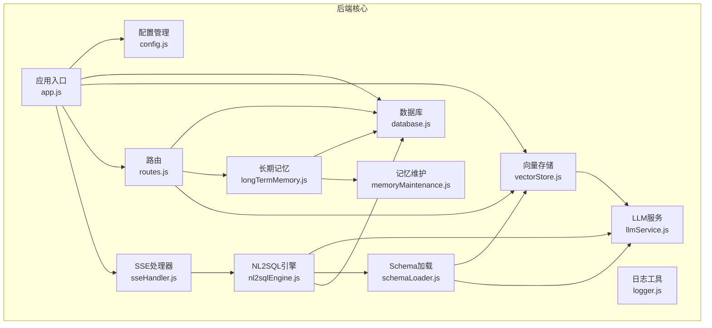
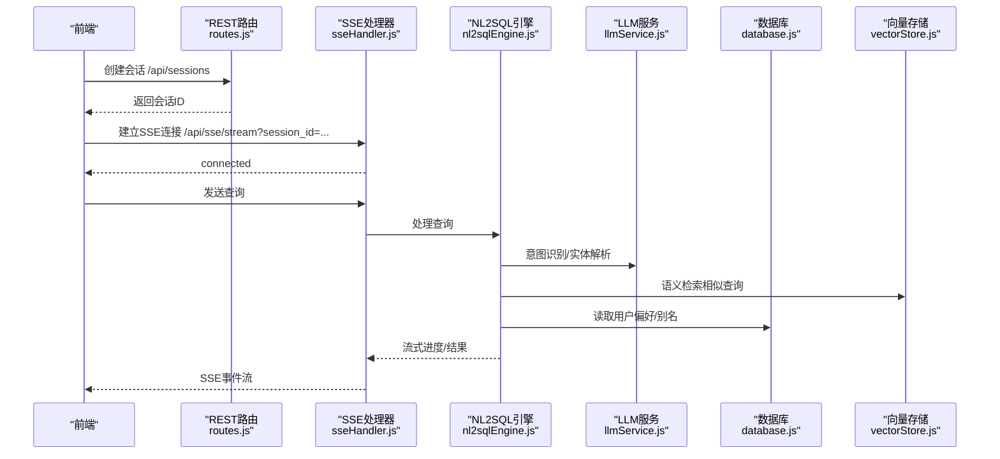
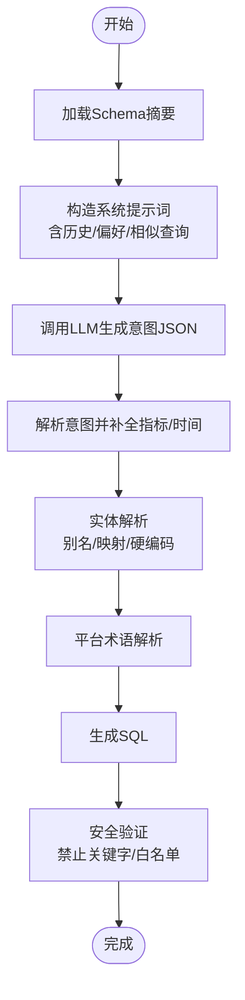
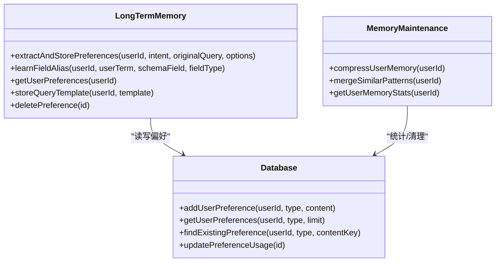
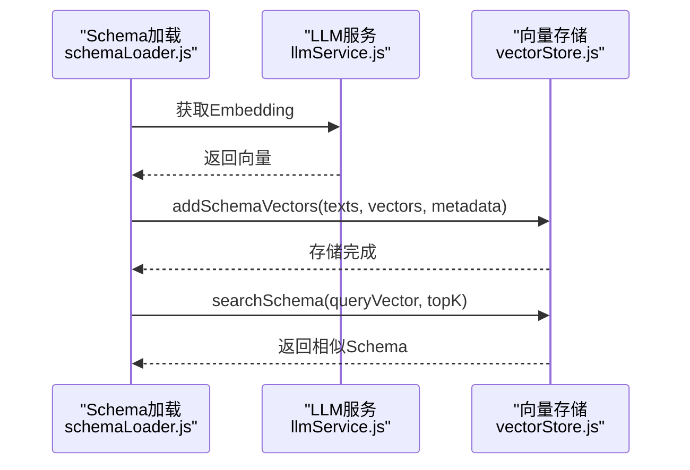
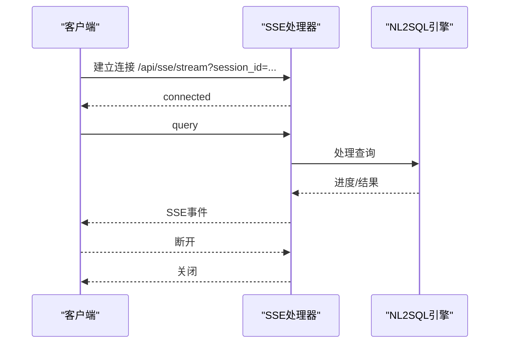
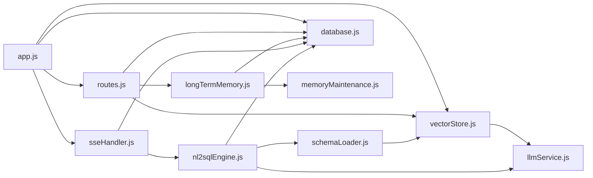

# 核心功能模块

<cite>
**本文引用的文件**
- [app.js](file://backend/src/app.js)
- [nl2sqlEngine.js](file://backend/src/core/nl2sqlEngine.js)
- [longTermMemory.js](file://backend/src/memory/longTermMemory.js)
- [vectorStore.js](file://backend/src/memory/vectorStore.js)
- [sseHandler.js](file://backend/src/core/sseHandler.js)
- [config.js](file://backend/src/core/config.js)
- [routes.js](file://backend/src/core/routes.js)
- [llmService.js](file://backend/src/core/llmService.js)
- [database.js](file://backend/src/core/database.js)
- [schemaLoader.js](file://backend/src/core/schemaLoader.js)
- [logger.js](file://backend/src/utils/logger.js)
- [memoryMaintenance.js](file://backend/src/memory/memoryMaintenance.js)
- [package.json](file://backend/package.json)
</cite>

## 目录
1. [简介](#简介)
2. [项目结构](#项目结构)
3. [核心组件](#核心组件)
4. [架构总览](#架构总览)
5. [详细组件分析](#详细组件分析)
6. [依赖关系分析](#依赖关系分析)
7. [性能考虑](#性能考虑)
8. [故障排查指南](#故障排查指南)
9. [结论](#结论)
10. [附录](#附录)

## 简介
本文件面向NL2SQL核心功能模块，系统性阐述以下能力：
- NL2SQL引擎：意图识别、实体解析、SQL生成与安全验证
- 用户记忆系统：长期记忆管理、偏好学习、别名管理与维护
- 向量检索系统：LanceDB集成、Schema语义搜索、查询历史向量化
- 实时通信机制：SSE事件处理与会话管理
- 配置选项、API接口与使用示例
- 模块协作关系与数据流
- 性能优化建议与最佳实践

## 项目结构
后端采用模块化分层设计：
- 核心层：配置、数据库、LLM服务、Schema加载、NL2SQL引擎、SSE处理
- 记忆层：长期记忆、向量存储、记忆维护
- 工具层：日志、路由、自修复调度
- 前端：Vue单页应用，通过REST API与SSE与后端交互

图表来源
- [app.js:1-238](file://backend/src/app.js#L1-L238)
- [routes.js:1-895](file://backend/src/core/routes.js#L1-L895)
- [nl2sqlEngine.js:1-800](file://backend/src/core/nl2sqlEngine.js#L1-L800)
- [longTermMemory.js:1-800](file://backend/src/memory/longTermMemory.js#L1-L800)
- [vectorStore.js:1-442](file://backend/src/memory/vectorStore.js#L1-L442)
- [sseHandler.js:1-349](file://backend/src/core/sseHandler.js#L1-L349)
- [config.js:1-332](file://backend/src/core/config.js#L1-L332)
- [database.js:1-850](file://backend/src/core/database.js#L1-L850)
- [schemaLoader.js:1-732](file://backend/src/core/schemaLoader.js#L1-L732)
- [llmService.js:1-432](file://backend/src/core/llmService.js#L1-L432)
- [memoryMaintenance.js:1-415](file://backend/src/memory/memoryMaintenance.js#L1-L415)
- [logger.js:1-318](file://backend/src/utils/logger.js#L1-L318)

章节来源
- [app.js:1-238](file://backend/src/app.js#L1-L238)
- [package.json:1-28](file://backend/package.json#L1-L28)

## 核心组件
- NL2SQL引擎：负责意图识别、实体解析、SQL生成与安全验证
- 用户记忆系统：长期记忆、偏好学习、别名管理与维护
- 向量检索系统：LanceDB向量存储、Schema语义搜索、查询历史向量化
- 实时通信：SSE事件流、会话管理
- 配置与路由：集中配置、REST API、健康检查
- 数据库与Schema：SQLite持久化、Schema元数据加载与校验

章节来源
- [nl2sqlEngine.js:1-800](file://backend/src/core/nl2sqlEngine.js#L1-L800)
- [longTermMemory.js:1-800](file://backend/src/memory/longTermMemory.js#L1-L800)
- [vectorStore.js:1-442](file://backend/src/memory/vectorStore.js#L1-L442)
- [sseHandler.js:1-349](file://backend/src/core/sseHandler.js#L1-L349)
- [config.js:1-332](file://backend/src/core/config.js#L1-L332)
- [routes.js:1-895](file://backend/src/core/routes.js#L1-L895)
- [database.js:1-850](file://backend/src/core/database.js#L1-L850)
- [schemaLoader.js:1-732](file://backend/src/core/schemaLoader.js#L1-L732)
- [llmService.js:1-432](file://backend/src/core/llmService.js#L1-L432)
- [memoryMaintenance.js:1-415](file://backend/src/memory/memoryMaintenance.js#L1-L415)
- [logger.js:1-318](file://backend/src/utils/logger.js#L1-L318)

## 架构总览
NL2SQL服务启动时初始化数据库、向量存储、Schema元数据，随后启动HTTP与SSE服务。前端通过REST API创建会话、获取Schema、查询历史与偏好，通过SSE订阅实时查询结果与进度。

图表来源
- [routes.js:254-396](file://backend/src/core/routes.js#L254-L396)
- [sseHandler.js:43-112](file://backend/src/core/sseHandler.js#L43-L112)
- [nl2sqlEngine.js:394-677](file://backend/src/core/nl2sqlEngine.js#L394-L677)
- [llmService.js:222-311](file://backend/src/core/llmService.js#L222-L311)
- [vectorStore.js:281-307](file://backend/src/memory/vectorStore.js#L281-L307)
- [database.js:458-540](file://backend/src/core/database.js#L458-L540)

## 详细组件分析

### NL2SQL引擎（意图识别、实体解析、SQL生成与安全验证）
- 意图识别：结合Schema摘要、对话历史、用户偏好与相似查询，构造系统提示词，调用LLM生成JSON格式意图（时间范围、维度、指标、筛选条件、排序、限制、置信度、上下文查询标记）。
- 实体解析：优先使用长期记忆中的字段别名与实体映射，其次回退到硬编码映射与数据库查询；支持游戏ID、渠道ID、平台术语（新/老平台）解析。
- SQL生成与安全验证：基于意图生成SQL，调用Schema验证器进行安全检查（禁止关键字、表白名单），支持dry-run模式仅返回SQL。
- 后处理：从查询中提取常见指标与时间范围，合并历史与当前意图，提升置信度。

图表来源
- [nl2sqlEngine.js:394-677](file://backend/src/core/nl2sqlEngine.js#L394-L677)
- [schemaLoader.js:569-606](file://backend/src/core/schemaLoader.js#L569-L606)

章节来源
- [nl2sqlEngine.js:1-800](file://backend/src/core/nl2sqlEngine.js#L1-L800)
- [schemaLoader.js:1-732](file://backend/src/core/schemaLoader.js#L1-L732)

### 用户记忆系统（长期记忆、偏好学习、别名管理与维护）
- 长期记忆：提取用户偏好（查询模式、字段别名、指标/维度偏好），按阈值筛选存储，支持LLM智能提炼与逻辑判断。
- 偏好学习：从上下文学习字段别名（如“青木是game_id=30”），支持双记录格式与直接映射；学习平台术语映射。
- 别名管理：统一存储与查询，支持按类型过滤与统计；提供手动学习接口。
- 记忆维护：分级保留策略（高频永久、中频90天、低频30天、字段别名365天）、相似模式合并、压缩清理。

图表来源
- [longTermMemory.js:311-484](file://backend/src/memory/longTermMemory.js#L311-L484)
- [memoryMaintenance.js:69-120](file://backend/src/memory/memoryMaintenance.js#L69-L120)
- [database.js:609-763](file://backend/src/core/database.js#L609-L763)

章节来源
- [longTermMemory.js:1-800](file://backend/src/memory/longTermMemory.js#L1-L800)
- [memoryMaintenance.js:1-415](file://backend/src/memory/memoryMaintenance.js#L1-L415)
- [database.js:1-850](file://backend/src/core/database.js#L1-L850)

### 向量检索系统（LanceDB集成、语义搜索、查询历史向量化）
- LanceDB集成：初始化schema_vectors与query_vectors表，支持添加/搜索向量，统计信息查询。
- Schema向量化：将表/字段描述向量化并存储，支持强制重新向量化与已有向量检测。
- 语义搜索：基于查询向量在schema_vectors/query_vectors中检索相似记录，支持按datasource优先与平台类型优先匹配。
- 查询历史向量化：将用户查询向量化存储，检索相似历史查询辅助意图识别。

图表来源
- [schemaLoader.js:195-290](file://backend/src/core/schemaLoader.js#L195-L290)
- [vectorStore.js:55-85](file://backend/src/memory/vectorStore.js#L55-L85)
- [vectorStore.js:160-191](file://backend/src/memory/vectorStore.js#L160-L191)
- [vectorStore.js:201-230](file://backend/src/memory/vectorStore.js#L201-L230)
- [llmService.js:324-379](file://backend/src/core/llmService.js#L324-L379)

章节来源
- [vectorStore.js:1-442](file://backend/src/memory/vectorStore.js#L1-L442)
- [schemaLoader.js:1-732](file://backend/src/core/schemaLoader.js#L1-L732)
- [llmService.js:1-432](file://backend/src/core/llmService.js#L1-L432)

### 实时通信机制（SSE事件处理与会话管理）
- 连接管理：维护sessionId到连接列表的映射，支持多标签页；记录连接/活跃时间；错误与关闭处理。
- 查询处理：广播processing/progress/result/error事件；串行处理同一会话的请求。
- 会话管理：通过REST API创建/获取/删除会话与消息历史；SSE连接需有效会话ID。

图表来源
- [sseHandler.js:43-112](file://backend/src/core/sseHandler.js#L43-L112)
- [sseHandler.js:218-280](file://backend/src/core/sseHandler.js#L218-L280)
- [routes.js:254-396](file://backend/src/core/routes.js#L254-L396)

章节来源
- [sseHandler.js:1-349](file://backend/src/core/sseHandler.js#L1-L349)
- [routes.js:1-895](file://backend/src/core/routes.js#L1-L895)

### 配置与API接口
- 配置中心：统一管理端口、LLM/Embedding、数据库、向量库、安全、会话、日志、自修复、Schema、长期记忆等配置，支持环境变量覆盖与校验。
- REST API：
  - 健康检查：/api/health、/api/health/detail
  - Schema：/api/schema、/api/schema/tables/:tableName、/api/schema/search
  - 会话：/api/sessions、/api/sessions/:sessionId、/api/sessions/:sessionId/messages、/api/users/:userId/sessions
  - 查询历史：/api/queries/history
  - 用户偏好：/api/preferences/:userId/raw、/api/preferences/:userId/stats、/api/preferences/:userId、/api/preferences/:userId/templates、/api/preferences/:preferenceId、/api/preferences/:userId/learn-alias
  - 统计：/api/stats
  - 配置：/api/config

章节来源
- [config.js:1-332](file://backend/src/core/config.js#L1-L332)
- [routes.js:1-895](file://backend/src/core/routes.js#L1-L895)

### 数据库与Schema
- SQLite：sessions/messages/query_history/user_preferences/system_logs表，外键约束，索引优化，事务支持。
- Schema加载：从JSON配置文件加载表/字段/关系/指标/维度，构建映射，缓存与校验，向量化存储，语义搜索与关键词匹配，SQL安全验证。

章节来源
- [database.js:1-850](file://backend/src/core/database.js#L1-L850)
- [schemaLoader.js:1-732](file://backend/src/core/schemaLoader.js#L1-L732)

## 依赖关系分析
- 模块耦合：NL2SQL引擎依赖LLM服务、Schema加载、数据库；SSE处理器依赖NL2SQL引擎与数据库；长期记忆依赖数据库与记忆维护；向量存储依赖LLM服务与配置。
- 外部依赖：Express、LanceDB(vectordb)、sqlite3、dotenv、cors、body-parser、uuid、dayjs、node-cron。
- 配置驱动：所有行为由config.js集中控制，便于部署与运维。

图表来源
- [nl2sqlEngine.js:1-800](file://backend/src/core/nl2sqlEngine.js#L1-L800)
- [sseHandler.js:1-349](file://backend/src/core/sseHandler.js#L1-L349)
- [longTermMemory.js:1-800](file://backend/src/memory/longTermMemory.js#L1-L800)
- [memoryMaintenance.js:1-415](file://backend/src/memory/memoryMaintenance.js#L1-L415)
- [vectorStore.js:1-442](file://backend/src/memory/vectorStore.js#L1-L442)
- [schemaLoader.js:1-732](file://backend/src/core/schemaLoader.js#L1-L732)
- [llmService.js:1-432](file://backend/src/core/llmService.js#L1-L432)
- [database.js:1-850](file://backend/src/core/database.js#L1-L850)
- [routes.js:1-895](file://backend/src/core/routes.js#L1-L895)
- [app.js:1-238](file://backend/src/app.js#L1-L238)

## 性能考虑
- 向量化批处理：Embedding分批获取，避免单次请求过大；Schema向量化支持强制重新向量化与跳过已有向量。
- 缓存与索引：Schema缓存与索引优化；SQLite索引覆盖常用查询字段；向量表limit限制返回数量。
- 超时与重试：LLM与Embedding请求超时配置，带重试机制；SSE连接串行处理，避免并发阻塞。
- 安全与限流：白名单表访问、禁止关键字、最大返回行数、查询超时；日志轮转与级别控制。
- 最佳实践：生产环境配置白名单与安全阈值；合理设置向量维度与topK；定期清理低频偏好与压缩内存。

[本节为通用指导，无需引用具体文件]

## 故障排查指南
- 启动失败：检查配置校验（LLM API密钥、SR数据库URL），查看日志文件与级别。
- SSE连接失败：确认会话ID存在，检查连接映射与关闭/错误回调。
- LLM/Embedding失败：检查API Base/Key、超时设置、网络连通性；查看重试日志。
- 向量存储失败：确认LanceDB路径权限与磁盘空间；检查初始化状态与表存在性。
- SQL安全拦截：检查禁止关键字与表白名单配置；核对SQL生成逻辑。
- 长期记忆异常：检查偏好类型与阈值配置；查看记忆维护日志。

章节来源
- [config.js:300-332](file://backend/src/core/config.js#L300-L332)
- [logger.js:283-293](file://backend/src/utils/logger.js#L283-L293)
- [sseHandler.js:119-153](file://backend/src/core/sseHandler.js#L119-L153)
- [llmService.js:136-151](file://backend/src/core/llmService.js#L136-L151)
- [vectorStore.js:80-84](file://backend/src/memory/vectorStore.js#L80-L84)
- [schemaLoader.js:569-606](file://backend/src/core/schemaLoader.js#L569-L606)
- [longTermMemory.js:311-352](file://backend/src/memory/longTermMemory.js#L311-L352)

## 结论
NL2SQL通过意图识别、实体解析、SQL生成与安全验证的闭环，结合长期记忆与向量检索，实现了智能化的自然语言到SQL转换。SSE实时通信与完善的配置管理保证了良好的用户体验与运维可控性。建议在生产环境中严格配置安全与性能参数，并定期维护长期记忆与向量数据。

[本节为总结，无需引用具体文件]

## 附录

### 配置选项清单（节选）
- 服务器与环境：port、nodeEnv、isDevelopment/isProduction
- LLM/Embedding：apiBase、apiKey、model、timeout、maxRetries、retryDelay、embedding.model/dimension/timeout
- 数据库：SQLite路径、SR数据库URL与连接池、向量库路径
- 安全：allowedTables白名单、dryRun、maxQueryRows、queryTimeout、forbiddenKeywords、sensitiveFields
- 会话：maxHistory、expireTime、cleanupInterval
- 日志：level、file、console/fileOutput、maxSize/maxFiles
- 自修复：enabled、dailyCheckCron、sessionCheckInterval、slowQueryThreshold
- Schema：configPath、enableCache、cacheExpireTime、revectorize
- 长期记忆：enabled、useLLMForExtraction、thresholds、retention

章节来源
- [config.js:16-332](file://backend/src/core/config.js#L16-L332)

### API接口速览（节选）
- 健康检查：GET /api/health、GET /api/health/detail
- Schema：GET /api/schema、GET /api/schema/tables/:tableName、GET /api/schema/search
- 会话：POST /api/sessions、GET /api/sessions/:sessionId、DELETE /api/sessions/:sessionId、GET /api/sessions/:sessionId/messages、GET /api/users/:userId/sessions
- 查询历史：GET /api/queries/history
- 用户偏好：GET /api/preferences/:userId/raw、GET /api/preferences/:userId/stats、GET /api/preferences/:userId、POST /api/preferences/:userId/templates、DELETE /api/preferences/:preferenceId、POST /api/preferences/:userId/learn-alias
- 统计：GET /api/stats
- 配置：GET /api/config

章节来源
- [routes.js:58-895](file://backend/src/core/routes.js#L58-L895)